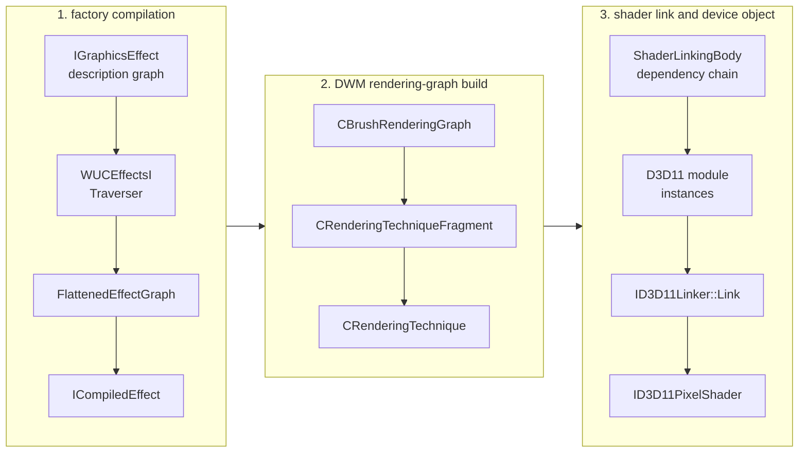
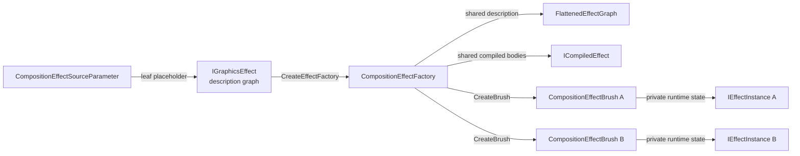
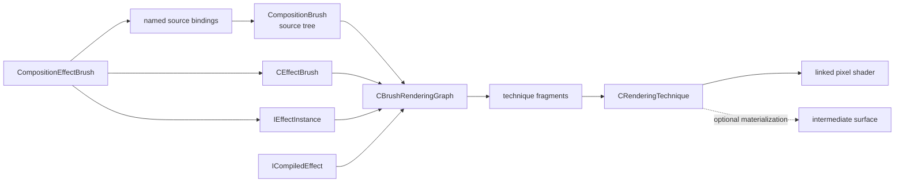
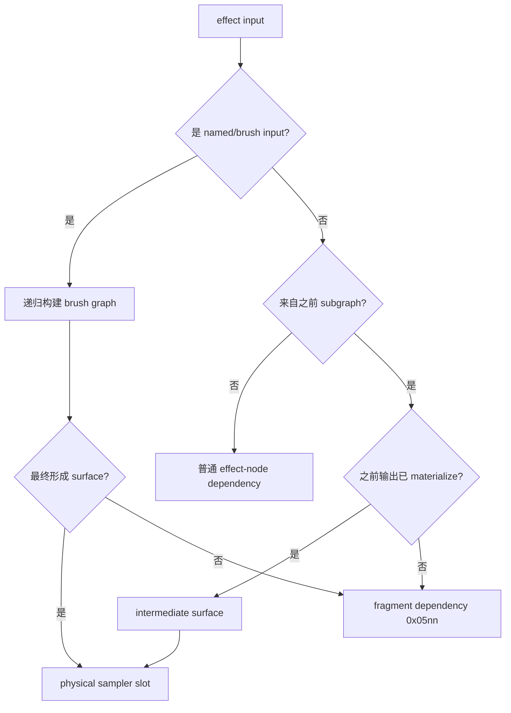

# WinUI 3 Lifted Compositor 的 Composition Effect 与 Shader Linking 内部路径

本文从 **Windows App SDK Lifted Compositor** 内部视角，解释 WinUI 3 composition effect 是怎样从一棵 `IGraphicsEffect` 图，变成 lifted rendering graph，再通过 D3D11 shader linking 生成最终 pixel shader 的。

> [!WARNING]
>
> 本文描述的是逆向得到的私有实现，不是公开 API 契约。结构偏移、虚表槽、RVA、参数编码和限制都可能随 Windows App SDK 或系统版本变化。

> [!IMPORTANT]
>
> 本文中的 `DWM` 或“DWM 路径”，除非明确写出“系统 DWM”，都专指 **WinUI 3 / Windows App SDK Lifted Compositor 中的 `dwmcorei.dll` 路径**。它不是桌面会话的系统 `dwm.exe`，也不能与 `%SystemRoot%\System32` 中由操作系统维护的系统 DWM 组件等同。

## 阅读边界与整体模型

### Lifted Compositor 与系统 DWM 的边界

WinUI 3 使用的 Lifted Compositor 把一部分原本属于 Windows composition 实现的组件以 Windows App SDK 版本化形式带到应用侧。这条栈中可以看到：

- `dcompi.dll`
- `wuceffectsi.dll`
- `dwmcorei.dll`

本文逆向的 effect compiler、brush rendering graph 和 shader linker 都位于这条 **lifted composition stack** 中。

它与系统 DWM 的关系应这样理解：

| Lifted Compositor | 系统 DWM |
|---|---|
| 随 Windows App SDK 版本化 | 随 Windows 操作系统版本化 |
| 服务于 WinUI 3 / lifted composition 对象 | 负责桌面会话、窗口和最终屏幕合成 |
| 本文分析 `wuceffectsi.dll`、`dwmcorei.dll` | 典型进程/组件是系统 `dwm.exe`、系统 DWM binaries |
| effect graph、brush graph 和 shader linking 行为可随 WinAppSDK 更新 | 内部实现随 OS build 更新 |
| 本文的地址、限制和 ABI 只适用于目标 lifted binaries | 不能据此推断系统 DWM 使用相同地址、对象布局或限制 |

Lifted Compositor 生成的内容最终仍会进入更大的 Windows composition / display pipeline，但本文的研究边界停在 lifted effect/rendering path。本文不会把 `dwmcorei.dll` 的结论外推为桌面系统 DWM 的内部机制。

### 分析版本

本文针对 WinAppSDK v2.2.0 x64 中的以下组件：

- `wuceffectsi.dll`
  - SHA-2 digest：`dbea457ac1c6d5c4cde5b9cfb09e65cd54b11596406ce50565ddd946468b1454`
- `dwmcorei.dll`
  - SHA-2 digest：`06799367a4fcbd21832c91560720b7d131016abbaed4a1e64349df1e531e5d3c`
- `Microsoft.ui.xaml.dll`
  - SHA-2 digest：`2b22eb6130821f43a26239d441ef3a898bea24b1c1078b5941249431c4b4fbf8`

### 端到端模型

composition effect 不是“app 交给 DWM 一段完整 pixel shader”。

app 交给 Lifted Compositor 的是 effect description。WUCEffectsI 把 description 变成 flattened subgraphs；DWM 把 subgraphs 变成 rendering fragments 和 techniques；最后 DWM 使用 D3D11 shader linker，把多个 library function 连接成最终 pixel shader。



一张输入纹理能否被 shader 访问，至少取决于四件事：

1. 它在 effect graph 中是什么类型的输入。
2. 它是否在 technique 边界被 materialize 成 surface。
3. DWM 是否给它分配了 physical sampler slot。
4. shader body 的 linking arguments 和 module resource binding 是否引用了这个 slot。

### effect、graph、subgraph、brush 与 technique 的关系

这些名词不在同一抽象层。“effect graph”“brush graph”和“rendering graph”不能都简写成 graph，subgraph 也不是 technique 的子对象。共享 factory 数据和 brush instances 的关系如下：



多个 brushes 共享 factory 的 `FlattenedEffectGraph`/`ICompiledEffect`，但分别拥有 `IEffectInstance`，保存 animated-property values、surface transforms 和 constant-buffer bytes。

再单独看其中一个 brush instance 怎样进入 DWM rendering path：



#### “graph”在本文中有四个不同作用域

```text
effect description graph
  public IGraphicsEffect/IGraphicsEffectSource objects；app 构造。

FlattenedEffectGraph
  WUCEffectsI compiler IR；factory scoped。

CBrushRenderingGraph
  DWM 对实际 brush tree 的普通执行图；render/realization scoped。

CExternalEffectGraph
  blur 等 specialized implementation 自己构造的 pass/callback graph；
  最终仍调用普通 techniques 执行。
```

“graph 中有一个节点”并不充分；必须先说明是 public effect node、flattened `EffectNode`、brush rendering graph slot，还是 external blur graph technique/callback node。

#### 第一层：effect 是 description，不是 draw pass

`IGraphicsEffect` 描述一个逻辑运算，例如 blur、color matrix 或 custom effect。一个 effect 对象包含：

- effect GUID/type
- factory-time property values
- 零个或多个 `IGraphicsEffectSource` inputs
- 可选的 effect name，供 animated-property path 引用

当一个 effect 的 source 指向另一个 effect 时，它们形成 app-facing **effect description graph**：

```text
ColorMatrixEffect ──> GaussianBlurEffect ──> CompositeEffect
       ^
       |
CompositionEffectSourceParameter("Input")
```

这里的箭头只是数据依赖：“右侧 effect 读取左侧 effect 的结果”。它还没有决定 shader 是否内联、是否分 pass、是否需要纹理，也没有 technique。

#### 第二层：source parameter 是 graph 的洞，brush 是运行时填入的 producer

`CompositionEffectSourceParameter` 也是一种 `IGraphicsEffectSource`，但它不执行图像处理。它在 factory graph 中留下一个有名字的外部输入槽：

```cpp
// public-facing 伪代码；变量名为本文示例名称。
CompositionEffectSourceParameter input{ L"Input" };
GaussianBlurEffect description;
description.Source(input);

CompositionEffectFactory factory =
    compositor.CreateEffectFactory(description);

CompositionEffectBrush brush = factory.CreateBrush();
brush.SetSourceParameter(L"Input", actualBrush);
```

`CompositionBrush` 是 composition tree 中的运行时内容 producer。它可以是 surface brush、backdrop brush、color/gradient brush，或另一个 `CompositionEffectBrush`。因此有两种完全不同的连接：

```text
factory 内部：effect -> effect
  连接 description nodes；不需要中间 brush。

brush instance：named source parameter -> CompositionBrush
  把 graph 的外部叶子绑定到实际内容 producer。
```

如果 `actualBrush` 本身又是一个 `CompositionEffectBrush`，两个 factory graph 不会在公共 API 层合并成同一个 `FlattenedEffectGraph`。它们仍是两个 factory、两份 compiled description；DWM 在递归解析 brush tree 时才把两边放入同一个运行时 `CBrushRenderingGraph`，随后决定能否作为 fragments 放进同一 technique，还是需要 intermediate。

#### 第三层：factory 是共享的 compiled template，effect brush 是实例

`CompositionEffectFactory` 固化的是 effect graph 的结构：nodes、静态 properties、animatable-property descriptors、subgraph partition 和 compiled shader bodies。它可以创建多个 brushes：

```text
CompositionEffectFactory
  shared:
    FlattenedEffectGraph
    ICompiledEffect
    compiled subgraph library bodies

  CreateBrush() -> CompositionEffectBrush A
                    EffectInstance A
                    source bindings A
                    animated values A

  CreateBrush() -> CompositionEffectBrush B
                    EffectInstance B
                    source bindings B
                    animated values B
```

factory 类似不可变 program/template，effect brush 类似 program instance。brush 不重新定义 effect nodes，但它决定：

- 每个 named input 实际绑定哪个 `CompositionBrush`
- 当前 animated properties 的值
- 当前 transform/bounds/blur instance state
- 当前 instance constant-buffer bytes 和 change stamps

#### 第四层：FlattenedEffectGraph 是 compiler IR

WUCEffectsI traversal 把任意嵌套的 public effect objects 转成索引化的 `FlattenedEffectGraph`。它主要拥有：

```cpp
struct FlattenedEffectGraph;
struct IEffectDescriptionWithNamesVtable;

struct FlattenedEffectGraphRefCountVtable
{
    /* +0x00 */ uint32_t (*AddRef)(FlattenedEffectGraph* self);
    /* +0x08 */ uint32_t (*Release)(FlattenedEffectGraph* self);
    /* +0x10 */ FlattenedEffectGraph* (*scalarDeletingDestructor)(
        FlattenedEffectGraph* self,
        uint32_t deleteFlags);
    /* +0x18 */ void (*FinalRelease)(FlattenedEffectGraph* self);
};

struct FlattenedEffectGraph // 字段名按本文前后定义
{
    /* +0x00 */ FlattenedEffectGraphRefCountVtable* refCountVtable;
    /* +0x08 */ volatile uint32_t refCount;
    /* +0x0C */ uint32_t alignmentPadding_0x0C;
    /* +0x10 */ IEffectDescriptionWithNamesVtable* descriptionVtable;
    /* +0x18 */ std::vector<std::unique_ptr<EffectSubgraph>> subgraphs;
    /* +0x30 */ std::vector<std::unique_ptr<EffectNode>> nodes;
    /* +0x48 */ std::vector<AnimatableProperty> animatableProperties;
    /* +0x60 */ std::vector<NamedInput> namedInputs;
    /* +0x78 */ bool hasExternalImplementation;
};
```

constructor `@ 0x18000FD00` 分别把 primary ref-count vtable `0x180045190` 写入 `+0x00`，把 `FlattenedEffectGraph::{for IEffectDescriptionWithNames}` vtable `0x1800450F8` 写入 secondary subobject `+0x10`。`EffectInstance::GetDescriptionNoRef @ 0x18001B360` 返回的正是 `graph +0x10`，不是 primary object pointer。

因此 `IEffectDescriptionWithNames::AddRef/Release` 的 adjustor thunks 必须先执行 `this -= 0x10`，再进入 primary ref-count implementation。DWM 可以只持有 secondary interface pointer，而 `EffectInstance` 内部仍保存 owning `FlattenedEffectGraph*`；这两个地址不可在结构图里画成同一个未调整 pointer。

它叫 flattened，是因为 public graph 中的 COM object pointers 和嵌套 source properties 已被转换为稳定的 node/subgraph/named-input indices。它仍是 factory description 的编译结果，不是某一帧实际要画的 surface DAG。

#### 第五层：EffectNode 是一个逻辑 effect occurrence

`EffectNode` 对应 graph 中的一次 effect 使用。即使两个 nodes 使用相同 GUID，它们仍可以有不同 properties 和 inputs：

```text
Node 3: GaussianBlur, BlurAmount = 8
Node 7: GaussianBlur, BlurAmount = 24
```

node 保存 effect type、source count、input mappings、native property struct 和 per-property animation mask。node 的 input 最终引用：

- null
- named input index
- 另一个 node index
- 另一个 subgraph index

node 不是 brush，也不是 technique；它只属于 factory graph。

#### 第六层：EffectSubgraph 是 WUCEffectsI 的 partition

`EffectSubgraph` 把一组 `EffectNode` 划到同一个编译单元/输出边界。普通逐像素 effect chain 可以全部位于一个 subgraph：

```text
EffectSubgraph 0
  nodes = [ColorMatrix, Saturation, Composite]
  compiled result = one CompiledEffectSubgraph / PSBody
```

需要真实 surface 的采样边界会推动 partition：

```text
EffectSubgraph 0
  nodes = [upstream effects, flatten wrapper]
  output = reusable/materializable result

EffectSubgraph 1
  nodes = [custom sampler/downstream effect]
  input = subgraph 0 output
```

effect graph 与 subgraph 的数量关系：

```text
one effect graph  -> many EffectNodes
many EffectNodes  -> one or more EffectSubgraphs
one EffectSubgraph -> one CompiledEffectSubgraph description
```

这不是“一 effect 一 subgraph”。subgraph 也还不是实际 pass；它只是允许 DWM 把该输出内联、alias 或 materialize 的编译边界。

#### 第七层：CBrushRenderingGraph 是实际 brush tree 的执行图

DWM 取得某个 `CEffectBrush` 后，会递归解析它绑定的 source brushes，并把 compiled effect inputs、现有 surfaces、backdrop/BVI sources、nested effect brushes 和 intermediate dependencies 组织进 `CBrushRenderingGraph`。

这时 graph 才与一次实际 brush realization/render context 相关。它处理的是：

- 当前 source brush 最终解析出哪张 bitmap/surface
- transform、content rect、edge mode 和 color conversion
- 哪个 upstream output 已经 materialize
- 哪些 bodies 可以直接形成 fragment dependency
- 需要创建哪些 techniques 和 intermediate output slots

`FlattenedEffectGraph` 和 `CBrushRenderingGraph` 的区别：

```text
FlattenedEffectGraph
  “factory program 是什么”
  nodes、property ABI、logical input indices、compiled subgraphs

CBrushRenderingGraph
  “这个 brush instance 这次怎样画”
  actual brushes/surfaces、fragments、techniques、intermediates
```

#### 第八层：fragment 是 linkable body，technique 是一次 link/draw 边界

`CRenderingTechniqueFragment` 包装一个可连接的 shader body 及其 instance state，包括：

- `ShaderLinkingBody`
- logical arguments 到 technique-local arguments 的映射
- `IEffectInstance*` 和 subgraph index
- constant-buffer region/change stamp
- subgraph flags

一个 `CRenderingTechnique` 可以包含一个或多个 fragments。它收集这些 fragments 所需的 physical surfaces、sampler metadata、constant-buffer regions 和 shader-linking configuration，然后执行一轮 `ID3D11Linker::Link`：

```text
fragment dependency chain
  Fragment A
  Fragment B
  Fragment C
       |
       v
one CRenderingTechnique
  one physical-surface collection
  one ShaderLinkingConfig
  one linked pixel shader
  one draw/pass when executed
```

technique 是当前普通 rendering path 中最接近“pass”的对象。多个 effect nodes 可以先编译进同一个 subgraph body；多个 subgraph/brush bodies 又可以作为 fragments 连接进同一个 technique。一个必须 multi-pass 的逻辑 effect（例如较大的 blur）也可能展开为多个 techniques。

#### intermediate surface 是 technique 边界的运行时结果

当 producer 无法作为 dependency body 与 consumer 一起 link 时，producer technique 先渲染到 off-screen target，consumer technique 再把它作为 physical surface 输入：

```text
Technique 0
  linked shader A
  draw -> intermediate surface

Technique 1
  bind intermediate as Texture2D/SRV
  linked shader B
  draw -> final target
```

但是存在 subgraph/technique bookkeeping 不等于一定分配新纹理。no-op alias 可以让新的 output slot 继续引用同一 bitmap realization；lazy intermediate 也只在消费者真正请求时才执行 producer。

#### 最终数量和 ownership 关系

```text
one CreateEffectFactory call
  -> one factory-scoped FlattenedEffectGraph / ICompiledEffect
  -> many EffectNodes
  -> 1..N EffectSubgraphs

one CompositionEffectFactory
  -> many CompositionEffectBrush instances

one CompositionEffectBrush
  -> its own source-parameter bindings
  -> its own IEffectInstance runtime values
  -> references shared factory compiled data

one render-time brush tree
  -> one CBrushRenderingGraph build/context
  -> many CRenderingTechniqueFragments
  -> one or more CRenderingTechniques

one CRenderingTechnique
  -> one LinkShader configuration/result
  -> one draw/pass when executed
  -> zero or one output realization for that graph slot
```

最重要的非一一对应关系是：

```text
effect       != brush
EffectNode   != EffectSubgraph
EffectSubgraph != CRenderingTechnique
subgraph boundary != guaranteed intermediate texture
factory graph != render-time brush graph
```

### 组件边界

#### WinUI / Composition 公共层

公共层负责描述 effect graph：

- effect GUID 和属性
- source 数量
- source 名称
- source 之间的嵌套关系
- `CompositionEffectBrush::SetSourceParameter` 绑定

这一层描述“图是什么”，但不直接描述最终 shader 的 SRV、sampler state 或寄存器绑定。

#### WUCEffectsI

Windows App SDK Lifted Compositor 中的 `wuceffectsi.dll` 负责 effect compiler 的前半段：

- 识别 `EffectType`
- 遍历 `IGraphicsEffect`
- 验证 source 类型和数量
- 识别 named inputs
- 插入 source-flattening wrapper
- 生成 `FlattenedEffectGraph`
- 把 factory animatable-property paths 编译成 cbuffer fields 和 updater records
- 正常情况下生成 native `CompiledEffect`

可以把 WUCEffectsI 看成“effect graph compiler”。

#### DWM

Windows App SDK Lifted Compositor 中的 `dwmcorei.dll` 负责渲染侧：

- 把 `ICompiledEffect` 变成 brush rendering graph
- 决定 subgraph 是内联为 fragment，还是单独 materialize
- 收集 physical surfaces
- 建立 sampler configuration
- 根据 `IEffectInstance` change stamp 上传 per-instance constant buffer
- 加载 shader library module
- 连接 dependency bodies 和 main body
- 创建、缓存最终 linked shader

可以把这里的 DWM 看成“rendering graph compiler + shader linker runtime”。它的类名大量沿用 Windows DWM 内部命名，但这不意味着这些对象就是系统 `dwm.exe` 中同一实例。

#### D3D11 Shader Linking API

DWM 使用的不是常规 `D3DCompile(entryPoint, ps_4_0)` 路径，而是：

- `D3DLoadModule`
- `ID3D11Module::CreateInstance`
- `ID3D11ModuleInstance` resource binding
- `ID3D11LinkingNode`
- `ID3D11Linker::Link`

每个 effect body 是 shader library 中的 exported function。最终 pixel shader 由 DWM 在运行时连接。

### 核心对象词典

| 概念 | 所属层 | 作用 |
|---|---|---|
| `IGraphicsEffect` | 公共层 | app 提交的 effect description |
| `CompositionEffectSourceParameter` | 公共层 | factory graph 中的 named external-input placeholder |
| `CompositionEffectFactory` | 公共层 | 共享 compiled effect program/template，可创建多个 brushes |
| `CompositionBrush` | 公共层 | composition tree 中的运行时内容 producer |
| `CompositionEffectBrush` | 公共层 | factory 的运行时实例，保存 source bindings 和动态属性 |
| `EffectType` | WUCEffectsI | GUID 对应的内部 effect 元数据与行为虚表 |
| `EffectOpacityRelation` | WUCEffectsI | 从最终 output 反向标记哪些 named inputs 影响 opaque proof |
| `EffectNode` | WUCEffectsI | flattened graph 中的一个 effect 实例 |
| named input | WUCEffectsI | 由 `SetSourceParameter` 在 brush 实例阶段绑定的图输入 |
| `EffectSubgraph` | WUCEffectsI | 一组可以一起编译或作为一个输出边界处理的 nodes |
| `FlattenedEffectGraph` | WUCEffectsI | traversal 后的 nodes、subgraphs、named inputs 和属性集合 |
| `ICompiledEffect` | WUCEffectsI → DWM | DWM 消费的 compiled-subgraph 接口 |
| `IEffectInstance` | WUCEffectsI → DWM | 每个 brush instance 的属性状态、constant-buffer bytes 和 change stamps |
| `AnimatableProperty` | WUCEffectsI | `EffectName.PropertyName` 到 node/property/mapping/expression type 的绑定 |
| `ConstantBufferUpdater` | WUCEffectsI | 把某个 node 的 native property struct 写入 subgraph constant buffer |
| bounds contract | WUCEffectsI | 在 CPU 上正向计算输出范围，并从可见输出反推实际需要的输入范围 |
| `CEffectBrush` | DWM | effect brush 的渲染侧资源对象 |
| `CPropertySet` | DWM | animated property 的 channel resource，并回调 `CEffectBrush` 更新 `IEffectInstance` |
| `NodeEffects` | DWM | 当前 visual 的 local clip、opacity、filter/tree effect、resample 与 color-space 状态 |
| `ContentBackdropFlags` | DWM | brush tree 的 backdrop capability OR 摘要；区分普通、window、blurred-wallpaper 和 backdrop+blur |
| `CBrushRenderingGraph` | DWM | brush、surface、intermediate 和 fragment 的渲染图 |
| `CRenderingTechniqueFragment` | DWM | 可被 shader linker 连接的一个渲染片段 |
| `CRenderingTechnique` | DWM | 一次实际渲染 pass 和一轮 shader link 的边界 |
| `ShaderLinkingBody` | DWM | 一个 library function、参数语义、bytecode 和 profile 的描述 |
| `ShaderLinkingConfig` | DWM | surface、sampler、edge mode、颜色处理等 link 配置 |
| `CLinkedShader` | DWM | linked pixel bytecode、vertex-shader table key 与 per-device pixel-shader resources |
| `CBlurRenderingGraph` | DWM | Gaussian blur 的 prescale、axis passes、callbacks 和 technique topology |
| `CCachedVisualImage` | DWM | visual-backed bitmap resource；保存 root/source geometry、notifier state 和 per-`RenderTargetInfo` realizations |
| `CVisualSurface::SourceCVI` | DWM | visual surface 的一份 integer-realization-size CVI 与 last-used composition-generation stamp |
| `CBackdropVisualImage` | DWM | 某个 visual/path 的 backdrop capture producer，并按 target domain 保存 realizations |
| `CCachedVisualImage::CCachedTarget` | DWM | 一份 target-domain realization，保存 QPC/generation stamps 与 dirty state |
| `CBlurredBackdropCache` | DWM | 以 BVI/target realization 为依赖保存已经完成的 blurred `EffectInput` |
| `CWindowBackgroundTreatment` | DWM | 在 BVI 之上选择真实 backdrop 或 transparent-black fallback，并由独立 bitmap producer 缓存 treatment 输出 |
| `CWindowBackgroundBitmapProducer` | DWM | window-background treatment 的 `CCachedImageProducer`，按 target domain 缓存 off-screen output |
| `CCachedWindowBackgroundTreatment` | DWM | descendant consumer 保存的 treatment transformed view；缓存 producer identity、空间映射和 source rect，不是另一张 texture |
| `CDropShadow` | DWM | 单 visual/content mask 的显式 offset/blur/color shadow |
| `CProjectedShadowScene` | DWM | light、casters、receivers 与投影绘制顺序的 scene-level shadow 系统 |
| `CShadowMaskProducer` | DWM | 把 brush + geometry/bounds clip rasterize 为可缓存 alpha mask realization |

## 结构布局与内部容器

带偏移的伪代码遵循以下布局记法；相关 DWM common Util 容器会直接影响对象尺寸、inline capacity 和 ownership。

### 结构布局记法

结构定义使用当前 x64 build 的真实类型名和字段偏移：

```cpp
// +0xNN 表示字段相对对象起点的偏移。
// 若当前符号没有保留成员拼写，本文仍按读写行为给出可读的重建名称；
// 这种名称会在结构或上下文中明确标注为“本文重建名称”，不冒充原始符号。
// 只有确认不承载状态的对齐/未使用字节才写成 padding。
// 符号明确写 std::vector<T> 时，本文直接使用 std::vector<T>；
// 在这个 x64 build 中它大小为 0x18，依次保存 begin、end、capacity。
static_assert(sizeof(std::vector<void*>) == 0x18);
```

这些布局与文首指定版本对应。

### `::detail::vector_facade`：DWM common Util 的容器框架

`::detail::vector_facade<T, Buffer>` 不是 Gaussian blur 或 `dwmcorei` 单独实现的临时容器。当前 build 的符号文件把其公共实现模块列为：

```text
d:\os\obj\amd64fre\onecoreuap\windows\dwm\common\util\utillib\
  native-static-crt\objfre\amd64\containerhelpers.obj

linked library:
d:\os\obj\amd64fre\onecoreuap\windows\DWM\common\Util\UtilLib\
  native-static-crt\objfre\amd64\Util.lib
```

它属于 DWM common Util 的内部 container helpers 框架。模板实例不只出现在 blur：DWM engine、rendering、resources、occlusion、draw-list、animation、visual-tree path 等代码都使用同一套 `vector_facade / buffer_impl / pointer_buffer_impl`。

它也不是当前 Windows SDK、Visual Studio STL/ATL、WIL 或 NuGet 公开头文件提供的容器；这些本机公开 headers 和公开源码中没有对应定义。`Util.lib` 是 Windows/DWM 源码树内的共享静态工具库，应用代码不能把这个类型当成可引用的公共 ABI。

最外层的 `detail` 本身就是该框架使用的 namespace。当前符号没有显示 `Dwm::detail`、`Microsoft::detail` 或其它父 namespace，因此完整限定名以全局作用域 `::detail` 开始。它不是 `std::vector<T>` 的别名，也不是为了表示未知容器而创造的名字。符号中会完整出现：

```cpp
::detail::vector_facade<
    T,
    ::detail::buffer_impl<T, InlineCount, 1,
                          ::detail::liberal_expansion_policy>>

::detail::vector_facade<
    T*,
    ::detail::pointer_buffer_impl<T*>>
```

MSVC decorated name 中的结尾形状也直接支持这一点：

```text
...@?$vector_facade@...@detail@@...
...@?$buffer_impl@...@detail@@...
```

`@detail@@` 表示类型位于全局 `detail` namespace；如果存在外层 namespace，decorated name 中还会继续出现对应的 namespace components。

`vector_facade` 提供 vector-like 的元素移动、插入、删除、析构和 iterator 操作；第二个模板参数决定 begin/end/capacity 如何保存、是否有 inline storage、以及何时转入 heap。它相当于：

```cpp
template<typename T, typename Buffer>
class vector_facade : private Buffer
{
public:
    iterator begin();
    iterator end();

    // 在 index 处插入一段未构造的 storage，当前调用点通常插入 1 项。
    // 必要时扩容并 move 现有元素，返回新区域地址供 detail::construct 使用。
    T* reserve_region(size_t index, size_t count = 1);

    void clear_region(size_t index, size_t count);
    iterator erase(iterator position);
};
```

常见插入代码分两步：

```cpp
T* slot = values.reserve_region(values.size());
detail::construct<T, T>(slot, std::move(value));
```

这也是 graph builder 添加 `std::function` callback 时看到 `reserve_region` 和 `detail::construct` 连续出现的原因。

#### `buffer_impl`：带 inline capacity 的 small vector

`buffer_impl<T, N, 1, liberal_expansion_policy>` 的前三个字段仍是三个指针，但 capacity 为空时指向对象自身尾部的 inline array：

```cpp
template<typename T, size_t InlineCount>
struct buffer_impl_shape
{
    /* +0x00 */ T* begin;
    /* +0x08 */ T* end;
    /* +0x10 */ T* capacityEnd;
    alignas(T) std::byte inlineData[  // +0x18
        InlineCount * sizeof(T)];
};
```

初始化时：

```cpp
begin       = reinterpret_cast<T*>(inlineData);
end         = begin;
capacityEnd = begin + InlineCount;
```

inline space 耗尽后，它按 `liberal_expansion_policy` 选择：

```cpp
newCapacity = max(requiredSize,
                  oldCapacity + oldCapacity / 2); // 约 1.5 倍
```

分配 heap storage、move-construct 原元素、析构旧元素；旧 begin 指向 `inlineData` 时不释放，指向 heap 时才调用 `DefaultHeap::Free`。

blur 路径有两个可以直接验证 inline capacity 的实例：

```cpp
using GraphCallbacks = detail::vector_facade<
    std::function<long(CExternalEffectGraph::CGraphRenderingContext*)>,
    detail::buffer_impl<
        std::function<long(CExternalEffectGraph::CGraphRenderingContext*)>,
        16,
        1,
        detail::liberal_expansion_policy>>;

// sizeof(std::function<...>) = 0x40
// sizeof(GraphCallbacks) = 0x18 + 16 * 0x40 = 0x418

using CachedBlurs = detail::vector_facade<
    CBlurredBackdropCache::CachedBlur,
    detail::buffer_impl<
        CBlurredBackdropCache::CachedBlur,
        2,
        1,
        detail::liberal_expansion_policy>>;

// sizeof(CachedBlur) = 0x80
// sizeof(CachedBlurs) = 0x18 + 2 * 0x80 = 0x118
```

`CBlurRenderingGraph` 的 callback collection 从 `+0x1F0` 开始，`0x1F0 + 0x418 == 0x608`，正好在后面的 `CResourceTag` 前结束；这与 16 项 inline `std::function` 布局完全吻合。`CBlurredBackdropCache` 则可以在不分配 heap 的情况下保存两条 0x80-byte blur results。

#### `pointer_buffer_impl`：empty / one pointer / heap 的 tagged word

pointer specialization 不保存三个指针，整个 storage state 只占一个 64-bit word。因为有效对象指针至少 4-byte aligned，低两位可作为 tag：

```cpp
template<typename T>
struct pointer_buffer_impl_shape
{
    uintptr_t stateOrValue; // sizeof = 0x08
};

enum PointerBufferTag : uintptr_t
{
    InlineOne = 0, // stateOrValue 本身就是唯一的 T*；低两位自然为 00
    Heap      = 1, // (stateOrValue & ~3) 指向 heap element array
    Empty     = 2, // 构造时写入常量 2
    Invalid   = 3, // 不应成为稳定状态；遇到时 fail-fast
};
```

状态转换为：

```text
Empty: stateOrValue = 2
  插入第 1 项
InlineOne: stateOrValue = elementPointer
  插入第 2 项
Heap: stateOrValue = heapElementsPointer | 1
  后续按 heap header 中的 size/capacity 扩容
```

heap element array 前面还有 0x10-byte header；析构时使用：

```cpp
T** elements = reinterpret_cast<T**>(stateOrValue & ~uintptr_t(3));
DefaultHeap::Free(reinterpret_cast<std::byte*>(elements) - 0x10);
```

BVI 的 `blurCacheUsers` 正是：

```cpp
detail::vector_facade<
    CBlurredBackdropCache*,
    detail::pointer_buffer_impl<CBlurredBackdropCache*>>
```

常见情况下一项反向引用可以直接内联在那一个 qword 中；只有第二个 `CBlurredBackdropCache*` 加入时才分配 heap。这比为每个 BVI 放置一个 0x18-byte `std::vector` 并立即分配更紧凑。

#### 与 `std::vector` 的接口/ABI 边界

两者都提供 contiguous elements 和 vector-like iterator，但不能互换：

```text
std::vector<T>
  固定 0x18-byte begin/end/capacity ABI
  默认没有 inline elements

vector_facade<T, buffer_impl<...>>
  对象尺寸包含 inlineData
  begin 可能指向对象内部，也可能指向 heap

vector_facade<T*, pointer_buffer_impl<T*>>
  storage state 只有 0x08 byte
  单元素直接编码在对象本身
  begin/end 需要先解析 low-bit tag
```

结构伪代码中，符号是 `std::vector<T>` 就写 `std::vector<T>`；符号是 `detail::vector_facade` 就保留完整真实类型。把后者统一改写成 `std::vector<T>` 会同时写错类型名、对象尺寸、字段偏移和 allocation 行为。

## 从 effect description 到 `ICompiledEffect`

这一阶段只处理共享的 factory description：WUCEffectsI 遍历公共 effect tree，建立 nodes、subgraphs、named inputs、property metadata 和 shader-library bodies，最终产出可供多个 brush instances 共享的 compiled template。

### Traverser 的两阶段工作

WUCEffectsI 的 `Traverser` 分为两个阶段：

1. `EnumerateEffectSubgraphs`
   - 先决定有哪些 subgraph 和 flatten wrapper。
2. `VisitEffect` / `VisitEffectInputs`
   - 再创建 nodes，并把每个 node input 映射到 named input、其他 node 或其他 subgraph。

先枚举 subgraph 很重要，因为 source flattening 依赖预先创建的 wrapper 对象。

### EffectType 决定图行为

`EffectType` 不只是 GUID 到名字的映射。WUCEffectsI 会调用它的多个虚表槽决定：

- source count 是否合法
- source 类型是否合法
- 是否需要 source flattening
- 是否是 transform effect
- 是否是 intersection/combinator
- opacity relation
- bounds 行为
- 是否可能被当成 no-op 消除

一个错误的 capability bit 会改变 graph shape，而不仅是改变一个优化选项。

#### `EffectType` 的 22 槽虚表合同

当前 build 的 callable ABI 到 `+0xA8` 为止，共 22 个槽。这个边界不是按调用点拼出的假想 interface：当前 31 个 concrete `*EffectType` vftable 都具有相同的 22 槽形状，下一张 concrete table 紧接在 `+0xB0`。下面保留已有符号名；没有独立符号、但可由唯一 producer 和消费点定性的名称标为“本文重建名称”：

```cpp
// 完整成员在后面的 opacity-relation 小节展开。
enum class EffectOpacityRelation : uint32_t;

// 完整成员在 bounds propagation 一节展开。
enum class EffectNodeInputType : uint32_t;

// 类型名来自真实符号；成员名按 EnumerateEffectSubgraphs 的 consumer 重建。
enum class EffectSamplingBehavior : uint32_t
{
    InlineInputs              = 0,
    MaterializeEffectInputs   = 2,
};

struct EffectTypeVtable
{
    /* +0x00 */ char const* (*GetShaderFragmentName)(EffectType const*);
    /* +0x08 */ GUID const& (*GetGuid)(EffectType const*);
    /* +0x10 */ EffectSamplingBehavior (*GetEffectSamplingBehavior)(EffectType const*);
    /* +0x18 */ bool (*IsValidInputCount)(EffectType const*, uint32_t);
    /* +0x20 */ bool (*IsValidInputType)(EffectType const*, EffectNodeInputType);
    /* +0x28 */ bool (*RequiresSourceFlattening)(EffectType const*);
    /* +0x30 */ bool (*IsInputTransform)(EffectType const*, uint32_t* inputIndex);

    /* +0x38 */ bool (*IsBorderEffectKind)(EffectType const*); // 本文重建名称
    /* +0x40 */ bool (*ForceAuxiliaryBinding)(EffectType const*); // 生成 flag 0x4
    /* +0x48 */ bool (*ConditionalAuxiliaryBinding)(EffectType const*); // 生成 flag 0x2
    /* +0x50 */ bool (*ReserveWhiteNoiseSamplerConstant)(EffectType const*); // 生成 flag 0x10
    /* +0x58 */ bool (*KeepFragmentOutput)(EffectType const*); // 生成 flag 0x8
    /* +0x60 */ bool (*DisallowSdrBoostConversionElision)(EffectType const*); // 生成 flag 0x20

    /* +0x68 */ bool (*IsIntersectionCombinator)(EffectType const*, void const* props);
    /* +0x70 */ bool (*IsNoOp)(EffectType const*, uint32_t inputCount, void const* props);
    /* +0x78 */ RectF (*GetBounds)(EffectType const*, void const* props,
                                   std::vector<RectF> const& inputBounds);
    /* +0x80 */ void (*CalcInversedWorldInputBounds)(EffectType const*, void const* props,
                                                     RectF const& visibleOutput,
                                                     RectF const& availableInput,
                                                     RectF* requiredInputBounds,
                                                     RectF* adjustedVisibleOutputBounds);
    /* +0x88 */ uint32_t (*GetPropertiesStructSize)(EffectType const*);
    /* +0x90 */ void (*GetPropertiesMetadata)(EffectType const*, uint32_t*,
                                              EffectPropertyMetadata const**);
    /* +0x98 */ void (*Validate)(EffectType const*, EffectNode const&);
    /* +0xA0 */ void (*GenerateCode)(EffectType const*, EffectNode const&,
                                     EffectGenerator*, char const* outputName);
    /* +0xA8 */ EffectOpacityRelation (*GetEffectOpacityRelation)(EffectType const*,
                                                                  EffectNode const&);
};
```

`+0x38..+0x60` 不是一组可以随意复用的 generic bool。当前 type table 的置位集合精确为：

```text
+0x38: BorderEffect
+0x40: PointDiffuse、PointSpecular、SpotDiffuse、SpotSpecular
+0x48: SceneLightingEffect
+0x50: WhiteNoiseEffect
+0x58: SceneLightingEffect
+0x60: ArithmeticComposite、Blend、ColorMatrix、Contrast、
       DistantDiffuse、DistantSpecular、Exposure、Flood、GammaTransfer、
       Grayscale、HueRotation、Invert、LinearTransfer、LuminanceToAlpha、
       PointDiffuse、PointSpecular、Saturation、SceneLighting、Sepia、
       SpotDiffuse、SpotSpecular、TemperatureAndTint、Tint、WhiteNoise
```

`EffectGenerator::EmitNode @ 0x180016660` 把 `+0x48/+0x40/+0x50/+0x60` 分别 OR 成 compiled-subgraph flags `0x2/0x4/0x10/0x20`；`EmitShaderSourceForSubgraph @ 0x1800168E8` 在最终 node 的 `+0x58` 为真时 OR `0x8`。`+0x28` 触发 source-flattening wrapper，`+0x30` 返回被 transform 的 input index，`+0x48` 还被 Gaussian-blur source 校验用于拒绝 `SceneLightingEffect`，`+0x58` 会让 subgraph enumeration 从独立 root 开始。

这里必须注意 identical-code folding：例如大多数 false-returning slots 都指向 `0x180017EC0`，该地址当前保留的符号名是 `EffectType::IsInputTransform`；`+0x10` 的默认值实现则折叠到一个完全无关类的同形函数。vftable 中出现的那个 surviving symbol 不能反向决定所有槽的接口名。槽位语义以上述 concrete override、调用偏移和返回值 consumer 为准。

#### `EffectSamplingBehavior`：是否把 effect source 切成独立 subgraph

当前 31 张 `EffectType` vtable 中，只有 `GaussianBlurEffectType::GetEffectSamplingBehavior @ 0x18001F330` 覆盖默认值，并返回 `2`；其它 effect 的 `+0x10` 都返回 `0`。`Traverser::EnumerateEffectSubgraphs @ 0x18000CB3C` 是当前唯一实际 consumer：

```cpp
void EnumerateEffectSubgraphs(
    IGraphicsEffect* effect,
    bool mayRemainAttachedToParentRoot,
    bool parentIsGaussianBlur)
{
    EffectType* effectType = EffectType::FromGuid(effect->EffectId());

    bool childMayRemainInline =
        effectType->GetEffectSamplingBehavior() == EffectSamplingBehavior::InlineInputs &&
        !effectType->RequiresSourceFlattening();

    for (IGraphicsEffectSource* source : effect.Sources())
    {
        if (IGraphicsEffect* child = TryAsEffect(source))
        {
            EnumerateEffectSubgraphs(
                child,
                mayRemainAttachedToParentRoot = childMayRemainInline,
                parentIsGaussianBlur = effectTypeIsGaussianBlur);
        }
    }

    if (!mayRemainAttachedToParentRoot)
        independentSubgraphRoots.push_back(effect);
}
```

因此值 `2` 的可观察意义不是选择 point/linear sampler，也不是 blur optimization level；它使 Gaussian blur 的 effect-valued sources 成为独立 subgraph roots，后续通过 surface/intermediate 边进入 blur pass。枚举类型名和数值是原始 ABI，`InlineInputs/MaterializeEffectInputs` 是本文根据这条 consumer 路径重建的成员名。

#### `EffectOpacityRelation`：多输入 graph 的 opaque-input 依赖

`GetEffectOpacityRelation @ +0xA8` 返回的三个值可由 `DoesNodeHaveOpacityRelevance @ 0x1800121E8` 和 `SetNodeOpacityRelevance @ 0x180013304` 的递归分支直接定性：

`EffectOpacityRelation` 是真实的顶层 enum 类型名。虚调用返回值随后以 32-bit 值执行 `0/1/2` 分支；下面的 underlying width 因而不是从仓库 wrapper 推断，而是与实际 consumer 的读取宽度一致。当前 symbols 不包含 enumerator 拼写，所以成员名仍是本文重建名称。

```cpp
enum class EffectOpacityRelation : uint32_t
{
    NoInputDependency  = 0, // 本文重建枚举名
    AnyRelevantInput   = 1, // 任一 source 可建立 opacity relevance
    AllRelevantInputs  = 2, // 所有 source 都必须具有 opacity relevance
};
```

其传播算法可精简为：

```cpp
bool DoesNodeHaveOpacityRelevance(Node const& node)
{
    switch (node.type->GetEffectOpacityRelation(node))
    {
    case NoInputDependency:
        return false;
    case AnyRelevantInput:
        return any_of(node.inputs, InputHasOpacityRelevance);
    case AllRelevantInputs:
        return all_of(node.inputs, InputHasOpacityRelevance);
    }
}

void MarkRelevantNamedInputs(Node const& node)
{
    if (node.opacityRelation == AnyRelevantInput)
        MarkOneInputThatCanProveOpacity(node);
    else if (node.opacityRelation == AllRelevantInputs &&
             all_of(node.inputs, InputHasOpacityRelevance))
        for (auto const& input : node.inputs)
            MarkInputRecursively(input);
}
```

`BlendEffectType::GetEffectOpacityRelation @ 0x18000A910` 固定返回 1。`CompositeEffectType::GetEffectOpacityRelation @ 0x18001EDA0` 仅在 composite mode property 为 0 时返回 1，否则返回 0。`FlattenedEffectGraph::Finalize @ 0x1800122E4` 从最终 subgraph 反向标记真正影响 opaque 判定的 named inputs；DWM 后续不必要求所有 effect inputs 都是 opaque。

### Effect sources 与 topology 约束

#### source 的几种形状

`VisitEffectInputs` 观察到的 source 可能是：

- null input
- named graph input
- 另一个 `IGraphicsEffect`
- enumeration 已建立的 flatten/subgraph occurrence

最终 `EffectNode` 的 input 不是直接保存一张纹理，而是保存“输入类型 + 索引”。

#### effect 可以直接串联 effect

factory description 内不需要为每个 node 之间的连接创建 brush。只要下游 effect 的 source property 接受 `IGraphicsEffectSource`，就可以直接把另一个 effect 对象放进去：

```cpp
// app-facing 伪代码；变量名为本文示例名称。
auto colorEffect = ColorMatrixEffect{};
colorEffect.Source(sourceParameter); // graph 的外部叶子

auto blurEffect = GaussianBlurEffect{};
blurEffect.Source(colorEffect);      // effect -> effect，内部 node edge

auto factory = compositor.CreateEffectFactory(blurEffect);
auto brush = factory.CreateBrush();
brush.SetSourceParameter(L"Input", inputBrush);
```

`Traverser::VisitEffectInputs @ 0x18000DB78` 对每个 `IGraphicsEffectSource` 大致按下面的顺序分类：

```cpp
void VisitEffectInput(IGraphicsEffectSource* source) // 本文重建名称
{
    if (source == nullptr)
    {
        StoreInput({ InputKind::Null, 0 });
    }
    else if (auto parameter = TryAsGraphSourceParameter(source))
    {
        uint32_t namedInputIndex = graph.AddNamedInput(parameter->Name(), ...);
        StoreInput({ InputKind::NamedInput, namedInputIndex });
    }
    else if (auto childEffect = TryAsIGraphicsEffect(source))
    {
        // public object reuse 已在 enumeration 阶段按 non-tree graph 拒绝；
        // 此处的 existing 只表示已建立的 flatten/subgraph occurrence。
        if (auto existing = FindExistingFlattenedOccurrence(childEffect))
            StoreInput({ InputKind::ExistingNodeOrSubgraph, existing.index });
        else
            StoreInput({ InputKind::EffectNode, VisitEffect(childEffect) });
    }
    else
    {
        OriginateException("Unexpected effect input type.");
    }
}
```

两类 edge：

- `effect -> effect`：factory 创建阶段已经确定的内部 graph edge。它连接 `EffectNode`，通常不对应 brush，也不占 named-input 配额。
- `source parameter -> CompositionBrush`：graph 的外部叶子。factory 中只保存参数名；`CompositionEffectBrush::SetSourceParameter` 在 brush instance 阶段把它绑定到 surface brush、backdrop brush、另一个 composition effect brush 等实际 producer，并占用一个 named input。

brush 是运行时内容 producer，不是用来表达 factory 内部每条 effect-node edge 的必要中间层。只有需要把输入保留到 factory 创建后再决定，或需要从 composition tree 引入实际纹理/背景内容时，才使用 source parameter 再绑定 brush。

直接的 `effect -> effect` 也不保证最终一定被连接成单个 shader expression。如果下游需要任意 UV、邻域采样或其它必须读取真实 surface 的语义，traversal 会在这条内部 edge 上插入 flatten wrapper，把上游 materialize 到 intermediate surface，再由后续 subgraph 采样；这是 DWM/WUCEffectsI 的内部 multi-pass 决策，app 仍不需要为该 edge 手工创建 brush。

这里不是“一个 effect 就变成一个 subgraph”，也不是“subgraph 只存在于 technique 内部”。三层对象的作用域不同：

```text
factory effect description
  EffectNode A -> EffectNode B
       |
       | WUCEffectsI traversal / partition
       v
  EffectSubgraph 0: [A, B]             // 普通情况：同一 compiled body

或

  EffectSubgraph 0: [A, flatten output]
  EffectSubgraph 1: [B reads subgraph 0]
       |
       | DWM brush-rendering graph build
       v
  CRenderingTechniqueFragment / CRenderingTechnique
```

- `EffectNode` 是 description 内的逻辑 effect 实例。
- `EffectSubgraph` 是 WUCEffectsI 在 factory 编译阶段确定的 partition；一个 subgraph 可以包含多个 nodes，并生成一个 `CompiledEffectSubgraph`/`PSBody`。
- `CRenderingTechnique` 是 DWM 的实际 link/draw 边界；它在消费 compiled subgraphs 时建立，不是 effect description 自己携带的对象。

因此普通 `A -> B` 往往是 `[A, B]` 同属一个 subgraph，node edge 已经在该 subgraph 的 generated HLSL/`PSBody` 内表达，DWM 不需要为 A 单独创建 technique。只有 partition 产生 subgraph boundary 后，DWM 才需要处理“之前 subgraph 的输出”；而这个 boundary 仍不严格等于一张新纹理或一个独立 pass：

```cpp
// DWM graph-build 行为摘要；名称为本文重建。
if (CanLinkAsFragmentDependency(previousSubgraphOutput))
{
    // 0x05nn：producer body 作为 dependency 进入同一 technique/link。
    AddFragmentDependency(previousSubgraphOutput);
}
else if (CanAliasNoOpSubgraph(previousSubgraphOutput))
{
    // 保留 graph slot，但复用同一 bitmap realization。
    AliasInputRealization();
}
else
{
    // producer technique 先离屏绘制，consumer technique 再采样。
    RenderToIntermediateSurface();
}
```

所以准确关系是：`effect edge` 先决定 node dependency，traversal 再决定是否跨 subgraph，DWM 最后决定这些 compiled bodies 是在同一 technique 中 link、通过 no-op alias 传递，还是跨 techniques materialize。

#### factory graph 必须是 tree，不接受共享 effect node 或 cycle

公共 description 常被口头称为 effect DAG，但当前 traversal 对 `IGraphicsEffect*` identity 的要求更严格：同一个 effect object 只能在 factory tree 中出现一次。`Traverser::EnumerateEffectSubgraphs @ 0x18000CB3C` 在递归进入 effect 前查询一个以 COM object pointer 为 key 的 `std::unordered_set<IGraphicsEffect*>`；第二次命中直接产生：

```text
Non-tree shaped effect graph.
```

其行为可写成：

```cpp
void EnumerateEffectSubgraphs(IGraphicsEffect* effect)
{
    if (visitedEffectObjects.contains(effect))
        OriginateException("Non-tree shaped effect graph.");

    visitedEffectObjects.emplace(effect);

    for (IGraphicsEffectSource* source : effect->Sources())
        if (auto child = TryAsIGraphicsEffect(source))
            EnumerateEffectSubgraphs(child);
}
```

以下两种形状都会被拒绝：

```text
共享 node： A -> C <- B，A.Source 与 B.Source 指向同一个 C object
环：       A -> B -> A
```

cycle 不需要单独的 recursion-stack 算法：回到 A 时已经命中同一个 identity set，因此同样归入 non-tree failure。若需要两处执行相同 effect，应创建两个具有相同 properties 的 effect objects；它们可以生成等价 nodes，但 pointer identity 必须不同。

`VisitEffectInputs` 后续仍可能写入 `ExistingNodeOrSubgraph`。这不表示公共 graph 允许共享 object；它用于引用 enumeration 阶段已经建立的 flatten wrapper/subgraph occurrence。应区分：

```text
同一 public IGraphicsEffect object 被两个 parent 引用 -> 非 tree，拒绝
同一 source-flattening occurrence 在 partition 后被引用 -> 内部 index edge，允许
两个独立但值完全相同的 effect objects             -> 两个 EffectNode，允许
```

nested `CompositionEffectBrush` 也不是 factory graph cycle。它在 factory 编译结束后才通过 named source parameter 进入 DWM brush-resource tree；每个 factory 仍独立拥有自己的 flattened tree。brush-resource dependency 的有效性与生命周期属于 composition channel/DWM resource 层，factory traversal 的 `visitedEffectObjects` 不参与该判断。

#### runtime brush graph 不在 DWM builder 中再次做 cycle detection

factory tree 检查不能推广成“DWM 会检查任意 brush cycle”。`CBrushRenderingGraphBuilder::AddBrush @ 0x18010F4C0` 按 resource type 递归进入 `AddEffectBrush`、`AddMaskBrush`、`AddNineGridBrush` 或 radial-gradient builder；当前实现没有 visited set、recursion stack 或 cycle HRESULT。`CEffectBrush::ProcessSetInput` 也只检查 resource type 和 input index，不检查新 dependency 是否最终回到当前 brush。

```cpp
Fragment* AddBrush(CBrush* brush)
{
    if (brush->IsOfType(EffectBrush))
        return AddEffectBrush(static_cast<CEffectBrush*>(brush));
    if (brush->IsOfType(MaskBrush))
        return AddMaskBrush(static_cast<CMaskBrush*>(brush));
    if (brush->IsOfType(RadialGradientBrush))
        return AddRadialGradientBrush(...);
    if (brush->IsOfType(NineGridBrush))
        return AddNineGridBrush(...);
    return E_NOTIMPL;
}
```

因此当前 DWM contract 是：提交到 channel 的 runtime brush-resource graph 必须已经是无环的；cycle validation 属于上游 composition object/model 层。若绕过上游约束构造 `A -> B -> A`，DWM builder 本身没有安全的 graph-cycle failure branch，递归会在 `CheckFragmentSize` 之前持续展开。notifier registration 还会让 A/B 各自对 dependency 持有强引用，因此这也不是一种可依赖的“允许但不绘制”状态。

```cpp
constexpr uint32_t kMaxPhysicalSamplerSlots = 4;
```

`CheckFragmentSize @ 0x180110B3C` 解决的是另一件事：若一个 fragment 累计需要超过 `kMaxPhysicalSamplerSlots` 个 physical surface inputs，它挑选最大的 child fragment materialize 成独立 technique，反复拆分直到当前 fragment `surfaceCount <= kMaxPhysicalSamplerSlots`。它不是 recursion-depth 或 cycle guard。

#### named input

named input 对应公共 API 中的 source parameter，例如：

```text
Backdrop
Mask
Overlay
```

它在 factory 创建时只是名字；真正的 brush 在 `CompositionEffectBrush::SetSourceParameter` 阶段绑定。

#### named input 上限

这个限制同时存在于正常 traversal producer 和 blob consumer，而不是只靠反序列化数据兜底：

```cpp
constexpr uint32_t kMaxNamedGraphInputs = 4;
constexpr uint32_t kMaxNamedGraphInputsWithWhiteNoise = 3;
constexpr uint32_t kMaxCompiledEffectSubgraphs = 5;
constexpr uint32_t kMaxFlattenedEffectNodes = 25;

// FlattenedEffectGraph::AddNamedInput @ 0x180011EB0
// FlattenedEffectGraph::NamedInput sizeof = 0x10；usedBytes 是本文重建名称。
size_t usedBytes = namedInputs.end_bytes - namedInputs.begin_bytes;

if (usedBytes == kMaxNamedGraphInputs * sizeof(NamedInput))
    OriginateException(
        "No more than four graph source parameters are supported.");

if (usedBytes ==
        kMaxNamedGraphInputsWithWhiteNoise * sizeof(NamedInput) &&
    GraphContainsWhiteNoise())
    OriginateException(
        "No more than three graph source parameters with white noise effect are supported.");

// FlattenedEffectGraph blob constructor @ 0x18000FD00
if (serializedNamedInputCount > kMaxNamedGraphInputs)
    OriginateGraphTooComplexException();
```

这不是 D3D11 SRV 的通用限制，而是当前 effect-description / shader-linking 路径的限制。

white-noise 检查是双向的：前三个 source 已经存在、随后加入 white-noise node 时，`VisitEffect @ 0x18000D630` 会拒绝；graph 已含 white-noise、随后加入第 4 个 source 时，`AddNamedInput` 会拒绝。这样限制不依赖 traversal 顺序。

### EffectNode 与 EffectSubgraph

subgraph 是 WUCEffectsI 和 DWM 之间最重要的边界。

它同时决定：

- 哪些 nodes 形成一个 compiled shader body
- 一个输出能否被后续 subgraph 引用
- 输入是 named brush，还是之前的 subgraph output
- 是否需要 intermediate render target
- constant buffer 和 property updater 属于哪个 node

#### subgraph 不等于 effect node

一个 subgraph 可以包含多个 effect nodes。一个复杂 effect graph 也可能被拆成多个 subgraphs。

`ICompiledEffect` 暴露的是 subgraph 级接口，而不是 node 级接口。

#### subgraph 上限

`Traverser` 在已经存在 5 个 subgraphs 时拒绝再加入第 6 个；blob reader 也执行同一计数检查：

```cpp
// Traverser constructor @ 0x18000BE58
// std::unique_ptr<EffectSubgraph> sizeof = 8。
if (subgraphs.size_bytes() ==
    kMaxCompiledEffectSubgraphs * sizeof(std::unique_ptr<EffectSubgraph>))
    OriginateGraphTooComplexException();

// ReadVector<std::unique_ptr<EffectSubgraph>> @ 0x18000EAD0
if (serializedSubgraphCount > kMaxCompiledEffectSubgraphs)
    OriginateGraphTooComplexException();
```

这会直接影响多 source flattening：如果 N 个 source 各自需要一个 flatten subgraph，再加 main effect 和 final wrapper，则总数为 `N + 2`，所以这种拓扑最多容纳 `kMaxCompiledEffectSubgraphs - 2` 个 source。

```text
N + 2 <= kMaxCompiledEffectSubgraphs
N <= kMaxCompiledEffectSubgraphs - 2
```

如果输入本来就是可直接消费的 surface，不需要逐 source flatten，则仍可能使用 4 个 named inputs。

#### effect node 上限

当前 flattened graph 最多接受 `kMaxFlattenedEffectNodes` 个 effect nodes。这里同样是 producer/consumer 对称限制：

```cpp
// Traverser::VisitEffect @ 0x18000D630
// std::unique_ptr<EffectNode> sizeof = 8。
if (nodes.size_bytes() ==
    kMaxFlattenedEffectNodes * sizeof(std::unique_ptr<EffectNode>))
    OriginateGraphTooComplexException();

// FlattenedEffectGraph blob constructor @ 0x18000FD00
if (serializedNodeCount > kMaxFlattenedEffectNodes)
    OriginateGraphTooComplexException();
```

这三个 graph-complexity 数字是三个独立 vector 的 guard，不是把 named inputs、subgraphs 和 nodes 加起来计算的共享“复杂度分数”。

### 编译期 source flattening

#### 为什么要 flatten source

假设 effect B 读取 effect A 的输出。

有两种实现方式：

1. 把 A 和 B 作为同一 technique 的 shader fragments 连接。
2. 先把 A 画进 intermediate surface，再让 B 采样这个 surface。

第一种方式更像函数组合；第二种方式更像传统 multi-pass rendering。

普通颜色 effect 通常可以接受第一种方式，因为 B 只需要 A 当前像素的颜色。

custom sampler 需要任意 UV、多 tap 或邻域采样时，必须拿到真实 surface。一个上游 fragment 的 `float4` 输出不能代替 `Texture2D`。

#### CSingleInputCompositeEffect

当 `EffectType` 报告需要 source flattening，WUCEffectsI 为每个 source 创建一个内部 `CSingleInputCompositeEffect`。

这个 wrapper 的作用不是改变颜色，而是建立 subgraph 边界，让 source 可以被 materialize。

WUCEffectsI 通过 source COM pointer identity 把 wrapper 和原始 source 对上。因此 source 对象身份在 traversal 期间必须稳定。

#### 顶层 final wrapper

如果顶层 effect 本身要求 source flattening，`Traverser` 还会额外创建一个 final `CSingleInputCompositeEffect` 包住顶层输出。

单 source custom-sampler graph 的常见形状：

```text
subgraph 0: source wrapper
subgraph 1: main custom effect
subgraph 2: final wrapper
```

N 个需要 materialize 的 sources 则是：

```text
subgraph 0..N-1: source wrappers
subgraph N     : main effect
subgraph N+1   : final wrapper
```

### ICompiledEffect：WUCEffectsI 与 DWM 的合同

DWM 不直接读取 `FlattenedEffectGraph` 中所有高级对象。渲染路径主要通过 `ICompiledEffect` 查询每个 subgraph。

两侧 symbols 对这组私有 interface 使用了不同的 module-local namespace 拼写：WUCEffectsI 中是 `Microsoft::UI::Composition::ICompiledEffect/IEffectInstance/IEffectDescription`，DWM consumer 中则是 `Windows::UI::Composition::...`。槽位顺序、参数 ABI 和实际传递的对象完全连续；本文为避免把同一条跨 DLL 合同拆成两套概念，伪代码统一省略这层 namespace 前缀。这里的省略只针对 namespace 拼写，不代表把不同 interface 随意合并。

完整虚表如下。当前 concrete vftable 位于 `0x180045220`；`+0x00` 的 surviving symbol 因 identical-code folding 显示成另一个 ref-count base 的 `AddRef`，但调用合同和实现仍是同一个无参数 `ULONG AddRef()`：

```cpp
// 完整成员在“subgraph flags 如何改变路径”一节展开。
namespace CompiledEffectSubgraphFlags
{
enum Enum : uint32_t;
}

// 类型名与 1-byte ABI 来自当前 symbols；enumerator 名称按 DWM 的
// ExtendMode::Enum 直接消费语义重建，数值映射由无转换的 byte copy 确认。
enum class SampleEdgeMode : uint8_t
{
    None   = 0,
    Clamp  = 1,
    Wrap   = 2,
    Mirror = 3,
};

struct ICompiledEffectVtable
{
    /* +0x00 */ uint32_t (*AddRef)(void* self);
    /* +0x08 */ uint32_t (*Release)(void* self);
    /* +0x10 */ uint32_t (*GetSubgraphCount)(void* self); // compiled subgraph 数量
    // library body、参数、profile 和 constant buffer；
    // 返回值通过隐藏的 structure-return 参数写出。
    /* +0x18 */ ShaderLinkingBody* (*GetSubgraphShaderLinkingBody)(
        void* self,
        ShaderLinkingBody* result,
        uint32_t subgraphIndex);
    /* +0x20 */ uint32_t (*GetSubgraphInputCount)(
        void* self,
        uint32_t subgraphIndex);
    /* +0x28 */ CompiledEffectSubgraphFlags::Enum (*GetSubgraphFlags)(
        void* self,
        uint32_t subgraphIndex);
    /* +0x30 */ uint32_t (*GetInputMapping)(
        void* self,
        uint32_t subgraphIndex,
        uint32_t inputIndex,
        bool* isSubgraphOutput);
    /* +0x38 */ bool (*IsUVClampingRequired)(
        void* self,
        uint32_t subgraphIndex,
        uint32_t inputIndex,
        SampleEdgeMode* horizontalMode,
        SampleEdgeMode* verticalMode);
    /* +0x40 */ bool (*IsSamplerDataExtRequired)(
        void* self,
        uint32_t subgraphIndex,
        uint32_t inputIndex);
    /* +0x48 */ uint32_t (*GetConstantBufferSize)(
        void* self,
        uint32_t subgraphIndex);
    /* +0x50 */ void const* (*GetConstantBufferInitialValue)(
        void* self,
        uint32_t subgraphIndex);
    /* +0x58 */ CompiledEffect* (*scalarDeletingDestructor)(
        void* self,
        uint32_t deleteFlags);
    /* +0x60 */ void (*FinalRelease)(void* self);
};
```

尾部两槽也不必保留成无类型指针：`+0x58` 指向 `CompiledEffect::scalar deleting destructor @ 0x180015100`，`+0x60` 指向 `CMILRefCountBaseT<ICompiledEffect, CMilObjectDeleter>::FinalRelease @ 0x18000A5D0`。

compiled effect 对象本身至少暴露下面这个 ABI 前缀：

```cpp
struct CompiledEffectPrefix
{
    /* +0x00 */ ICompiledEffectVtable* vtable;
    /* +0x08 */ volatile uint32_t refCount;
    /* +0x0C */ uint32_t padding;
    /* +0x10 */ CompiledEffectSubgraph* subgraphBegin;
    /* +0x18 */ CompiledEffectSubgraph* subgraphEnd;
    /* +0x20 */ CompiledEffectSubgraph* subgraphCapacity;
    // +0x28 之后由具体实现继续扩展
};
```

#### InputBindings

每个 subgraph input 有一个 mapping：

```cpp
struct InputBinding
{
    /* +0x00 */ uint32_t inputIndex;
    /* +0x04 */ bool isSubgraphOutput;
    /* +0x05 */ uint8_t padding[3];
}; // sizeof = 0x08
```

- `isSubgraphOutput == false`
  - `inputIndex` 选择 effect brush 的 named input。
- `isSubgraphOutput == true`
  - `inputIndex` 选择之前某个 subgraph 的输出。

这个 mapping 是 DWM 重建 rendering graph 边的依据。

#### SurfaceData

每个 input 还有一个 4 字节的 surface metadata 条目。

```cpp
struct SurfaceData
{
    // 字段名由本文根据两个 ICompiledEffect getter 重建。
    /* +0x00 */ SampleEdgeMode horizontalEdgeMode;
    /* +0x01 */ SampleEdgeMode verticalEdgeMode;
    /* +0x02 */ bool requiresUVClamping;
    /* +0x03 */ bool requiresSamplerDataExt;
}; // sizeof = 0x04
```

`CompiledEffect::IsUVClampingRequired @ 0x180017430` 的符号原型明确使用两个 `Microsoft::UI::Composition::SampleEdgeMode*` out parameters；实现分别从 `SurfaceData +0x00/+0x01` 读取并只写 1 byte，再返回 `requiresUVClamping`。`IsSamplerDataExtRequired @ 0x1800173C0` 直接返回第 4 个 byte。

DWM 的 `CRenderingTechniqueFragment::IsUVClampingRequiredForInput @ 0x18017DAD8` 也以 byte 临时变量接收这两个输出，再原样写入 `ExtendMode::Enum*`，中间没有 lookup、偏移或分支转换。因此两个枚举共享 `0=None, 1=Clamp, 2=Wrap, 3=Mirror` 的 ABI 数值映射；`SampleEdgeMode` 类型名是真实符号，四个成员名是本文按该直接消费语义重建的名称。

#### CompiledEffectSubgraph 布局

把几组 vector 和控制字段放在一起后，compiled subgraph 的形状如下：

```cpp
struct ConstantBufferUpdater
{
    /* +0x00 */ uint32_t nodeIndex;
    /* +0x04 */ uint32_t constantBufferOffset;
    /* +0x08 */ std::function<void(void const*, void*)> update; // sizeof = 0x40
}; // sizeof = 0x48

struct CompiledEffectSubgraph
{
    /* +0x00 */ CompiledEffectSubgraphFlags::Enum flags;
    /* +0x04 */ uint16_t linkingArgType;
    /* +0x06 */ uint16_t padding06;

    /* +0x08 */ std::vector<ShaderLinkingArgument> shaderArguments; // enum underlying size = 2
    /* +0x20 */ ID3DBlob* shaderLibraryBlob; // compiled library bytecode

    /* +0x28 */ std::vector<ConstantBufferUpdater> cbUpdaters; // sizeof = 0x18
    /* +0x40 */ std::vector<uint8_t> cbInitialValue; // sizeof = 0x18
    /* +0x58 */ std::vector<SurfaceData> surfaceData; // sizeof = 0x18
    /* +0x70 */ std::vector<InputBinding> inputBindings; // sizeof = 0x18
}; // sizeof = 0x88
```

`CompiledEffectSubgraph +0x20` 也可确定为 `ID3DBlob*`，不是泛化的 shader-source pointer。`GetSubgraphShaderLinkingBody @ 0x180017070` 对它调用 `ID3DBlob::GetBufferSize`（vtable `+0x20`）和 `GetBufferPointer`（vtable `+0x18`），把结果写入返回的 `ShaderLinkingBody`；subgraph 析构函数则对同一槽调用 Release。

### Effect factory 的异步编译

effect description 到 `ICompiledEffect` 的编译不一定发生在创建 factory 的调用线程。DWM 侧先把 serialized description 放进 `CCompiledEffectTemplate`，再交给 compilation service：

#### serialized description command：shared section slice，而不是 inline graph

以下 resource-type 常量代替散落的数字。`MIL_RESOURCE_TYPE` 是真实类型名；成员名按对应 concrete class/category 恢复或重建，ABI 数值保留：

```cpp
constexpr MIL_RESOURCE_TYPE kResourceType_BackdropBrush            = MIL_RESOURCE_TYPE(9);
constexpr MIL_RESOURCE_TYPE kResourceType_BlurredWallpaperBrush    = MIL_RESOURCE_TYPE(15);
constexpr MIL_RESOURCE_TYPE kResourceType_BrushCategory            = MIL_RESOURCE_TYPE(17);
constexpr MIL_RESOURCE_TYPE kResourceType_ColorBrush               = MIL_RESOURCE_TYPE(22);
constexpr MIL_RESOURCE_TYPE kResourceType_CompiledEffectTemplate   = MIL_RESOURCE_TYPE(28);
constexpr MIL_RESOURCE_TYPE kResourceType_EffectBrush              = MIL_RESOURCE_TYPE(57);
constexpr MIL_RESOURCE_TYPE kResourceType_EffectInputCategory      = MIL_RESOURCE_TYPE(73);
constexpr MIL_RESOURCE_TYPE kResourceType_NineGridBrush            = MIL_RESOURCE_TYPE(113);
constexpr MIL_RESOURCE_TYPE kResourceType_PropertySet              = MIL_RESOURCE_TYPE(124);
constexpr MIL_RESOURCE_TYPE kResourceType_SharedSection            = MIL_RESOURCE_TYPE(157);
constexpr MIL_RESOURCE_TYPE kResourceType_SurfaceBrush             = MIL_RESOURCE_TYPE(169);
constexpr MIL_RESOURCE_TYPE kResourceType_Visual                   = MIL_RESOURCE_TYPE(184);
constexpr MIL_RESOURCE_TYPE kResourceType_WindowBackdropBrush      = MIL_RESOURCE_TYPE(191);
```

`CLocalComposition::ProcessMessage @ 0x180124160` 要求 `MILCMD_COMPILEDEFFECTTEMPLATE` packet 恰好为 `0x14` bytes，并预先验证 `+0x08` 引用 `kResourceType_SharedSection`。wire layout 为：

```cpp
struct MILCMD_COMPILEDEFFECTTEMPLATE // 当前 channel ABI
{
    /* +0x00 */ MILCMD commandType;
    /* +0x04 */ uint32_t targetCompiledEffectTemplateResourceId; // kResourceType_CompiledEffectTemplate
    /* +0x08 */ uint32_t sharedSectionResourceId;                 // kResourceType_SharedSection
    /* +0x0C */ uint32_t byteOffset;
    /* +0x10 */ uint32_t byteCount;
}; // sizeof = 0x14
```

`kResourceType_SharedSection` 在当前路径向 handler 暴露：

```cpp
/* resource +0x50 */ uint32_t mappedByteSize;
/* resource +0x58 */ uint8_t* mappedBytes;
```

`CCompiledEffectTemplate::ProcessUpdate @ 0x1800CF738` 使用防溢出的 slice 检查：

```cpp
if (command.byteOffset >= section.mappedByteSize ||
    command.byteCount > section.mappedByteSize - command.byteOffset ||
    section.mappedBytes == nullptr)
{
    return E_OUTOFMEMORY; // 当前实现用于 malformed/invalid slice 的实际 HRESULT
}

uint8_t const* bytes = section.mappedBytes + command.byteOffset;
IEffectDescription* description =
    DeserializeEffectDescription(bytes, command.byteCount);
```

这里 shared section 只负责把可能较大的 serialized graph 送入 DWM，不成为 compiled template 的长期 graph storage。反序列化在 composition thread 同步完成；随后 worker task 持有 `IEffectDescription*`。因此 command packet、resource-table lookup 和 shared-section slice 的 lifetime 不需要延伸到 threadpool compile 阶段。

```text
CCompiledEffectTemplate::ProcessUpdate @ 0x1800CF738
  -> DeserializeEffectDescription
  -> CEffectCompilationService::BeginCompile @ 0x18002A36C
  -> CEffectCompilationTask / threadpool work
  -> WUCEffectsI Traverser + EffectGenerator
  -> ICompiledEffect
  -> schedule composition pass
```

`CCompiledEffectTemplate` 自身不是额外的 factory interface；它是一个大小为 `0x58` 的普通 `CResource`。其唯一 concrete payload 是 `+0x50` 的 compilation task pointer：

```cpp
struct CCompiledEffectTemplateVtablePrefix
{
    /* +0x00 */ HRESULT (*QueryInterface)(CCompiledEffectTemplate*, REFIID, void**);
    /* +0x08 */ uint32_t (*AddRef)(CCompiledEffectTemplate*);
    /* +0x10 */ uint32_t (*Release)(CCompiledEffectTemplate*);
    /* +0x18 */ HRESULT (*GetWeakReference)(CCompiledEffectTemplate*, IUnknownWeakRef**);
    /* +0x20 */ CCompiledEffectTemplate* (*scalarDeletingDestructor)(
        CCompiledEffectTemplate*,
        uint32_t deleteFlags);
    /* +0x28 */ void (*FinalRelease)(CCompiledEffectTemplate*);
    /* +0x30 */ HRESULT (*HrFindInterface)(CCompiledEffectTemplate*, REFIID, void**);
    /* +0x38 */ HRESULT (*Initialize)(CCompiledEffectTemplate*);
    /* +0x40 */ bool (*IsOfType)(CCompiledEffectTemplate const*, MIL_RESOURCE_TYPE);
    /* +0x48 */ void (*UnRegisterNotifiers)(CCompiledEffectTemplate*);
    /* +0x50 */ void (*NotifyOnChanged)(
        CCompiledEffectTemplate*,
        NotificationEventArgs::Flags,
        IUnknown* source);
    /* +0x58 */ void (*NotifyListenerOfChange)(
        CCompiledEffectTemplate*,
        CResource* listener,
        NotificationEventArgs::Flags,
        IUnknown* source);
};

struct CCompiledEffectTemplate
{
    /* +0x00 */ CResource resourceBase; // sizeof = 0x50
    /* +0x50 */ CEffectCompilationTask* compilationTask;
}; // sizeof = 0x58
```

vtable 位于 `0x1801B0F20`。只有 deleting destructor `@ 0x1800CF670` 和 `IsOfType @ 0x1800CF720` 是 template-specific overrides；`Initialize`、`UnRegisterNotifiers` 和 notification 两槽沿用 `CResource`。本类 `Initialize @ +0x38` 与 `UnRegisterNotifiers @ +0x48` 都折叠到了无关的 surviving symbol，但槽名仍可由同一 `CResource` vtable 形状上的真实 overrides 交叉恢复，例如 `CVisualTree::Initialize @ 0x1800B7E90`、`CInteraction::UnRegisterNotifiers @ 0x1800F5B90` 和 `CCachedVisualImage::UnRegisterNotifiers @ 0x1800B3460`。因此这里不再把它们保留为 unnamed slots；当前 template 的两个 inherited implementations 分别是无操作成功和无操作清理。

`compilationTask` 不是模糊的“compilation state”。当前可恢复的 task 尾部布局为：

```cpp
enum class EffectCompilationTaskState : uint32_t
{
    NotStarted = 0, // 本文重建名称
    Cancelled  = 1, // 本文重建名称
    Failed     = 2, // 本文重建名称
    Succeeded  = 3, // 本文重建名称
};

struct CEffectCompilationTask;

struct CEffectCompilationTaskVtable
{
    /* +0x00 */ uint32_t (*AddRef)(CEffectCompilationTask* self);
    /* +0x08 */ uint32_t (*Release)(CEffectCompilationTask* self);
    /* +0x10 */ CEffectCompilationTask* (*vectorDeletingDestructor)(
        CEffectCompilationTask* self,
        uint32_t deleteFlags);
};

struct EffectCompilationResult // 本文重建类型名
{
    /* +0x00 */ CMap<ShaderLinkingConfig::LookupKey,
                       Microsoft::WRL::ComPtr<CLinkedShader>> linkedShaderCache;
    /* +0x18 */ CEffectCompilationTask* ownerTask; // non-owning back-pointer
    /* +0x20 */ ICompiledEffect* compiledEffect;
}; // sizeof = 0x28

struct CEffectCompilationTask // partial；字段名按 producer/consumer 重建
{
    /* +0x00 */ CEffectCompilationTaskVtable* vtable;
    /* +0x08 */ uint64_t creationFrameId; // 本文重建名称
    /* +0x10 */ CEffectCompilationService* compilationService;
    /* +0x18 */ DynArrayImpl<1> targets; // elements are non-owning CCompiledEffectTemplate*；count at +0x30
    /* +0x34 */ uint32_t alignmentPadding_0x34;
    /* +0x38 */ IEffectDescription* effectDescription;
    /* +0x40 */ PTP_WORK threadpoolWork;
    /* +0x48 */ EffectCompilationTaskState state;
    /* +0x4C */ HRESULT compilationResult;
    /* +0x50 */ EffectCompilationResult* successfulResult;
    /* +0x58 */ BSTR restrictedErrorDescription;
    /* +0x60 */ bool completionDeliveredOnRenderThread;
    /* +0x61 */ uint8_t alignmentPadding_0x61[0x03];
    /* +0x64 */ volatile uint32_t refCount;
}; // sizeof = 0x68
```

`creationFrameId @ +0x08` 是 task 创建时对 composition frame ID 的值拷贝，不是 pointer，也不是 description comparison context。`BeginCompile @ 0x18002A36C` 从 `g_pComposition +0x3A0` 读取 64-bit 值后直接写入该槽；`CComposition::CComposition @ 0x1800114CC` 把同一个 `+0x3A0` 地址发布到全局 `g_pFrameId`，并把其初值设为 `1`。当前 task methods 没有用 `+0x08` 参与 `EffectDescriptionKey` 的 hash/equality；description-key 去重仍完全由 `effectDescription @ +0x38` 生成的 key 驱动。该快照在当前可见路径中没有后续 consumer，因此这里只恢复来源和宽度，不进一步猜测它原本用于诊断、retention 还是跨版本保留。

`Compile_WorkerThread @ 0x180055260` 从 `+0x38` 编译 description，写入 `+0x48/+0x4C/+0x50/+0x58`；`Complete_RenderThread @ 0x1800554A8` 设置 `+0x60` 并遍历 target array。`CCompiledEffectTemplate::~CCompiledEffectTemplate @ 0x1800CF5CC` 会从 task 的 target array 移除自身，再 Release `+0x50`。所以 template 持有的是共享 task，而不是 task 反过来无条件强持有所有 template 到进程结束。

state 的四个存储值可以由 producer 完整闭合：构造清零得到 `NotStarted`；cancel path 写 `1`；worker 用 `(HRESULT >> 31) + 3` 写入终态，因此失败为 `2`、成功为 `3`。这里没有独立的 `Running` 值：尚未调度、正在运行和尚未发布终态都可能仍为 `0`。state 不是 HRESULT 的另一种编码；真实失败码单独保存在 `compilationResult @ +0x4C`。

task vtable 位于 `0x1801AE298`，只有三槽。`AddRef @ 0x1800551F0` / `Release @ 0x180055800` 直接原子更新尾部 `+0x64`，说明 refcount 不在常见的 `+0x08`。`+0x10` deleting-destructor target 因 ICF 显示成无关 `Observer` class，但所在槽和实现形状可确认为 vector deleting destructor。

`targets` 是非 owning pointer array：`BeginCompile` 追加 template 时不调用 AddRef，template 析构时必须主动从数组移除自身。task completion 可以安全遍历它，是因为仍在数组中的每个 template 都尚未析构；这不是 task 对 template 的强引用环。

`EffectCompilationResult::ownerTask @ +0x18` 同样是不增引用的反向指针。worker 创建 result 时只把当前 task 地址写入该字段；result 析构只 Release `compiledEffect @ +0x20` 并销毁 linked-shader map，不会 Release `ownerTask`。因此 task 强持有 result，而 result 不会反向形成引用环：

```cpp
EffectCompilationResult::~EffectCompilationResult()
{
    ReleaseAndNull(compiledEffect);
    linkedShaderCache.~CMap(); // 各 ComPtr<CLinkedShader> 在这里释放
    // ownerTask is borrowed; no Release
}
```

task 析构顺序则先经 `Cancel_RenderThread` 收束 threadpool callback，再从 description-key map 注销，之后释放 restricted-error BSTR、successful result 和 effect description，最后销毁 non-owning target array。这个顺序保证 worker 不会与 result/description 的回收并发：

```cpp
CEffectCompilationTask::~CEffectCompilationTask()
{
    Cancel_RenderThread();
    compilationService->EraseDescriptionKey(effectDescription);
    SysFreeString(restrictedErrorDescription);
    delete successfulResult;
    ReleaseAndNull(effectDescription);
    targets.~DynArrayImpl();
}
```

两个访问链分别为：

```cpp
// 创建 per-brush instance 使用 factory description。
compiledTemplate->compilationTask->effectDescription
    ->CreateEffectInstance(&effectInstance);

// 取得已编译 shader graph 使用 successful result。
if (compiledTemplate->compilationTask->state == EffectCompilationTaskState::Succeeded)
    return compiledTemplate->compilationTask->successfulResult->compiledEffect;
```

`effectDescription` 与 `successfulResult` 不在同一对象层：前者是 worker 输入并负责创建 `EffectInstance`，后者是 worker 输出并拥有共享 `ICompiledEffect` 与 linked-shader cache。

`BeginCompile` 用 `EffectDescriptionKey` 查找正在进行或已经缓存的 task。启用 effect caching 时，等价 description 不会重复启动编译；新的 `CCompiledEffectTemplate` 会挂到已有 task 上：

```cpp
CEffectCompilationTask* BeginCompile(
    CCompiledEffectTemplate* target,
    IEffectDescription* description)
{
    EffectDescriptionKey key = description->GetCompilationKey();

    if (auto* task = compilationTasks.find(key))
    {
        task->AddTarget(target);
        return task;
    }

    auto* task = new CEffectCompilationTask(description);
    task->AddTarget(target);

    if (EnableEffectCaching)
        compilationTasks.emplace(key, task);

    task->threadpoolWork = CreateThreadpoolWork(CompileWorker, task);
    SubmitThreadpoolWork(task->threadpoolWork);
    return task;
}
```

`CCompiledEffectTemplate::ProcessUpdate @ 0x1800CF738` 在 `BeginCompile` 成功后立即调用一次 inherited `NotifyOnChanged(FullInvalidation, nullptr)`。这次通知只表示 template 的 command state 已从“尚未注册编译”变为“已绑定 task”，不能作为 compiled effect 已可用的信号：worker 此时可能尚未开始，task state 仍为 `NotStarted`。真正的 ready/failure publication 仍由 `Complete_RenderThread` 完成。

```cpp
HRESULT CCompiledEffectTemplate::ProcessUpdate(CompileCommand const& command)
{
    IEffectDescription* description =
        DeserializeEffectDescription(command.sharedBytes);

    channelContext->IncreasePendingEffectCompilations();
    HRESULT hr = compilationService->BeginCompile(this, description, &compilationTask);
    if (SUCCEEDED(hr))
    {
        NotifyOnChanged(NotificationEventArgs::Flags::FullInvalidation, nullptr);
        return S_OK; // task may still be queued/running
    }

    channelContext->DecreasePendingEffectCompilations();
    composition->ScheduleCompositionPass(
        CompositionReason::EffectCompilation); // 本文重建名；ABI value = 0x01000000
    SendImmediateCompileFailureIfChannelRouteExists(hr);
    return NormalizeDeserializationFailureForProtocol(hr);
}
```

其中 `CompositionReason::EffectCompilation`、`SendImmediateCompileFailureIfChannelRouteExists` 和 `NormalizeDeserializationFailureForProtocol` 是本文重建名称。最后一项反映一个具体协议边界：若失败来自 `DeserializeEffectDescription`，函数在已尝试通过 channel 发送 restricted error 后会把本地返回值归一化为 `S_OK`，避免同一 wire failure 再被外层 message dispatcher 当作同步 command failure 重复处理；其它 setup/transport failure 仍可作为 HRESULT 返回。

`CCompiledEffectTemplate::GetCompiledEffectNoRef @ 0x1800CF6BC` 只在 `state == Succeeded` 时返回结果。这里不能把 `Succeeded` 理解为“threadpool callback 已经退出”：worker 先写 `successfulResult`、`compilationResult` 和 `state`，再调用 `OnTaskCompleted_AnyThread`，最后仍要释放 worker-local `ICompiledEffect` 引用并返回 callback。因此 getter 即使已经观察到 `Succeeded`，只要 `threadpoolWork @ +0x40` 仍非空，就仍执行 `WaitForThreadpoolWorkCallbacks(work, false)`，随后 `CloseThreadpoolWork` 并清空该字段，最后才从 `successfulResult +0x20` 返回 `ICompiledEffect*`。

```cpp
ICompiledEffect const* CCompiledEffectTemplate::GetCompiledEffectNoRef() const
{
    CEffectCompilationTask* task = compilationTask;
    if (task == nullptr || task->state != EffectCompilationTaskState::Succeeded)
        return nullptr;

    if (task->threadpoolWork != nullptr)
    {
        WaitForThreadpoolWorkCallbacks(task->threadpoolWork, false);
        CloseThreadpoolWork(task->threadpoolWork);
        task->threadpoolWork = nullptr;
    }

    return task->successfulResult->compiledEffect;
}
```

这次 wait 的 `cancelPending = false`，与 `Cancel_RenderThread` 使用的 `true` 不同：getter 不取消工作，只建立 callback 完全退出后的消费边界。`threadpoolWork` 的 close-and-null 也使后续 getter 不再重复等待。返回值是 no-ref borrowed pointer，其生命周期由 template 持有的 task/result 链保证；调用者不能 Release 它，也不能在 template/task 生命周期之外缓存该裸指针。

`CBrushRenderingGraphBuilder::AddEffectBrush` 在消费 template 前也执行相同的 wait/close。effect compilation 可以异步和去重，但 rendering graph 构建只会看到完整 `ICompiledEffect`，不会看到半生成的 subgraph vector、bytecode 或 updater records。

#### composition thread、worker 与 completion 的职责边界

`ProcessUpdate` 显式检查当前线程必须是 `CComposition::s_compositionThreadId`，然后增加当前 channel 的 pending-effect-compilation count。各阶段拥有的数据为：

```text
composition thread / ProcessUpdate
  owns: command validation、resource-table lookup、shared-section slice、
        DeserializeEffectDescription、target/template registration
  publishes: immutable/ref-counted IEffectDescription* into task

threadpool Compile_WorkerThread
  reads: IEffectDescription
  creates: FlattenedEffectGraph、compiled subgraphs、ID3DBlob libraries、
           ConstantBufferUpdater records、ICompiledEffect
  does not create: CD3DPixelShader / ID3D11PixelShader

render/composition completion
  publishes: task HRESULT、restricted error、ICompiledEffect result
  performs: target notification、pending count decrement、composition pass scheduling

draw/device path
  creates lazily: linked pixel-shader bytecode for ShaderLinkingConfig，
                  then per-device CD3DPixelShader
```

worker 不接触 `CBrushRenderingGraph`、visual tree 或 device context；这些对象具有 composition/render-thread affinity。反过来，render thread 不观察 compiler 正在填充的 vectors：task result 只在 completion state 后发布。失败同样通过 completion target 返回 restricted error；它不是在 draw 时把一个半初始化 template 当作 transparent brush。

如果 `BeginCompile` 在注册 task 时失败，`ProcessUpdate` 立即减少 pending count 并调度 composition pass。成功启动的 task 则由 completion path 完成相同的 accounting。这个计数是 channel “所有 effect compilations 完成”信号的基础，不是 shader-cache entry count。

#### cancel、service teardown 与 completed-task retention

当前 task 确实有显式取消路径。`CEffectCompilationTask::Cancel_RenderThread @ 0x180055204` 在 render thread 执行：

```cpp
void CEffectCompilationTask::Cancel_RenderThread()
{
    if (threadpoolWork != nullptr)
    {
        WaitForThreadpoolWorkCallbacks(threadpoolWork, /*cancelPending=*/true);
        CloseThreadpoolWork(threadpoolWork);
        threadpoolWork = nullptr;
    }

    state = Cancelled; // 当前存储值 1
    service->OnTaskCompleted_AnyThread(this, /*cancelled=*/true);
}
```

它不是让 worker 在任意 instruction 中观察一个 cancellation token；而是取消尚未开始的 callback 并等待已经运行的 callback 退出，然后从 service 的 active-task collection 移除。service 析构和 task 析构都会进入该路径，所以 channel/service teardown 不会留下仍引用已销毁 service 的 threadpool callback。

`OnTaskCompleted_AnyThread @ 0x18002A984` 用 service critical section 保护 active-task array、完成分区 index 和 completion event。正常 worker completion 会标记需要 render-thread completion；cancelled task 则直接从 active set 移除。最后一个外部引用释放时，`CEffectCompilationTask::Release` 还可把 task 放入 service 的 dead-task deque：

```cpp
bool CEffectCompilationService::TryAddDeadTask(CEffectCompilationTask* task)
{
    if (serviceIsTearingDown || DeadTasksContains(task))
        return false;

    // 当前实现使用 > 而不是 >=。
    if (deadTasks.size() > 0x40)
        deadTasks.pop_front();

    deadTasks.push_back(ComPtr(task));
    return true;
}
```

`TryAddDeadTask @ 0x18002AABC` 中的 `0x40` 是插入前的 eviction threshold，不是严格的最大元素数。队列从 64 增长到 65 时不会淘汰；下一次插入前 size 为 65，才先移除最老项再追加新项。因此非 teardown 的 steady-state 容量是 65 个 retained tasks。这里保留原始比较和常量，避免把它改写成并不存在的 `kMax... = 64`。

因此 compilation cache 不是“所有历史 factory 永久保存”：active map 负责 description-key 去重，完成/死亡 task 另有有界 retention，service teardown 则同步取消。多个 targets 共享 task 时，不能仅由单个 `CCompiledEffectTemplate` 被释放就推断整项 worker work 会取消；task 是否进入 cancel 取决于 task/service 的实际剩余生命周期，而不是某一个 factory brush 的销毁。

三层不同缓存：

```text
EffectDescriptionKey -> CEffectCompilationTask / ICompiledEffect
  缓存 graph traversal、generated library 和 compiled-subgraph metadata

technique id + ShaderLinkingConfig -> CLinkedShader
  缓存最终 linked pixel-shader bytecode

CLinkedShader + CD3DDevice -> CD3DPixelShader / ID3D11PixelShader
  缓存具体 device 上的 shader resource
```

animated property value 不参与第一、第二层 key；它只进入 instance constant buffer。

## Effect factory 与 effect brush 的 command-resource 生命周期

Composition effect resources 通过统一的 resource-channel 模型进入 DWM。effect 主路径由一个共享 template resource 和多个 brush-instance resources 组成；后面的 shadow mask command 也复用相同的 resource ID、table lookup 和 notifier 机制：

### resource ID 是 channel table handle，不是跨进程 pointer

`MILCMD_CHANNEL_CREATERESOURCE` 的核心字段是显式 handle 与 resource type：

```cpp
struct MILCMD_CHANNEL_CREATERESOURCE // relevant fields
{
    /* +0x00 */ MILCMD commandType;
    /* +0x04 */ uint32_t resourceHandle;
    /* +0x08 */ MIL_RESOURCE_TYPE resourceType;
}; // sizeof = 0x0C
```

`CResourceTable::CreateEmptyResource @ 0x180030240` 先用 `(handle, type)` 分配 table entry，再由 `CResourceFactory::Create` 构造对象，初始化成功后把 pointer 写入 entry `+0x08`。失败路径删除刚分配的 handle，并释放尚未发布的对象。因此 resource table 不会暴露“handle 已存在但 object 只初始化一半”的正常状态。

```cpp
entry = resourceTable.AllocateEntryAtHandle(handle, type);
resource = CResourceFactory::Create(type);
resource->Initialize();
entry->resource = resource;
resource->AddRef();              // table ownership
resource->channelContext = channel;
```

release command 只携带 handle。`Channel_ReleaseResource @ 0x180013FA4` 先做 `GetResourceWithoutType(handle)`；查不到并不是返回 null 给某个 setter，而是进入 malformed-packet fail-fast。正常 release 再由 composition 从 table 删除 entry、断开 channel ownership，并 Release resource；notifier/dependency strong edges 仍可能让对象继续存活，直到最后一条引用解除。

当前 table lookup 是显式 handle-index lookup；在已审计路径中没有看到把 generation bits 编进 effect command resource ID。防止 stale handle 的主要保证是 channel command ordering 与 create/release protocol，而不是公开的 generational-handle ABI。duplicate-resource commands 属于 table/channel ownership 操作，不会复制 `CEffectBrush` graph 或 `IEffectInstance` 内容。

```text
CompositionEffectFactory
  -> serialized description command
  -> CCompiledEffectTemplate
  -> async shared ICompiledEffect

CompositionEffectBrush instance
  -> template resource ID
  -> CPropertySet resource ID
  -> indexed source resource IDs
  -> CEffectBrush
  -> per-brush IEffectInstance
```

### `CEffectBrush` 的实例字段

当前 x64 build 的关键布局为：

```cpp
template<>
struct DynArrayImpl<1> // partial layout；成员名为本文重建名称
{
    /* +0x00 */ void* data;
    /* +0x08 */ void* initialBuffer;
    /* +0x10 */ uint32_t initialCapacity;
    /* +0x14 */ uint32_t capacity;
    /* +0x18 */ uint32_t count;
}; // sizeof = 0x1C

// 真实 interface 名与 IID；它是 marker interface，没有额外 callback method。
constexpr GUID IID_IBrushChangeNotification =
    {0xdcb0a0af, 0xcd0d, 0x426f, {0x8c, 0xcb, 0x32, 0x6c, 0x78, 0xeb, 0x4a, 0x27}};
struct IBrushChangeNotification : IUnknown
{
};

// 本文重建名：当前符号没有给出这个单方法 callback interface 的原始类型名。
struct IPropertySetValueChangeSink
{
    virtual HRESULT OnPropertyValueChanged(
        uint32_t propertyIndex,
        DCOMPOSITION_EXPRESSION_TYPE valueType,
        void const* valueBytes) = 0;
};

struct CEffectBrush // partial；成员名为本文重建名称
{
    /* +0x00 */ CContent contentBase; // base subobject，sizeof = 0x48
    /* +0x48 */ IBrushChangeNotification brushChangeNotification; // secondary base subobject
    /* +0x50 */ CBrushRenderingGraph* brushGraph;
    /* +0x58 */ IUnknown* activeChangeSource; // notification recursion guard
    /* +0x60 */ bool usesBrushRenderingGraph;
    /* +0x61 */ uint8_t alignmentPadding_0x61[0x07];
    /* +0x68 */ IPropertySetValueChangeSink propertySetValueChangeSink;
    /* +0x70 */ CCompiledEffectTemplate* compiledTemplate; // notifier-held
    /* +0x78 */ CPropertySet* propertySet;                 // ref-counted
    /* +0x80 */ IEffectInstance* effectInstance;           // ref-counted
    /* +0x88 */ DynArrayImpl<1> inputResources;            // element stride = 8，元素为 CResource*
    /* +0xA4 */ uint32_t alignmentPadding_0xA4;
    /* +0xA8 */ CResource* inlineInputResources[2];
    /* +0xB8 */ bool isOpaque; // EnsureBrushGraph 写入
    /* +0xB9 */ uint8_t trailingPadding_0xB9[0x07];
}; // sizeof = 0xC0
```

`CEffectBrush` 的 primary vtable 仍是 `CContent/CBrush` 主虚表；`+0x48` 和 `+0x68` 才是额外 subobject。constructor/destructor 都把 `0x1801B1310` 写入 `this +0x00`，把 marker vtable `0x1801AD4E0` 写入 `this +0x48`，并把单槽 callback vtable `0x1801B1308` 写入 `this +0x68`。后两个地址相邻或带有其它 concrete class 的 surviving symbol，都不改变 subobject 边界。当前 effect 路径实际消费的主虚表后缀可以集中写成：

```cpp
// 完整成员在下一节展开。
enum class ContentBackdropFlags : uint8_t;

// 类型名和 32-bit ABI 来自真实符号；后两个成员名是本文定位名称。
enum class LiftedOverlayType : uint32_t
{
    None          = 0,
    FirstContext  = 1,
    SecondContext = 2,
};

struct CBrushEffectPathVtableView // selected slots；名称来自当前 symbols
{
    /* +0xB0 */ int32_t (*OnChanged)(
        CBrush*,
        NotificationEventArgs::Flags,
        IUnknown* source);
    /* +0xB8 */ HRESULT (*GetBounds)(CBrush const*, D2D_SIZE_F const&, D2D_RECT_F*);
    /* +0xC0 */ HRESULT (*AddOcclusionInformation)(CBrush*, COcclusionContext*, D2D_SIZE_F const&);
    /* +0xC8 */ HRESULT (*Draw)(CBrush*, CDrawingContext*, D2D_SIZE_F const&, CDrawListCache*);
    /* +0xD0 */ HRESULT (*HitTest)(CBrush const*, D2D_SIZE_F const&, D2D_POINT_2F const&, bool*);
    /* +0xD8 */ bool (*IsEmptyDrawing)(CBrush const*);

    // CContent 的通用 capability slots；原始槽名和完整参数合同未恢复。
    /* +0xE0 */ void* unnamedSlot_E0;
    /* +0xE8 */ void* unnamedSlot_E8;

    /* +0xF0 */ bool (*IsDrawListCacheDirty)(CBrush*, CDrawListCache*,
                                             CDrawingContext*, D2D_SIZE_F const&);
    /* +0xF8 */ HRESULT (*GenerateDrawList)(CBrush*, CDrawingContext*,
                                            D2D_SIZE_F const&, CDrawListCache*);
    /* +0x100 */ LiftedOverlayType (*GetLiftedOverlayType)(CBrush const*);
    /* +0x108 */ bool (*HasCompositionSurface)(CBrush const*);
    /* +0x110 */ bool (*HasSwapChainContent)(CBrush const*);
    /* +0x118 */ bool (*HasRenderingIntermediate)(CBrush const*);
    /* +0x120 */ HRESULT (*GetTextureMemoryLayoutData)(
        CBrush const*, D2D_SIZE_F const&, std::vector<CContent::LayoutData>&);
    /* +0x128 */ void (*ComputeBackgroundBlendInfo)(CBrush const*, bool*, bool*);
    /* +0x130 */ ContentBackdropFlags (*GetBackdropFlags)(CBrush const*);
    /* +0x138 */ bool (*IsReadyToDraw)(CBrush const*, CDrawingContext*, bool*);
    /* +0x140 */ bool (*IsOpaqueRect)(CBrush const*, D2D_SIZE_F const&, D2D_RECT_F*);
    /* +0x148 */ bool (*ShouldSnapToPixels)(CBrush const*);
    /* +0x150 */ HRESULT (*GetBrushParameters)(CBrush const*, CBrushDrawListGenerator*);
    /* +0x158 */ HRESULT (*EnsureBrushGraph)(CBrush*, bool validateOnly);
    /* +0x160 */ HRESULT (*CreateLayoutGeometryDrawListBrush)(
        CBrush const*, CDrawingContext*, D2D_SIZE_F const&, CDrawListBrush**);
};
```

这组槽解释了两个容易混淆的入口：`Draw/GenerateDrawList` 属于通用 content cache 与 emission 层；`GetBrushParameters/EnsureBrushGraph` 才把具体 brush 转成 draw-list inputs 或 `CBrushRenderingGraph`。`CEffectBrush::GetBrushParameters` 读取已经建立的 graph，`EnsureBrushGraph` 则负责 build/rebuild 并更新 `isOpaque`。`IsOpaqueRect`、`GetBackdropFlags` 和三个 surface/intermediate capability query 会在真正执行 shader 前参与 opaque proof、BVI/backdrop 选择与 texture-memory accounting。

`OnChanged` 的返回 ABI 是 32-bit `int`，真实 symbol 使用 `H`，不是 C++ `bool` 的 `_N`。consumer 只把零/非零解释为“是否继续向 listeners 传播”，所以语义上是 predicate，但 vtable 声明不能因此缩成 1-byte `bool` 返回类型。

`LiftedOverlayType` 同样不能按 `CSurfaceBrush::GetLiftedOverlayType` 的反编译 `_BOOL8` 局部类型缩成 bool。真实返回符号是 enum，`CGlobalDCompVisual::GetLiftedOverlayType @ 0x180139E70` 可返回 `0/1/2`；`CLiftedOverlayContext::FromDrawingContext @ 0x180136FC0` 和 `CLocalAppRenderTarget::AddOverlay @ 0x1801351C0` 都对 32-bit 值执行三路校验。当前只能确认 `1/2` 分别选择 render target 内两份独立 overlay contexts，原始 enumerator 拼写和更高层含义尚未恢复，因此文中使用 `FirstContext/SecondContext` 作为明确标注的定位名称。

对 `+0xE0/+0xE8`，15 张 `CContent` concrete vtable 只呈现互换的恒真/恒假实现，没有任何保留类限定名的 override；当前 effect path 也不调用这两个槽。只能确认当前 targets 产生 bool-like 常量，不能由不读取参数的折叠实现反推出原始参数列表。因此结构中保留带偏移的 `unnamedSlot_E0/E8`，而不按某个 ICF surviving symbol 命名为 `IsReadyToDraw` 或 `AnyOutstandingCaptures`。

### `ContentBackdropFlags`：brush tree capability 的保守摘要

`GetBackdropFlags` 返回的是沿 brush composition tree 向上传播的 `ContentBackdropFlags`，不是 `EffectInput +0x68..+0x6B` 的 draw-time classification bytes。当前 build 可确认四个位；下面的 enumerator 名称由本文根据 producer 和 consumer 重建：

`ContentBackdropFlags` 是真实的顶层 enum 类型名。`CEffectBrush::GetBackdropFlags @ 0x1800D4270` 使用 byte accumulator 汇总 child flags，并以 byte 返回；这也确认它不是表面上常见的 32-bit flags enum。

```cpp
enum class ContentBackdropFlags : uint8_t
{
    None                              = 0x00,
    HasBackdropInput                  = 0x01,
    HasWindowBackdropInput            = 0x02,
    HasBlurredWallpaperBackdropInput  = 0x04,
    HasBackdropAndGaussianBlurInGraph = 0x08,
};
```

各 leaf brush 的返回值不同：普通 `CBackdropBrush` 的 `GetBackdropFlags` 被 identical-code folding 到一个恒返回 `ContentBackdropFlags::HasBackdropInput` 的函数；`CWindowBackdropBrush::GetBackdropFlags @ 0x180123070` 返回 `ContentBackdropFlags::HasWindowBackdropInput`；`CBlurredWallpaperBackdropBrush::GetBackdropFlags @ 0x180123060` 返回 `ContentBackdropFlags::HasBlurredWallpaperBackdropInput`。

composite brush 不会只看主 source。`CMaskBrush::GetBackdropFlags @ 0x180195BD0` 对 source brush 与 mask brush 的 flags 做 OR，因此 backdrop producer 位于 mask branch 时也会传播到外层：

```cpp
ContentBackdropFlags CMaskBrush::GetBackdropFlags() const
{
    ContentBackdropFlags flags = ContentBackdropFlags::None;

    if (sourceBrush != nullptr)
        flags |= sourceBrush->GetBackdropFlags();

    if (maskBrush != nullptr)
        flags |= maskBrush->GetBackdropFlags();

    return flags;
}
```

`CEffectBrush::GetBackdropFlags @ 0x1800D4270` 同样 OR 全部 runtime input resources。若结果包含 `ContentBackdropFlags::HasBackdropInput`，它再查询当前 `IEffectDescription::HasBlurEffectNode`；`FlattenedEffectGraph::HasBlurEffectNode @ 0x180012C00` 只需在任一 node 找到 `CLSID_D2D1GaussianBlur` 就返回 true，于是 effect brush 追加 `ContentBackdropFlags::HasBackdropAndGaussianBlurInGraph`：

```cpp
ContentBackdropFlags CEffectBrush::GetBackdropFlags() const
{
    ContentBackdropFlags flags = ContentBackdropFlags::None;

    for (CResource* input : inputResources)
    {
        if (input != nullptr)
            flags |= input->GetBackdropFlags();
    }

    if (HasFlag(flags, ContentBackdropFlags::HasBackdropInput) &&
        effectInstance != nullptr &&
        effectInstance->GetDescriptionNoRef()->HasBlurEffectNode())
    {
        flags |= ContentBackdropFlags::HasBackdropAndGaussianBlurInGraph;
    }

    return flags;
}
```

所以 `0x8` 是保守的 tree-effect capability：它表示同一个 effect description 中同时存在普通 backdrop source 与 Gaussian blur node，但该查询不做从特定 named input 到特定 blur node 的精确 dataflow proof。更精确的 technique/intermediate 使用关系由后面的 `CheckBackdropInputs` / `IsIntermediateUsedInBlur` 单独扫描。

### effect brush 的 hit test、occlusion 与 texture-memory contract

effect brush 不只被 draw path 消费。当前几个 override 说明 DWM 在绘制前后仍把它当作一个普通 `CContent`，但这些 CPU-side query 不会执行 pixel shader，也不会读取最终 alpha bitmap。

`CBrush::GetBounds @ 0x1800B0830` 的默认实现直接返回当前 content size 对应的本地矩形：

```cpp
HRESULT CBrush::GetBounds(D2D_SIZE_F size, D2D_RECT_F* bounds) const
{
    *bounds = { 0.0f, 0.0f, size.width, size.height };
    return S_OK;
}
```

effect-specific 空间扩张由 effect bounds contract、layer/intermediate sizing 和 draw-list transform 处理；这个 content-level query 本身不会重新遍历 `EffectNode` 计算 blur padding。

`CEffectBrush::HitTest @ 0x1800D4760` 更直接：只要 `IsEmptyDrawing()` 为 false，就检查 point 是否落在半开 content rect 内：

```cpp
HRESULT CEffectBrush::HitTest(
    D2D_SIZE_F size,
    D2D_POINT_2F point,
    bool* hit) const
{
    *hit = false;
    if (!IsEmptyDrawing())
    {
        *hit = point.x >= 0.0f && point.x < size.width &&
               point.y >= 0.0f && point.y < size.height;
    }
    return S_OK;
}
```

所以这是 content-rect hit test，不是 alpha hit test。effect 输出透明、mask 某处为 0、blur 只在边缘产生像素，均不会让这个函数逐像素改变命中结果；上层 visual hit-testing、clip 和 interaction policy 仍可在其它层进一步收窄。

occlusion 使用的条件更严格。`CBrush::AddOcclusionInformation @ 0x1800B0250` 先调用虚拟 `IsOpaqueRect`；只有得到一个已证明 opaque 的矩形，才交给 `COcclusionContext`：

```cpp
HRESULT CBrush::AddOcclusionInformation(
    COcclusionContext* context,
    D2D_SIZE_F size)
{
    D2D_RECT_F opaqueRect{};
    if (IsOpaqueRect(size, &opaqueRect))
        context->CollectRectangleForOcclusion(opaqueRect, false);
    return S_OK;
}

bool CEffectBrush::IsOpaqueRect(
    D2D_SIZE_F size,
    D2D_RECT_F* opaqueRect) const
{
    if (!isOpaque)
        return false;

    *opaqueRect = { 0.0f, 0.0f, size.width, size.height };
    return true;
}
```

这里的 `isOpaque` 正是 `EnsureBrushGraph`/`CalculateIsOpaque` 根据 compiled opacity relevance 与相关 inputs 计算的证明结果。hit test 只问“有没有 drawing + 是否在 rect 内”，occlusion 则必须先证明整个 rect opaque；二者不能互相替代。

`GetTextureMemoryLayoutData @ 0x1800D44E0` 也不是估算 linked shader 或 constant buffer 大小。它清空 output vector，遍历当前 effect brush 的 runtime input resources，并递归合并每个非空 input 的 `CContent::LayoutData`：

```cpp
HRESULT CEffectBrush::GetTextureMemoryLayoutData(
    D2D_SIZE_F size,
    std::vector<CContent::LayoutData>& result) const
{
    result.clear();

    for (uint32_t i = 0; i < inputCount; ++i)
    {
        CResource* input = inputResources[i];
        if (input == nullptr)
            continue;

        std::vector<CContent::LayoutData> inputLayout;
        RETURN_IF_FAILED(input->GetTextureMemoryLayoutData(size, inputLayout));
        result.insert(result.end(), inputLayout.begin(), inputLayout.end());
    }
    return S_OK;
}
```

这个 override 聚合的是 source-content texture layout；effect graph 自己的 lazy intermediates、blur targets 和 render-target cache 仍由 rendering graph/device allocation 路径核算，不能把这个 vector 当成一次 effect draw 的完整 GPU-memory footprint。

三个 capability query 采用相同的递归聚合形状：`HasCompositionSurface @ 0x1800D4610`、`HasSwapChainContent @ 0x1800D4700` 只要任一非空 input 返回 true 就返回 true；`HasRenderingIntermediate @ 0x1800D4670` 还先查询 compiled/effect-instance 自身的 intermediate requirement，再递归检查 inputs。因此这些 query 描述的是整个 effect brush dependency tree 的能力集合，不只是顶层 `CEffectBrush` 自己的资源类型。

`CResourceFactory::Create @ 0x180120C10` 的 effect-brush 分支把 `inputResources.data` 和 `inputResources.initialBuffer` 都初始化为 `CEffectBrush +0xA8`，并把 `initialCapacity`、`capacity` 都设为 2。因此前两个 source slot 直接放在对象尾部；超过 2 个 slot 才由 `DynArrayImpl` 切到 heap buffer。`+0xA4` 只是把这个内联指针数组重新对齐到 8 字节边界，并不是隐藏的 input count。

`activeChangeSource` 由 `CBrush::NotifyOnChanged @ 0x1800B08C0` 临时写入，用来阻止同一条 brush 通知链重入，通知结束马上清零。`usesBrushRenderingGraph` 在当前 brush 构造路径中初始化为 true；`CBrush::Draw @ 0x1800B03B0` 只有在它为 true 且 graph 尚未建立时才调用虚拟 `EnsureBrushGraph`。所以 `+0x58..+0x67` 是 `CBrush` 的公共状态，不是 effect template 的未知 payload。

`compiledTemplate` 和每个非空 input 用 `CResource::RegisterNotifier` 建立依赖；`propertySet` 使用 ref count，并把 `propertySet +0x50` 指回 `CEffectBrush +0x68` 的 property-value callback subobject。当前符号能确认该 subobject 只有 `OnPropertyValueChanged` 这一虚方法，但没有暴露 interface 的原始类型名，因此上面的 `IPropertySetValueChangeSink` 明确是本文重建名。三者不是同一种 ownership。

### `IBrushChangeNotification` 是 brush identity marker，不是 change callback

`CBrush::HrFindInterface @ 0x180015F80` 对上面的 IID 返回 `this + 0x48`。该 secondary subobject 的虚表恰好只有标准 `IUnknown` 三槽：

```cpp
struct IBrushChangeNotificationVtable
{
    /* +0x00 */ HRESULT (*QueryInterface)(IBrushChangeNotification*, REFIID, void**);
    /* +0x08 */ ULONG (*AddRef)(IBrushChangeNotification*);
    /* +0x10 */ ULONG (*Release)(IBrushChangeNotification*);
};

// 三个 adjustor thunk 的共同形状：
CBrush* RecoverPrimaryBrush(IBrushChangeNotification* marker)
{
    return reinterpret_cast<CBrush*>(
        reinterpret_cast<uint8_t*>(marker) - 0x48);
}
```

这里没有 `OnBrushChanged`。真正的 change entry 是 `CResource::NotifyOnChanged` / `CBrush::NotifyOnChanged`；marker 的作用只是让一个沿 notifier graph 传递的 `IUnknown*` 可以被识别为 brush，并通过固定的 `-0x48` this adjustment 找回 primary `CBrush*`。

当前虚表符号显示为 `CCompositionMagnifierBrush::{for IBrushChangeNotification}`，但 `CEffectBrush`、gradient/surface/mask brush 等许多构造器都写入同一个虚表地址。这是共享/折叠后的通用 secondary-interface 虚表，并不表示这些 brush 继承自 `CCompositionMagnifierBrush`。

`CBrushRenderingGraph::AdjustNotification @ 0x1800E83BC` 会沿 `activeChangeSource` 构成的链逐项执行：

```cpp
bool ChangeCameFromBrushUsedByEarlierStage(
    CBrushRenderingGraph const& graph,
    IUnknown* source)
{
    while (source != nullptr)
    {
        com_ptr<IBrushChangeNotification> marker;
        if (FAILED(source->QueryInterface(IID_IBrushChangeNotification, marker.put())))
            break;

        CBrush* changedBrush = RecoverPrimaryBrush(marker.get());
        if (graph.AnEarlierStageUsesBrush(changedBrush))
            return true;

        source = changedBrush->activeChangeSource;
    }
    return false;
}
```

因此 `activeChangeSource` 同时承担两件事：最外层 `NotifyOnChanged` 用非空值阻止递归重入；rendering graph 则把它当作一条短暂的 change-origin parent chain，判断某个内部输入 brush 是否影响已经 materialize 的较早 stage。命中后，`FinalValueChanged (1)` 会升级为 `DependencyOrTransformChanged (6)`。

### `+0x68` callback 与 `CEffectPropertyChangeNotification` 是两种不同合同

`IPropertySetValueChangeSink` 不是 COM interface。`CEffectBrush +0x68` 写入的 vtable 位于 `0x1801B1308`，其中只有 `OnPropertyValueChanged @ 0x1800D4AF0` 一个槽；紧随其后的 `0x1801B1310` 已经是 primary `CContent` vtable 的起点，不是 callback interface 的第二槽。因此这里没有 `QueryInterface/AddRef/Release`。`CPropertySet +0x50` 保存的是 raw callback pointer；`CEffectBrush::ReleaseResources` 必须先把它清零，再 release property set。调用时的 `this` 指向 owner 的 `+0x68`，所以实现中的相邻访问可以还原为：

```cpp
HRESULT IPropertySetValueChangeSink::OnPropertyValueChanged(...)
{
    CEffectBrush* owner = reinterpret_cast<CEffectBrush*>(
        reinterpret_cast<uint8_t*>(this) - 0x68);

    // this + 0x08 == owner + 0x70
    CCompiledEffectTemplate* compiledTemplate = owner->compiledTemplate;
    // this + 0x18 == owner + 0x80
    IEffectInstance* effectInstance = owner->effectInstance;
    // ... map property path, update instance, then notify the brush graph ...
}
```

属性写入完成后，`CEffectBrush::OnPropertyValueChanged` 又在栈上建立一个真正支持 `IUnknown` 的 `CEffectPropertyChangeNotification`：

```cpp
struct CEffectPropertyChangeNotification;

struct CEffectPropertyChangeNotificationVtable
{
    /* +0x00 */ HRESULT (*QueryInterface)(
        CEffectPropertyChangeNotification*,
        REFIID,
        void**);
    /* +0x08 */ ULONG (*AddRef)(CEffectPropertyChangeNotification*); // 固定返回 1
    /* +0x10 */ ULONG (*Release)(CEffectPropertyChangeNotification*); // 固定返回 1
    /* +0x18 */ IEffectInstance* (*GetChange)(
        CEffectPropertyChangeNotification*,
        uint32_t* changedNodeIndex);
};

// concrete class 名为真实符号；字段名为本文重建名称。
struct CEffectPropertyChangeNotification
{
    /* +0x00 */ CEffectPropertyChangeNotificationVtable* vftable;
    /* +0x08 */ IEffectInstance* effectInstance; // borrowed for synchronous notification
    /* +0x10 */ uint32_t changedNodeIndex;
    /* +0x14 */ uint8_t alignmentPadding_0x14[0x04];
}; // sizeof = 0x18
```

其 vtable 位于 `0x1801B12E8`，在 `+0x18` 的 `GetChange @ 0x1800D4380` 后结束。`+0x08/+0x10` 都折叠到同一个恒返回 1 的函数，当前 surviving symbol 属于无关类；这里根据 `CEffectPropertyChangeNotification` 的 QueryInterface 合同和两个槽的调用位置恢复为 `AddRef/Release`，而不是采用那个偶然残留的符号名。

它接受 `IUnknown` 和下面这个 effect-change IID：

```cpp
constexpr GUID IID_IEffectPropertyChangeNotification =
    {0x199a9f50, 0x25a6, 0x41d5, {0xb2, 0xa5, 0x91, 0x9a, 0x20, 0xcf, 0x4f, 0xb9}};
```

`AddRef/Release` 不管理生命周期，因为对象只在同步的 `NotifyOnChanged` 调用栈内存在。`AdjustNotification` 若不能把 source 识别成 brush marker，就查询这个 IID，取得 `(effectInstance, changedNodeIndex)`，再用 `CRenderingTechniqueFragment::ContainsEffectSubgraph` 判断改变是否落在较早 fragment：

```text
IBrushChangeNotification
  = “这个 notification source 可以还原成 CBrush” 的 identity marker

IPropertySetValueChangeSink（本文重建名）
  = CPropertySet -> CEffectBrush 的长期 raw callback

CEffectPropertyChangeNotification
  = CEffectBrush -> rendering graph 的一次性、栈上 change descriptor
```

### notifier edge、强引用与 notification reason

当前 symbols 没有暴露 notification-reason 的枚举成员名。本文按各 reason 的 producer/consumer 重建以下名称，并始终保留 ABI 数值：

```cpp
enum class NotificationEventArgs::Flags : uint32_t
{
    FullInvalidation             = 0,
    FinalValueChanged            = 1,
    PreChange                    = 5,
    DependencyOrTransformChanged = 6,
    BrushGraphStructureChanged  = 14,
    TreatmentDependencyChanged   = 15,
};
```

这些名称表达本文已确认的主要使用场景，不声称是原始枚举拼写；同一 reason 仍可能被多个 resource classes 用于相近的 invalidation 强度。

`CResource::RegisterNotifier @ 0x1800251A4` 的参数方向容易读反。调用：

```cpp
owner->RegisterNotifier(dependency);
```

建立的是：

```text
dependency.listeners += owner
dependency.AddRef()
```

notifier 相关字段位于 dependency 的 `CResource` base：

```cpp
/* CResource +0x20 */ CPtrArrayBase listeners;       // tagged empty/one/heap storage
/* CResource +0x28 */ uint32_t notificationState;    // generation/reentrancy-coalescing bits
```

注销方向相反：

```cpp
void CResource::UnRegisterNotifierInternal(CResource* dependency)
{
    if (dependency != nullptr && dependency->listeners.Remove(this))
        dependency->Release();
}
```

所以 notifier edge 是一条由 owner 持有 dependency 的强生命周期边，同时让 dependency 知道应该通知哪些 owners。它不对 owner 加引用；owner 析构或替换字段时必须主动 unregister，否则 dependency 的 listener list 会留下悬空指针。effect brush 的 template 与每个 input 使用这种 ownership，property set 则是另一套 ref-count + raw callback 合同。

`NotificationEventArgs::Flags` 虽然类型名叫 `Flags`，当前 brush 路径主要把它当作离散 reason code，而不是任意 OR 的 bitmask。上面的六个成员均由 producer/consumer 双向确认；成员名是本文重建名称，类型名则来自真实符号。

传播层次为：

```cpp
void CResource::NotifyOnChanged(
    NotificationEventArgs::Flags reason,
    IUnknown* source)
{
    if (!EnterNotificationOrCoalesceNestedChange(notificationState))
        return;

    if (OnChanged(reason, source))
        for (CResource* listener : listeners)
            NotifyListenerOfChange(listener, reason, source);

    LeaveNotification(notificationState);
}

void CResource::NotifyListenerOfChange(
    CResource* listener,
    NotificationEventArgs::Flags reason,
    IUnknown* source)
{
    listener->NotifyOnChanged(reason, source);
}
```

`OnChanged @ vtable +0xB0` 是传播前的 resource-specific gate。`CEffectBrush::OnChanged @ 0x1800D4AB0` 会先尝试创建/刷新 `IEffectInstance`，并且只有 template 已经具有 compiled state 时才允许通知继续传播。因此 async template 的中间状态不会被误当成可绘制 effect change。

`CBrush::NotifyOnChanged @ 0x1800B08C0` 再按 reason 处理 rendering graph：

```cpp
void CBrush::NotifyOnChanged(
    NotificationEventArgs::Flags reason,
    IUnknown* source)
{
    if (activeChangeSource != nullptr)
        return; // 同一 brush notification chain 的重入被合并

    if (source == nullptr || source != static_cast<IUnknown*>(this))
        activeChangeSource = source;

    if (brushGraph != nullptr)
    {
        if (reason == NotificationEventArgs::Flags::BrushGraphStructureChanged)
            DisposeAndRelease(brushGraph);
        else if (reason == NotificationEventArgs::Flags::FinalValueChanged)
            brushGraph->AdjustNotification(&reason, this); // 可能升级为 6
    }

    CResource::NotifyOnChanged(reason, this);
    activeChangeSource = nullptr;
}
```

其中各 reason 的稳定语义是：

- `FullInvalidation (0)`：默认 resource 内容变化；保持现有 brush graph 对象，由下游按普通 dirty 路径处理。
- `FinalValueChanged (1)`：effect 最终 node 的普通 animated value 变化；先尝试保留 graph。若 change descriptor 表明较早 fragment/node 受影响，升级为 `DependencyOrTransformChanged (6)`。
- `PreChange (5)`：`CContent::NotifyListenerOfChange @ 0x1800B16F0` 在 `FullInvalidation` 发往 `kResourceType_Visual` 前额外发送的通知，用于 visual/content 关系的专门失效。
- `DependencyOrTransformChanged (6)`：source transform、非最终 node、bounds 或 graph-dependent 状态变化；需要下游重新评估更广的空间与 fragment 依赖，但不等同于立即销毁 brush graph。
- `BrushGraphStructureChanged (14)`：brush source/topology 结构变化；`CBrush` 立即 dispose/release 当前 graph。`ProcessSetInput` 使用的就是该 reason。

`CBrush::NotifyListenerOfChange @ 0x1800B0850` 还会过滤 `BrushGraphStructureChanged (14)`：listener 若不是 `kResourceType_BrushCategory`，就把它降为 `FullInvalidation`；brush-to-brush edge 才保留“graph structure changed”语义。这样 topology invalidation 沿嵌套 brush tree 传播，但 visual、mask producer 等非 brush listeners 只接收普通 content dirty，不会错误地解释另一个 brush 的私有 graph 生命周期。

### template command：先固定 input array 形状，再创建 instance

`CEffectBrush::ProcessSetTemplate @ 0x1800D4E38` 消费的字段位于 command `+0x08/+0x0C`：

三条 effect-brush command 共享同一个 8-byte resource-command header。`CLocalComposition::ProcessMessage @ 0x180124160` 先检查完整 packet size，再用 `+0x04` 查找 `kResourceType_EffectBrush` 的目标 `CEffectBrush`，最后才把原 packet 指针交给 handler。因此 `+0x00/+0x04` 不是未知 padding：

```cpp
struct MIL_RESOURCE_COMMAND_HEADER // 本文重建名称
{
    /* +0x00 */ MILCMD commandType;
    /* +0x04 */ uint32_t targetResourceId;
};
```

```cpp
// 名称为本文重建；数值是当前 handler 返回的真实 HRESULT。
constexpr HRESULT EffectBrushAlreadyInitialized = static_cast<HRESULT>(0x88980402u);
constexpr HRESULT InvalidEffectBrushResourceOrIndex = static_cast<HRESULT>(0x88980403u);

struct MILCMD_EFFECTBRUSH_SETTEMPLATE // partial
{
    /* +0x00 */ MILCMD commandType;
    /* +0x04 */ uint32_t targetEffectBrushResourceId;
    /* +0x08 */ uint32_t templateResourceId; // kResourceType_CompiledEffectTemplate
    /* +0x0C */ uint32_t namedInputCount;
};

HRESULT CEffectBrush::ProcessSetTemplate(
    CResourceTable* resources,
    MILCMD_EFFECTBRUSH_SETTEMPLATE const* command)
{
    CCompiledEffectTemplate* newTemplate =
        resources->GetResource<CCompiledEffectTemplate>(
            command->templateResourceId);

    if (newTemplate == nullptr)
    {
        ReleaseResources();
        InvalidateBrush();
        return S_OK;
    }

    if (compiledTemplate != nullptr)
        return EffectBrushAlreadyInitialized;

    RegisterNotifier(this, newTemplate);
    compiledTemplate = newTemplate;
    inputResources.resize(command->namedInputCount, nullptr);
    TryCreateEffectInstance();
    InvalidateBrush();
    return S_OK;
}
```

template 只能设置一次；空 template 则执行完整 `ReleaseResources`。`namedInputCount` 决定 `inputResources` 数组长度，后续 `SetInput` 只能替换已有槽，不能扩容 graph 的 source parameter 数量。

### input command：按 index 替换 notifier edge

`CEffectBrush::ProcessSetInput @ 0x1800D4C50` 的 wire fields 为：

```cpp
struct MILCMD_EFFECTBRUSH_SETINPUT // partial
{
    /* +0x00 */ MILCMD commandType;
    /* +0x04 */ uint32_t targetEffectBrushResourceId;
    /* +0x08 */ uint32_t inputIndex;
    /* +0x0C */ uint32_t resourceId; // 0/未找到可表示 null
};

HRESULT CEffectBrush::ProcessSetInput(
    CResourceTable* resources,
    MILCMD_EFFECTBRUSH_SETINPUT const* command)
{
    if (compiledTemplate == nullptr)
        return S_OK;

    CResource* newInput = resources->GetResourceWithoutType(command->resourceId);
    if (newInput != nullptr && !IsValidInputResource(newInput))
        return InvalidEffectBrushResourceOrIndex;
    if (command->inputIndex >= inputCount)
        return InvalidEffectBrushResourceOrIndex;

    CResource*& slot = inputResources[command->inputIndex];
    UnregisterNotifier(this, slot);
    slot = newInput;
    RegisterNotifier(this, slot);
    InvalidateBrush(NotificationEventArgs::Flags::BrushGraphStructureChanged);
    return S_OK;
}
```

`GetResourceWithoutType` 是有意的：effect input 不只允许一种 brush。`IsValidInputResource @ 0x1800D49B8` 依次查询八个 DWM resource categories：

```cpp
bool IsValidEffectInput(CResource const* resource)
{
    return resource->IsOfType(kResourceType_SurfaceBrush)          ||
           resource->IsOfType(kResourceType_EffectInputCategory)   ||
           resource->IsOfType(kResourceType_ColorBrush)            ||
           resource->IsOfType(kResourceType_BackdropBrush)         ||
           resource->IsOfType(kResourceType_BlurredWallpaperBrush) ||
           resource->IsOfType(kResourceType_WindowBackdropBrush)   ||
           resource->IsOfType(kResourceType_NineGridBrush)         ||
           resource->IsOfType(kResourceType_EffectBrush);
}
```

其中 `CBackdropBrush`、blurred-wallpaper 和 window-backdrop 不通过普通 `GetBrushParameters` resolution：graph build 先把它们汇总成 graph-level special-input flags，`GatherEffectInputs` 再分别取得 BVI/transparent-black backdrop、blurred wallpaper 或 window-background-treatment `EffectInput`。`CSurfaceBrush`、`CColorBrush`、`CNineGridBrush` 和嵌套 `CEffectBrush` 则进入普通 brush/fragment recursion。

这里的 73 现在可以排除“遗漏了某个 concrete class name”的解释。`CResourceFactory::Create @ 0x180120C10` 的 resource-type decision tree 在 60、70、71、72、82 等值都有明确构造分支，但 73 落入 invalid-resource HRESULT；它不是 channel 可以直接创建的 `MIL_RESOURCE_TYPE` object：

```cpp
// 不成立：resource table 中不能按 kResourceType_EffectInputCategory 创建一个对象。
CResourceFactory::Create(..., kResourceType_EffectInputCategory, ...)
    -> HRESULT 0x88980403 / invalid resource type path;

// validator 使用的是 capability/category query。
resource->IsOfType(kResourceType_EffectInputCategory);
```

进一步枚举当前 binary 中全部 112 个带符号的 `IsOfType(MIL_RESOURCE_TYPE)` override，并按输入值 73 还原其 compare/bit-test 分支后，当前有 5 个 concrete implementations 返回 true：

```cpp
bool IsEffectInputCategory73(CResource const* resource)
{
    // concrete class 名为真实符号；category 名为本文重建。
    return resource->IsExactly<CCombinedGeometry>()   || // IsOfType @ 0x180123B50
           resource->IsExactly<CEllipseGeometry>()    || // IsOfType @ 0x180123BA0
           resource->IsExactly<CMatrixTransform3D>()  || // IsOfType @ 0x180123C50
           resource->IsExactly<CRadialGradientBrush>()|| // IsOfType @ 0x180123D30
           resource->IsExactly<CLinearGradientBrush>();  // IsOfType @ 0x1801927B0
}
```

`kResourceType_EffectInputCategory`（73）是不可直接构造、但由多个不共享单一 concrete base 名称的资源共同报告的 cross-class capability category。它把 geometry、3D matrix transform 和 gradient brush 放进同一个 effect-input eligibility 集合；仅凭这组成员仍不能恢复 category 的原始枚举拼写。该常量名是本文重建名称，定义处保留原始 ABI 数值和完整成员集合。

effect input 不能简化成“八种 brush class”：第二项是一组由 `IsOfType(kResourceType_EffectInputCategory)` 汇合的 geometry/transform/gradient resources，而且 validator admission 不保证五项都能成为有效 image producer。

`CBrushRenderingGraph::GetInputBrushParameters @ 0x1800E9A20` 对 unresolved graph input 调用资源主虚表 `+0x150`。这个槽只对 `CContent/CBrush` 家族稳定表示 `GetBrushParameters`；category 73 的五个成员在同一偏移上的实际函数为：

```cpp
struct Category73Resolution // 本文归纳，不是原始结构
{
    char const* concreteType;
    void* vtableSlot150;
    char const* effectInputResult;
};

Category73Resolution const category73Resolution[] =
{
    {
        "CCombinedGeometry",
        reinterpret_cast<void*>(&CResource::GetProperty), // @ 0x180015ED0
        "GetBrushParameters-shaped call returns E_INVALIDARG"
    },
    {
        "CEllipseGeometry",
        reinterpret_cast<void*>(&CResource::GetProperty), // @ 0x180015ED0
        "GetBrushParameters-shaped call returns E_INVALIDARG"
    },
    {
        "CMatrixTransform3D",
        reinterpret_cast<void*>(&IdenticalCodeFolded_ReturnZero), // @ 0x180013520
        "returns S_OK but emits no draw-list brush"
    },
    {
        "CRadialGradientBrush",
        reinterpret_cast<void*>(&CRadialGradientBrush::GetBrushParameters), // @ 0x18011A7E0
        "produces CSurfaceDrawListBrush from gradient realization"
    },
    {
        "CLinearGradientBrush",
        reinterpret_cast<void*>(&CLinearGradientBrush::GetBrushParameters), // @ 0x180192100
        "produces CSurfaceDrawListBrush from gradient realization"
    },
};
```

前两个 geometry 不是因为“没有符号所以未知”，而是其 `+0x150` 明确指向参数合同不同的 `CResource::GetProperty`；在当前调用形状下立即返回 `E_INVALIDARG`。`CMatrixTransform3D` 的同槽被 identical-code folding 到一个返回 0 的函数，调用方把 0 当作 `S_OK`，但 generator 没有得到 brush，随后进入 empty/fallback representation。只有两种 gradient brush 在该槽具有真正的 image-producing contract。

因此 category 73 更像复用自 broader resource capability/type taxonomy 的 admission category，而不是专门为 effect texture input 设计的接口。当前 effect path 的可用性应写成：

```text
category 73 gradient members  -> 可生成 runtime surface/brush input
category 73 geometry members  -> runtime resolution 返回 E_INVALIDARG
category 73 matrix member     -> S_OK + no brush，进入 empty/fallback
```

`ProcessSetInput` 成功只验证 command/resource shape。“能否绘制/采样”还要经过 graph build 与 `GetInputBrushParameters`；setter success 不表示 shader 已获得纹理。

### property-set command 与 animated-property callback

`CEffectBrush::ProcessSetPropertySet @ 0x1800D4D58` 从 command `+0x08` 取得 `kResourceType_PropertySet` 的 `CPropertySet`：

`CPropertySet` 本身是一个 `0xA0`-byte resource，使用两条 `DynArrayImpl<1>` 分别保存 property descriptors 与 packed value bytes：

```cpp
struct CPropertySet::PropertyRecord // 字段名为本文重建名称
{
    /* +0x00 */ DCOMPOSITION_EXPRESSION_TYPE expressionType;
    /* +0x04 */ uint32_t encodedValueOffset; // low 29 bits are byte offset
}; // sizeof = 0x08

struct CPropertySet // property-set-specific suffix；字段名为本文重建名称
{
    // CPropertyChangeResource / CResource base through +0x4F
    /* +0x50 */ IPropertySetValueChangeSink* effectBrushCallback; // raw
    /* +0x58 */ DynArrayImpl<1> propertyRecords;
    /* +0x74 */ uint32_t alignmentPadding_0x74;
    /* +0x78 */ DynArrayImpl<1> packedValues;
    /* +0x94 */ uint32_t alignmentPadding_0x94;
    /* +0x98 */ uint32_t tracingCookie;
    /* +0x9C */ uint32_t alignmentPadding_0x9C;
}; // sizeof = 0xA0
```

这里还需要把 base 中的一个字段纳入模型。`CPropertyChangeResource +0x4C` 是 32-bit property-ID subscription mask；它不属于 `CPropertySet` 的 packed-value storage，也不是 effect factory 的 animatable-property count：

```cpp
struct CPropertyChangeResourceRelevantTail // 字段名为本文重建名称
{
    // earlier CResource / notification state omitted
    /* +0x48 */ uint32_t notificationTargetId; // CoreUICallSend payload；更窄语义未确认
    /* +0x4C */ uint32_t subscribedPropertyIds;
};

HRESULT CPropertyChangeResource::ProcessSetPropertyIdSet(
    MILCMD_PROPERTYCHANGERESOURCE_SETPROPERTYIDSET const* command)
{
    subscribedPropertyIds = command->propertyIdSet; // command +0x08
    return NotifyCurrentPropertyValues(subscribedPropertyIds);
}
// @ 0x1800F2E30
```

`CPropertySet::NotifyCurrentPropertyValues @ 0x180103F30` 逐位枚举这个 mask；第 `i` 位为 1 且 `i < propertyRecords.size()` 时，才把当前值送入 `NotifyPropertyValue`：

```cpp
HRESULT CPropertySet::NotifyCurrentPropertyValues(uint32_t propertyIdSet) const
{
    for (uint32_t propertyId = 0; propertyIdSet != 0; ++propertyId)
    {
        if ((propertyIdSet & 1) != 0 && propertyId < propertyRecords.size())
        {
            NotifyPropertyValue(
                propertyId,
                propertyRecords[propertyId].expressionType);
        }

        propertyIdSet >>= 1;
    }
    return S_OK;
}
```

这条 replay 的目标是 `CPropertyChangeResource` 的 CoreUI property-change notification path。`NotifyScalarPropertyChanged` 等 typed helpers 会再次检查 `subscribedPropertyIds`，然后通过 `CoreUICallSend` 回送 property ID 和 value。它不是 `CEffectBrush` 更新 `IEffectInstance` 的入口。

`NotifyPropertyValue @ 0x180103FAC` 用 record 的 expression type 选择 typed callback，并用 `encodedValueOffset & 0x1FFFFFFF` 定位 packed bytes。当前 callback dispatcher 明确处理：

```text
18   scalar
35   Vector2
52   Vector3
69   Vector4
104  Matrix3x2
265  Matrix4x4
```

这不是 property set 能存储的全部公共值类型列表，而是 `CPropertySet::NotifyPropertyValue` 当前主动转发给 base notification helpers 的集合。普通 `CPropertyChangeResource::NotifyPropertyChanged @ 0x1800F2770` 还认识 Boolean、Color 和 Quaternion；`CPropertySet` 的这个 override 没有为它们建立对应 case。effect animatable path 中的 `COLOR_TO_VECTOR3/4` 则由 WUCEffectsI `AnimatableProperties::GetType` 暴露为 expression type `0x46`，不能把 base 的完整 type switch、`CPropertySet` replay switch 和 effect-property mapping switch 合并成一张类型表。

effect brush 使用的是另一条不经过 32-bit subscription mask 的直接 callback。`PropertyUpdated @ 0x180104528` 在确认 property index 有效后，首先调用 `CPropertySet +0x50` 保存的 raw sink；x64 调用现场保留了第四个参数中的 value pointer：

```cpp
HRESULT CPropertySet::PropertyUpdated(
    uint32_t propertyIndex,
    UpdateKind updateKind,
    void const* value)
{
    DCOMPOSITION_EXPRESSION_TYPE type =
        propertyRecords[propertyIndex].expressionType;

    if (effectBrushCallback != nullptr)
    {
        RETURN_IF_FAILED(effectBrushCallback->OnPropertyValueChanged(
            propertyIndex,
            type,
            value));
    }

    InvalidateAnimationSources(propertyIndex);

    // tracing omitted
    return NotifyPropertyValue(propertyIndex, type); // CoreUI subscription path
}
```

三个彼此独立的数量：

```text
propertyRecords.size()                  CPropertySet 实际存储的 value records
subscribedPropertyIds                   32 个 CoreUI notification/replay bits
FlattenedEffectGraph.animatablePaths    factory compiler descriptors，上限 kMaxAnimatablePropertyPaths
```

32 位 mask 只限制一次 `ProcessSetPropertyIdSet` 能选择的 CoreUI property IDs；它不截断 `PropertyUpdated` 传给 effect brush 的 32-bit `propertyIndex`，也不构成“每个 effect 只能有 32 条 animated properties”的证据。反过来，`kMaxAnimatablePropertyPaths` 是 compiler descriptor vector 的容量，不能据此推出 CoreUI notification mask 会扩展到相同位数。

### async completion 后不会 replay 已有 effect property values

`TryCreateEffectInstance @ 0x1800D51B4` 的实际顺序还暴露了一个独立的 protocol boundary。这里此前泛称的 `effectFactory` 实际是 `IEffectDescriptionWithNames*`；concrete object 是 factory traversal 产生的 `FlattenedEffectGraph`。其 interface vtable 位于 `0x1800450F8`，共有 19 槽：

```cpp
struct IEffectDescriptionWithNamesVtable
{
    /* +0x00 */ uint32_t (*AddRef)(void* self);
    /* +0x08 */ uint32_t (*Release)(void* self);
    /* +0x10 */ uint32_t (*GetAnimatablePropertyCount)(void* self);
    /* +0x18 */ uint32_t (*GetGraphInputCount)(void* self);
    /* +0x20 */ uint32_t (*GetSubgraphCount)(void* self);
    /* +0x28 */ uint32_t (*GetSubgraphInputCount)(void* self, uint32_t subgraphIndex);
    /* +0x30 */ bool (*IsInputTransformed)(void* self, uint32_t inputIndex);
    /* +0x38 */ bool (*DoesInputHaveBorder)(void* self, uint32_t inputIndex);
    /* +0x40 */ bool (*IsExternallyImplementedSubgraph)(
        void* self,
        uint32_t subgraphIndex,
        GUID* effectId);
    /* +0x48 */ HRESULT (*CreateEffectInstance)(
        void* self,
        IEffectInstance** result);
    /* +0x50 */ uint32_t (*GetNodeCount)(void* self);
    /* +0x58 */ HRESULT (*GetGraphStringForTelemetry)(
        void* self,
        IWrappedString** result);
    /* +0x60 */ bool (*IsEquivalentTo)(void* self, IEffectDescription const* other);
    /* +0x68 */ uint64_t (*GetHash)(void* self);
    /* +0x70 */ bool (*HasBlurEffectNode)(void* self);
    /* +0x78 */ bool (*DoOpaqueInputsProduceOpaqueOutputs)(void* self);
    /* +0x80 */ bool (*IsInputOpacityRelevant)(void* self, uint32_t inputIndex);
    /* +0x88 */ void (*GetAnimatablePropertyDesc)(
        void* self,
        uint32_t propertyIndex,
        HSTRING* propertyPath,
        DCOMPOSITION_EXPRESSION_TYPE* expressionType,
        void* defaultValue);
    /* +0x90 */ bool (*FindInput)(void* self, HSTRING name, uint32_t* inputIndex);
};
```

这些不是为解释单个调用而拼出的名称：19 个槽在 `FlattenedEffectGraph::{for IEffectDescriptionWithNames}` vftable 中都有类限定符号。blur presence 使用 `+0x70`，opaque proof 使用 `+0x78/+0x80`，animated-property descriptor 使用 `+0x88`，named input lookup 使用 `+0x90`。

instance 尚不存在、template compilation state 已提供该 description object 时，DWM 通过 `+0x48` 创建 instance；调用时 `rdx` 保留为 `CEffectBrush +0x80`，即 `IEffectInstance**` output：

```cpp
HRESULT CEffectBrush::TryCreateEffectInstance()
{
    if (effectInstance == nullptr &&
        compiledTemplate != nullptr &&
        compiledTemplate->compilationTask != nullptr)
    {
        RETURN_IF_FAILED(
            compiledTemplate->compilationTask->effectDescription
                ->CreateEffectInstance(&effectInstance));

        if (propertySet != nullptr)
            propertySet->effectBrushCallback = &propertyValueChangeSink;
    }

    if (effectInstance != nullptr &&
        effectInstance->GetCompiledEffectNoRef() == nullptr)
    {
        ICompiledEffect const* compiled =
            compiledTemplate->GetCompiledEffectNoRef();
        if (compiled != nullptr)
            RETURN_IF_FAILED(effectInstance->SetCompiledEffect(compiled));
    }

    return S_OK;
}
```

这里在安装 `propertySet +0x50` callback 后，没有调用：

```text
CPropertySet::NotifyCurrentPropertyValues
CPropertySet::NotifyPropertyValue
IEffectInstance::SetAnimatableProperty for each existing record
```

前两项本来也属于 CoreUI subscription path，不会更新 effect instance。`SetCompiledEffect` 只建立 factory default property structs、初始 constant buffers 和 surface data，不读取 `CPropertySet::packedValues`。

因此 DWM 自身的合同是 edge-triggered，而不是 level-triggered：只有 callback 已安装以后发生的 `PropertyUpdated` 才进入 `IEffectInstance::SetAnimatableProperty`。若某个 one-shot property value 在 instance 创建前已经写入 property set，当前 DWM 路径不会在 async completion 时主动 replay 它；持续运行的 animation 可能在下一 tick 再次发送值，但这不能修复只写一次且不再变化的 update。

正常 public projection 必须由上游 command producer 保证下面至少一项：

```text
1. effect factory/template ready 之后，才允许创建 brush 并发送 property updates；或
2. completion 后重新发送当前 effect-property values；或
3. 在 DWM 安装 callback 之前不发布 property-set value commands。
```

当前目标 binary 中没有第二条 DWM-side replay mechanism。因而这是一条 channel/projection ordering requirement，而不是 32-bit property-ID mask、`kMaxAnimatablePropertyPaths` compiler capacity 或 `CPropertySet` storage 自动解决的问题。绕过正常 producer 时，setter command 成功和 property set 中保存了值，都不保证新建 `IEffectInstance` 已看到该值。

```cpp
struct MILCMD_EFFECTBRUSH_SETPROPERTYSET // partial
{
    /* +0x00 */ MILCMD commandType;
    /* +0x04 */ uint32_t targetEffectBrushResourceId;
    /* +0x08 */ uint32_t propertySetId; // kResourceType_PropertySet
};
```

property set 同样只能安装一次。template 的 async state 准备好以后，`TryCreateEffectInstance @ 0x1800D51B4` 把 `CCompiledEffectTemplate::GetCompiledEffectNoRef()` 交给当前 `IEffectInstance`。property value 改变时调用：

```text
CPropertySet::PropertyUpdated
  -> CEffectBrush::OnPropertyValueChanged @ 0x1800D4AF0
  -> property-path index / expression type / bytes
  -> IEffectInstance::SetAnimatableProperty
  -> CEffectPropertyChangeNotification
  -> brush invalidation `FinalValueChanged` 或 `DependencyOrTransformChanged`
```

`NotificationEventArgs::Flags::FinalValueChanged` 对应最终 node 上、不改变 source transform 的普通 value change。若被写入的是 `EffectType::IsInputTransform` 指定的 transform property，`SetAnimatableProperty` 会把 `surfaceTransformChanged` 置 true，并同步更新 `EffectInstance::SurfaceData`；或者 changed node 不是 graph 最终 node 时，DWM 使用更强的 `DependencyOrTransformChanged`，使 bounds、下游 fragment 与 rendering-graph 依赖一并重新评估。这里两个 out parameters 的准确含义是 `(surfaceTransformChanged, changedNodeIndex)`，不是“value was clamped”和“changed subgraph”。

### release 顺序解释了 template、instance 和 inputs 的生命周期

`CEffectBrush::ReleaseResources @ 0x1800D5038` 的顺序为：

```cpp
void CEffectBrush::ReleaseResources()
{
    DisposeAndRelease(brushGraph);

    if (propertySet != nullptr)
        propertySet->effectBrushCallback = nullptr;
    Release(propertySet);

    for (CResource*& input : inputResources)
    {
        UnregisterNotifier(this, input);
        input = nullptr;
    }
    inputResources.clear_and_shrink();

    Release(effectInstance);
    UnregisterNotifier(this, compiledTemplate);
    compiledTemplate = nullptr;
}
```

所以 source brush 被替换或销毁时，旧 notifier edge 会先断开；template 失效会让 brush graph/instance 一起释放；多个 effect brushes 仍可共享同一个 compiled template，但各自保存独立 property set、input array、effect instance 和 brush graph。

## Animated properties 与 constant buffer

animated property 不是每帧重新调用 `IGraphicsEffect::GetProperty`，也不是每帧重新生成或连接 shader。这里的“animated”同时覆盖真正的 Composition animation 和 `CompositionEffectBrush::Properties().InsertScalar/InsertVector*` 这类运行时直接写值；两者最终进入同一个 `SetAnimatableProperty` 路径。它分成两个阶段：

```text
factory 创建阶段
  animatable property 名称
    -> WUCEffectsI 标记 dynamic property
    -> 生成 cbuffer field + ConstantBufferUpdater
    -> 编译 shader library

brush instance 运行阶段
  Composition animation value
    -> EffectInstance::SetAnimatableProperty
    -> CPU constant-buffer bytes + changeStamp
    -> DWM Map(WRITE_DISCARD) 上传
```

### 静态 property 与动态 property 的准确区别

“静态”和“动态”不是两种不同的 property 类型，也不是由 effect class 永久决定的属性。区别只取决于创建当前 factory 时，完整 property path 是否出现在 `CreateEffectFactory(effect, animatableProperties)` 的 animatable 列表中。同一个 `Blur.BlurAmount` 可以在一个 factory 中是静态值，在另一个 factory 中是动态值。

```cpp
CompositionEffectFactory CreateFactory(
    IGraphicsEffect const& effect,
    std::vector<hstring> const& animatableProperties)
{
    // 未列出的 property：factory-time static value。
    // 列出的 property：per-brush dynamic value。
    return compositor.CreateEffectFactory(effect, animatableProperties);
}
```

对于进入 shader codegen 的普通 property，WUCEffectsI 在 `EffectGenerator::DeclareShaderVariableForProperty @ 0x1800164F0` 作出真正的分支：

```cpp
std::string DeclareShaderVariableForProperty(
    EffectNode const& node,
    uint32_t propertyIndex)
{
    EffectPropertyMetadata const& metadata =
        node.effectType->GetPropertyMetadata(propertyIndex);

    if (node.animatableMasks[propertyIndex] == 0)
    {
        // 静态 property：factory traversal 时通过 GetProperty 取得值，
        // 直接生成 HLSL literal/static constant。
        // 它不占 per-instance constant buffer，也没有 change stamp。
        return DeclareShaderConstant(
            metadata.expressionType,
            metadata.shaderName,
            node.propertyStruct + metadata.propertyOffset);
    }

    // 动态 property：shader 只固化字段类型、packoffset 和读取方式；
    // 当前值保存在每个 EffectInstance 自己的 CPU constant-buffer bytes 中。
    return DeclareDynamicShaderVariable(
        ResolveExpressionType(metadata.valueCount),
        metadata.shaderName,
        MakeDirectPropertyUpdater(metadata));
}
```

两类 property 的生命周期：

```text
普通 shader-valued static property
  app effect object 的 GetProperty 值
    -> factory traversal
    -> HLSL literal
    -> shader library / linked shader

  factory 创建完成后不能通过 brush.Properties() 改写
  改值 = 创建新的 effect description/factory

dynamic property
  factory 只固化字段 ABI 与默认值
    -> 每个 brush 拥有独立 EffectInstance state
    -> Properties().Insert* 或 Composition animation 写入
    -> updater / specialized runtime path

  改值通常不重新生成 library，也不重新 link shader
```

动态 property 也不等于“一定只是 cbuffer”。普通 scalar/vector/color/matrix shader 参数走 cbuffer；transform matrix 写入 `EffectInstance::SurfaceData`，改变坐标与 bounds；DWM 原生 Gaussian blur 的半径由 specialized `GetBlurParams` 路径读取，还会改变 kernel tap 数、prescale 和 intermediate graph，因此可能重建 blur rendering graph。它们共同点是值属于 brush instance 的运行时状态，而不是 factory-time 固定状态。

### factory 的 animatable property 名称

`Compositor::CreateEffectFactory` 接收的 animatable property 列表使用完整路径：

```text
EffectName.PropertyName
```

`Traverser::VisitAnimatableProperty @ 0x18000D244` 对每个名称执行：

```cpp
void VisitAnimatableProperty(HSTRING fullName)
{
    // 比较不区分大小写；重复声明会失败。
    RejectDuplicateNameCaseInsensitive(fullName);

    auto [effectName, propertyName] = SplitAtDot(fullName);
    RequireValidIdentifier(effectName);
    RequireValidIdentifier(propertyName);

    NamedEffect const& effect = FindNamedEffect(effectName);

    uint32_t propertyIndex;
    GRAPHICS_EFFECT_PROPERTY_MAPPING mapping;
    RequireSuccess(effect.graphicsEffectInterop->GetNamedPropertyMapping(
        propertyName,
        &propertyIndex,
        &mapping));

    Require(mapping != GRAPHICS_EFFECT_PROPERTY_MAPPING_UNKNOWN);
    EffectPropertyMetadata const& metadata =
        effect.effectType->GetPropertyMetadata(propertyIndex);

    // 当前动态路径只接受内部 float-backed property storage。
    Require(
        metadata.propertyType == Windows::Foundation::PropertyType::Single);

    RejectOverlappingComponentAnimation(
        effect.nodeIndex,
        propertyIndex,
        mapping);

    graph.animatableProperties.push_back({
        DuplicateHString(fullName),
        effect.nodeIndex,
        propertyIndex,
        AnimatableProperties::GetType(metadata, mapping),
        mapping,
    });
}
```

duplicate detection 和 named-effect lookup 调用 `_wcsicmp_l`。property 部分最终仍交给该 effect 的 `GetNamedPropertyMapping`，其大小写规则由具体实现决定。

`VisitAnimatableProperty` 在插入前检查当前 graph 的 vector 已用字节数是否等于 `9000`，每条 `FlattenedEffectGraph::AnimatableProperty` 为 `0x18` bytes，所以：

```cpp
constexpr size_t kAnimatablePropertyRecordSize = 0x18;
constexpr size_t kAnimatablePropertyByteLimit  = 9000;
constexpr size_t kMaxAnimatablePropertyPaths =
    kAnimatablePropertyByteLimit / kAnimatablePropertyRecordSize; // 375

if (animatableProperties.size_bytes() == kAnimatablePropertyByteLimit)
    FlattenedEffectGraph::OriginateGraphTooComplexException();

// FlattenedEffectGraph blob constructor @ 0x18000FD00
if (serializedAnimatablePropertyCount > kMaxAnimatablePropertyPaths)
    FlattenedEffectGraph::OriginateGraphTooComplexException();
```

当前 build 对这一 vector 的明确限制是每个 `FlattenedEffectGraph` 最多 `kMaxAnimatablePropertyPaths`（375）条 animatable-property path。这里的作用域是一整次 `CreateEffectFactory(effectGraph, animatableProperties)` 所生成的 flattened graph：列表中的路径可以分布在多个 effect nodes 上，但合计不能超过该值。它不是单 node/per-effect-type 限制，也不是 compositor、进程或设备级 global 配额；创建另一个 factory 会得到另一份独立的 `FlattenedEffectGraph` 和独立计数。

`kMaxAnimatablePropertyPaths` 统计的是当前 factory graph 列表中的完整 property paths，不是 distinct effect nodes、distinct native properties、cbuffer fields 或 updater records。多个 brush instances 共享 factory 的同一份 path descriptor 列表，只分别保存运行时 property values 和 constant-buffer bytes，因此创建更多 brushes 不会消耗或瓜分这个 per-factory 配额。接口层的 path index 和记录内的 node/property index 均为 32-bit：

```cpp
uint32_t GetAnimatablePropertyCount();

void GetAnimatablePropertyDesc(
    uint32_t animatablePropertyIndex,
    HSTRING* fullName,
    DCOMPOSITION_EXPRESSION_TYPE* expressionType,
    void* defaultValue);

HRESULT EffectInstance::SetAnimatableProperty(
    uint32_t animatablePropertyIndex,
    DCOMPOSITION_EXPRESSION_TYPE expressionType,
    void const* value,
    bool* surfaceTransformChanged,
    uint32_t* changedNodeIndex);
```

`GetAnimatablePropertyDesc @ 0x180012410` 和 `SetAnimatableProperty` 的实际 worker `@ 0x18001A020` 都先以 vector element count 检查该 32-bit index，再读取 `nodeIndex +0x08`、`propertyIndex +0x0C` 和 `mapping +0x14`。

`kMaxAnimatablePropertyPaths` 是 path-record vector 的 compiler 上限，不保证一个实际 effect 能用满该上限。更早失败的条件包括：完整 path 重复、component mapping 重叠、property 不是 float-backed animated type、effect-specific source/property shape、graph/node complexity，以及各 subgraph constant-buffer 的尺寸与 shader 编译限制。

同一 native property 还受 `EffectNode +0x20` 的 `uint16_t animatableMasks[propertyIndex]` 约束。这里的 mask 不是 path 计数器，而是分量占用集合；互不重叠的 `VECTORX/Y/Z/W` 可以分别成为 path，覆盖完整值的 mapping 则会独占该 property。后面的“property mapping 如何改变值”会给出准确的 mapping-to-mask 伪代码。

记录布局如下：

```cpp
struct FlattenedEffectGraph::AnimatableProperty
{
    /* +0x00 */ HSTRING fullName;
    /* +0x08 */ uint32_t nodeIndex;
    /* +0x0C */ uint32_t propertyIndex;
    /* +0x10 */ DCOMPOSITION_EXPRESSION_TYPE expressionType;
    /* +0x14 */ GRAPHICS_EFFECT_PROPERTY_MAPPING mapping;
}; // sizeof = 0x18

// Windows property-type ABI；同时覆盖 metadata 与 factory traversal 当前使用的成员。
namespace Windows::Foundation
{
enum PropertyType : uint32_t
{
    Int32       = 4,
    UInt32      = 5,
    Single      = 8,
    Boolean     = 11,
    SingleArray = 0x408, // 1032；按 base type Single + element count 处理
};
}

struct EffectPropertyMetadata
{
    /* +0x00 */ char const* shaderName;
    /* +0x08 */ uint32_t propertyOffset; // node native-property struct 内的 byte offset
    /* +0x0C */ DCOMPOSITION_EXPRESSION_TYPE expressionType; // DIRECT mapping 使用的类型
    /* +0x10 */ Windows::Foundation::PropertyType propertyType;
    /* +0x14 */ uint32_t valueCount; // float 数量
    /* +0x18 */ bool (*validator)(void*); // 可为空；写值后执行 clamp/validation
}; // sizeof = 0x20
```

当前使用到的 expression type 编码为：

```cpp
enum DCOMPOSITION_EXPRESSION_TYPE : uint32_t
{
    Float     = 0x012,
    Vector2   = 0x023,
    Vector3   = 0x034,
    Vector4   = 0x045,
    Color     = 0x046,
    Matrix3x2 = 0x068,
    Matrix4x4 = 0x109,
};
```

`FlattenedEffectGraph::GetAnimatablePropertyDesc @ 0x180012410` 会把 `fullName`、expression type 和默认值交给 composition 层。默认值不是直接 memcpy；它通过 `ReverseMapValue` 从 node native-property struct 还原成该 public mapping 的值。

### property 输入类型：不支持 pointer property

factory traversal 读取的 property 必须是 `IPropertyValue`。`Traverser::VisitEffectProperty @ 0x18000E084` 只接受前述 `Windows::Foundation::PropertyType` 中的五个成员；`SingleArray` 读取后按 base type `Single` 加 element count 处理。

读取后立即复制进 node native-property struct：

```cpp
void VisitEffectProperty(
    IPropertyValue* value,
    EffectPropertyMetadata const& metadata,
    uint8_t* nodePropertyStruct)
{
    Windows::Foundation::PropertyType actualType = value->Type();
    void const* source;
    uint32_t baseType;
    uint32_t elementCount = 1;
    uint32_t elementSize = 4;
    int32_t int32Value;
    uint32_t uint32Value;
    float singleValue;
    bool booleanValue;
    float* singleArrayValue;

    switch (actualType)
    {
    case Windows::Foundation::Int32:
        int32Value = value->GetInt32();
        source = &int32Value;
        baseType = Int32;
        break;
    case Windows::Foundation::UInt32:
        uint32Value = value->GetUInt32();
        source = &uint32Value;
        baseType = UInt32;
        break;
    case Windows::Foundation::Single:
        singleValue = value->GetSingle();
        source = &singleValue;
        baseType = Single;
        break;
    case Windows::Foundation::Boolean:
        booleanValue = value->GetBoolean();
        source = &booleanValue;
        baseType = Boolean;
        elementSize = 1;
        break;
    case Windows::Foundation::SingleArray:
        singleArrayValue = value->GetSingleArray(&elementCount); // CoTaskMem buffer
        source = singleArrayValue;
        baseType = Single;
        break;
    default:
        throw UnsupportedEffectPropertyType;
    }

    Require(baseType == metadata.propertyType);
    Require(elementCount == metadata.valueCount);

    void* destination =
        nodePropertyStruct + metadata.propertyOffset;
    memcpy(destination, source, elementSize * elementCount);

    if (metadata.validator != nullptr && metadata.validator(destination))
        throw PropertyValueOutOfBounds;

    if (actualType == SingleArray)
        CoTaskMemFree(singleArrayValue);
}
```

factory traversal 把 `validator(destination) == true` 解释为 out-of-bounds 并拒绝 factory。运行时 animation 更新也调用同一 callback，但不使用其返回值；用于动画的 validator 因而通常直接原地 clamp/normalize property bytes。

不支持：

- CPU raw pointer / `void*`
- `UInt64` 形式的 x64 address
- `IInspectable` / COM object 作为 shader property
- byte array 或任意结构体 blob
- 指向 texture、buffer 或其他 GPU resource 的地址

`EffectInstance::SetAnimatableProperty` 和 `ConstantBufferUpdater` 签名中的 `void const*` 只是“指向本次调用所提供 typed value bytes”的参数。WUCEffectsI 立即把这些 bytes 映射、校验并复制到自己的 property struct / constant buffer；该地址不会存入 effect graph，也不会传给 shader。

animated property 更窄：`VisitAnimatableProperty` 要求 `EffectPropertyMetadata::propertyType == Single (8)`，所以动画数据只能由 float、float vector、color 或 float matrix 表达。静态 `Int32 / UInt32 / Boolean` property 可以参与 factory-time codegen，但不能进入这条 animated cbuffer path。

即使通过私有适配把 CPU address 的 bit pattern 塞进 constant buffer，HLSL 看到的也只是整数/浮点位模式，GPU 不能解引用 CPU virtual address。需要传递的数据应按用途选择：

```text
少量参数       -> float / float4 / matrix constant-buffer fields
纹理           -> named source -> physical sampler -> Texture2D/SRV
大量结构化数据 -> 需要单独的 GPU buffer/SRV ABI；当前 effect-property 路径不提供
```

### property mapping 如何改变值

`AnimatableProperties::GetType @ 0x1800184F0` 和 `MapValue @ 0x1800185B4` 支持下面这些 `GRAPHICS_EFFECT_PROPERTY_MAPPING`：

```cpp
void MapValue(
    EffectPropertyMetadata const& metadata,
    GRAPHICS_EFFECT_PROPERTY_MAPPING mapping,
    float const* animatedValue,
    float* nativeProperty)
{
    switch (mapping)
    {
    case DIRECT:
        memcpy(nativeProperty, animatedValue, metadata.valueCount * sizeof(float));
        break;
    case VECTORX: nativeProperty[0] = animatedValue[0]; break;
    case VECTORY: nativeProperty[1] = animatedValue[0]; break;
    case VECTORZ: nativeProperty[2] = animatedValue[0]; break;
    case VECTORW: nativeProperty[3] = animatedValue[0]; break;
    case RADIANS_TO_DEGREES:
        nativeProperty[0] = animatedValue[0] * 57.295776f;
        break;
    case COLOR_TO_VECTOR3:
        nativeProperty[0] = animatedValue[0];
        nativeProperty[1] = animatedValue[1];
        nativeProperty[2] = animatedValue[2];
        break;
    case COLOR_TO_VECTOR4:
        memcpy(nativeProperty, animatedValue, 4 * sizeof(float));
        break;
    }
}
```

`ReverseMapValue @ 0x18001869C` 执行相反方向：component mapping 取出单个分量，degrees 乘 `0.017453292f` 还原 radians，`COLOR_TO_VECTOR3` 把 RGB 还原成 alpha=1 的 public Color，`COLOR_TO_VECTOR4` 保留 RGBA。

同一个 native property 可以通过 component mappings 暴露多个名称，但不能覆盖同一分量。WUCEffectsI 为每个 node property 保存一个 16-bit component mask：

```cpp
uint16_t MappingMask(GRAPHICS_EFFECT_PROPERTY_MAPPING mapping)
{
    switch (mapping)
    {
    case VECTORX:          return 0x0001;
    case VECTORY:          return 0x0002;
    case VECTORZ:          return 0x0004;
    case VECTORW:          return 0x0008;
    case COLOR_TO_VECTOR3: return 0x0007;
    default:               return 0xFFFF; // DIRECT、radians、Color4 等覆盖完整值
    }
}
```

已有 mask 与新 mask 相交时，factory 创建失败。这阻止 `DIRECT` 和 `VECTORX` 同时动画同一 property，也阻止两个 alias 同时写同一个 component。

### 未标记的普通 shader property 会被烘进 shader

`EffectGenerator::DeclareShaderVariableForProperty @ 0x1800164F0` 根据前面的 component mask 决定普通 shader-valued property 的 codegen：

```cpp
std::string DeclareShaderVariableForProperty(
    EffectNode const& node,
    uint32_t propertyIndex)
{
    EffectPropertyMetadata const& metadata =
        node.effectType->GetPropertyMetadata(propertyIndex);

    if (node.animatableMasks[propertyIndex] == 0)
    {
        // factory 固定值：直接写成 HLSL literal，不占 constant buffer。
        return DeclareShaderConstant(
            metadata.expressionType,
            metadata.shaderName,
            node.propertyStruct + metadata.propertyOffset);
    }

    // factory 声明为 animatable：分配 cbuffer field 和 updater。
    return DeclareDynamicShaderVariable(
        ResolveExpressionType(metadata.valueCount),
        metadata.shaderName,
        MakeDirectPropertyUpdater(metadata));
}
```

animatable property 列表参与普通 shader property 的源码形状。同一个 effect graph 把 `Glass.Refraction` 加入或移出列表时，会在“cbuffer load”和“literal constant”之间切换，因此需要重新编译 factory。factory 建好以后，值动画不会改变 shader 源码。

specialized effect 可以把某些 property 用作 rendering graph 参数而不生成 HLSL variable。Gaussian blur 就是这种情况：`GaussianBlurEffectType::GenerateCode @ 0x18001DB00` 对像素值本身只生成 passthrough assignment，`BlurAmount / Optimization / BorderMode` 由 `EffectInstance::GetBlurParams` 提供给 DWM blur graph。此时 static 仍表示 factory 固定默认 property struct，dynamic 仍表示 per-instance property struct；区别不再表现为 literal 与 cbuffer，而表现为运行时参数读取是否能看到 instance override。

### cbuffer field、packoffset 和 updater

`AllocateConstantBufferField @ 0x180015140` 用 expression type 的高位编码计算 float 数量：

```cpp
uint32_t componentCount = uint32_t(expressionType) >> 4;
uint32_t fieldSize = componentCount * sizeof(float);

uint32_t alignment =
    componentCount == 1 ? 4 :
    componentCount == 2 ? 8 : 16;

constantBufferBytes.resize(AlignUp(constantBufferBytes.size(), alignment));
uint32_t byteOffset = constantBufferBytes.size();
constantBufferBytes.resize(byteOffset + fieldSize, 0);
```

生成的 HLSL 使用显式 `packoffset`：

```cpp
uint32_t dword = byteOffset / 4;
uint32_t registerIndex = dword / 4;
uint32_t component = dword % 4;

// byteOffset == 0 时实际输出：float BlurRadius : packoffset(c0);
Emit(HlslType(expressionType));
Emit(metadata.shaderName);
Emit(" : packoffset(c", registerIndex, ComponentSuffix(component), ");");
```

每个 dynamic field 同时产生一条前面定义的 `ConstantBufferUpdater`：

```cpp
// DirectPropertyUpdater 的等价行为：
void UpdateDirectProperty(
    EffectPropertyMetadata const& metadata,
    void const* nodePropertyStruct,
    void* constantBufferField)
{
    memcpy(
        constantBufferField,
        static_cast<uint8_t const*>(nodePropertyStruct) + metadata.propertyOffset,
        metadata.valueCount * sizeof(float));
}
```

`nodeIndex` 不是 subgraph index。一个 subgraph 可包含多个 effect nodes；property 更新时，WUCEffectsI 用它找到同一 node 对应的全部 cbuffer fields。`constantBufferOffset` 是当前 compiled subgraph 内的 byte offset。

### property count、updater count 与 cbuffer size 的限制层次

这几项不能从 `kMaxAnimatablePropertyPaths` 条 path 上限直接推出。`EffectNode::Initialize @ 0x180012C9C` 分别按 effect type 报告的数量分配 storage：

```cpp
struct EffectNode // 本文按已确认偏移重建
{
    /* +0x00 */ EffectType* effectType;
    /* +0x08 */ EffectNodeInput* inputs; // inputCount * 8
    /* +0x10 */ uint32_t subgraphIndex;
    /* +0x14 */ uint32_t inputCount;
    /* +0x18 */ void* nativePropertyStruct; // GetPropertiesStructSize()
    /* +0x20 */ uint16_t* animatableMasks; // propertyCount * 2
}; // sizeof = 0x28

void EffectNode::Initialize(
    EffectType* type,
    uint32_t subgraphIndex,
    uint32_t inputCount)
{
    Require(type->IsSourceCountValid(inputCount));

    inputs = AllocateArray<EffectNodeInput>(inputCount);
    nativePropertyStruct = AllocateZeroed(type->GetPropertiesStructSize());
    animatableMasks = AllocateArray<uint16_t>(type->GetPropertyCount());
}
```

当前路径没有再用一个全局常量限制“单 node property 数”或“全 graph distinct property 数”。实际集合首先由注册的 `EffectType` 元数据固定：property index 必须小于 `GetPropertyCount()`，native offset 必须落在该 type 的 property struct 中，source count 也必须通过该 effect type 的校验。

dynamic codegen 同样没有单独的 updater-count guard。每声明一个实际 dynamic shader field，`DeclareDynamicShaderVariable @ 0x180015C80` 就把一条 `0x48`-byte `ConstantBufferUpdater` 追加到当前 `CompiledEffectSubgraph`；同一 node property 如果在多个 subgraphs/字段位置被使用，可以对应多条 updater。运行时设置一条 path 后，会扫描相关 subgraph 的 updater，并按 `nodeIndex` 更新所有匹配字段。

`AllocateConstantBufferField @ 0x180015140` 的 backing store 是 `std::vector<uint8_t>`，offset 输出为 `uint32_t`。函数只做类型对齐、扩容和 `packoffset` 生成，没有一个与 animatable-path guard 类似的显式 cbuffer byte-count 检查：

```cpp
// byteOffset 是本文重建名称；原实现直接把 pointer difference 写入 uint32_t。
uint32_t byteOffset = uint32_t(constantBufferBytes.size());
constantBufferBytes.resize(byteOffset + fieldSize, 0);
updaters.push_back({ nodeIndex, byteOffset, updateCallable });

uint32_t dwordOffset = byteOffset / 4;
Emit("packoffset(c",
     dwordOffset / 4,
     ComponentSuffix(dwordOffset % 4),
     ")");
```

正常 graph 会远早于 32-bit offset 空间耗尽。真正较早的 cbuffer 可用上限来自后续 HLSL/library 编译、linker 和目标设备能力；本 build 把 library 编译为 `lib_4_0_level_9_3_ps_only`。因此可以确认“WUCEffectsI 没有额外的统一数值 guard”，但不能把某个 D3D 理论最大值写成这条 DWM 路径保证可用的 animated-property 数量。

### EffectInstance 保存每个 brush 的动态值

`EffectInstance` 是 factory 共享的 `ICompiledEffect` 与 brush-instance 属性值之间的运行时层：

```cpp
struct EffectInstance::SubgraphData
{
    /* +0x00 */ uint8_t* constantBuffer; // 当前 instance 的 CPU bytes
    /* +0x08 */ uint32_t changeStamp; // 每次普通 dynamic property 更新递增
    /* +0x0C */ uint32_t padding0C;
}; // sizeof = 0x10

struct EffectInstance
{
    /* +0x00 */ IEffectInstanceVtable* vtable;
    /* +0x08 */ volatile uint32_t refCount;
    /* +0x0C */ uint32_t padding0C;
    /* +0x10 */ FlattenedEffectGraph const* graph;
    /* +0x18 */ ICompiledEffect const* compiledEffect;
    /* +0x20 */ void** nodePropertyStructs; // 按 node index，lazy allocation
    /* +0x28 */ std::vector<SubgraphData> subgraphs;
    /* +0x40 */ std::vector<EffectInstance::SurfaceData> surfaces;
};
```

`EffectInstance::SetCompiledEffect @ 0x18001B700` 设置 compiled effect 后立即调用 `CreateConstantBufferForAllSubgraphs @ 0x18001AE04`：

```cpp
for (uint32_t subgraph = 0; subgraph < compiledEffect->GetSubgraphCount(); ++subgraph)
{
    uint32_t size = compiledEffect->GetConstantBufferSize(subgraph);
    if (size == 0)
        continue;

    SubgraphData& data = subgraphs[subgraph];
    data.constantBuffer = Allocate(size);
    memcpy(
        data.constantBuffer,
        compiledEffect->GetConstantBufferInitialValue(subgraph),
        size);

    // 如果 node property struct 已存在，用当前 property state 覆盖 initial blob。
    for (ConstantBufferUpdater const& updater : compiledSubgraph.cbUpdaters)
    {
        if (nodePropertyStructs != nullptr &&
            nodePropertyStructs[updater.nodeIndex] != nullptr)
        {
            updater.update(
                nodePropertyStructs[updater.nodeIndex],
                data.constantBuffer + updater.constantBufferOffset);
        }
    }
}
```

初始 blob 属于 compiled effect，可以被所有 instances 共享；`EffectInstance::SubgraphData::constantBuffer` 才是每个 brush 独立的可变副本。

### 每次动画 tick 或 Properties 写入如何改值

`EffectInstance::SetAnimatableProperty @ 0x18001B690` 的普通 property 路径如下：

```cpp
void SetAnimatableProperty(
    uint32_t animatableIndex,
    DCOMPOSITION_EXPRESSION_TYPE suppliedType,
    void const* suppliedValue)
{
    AnimatableProperty const& anim = graph->animatableProperties[animatableIndex];
    // composition 层已通过 GetAnimatablePropertyDesc 获得 expressionType；
    // 普通 property 路径按该描述解释 suppliedValue。

    EffectNode const& node = graph->nodes[anim.nodeIndex];
    EffectPropertyMetadata const& metadata =
        node.effectType->GetPropertyMetadata(anim.propertyIndex);

    // 第一次动画该 node 时才分配；内容先复制 factory-time default property blob。
    void* propertyStruct = EnsureNodePropertyStruct(anim.nodeIndex, node.defaultProperties);

    AnimatableProperties::MapValue(
        metadata,
        anim.mapping,
        suppliedValue,
        static_cast<uint8_t*>(propertyStruct) + metadata.propertyOffset);

    if (metadata.validator != nullptr)
        metadata.validator(static_cast<uint8_t*>(propertyStruct) + metadata.propertyOffset);

    uint32_t subgraph = node.subgraphIndex;
    SubgraphData& data = subgraphs[subgraph];

    if (data.constantBuffer != nullptr)
    {
        for (ConstantBufferUpdater const& updater :
             compiledEffect->subgraphs[subgraph].cbUpdaters)
        {
            if (updater.nodeIndex == anim.nodeIndex)
            {
                updater.update(
                    propertyStruct,
                    data.constantBuffer + updater.constantBufferOffset);
            }
        }
    }

    ++data.changeStamp;
}
```

动画阶段不再调用 app 提供的 `IGraphicsEffect::GetProperty`。factory traversal 已经把默认 property blob、metadata、mapping 和 updater 全部固化到 `FlattenedEffectGraph` / `CompiledEffectSubgraph` 中。

### transform property 的特殊路径

Affine transform 的主 matrix property 不走上面的普通 constant-buffer 更新。若 EffectType 报告当前 property 是 transform property，WUCEffectsI 要求：

```text
expressionType = Matrix3x2 (0x68)
mapping        = DIRECT
```

随后把 3x2 matrix 写进 `EffectInstance::SurfaceData`，用于 surface transform、bounds 和坐标传播。这条更新会标记 transform state changed，但仍不需要重新连接 shader。

### IEffectInstance 是 DWM 读取动态数据的接口

DWM 的 fragment 保存 `IEffectInstance*`，而不是只保存 `ICompiledEffect*`。原先只列出的 `slots00To38` 也可以从 `EffectInstance` vtable 完整恢复：

```cpp
struct IEffectInstanceVtable
{
    /* +0x00 */ uint32_t (*AddRef)(void* self);
    /* +0x08 */ uint32_t (*Release)(void* self);
    /* +0x10 */ IEffectDescription const* (*GetDescriptionNoRef)(void* self);
    /* +0x18 */ D2D_MATRIX_3X2_F const& (*GetSurfaceTransform)(
        void* self,
        uint32_t surfaceIndex);
    /* +0x20 */ HRESULT (*SetAnimatableProperty)(
        void* self,
        uint32_t propertyIndex,
        DCOMPOSITION_EXPRESSION_TYPE expressionType,
        void const* value,
        bool* surfaceTransformChanged,
        uint32_t* changedNodeIndex);
    /* +0x28 */ bool (*IsNoOpSubgraph)(void* self, uint32_t subgraphIndex);
    /* +0x30 */ void (*GetBlurParams)(
        void* self,
        uint32_t subgraphIndex,
        float* blurAmount,
        D2D1_GAUSSIANBLUR_OPTIMIZATION* optimization,
        D2D1_BORDER_MODE* borderMode);
    /* +0x38 */ HRESULT (*SetCompiledEffect)(
        void* self,
        ICompiledEffect const* compiledEffect);
    /* +0x40 */ ICompiledEffect const* (*GetCompiledEffectNoRef)(void* self);
    /* +0x48 */ void (*FillConstantBuffer)(
        void* self,
        uint32_t subgraphIndex,
        uint32_t size,
        void* destination);
    /* +0x50 */ uint32_t (*GetConstantBufferChangeStamp)(
        void* self,
        uint32_t subgraphIndex);
    /* +0x58 */ HRESULT (*GetBounds)(
        void* self,
        D2D_RECT_F const* graphInputBounds,
        uint32_t graphInputCount,
        D2D_RECT_F* graphOutputBounds);
    /* +0x60 */ HRESULT (*CalcInversedWorldInputBoundsFromVisibleWorldOutputBounds)(
        void* self,
        D2D_RECT_F const& visibleWorldOutputBounds,
        D2D_RECT_F const& worldOutputBounds,
        D2D_RECT_F const* graphInputBounds,
        uint32_t graphInputCount,
        D2D_RECT_F* requiredWorldInputBounds,
        D2D_RECT_F* adjustedWorldOutputBounds);
    /* +0x68 */ EffectInstance* (*vectorDeletingDestructor)(
        void* self,
        uint32_t deleteFlags);
    /* +0x70 */ void (*FinalRelease)(void* self);
};
```

这里的方法名来自当前 symbols，不是本文补造的别名。`+0x68` 的实际符号是 `EffectInstance::vector deleting destructor @ 0x18001A4C0`，不是 scalar deleting destructor；`+0x70` 是 ref-count base 的 `FinalRelease @ 0x18000A5D0`。DWM 最常直接使用 `+0x28`、`+0x30`、`+0x40..+0x50`；bounds 两个尾部槽主要由 composition 的 CPU bounds/culling path 调用。

`CRenderingTechniqueFragment` 构造时缓存当前 stamp，并保存 subgraph constant-buffer size：

```cpp
fragment.effectInstance = effectInstance;                         // +0x00
fragment.subgraphIndex = subgraphIndex;                            // +0x10
fragment.constantBufferSize =
    compiledEffect->GetConstantBufferSize(subgraphIndex);          // +0x14
fragment.cachedConstantBufferChangeStamp =
    effectInstance->GetConstantBufferChangeStamp(subgraphIndex);   // +0x18
```

`EffectInstance::FillConstantBuffer @ 0x18001B070` 只是复制 bytes：优先使用 `SubgraphData::constantBuffer`；如果该 instance 尚无可变副本，则退回 `CompiledEffectSubgraph::cbInitialValue`。

`changeStamp` 是普通 `uint32_t` generation：setter 直接执行 `++data.changeStamp`，DWM 只做“不等于 cached stamp”的比较，没有饱和、额外 epoch 或 overflow 分支。它自然回绕；只有在两次检查之间恰好完成整个 32-bit 周期、最终又回到同一值，才可能让 equality check 看不出中间变化。这是字段宽度带来的理论行为，不构成 factory 的 property-count guard。

### DWM 何时上传 constant buffer

`CRenderingTechnique::GetConstantBuffer @ 0x18017C1B0` 在 draw state 设置阶段被调用。没有 fragment constants、也没有 sampler metadata constants 时，它返回 null；否则为每个 D3D device 延迟创建一份 dynamic `CD3DConstantBuffer`。

`UpdateConstantBuffers @ 0x18017C8E0` 先比较 change stamp：

```cpp
bool needsUpload = technique.constantBufferDirty; // technique +0x114

if (!needsUpload)
{
    for (CRenderingTechniqueFragment const& fragment : technique.fragments)
    {
        if (fragment.constantBufferSize == 0)
            continue;

        uint32_t current = fragment.effectInstance
            ->GetConstantBufferChangeStamp(fragment.subgraphIndex);

        if (current != fragment.cachedConstantBufferChangeStamp)
        {
            needsUpload = true;
            break;
        }
    }
}
```

需要上传时，DWM 对已经创建的每个 device-specific buffer 执行 `D3D11_MAP_WRITE_DISCARD`，按 fragment 顺序拼接数据：

```cpp
uint8_t* dst = mapped.pData;

for (CRenderingTechniqueFragment& fragment : technique.fragments)
{
    if (fragment.constantBufferSize == 0)
        continue;

    fragment.cachedConstantBufferChangeStamp =
        fragment.effectInstance->GetConstantBufferChangeStamp(
            fragment.subgraphIndex);

    fragment.effectInstance->FillConstantBuffer(
        fragment.subgraphIndex,
        fragment.constantBufferSize,
        dst);

    dst += AlignUp(fragment.constantBufferSize, 16);
}

for (uint32_t slot = 0; slot < technique.surfaceCount; ++slot)
{
    if ((technique.samplerConstantSlotsMask & (1u << slot)) == 0)
        continue;

    memcpy(dst, &technique.surface[slot].samplerData, 0x20);
    dst += 0x20;
}

Unmap(buffer);
technique.constantBufferDirty = false;
```

`UpdateConstantBuffers` 的更新范围是该 technique 已创建的整个 per-device table，而不只是触发当前 draw 的 device：

```cpp
for (CD3DConstantBuffer* resource : technique.constantBuffers)
{
    CD3DDevice* device = resource->Device();
    void* dst = device->Map(resource, D3D11_MAP_WRITE_DISCARD);
    FillAggregateConstants(dst);
    device->Unmap(resource);
}
```

因此一个 property change 在多 device 场景下会于下一次 `GetConstantBuffer` 时同步刷新所有仍存活的 device copies。反过来，新 device 第一次创建 buffer 时，`CreateResource @ 0x18017B4F0` 会把 `constantBufferDirty` 置位，确保新对象不会得到未初始化内容。

一份 technique GPU constant buffer 由两段构成：

```text
[fragment 0 constants, 16-byte aligned]
[fragment 1 constants, 16-byte aligned]
...
[selected samplerData + samplerDataExt, each 0x20 bytes]
```

sampler 段是压缩布局，不是固定的四槽数组：DWM 按 physical slot `0..surfaceCount-1` 扫描 `samplerConstantSlotsMask`，只为置位的 slot 写入数据。因此 slot 0 和 slot 3 有 metadata 时，GPU buffer 尾部仍然只有两个连续的 `0x20`-byte blocks；linker 生成的 constant-buffer offset 必须使用同一 mask 做 prefix-popcount 映射，不能直接用 `slot * 0x20`。

多个 fragments 被 link 到同一 technique 时，各自的 library `b0` 通过 module-instance constant-buffer binding 指向这份 aggregate buffer 中的不同 offset。

上传完成后，`CBrushRenderingEffect::SetStateOnDevice @ 0x180182B10` 把返回的 `ID3D11Buffer` 绑定到 pixel-shader constant-buffer slot 0。library 内多个 bodies 看到的不同 `b0` 区间来自 linking-time offset binding，不是 draw 时绑定多份 D3D buffer。

### 动画与 shader cache / relink 的边界

property value 不进入 `ShaderLinkingConfig`，也不进入 linked-shader cache key。正常动画 tick 只发生：

```text
property struct write
  -> ConstantBufferUpdater
  -> SubgraphData.changeStamp++
  -> GPU constant-buffer upload
```

不会发生：

```text
D3DLoadModule
AppendShaderBody
ID3D11Linker::Link
ID3D11Device::CreatePixelShader
```

会改变 shader 形状的是 factory 的 animatable property 列表，而不是动画值。transform special case 还会更新 bounds / surface transform；它同样复用已连接 shader。

### 编写或适配 animated-property 接口时要对齐什么

一项普通 float property 需要同时在四个位置描述同一段数据：

```cpp
// 1. public property lookup
GetNamedPropertyMapping(L"BlurRadius")
    -> propertyIndex = 0
    -> mapping = DIRECT;

// 2. node native-property struct
struct GlassProperties
{
    float blurRadius; // byte offset 0
};

EffectPropertyMetadata metadata0 = {
    "BlurRadius", // shaderName
    0,            // propertyOffset in GlassProperties
    Float,        // expressionType = 0x12
    8,            // internal float-backed property type
    1,            // valueCount
    nullptr,      // validator
};

// 3. compiled subgraph constant-buffer mapping
ConstantBufferUpdater updater = {
    nodeIndex,
    0, // constantBufferOffset
    DirectPropertyUpdater(metadata0),
};

// 4. generated/library HLSL layout
cbuffer EffectConstants : register(b0)
{
    float BlurRadius : packoffset(c0);
};
```

必须满足：

```text
GetNamedPropertyMapping.propertyIndex
    == EffectPropertyMetadata index

metadata.propertyOffset + metadata.valueCount * 4
    <= native property struct size

updater.constantBufferOffset + metadata.valueCount * 4
    <= subgraph constant-buffer size

HLSL packoffset
    == updater.constantBufferOffset
```

`EffectName.PropertyName` 中的 `EffectName` 来自 graph node 的 `IGraphicsEffect::Name`，不是 effect GUID、C++ 类名或 shader export 名。默认 native-property blob、`GetProperty` 返回的 factory-time default、constant-buffer initial bytes 也必须表达同一个初值；否则静态 factory 值、动画开始前的值和第一次 animation tick 会发生跳变。

## 从 effect brush 到 `CBrushRenderingGraph`

`ICompiledEffect` 仍不是可执行 draw graph。DWM 必须把某个 brush instance 当前绑定的 source brushes、surfaces、backdrop inputs 和动态状态解析成 `CBrushRenderingGraph`，再决定哪些依赖可以内联、哪些必须 materialize。

### CBrushRenderingGraph

`CBrushRenderingGraphBuilder::AddEffectBrush` 是 `IEffectInstance` / `ICompiledEffect` 进入 DWM rendering graph 的关键函数。instance 提供每个 brush 的动态数据，compiled effect 提供共享的 subgraph topology 和 shader bodies。

#### `CBrushRenderingGraph` 的实体布局与 ownership

当前普通 graph 由 `CBrushRenderingGraphBuilder::Build @ 0x180110550` 分配为 `0xD8` bytes。两个 `DynArrayImpl` 都使用对象内 inline buffer：graph inputs 内联 4 项，techniques 内联 1 项。

```cpp
struct CBrushRenderingGraph::GraphInputParameters // 字段名为本文重建名称
{
    /* +0x00 */ CBrush* brush;                 // borrowed
    /* +0x08 */ IEffectInstance* effectInstance; // optional，borrowed
    /* +0x10 */ uint32_t surfaceIndex;
    /* +0x14 */ uint32_t alignmentPadding_0x14;
}; // sizeof = 0x18

struct CBrushRenderingGraph // 当前普通 graph 布局；字段名为本文重建名称
{
    /* +0x00 */ CBrushRenderingGraphVtable* vftable;
    /* +0x08 */ volatile uint32_t refCount;
    /* +0x0C */ uint32_t alignmentPadding_0x0C;

    /* +0x10 */ DynArrayImpl<1> graphInputs;
    /* +0x2C */ uint32_t alignmentPadding_0x2C;
    /* +0x30 */ GraphInputParameters inlineGraphInputs[4];

    /* +0x90 */ DynArrayImpl<1> techniques; // elements are CRenderingTechnique*
    /* +0xAC */ uint32_t alignmentPadding_0xAC;
    /* +0xB0 */ CRenderingTechnique* inlineTechniques[1];

    /* +0xB8 */ CShaderCache* shaderCache;
    /* +0xC0 */ uint32_t shaderCacheModeFlags;
    /* +0xC4 */ bool hasIntermediateUsedByBlur;
    /* +0xC5 */ bool hasBlurredWallpaperBackdropInput; // kResourceType_BlurredWallpaperBrush
    /* +0xC6 */ bool hasWindowBackdropInput;           // kResourceType_WindowBackdropBrush
    /* +0xC7 */ bool ownsShaderCache;
    /* +0xC8 */ bool disposed;
    /* +0xC9 */ uint8_t alignmentPadding_0xC9[0x07];
    /* +0xD0 */ CBackdropBrush* firstBackdropInputBrush; // borrowed；kResourceType_BackdropBrush
}; // sizeof = 0xD8
```

`CBrushRenderingGraph` 的 vtable 位于 `0x1801B1588`，只包含四个 lifetime 槽：

```cpp
struct CBrushRenderingGraphVtable
{
    /* +0x00 */ uint32_t (*AddRef)(CBrushRenderingGraph* self);
    /* +0x08 */ uint32_t (*Release)(CBrushRenderingGraph* self);
    /* +0x10 */ CBrushRenderingGraph* (*scalarDeletingDestructor)(
        CBrushRenderingGraph* self,
        uint32_t deleteFlags);
    /* +0x18 */ void (*FinalRelease)(CBrushRenderingGraph* self);
};
```

该表在 `+0x20` 处已经结束；后面的 qword 属于相邻 concrete vtable。graph 的 build、render、notification 和 cache 方法是普通成员函数，不是隐藏在该 lifetime table 后面的虚方法。

`GraphInputParameters` 的 equality key 是三个值 `(brush, effectInstance, surfaceIndex)`。同一 tuple 只占一个 graph input slot；fragment input 保存的是该 slot 的 index。`effectInstance` 非空时，render-time `GetInputBrushParameters` 从 `effectInstance->GetSurfaceTransform(surfaceIndex)` 取得额外 3x2 transform，再与 input brush 生成的 draw-list brush transform 合成。

这些 graph-input pointers 是 borrowed references。其 lifetime 由外层 resource/notifier tree 保证，不由 graph 单独 `AddRef`；`Dispose` 会先清空 graph input count，避免已失效 graph 继续暴露旧 identity：

```cpp
void CBrushRenderingGraph::Dispose()
{
    graphInputs.count = 0;
    graphInputs.ShrinkToSize(sizeof(GraphInputParameters));
    disposed = true;
}
```

`Dispose @ 0x1800E8B5C` 不等于析构：它不删除 techniques，也不释放 shader cache，只切断 graph-input view 并让所有继续执行该 graph 的路径 fail-fast。调用者随后通常把 graph pointer Release/置空；真正析构 `@ 0x1800E8140` 才逐项执行：

```cpp
if (ownsShaderCache)
    delete shaderCache;

for (CRenderingTechnique* technique : techniques)
{
    technique->~CRenderingTechnique();
    operator delete(technique, sizeof(CRenderingTechnique)); // 0x118
}
```

若所有 fragments 可以共享已有 unique shader cache，`EnsureShaderCache @ 0x180111034` 把 `shaderCache` 指向 borrowed cache，并保持 `ownsShaderCache = false`；否则 graph 自己分配 cache，置 `ownsShaderCache = true`。因此 graph 析构不能无条件删除 `+0xB8`。

每个 technique pointer 则由 graph 独占。`CRenderingTechnique::~CRenderingTechnique @ 0x1800E8260` 销毁 per-device constant-buffer table、释放 retained execution object，并删除它独占的 `CRenderingTechniqueFragment`。fragment 在 builder 阶段使用 `unique_ptr` 传入 technique；一旦 `CreateTechniqueForFragment` 成功，ownership 就不再留在 builder 临时对象中。

`CheckBackdropInputs @ 0x1801107A8` 在 build 尾声扫描所有 technique fragments，写入 `+0xC4..+0xC6` 的快速 capability 汇总，并保存第一个 `CBackdropBrush` input。`GatherEffectInputs` 随后分别用这些字段准备普通 backdrop/BVI、blurred-wallpaper 和 window-background-treatment 三种特殊 `EffectInput`。它们是 graph-level execution shortcuts，不是 shader-linking config，也不参与 factory topology。

这次扫描不直接复用前述 `ContentBackdropFlags`。builder 遍历每个 technique 的可达 fragments，并对仍映射到 graph-level input 的边查询具体 brush classification `9 / 15 / 191`：

```cpp
void CBrushRenderingGraphBuilder::CheckBackdropInputs()
{
    CBackdropBrush* firstBackdrop = nullptr;
    bool backdropIntermediateFeedsBlur = false;
    bool hasBlurredWallpaper = false;
    bool hasWindowBackdrop = false;

    for (uint32_t techniqueIndex = 0;
         techniqueIndex < graph->techniques.count;
         ++techniqueIndex)
    {
        CBackdropBrush* backdropInThisTechnique = nullptr;

        for (Fragment* fragment : ReachableFragments(techniqueIndex))
        {
            for (FragmentInput const& input : fragment->inputs)
            {
                if (!input.isGraphInput())
                    continue;

                CBrush* brush = graph->graphInputs[input.graphInputIndex].brush;
                if (brush == nullptr)
                    continue;

                if (backdropInThisTechnique == nullptr &&
                    brush->IsOfInputKind(9))
                {
                    backdropInThisTechnique =
                        static_cast<CBackdropBrush*>(brush);
                }

                hasBlurredWallpaper |= brush->IsOfInputKind(15);
                hasWindowBackdrop   |= brush->IsOfInputKind(191);
            }
        }

        if (firstBackdrop == nullptr)
            firstBackdrop = backdropInThisTechnique;

        if (!backdropIntermediateFeedsBlur &&
            backdropInThisTechnique != nullptr)
        {
            backdropIntermediateFeedsBlur =
                IsIntermediateUsedInBlur(techniqueIndex);
        }
    }

    graph->hasIntermediateUsedByBlur = backdropIntermediateFeedsBlur; // +0xC4
    graph->hasBlurredWallpaperBackdropInput = hasBlurredWallpaper;     // +0xC5
    graph->hasWindowBackdropInput = hasWindowBackdrop;                 // +0xC6
    graph->firstBackdropInputBrush = firstBackdrop;                    // +0xD0
}
```

因此 `ContentBackdropFlags::HasBackdropAndGaussianBlurInGraph` 与 `CBrushRenderingGraph +0xC4` 不能互换：前者从 description/node presence 得到，适合 visual-tree capability propagation；后者从已构建 technique 的实际 intermediate usage 得到，适合执行期 graph shortcut。

它的高层逻辑是：

1. 读取 compiled subgraph count。
2. 按顺序为每个 subgraph 创建 `CRenderingTechniqueFragment`。
3. 查询 subgraph input count。
4. 对每个 input 调用 `GetInputMapping`。
5. 如果输入是之前的 subgraph output：
   - 连接到已有 fragment，或引用 materialized intermediate。
6. 如果输入是 named input：
   - 从 `CEffectBrush` 取得实际 brush。
   - 递归构建这个 brush 的 rendering graph。
7. 根据 flags 决定保存 fragment output，还是立即创建 technique/materialize。

省略错误处理和所有权管理后，可以把控制流读成：

```cpp
Fragment* AddEffectBrush(EffectBrush* brush, bool isFinalConsumer)
{
    IEffectInstance* instance = brush->GetEffectInstance();
    ICompiledEffect const* effect = instance->GetCompiledEffectNoRef();
    uint32_t count = effect->GetSubgraphCount();
    SubgraphOutput outputs[count - 1];

    for (uint32_t s = 0; s < count; ++s)
    {
        CompiledEffectSubgraphFlags::Enum flags = effect->GetSubgraphFlags(s);
        Fragment* fragment = new Fragment(instance, brush->ShaderCache(), s, flags);

        for (uint32_t i = 0; i < effect->GetSubgraphInputCount(s); ++i)
        {
            bool fromSubgraph = false;
            uint32_t mapped = effect->GetInputMapping(s, i, &fromSubgraph);

            if (fromSubgraph)
            {
                if (outputs[mapped].fragment != nullptr)
                    fragment->AddFragmentInput(outputs[mapped].fragment);
                else
                    fragment->AddIntermediateInput(outputs[mapped].techniqueIndex);
            }
            else
            {
                Brush* inputBrush = brush->GetInput(mapped);
                fragment->AddBrushInput(BuildBrushGraph(inputBrush));
            }
        }

        if (s != count - 1)
        {
            if (HasFlag(flags,
                        CompiledEffectSubgraphFlags::KeepFragmentOutput))
                outputs[s].fragment = fragment;
            else
                outputs[s].techniqueIndex = CreateTechniqueForFragment(fragment);
        }
    }

    return finalFragment;
}
```

DWM 中的 effect input 最终可能变成三种东西：

- 另一个 fragment
- 一个 intermediate surface
- 一个 graph-level brush input

### EffectInput：surface、坐标和分类状态的运行时载体

`EffectInput` 在 graph builder、BVI、blur、intermediate target 与 technique execution 之间传递，但它不是 `ICompiledEffect::InputBinding`。后者描述 compiled graph 中“输入边怎样映射”；`EffectInput` 则描述某次 render 已经解析出来的实际 bitmap、transform、content rect 和运行时 flags。

当前 x64 build 中 `sizeof(EffectInput) == 0x70`：

```cpp
struct CDrawListBitmap
{
    /* +0x00 */ IBitmapResource* bitmapResource; // copy 时 AddRef，析构时 Release
    /* +0x08 */ IBitmapRealization* realization; // GetSize / SRV 获取的主要入口
    // 本文重建名称：为真时不再查询底层 resource/realization，直接按 opaque 处理。
    /* +0x10 */ bool forceOpaque;
    /* +0x11 */ uint8_t padding11[7];
}; // sizeof = 0x18

struct EffectInput
{
    // EffectInput 是真实类型名；以下字段名是本文根据读写行为重建的语义名，
    // 不是当前 public symbols 提供的原始成员拼写。
    /* +0x00 */ CDrawListBitmap bitmap; // sizeof = 0x18

    /* +0x18 */ D3DCOLORVALUE colorOrFallback; // solid-color input 或 brush fallback color
    /* +0x28 */ uint32_t drawListFlags; // 跨 draw-list/intermediate 传播的状态
    /* +0x2C */ bool hasResolvedSpatialData; // 也是后半段 union 的 discriminator
    /* +0x2D */ bool needsBrushRendering; // 没有直接 bitmap 时使用 brush-backed fallback
    /* +0x2E */ uint8_t padding2E[2];

    union
    {
        // hasResolvedSpatialData == false：graph-level input 尚未完成 brush resolution。
        struct
        {
            /* +0x30 */ uint32_t graphInputIndex;
            /* +0x34 */ uint32_t padding34; // graphInputIndex 后的对齐槽
            /* +0x38 */ CDrawListBrush* runtimeBrush;
            /* +0x40 */ uint8_t inactiveStorage40[0x30]; // unresolved representation 不使用
        } unresolved;

        // hasResolvedSpatialData == true：已经是可采样 bitmap/intermediate/BVI。
        struct
        {
            /* +0x30 */ Matrix3x3 transform; // sizeof = 0x24
            /* +0x54 */ D2D_RECT_F contentRect;
            /* +0x64 */ uint32_t producerTechniqueIndex; // intermediate 使用
            /* +0x68 */ bool isProducerBacked; // BVI/intermediate 都会置 1
            /* +0x69 */ bool isBackdropInput; // BVI 与 transparent-black backdrop 都置 1
            /* +0x6A */ bool isBVIBacked; // 真实 BVI 置 1，transparent fallback 不置
            /* +0x6B */ bool blocksBackdropBlurCache; // 为 true 时不尝试 backdrop blur result cache
            /* +0x6C */ bool isReusableIntermediate; // 可包装为 CEffectIntermediateProducer
            /* +0x6D */ uint8_t padding6D[3];
        } resolved;
    };
}; // sizeof = 0x70
```

这不是“所有字段始终同时有效”的普通 POD。`hasResolvedSpatialData` 把 `+0x30..+0x6F` 分成两种 representation：

```text
false
  graphInputIndex + optional runtimeBrush
  -> GetInputBrushParameters 延迟解析普通 source brush

true
  Matrix3x3 + contentRect + producer/classification state
  -> 可以直接进入 intermediate、BVI、sampler normalization 路径
```

`GatherEffectInputs` 为尚未解析的普通 named input 把 `graphInputIndex` 写到 `+0x30`。`GetEffectStageInput @ 0x1800E98B4` 复制该记录后发现 discriminator 为 false，才调用 `GetInputBrushParameters @ 0x1800E9A20`。后者用：

```cpp
graphInputs[effectInput.unresolved.graphInputIndex]
```

找到实际 brush。若 brush 能直接提供 bitmap realization，就填入 `CDrawListBitmap`；否则创建 transparent placeholder bitmap，把生成出来的 `CDrawListBrush*` 保存到 `+0x38`，并设置 `needsBrushRendering`，让后续 draw-list path 仍能执行该 brush。

`EffectInput` copy constructor `@ 0x180033A88` 不只是 memcpy：

```cpp
EffectInput::EffectInput(EffectInput const& other)
{
    bitmap.bitmapResource = other.bitmap.bitmapResource;
    AddRef(bitmap.bitmapResource);

    bitmap.realization = other.bitmap.realization;
    AddRef(bitmap.realization);

    bitmap.forceOpaque = other.bitmap.forceOpaque;
    colorOrFallback = other.colorOrFallback;
    drawListFlags = other.drawListFlags;
    hasResolvedSpatialData = other.hasResolvedSpatialData;
    needsBrushRendering = other.needsBrushRendering;

    // +0x30 的首个 16-byte block 始终复制。
    memcpy(reinterpret_cast<uint8_t*>(this) + 0x30,
           reinterpret_cast<uint8_t const*>(&other) + 0x30,
           0x10);

    if (hasResolvedSpatialData)
    {
        // transform 剩余部分、contentRect 和尾部 classification/flags。
        memcpy(reinterpret_cast<uint8_t*>(this) + 0x40,
               reinterpret_cast<uint8_t const*>(&other) + 0x40,
               0x30);
    }
}
```

析构函数 `EffectInput::~EffectInput @ 0x180033D64` 只释放 `bitmap.realization` 与 `bitmap.bitmapResource`。因此 graph context、blur cache 和 BVI result cache 可以按值保存 `EffectInput`；复制会保持底层 bitmap resource 存活，但 transform、rect 和 flags 仍是各副本自己的快照。

copy constructor 的 conditional copy 现在也有了直接含义：unresolved representation 只需要复制 `graphInputIndex` 和 `runtimeBrush` 所在的首 16 bytes；resolved representation 才需要完整复制 matrix、content rect、producer index 和 classification state。

`CDrawListBitmap::forceOpaque` 也不是未解释的状态字节。`CBrushRenderingEffect::SetStateOnDevice @ 0x180182B10` 解析输入 alpha 语义时使用以下顺序：

这里的 `IBitmapResource` 槽位可由 `CCompositionSurfaceBitmap::{for IBitmapResource} @ 0x1801B1120` 和 `CAtlasBitmapResource::{for IBitmapResource} @ 0x1801B3DF8` 交叉确认。稳定的 interface prefix 为：

```cpp
struct IBitmapResourceVtable
{
    /* +0x00 */ HRESULT (*QueryInterface)(IBitmapResource*, REFIID, void**);
    /* +0x08 */ uint32_t (*AddRef)(IBitmapResource*);
    /* +0x10 */ uint32_t (*Release)(IBitmapResource*);
    /* +0x18 */ PixelFormatInfo (*GetPixelFormatInfo)(IBitmapResource const*);
    /* +0x20 */ bool (*IsOpaque)(IBitmapResource const*);
    /* +0x28 */ bool (*IsWhitePixelInTopLeft)(IBitmapResource const*);
    /* +0x30 */ void (*SetCompositionMode)(
        IBitmapResource*,
        bool enabled,
        BufferCompositionMode mode,
        CMILMatrix const& transform,
        DXGI_COLOR_SPACE_TYPE colorSpace,
        COMPOSITION_TARGET_ID const* targetId);
    /* +0x38 */ bool (*HasApprovedCustomDuration)(IBitmapResource const*);
    /* +0x40 */ HRESULT (*GetCurrentRenderingRealization)(
        IBitmapResource*,
        IBitmapRealization** result);
};
```

默认/no-op 实现大量参与 ICF，例如 atlas/stock bitmap 的 `+0x30/+0x38` 可能显示成 `FinalRelease` 或其它恒值函数的 surviving symbol；`CCompositionSurfaceBitmap` 提供了带完整类限定名的 override，从而固定这两个槽的真实接口形状。不同 concrete class 在 `+0x48` 之后可能紧邻删除析构表项或另一张 secondary vtable，因此本文只把 `+0x00..+0x40` 作为 `IBitmapResource` 的稳定合同。

fallback 分支使用的 `IBitmapRealization` 是另一张 interface table，不能与 `IBitmapResource` 混为一张。六个 concrete realization vtable 共同确认其完整 12 槽合同：

```cpp
struct IBitmapRealizationVtable
{
    /* +0x00 */ HRESULT (*QueryInterface)(IBitmapRealization*, REFIID, void**);
    /* +0x08 */ uint32_t (*AddRef)(IBitmapRealization*);
    /* +0x10 */ uint32_t (*Release)(IBitmapRealization*);
    /* +0x18 */ PixelFormatInfo (*GetPixelFormatInfo)(IBitmapRealization const*);
    /* +0x20 */ D2D_SIZE_U (*GetSize)(IBitmapRealization const*);
    /* +0x28 */ bool (*GetTransform)(
        IBitmapRealization const*,
        CMILMatrix* transform,
        D2D_RECT_F* bounds);
    /* +0x30 */ DisplayId (*GetDisplayId)(IBitmapRealization const*);
    /* +0x38 */ bool (*IsProtected)(IBitmapRealization const*);
    /* +0x40 */ bool (*IsMatchingColorSpace)(
        IBitmapRealization const*,
        DXGI_COLOR_SPACE_TYPE colorSpace);
    /* +0x48 */ void (*AddDirtyRegion)(IBitmapRealization*, CRegion const& dirtyRegion);
    /* +0x50 */ void (*MarkFullDirty)(IBitmapRealization*);
    /* +0x58 */ HRESULT (*RecordUse)(IBitmapRealization*, CDrawingContext*);
};
```

cached/immutable realizations 把 `GetTransform`、`IsProtected`、`AddDirtyRegion` 和 `MarkFullDirty` 的默认实现折叠到恒假或空函数；render-target realizations 则提供带真实名称的 overrides。因而这些槽不能按某一个 immutable concrete table 上残留的 `FinalRelease`、`AnyOutstandingCaptures` 等 ICF 名称解释。

```cpp
bool ResolveIsOpaque(CDrawListBitmap const& bitmap)
{
    if (bitmap.forceOpaque)
        return true;

    if (bitmap.bitmapResource)
        return bitmap.bitmapResource->IsOpaque(); // IBitmapResource vtable +0x20

    return bitmap.realization->GetPixelFormatInfo().alphaMode == Opaque;
}
```

因此 `+0x10` 是一个单向的 opaque 快捷覆盖：它可以跳过底层虚调用并强制 opaque，但值为 false 不等于“必有 alpha”，而是继续向实际 resource/realization 查询。

当前能重建的传播位如下。`EffectInputDrawListFlags` 是本文为贯通多个 raw `uint32_t flags` 字段建立的归纳类型，类型名和成员名都不是原始符号；每个 ABI 数值及其 producer/consumer 语义保持不变：

```cpp
enum class EffectInputDrawListFlags : uint32_t // 本文归纳类型
{
    // cache 只可在保持 2D 轴对齐的 transform 下复用。
    Requires2DAxisAlignedTransform = 0x008,

    // cache 依赖创建时记录的 2D scale dimensions。
    RequiresStable2DScale = 0x010,

    // cache 只可在 transform 仍产生 uniform Z 时复用。
    RequiresUniformZ = 0x020,

    // 当前 draw list 不具备稳定的跨帧 cache-reuse 条件；Draw 完成后立即失效。
    DisableDrawListCacheReuse = 0x040,

    // BVI、blurred wallpaper、window backdrop 等 background-source 路径。
    UsesBackdropSource = 0x200,
};
```

几个 producer 可以直接验证尾部 classification：

```cpp
// CBackdropVisualImage::GenerateEffectInput @ 0x1800C58AC
input.hasResolvedSpatialData = true;
input.drawListFlags |=
    uint32_t(EffectInputDrawListFlags::UsesBackdropSource);
input.resolved.isProducerBacked = true;
input.resolved.isBackdropInput = true;
input.resolved.isBVIBacked = true;

// CDrawingContext::GetTransparentBlackBackdropInput @ 0x18003B814
input.resolved.isBackdropInput = true;
// isBVIBacked 保持 false

// RenderSubgraphToIntermediateInternal @ 0x1800EADC4
input.hasResolvedSpatialData = true;
input.resolved.producerTechniqueIndex = techniqueIndex;
input.resolved.isProducerBacked = true;
input.resolved.isReusableIntermediate = true;
```

`EffectInputDrawListFlags::UsesBackdropSource (0x200)` 不能命名成 `isBVI`。除 BVI 外，`CBlurredWallpaperBackdropBrush::GetBrushParameters @ 0x1801855E0` 和 `CWindowBackdropBrush::GetBrushParameters @ 0x18019D3A0` 也会在取得各自的 background effect input、包装成 `CSurfaceDrawListBrush` 后设置同一位。它描述输入来自 backdrop/background-source 家族，BVI 身份仍由 `resolved.isBVIBacked` 单独表达。

`drawListFlags` 的来源也不是单一 producer。普通 brush 先把状态放进 `CBrushDrawListGenerator +0x34`，`GenerateDrawListPrimitive @ 0x18008D34C` 再把它写入 `DrawListEntryBuilderSetupParams.flags +0x18`；`CDrawListEntryBuilder::Begin @ 0x18008635C` 将它与 `CCpuClip +0x68` 的 clip flags 合并到 builder `+0x18`。最终 `CDrawListEntry::CDrawListEntry @ 0x1800A5698` 从 `DrawListEntryParams +0x08` 接收结果并保存到 entry `+0x40`。

```cpp
constexpr uint32_t kEffectIntermediatePropagationMask =
    uint32_t(EffectInputDrawListFlags::Requires2DAxisAlignedTransform) |
    uint32_t(EffectInputDrawListFlags::RequiresStable2DScale) |
    uint32_t(EffectInputDrawListFlags::RequiresUniformZ) |
    uint32_t(EffectInputDrawListFlags::DisableDrawListCacheReuse) |
    uint32_t(EffectInputDrawListFlags::UsesBackdropSource); // 0x278
```

`CDrawListCache` 对这些 entry flags 做两种聚合：

```cpp
struct CDrawListCacheRelevantFields
{
    // 前部 storage/caching fields 省略。
    /* +0x48 */ uint32_t orFlags; // 所有 CDrawListEntry::flags 的 OR
    /* +0x4C */ uint32_t andFlags; // 所有 CDrawListEntry::flags 的 AND
};

// 本文重建名称；AND reduction 的 identity，不是实际存在的 entry flag。
constexpr uint32_t kAllDrawListFlagBits = UINT32_MAX;

// CDrawListCache::Update @ 0x18008F490
cache.orFlags = 0;
cache.andFlags = kAllDrawListFlagBits;
for (CDrawListEntry* entry : entries)
{
    cache.orFlags  |= entry->flags; // entry +0x40
    cache.andFlags &= entry->flags;
}

// CDrawListCache::Update @ 0x18008F718
if (HasFlag(
        cache.orFlags,
        EffectInputDrawListFlags::RequiresStable2DScale) &&
    !currentTransform.Get2DScaleDimensionsWithPerspective(&scaleX, &scaleY))
{
    cache.orFlags |= uint32_t(
        EffectInputDrawListFlags::DisableDrawListCacheReuse);
}
```

这些名称可由 `CContent::IsDrawListCacheDirty @ 0x1800B1320` 的独立消费点直接验证：

```cpp
bool CContent::IsDrawListCacheDirty(
    CDrawListCache const& cache,
    CDrawingContext const& context)
{
    Matrix current = context.GetCurrentTransform();

    if (HasFlag(
            cache.orFlags,
            EffectInputDrawListFlags::UsesBackdropSource) &&
        BackdropGenerationChangedSince(cache.creationGeneration))
        return true;

    if (HasFlag(
            cache.orFlags,
            EffectInputDrawListFlags::Requires2DAxisAlignedTransform) &&
        !current.Is2DAxisAlignedPreserving())
        return true;

    if (HasFlag(
            cache.orFlags,
            EffectInputDrawListFlags::RequiresStable2DScale))
    {
        if (!current.Is2DAffineOrNaN())
            return true;

        float2 scale = current.Get2DScaleDimensions();
        if (!NearlyEqual(scale, cache.creationScale)) // cache +0x40/+0x44
            return true;
    }

    if (HasFlag(
            cache.orFlags,
            EffectInputDrawListFlags::RequiresUniformZ) &&
        !current.ProducesUniformZ())
        return true;

    return false;
}
```

因此 `EffectInputDrawListFlags::Requires2DAxisAlignedTransform (0x8)` 不是空位，也不只是“需要跨 intermediate 传播”的占位状态。它明确表示 draw-list cache 对 2D axis-aligned-preserving transform 的依赖。此前未找到独立消费点，是因为测试发生在 `CDrawListCache::orFlags +0x48`，而不是逐个读取 `CDrawListEntry::flags +0x40`。当前已审计的普通 brush、primitive-group 和 CPU-clip producer 中尚未看到首次显式置该位的分支；这只说明该 build 的常见路径可能不产生它，不能再据此把该位写成未知或无语义，因为 cache consumer 与 intermediate propagation 都完整保留了它。

`EffectInputDrawListFlags::RequiresUniformZ` 的 producer 在 `CDrawingContext::GetCpuClip @ 0x18003B128`。普通 CPU clip 把 `CCpuClip::flags` 初始化为 `0x4`；当 scope transform 需要保留 projected/context-dependent 形态时改为 `0x24`，即在原有 clip 位上增加 `RequiresUniformZ (0x20)`。消费端没有再次解释 clip 对象，而是直接验证当前 transform 是否仍 `ProducesUniformZ()`。`0x4` 本身控制 `CDrawListCache::Render @ 0x18008EFF0` 是否调用 `ApplyRenderStateInternal`，但它不属于 `kEffectIntermediatePropagationMask`，所以 intermediate 传播集合只保留新增的 `RequiresUniformZ`。

`EffectInputDrawListFlags::DisableDrawListCacheReuse` 也有单独消费点：`CContent::Draw @ 0x1800B0C70` 在 draw 完成后检查该位，命中便立即 `Invalidate(cache)`。所以它不只是模糊的“conservative scale”状态；scale 提取失败和 magnifier realization 都只是它的 producer，最终语义是禁止该 draw-list cache 继续跨帧复用。

`EffectInputDrawListFlags::RequiresStable2DScale` 和 `EffectInputDrawListFlags::DisableDrawListCacheReuse` 的 brush-side producer 可落到 `CSurfaceDrawListBrush +0x92/+0x94`。前者表示“记录 creation scale，并在每次复用时比较”；若 creation 时连 scale 都无法提取，则转成后者，使 cache 在 draw 后立即失效。

需要始终区分三组尺寸/坐标：

```text
bitmap.realization->GetSize()
  物理 allocation/realization 尺寸；可能因 CacheMode bucket 大于请求值

EffectInput::contentRect
  物理 bitmap 中当前 effect 真正有效的内容区域

EffectInput::transform
  把该内容接回 graph/visual 逻辑坐标系的变换
```

`samplerData` 主要由 content rect 派生，`samplerDataExt` 包含物理 bitmap size 及其倒数；两者同时存在正是为了表达“allocation 比有效内容更大”的情况。

### RenderTargetInfo：GPU realization 的兼容性上下文

`RenderTargetInfo` 不描述 render target 的 width/height，也不代替 `PixelFormatInfo`。它描述“当前 drawing target 属于哪一个 adapter/display 环境，以及已有 GPU realization 能否在这里继续使用”。当前 x64 build 中它是一个按值传递的 0x18-byte 对象：

```cpp
struct RenderTargetInfo
{
    // RenderTargetInfo 是真实类型名；字段名是本文重建的语义名。
    /* +0x00 */ LUID adapterLuid; // 选择 CD3DDevice，也是跨 adapter 复用的硬边界
    /* +0x08 */ int32_t displayId; // -1 / -3 在匹配逻辑中具有 wildcard 语义
    /* +0x0C */ DXGI_COLOR_SPACE_TYPE colorSpace; // target/output color space
    /* +0x10 */ float sdrBoost; // 0 表示未启用 boost
    /* +0x14 */ bool isHardwareProtected; // protected producer 要求 protected consumer target
    /* +0x15 */ uint8_t padding15[3];
}; // sizeof = 0x18

// 这些 sentinel 名是本文重建的语义名。
enum RenderTargetDisplayIdSentinel : int32_t
{
    DisplayIndependent = -1, // producer 没有具体 display affinity
    InvalidTarget      = -2, // render-target bitmap 尚未绑定底层 target
    MatchAnyDisplay    = -3, // consumer lookup wildcard
};
```

`CDrawingContext::GetCurrentRenderTargetInfo @ 0x18004BC30` 返回 drawing context 中当前值的引用。每次 push/pop render target 后，`UpdateRenderTargetInfo @ 0x18004430C` 都从新的 `IDeviceTarget::GetRenderTargetInfo` 重新取值，因此 nested off-screen pass 看到的是当前 layer 的 target identity，而不是最外层窗口 target 的静态副本。

典型 producer 按如下方式构造它：

```cpp
RenderTargetInfo CDeviceTextureTarget::GetRenderTargetInfo() const
{
    RenderTargetInfo result{};
    result.adapterLuid = resource.GetAdapterLuid();
    result.displayId = displayId;
    result.colorSpace = colorSpace;
    result.sdrBoost = sdrBoost;

    result.isHardwareProtected = forceHardwareProtection
        ? true
        : (textureFlags & D3D11_RESOURCE_MISC_HW_PROTECTED) != 0;

    return result;
}
// @ 0x18007FF60
```

local/off-screen target 没有具体 display affinity 时会写 `RenderTargetDisplayIdSentinel::DisplayIndependent`；尚未绑定底层 target 的 `CRenderTargetBitmap` 返回 `InvalidTarget`。匹配方把请求侧 `MatchAnyDisplay` 当作 wildcard。

`+0x0C` 可以由 `CDeviceTextureTarget::Create` 的真实签名直接定性：构造参数在 `D2D1_BITMAP_PROPERTIES1` 之后依次是 `DXGI_COLOR_SPACE_TYPE`、`DisplayId`、SDR boost 和 hardware-protection bool；`GetRenderTargetInfo` 再把保存的 color-space 字段复制到 `+0x0C`。它不是抽象的 target kind，也不是 cache 私有 variant。

#### 它如何决定 cache realization 是否可复用

`CCachedVisualImage::FindExistingCachedTarget @ 0x1800B25A8`、`CCachedImageProducer::CCachedRealization::IsUsableOnTarget @ 0x180098C88` 和 blurred-backdrop lookup 使用同一组核心规则：

```cpp
bool IsCompatible(
    RenderTargetInfo const& producer,
    RenderTargetInfo const& consumer)
{
    if (producer.adapterLuid != consumer.adapterLuid)
        return false;

    if (producer.displayId != RenderTargetDisplayIdSentinel::DisplayIndependent &&
        producer.displayId != consumer.displayId &&
        consumer.displayId != RenderTargetDisplayIdSentinel::MatchAnyDisplay)
        return false;

    // 先区分是否处于 SDR-boost mode；不能把 boosted/non-boosted realization 混用。
    if ((producer.sdrBoost != 0.0f) != (consumer.sdrBoost != 0.0f))
        return false;

    // hardware-protected producer 不能流入普通 consumer target。
    if (producer.isHardwareProtected && !consumer.isHardwareProtected)
        return false;

    return !producerTexture->IsDirtyForCurrentPurpose();
}
```

多个 cache、blur 和 visual-surface 路径共享同一个 float comparison threshold：

```cpp
constexpr float kFloatComparisonEpsilon = 10.0f * FLT_EPSILON;
// 当前 binary 中折叠为 1.1920929e-6f。
```

一般 cached-target lookup 先用上述 compatibility class 找 candidate；某些 cache 再附加更严格的 attribute comparison。`CCachedImageProducer::CCachedRealization::AttributesMatch @ 0x180098878` 比较 `sdrBoost` 数值本身，使用 `kFloatComparisonEpsilon`。

`CBlurredBackdropCache::LookupCachedBlur @ 0x18010243C` 也先验证 adapter、display wildcard、boost-enabled state、hardware-protection compatibility 和 texture dirty state，随后再要求：

```cpp
abs(cachedTarget.sdrBoost - currentTarget.sdrBoost)
    <= kFloatComparisonEpsilon;
```

“同一张 BVI”不表示同一份 blur 结果可用于所有 target。cache identity 至少包含：

```text
BVI identity
  + adapter LUID
  + compatible display identity
  + SDR boost state/value
  + hardware-protection class
  + underlying texture dirty/valid state
  + blur-specific size/parameter checks
```

#### allocation 与 resource lookup 都消费同一个对象

`CCachedVisualImage::CreateCachedTarget @ 0x1800B1EE8` 用 `adapterLuid` 从 `CDeviceManager` 取得对应 `CD3DDevice`，再把完整 `RenderTargetInfo` 传给 `CreateRenderTargetBitmap`。后者把 `displayId`、`sdrBoost` 和 hardware-protection requirement 写到新 target；scratch bitmap 被 pool 复用时也会重新设置 display、color state 和 boost，而不是把上一个用途的 target metadata 原样保留。

`sdrBoost` 还直接改变 cached-visual target 的 allocation format：值为 0 时使用 `DXGI_FORMAT_B8G8R8A8_UNORM`，非 0 时使用 `DXGI_FORMAT_R16G16B16A16_FLOAT`。所以 boost-enabled state 不只是 cache-key metadata；它会改变 physical texture format，这也是 boosted/non-boosted CVI/BVI realizations 不能混用的更直接原因。

`CDrawListBitmap::GetShaderResourceView`、`IBitmapRealization::EnsureDeviceTexture` 和 `CRenderTargetBitmap::ValidateRenderTargetInfo @ 0x180166B18` 在取得 SRV/device texture 时再次检查 adapter、display 和 hardware protection。`RenderTargetInfo` 同时参与：

```text
创建 realization
  -> 选择 adapter/device 与 target attributes

查找 cache
  -> 判断已有 realization 是否属于兼容 target class

真正取 SRV / D2D bitmap
  -> 在资源使用边界再次验证
```

它在 BVI、blur cache、off-screen graph 和普通 bitmap realization 中反复出现，因为它是 lifted rendering path 的 GPU target-domain token，不是某一种 effect 的私有参数。

### GatherEffectInputs：named input 如何变成实际运行时 source

`ICompiledEffect::GetInputMapping` 只告诉 DWM 某个 subgraph input 对应第几个 graph-level input。真正开始一次 render walk 时，`CBrushRenderingGraph::GatherEffectInputs @ 0x1800E8EA4` 才为这些 logical inputs 建立 `std::vector<EffectInput>`。

这一步不只是把 `CEffectBrush` 中的 brush 指针逐项复制。DWM 先准备三类 compositor-provided special source：

```cpp
EffectInput backdrop;
EffectInput blurredWallpaper;
EffectInput windowBackgroundTreatment;
```

随后对每个 graph input 查询其内部 brush/input classification：

```cpp
for (uint32_t inputIndex = 0;
     inputIndex < graphInputCount;
     ++inputIndex)
{
    EffectInput& result = gatheredInputs.emplace_back();
    Brush* brush = graphInputs[inputIndex].brush;

    if (brush != nullptr && brush->IsOfInputKind(9))
    {
        result = backdrop;
    }
    else if (brush != nullptr && brush->IsOfInputKind(191))
    {
        result = windowBackgroundTreatment;
    }
    else if (brush != nullptr && brush->IsOfInputKind(15))
    {
        result = blurredWallpaper;
    }
    else
    {
        ResolveOrdinaryBrushOrTreeEffectInput(
            inputIndex,
            brush,
            &result);
    }
}
```

数字 `9 / 191 / 15` 是当前 build 的内部 classification query 值，不是公开 `CompositionEffectSourceParameter` enum。它们的意义来自各 branch 实际选择的 source。

#### 三种 special backdrop brush 不是同一个 producer 的别名

三类 brush 最终都能填入 `EffectInput`，但 source domain 不同：

```text
CBackdropBrush                 (kind 9)
  -> current visual/path 背后的 composition content
  -> stored EffectInput / BVI / transparent-black fallback

CBlurredWallpaperBackdropBrush (kind 15)
  -> composition desktop tree 的 wallpaper visual surface realization
  -> desktop-space transform / transparent-black fallback

CWindowBackdropBrush           (kind 191)
  -> ancestor CWindowBackgroundTreatment
  -> direct source 或 CCachedImageProducer realization
  -> per-consumer transformed wrapper / transparent-black fallback
```

`CBlurredWallpaperBackdropBrush::GetBrushParameters @ 0x1801855E0` 与 `CWindowBackdropBrush::GetBrushParameters @ 0x18019D3A0` 的外壳几乎相同：前者调用 `GetBlurredWallpaperEffectInput @ 0x18003A9C4`，后者调用 `GetWindowBackgroundTreatmentEffectInput @ 0x18003BA74`；取得 bitmap-backed input 后，都用 `SamplerMode::k_ClampClampLinear` 和 input transform 构造 `CSurfaceDrawListBrush`，并把 draw-list flags OR 上 `EffectInputDrawListFlags::UsesBackdropSource`。

blurred-wallpaper path 会把 consumer local bounds 变换到 desktop tree 空间，再从 wallpaper visual surface 取得 explicit-realization-size `CCachedVisualImage`。它根据 wallpaper visual 与 consumer 的 world transforms、wallpaper source rect 和 realization size 建立 UV transform；desktop/wallpaper source 不存在时调用 `SetEffectInputToTransparentBlack`。所以它不是“先对普通 BVI 执行一次 Gaussian blur”，而是另一种 compositor-owned source。

#### backdrop input 的优先级与 transparent-black fallback

当 graph 需要 backdrop 时，gather 路径按以下优先级寻找实际 source：

```cpp
EffectInput GatherBackdrop(
    CVisual* visual,
    CVisualTreePath const& path,
    D2D_SIZE_F requestedSize)
{
    // 某些 visual 已在 sparse storage 中保存了可直接使用的 backdrop EffectInput。
    if (EffectInput* stored = visual->TryGetStoredBackdropInput())
        return *stored;

    CBackdropVisualImage* bvi =
        visual->GetBackdropVisualImage(path);

    if (bvi != nullptr &&
        bvi->IsValid() &&
        bvi->isReadyForEffectInput) // 当前对象 +0x8A9
    {
        return bvi->GenerateEffectInput();
    }

    return drawingContext->GetTransparentBlackBackdropInput(
        requestedSize);
}
```

因此 BVI 缺失、invalid 或本次 render walk 尚未生成完成时，effect graph 通常不会因为 backdrop source 为空而直接失败；它取得一张与 requested size/坐标状态匹配的 transparent-black `EffectInput`。诊断事件把这些 branch 记为：

```text
BVI-FallbackToTransparentBlack
BrushRenderingGraph-FallbackToTransparentBlack-NoBVI
```

这也是 backdrop effect 偶尔表现为“短暂透明/黑底”而不是 HRESULT failure 的原因。fallback 是输入解析策略，不是 blur shader 内部把颜色清零。

#### BVI 的 full render 与失败并不是同一层 fallback

`CBackdropVisualImage::CreateDrawingContext @ 0x1800C5630` 为 BVI realization 创建独立 drawing context，并记录 `BVI-FullRender`。`CCachedVisualImage::CCachedTarget::Update @ 0x1800B34DC` 在实际 visual render walk 失败时记录 `BVI-FailedRenderWalk-*`。

两者描述 BVI producer 自己是否成功更新；`GatherEffectInputs` 的 transparent-black branch 则发生在 consumer 要绑定 effect input 时。关系是：

```text
BVI producer
  full render / cached-target update
        |
        +-- valid + ready --> GenerateEffectInput
        |
        `-- missing / invalid / not ready
              --> consumer GatherEffectInputs 使用 transparent black
```

#### ordinary brush input 也可能来自 tree effect layer

如果 input 不是上述 special kind，gather 路径优先使用普通 brush graph；但当 visual 当前处于 `CTreeEffectLayer` 中，某些 graph input 会直接引用 layer 已有的 bitmap realization。此时 DWM 构造 `CDrawListBitmap`，把 layer pixel size 写入 `contentRect`，并用 `CTreeEffectLayer::GetDestToTexSpaceTransform` 填充 `EffectInput::transform`。

graph-level named input 的最终来源至少有：

```text
普通 source brush
tree-effect-layer realization
BackdropVisualImage
transparent-black backdrop fallback
blurred wallpaper source
window-background treatment source
```

它们进入后续 sampler discovery 前都会收敛成相同的 0x70-byte `EffectInput`。这正是 compiled graph 不需要认识 BVI、wallpaper 或 visual tree objects 的原因：这些 lifted-compositor 概念在 runtime input gathering 阶段被统一擦除成 bitmap + transform + content rect + classification state。

### 运行期 intermediate materialization

`AddEffectBrush` 决定某条 subgraph edge 是否需要 technique/intermediate；真正渲染这张 intermediate 的入口是 `CBrushRenderingGraph::EnsureIntermediateRendered @ 0x1800E8B8C` 和 `RenderSubgraphToIntermediateInternal @ 0x1800EADC4`。

graph 为每个 technique 预留一个 0x70-byte `EffectInput` output slot。第一次消费者请求某个尚无 bitmap realization 的 slot 时才执行生产 technique；已经有 realization 时直接返回：

```cpp
HRESULT EnsureIntermediateRendered(
    uint32_t consumerTechniqueIndex,
    uint32_t consumerInputIndex,
    span<EffectInput const> graphInputs,
    span<EffectInput> intermediateOutputs)
{
    TechniqueInput const& edge =
        techniques[consumerTechniqueIndex].inputs[consumerInputIndex];

    if (!edge.requiresIntermediate)
        return S_OK;

    EffectInput& output = intermediateOutputs[edge.producerTechniqueIndex];
    if (output.bitmap.realization != nullptr)
        return S_OK; // 本次 render walk 已经 materialize

    return RenderSubgraphToIntermediateInternal(
        techniques[edge.producerTechniqueIndex],
        graphInputs,
        intermediateOutputs);
}
```

`RenderSubgraphToIntermediateInternal` 会先清空目标 slot，然后设置其 graph bookkeeping。technique 的 input count 位于 `CRenderingTechnique +0x104`；当前 effect stage 在栈上内联构造 4 个 `EffectInput`，与全路径最多 4 个 logical inputs 的限制一致：

```cpp
EffectInput& output = intermediateOutputs[techniqueIndex];
output = {};
output.hasResolvedSpatialData = true;        // +0x2C
output.resolved.producerTechniqueIndex = techniqueIndex; // +0x64
output.resolved.isProducerBacked = true;     // +0x68
output.resolved.isReusableIntermediate = true; // +0x6C

EffectStage stage{};
stage.techniqueIndex = techniqueIndex;
EffectInput stageInputs[4];

for (uint32_t i = 0; i < technique->inputCount; ++i) // +0x104
{
    GetEffectStageInput(
        techniqueIndex,
        i,
        graphInputs,
        intermediateOutputs,
        &stageInputs[i]);
}
```

之后有三个 execution branch：

```cpp
if (technique->IsExternallyImplementedSubgraph(&effectGuid))
{
    // 当前已确认的主要实例是 specialized Gaussian blur。
    ConfigureIntermediateFromInputOrBackdrop(...);
    technique->ExecuteBlur(
        drawingContext,
        stageInputs[0],
        outputOffset,
        requestedOutputSize,
        &output);
}
else if (technique->IsNoOp() && CanAliasSingleInput(stage))
{
    // 不创建纹理：完整复制上游 EffectInput，保留 bitmap/transform/contentRect。
    output = ResolveUpstreamInput(stage);
}
else
{
    RenderInternalEffect(
        drawingContext,
        &stage,
        intermediateConfiguration,
        &output);
}
```

这条 no-op alias 很重要：存在 subgraph/technique 边界不代表一定产生新的 physical texture。只有执行 `RenderInternalEffect`、`ExecuteBlur` 或另一条明确的 off-screen producer 路径后，intermediate 才是真正 materialized surface。alias branch 只是让新的 graph slot 指向同一 bitmap realization。

#### 普通 input 与 backdrop input 的配置不同

`ConfigureIntermediateFromInput @ 0x1800E8904` 从普通 input 的 bitmap transform、brush local-to-source transform 和 requested logical size 推导：

- x/y scale，必要时考虑 perspective。
- pixel-inflated target width/height。
- output `EffectInput::transform`，把 off-screen pixels 接回 effect local space。

`ConfigureIntermediateFromBackdropInput @ 0x1800E8668` 则以 backdrop bitmap 的物理 size、`contentRect` 和现有 `Matrix3x3` 为基础，额外保持 capture rectangle 在 visual/world 坐标中的偏移。它会把输出标成具有 extended state，并继续传播 backdrop classification bytes。

两者最后都在做同一件事：在分配 texture 之前先确定“应画多大、有效内容落在哪里、采样后怎样回到原坐标系”。这也是 bounds contract、`EffectInput::contentRect` 和 sampler normalization 真正汇合的位置。

#### `RenderInternalEffect` 怎样真正生成 intermediate

`RenderInternalEffect @ 0x1800EA59C` 不是直接调用 `Draw` 到一张随意大小的 texture。它先为 output 建立单位化的 pixel mapping，再让所有 stage inputs 共同扩展 target configuration：

```cpp
IntermediateConfigurationOutputs out{};
out.effectInput = output;
out.targetWidth = 1.0f;
out.targetHeight = 1.0f;

// 初始 mapping 把 requested logical extent 归一化到 texture coordinates。
output->transform = Matrix3x3::Scale(
    1.0f / requestedLogicalSize.width,
    1.0f / requestedLogicalSize.height);
output->contentRect = {0, 0, 1, 1};

for (EffectInput const& input : stage.inputs)
{
    if (stage.inputs.size() == 1 &&
        input.isBackdropLike && input.hasExtendedSpatialState)
    {
        ConfigureIntermediateFromBackdropInput(config, &out);
    }
    else
    {
        ConfigureIntermediateFromInput(config, &out);
    }
}
```

上面的字段名与单位化矩阵构造是本文按实际写入恢复的功能视图。多个 inputs 不是分别分配 target；它们共同更新同一份 `out.targetWidth/targetHeight`、scale 和 output transform，最终生成一张能够容纳本 technique 整体有效区域的 off-screen target。

随后才进入真正的 target/draw 生命周期：

```cpp
CDrawListCache* drawList = CDrawListCache::InternalCreate(
    /* cache intermediates = */ true);

namespace CacheMode
{
    enum Enum : uint32_t
    {
        // 数值是真实 ABI；成员名由本文根据 RenderInternalEffect 调用语义重建。
        Dedicated                   = 0,
        FirstPurposeBucketedScratch = 1,
        FirstPurposeExactScratch    = 2,
        InternalEffectDynamicSize   = 3,
        InternalEffectExplicitSize  = 4,
    };
}

D2D_SIZE_F targetSize = explicitRequestedSize != nullptr
    ? *explicitRequestedSize
    : D2D_SIZE_F{out.targetWidth, out.targetHeight};

IRenderTargetBitmap* target = nullptr;
RETURN_IF_FAILED(drawingContext->PushOffScreenRenderingLayer(
    "DWM Internal Effect intermediate",
    targetSize,
    currentDisplayId,
    explicitRequestedSize != nullptr
        ? CacheMode::InternalEffectExplicitSize
        : CacheMode::InternalEffectDynamicSize,
    &target));

RETURN_IF_FAILED(drawingContext->PushTransformInternal(
    output->transform.As3DHomogeneous()));

auto geometryBrush = CGeometryOnlyDrawListBrush::Create();
ConfigureGeometryBrushForIntermediate(geometryBrush, out, config);

RETURN_IF_FAILED(UpdateDrawListCache(
    drawingContext,
    geometryBrush,
    stage,
    drawList));

RETURN_IF_FAILED(drawList->Render(
    drawingContext,
    output->transform.As3DHomogeneous()));

drawingContext->PopTransformInternal();
RETURN_IF_FAILED(drawingContext->PopLayer());
```

`ConfigureGeometryBrushForIntermediate` 是本文合并名称；实际代码创建 `CGeometryOnlyDrawListBrush`，把计算后的两轴 geometry scale 写入 brush，再由 `UpdateDrawListCache` 构造包含 `CBrushRenderingEffect` 的 draw-list commands。intermediate 的 texture allocation、坐标 transform 和 effect shader draw 是同一 off-screen layer 内的三个连续阶段；target size 不是由 shader 决定的。

`PopLayer` 返回 realization 后，DWM 将其包装成新的 `CDrawListBitmap`，写回 output `EffectInput`，再把 output transform 乘上实际 bitmap pixel size 的 reciprocal matrix：

```cpp
output->bitmap = CDrawListBitmap(target->GetBitmapRealization());

D2D_SIZE_U actualSize = output->bitmap.GetSize();
Matrix3x3 pixelToNormalized = Matrix3x3::Scale(
    1.0f / actualSize.width,
    1.0f / actualSize.height);

output->transform = output->transform * pixelToNormalized;
output->drawListFlags |=
    drawList->aggregateFlags & kEffectIntermediatePropagationMask;
```

最后这次 reciprocal-size composition 是下游 UV 正确性的关键：下游 `CSurfaceDrawListBrush` 看到的是 normalized texture space，而不是上游 off-screen target 的整数 pixel coordinates。allocation 因 pixel inflation、device limit 或 cache mode 比逻辑区域更大时，`contentRect` 与 transform 仍只指向有效内容；`samplerData` 后续再从这两者生成 clamp rect。

intermediate 尺寸变化沿以下链传播：

```text
effect/input bounds、transform、perspective、padding
  -> ConfigureIntermediateFromInput/Backdrop
  -> pixel-inflated off-screen target size
  -> geometry scale + output transform
  -> actual bitmap realization size
  -> reciprocal pixel normalization
  -> downstream contentRect / samplerData / UV sampling
```

#### intermediate 还可以升级为可复用 producer

`EnsureIntermediateRendered` 在完成一次 subgraph render 后，会检查输出是否适合缓存。满足条件时它创建 `CEffectIntermediateProducer`，把当前 `IBitmapRealization` 交给 producer，并用新的 `CDrawListBitmap` 替换 output slot。后续消费者仍看到普通 `EffectInput`，但底层 bitmap resource 已拥有按 technique、visual、size 和 offset 重建 realization 的能力。

两种不同的“复用”：

```text
同一次 render walk 内
  intermediateOutputs[techniqueIndex] 已有 realization
  -> 不重复执行 producer technique

跨 realization / 后续 resource request
  CEffectIntermediateProducer 保存如何重建或提供该 intermediate
  -> 走 cached-image/device-texture 体系
```

它们都不同于 linked-shader cache；前者缓存本次 graph execution 的 surface，后者缓存 GPU program。

### CExternalEffectGraph：callback program，而不只是静态 DAG

`CExternalEffectGraph` 在 build 阶段保存 techniques 与一组：

```cpp
std::function<long(CExternalEffectGraph::CGraphRenderingContext*)>
```

callbacks。它的 topology 虽然来自 graph builder，但 render 时不是由通用 DAG scheduler 自动遍历；`CExternalEffectGraph::Render @ 0x1801A4E30` 顺序调用这些 callbacks。每个 callback 显式执行“clone input、push target、draw technique range、pop target、把 intermediate 设为下一 source”等状态转换。

#### CGraphRenderingContext 布局

`Render` 在栈上构造 context，并为常见 input/intermediate 数量内联 4 个 `EffectInput`：

```cpp
constexpr uint32_t kNoGraphTargetIndex = UINT32_MAX;

struct CExternalEffectGraph::CGraphRenderingContext
{
    /* +0x00 */ CDrawingContext* drawingContext;
    /* +0x08 */ DisplayId displayId; // off-screen target 创建时继续传递
    /* +0x0C */ uint32_t padding0C;
    /* +0x10 */ CExternalEffectGraph* graph;
    /* +0x18 */ EffectInput* callerOutput;

    /* +0x20 */ uint32_t currentSourceIndex;
    /* +0x24 */ uint32_t currentTargetIndex; // kNoGraphTargetIndex 表示尚未 push target
    /* +0x28 */ D2D_SIZE_F currentTargetSize;

    ::detail::vector_facade<
        EffectInput,
        ::detail::buffer_impl<
            EffectInput,
            4,
            1,
            ::detail::liberal_expansion_policy>> inputs; // +0x30
};
```

`EffectInput` 为 0x70 bytes，所以这个 inline vector 自身为：

```cpp
0x18 + 4 * 0x70 = 0x1D8 bytes
```

大多数 blur graph 的 source、prescale、horizontal intermediate 和 vertical output 可以完全放在 context 的 inline storage 中。

#### Render 如何解释 callbacks

省略 HRESULT 日志后的控制流如下：

```cpp
HRESULT CExternalEffectGraph::Render(
    CDrawingContext* drawingContext,
    EffectInput const& source,
    EffectInput* output)
{
    drawingContext->PushTransform(Identity);

    CGraphRenderingContext context{
        .drawingContext = drawingContext,
        .displayId = drawingContext->GetCurrentRenderTargetInfo().displayId,
        .graph = this,
        .callerOutput = output,
        .currentSourceIndex = 0,
        .currentTargetIndex = kNoGraphTargetIndex,
    };

    context.inputs.emplace_back(source);

    for (auto& callback : callbacks)             // graph +0x1F0，stride 0x40
    {
        HRESULT hr = callback(&context);
        if (FAILED(hr))
        {
            if (context.currentTargetIndex != kNoGraphTargetIndex)
                drawingContext->PopLayer();

            drawingContext->PopTransform();
            return hr;
        }
    }

    if (context.currentTargetIndex != kNoGraphTargetIndex)
        drawingContext->PopLayer();

    drawingContext->PopTransform();
    return S_OK;
}
```

因此 callbacks 的顺序就是 graph 的执行程序；最后一个 callback 负责把最终 intermediate 复制到 `callerOutput`。`CExternalEffectGraph` 的“graph”更多描述 build-time dependency，runtime representation 则接近一段闭包捕获少量 index/flags 的 command list。

#### MakeTargetFromSource

`CGraphRenderingContext::MakeTargetFromSource @ 0x1801A4A04` 不立刻分配 texture。它先复制一个 source `EffectInput`，根据传入的 3x2 transform 计算 pixel-aligned target bounds，更新新 input 的 content rect / normalized bitmap transform，再把副本追加到 `inputs`，返回其 index：

```cpp
uint32_t MakeTargetFromSource(
    uint32_t sourceIndex,
    D2D_MATRIX_3X2_F const& sourceToTarget)
{
    uint32_t targetIndex = uint32_t(inputs.size());
    inputs.emplace_back(inputs[sourceIndex]);

    EffectInput& target = inputs[targetIndex];
    D2D_RECT_F transformed = TransformRect(
        target.contentRect,
        sourceToTarget);

    target.contentRect = PixelInflate(PixelAlign(transformed));
    currentTargetSize = Size(target.contentRect);

    D2D_SIZE_U bitmapSize = inputs[sourceIndex].bitmap.GetSize();
    target.transform = NormalizeRectangleTransform(
        target.contentRect,
        inputs[sourceIndex].contentRect,
        bitmapSize);

    currentSourceIndex = sourceIndex;
    return targetIndex;
}
```

随后 `PushTargetInternal` 才根据 target index、`CacheMode` 和 size 创建/取得 off-screen bitmap，并把返回的 `CDrawListBitmap` 写进该 target `EffectInput`。

#### ExecuteShaders

`CGraphRenderingContext::ExecuteShaders @ 0x1801A46B0` 接收 technique 起点和数量。它临时创建 `CDrawListCache` 与 `CGeometryOnlyDrawListBrush`，逐 technique 调用原 brush rendering graph 的 draw-list 更新路径，再把 cache render 到当前 off-screen layer：

```cpp
HRESULT ExecuteShaders(uint32_t firstTechnique, uint32_t count)
{
    auto drawListCache = CDrawListCache::Create(internal = true);
    auto geometryBrush = CGeometryOnlyDrawListBrush::Create();
    geometryBrush->SetTargetSize(currentTargetSize);

    for (uint32_t i = 0; i < count; ++i)
    {
        EffectInput stageInputs[4]{};
        stageInputs[0] = inputs[currentSourceIndex];

        EffectStage stage{
            .techniqueIndex = firstTechnique + i,
            .inputs = stageInputs,
        };

        graph->brushRenderingGraph->UpdateDrawListCache(
            drawingContext,
            geometryBrush.get(),
            &stage,
            drawListCache.get());

        drawListCache->Render(drawingContext, Identity);

        // 只传播会影响后续 intermediate 解释方式的 draw-list 状态。
        inputs[currentTargetIndex].drawListFlags |=
            drawListCache->orFlags & kEffectIntermediatePropagationMask;

        drawListCache->Invalidate();
    }

    return S_OK;
}
```

同一传播也出现在 `CBrushRenderingGraph::RenderInternalEffect @ 0x1800EA59C`。因此 `kEffectIntermediatePropagationMask (0x278)` 不是 external graph 专用常量，而是普通 effect intermediate 与 external-effect intermediate 共用的状态边界：pixel snap `0x100`、WARP fast-path eligibility `0x400`、blend/opacity path `0x800` 等 entry-local 优化位不会跨 materialization 边界继承。

external graph 没有绕过正常 brush renderer。每个 blur kernel technique 最终仍通过 `CBrushRenderingGraph::UpdateDrawListCache` 建立实际 draw commands，随后由当前 `CDrawingContext` 执行。external graph 只负责组织 intermediate target 与 technique range。

### Fragment 与 Technique

#### CRenderingTechniqueFragment

fragment 是可被 shader linker 消费的节点。它保存：

- 当前 subgraph 的 `ShaderLinkingBody`
- fragment inputs
- input surface descriptions
- linking argument remapping
- constant buffer offset
- subgraph flags

多个 fragments 可以被连接进同一个 technique。

当前 `AddEffectBrush` 为 fragment 分配 `0x78` 字节。与 shader body 相关的部分可以按下面方式阅读：

```cpp
struct FragmentInput
{
    // 字段名由 AddIntermediateInput / AddNamedInputToFragment 重建。
    /* +0x00 */ uint32_t inputIndex; // graph input 或 technique index
    /* +0x04 */ bool isIntermediate; // false=named graph input，true=intermediate
    /* +0x05 */ uint8_t padding05[3];
    /* +0x08 */ CRenderingTechniqueFragment* childFragment;
}; // sizeof = 0x10

// 完整成员在 shader profile 一节展开。
enum class D3DShaderProfileVersion : uint8_t;

struct CRenderingTechniqueFragment
{
    /* +0x00 */ IEffectInstance* effectInstance;
    /* +0x08 */ CShaderCache* shaderCache;
    /* +0x10 */ uint32_t subgraphIndex;
    /* +0x14 */ uint32_t constantBufferSize; // 未对齐的 subgraph bytes
    /* +0x18 */ uint32_t cachedConstantBufferChangeStamp;
    /* +0x1C */ CompiledEffectSubgraphFlags::Enum subgraphFlags;

    /* +0x20 */ FragmentInput* inputBegin;
    /* +0x28 */ FragmentInput* inputEnd;
    /* +0x30 */ FragmentInput* inputCapacity;

    /* +0x38 */ uint64_t argumentCount;
    /* +0x40 */ uint16_t const* rewrittenArguments;
    /* +0x48 */ uint64_t bytecodeSize;
    /* +0x50 */ void const* bytecodeData;
    /* +0x58 */ char const* functionName;
    /* +0x60 */ uint32_t alignedConstantBufferSize; // 向 16 bytes 对齐
    /* +0x64 */ uint16_t linkingArgType;
    /* +0x66 */ D3DShaderProfileVersion shaderProfileVersion;
    /* +0x67 */ uint8_t padding67;
    /* +0x68 */ uint16_t* ownedArgumentStorage;
    /* +0x70 */ bool consumerRequiresUVClamping;
    /* +0x71 */ uint8_t padding71[7];
}; // sizeof = 0x78
```

`CreateEffectShaderBody` 的主要作用，就是把 `ICompiledEffect` 返回的 `ShaderLinkingBody` 拷入这个 fragment，并把 logical arguments 重写成 technique-local arguments。

构造函数最后一个 `bool` 参数写入 `consumerRequiresUVClamping`。`IsUVClampingRequiredForInput @ 0x18017DAD8` 把它与 compiled surface 自己的 `requiresUVClamping` 做 OR；`ClearConsumerUVClampingRequirement @ 0x18017D50C` 在 fragment tree 被切断并 materialize 时递归清除不再跨边界传播的 consumer requirement。

#### CRenderingTechnique

technique 是一次实际 draw/pass 的边界。

它拥有：

- 一条 fragment chain
- 一组 input surfaces
- 一个最终 linked pixel shader
- constant buffers
- intermediate target 信息

**一个 technique 对应一轮 `LinkShader`。**

#### technique 边界为什么重要

如果两个 bodies 位于同一个 technique：

- 它们通过 shader linking node 连接。
- profile 必须兼容。
- 上游 body 输出只是 dependency value，不是 texture。

如果中间发生 materialization：

- 上游 technique 先画进 surface。
- 下游 technique 把它作为纹理输入。
- 两边分别 link，可以使用不同 profile。

#### technique 在 link 前怎样冻结 fragment state

`CreateTechniqueForFragment @ 0x180110E9C` 分配固定 `0x118` 字节的 `CRenderingTechnique`，接管 output fragment，然后立即调用 `CollectStateFromAllFragments @ 0x18017B330`。surface slots、flags 和 fragment constant-buffer 总大小在 graph build 阶段冻结，不会在每次 draw 时重新扫描：

```cpp
auto technique = new CRenderingTechnique; // allocation size 0x118
technique->ownerGraph = graph;             // +0x00
technique->outputFragment = Move(fragment);// +0x08
technique->cachedBlurGraph = nullptr;      // +0x10

technique->fragmentConstantBufferSize = 0; // +0x100
technique->surfaceCount = 0;               // +0x104
technique->techniqueFlags = CompiledEffectSubgraphFlags::Enum{}; // +0x108
technique->samplerConstantSlotsMask = 0;   // +0x10C
technique->samplerConstantBufferSize = 0;  // +0x110
technique->constantBufferDirty = false;    // +0x114

technique->CollectStateFromAllFragments();
graph->techniques.push_back(technique);
```

`CollectStateFromAllFragments` 对 iterator 中每个 fragment 做三件事：

```cpp
// 本文重建名称；FindReusableSurface 的 miss sentinel。
constexpr uint32_t kNoPhysicalSamplerSlot = UINT32_MAX;

for (CRenderingTechniqueFragment& fragment : technique.fragments)
{
    for (SurfaceDescription desc : fragment.nonFragmentInputs)
    {
        uint32_t physicalSlot = FindReusableSurface(desc);

        if (physicalSlot == kNoPhysicalSamplerSlot || desc.isIntermediate)
            physicalSlot = AppendPhysicalSurface(desc);
        else
            MergeSurfaceRequirements(physicalSlot, desc);
    }

    technique.techniqueFlags |= fragment.subgraphFlags;
    technique.fragmentConstantBufferSize +=
        AlignUp(fragment.constantBufferSize, 16);
}
```

普通 surface 只有在 source identity、U/V extend mode 等去重条件一致时才复用 physical slot；`isIntermediate` 明确禁止合并。复用时，clamp/metadata capability 等 consumer requirements 会合并到已有 record。由此产生的 `surface[0..surfaceCount)` 顺序随后同时用于：

```text
CreateShaderBodies 的 logical -> physical argument rewrite
ShaderLinkingConfig::sampler[slot]
linked PS 的 tN/sN
SetStateOnDevice 的 SRV/sampler arrays
sampler metadata mask 与压缩 constant-buffer tail
```

这些步骤共享同一个冻结后的 slot numbering；draw-time 不存在再次重排 physical inputs 的阶段。

#### 超过四个 cumulative surfaces 时怎样切 technique

`CheckFragmentSize @ 0x180110B3C` 在 graph build 阶段反复计算 fragment tree 的 cumulative surface input count。只要结果大于 4，它就在当前 fragment 的 child inputs 中选择 cumulative surface count 最大的 child，将该 child 单独 materialize 成 technique，再重新计算：

```cpp
while (fragment->GetCumulativeSurfaceInputCount(graph) >
       kMaxPhysicalSamplerSlots)
{
    uint32_t childIndex = IndexOfChildWithLargestCumulativeSurfaceCount();
    FragmentInput& edge = fragment->inputs[childIndex];

    edge.isIntermediate = true;
    edge.inputIndex = graph->techniqueCount; // 即将创建的 producer index

    edge.childFragment->ClearConsumerUVClampingRequirement();
    auto producerRoot = Move(edge.childFragment);
    edge.childFragment = nullptr;

    CreateTechniqueForFragment(Move(producerRoot), &edge.inputIndex);
}
```

所以“四纹理限制”不是等到 `LinkShader` 才简单报错。builder 会优先切开占用 surface 最多的 child subtree，把它变成一张 intermediate texture，直到当前 technique 的 cumulative physical surface count 不超过 4。这个贪心切分同时改变：

- technique 数量与 draw pass 数；
- 上游输出从 linker dependency value 变成 texture；
- UV clamp requirement 的传播边界；
- profile/constant-buffer/linker namespace 的作用域。

effect 串联通常会形成多个 passes，但不是“每个 effect 必定一 pass”。只要整个 fragment chain 的 surface budget、flags 和 specialized-executor 条件允许，多个 effects 仍可留在同一个 technique 内完成一次 link/draw。

#### `CreateShaderBodies` 固化 body 与 argument rewrite

所有 techniques 建立后，`CreateShaderBodies @ 0x18017B560` 为每个 technique 复制其冻结后的 physical surface descriptions，并再次用相同 fragment iterator 顺序生成 bodies：

```cpp
std::vector<SurfaceDescription> physicalSurfaces = technique.surface;
std::vector<CRenderingTechniqueFragment const*> completedFragments;

for (CRenderingTechniqueFragment& fragment : technique.fragments)
{
    if (fragment.effectInstance != nullptr)
    {
        fragment.CreateEffectShaderBody(
            completedFragments,
            physicalSurfaces);
    }
    else
    {
        // 本文重建语义：无 effect instance 的合成 fragment。
        fragment.functionName = "AlphaMultiply";
        fragment.argumentCount = 2;
        fragment.rewrittenArguments = AllocateArguments(2);
        fragment.rewrittenArguments[0] = fragment.MakeShaderLinkingArgument(..., 0);
        fragment.rewrittenArguments[1] = fragment.MakeShaderLinkingArgument(..., 1);
    }

    completedFragments.push_back(&fragment);
}
```

`completedFragments` 让后续 body argument 能引用已经生成的 dependency body；`physicalSurfaces` 则把 graph input/intermediate identity 映射到 technique-local sampler semantics。到 runtime `GetShaders` 时，body bytecode、function name 和 rewritten arguments 已全部确定，动态变化的只是 `ShaderLinkingConfig`、cache key 和 property/sampler constant bytes。

`CFragmentIterator::FindFirst @ 0x18017D7F8` 是一个显式 stack 的深度优先下降器。stack frame 包含 fragment pointer 和“下一个待检查 input index”；它沿 `childFragment != nullptr` 的 edge 一直压栈，直到当前 fragment 没有更多 child：

```cpp
struct FragmentIteratorFrame
{
    /* +0x00 */ CRenderingTechniqueFragment* fragment;
    /* +0x08 */ uint32_t nextInputIndex;
    /* +0x0C */ uint32_t padding0C;
}; // sizeof = 0x10

void CFragmentIterator::FindFirst()
{
    for (;;)
    {
        FragmentIteratorFrame& frame = stack.back();

        while (frame.nextInputIndex < frame.fragment->inputs.size())
        {
            FragmentInput& edge =
                frame.fragment->inputs[frame.nextInputIndex];

            if (edge.childFragment != nullptr)
            {
                stack.push_back({edge.childFragment, 0});
                goto descend;
            }

            ++frame.nextInputIndex;
        }

        return; // stack.back() 是下一项 post-order fragment

    descend:
        continue;
    }
}
```

消费者处理 `stack.back()` 后弹栈，并递增父 frame 的 input index，再次调用 `FindFirst`。稳定顺序是 input-order depth-first post-order：children 先于 consumer，同一 parent 的 child 按 `FragmentInput` 顺序展开，output fragment 最后出现。`MakeShaderLinkingArgument` 查询 child 时，它已经存在于 `completedFragments`。

iterator 没有 visited set，也没有“遇到同一 pointer 就跳过”的分支。当前 ownership 模型通过每条 `FragmentInput::childFragment` 的独占移动构造 fragment tree；共享结果必须先 materialize 为 technique/intermediate edge，而不能让两个 parents 在同一 technique 内直接共享同一个 child pointer。因而这里依赖的是 tree invariant，而不是 iterator 自己支持 DAG 去重。

#### `MakeShaderLinkingArgument` 的两类重写结果

`CreateEffectShaderBody @ 0x18017D62C` 先从 `ICompiledEffect` 取得原始 `ShaderLinkingBody`，再复制 argument array。它只重写需要 graph-local identity 的 semantic families：高字节为 `0x01`、`0x02` 或 `0x04` 的 arguments 会进入 `MakeShaderLinkingArgument @ 0x18017DB78`；`0x03nn` metadata semantic 保持原值，因为它依赖已经由主 sampler semantic 建立的同号 slot。

后续伪代码统一使用这些语义常量；名称由本文根据 producer/consumer 重建，原值是确认的 ABI：

```cpp
constexpr uint16_t kArgumentIndexMask       = 0x00FF;
constexpr uint16_t kArgumentFamilyMask      = 0xFF00;
constexpr uint16_t kSamplerUv               = 0x0100;
constexpr uint16_t kPreSampledColor         = 0x0200;
constexpr uint16_t kSamplerData             = 0x0300;
constexpr uint16_t kSamplerDataExt          = 0x0400;
constexpr uint16_t kDependencyBodyOutput    = 0x0500;
constexpr uint16_t kTemporaryTexcoord       = 0x0600;
constexpr uint16_t kAppendLightingToOutput  = 0x000B;
```

```cpp
ShaderLinkingBody compiled = compiledEffect->GetShaderLinkingBody(subgraphIndex);

fragment.functionName = compiled.functionName;
fragment.bytecodeData = compiled.bytecodeData;
fragment.bytecodeSize = compiled.bytecodeSize;
fragment.shaderProfileVersion = compiled.shaderProfileVersion;
fragment.alignedConstantBufferSize = AlignUp(compiled.constantBufferSize, 16);

fragment.linkingArgType = compiled.linkingArgType;
if ((fragment.linkingArgType & kArgumentFamilyMask) == kSamplerUv)
{
    fragment.linkingArgType = MakeShaderLinkingArgument(
        semanticFamily = kSamplerUv,
        logicalInput = fragment.linkingArgType & kArgumentIndexMask);
}

fragment.rewrittenArguments = AllocateArguments(compiled.argumentCount);
for (uint32_t i = 0; i < compiled.argumentCount; ++i)
{
    uint16_t arg = compiled.arguments[i];
    uint16_t family = arg & kArgumentFamilyMask;

    if (family == kSamplerUv ||
        family == kPreSampledColor ||
        family == kSamplerDataExt)
    {
        arg = MakeShaderLinkingArgument(
            family,
            logicalInput = arg & kArgumentIndexMask);
    }

    fragment.rewrittenArguments[i] = arg;
}
```

`MakeShaderLinkingArgument` 随 edge 类型产生两种完全不同的结果：

```cpp
uint16_t MakeShaderLinkingArgument(
    uint16_t semanticFamily,
    uint32_t logicalInput)
{
    FragmentInput const& edge = fragment.inputs[logicalInput];

    if (edge.childFragment != nullptr)
    {
        // child 仍位于同一 technique：argument 引用已经完成的 dependency body。
        uint32_t dependencyIndex =
            IndexOf(completedFragments, edge.childFragment);

        return kDependencyBodyOutput | dependencyIndex;
    }

    // named graph input 或 materialized intermediate：映射到冻结后的 physical slot。
    SurfaceDescription desc =
        fragment.GetSurfaceDescription(graph, logicalInput);

    uint32_t physicalSlot = IndexOfEquivalent(physicalSurfaces, desc);
    return semanticFamily | physicalSlot;
}
```

同一个 compiled semantic `0x0100 | logicalInput` 可能被改写为：

```text
0x05dd
  d = dependency body index
  child output 直接作为 linker value 传递，不发生 texture sampling

0x01ss
  s = technique-local physical surface slot
  named input 或 intermediate 通过 tS/sS 采样
```

`0x02ss` 与 `0x04ss` 保留各自 semantic family，只替换低字节 physical slot。这里的低字节不再是 factory description 中的 logical source index；从 `CreateShaderBodies` 完成开始，它已经是本 technique 的稳定执行索引。

`linkingArgType` 与普通 argument array 的角色也不同：argument array 描述 body 的 inputs；`linkingArgType` 描述 body node 完成后，DWM 要怎样继续处理该 node output。`AppendShaderBody @ 0x1800A8134` 的分派可以压缩为：

```cpp
HRESULT AppendShaderBody(ShaderLinkingBody const& body)
{
    if ((body.linkingArgType & kArgumentFamilyMask) == kPreSampledColor)
        return AppendCustomSamplerShaderBody(body);

    ShaderValue output = graph.AppendNode(
        body.functionName,
        body.moduleInstance,
        body.rewrittenArguments);

    if (body.linkingArgType == kAppendLightingToOutput)
    {
        output = AppendLights(output, config.lightingIndex);
        linkingState.lightsWereAppended = true;
    }
    else if ((body.linkingArgType & kArgumentFamilyMask) == kSamplerUv)
    {
        output = graph.SwizzleNode(output);
        output = PerformSample(
            physicalSlot = uint8_t(body.linkingArgType),
            coordinates = output);
    }

    return S_OK;
}
```

`kSamplerUv | s` 作为 body output type 时不是简单返回一个值：body 先产生坐标类 output，随后 DWM swizzle 并对 physical slot `s` 执行真正采样。创建 fragment 时对 UV-family `linkingArgType` 做 logical-to-physical rewrite，让 `PerformSample` 使用冻结后的 slot。`kPreSampledColor` family 则在 append node 前切入 custom-sampler 专用流程。

#### surface identity 实际比较哪些字段

`GetSurfaceDescription @ 0x18017D9A4` 构造的临时描述是 12 bytes：

```cpp
// 完整成员在 sampler configuration 一节展开。
namespace ExtendMode
{
enum Enum : uint8_t;
}

struct CRenderingTechniqueFragment::SurfaceDescription
{
    /* +0x00 */ uint32_t inputIndex;
    /* +0x04 */ bool isIntermediate;
    /* +0x05 */ uint8_t padding05[3];
    /* +0x08 */ ExtendMode::Enum horizontalExtendMode;
    /* +0x09 */ ExtendMode::Enum verticalExtendMode;
    /* +0x0A */ bool uvClampingRequired;
    /* +0x0B */ bool samplerDataExtRequired;
}; // sizeof = 0x0C
```

其中前 8 bytes 直接来自 `FragmentInput`；`uvClampingRequired` 由 compiled input requirement 与 consumer requirement 合并计算；`samplerDataExtRequired` 来自 compiled effect 对该 subgraph input 的 capability 查询。

不过 cumulative-count 与 argument mapping 使用的“同一 physical surface”比较键更窄：

```cpp
bool SamePhysicalSurfaceIdentity(
    SurfaceDescription const& a,
    SurfaceDescription const& b)
{
    return a.inputIndex == b.inputIndex &&
           a.isIntermediate == b.isIntermediate &&
           a.horizontalExtendMode == b.horizontalExtendMode &&
           a.verticalExtendMode == b.verticalExtendMode;
}
```

`uvClampingRequired` 和 `samplerDataExtRequired` 不拆分 identity；多个 consumers 命中同一 identity 时，这两个 capability 在 `CollectStateFromAllFragments` 中合并到 physical record。结果是“同一 source + 同一 extend modes”共享一个 SRV/sampler slot，但 helper metadata requirements 取所有 consumers 的并集。

### subgraph flags 如何改变路径

`CompiledEffectSubgraphFlags` 不只控制 fragment output。flags 从 `CompiledEffectSubgraph +0x00` 进入 `CRenderingTechniqueFragment +0x1C`；创建 technique 时，`CollectStateFromAllFragments @ 0x18017B330` 把整条 fragment chain 的 flags OR 到 `CRenderingTechnique +0x108`。

当前 build 中已能确认六个低位的生成或消费方式。真实类型形状是 namespace `CompiledEffectSubgraphFlags` 中的 nested `Enum`；下面的 enum member 名是本文根据生成点和消费点重建的语义名，不是当前 symbols 给出的原始成员拼写：

```cpp
namespace CompiledEffectSubgraphFlags
{
enum Enum : uint32_t
{
    ExternallyImplemented       = 0x1,
    ConditionalAuxiliaryBinding = 0x2,
    ForceAuxiliaryBinding       = 0x4,
    KeepFragmentOutput          = 0x8,
    ReserveWhiteNoiseConstant   = 0x10,
    DisallowSdrBoostConversionElision = 0x20,
};
}

constexpr int32_t kNoLightingIndex = -1;

bool HasFlag(
    CompiledEffectSubgraphFlags::Enum value,
    CompiledEffectSubgraphFlags::Enum bit)
{
    return (uint32_t(value) & uint32_t(bit)) != 0;
}
```

#### `ExternallyImplemented (0x1)`：外部实现的 subgraph

WUCEffectsI 的普通 code-generated subgraph flags 默认为 `CompiledEffectSubgraphFlags::Enum{}`。`EffectGenerator::Compile @ 0x18001572C` 识别 externally implemented subgraph 时写 `CompiledEffectSubgraphFlags::ExternallyImplemented`，只初始化 surface/input mapping，不调用 `EmitShaderSourceForSubgraph` 与 `BuildCompiledEffectSubgraph`。

DWM 聚合后由 `CRenderingTechnique::IsExternallyImplementedSubgraph @ 0x18017C870` 检查：

```cpp
bool IsExternallyImplementedSubgraph(GUID* effectGuid)
{
    if (!HasFlag(techniqueFlags,
                 CompiledEffectSubgraphFlags::ExternallyImplemented))
        return false;

    effectInstance->GetCompiledEffectNoRef()
        ->GetEffectId(fragment->subgraphIndex, effectGuid);
    return true;
}
```

`RenderSubgraphToIntermediateInternal` 随后把它交给 specialized executor；当前本文完整追踪的实例是 Gaussian blur 的 `ExecuteBlur`。因此 `0x1` 的含义不是“保留 fragment”，而是“这个 subgraph 没有普通 linked PSBody，运行时必须按 effect GUID 走外部实现”。

#### `KeepFragmentOutput (0x8)`：保留 fragment output

在 `AddEffectBrush` 中：

- 非最终 subgraph 且没有 `CompiledEffectSubgraphFlags::KeepFragmentOutput`
  - DWM 调用 `CreateTechniqueForFragment`。
  - fragment 被画入 intermediate。
- 带 `CompiledEffectSubgraphFlags::KeepFragmentOutput`
  - fragment output 被保存，供后续 subgraph 继续连接。

flags 决定某条边最终是：

```text
shader dependency
```

还是：

```text
render target -> texture input
```

这也是 flags 会影响采样能力、尺寸、padding 和 profile 隔离的原因。

#### `ConditionalAuxiliaryBinding / ForceAuxiliaryBinding (0x2 / 0x4)`：lighting auxiliary binding

这两个 bit 的 producer 是 `EffectType` 虚表：

```text
EffectType +0x48 -> flag 0x2：SceneLightingEffect
EffectType +0x40 -> flag 0x4：Point/Spot Diffuse/Specular
```

它们被 OR 到 technique flags 后，`CBrushRenderingEffect::SetStateOnDevice @ 0x180182B10` 使用：

```cpp
if ((HasFlag(techniqueFlags,
             CompiledEffectSubgraphFlags::ConditionalAuxiliaryBinding) &&
     lightsMask == kNoLightingIndex) ||
    HasFlag(techniqueFlags,
            CompiledEffectSubgraphFlags::ForceAuxiliaryBinding))
{
    // 从 batch execution context 取同一个 auxiliary device resource，
    // 绑定到 pixel-shader resource slot 2 和 constant-buffer slot 1。
    BindAuxiliaryShaderResource(psSlot = 2);
    BindAuxiliaryConstantBuffer(cbSlot = 1);
}
```

所以它们属于 technique execution state，而不是 graph topology。`0x2` 带有额外的 lights-mask 条件，`0x4` 则无条件请求同一 auxiliary resource；producer effect 不同，但最终绑定的是相同的 PS SRV/CB slots。

#### `ReserveWhiteNoiseConstant (0x10)`：WhiteNoise 的保留 sampler constant

只有 `WhiteNoiseEffectType +0x50` 产生 `0x10`。`SetStateOnDevice` 在 technique 带该位且普通 surface count 小于 4 时，把 `CBrushRenderingEffect` sampler-constant 区域中的保留 scalar 维持为 `1.0f`；否则清为 `0.0f`，并在值变化时标记 constants dirty。

这个 bit 不会凭空增加第五个 physical sampler。它允许 WhiteNoise codegen 复用四槽常量布局中的保留状态；一旦四个普通 surface slots 已全部占用，就不能再启用该保留路径。

#### `DisallowSdrBoostConversionElision (0x20)`：禁止省略末端 SDR boost conversion

`EffectType +0x60` 为真时，`EmitNode` 产生 `0x20`。`SetStateOnDevice` 在计算 `ShaderLinkingConfig::requiresSdrBoostConversion @ +0x88` 时先检查该位：

```cpp
bool mayElideSdrBoostConversion =
    renderTargetInfo.sdrBoost != 0.0f &&
    !HasFlag(
        techniqueFlags,
        CompiledEffectSubgraphFlags::DisallowSdrBoostConversionElision) &&
    AllSurfaceColorSpacesAllowElision();

config.requiresSdrBoostConversion = !mayElideSdrBoostConversion;
config.sdrBoostEnabled = renderTargetInfo.sdrBoost != 0.0f;
```

末端 `BoostSDRLuminance` 路径要求 `requiresSdrBoostConversion && sdrBoostEnabled`。因此 `0x20` 描述的是该 effect chain 是否禁止“当前 target 已有 boost 状态，所以可省略 conversion”的优化，不是 alpha-preservation flag。producer 集合包含 `LuminanceToAlpha`、lighting 和多数 generated color effects，却不包含 `OpacityEffect`，也与这个解释一致。

整体上六个 bit 分属三层：

```text
0x1
  选择 specialized subgraph executor

0x8
  选择 fragment chaining 还是 intermediate materialization

0x2 / 0x4
  technique 执行前追加 auxiliary GPU bindings

0x10 / 0x20
  改变 sampler constants 与末端 SDR boost conversion 判定
```

## Shader linking 与 GPU binding

一个 rendering technique 收集 fragment bodies、physical surfaces、sampler metadata 和 target-domain 状态，再由 `LinkShader` 生成 linked bytecode，并绑定 device shader、SRV、sampler state 与 constant buffer。

`kMaxPhysicalSamplerSlots` 是每个 technique/link 的 physical surface limit；`kMaxCompiledEffectSubgraphs` 是 compiled-effect flatten topology limit。二者作用域不同，不能因为当前常见推导出现 `3 sources + 2 wrappers` 就合并成同一个上限。

### ShaderLinkingBody

每个 subgraph 的 shader body 用一个 48 字节结构描述：

```cpp
struct ShaderLinkingBody
{
    /* +0x00 */ uint64_t argCount; // linking argument 数量
    /* +0x08 */ uint16_t const* argData; // 参数 semantic 数组
    /* +0x10 */ uint64_t bytecodeSize; // shader library bytecode 大小
    /* +0x18 */ void const* bytecodeData; // shader library bytecode
    /* +0x20 */ char const* functionName; // exported function 名称
    /* +0x28 */ uint32_t constantBufferSize; // body constant-buffer 大小
    /* +0x2C */ uint16_t linkingArgType; // body 输出类型 / custom sampler 主槽
    /* +0x2E */ D3DShaderProfileVersion shaderProfileVersion;
    /* +0x2F */ uint8_t padding;
}; // sizeof = 0x30
```

这里的 bytecode 是 shader library，而不是完整 pixel shader。

### SurfaceDescription 与 physical surface 去重

DWM 并不直接把“第 N 个 effect source”当成“textureN”。

它先为 surface input 生成 `SurfaceDescription`。该描述包含：

- graph input/producer index 与 intermediate discriminator
- UV clamp mode
- U/V edge mode
- samplerDataExt requirement
- 其他 sampling state

结构是 `CRenderingTechniqueFragment::SurfaceDescription`。这里已经是 DWM runtime 的 `ExtendMode::Enum`：`ICompiledEffect` getter 输出 `SampleEdgeMode`，`IsUVClampingRequiredForInput` 再把同一个 byte 值直接传入该字段；两者数值同构，但仍属于 WUCEffectsI compiled metadata 与 DWM runtime sampler state 两个不同类型层次。

前 8 字节直接来自 `FragmentInput` 的首 qword，不是不透明 identity。`CollectStateFromAllFragments @ 0x18017B330` 的去重条件可写成：

```cpp
bool CanReusePhysicalSurface(
    SurfaceDescription const& candidate,
    CRenderingTechnique::SurfaceState const& existing)
{
    if (candidate.isIntermediate)
        return false;

    return !existing.isIntermediate &&
           candidate.inputIndex == existing.inputIndex &&
           candidate.horizontalExtendMode == existing.horizontalExtendMode &&
           candidate.verticalExtendMode == existing.verticalExtendMode;
}
```

找到可复用项时，DWM 不创建新 physical slot，而是把 `uvClampingRequired` 与 `samplerDataExtRequired` capability OR 到已有 record。intermediate 则始终获得独立 slot；即使 index 数值相同，也不能把两个不同 producer 的临时表面误合并。

`GetCumulativeSurfaceInputCount` 遍历 fragment tree，收集所有 surface inputs，并按完整 `SurfaceDescription` 去重。

#### logical input 与 physical surface

effect graph 中的 input index 是 logical index。

DWM surface vector 中的位置是 physical index。

两者通常在简单图中相同，但不保证永远相同：

- 同一个 surface 被多个逻辑输入引用时可能去重。
- fragment dependency 不进入 surface vector。
- 嵌套 fragment 的遍历顺序可能改变 physical index。

logical source index 不能直接当作 texture slot：

```text
logical source N != 必然的 texture slot N
```

### ShaderLinkingArgument 与 argument remapping

`ShaderLinkingBody::argData` 是 `uint16_t` 数组。

参数通常可以读作：

```text
high byte = semantic family
low byte  = logical 或 physical index
```

semantic family 常量已在 technique argument rewrite 一节定义；按位布局如下：

```cpp
kSamplerUv            | nn // sampler/source nn 的 UV
kPreSampledColor      | nn // sampler/source nn 的预采样颜色
kSamplerData          | nn // sampler/source nn 的 samplerData
kSamplerDataExt       | nn // sampler/source nn 的 samplerDataExt
kDependencyBodyOutput | nn // dependency body nn 的输出
kTemporaryTexcoord    | nn // linker 内部 texcoord node
```

HLSL exported function 的参数顺序与 `argData` 顺序一一对应。

例如：

```text
argData = { 0x0100, 0x0400, 0x0300 }
```

对应：

```hlsl
export float4 PSBody(
    float2 uv,
    float4 samplerDataExt,
    float4 samplerData);
```


`CRenderingTechniqueFragment::CreateEffectShaderBody` 会把 subgraph body 中的 logical arguments 改写为 technique 内部 arguments。

#### surface input

对 `0x01nn`、`0x02nn`、`0x04nn`，如果 input 是 surface，`MakeShaderLinkingArgument` 会找到或插入对应 `SurfaceDescription`，然后返回：

```text
原 semantic high byte | physical surface index
```

例如 logical `0x0401` 可能在去重后变成 physical `0x0400`。

#### fragment dependency

如果 input 指向另一个 fragment，而不是 surface，argument 被改写为：

```text
0x0500 | dependency body index
```

原来请求 UV、颜色还是 samplerDataExt 不再重要，因为当前边已经变成一个 body-output dependency。

这正是 custom sampler 遇到上游 effect 时常常必须 materialize 的原因。

#### samplerData 的不对称

当前 build 会重映射 `0x01nn`、`0x02nn` 和 `0x04nn`，但不会通过 `MakeShaderLinkingArgument` 重映射 `0x03nn`。

单 input 时 logical/physical 都是 0，没有问题。

多 input、surface 去重或复杂 fragment tree 中，secondary `samplerData` 会保留 logical index，而同一 input 的 `0x01nn` / `0x04nn` 已经变成 physical index。当前 remapping 代码不会修复这组不一致。

`MakeShaderLinkingArgument` 的控制流如下：

```cpp
uint16_t MakeShaderLinkingArgument(
    uint16_t semanticFamily,
    uint32_t logicalInput,
    FragmentList const& dependencies,
    SurfaceList& physicalSurfaces)
{
    FragmentInput const& input = inputs[logicalInput];

    if (input.childFragment != nullptr)
    {
        uint32_t dependencyIndex = Find(dependencies, input.childFragment);
        return uint16_t(kDependencyBodyOutput | dependencyIndex);
    }

    SurfaceDescription desc = GetSurfaceDescription(logicalInput);
    uint32_t physicalIndex = FindOrAppend(physicalSurfaces, desc);
    return uint16_t(semanticFamily | physicalIndex);
}
```

`CreateEffectShaderBody` 对 argument 的处理为：

```cpp
for (uint16_t arg : body.argData)
{
    uint16_t family = arg & kArgumentFamilyMask;
    uint8_t logical = arg & kArgumentIndexMask;

    if (family == kSamplerUv ||
        family == kPreSampledColor ||
        family == kSamplerDataExt)
        rewritten.push_back(MakeShaderLinkingArgument(family, logical, ...));
    else
        rewritten.push_back(arg); // 包括当前 build 中的 0x03nn
}
```

### Shader body 类型

#### 普通颜色 body

普通颜色 body 不直接访问 `Texture2D`。

DWM 先通过系统 sample fragment 产生颜色，再把 `float4` 传给 body。

```hlsl
export float4 PSBody(float4 input0, float4 input1)
{
    return lerp(input0, input1, 0.5f);
}
```

对应 arguments：

```text
0x0200, 0x0201
```

这是多输入 effect 最自然、最接近系统 generated effect 的形状。

body 能看到多个 source 的当前像素颜色，但不能自行改变采样坐标。

#### coordinate body

当 `linkingArgType` 的 high byte 为 `0x01`，body 输出被当成坐标类结果。

`AppendShaderBody` 会在 body 后执行 swizzle，再调用 `PerformSample`。

这类 body 更像“计算采样坐标，然后让系统 sample helper 完成采样”。

它与 custom sampler 的区别是：

- coordinate body 返回坐标。
- custom sampler body 自己执行 texture sample 并返回颜色。

#### custom sampler body

当 `(linkingArgType & kArgumentFamilyMask) == kPreSampledColor`，DWM 进入 custom sampler 路径。

典型 body：

```hlsl
Texture2D texture0;
SamplerState sampler0;

export float4 PSBody(float2 uv, float4 samplerDataExt)
{
    return texture0.Sample(sampler0, uv + samplerDataExt.zw);
}
```

典型 arguments：

```text
0x0100, 0x0400
```

典型 `linkingArgType`：

```text
0x0200
```

### custom sampler 的完整合同

#### linkingArgType 的低字节

`linkingArgType` 的 low byte 选择 custom body 的 primary sampler slot。

`LoadShaderBody` 会对 module instance 显式执行：

```text
BindResource(primarySlot, primarySlot, 1)
BindSampler(primarySlot, primarySlot, 1)
```

`0x0200` 表示：

- body 是 custom sampler body。
- primary sampler 是 slot 0。

它不表示“body 只有一个参数”或“graph 只有一个 input”。

`LoadShaderBody @ 0x1800A9A04` 的关键路径可以写成：

```cpp
struct LoadedShaderBody
{
    ID3D11Module* library;
    ID3D11ModuleInstance* instance;
    char const* namespaceName;
};

LoadedShaderBody LoadShaderBody(
    ShaderLinkingBody const& body,
    uint32_t constantBufferBase,
    char const* namespaceName)
{
    // body +0x18 / +0x10
    Module library = D3DLoadModule(body.bytecodeData, body.bytecodeSize);

    // CreateInstance 的字符串是 namespace，不是 body.functionName。
    // dependency 使用 BodyFragment0、BodyFragment1...；main body 使用根 namespace。
    ModuleInstance instance = library.CreateInstance(namespaceName);

    BindBodyConstantBuffers(instance, constantBufferBase, body.constantBufferSize);

    // body +0x2C
    if ((body.linkingArgType & kArgumentFamilyMask) == kPreSampledColor)
    {
        uint8_t primarySlot = uint8_t(body.linkingArgType);
        instance.BindResource(primarySlot, primarySlot, 1);
        instance.BindSampler(primarySlot, primarySlot, 1);
    }

    graphBuilder.UseLibrary(instance);
    return { library, instance, namespaceName };
}
```

export 名在随后的 `AppendShaderBody @ 0x1800A8134` / `AppendCustomSamplerShaderBody @ 0x1800A7A8C` 中交给 linking graph。module namespace 和 HLSL exported function name 是两套独立名字：

```text
BodyFragment0   -> module-instance namespace
PSBody / PSBodyCC -> library exported function
```

#### custom sampler function suffix

suffix 不是 linker 对所有函数名做的通用修饰，而是 custom sampler body 的专用 export 选择协议。`AppendCustomSamplerShaderBody` 先取 `ShaderLinkingBody + 0x2C` 的低字节作为 primary physical sampler slot，再读取对应的 0x20-byte descriptor：

```cpp
namespace ExtendMode
{
enum Enum : uint8_t
{
    None   = 0,
    Clamp  = 1,
    Wrap   = 2,
    Mirror = 3,
};
}

namespace ColorConversion
{
struct Shader
{
    /* +0x00 */ char const* functionName; // 构造时为 "NoOp"
    /* +0x08 */ uint32_t kind; // > 1 时追加 functionName
    /* +0x0C */ uint32_t padding0C; // 调用方清零，当前路径没有读取点
}; // sizeof = 0x10
}

constexpr uint32_t kNoOpColorConversionKind = 0;
constexpr uint32_t kFirstNamedColorConversionKind = 2;

struct ShaderLinkingSamplerDesc
{
    /* +0x00 */ ColorConversion::Shader colorConversion;

    /* +0x10 */ ExtendMode::Enum horizontalExtendMode; // U 轴
    /* +0x11 */ ExtendMode::Enum verticalExtendMode; // V 轴
    /* +0x12 */ bool requiresUvClamping; // 控制 suffix、samplerData 和透明区处理
    /* +0x13 */ bool needsSamplerDataExt; // 控制 GetSamplerDataExtN
    /* +0x14 */ bool useBilinearWrapHelper; // 选择 WrappedTexture / WrapBilinear helpers
    /* +0x15 */ bool useMultiSampleHelper; // 选择 MultiSampleTextureN
    /* +0x16 */ bool useSamplerExtendModes; // 构造 config 时决定 U/V 来自 sampler state
    /* +0x17 */ bool samplerDataIsColor; // 无 SRV 时直接把 0x03nn 当 float4 color
    /* +0x18 */ bool ignoreAlpha; // 采样后追加 IgnoreAlpha
    /* +0x19 */ bool unboostSdrLuminance; // 采样后追加 UnBoostSDRLuminance
    /* +0x1A */ uint8_t padding1A[0x06]; // 0x20-byte stride 的零初始化尾部
}; // sizeof = 0x20
```

descriptor 不是 compiled effect 直接提交的静态结构。`CBrushRenderingEffect::SetStateOnDevice @ 0x180182B10` 每次根据当前 surface、`SamplerMode`、effective content rect、pixel format 和 color space 构造 4 项 descriptor，然后把完整 config 交给 `CRenderingTechnique::GetShaders`。所以同一个 `ShaderLinkingBody` 在不同 brush/surface 状态下可能选择不同 export，也会命中不同 shader cache entry。

technique 为每个 physical surface 保存一条 0x2C-byte runtime record；四条 record 从 `CRenderingTechnique + 0x50` 开始：

```cpp
struct CRenderingTechnique
{
    // 字段名由本文根据 constructor/destructor/consumer 重建。
    /* +0x00 */ CBrushRenderingGraph* ownerGraph;
    /* +0x08 */ std::unique_ptr<CRenderingTechniqueFragment> outputFragment;
    /* +0x10 */ CBlurRenderingGraph* cachedBlurGraph; // ref-counted
    /* +0x18 */ CDeviceResourceTable<CD3DConstantBuffer,
                                      CRenderingTechnique> constantBuffers; // sizeof = 0x38

    struct SurfaceState
    {
        // 字段名由本文根据 SurfaceDescription 的生成与去重条件重建。
        /* +0x00 */ uint32_t inputIndex; // graph input 或 producer technique index
        /* +0x04 */ bool isIntermediate; // 为真时禁止与其它 surface 合并
        /* +0x05 */ uint8_t padding05[3];
        /* +0x08 */ ExtendMode::Enum horizontalExtendMode;
        /* +0x09 */ ExtendMode::Enum verticalExtendMode;
        /* +0x0A */ bool uvClampingRequired;
        /* +0x0B */ bool samplerDataExtRequired;
        /* +0x0C */ float4 samplerData; // 有效内容 rect；无 SRV 时存放 solid color
        /* +0x1C */ float4 samplerDataExt; // width、height、1/width、1/height
    } surface[4]; // +0x50, +0x7C, +0xA8, +0xD4；stride = 0x2C

    /* +0x100 */ uint32_t fragmentConstantBufferSize; // 所有 fragment aligned regions 之和
    /* +0x104 */ uint32_t surfaceCount;
    /* +0x108 */ CompiledEffectSubgraphFlags::Enum techniqueFlags;
    /* +0x10C */ uint32_t samplerConstantSlotsMask; // 哪些 surface 追加 0x20-byte metadata
    /* +0x110 */ uint32_t samplerConstantBufferSize; // popcount(mask) * 0x20
    /* +0x114 */ bool constantBufferDirty;
    /* +0x115 */ uint8_t padding115[3];
};
```

`CRenderingTechnique::GetShaders @ 0x18017C428` 每次根据本次 `ShaderLinkingConfig` 重算 `samplerConstantSlotsMask`。准确判定是：

```cpp
uint32_t BuildSamplerConstantSlotsMask(
    ShaderLinkingConfig const& config)
{
    uint32_t mask = 0;

    for (uint32_t slot = 0; slot != kMaxPhysicalSamplerSlots; ++slot)
    {
        ShaderLinkingSamplerDesc const& desc = config.sampler[slot];

        // 三种情况都会令 linked sampling helper 读取该 slot 的 metadata：
        // 1. UV clamp 需要有效内容矩形；
        // 2. samplerDataExt helper 需要尺寸及其倒数；
        // 3. 没有 SRV、以 samplerData 中的 float4 作为常量颜色。
        if (desc.requiresUvClamping ||
            desc.needsSamplerDataExt ||
            desc.samplerDataIsColor)
        {
            mask |= 1u << slot;
        }
    }

    return mask;
}

technique.samplerConstantSlotsMask = mask;
technique.samplerConstantBufferSize = std::popcount(mask) * 0x20;
```

mask 改变但 `popcount` 不变时，已有 GPU buffer 的大小仍可复用，只需让后续上传按新 slot 集合改写内容；只有总 byte size 改变时，DWM 才移除各 buffer 的 resource notifier、清空 per-device constant-buffer table，并把 `constantBufferDirty` 置位。最后无论 size 是否变化，`+0x10C/+0x110` 都一起更新。

`+0x10` 也不是普通的 retained `IUnknown*`。`ExecuteBlur @ 0x18017BB70` 把它作为 `CBlurRenderingGraph*` 读取，比较 optimization、scaled sigma，并在参数变化时 Release 后重建；成功执行后把本次 graph 缓存在这里。`CRenderingTechnique` 析构函数同样对该槽调用 Release。因此 blur specialized executor 的 graph cache 与普通 linked-shader/cache 对象不是同一个字段。

GPU buffer 的创建大小为：

```cpp
fragmentConstantBufferSize + samplerConstantBufferSize
```

`CBrushRenderingEffect` 中与这一步有关的部分如下；每个 slot 的两组 `float4` 正好对应上面的 `samplerData` / `samplerDataExt`：

```cpp
struct SamplerConstants
{
    /* +0x00 */ float4 samplerData;
    /* +0x10 */ float4 samplerDataExt;
}; // sizeof = 0x20

enum class SamplerFilterMode : uint8_t // 本文重建类型；原始字段类型名未恢复
{
    // 名称由 hardware descriptor 与 helper-selection consumers 重建。
    Point       = 0,
    Linear      = 1,
    MultiSample = 2,
    Linear3     = 3, // 当前 producer 未发现独立 helper 语义，保留数值定位名称
};

struct SamplerMode
{
    /* +0x00 */ SamplerFilterMode filter;
    /* +0x01 */ ExtendMode::Enum addressU;
    /* +0x02 */ ExtendMode::Enum addressV;
}; // sizeof = 0x03

// SamplerMode 的真实默认 constructor 写入 { 1, 1, 1 }。
// 即默认 linear filter、U clamp、V clamp。

static D3D11_SAMPLER_DESC GetD3D11SamplerDesc(SamplerMode mode)
{
    D3D11_SAMPLER_DESC desc{};

    // hardware descriptor 在这里只区分 point 与非 point；2/3 的差异由更上层
    // shader-helper 选择消费，不能仅凭这里把它们合并成同一个原始枚举值。
    desc.Filter = mode.filter == SamplerFilterMode::Point
        ? D3D11_FILTER_MIN_MAG_MIP_POINT
        : D3D11_FILTER_MIN_MAG_MIP_LINEAR;

    desc.AddressU = ToD3DAddressMode(mode.addressU);
    desc.AddressV = ToD3DAddressMode(mode.addressV);
    desc.MaxAnisotropy = 1;
    desc.ComparisonFunc = D3D11_COMPARISON_NEVER;
    desc.MinLOD = 0.0f;
    desc.MaxLOD = FLT_MAX;
    return desc;
}

enum class RenderingEffectType : uint32_t;

struct CRenderingEffectVtable
{
    /* +0x00 */ uint32_t (*AddRef)(void* self);
    /* +0x08 */ uint32_t (*Release)(void* self);
    /* +0x10 */ CDrawListBitmap const& (*GetBitmap)(void* self, uint32_t i);
    /* +0x18 */ uint32_t (*GetUsedSamplersBitmask)(void* self);
    /* +0x20 */ HRESULT (*SetStateOnDevice)(
        void* self,
        CD3DBatchExecutionContext* context,
        uint32_t* shaderId);
    /* +0x28 */ HRESULT (*EmitGeometry)(
        void* self,
        CD3DBatchExecutionContext* context,
        CRenderingBatchCommand const* command);
    /* +0x30 */ HRESULT (*UpdateBitmaps)(
        void* self,
        CDrawingContext* drawingContext);
    /* +0x38 */ void (*FinalRelease)(void* self);
    /* +0x40 */ RenderingEffectType (*GetEffectTypeWithAttributes)(void* self);
    /* +0x48 */ com_ptr<CRenderingEffect> (*GetNextRunningEffect)(
        void* self,
        CRenderingEffect* candidate,
        bool* canReuseCurrent);
};

struct CBrushRenderingEffect
{
    /* +0x00 */ CRenderingEffectVtable* vtable;
    /* +0x08 */ volatile uint32_t refCount;
    /* +0x0C */ uint32_t padding0C;
    /* +0x10 */ CRenderingTechnique* technique;
    /* +0x18 */ CDrawListBitmap bitmap[4]; // sizeof(CDrawListBitmap) = 0x18
    /* +0x78 */ SamplerMode samplerMode[4]; // sizeof(SamplerMode) = 0x03
    /* +0x84 */ SamplerConstants constants[4];
    // 以下两个数组名是本文根据各自 producer/consumer 重建的，不是原始成员拼写。
    /* +0x104 */ bool isBVIBackedInput[4]; // 来自 EffectInput::resolved.isBVIBacked
    /* +0x108 */ bool isEffectIntermediateSource[4]; // 来自 CSurfaceDrawListBrush +0x91
    /* +0x10C */ uint8_t padding10C[4];
}; // sizeof = 0x110
```

`SamplerMode` 是真实 struct 类型名，并且在多个 native 接口中直接按值传递。默认 constructor `@ 0x1800763D0` 和 `GetD3D11SamplerDesc @ 0x18008C9C0` 都逐 byte 读写这三个字段，确认其大小为 `0x03`，不存在隐含的 4-byte enum padding。

这里仍把首字段写成本文重建的 `SamplerFilterMode`：真实 record 名和三个 byte 的边界已经确认，但当前 symbols 没有给出 `+0x00` 字段的原始 enum 类型名。相反，`+0x01/+0x02` 可由 constructor、descriptor mapping 和其它 sampler consumers 一致确认为 `ExtendMode::Enum`。

这组槽位来自 `CBrushRenderingEffect` 的 rendering-effect 虚表 `@ 0x1801B86E8`。此前只写到 `+0x30` 会漏掉三个真实槽位：`+0x38` 是 ref-count base 的 `FinalRelease`，`+0x40` 是 `GetEffectTypeWithAttributes`，`+0x48` 是有真实符号的 `CBrushRenderingEffect::GetNextRunningEffect @ 0x180182930`。

`RenderingEffectType` 是真实的顶层 enum 类型名，返回 ABI 为 32-bit，不是此前根据单个反编译局部类型误判的 16-bit 值。当前可确认的 base kind 与 attribute bit 为：

```cpp
enum class RenderingEffectType : uint32_t
{
    Common          = 0x00000001, // 本文按 concrete vtable 重建成员名
    ProjectedShadow = 0x00000002,
    BrushGraph      = 0x00000003,
    Warp            = 0x00000004,

    // 原始成员名未恢复；语义由 IsWhitePixelOptimizationCandidate 和 consumer 重建。
    WhitePixelOptimizationCandidate = 0x00010000,
};
```

`CCommonRenderingEffect::GetEffectTypeWithAttributes @ 0x180082630` 返回 `1` 或 `0x10001`；`CProjectedShadowRenderingEffect::GetEffectTypeWithAttributes @ 0x18017AD10` 返回 `2` 或 `0x10002`；brush rendering effect 的默认折叠实现返回 `3`；`CWarpRenderingEffect` 的折叠实现返回 `4`。

`0x10000` 由 common/projected-shadow effect 对象的 `+0x46` byte 产生。common constructor 只有在 `EnableCommonSuperSets` 开启、输入 bitmap 满足 `IBitmapResource::IsWhitePixelInTopLeft`，且对应 realization/brush 状态允许替换时才设置它；`CDrawListEntryBuilder::GetEffectWithoutWhitePixelNoRef @ 0x18008717C` 再据此建立去掉 white-pixel carrier 的变体。因而该 bit 可以定性为 white-pixel/common-superset optimization attribute，而不是 opaque、HDR 或 sampler 属性。

`GetNextRunningEffect` 比较的是包含 attribute 的完整 32-bit 返回值。对于 brush graph，它先要求值恰好为 `RenderingEffectType::BrushGraph`，再比较 technique、bitmap、sampler mode 和 per-input state，决定能否复用当前 running effect；common effect 则只有完整 type/attribute 相同才直接进入逐 input superset 比较。

`GetUsedSamplersBitmask @ 0x180182AF0` 返回低 `surfaceCount` 位为 1 的 mask；`SetStateOnDevice` 再按相同 count 绑定 SRV/sampler。它不是从 HLSL reflection 临时计算出的 resource mask，而是当前 technique 实际 surface 数量的执行侧视图。

#### runtime descriptor 来源

这两组 bool 的来源现在也可以具体写出。`CBrushRenderingGraph::UpdateDrawListCache @ 0x1800EB61C` 在栈上构造 `CBrushRenderingEffectFactory` 时，为每个 input 计算：

```cpp
// 字段名为本文重建名称。
factory.isBVIBackedInput[i] =
    stage.input[i].hasResolvedSpatialData &&
    stage.input[i].resolved.isBVIBacked;
```

factory 把这四个值复制到 effect 的 `+0x104`。所以它不是泛化的 input flags 数组，而是 BVI-backed classification 的快照。

另一组来自 `CSurfaceDrawListBrush +0x91`。普通构造函数将它清零；只有 `CRenderingTechnique::CreateSurfaceDrawListBrushForIntermediate @ 0x18017B8F8` 在根据 `EffectInput::contentRect` 生成归一化有效内容矩形后把它置 1：

```cpp
struct CSurfaceDrawListBrushRelevantTail
{
    // 前部字段省略；字段名是本文根据两个 factory 与 intermediate producer 重建的。
    /* +0x78 */ D2D_RECT_F normalizedContentRect;
    /* +0x90 */ bool usesContentRectTransform; // CreateWithContentRect=true
    /* +0x91 */ bool isEffectIntermediateSource; // 仅 intermediate producer 置 1
    /* +0x92 */ bool requires2DScaleDimensions; // nine-grid/primitive-group 展开 brush 置 1
    /* +0x93 */ bool hasPixelSnapReferencePoint; // +0x88 保存对应 point
    /* +0x94 */ bool isMagnifierRealization; // CompositionMagnifier feature 下的特殊 realization
};

brush.normalizedContentRect = NormalizeToBitmap(effectInput.contentRect);
brush.isEffectIntermediateSource = true; // CSurfaceDrawListBrush +0x91
```

构造函数 `CSurfaceDrawListBrush::CSurfaceDrawListBrush @ 0x18008C418` 将 `+0x91..+0x94` 一次清零。后续 producer 分别赋予它们语义：

```cpp
// CNineGridDrawListBrush::EnumerateBrushes @ 0x180179760
// CPrimitiveGroupDrawListBrush::EnumerateBrushes @ 0x18017EA90
generatedBrush.requires2DScaleDimensions = true; // +0x92

// CBitmapResourceRenderStrategy::GetBrushParametersWorker @ 0x1800EF1D8
if (surfaceBrush->pixelSnapEnabled) // source +0xC8
{
    generatedBrush.hasPixelSnapReferencePoint = true; // +0x93
    generatedBrush.pixelSnapReferencePoint = layout.contentOrigin; // +0x88
}

// CSurfaceDrawListBrush constructor；CompositionMagnifier feature 开启时
generatedBrush.isMagnifierRealization =
    bitmap.realization != nullptr && bitmap.bitmapResource == nullptr; // +0x94
```

`CBrushDrawListGenerator::GenerateDrawListPrimitive @ 0x18008D34C` 枚举所有 input brushes，把 `+0x92` 汇总成 generator flag `0x10`，把 `+0x94` 汇总成 `0x40`：

```cpp
uint32_t flags = generator.brushFlags;
for (CDrawListBrush* input : inputs)
{
    if (input->IsOfType(DrawListBrushType::Surface))
    {
        auto* surface = static_cast<CSurfaceDrawListBrush*>(input);
        if (surface->requires2DScaleDimensions)
            flags |= uint32_t(EffectInputDrawListFlags::RequiresStable2DScale);
        if (surface->isMagnifierRealization)
            flags |= uint32_t(EffectInputDrawListFlags::DisableDrawListCacheReuse);
    }
}
```

magnifier 直接进入 `0x40`，因为 producer 已知该 realization 不适合普通 scale-dimension 复用，并非 scale 提取失败。`+0x93` 走 pixel-snap point 路径，最终使 entry 设置 `0x100`；该位是 entry-local 优化，不进入 effect intermediate 的 `0x278`。

`usesContentRectTransform` 与 `isEffectIntermediateSource` 不是同一位。前者区分 `CreateWithContentRect @ 0x18008C698` 和 `CreateWithTextureTransform @ 0x18008C878` 两种构造接口；后者描述这个 texture-transform brush 是否由 effect intermediate 路径生成。“有 content rect 表示法”不自动等于“应覆盖 compiled surface 的 extend mode”。

随后 `CBrushRenderingEffect` 把该位复制到 `+0x108`。它告诉 descriptor builder：当前 source 是 effect intermediate，U/V extend mode 应由这次 draw 的 `SamplerMode` 接管，并让有效内容矩形参与透明边界/alpha 处理；这不是任意 source capability bit。

descriptor 的关键派生过程如下：

```cpp
ShaderLinkingSamplerDesc BuildSamplerDesc(
    CBrushRenderingEffect const& effect,
    CRenderingTechnique::SurfaceState const& surface,
    uint32_t slot,
    PixelFormatInfo format,
    DXGI_COLOR_SPACE_TYPE outputColorSpace)
{
    SamplerMode const& samplerMode = effect.samplerMode[slot];
    ShaderLinkingSamplerDesc desc{};
    desc.colorConversion = ColorConversion::GetConversionShader(
        format.colorSpace,
        ResolveInputAlphaMode(effect, slot, format),
        GetColorChannelDepth(format.dxgiFormat),
        outputColorSpace);

    desc.ignoreAlpha             = ResolveIgnoreAlpha(effect, slot, format); // +0x18
    desc.unboostSdrLuminance     = RequiresSdrUnboost(effect, slot);          // +0x19
    desc.useSamplerExtendModes   = effect.isEffectIntermediateSource[slot];  // +0x16
    desc.samplerDataIsColor      = !effect.bitmap[slot].HasTexture();         // +0x17

    if (desc.samplerDataIsColor)
        return desc;

    desc.needsSamplerDataExt = surface.samplerDataExtRequired;       // +0x13

    if (effect.constants[slot].samplerData != float4(0, 0, 0, 0) &&
        (surface.uvClampingRequired || desc.useSamplerExtendModes))
    {
        desc.requiresUvClamping = true;                               // +0x12

        if (desc.useSamplerExtendModes)
        {
            desc.horizontalExtendMode = samplerMode.addressU;
            desc.verticalExtendMode   = samplerMode.addressV;
        }
        else
        {
            desc.horizontalExtendMode = surface.horizontalExtendMode;
            desc.verticalExtendMode   = surface.verticalExtendMode;
        }

        desc.useBilinearWrapHelper =
            samplerMode.filter != SamplerFilterMode::Point &&
            (desc.horizontalExtendMode == ExtendMode::Wrap ||
             desc.verticalExtendMode == ExtendMode::Wrap);           // +0x14
    }

    if (!desc.useBilinearWrapHelper)
        desc.useMultiSampleHelper =
            samplerMode.filter == SamplerFilterMode::MultiSample;     // +0x15

    return desc;
}
```

suffix 不能只从 effect definition 静态推导；U/V mode 可能来自 compiled surface description，也可能被当前 brush 的 sampler state 覆盖。

suffix 生成逻辑如下：

```cpp
char ExtendModeSuffix(ExtendMode::Enum mode)
{
    switch (mode)
    {
    case ExtendMode::Clamp:  return 'C';
    case ExtendMode::Wrap:   return 'W';
    case ExtendMode::Mirror: return 'M';
    default:                 return '\0';
    }
}

std::string ResolveCustomSamplerFunction(
    ShaderLinkingBody const& body,
    ShaderLinkingConfig const& config)
{
    // body +0x2C：high byte 0x02 表示 custom sampler，low byte 是 primary slot。
    uint8_t primarySlot = uint8_t(body.linkingArgType);
    ShaderLinkingSamplerDesc const& desc = config.sampler[primarySlot];

    std::string name = body.functionName; // body +0x20

    // +0x12 为 false 时，即使 U/V 字段非 0，也不添加 suffix。
    // U 为 0 时整个 suffix 分支被抑制，不会只根据 V 生成名字。
    if (desc.requiresUvClamping &&
        desc.horizontalExtendMode != ExtendMode::None)
    {
        name += ExtendModeSuffix(desc.horizontalExtendMode); // 第一字符：U

        char v = ExtendModeSuffix(desc.verticalExtendMode);   // 第二字符：V
        if (v != '\0')
            name += v;
    }

    return name;
}
```

解析出来的名字只替换 `ShaderLinkingBody::functionName`，body 的 namespace、module、output semantic 和 argument span 保持不变：

```cpp
HRESULT AppendCustomSamplerShaderBody(
    GraphBuilder& graph,
    ShaderLinkingArgument output,
    ShaderLinkingBody const& body,
    ShaderLinkingConfig const& config,
    LoadedShaderBody const& loaded)
{
    std::string exportName = ResolveCustomSamplerFunction(body, config);

    graph.AppendNode(
        output,
        loaded.namespaceName,
        loaded.library,
        exportName.c_str(),
        { body.argData, body.argCount });

    uint8_t primarySlot = uint8_t(body.linkingArgType);
    return AppendColorModifications(
        graph,
        config.sampler[primarySlot],
        output);
}
```

完整命名空间：

```text
无 suffix：PSBody
双轴：     PSBodyCC PSBodyCW PSBodyCM
           PSBodyWC PSBodyWW PSBodyWM
           PSBodyMC PSBodyMW PSBodyMM
V=None：   PSBodyC  PSBodyW  PSBodyM
```

第二个字符始终是 V，绝不是第二张纹理。`PSBodyCW` 的含义是 primary sampler 的 U=Clamp、V=Wrap；它不表示 sampler 0=Clamp、sampler 1=Wrap。

同一套字符编码还出现在 `PerformSample` 的 `MultiSampleTextureN` 选择中，但两者属于不同 module：

```text
PSBodyCW               -> custom shader library 中的 export
MultiSampleTexture0CW  -> DWM fragments module 中的系统 helper
```

custom library 只需要提供自己的 `PSBody*` variants，不需要导出 `MultiSampleTexture*`。两处代码只是共享“U 字符在前、V 字符在后”的命名协议。

#### suffix 与 export 的接口写法

`AppendCustomSamplerShaderBody` 把解析后的名字交给 linking graph。suffix 不会在 HLSL 内自动生成别名，也不会回退到 base export：graph 请求 `PSBodyCW` 时，shader library 中必须真的存在名为 `PSBodyCW`、签名兼容的 `export`。缺少该函数时，失败发生在 graph append / link 阶段；`ID3D11Module::CreateInstance` 只创建 namespace，并不负责查找 `PSBodyCW`。

最直接的 library 写法是把实现放进普通 helper，再导出需要覆盖的入口：

```hlsl
Texture2D texture0;
SamplerState sampler0;

float4 SampleCore(float2 uv, float4 samplerDataExt)
{
    return texture0.Sample(sampler0, uv + samplerDataExt.zw);
}

export float4 PSBody  (float2 uv, float4 ext) { return SampleCore(uv, ext); }
export float4 PSBodyCC(float2 uv, float4 ext) { return SampleCore(uv, ext); }
export float4 PSBodyCW(float2 uv, float4 ext) { return SampleCore(uv, ext); }
export float4 PSBodyCM(float2 uv, float4 ext) { return SampleCore(uv, ext); }
export float4 PSBodyWC(float2 uv, float4 ext) { return SampleCore(uv, ext); }
export float4 PSBodyWW(float2 uv, float4 ext) { return SampleCore(uv, ext); }
export float4 PSBodyWM(float2 uv, float4 ext) { return SampleCore(uv, ext); }
export float4 PSBodyMC(float2 uv, float4 ext) { return SampleCore(uv, ext); }
export float4 PSBodyMW(float2 uv, float4 ext) { return SampleCore(uv, ext); }
export float4 PSBodyMM(float2 uv, float4 ext) { return SampleCore(uv, ext); }
export float4 PSBodyC (float2 uv, float4 ext) { return SampleCore(uv, ext); }
export float4 PSBodyW (float2 uv, float4 ext) { return SampleCore(uv, ext); }
export float4 PSBodyM (float2 uv, float4 ext) { return SampleCore(uv, ext); }
```

所有 variants 必须保持相同的参数列表和返回类型，因为 suffix 只替换 function name；`AppendNode` 传入的 linking arguments 不会随 suffix 改变。若 shader 只依赖已绑定的 hardware sampler state，所有 exports 可以调用同一实现。本仓库的 blur 和 liquid-glass library 就采用这种写法。若 shader 自己做 manual tap、坐标折叠或透明边界判断，也可以让各 variant 调用带不同 mode 常量的实现。

不要求每个 library 永远导出 13 个名字；要求的是运行时可能解析到的每个名字都存在。若输入状态固定为无 suffix 或 `CC`，`PSBody` 与 `PSBodyCC` 就足够。对 sampler state 会变化、surface 来源不固定的通用 custom effect，导出 base、9 个双字符 variants 和 3 个单字符 variants 可以完整覆盖当前选择器。

#### primary sampler 的范围

suffix 只读取 `linkingArgType` 指定的 primary sampler：

```text
linkingArgType = 0x0200 -> config.sampler[0]
linkingArgType = 0x0202 -> config.sampler[2]
```

这一 low byte 在 `CreateEffectShaderBody` 中按值复制，不经过 `MakeShaderLinkingArgument`。与之相对，`argData` 中的 `0x01nn`、`0x02nn`、`0x04nn` 会从 logical input 改写成 physical surface index。单输入时二者都是 0；多输入发生 surface 去重或重排时，`linkingArgType` 不自动追随 `argData` 的 remapping。

它与 `LoadShaderBody` 的显式 binding 使用同一个 low byte，因此 primary slot 同时决定：

- `BindResource(primary, primary, 1)`
- `BindSampler(primary, primary, 1)`
- custom body export 的 U/V suffix

secondary sampler 的 extend mode 不参与函数名。一个 body 即使还引用 `0x0101`、`0x0401` 或 `texture1`，也不会得到类似 `PSBodyCC_WM` 的名字；secondary texture 的边界行为必须由它的 sampler state 或 body 自己处理。

#### suffix 之后的颜色处理

custom export 返回颜色后，DWM 仍调用 `AppendColorModifications @ 0x1800A7940`：

```cpp
void AppendColorModifications(
    GraphBuilder& graph,
    ShaderLinkingSamplerDesc const& desc,
    ShaderLinkingArgument color)
{
    if (desc.ignoreAlpha)             // +0x18
        graph.AppendNode(color, "IgnoreAlpha", { color });

    if (desc.unboostSdrLuminance)     // +0x19
        graph.AppendNode(color, "UnBoostSDRLuminance", { color });

    // +0x00 / +0x08：named conversion kinds 使用 functionName。
    if (desc.colorConversion.kind >= kFirstNamedColorConversionKind)
        graph.AppendNode(color, desc.colorConversion.functionName, { color });
}
```

所以 custom shader 的返回值不是无条件直达 final pixel color。suffix 选择解决的是 primary sampler 的 extend-mode variant；alpha 与 color-space 处理属于后续独立 fragments。

#### samplerData 与 samplerDataExt

这两个 semantic 最终由 DWM fragments module 中的 `GetSamplerDataN` / `GetSamplerDataExtN` 节点产生。其数据源是 `CBrushRenderingEffect::constants[slot]` 与 technique constant buffer，不属于 custom body 自己的 constant buffer。

前面定义的 `SamplerConstants` 中，`samplerData` 对应 `0x03nn`，`samplerDataExt` 对应 `0x04nn`：

```cpp
constants[slot].samplerDataExt = {
    float(surfaceWidth),
    float(surfaceHeight),
    1.0f / float(surfaceWidth),
    1.0f / float(surfaceHeight),
};
```

对 texture input，`samplerData` 保存 effective content rect / 可采样有效区域；对无 texture SRV 的 solid-color input，它直接保存 premultiplied `float4` color。

`samplerData` 有两种用途：

- texture input：被 `BorderEffectClamp`、`BorderEffectWrap*`、`ClampTransparent` 和 custom body 用来识别有效内容区域。
- solid-color input：`ShaderLinkingSamplerDesc + 0x17` 为真，`PerformSample` 直接把 `0x03nn` copy 成 sample result，不创建 texture sample node。

`samplerDataExt.xy` 是 source 或 intermediate surface 的物理尺寸，`.zw` 是其倒数。它描述实际 SRV，而不是 XAML 元素的布局尺寸。

上游 blur、padding、prescale 和 intermediate allocation 都可能让物理 surface 尺寸与 XAML 元素尺寸不同。

因此 `samplerDataExt` 更接近“实际被绑定的纹理”，`samplerData` 更接近“这张纹理中有效内容的范围”。

body 的声明与 linking arguments 必须一一对应：

```hlsl
export float4 PSBody(
    float2 uv,             // 0x0100
    float4 samplerDataExt, // 0x0400
    float4 samplerData)    // 0x0300
{
    // ...
}
```

```text
argData = 0x0100, 0x0400, 0x0300
```

参数顺序由 `argData` 决定，不由 semantic family 自动排序。删掉某个 HLSL 参数时也必须删掉对应 semantic，否则 `AppendNode` 看到的函数原型与 argument span 不匹配。

### Shader profile 与 ShaderLinkingConfig

`ShaderLinkingBody + 0x2E` 是 `D3DShaderProfileVersion`。

`D3DShaderProfileVersion` 是真实的顶层 enum 类型名。`CShaderLinkingGraphBuilder::GetFragmentsModuleNoRef @ 0x1800ABD48` 直接对 8-bit 参数执行 `0/1/2` switch，因此字段和参数都应保持 byte width；把它扩成 `uint32_t` 会掩盖 `ShaderLinkingBody` 尾部的真实布局。

```cpp
enum class D3DShaderProfileVersion : uint8_t
{
    Level91 = 0, // lib_4_0_level_9_1_ps_only -> ps_4_0_level_9_1
    Level93 = 1, // lib_4_0_level_9_3_ps_only -> ps_4_0_level_9_3
    Ps40    = 2, // lib_4_0                    -> ps_4_0
};
```

当前 linker 没有 SM5 路径。

#### profile 的作用域

profile 一致性单位是一轮 `LinkShader`，也就是一个 technique。

- main body 和 `0x05nn` dependency bodies 必须兼容。
- materialized intermediate 会形成新 technique，切断 profile 约束。
- 两个独立 techniques 可以使用不同 profile。

#### ShaderLinkingConfig

`ShaderLinkingConfig` 是一轮 link 的动态状态集合。

它包含四组 sampler/surface descriptor，以及全局 rendering flags，例如：

- U/V extend mode
- multisample/custom sample 状态
- UV clamping
- samplerData / samplerDataExt capability
- color modification
- alpha multiply
- clip planes
- lighting
- SDR/HDR conversion
- min blend

这个结构也参与 shader cache key 计算。

当前函数按 9 个 16-byte 块复制整个 config，因此结构尺寸为 `0x90`：

```cpp
struct ShaderLinkingConfig
{
    // ShaderLinkingSamplerDesc 的 0x20-byte 布局见 custom sampler suffix 一节。
    /* +0x00 */ ShaderLinkingSamplerDesc sampler[4]; // entries at +0x00, +0x20, +0x40, +0x60

    /* +0x80 */ int32_t lightingIndex; // -1 表示无 lighting
    /* +0x84 */ bool minBlend;
    /* +0x85 */ bool clipPlanes;
    /* +0x86 */ bool useEffectVertexSignature; // 本文重建名称，effect technique 固定置 1
    /* +0x87 */ bool alphaMultiply;
    /* +0x88 */ bool requiresSdrBoostConversion; // 本文重建名称
    /* +0x89 */ bool sdrBoostEnabled;
    /* +0x8A */ uint8_t padding8A[0x06]; // 当前 key/link 路径均不读取
}; // sizeof = 0x90

```

`+0x86` 原先容易被误写成 texcoord flatten flag，但实际控制流不支持这个解释。`CRenderingTechnique::GetShaders @ 0x18017C428` 无条件把它设为 1；`LinkShader @ 0x1800A8F5C` 将 `+0x85/+0x86` 两字节复制进 `VertexShaderDesc`，再由 `VertexShaderDesc::ResolveKey @ 0x180097834` 选择 vertex-to-pixel signature。真正的 texcoord flatten/swizzle 发生在 `PopulateSamplerArguments`，按每个 sampler argument 单独执行。

因此本文把 `+0x86` 重建为 `useEffectVertexSignature`：它标识这次 link 使用 effect technique 所需的 vertex signature 形态，而不是要求 linker 对所有 texcoord 做某种全局 flatten。

`+0x88/+0x89` 也不是一个笼统的 color-conversion enum。当前消费点要求二者同时为真，才在 final body 后追加：

```cpp
if (config.sdrBoostEnabled && config.requiresSdrBoostConversion)
{
    AppendColorConversion(ColorConversion::GetConversionShader(
        DXGI_COLOR_SPACE_RGB_FULL_G22_NONE_P709,
        /* opaque = */ false,
        /* channelDepth = */ 8,
        DXGI_COLOR_SPACE_RGB_FULL_G10_NONE_P709));
    AppendNode("BoostSDRLuminance");
}
```

它们分别表达“本次输出处于 SDR boost mode”和“当前输入处理策略仍需要末端 conversion/boost nodes”。逐 surface 的普通 color conversion 仍保存在各自 `ShaderLinkingSamplerDesc::colorConversion` 中，不应与这两个全局 bool 合并理解。

`ShaderLinkingSamplerDesc` 的构造函数只把 `colorConversion.functionName` 设为 `"NoOp"`、把 `colorConversion.kind` 设为 `kNoOpColorConversionKind`；调用方先清零整个 `ShaderLinkingConfig`，再构造四项 descriptor 并逐项填充动态状态。

`PopulateSamplerArguments @ 0x1800AA138` 也说明 argument 和 descriptor capability 必须配套：

```cpp
// 0x03nn / 0x04nn 不会单独让 DiscoverSamplers 创建 slot。
// slot 必须先被 0x01nn 或 0x02nn 发现。
if (slotUsage.needsMetadata)
{
    if (desc.samplerDataIsColor || desc.requiresUvClamping)
        Append("GetSamplerData" + slot);       // 产生 0x03nn

    if (desc.useBilinearWrapHelper || desc.needsSamplerDataExt)
        Append("GetSamplerDataExt" + slot);    // 产生 0x04nn
}

if (slotUsage.needsTexcoord && !desc.samplerDataIsColor)
    FlattenOrSwizzleTexcoord(0x0100 | slot);
```

因此 body 增加 `0x0401` 参数并不足以凭空得到 sampler 1。它还需要 `0x0101` 或 `0x0201` 让 slot 1 被 discovery，并需要对应 surface capability 把 `needsSamplerDataExt` 带入 descriptor。

### LinkShader 的完整阶段

`dwmcorei!LinkShader` 是最终 shader 生成的核心。

一轮 link 的输入包括：

- main `ShaderLinkingBody`
- dependency `ShaderLinkingBody` span
- `ShaderLinkingConfig`
- vertex shader signature description

高层阶段如下。

先给出一份总览伪代码，后续小节再解释每一步：

```cpp
HRESULT LinkShader(
    ShaderLinkingBody const& mainBody,
    ShaderLinkingConfig const& config,
    span<ShaderLinkingBody const*> dependencies,
    PixelShaderBlob** result)
{
    SamplerUsage usage[4] = {};

    for (auto* body : dependencies)
        DiscoverSamplers(*body, usage);
    DiscoverSamplers(mainBody, usage);

    GraphBuilder graph;
    graph.Initialize(mainBody.shaderProfileVersion, ResolveVertexSignature(config));
    graph.UseFragmentsModule(mainBody.shaderProfileVersion);

    for (uint32_t slot = 0; slot < kMaxPhysicalSamplerSlots; ++slot)
    {
        if (!usage[slot].used)
            continue;

        PopulateSamplerArguments(graph, config, slot);

        if (usage[slot].needsPreSampledColor)
            PerformSample(graph, config, slot);
    }

    uint32_t constantBufferBase = 0;
    for (uint32_t i = 0; i < dependencies.size(); ++i)
    {
        LoadedShaderBody loaded = LoadShaderBody(
            *dependencies[i],
            constantBufferBase,
            "BodyFragment" + i);
        graph.AppendShaderBody(0x0500 | i, *dependencies[i], loaded);
        constantBufferBase += dependencies[i]->constantBufferSize;
    }

    LoadedShaderBody mainLoaded = LoadShaderBody(
        mainBody,
        constantBufferBase,
        ""); // main body 使用根 namespace
    graph.AppendShaderBody(FinalPixelColor, mainBody, mainLoaded);

    AppendClipAlphaLightingAndColorConversion(graph, config);
    return graph.Link(result);
}
```

#### 1. 收集 body 和 constant-buffer 空间

DWM 统计 main body 和 dependency bodies 的 constant-buffer 需求，并为 module instance 计算 binding 区间。

dependency bodies 会先于 main body 被加载和 append。

#### 2. DiscoverSamplers

DWM 扫描所有 bodies 的 `argData`，发现需要哪些 sampler slots。

只有两类 argument 触发 discovery：

- `0x01nn`
- `0x02nn`

`0x03nn` 和 `0x04nn` 只是附加 metadata 请求，不会单独创建 sampler。

只有 `0x0401`、没有 `0x0101/0x0201`，不会让 linker 创建 sampler 1。

对应的核心判断非常小：

```cpp
void DiscoverSamplers(ShaderLinkingBody const& body, SamplerUsage usage[4])
{
    for (uint64_t i = 0; i < body.argCount; ++i)
    {
        uint16_t arg = body.argData[i];
        uint16_t family = arg & kArgumentFamilyMask;

        if (family != kSamplerUv && family != kPreSampledColor)
            continue;

        uint8_t slot = uint8_t(arg);
        BoundsCheck(slot < kMaxPhysicalSamplerSlots);
        usage[slot].used = true;

        if (family == kPreSampledColor)
            usage[slot].needsPreSampledColor = true;
    }
}
```

#### 3. 初始化 shader-linking 输入签名

DWM 根据 vertex shader configuration 建立 pixel-shader 输入签名，例如：

- `SV_POSITION`
- `COLOR0`
- `TEXCOORD0`
- `TEXCOORD1`
- lighting data
- clip planes

之后所有 fragment nodes 都在这个 linking graph 上工作。

这里的 configuration 不是一份任意语义数组。`LinkShader` 先归纳 body chain 的 sampler/lighting 需求，再构造一个 8-byte `VertexShaderDesc`：

```cpp
struct VertexShaderDesc // 字段名为本文重建名称
{
    /* +0x00 */ bool needsLightingOrWhiteNoiseData;
    /* +0x01 */ bool clipPlanes;
    /* +0x02 */ bool useEffectVertexSignature;
    /* +0x03 */ uint8_t padding03;
    /* +0x04 */ int32_t texcoordSignatureClass; // -1、2 或 4
}; // sizeof = 0x08

constexpr int32_t kNoTexcoordSignatureClass = -1;
constexpr int32_t kCompactTexcoordSignatureClass = 2;
constexpr int32_t kWideTexcoordSignatureClass = 4;

VertexShaderDesc BuildVertexShaderDesc(
    ShaderLinkingConfig const& config,
    uint32_t discoveredSamplerCount,
    bool hasWhiteNoise,
    bool anyBodyHasLighting)
{
    VertexShaderDesc desc{};
    desc.needsLightingOrWhiteNoiseData =
        config.lightingIndex != kNoLightingIndex || anyBodyHasLighting || hasWhiteNoise;
    desc.clipPlanes = config.clipPlanes;
    desc.useEffectVertexSignature = config.useEffectVertexSignature;
    desc.texcoordSignatureClass =
        hasWhiteNoise || discoveredSamplerCount > 2
            ? kWideTexcoordSignatureClass
            : kCompactTexcoordSignatureClass;
    return desc;
}
```

当前 effect-linking 调用点只构造 `texcoordSignatureClass = 2` 或 `4`。`-1` 分支存在于共享 `VertexShaderDesc::ResolveKey`，并被其它 common-rendering shader path 用作独立 sentinel；不能据此推断普通 effect technique 会生成第三种 `-1` signature class。

`ResolveKey @ 0x180097834` 把这四项压成 vertex-signature table key：

```cpp
enum VertexShaderKeyBits : uint32_t
{
    // 名称由本文按 ResolveKey 输入字段重建；数值是真实 table-key ABI。
    VertexShaderKey_WideTexcoordSignature = 0x1,
    VertexShaderKey_EffectSignature       = 0x2,
    VertexShaderKey_LightingOrWhiteNoise  = 0x4,
    VertexShaderKey_ClipPlanes            = 0x8,
    VertexShaderKey_NoTableShader         = 0x80000000u,
};

uint32_t VertexShaderDesc::ResolveKey() const
{
    if (texcoordSignatureClass == kNoTexcoordSignatureClass)
        return VertexShaderKey_NoTableShader;

    uint32_t key = 0;
    if (needsLightingOrWhiteNoiseData)
        key |= VertexShaderKey_LightingOrWhiteNoise;
    if (clipPlanes)
        key |= VertexShaderKey_ClipPlanes;
    if (useEffectVertexSignature)
        key |= VertexShaderKey_EffectSignature;
    if (texcoordSignatureClass == kWideTexcoordSignatureClass)
        key |= VertexShaderKey_WideTexcoordSignature;
    return key;
}
```

`InitializeShaderLinkingInput @ 0x1800A88E0` 用这个 key 选择静态 signature-parameter span，再把内部 semantic 编码翻译成 linker 可读名称。当前明确出现的映射包括：

```cpp
// semantic code -> linking name / HLSL semantic
0x0000 -> "position"          / "SV_POSITION"
0x0001 -> "color"             / "COLOR0"
0x0002 -> "XYZ_Light0Space"   / "LIGHTINGDATA0"
0x0003 -> "NormalXYZ_Light0Space" / "LIGHTINGDATA1"
0x0004 -> "XYZ_Light1Space"   / "LIGHTINGDATA2"
0x0005 -> "NormalXYZ_Light1Space" / "LIGHTINGDATA3"
0x0006 -> "XYDot"             / "CLIPPLANES0"
0x0007 -> "ClipPlanesW"       / "CLIPPLANES1"
0x0008 -> "RejectDistance0"   / "CLIPPLANES2"
0x0009 -> "PositionW"         / "CLIPPLANES3"
0x0100 -> "uv0"               / "TEXCOORD0"
0x0101 -> "uv1"               / "TEXCOORD1"
0x0102 -> "uv2"               / "TEXCOORD2"
```

sampler 数超过 2 或存在 WhiteNoise 时，linker 选择较宽的 signature class，并在 graph 前部插入 `DecodeTexcoord3`。因此“四个 physical samplers”不等于 pixel shader 必须直接接收四个独立 `TEXCOORDn` registers；较宽形态可以先以 DWM 约定的编码进入，再由 fragments module 解码成 linking arguments。

geometry emission 本身不由 effect body 重新实现。`CBrushRenderingEffect::EmitGeometry @ 0x1801828E0` 只把 draw-list batch command 和一个 technique flag 交给公共 geometry emitter：

```cpp
HRESULT CBrushRenderingEffect::EmitGeometry(
    CD3DBatchExecutionContext* context,
    CRenderingBatchCommand const* command) const
{
    bool useTechniqueGeometryVariant =
        HasFlag(technique->techniqueFlags,
                CompiledEffectSubgraphFlags::ForceAuxiliaryBinding);

    return command->EmitGeometry(context, useTechniqueGeometryVariant);
}
```

所以 custom body 中的 `0x0100..0x0103` 不是由 HLSL 自己从 vertex buffer 任意声明出来的 UV。它们必须能由当前 vertex-signature class 和必要的 `DecodeTexcoord3` node 导出；底层数据由公共 geometry/batch path 产生，再由 `PopulateSamplerArguments` 按 physical slot flatten 或 swizzle。`0x4` 同时出现在 lighting-related technique state 与 geometry variant 选择处；本文保留这个已确认的关联，不进一步把该 bool 命名成某个尚未由唯一 producer/consumer 证明的具体 lighting mode。

#### 4. 选择 fragments module

DWM 根据 `D3DShaderProfileVersion` 选择一套预编译的系统 fragment module。

这套 module 提供：

- texture sample helpers
- sampler data helpers
- color conversion
- border/extend mode helpers
- alpha processing
- lighting helpers
- clip helpers

#### 5. PopulateSamplerArguments

对每一个已发现的 physical sampler slot，DWM 根据 `ShaderLinkingConfig` 生成必要 nodes：

- `GetSamplerDataN`
- `GetSamplerDataExtN`
- texcoord flatten/swizzle

这里的 `N` 是 physical sampler index。

#### 6. PerformSample

如果 body 请求 `0x02nn` 预采样颜色，DWM 会调用 `PerformSample` 建立采样 fragment。

它可能使用：

- `SampleTextureN`
- `SampleWrappedTextureN`
- `SampleWrappedTextureUOnlyN`
- `SampleWrappedTextureVOnlyN`
- `MultiSampleTextureN...`

并根据 sampler config 加入：

- extend-mode texcoord 处理
- transparent clamp
- color modification

`PerformSample @ 0x1800A9C90` 的完整决策如下。这里的 `0x06nn` 是 graph builder 分配的临时 texcoord semantic，`0x03nn` / `0x04nn` 分别是 sampler data 和 sampler data ext：

```cpp
HRESULT PerformSample(
    GraphBuilder& graph,
    ShaderLinkingConfig const& config,
    uint8_t slot,
    ShaderLinkingArgument inputTexcoord,
    ShaderLinkingArgument outputColor)
{
    ShaderLinkingSamplerDesc const& desc = config.sampler[slot]; // stride 0x20
    auto samplerData    = ShaderLinkingArgument(0x0300 | slot);
    auto samplerDataExt = ShaderLinkingArgument(0x0400 | slot);

    // +0x17：该 input 没有 texture SRV，0x03nn 节点本身就是 float4 颜色。
    // 这条分支不会继续执行 sample、颜色转换或 alpha 修改。
    if (desc.samplerDataIsColor)
        return graph.CopyNode(outputColor, samplerData);

    auto texcoord = graph.AllocateTemporary(0x0600);
    graph.CopyNode(texcoord, inputTexcoord);

    // +0x15 为 false 时，DWM 在系统 sample helper 之前处理 extend mode。
    // U/V 相同只需一个 helper；不同则分别计算，再用 BorderEffectCombine
    // 把两个单轴结果合回 float2。
    if (!desc.useMultiSampleHelper)
    {
        if (desc.horizontalExtendMode == desc.verticalExtendMode)
        {
            ApplyTexcoordExtendMode(
                graph, texcoord, samplerData,
                desc.horizontalExtendMode,
                desc.useBilinearWrapHelper);
        }
        else
        {
            auto u = ApplyTexcoordExtendMode(
                graph, texcoord, samplerData,
                desc.horizontalExtendMode,
                desc.useBilinearWrapHelper);
            auto v = ApplyTexcoordExtendMode(
                graph, texcoord, samplerData,
                desc.verticalExtendMode,
                desc.useBilinearWrapHelper);
            graph.AppendNode(texcoord, "BorderEffectCombine", { u, v });
        }
    }

    std::string functionName;
    span<ShaderLinkingArgument const> args;

    if (desc.useMultiSampleHelper)                         // +0x15
    {
        functionName = "MultiSampleTexture" + char('0' + slot);

        // 与 custom body 相同，仅在 +0x12 且 U mode 非 0 时追加 U/V suffix。
        // 有 suffix 的 helper 多接收一个 0x03nn samplerData 参数；
        // 无 suffix 的 MultiSampleTextureN 只接收 texcoord。
        if (desc.requiresUvClamping &&
            desc.horizontalExtendMode != ExtendMode::None)
        {
            functionName += ExtendModeSuffix(desc.horizontalExtendMode);
            char v = ExtendModeSuffix(desc.verticalExtendMode);
            if (v != '\0')
                functionName += v;
            args = { texcoord, samplerData };
        }
        else
        {
            args = { texcoord };
        }
    }
    else if (!desc.useBilinearWrapHelper)                  // +0x14
    {
        functionName = "SampleTexture" + char('0' + slot);
        args = { texcoord };
    }
    else if (desc.horizontalExtendMode == ExtendMode::Wrap &&
             desc.verticalExtendMode == ExtendMode::Wrap)
    {
        functionName = "SampleWrappedTexture" + char('0' + slot);
        args = { texcoord, samplerData, samplerDataExt };
    }
    else if (desc.verticalExtendMode == ExtendMode::Wrap)
    {
        functionName = "SampleWrappedTextureVOnly" + char('0' + slot);
        args = { texcoord, samplerData, samplerDataExt };
    }
    else
    {
        functionName = "SampleWrappedTextureUOnly" + char('0' + slot);
        args = { texcoord, samplerData, samplerDataExt };
    }

    graph.AppendNode(outputColor, functionName, args);
    AppendColorModifications(graph, desc, outputColor);

    // +0x12 已开启、但 U mode 为 0 时没有 suffix/extend helper 可表达边界，
    // 因此最后显式用 samplerData 把有效区域外变成透明色。
    if (desc.requiresUvClamping &&
        desc.horizontalExtendMode == ExtendMode::None)
    {
        graph.AppendNode(
            outputColor,
            "ClampTransparent",
            { outputColor, texcoord, samplerData });
    }

    return S_OK;
}
```

`ApplyTexcoordExtendMode @ 0x1800A82DC` 使用下面的固定映射：

```cpp
switch (mode)
{
case ExtendMode::None:   return texcoord; // 不追加 node
case ExtendMode::Clamp:  return Append("BorderEffectClamp", texcoord, samplerData);
case ExtendMode::Wrap:
    return Append(
        bilinearWrap ? "BorderEffectWrapBilinear" : "BorderEffectWrap",
        texcoord,
        samplerData);
case ExtendMode::Mirror: return Append("BorderEffectMirror", texcoord, samplerData);
}
```

普通 `0x02nn` 颜色输入由 `PerformSample` 插入坐标与透明区 fragments。custom sampler body 不经过 `PerformSample`；DWM 只通过 function suffix 传递 primary sampler 的 extend-mode 组合。

#### 7. 加载 dependency bodies

对每个 dependency body：

1. `D3DLoadModule`
2. `CreateInstance("BodyFragmentN")`，这里的字符串是 module-instance namespace，不是 export 名
3. 对 module instance 设置 constant-buffer、resource 和 sampler bindings
4. `UseLibrary(moduleInstance)`
5. `AppendShaderBody` 再用 `ShaderLinkingBody::functionName` 选择真正的 exported function
6. 输出 semantic 为 `0x05nn`

dependency 的输出成为后续 body 的 linking input。

#### 8. 加载 main body

main body 使用相同流程加载，但输出连接到最终 pixel color semantic。

#### 9. 追加后处理 fragments

根据 `ShaderLinkingConfig`，DWM 还可能加入：

- clip planes
- alpha multiply
- lights
- SDR/HDR color conversion
- luminance boost
- min blend

#### 10. ID3D11Linker::Link

最后 `CShaderLinkingGraphBuilder::Link` 把 graph 连接成 pixel-shader bytecode。

bytecode 随后由 `CLinkedShader` 按 device 创建实际 `ID3D11PixelShader`。

### vertex shader 不参与 function linking：它由 key 选择

`LinkShader` 实际有两个输出：linked pixel-shader bytecode，以及前面构造的 8-byte `VertexShaderDesc`。`CShaderCache::CreateLinkedShader @ 0x180098160` 在 pixel link 成功后调用 `VertexShaderDesc::ResolveKey`，把结果与 bytecode 一起保存在 `CLinkedShader`：

```cpp
struct CLinkedShaderVtable
{
    /* +0x00 */ uint32_t (*AddRef)(CLinkedShader* self);
    /* +0x08 */ uint32_t (*Release)(CLinkedShader* self);
    /* +0x10 */ CLinkedShader* (*scalarDeletingDestructor)(
        CLinkedShader* self,
        uint32_t deleteFlags);
    /* +0x18 */ void (*FinalRelease)(CLinkedShader* self);
};

struct CLinkedShader // partial；字段名为本文重建名称
{
    /* +0x00 */ CLinkedShaderVtable* vftable;
    /* +0x08 */ volatile uint32_t refCount;
    /* +0x0C */ uint32_t alignmentPadding_0x0C;
    /* +0x10 */ ID3DBlob* linkedPixelShaderBytecode;
    /* +0x18 */ uint32_t vertexShaderKey;
    /* +0x1C */ uint32_t alignmentPadding_0x1C;

    // +0x20 起是 per-device CD3DPixelShader resource table。
}; // allocation size = 0x58
```

`CLinkedShader` 的 vtable `@ 0x1801AFA78` 同样只有四个 lifetime 槽：`AddRef`、`Release`、`scalar deleting destructor @ 0x1800979A0` 和 `FinalRelease`。`GetShadersNoRef` 不在 vtable 中；它是由 shader cache 持有 concrete `CLinkedShader*` 后直接调用的普通成员函数。

这里没有 linked vertex-shader bytecode。pixel shader 的 input signature 必须与 `InitializeShaderLinkingInput` 选择的 signature class 对齐；vertex side 则从 DWM 预先建立的静态 vertex-shader table 选择同一个 key 对应的 shader。

`CLinkedShader::GetShadersNoRef @ 0x180098528` 的返回合同也体现了这种不对称：

```cpp
HRESULT CLinkedShader::GetShadersNoRef(
    CD3DDevice* device,
    uint32_t* vertexShaderKey,
    ID3D11PixelShader** pixelShader)
{
    CD3DPixelShader* perDevicePixelShader =
        FindOrCreatePixelShaderResource(device);

    *vertexShaderKey = this->vertexShaderKey;
    *pixelShader = perDevicePixelShader->shader;
    return S_OK;
}
```

只有 pixel shader 是由 `linkedPixelShaderBytecode` 为每个 `CD3DDevice` lazy 创建的。vertex shader key 只是一个 `uint32_t`，不会在 `CLinkedShader` 内创建新的 VS variant。

`CBrushRenderingEffect::SetStateOnDevice @ 0x180182B10` 取得 `(vertexShaderKey, pixelShader)` 后，在 `CD3DDevice` 的平行表中查找 vertex shader：

```cpp
struct CD3DDevice // relevant partial；字段名为本文重建名称
{
    /* +0x758 */ uint32_t* vertexShaderKeys;
    /* +0x760 */ ID3D11VertexShader** vertexShaders;
    /* +0x768 */ int32_t vertexShaderCount;
};

ID3D11VertexShader* vertexShader = nullptr;

for (int32_t i = 0; i < device->vertexShaderCount; ++i)
{
    if (device->vertexShaderKeys[i] == vertexShaderKey)
    {
        vertexShader = device->vertexShaders[i];
        break;
    }
}

deviceContext->SetVertexShader(vertexShader);
deviceContext->SetPixelShader(pixelShader);
```

shader 主流程：

```text
VertexShaderDesc
  -> ResolveKey
  -> static/precreated device vertex-shader table lookup
  -> bind VS

ShaderLinkingBody chain
  -> ID3D11Linker::Link
  -> linked pixel bytecode
  -> per-device lazy ID3D11PixelShader
  -> bind PS
```

`VertexShaderKey_NoTableShader == 0x80000000` 也只是 vertex-table key contract，不是一个特殊 HLSL export；普通 effect-linking path 通常得到 `0..15` 的 bit-combination key。若 device table 未找到 key，当前 bind path 不会临时编译 vertex shader，而是得到 null vertex-shader pointer；正常初始化必须预先提供所有可达 signature variants。

### runtime sampler state 与 D3D binding

#### `SamplerMode` 到 D3D11 sampler state 的准确映射

`SamplerMode` 的三个 byte 同时影响 device sampler cache 和 shader-linking helper 选择，但两层不能混为一谈。`SamplerMode::GetD3D11SamplerDesc @ 0x18008C9C0` 的映射为：

```cpp
D3D11_SAMPLER_DESC SamplerMode::GetD3D11SamplerDesc() const
{
    D3D11_SAMPLER_DESC desc{};

    // 只有 Point 使用 point hardware filtering；其余值都使用 linear。
    // 两者的 mip filter 都是 POINT，不创建 anisotropic sampler。
    desc.Filter = filter == SamplerFilterMode::Point
        ? D3D11_FILTER_MIN_MAG_MIP_POINT
        : D3D11_FILTER_MIN_MAG_LINEAR_MIP_POINT;

    auto mapAddress = [](ExtendMode::Enum mode)
    {
        switch (mode)
        {
        case ExtendMode::None:   return D3D11_TEXTURE_ADDRESS_BORDER; // 0
        case ExtendMode::Clamp:  return D3D11_TEXTURE_ADDRESS_CLAMP;  // 1
        case ExtendMode::Wrap:   return D3D11_TEXTURE_ADDRESS_WRAP;   // 2
        case ExtendMode::Mirror: return D3D11_TEXTURE_ADDRESS_MIRROR; // 3
        default:                 return D3D11_TEXTURE_ADDRESS_CLAMP;
        }
    };

    desc.AddressU = mapAddress(addressU);
    desc.AddressV = mapAddress(addressV);
    desc.AddressW = D3D11_TEXTURE_ADDRESS_CLAMP;
    desc.MipLODBias = 0.0f;
    desc.MaxAnisotropy = 1;
    desc.ComparisonFunc = D3D11_COMPARISON_ALWAYS;
    desc.BorderColor[0] = 0.0f;
    desc.BorderColor[1] = 0.0f;
    desc.BorderColor[2] = 0.0f;
    desc.BorderColor[3] = 0.0f;
    desc.MinLOD = 0.0f;
    desc.MaxLOD = FLT_MAX;
    return desc;
}
```

`SamplerFilterMode::MultiSample == 2` 对 hardware sampler 仍是 linear，但 descriptor builder 还会写入 `useMultiSampleHelper`，使 `PerformSample` 选择 `MultiSampleTextureN`：

```text
Point (0)       -> point hardware sampler + 普通 sample helper
Linear (1)      -> linear hardware sampler + 普通 sample helper
MultiSample (2) -> linear hardware sampler + MultiSampleTextureN helper
Linear3 (3)     -> linear hardware sampler；当前已审计 producer 未赋予额外 helper 语义
```

descriptor conversion 的 `default -> CLAMP` 只是函数自身的 defensive branch。device cache 在调用它以前已经用 filter/U/V 三个 byte 计算组合 index；有效合同要求每项都在四值域内。因此不能把 default 分支理解成“任意 address byte 都会安全降级到 clamp”：越界值会先破坏固定 cache index 假设，属于无效内部状态。

```cpp
constexpr uint32_t kSamplerModeValueCount = 4;
constexpr uint32_t kSamplerStateCacheEntryCount =
    kSamplerModeValueCount *
    kSamplerModeValueCount *
    kSamplerModeValueCount; // 64

uint32_t samplerStateIndex =
    uint32_t(filter) * kSamplerModeValueCount * kSamplerModeValueCount +
    uint32_t(addressU) * kSamplerModeValueCount +
    uint32_t(addressV);
```

`CD3DDevice::GetD3DSamplerStateNoRef @ 0x18007A0CC` 用三个 `0..kSamplerModeValueCount-1` byte 形成 `kSamplerStateCacheEntryCount` 项的 device cache index。首次命中某个组合时才创建 `ID3D11SamplerState`；后续 draw 复用 device-owned object。这个容量是 sampler-state combination table 的大小，不是 effect 可以绑定同等数量的 samplers。

#### `SetStateOnDevice` 的实际绑定顺序

`CBrushRenderingEffect::SetStateOnDevice @ 0x180182B10` 同时构造 `ShaderLinkingConfig` 和实际 D3D state。省略 color-conversion 细节后，控制流可以压缩为：

```cpp
HRESULT CBrushRenderingEffect::SetStateOnDevice(
    CD3DBatchExecutionContext* context,
    uint32_t* shaderId)
{
    CD3DDevice* device = context->device;
    uint32_t count = technique->surfaceCount;

    ID3D11ShaderResourceView* srvs[4] = {};
    ID3D11SamplerState* samplers[4] = {};
    PixelFormatInfo pixelFormat[4] = {};
    ShaderLinkingConfig config{};
    ConstructAllFourSamplerDescs(config.sampler);

    for (uint32_t slot = 0; slot < count; ++slot)
    {
        if (bitmap[slot].HasBitmap())
        {
            RETURN_IF_FAILED(bitmap[slot].GetShaderResourceView(
                context->renderTargetInfo,
                &srvs[slot],
                &pixelFormat[slot]));

            RETURN_IF_FAILED(device->GetD3DSamplerStateNoRef(
                samplerMode[slot],
                &samplers[slot]));
        }

        BuildSamplerDescFromRuntimeSurface(
            slot,
            bitmap[slot],
            samplerMode[slot],
            constants[slot],
            isBVIBackedInput[slot],
            isEffectIntermediateSource[slot],
            pixelFormat[slot],
            context,
            &config.sampler[slot]);
    }

    context->PSSetShaderResources(0, count, srvs);
    context->PSSetSamplers(0, count, samplers);

    ID3D11PixelShader* shader = nullptr;
    RETURN_IF_FAILED(technique->GetShaders(
        device, config, shaderId, &shader));
    context->PSSetShader(shader);

    ID3D11Buffer* constantsBuffer = nullptr;
    RETURN_IF_FAILED(technique->GetConstantBuffer(
        device, &constantsBuffer));
    if (constantsBuffer != nullptr)
        context->PSSetConstantBuffers(0, 1, &constantsBuffer);

    BindLightingAuxiliaryStateIfRequired(context, technique->techniqueFlags);
    return S_OK;
}
```

`srvs`/`samplers` 先清零，所以 `[0, surfaceCount)` 内没有 bitmap 的位置会显式绑定 null。这个方法只提交当前 `surfaceCount` 个 slots；没有证据表明它在这里主动清除 `[surfaceCount, 4)`。较高旧槽的状态隔离属于 `CD3DBatchExecutionContext` 的 state-cache/batch transition 合同，不能凭这一个函数写成“effect draw 总会显式清空四槽”。

resource 和 sampler 的 draw-time D3D slots 始终从 0 开始连续绑定；`GetUsedSamplersBitmask` 也直接返回连续低位 mask。logical input 去重/重排必须在 technique 建立时完成。到 `SetStateOnDevice` 时，`bitmap[i]`、`SamplerMode[i]`、`ShaderLinkingConfig::sampler[i]`、`tN/sN` 和 linker physical slot `i` 已经必须表示同一项。这正是 secondary custom texture declaration 无法在 draw 时再做任意 logical-to-register remapping 的原因。

这里的“连续绑定”只描述 technique 的普通 surface inputs。lighting 是独立的执行侧辅助资源，不占用 `surfaceCount`，也不进入 `GetUsedSamplersBitmask`。`SetStateOnDevice` 在 technique flags 要求 lighting state 时另外执行：

```cpp
if ((HasFlag(technique.techniqueFlags,
             CompiledEffectSubgraphFlags::ConditionalAuxiliaryBinding) &&
     lightsMask == kNoLightingIndex) ||
    HasFlag(technique.techniqueFlags,
            CompiledEffectSubgraphFlags::ForceAuxiliaryBinding))
{
    ID3D11Buffer* lightingResource = batchContext->lightingResource; // context +0x350

    batchState->PSSetShaderResources(2, 1, &lightingResource);
    batchState->PSSetConstantBuffers(1, 1, &lightingResource);

    batchContext->lightingStateIsCurrent = false; // context +0x48
}
```

上述 `lightingResource` 名称是本文根据两个 consumer 重建的 ABI view；同一对象同时交给 state-cache 的 SRV 与 constant-buffer setter，说明底层 wrapper 暴露两种 D3D view。关键槽位是确认的：普通 aggregate constants 使用 PS `b0`，lighting auxiliary constants 使用 PS `b1`，lighting texture/view 使用 PS `t2`。因此不能把整个 pixel shader 的资源合同简化为“所有 SRV 都是普通 surface 的连续 `t0..t3`”。

### shader cache

`CRenderingTechnique::GetShaders` 先构造本 technique 的 body chain 和 `ShaderLinkingConfig`，然后查询 `CShaderCache`。

#### cache lookup 前的 config 归一化

调用者传入的 `0x90`-byte config 不会原样作为 lookup 输入。`GetShaders @ 0x18017C428` 先复制一份局部值，再补上由 graph/technique 位置决定、不能由 brush draw state 单独决定的字段：

```cpp
ShaderLinkingConfig normalized = callerConfig;
normalized.useEffectVertexSignature = true; // +0x86

bool graphOwnsShaderCache = ownerGraph->shaderCache != nullptr;
bool isFinalTechnique = graphOwnsShaderCache &&
    ownerGraph->techniques[ownerGraph->techniqueCount - 1] == this;

if (isFinalTechnique)
{
    normalized.alphaMultiply = true; // +0x87
}
else if (graphOwnsShaderCache)
{
    // 中间 technique 输出到 graph 内部 surface，不继承最终输出的尾部状态。
    normalized.lightingIndex = kNoLightingIndex; // +0x80
    normalized.minBlend = false;     // +0x84
}
```

上面名称沿用本文对字段的重建；关键不变量是：同一份 caller config 在 final technique 与 intermediate technique 上会被归一化为不同 key。`+0x86` 对所有 effect techniques 固定置位；graph-owned cache 下，末项 technique 保留 final-output namespace，非末项则清掉只应在最终输出发生的全局状态。

cache 的第一层 key 也不是始终等于裸 technique index：

```cpp
uint32_t techniqueKey;
CShaderCache* cache;

if (ownerGraph->shaderCache == nullptr)
{
    // graph 借用 compiled/shared cache；该路径只有一个 technique namespace。
    techniqueKey = 0;
    cache = ownerGraph->compiledEffect->shaderCache;
}
else
{
    uint32_t index = ownerGraph->IndexOf(this);
    techniqueKey = index;

    if (isFinalTechnique)
        techniqueKey |= ownerGraph->shaderCacheModeFlags; // ownerGraph +0xC0

    cache = ownerGraph->shaderCache;
}

CLinkedShader* shader = cache->LookupShader(techniqueKey, normalized);
```

`shaderCacheModeFlags` 只合入最终 technique 的 namespace；中间 techniques 仍由其 graph-local index 区分。这避免最终输出模式变化污染内部 materialization shaders，同时也避免不同 final-output 变体错误复用同一个 linked shader。

cache key 包含：

- technique / compiled shader id
- 四个 sampler descriptors 的压缩状态
- profile 与 vertex signature 相关信息
- lighting、clip、alpha 和 color conversion flags

#### lookup key 不是 config 的内存 hash

`ShaderLinkingConfig::GetLookupKey @ 0x1800A848C` 把 `0x90`-byte config 归一化压缩成固定 `0x10` 字节。下面字段名是本文根据位运算 consumer 重建的可读名称；它们描述 ABI 布局，而不是原始 C++ symbols：

```cpp
struct ShaderLinkingLookupKey
{
    /* +0x00 */ uint32_t samplerShaderIdsAndFlags0;
    /* +0x04 */ uint32_t samplerModesAndGlobalFlags;
    /* +0x08 */ uint32_t lightingAndTechniqueNamespace;
    /* +0x0C */ uint32_t reservedZero;
}; // sizeof = 0x10

constexpr uint32_t kLookupKeyMinBlendBit = 0x00010000u;
```

构造逻辑可压缩为：

```cpp
ShaderLinkingLookupKey MakeLookupKey(
    ShaderLinkingConfig const& config,
    uint32_t techniqueKey)
{
    ShaderLinkingLookupKey key{};

    // 每个 conversion function id 只取低 6 位；四项共 24 位。
    Pack6Bits(key, config.sampler[0].colorConversion.kind);
    Pack6Bits(key, config.sampler[1].colorConversion.kind);
    Pack6Bits(key, config.sampler[2].colorConversion.kind);
    Pack6Bits(key, config.sampler[3].colorConversion.kind);

    for (uint32_t slot = 0; slot != kMaxPhysicalSamplerSlots; ++slot)
    {
        auto const& s = config.sampler[slot];

        // 按互斥 sampling path 编码，而不是逐字段照抄：
        // clamp path 还携带 U/V extend mode；否则区分 multisample、
        // samplerDataExt、constant-color 等会改变 export/suffix 的状态。
        PackSamplerMode(key, slot,
            s.horizontalExtendMode,
            s.verticalExtendMode,
            s.requiresUvClamping,
            s.useBilinearWrapHelper,
            s.useMultiSampleHelper,
            s.samplerDataIsColor,
            s.unboostSdrLuminance,
            s.ignoreAlpha);
    }

    PackGlobalFlags(key,
        config.minBlend,
        config.clipPlanes,
        config.alphaMultiply,
        config.requiresSdrBoostConversion,
        config.sdrBoostEnabled);

    key.lightingAndTechniqueNamespace =
        (uint16_t)config.lightingIndex |
        (config.minBlend ? kLookupKeyMinBlendBit : 0) |
        (techniqueKey << 17);

    return key;
}
```

这段伪代码表达字段来源和互斥关系，不承诺辅助函数内部的位命名是原始符号。重要结论是：cache lookup 不是 `memcmp(config)`，也不是对 `0x90` bytes 做 hash。`samplerData`、`samplerDataExt` 的浮点值、property constants、padding bytes 和 device identity 都不进入 key。

另一个容易忽略的细节是 `useEffectVertexSignature @ +0x86` 本身没有被 `GetLookupKey` 单独编码。当前调用路径在 lookup 前无条件把它归一化为 1，因此同一 cache namespace 内不存在 0/1 两种合法 variant；这个不变量由调用边界保证，而不是再浪费一个 key bit。若脱离 `GetShaders` 直接复用该 cache/config 合同，就不能假设任意 `+0x86` 值都会得到独立 entry。

cache miss 时，`GetFragmentIterator @ 0x18017C3DC` 以 `outputFragment @ CRenderingTechnique +0x08` 为唯一初始项构造 `CFragmentIterator`，随后调用 `FindFirst` 展开其 fragment dependencies。消费者从 iterator 尾部向前取项；最后收集到的 body 作为 main body，之前所有项作为 dependency span 传给 `CreateLinkedShader`。这不是任意集合，顺序同时决定 module-instance 建立和 aggregate constant-buffer region 的对应关系：

```text
CShaderCache::CreateLinkedShader
    -> LinkShader
    -> CLinkedShader
    -> cache insert
```

`CLinkedShader` 保存 linked bytecode，并按 D3D device 延迟创建实际 shader object。

`CLinkedShader::GetShadersNoRef @ 0x180098528` 的 device lookup 可以写成：

```cpp
CD3DPixelShader* CLinkedShader::GetOrCreate(CD3DDevice* requestedDevice)
{
    CD3DDevice* device = requestedDevice != nullptr
        ? requestedDevice
        : CDeviceManager::GetDefaultDevice();

    for (auto const& resource : devicePixelShaders)
    {
        if (resource->Device() == device)
            return resource.get();
    }

    auto resource = CD3DPixelShader::Create(
        device,
        linkedBytecode->GetBufferPointer(),
        linkedBytecode->GetBufferSize());

    resource->AddResourceNotifier(this);
    devicePixelShaders.push_back(resource);
    return resource.get();
}
```

linked bytecode 与 device 无关，`ID3D11PixelShader` 与 device 绑定。device resource 失效时，notifier 从 `CLinkedShader` 的 device table 移除对应对象；下次 draw 再从保留的 bytecode 重建，不需要重新运行 `ID3D11Linker::Link`。

#### cache、linked bytecode 与 device objects 的所有权层次

`CShaderCache` 的 map value 是 `Microsoft::WRL::ComPtr<CLinkedShader>`。相关对象分为三层寿命：

```text
CShaderCache entry
  owns CLinkedShader
    owns linked pixel-shader bytecode blob
    owns CDeviceResourceTable<CD3DPixelShader>
      owns zero or more device-specific pixel shaders
```

对应的清理路径是：

```cpp
void CShaderCache::~CShaderCache()
{
    for (auto& entry : linkedShaders)
        entry.value.Reset(); // Release CLinkedShader

    FreeMapStorage();
}

void CLinkedShader::~CLinkedShader() // scalar deleting destructor @ 0x1800979A0
{
    devicePixelShaders.~CDeviceResourceTable();
    linkedPixelShaderBytecode->Release();
}

void CDeviceResourceTable::NotifyInvalidResource(
    IDeviceResource const* invalid)
{
    for (size_t i = 0; i < resources.size(); )
    {
        if (resources[i] == invalid)
        {
            resources[i]->RemoveResourceNotifier(this);
            resources.erase(resources.begin() + i);
        }
        else
        {
            ++i;
        }
    }
}
// CD3DPixelShader specialization @ 0x180097E90
```

resource invalidation 不会上卷成 shader-cache invalidation：它只删除匹配的 device pixel shader，`CLinkedShader` 和 bytecode blob 继续由 cache entry 持有。下次该 device 使用时重新 `CreatePixelShader`；其它 device entries 不受影响。

当前 `CShaderCache` 的可见操作只有 lookup、add、整体析构，主流程中没有 age、容量、LRU 或逐项 eviction。因而它更接近“随 cache owner 一起生存的 variant intern table”，而不是每帧维护的短期 GPU cache。graph-owned cache 随 graph/cache owner 销毁；静态 common/projected-shadow 等 caches 则可持续到模块静态析构。

constant buffer table 使用相同的 notifier 模板：`NotifyInvalidResource @ 0x1800EA420` 只移除失效的 `CD3DConstantBuffer`。它不会清 technique、fragment CPU constants 或 linked shader；下次相应 device draw 时由 `GetConstantBuffer` 延迟创建并重新上传 aggregate bytes。

animated property value 不在 cache key 中。同一 factory 的多个 brush instances 可以复用同一个 linked shader；每个 `EffectInstance` 保留自己的 CPU constant-buffer bytes，DWM 再为对应 technique/device 上传当前值。

### 一次 technique 从 graph 到 draw 的完整功能流程

前面的 linking、resource realization 和 geometry emission 最终由两层调度串起来：`CBrushRenderingGraph` 决定 technique 是 specialized、no-op 还是普通 internal effect；draw-list batch 再负责 state transition、vertex/index gathering 与实际 flush。

#### graph 层先选择 specialized、no-op 或普通 effect

`RenderSubgraphToIntermediateInternal @ 0x1800EADC4` 先按 technique index 收集最多四个 `EffectInput`，然后做以下分流：

```cpp
HRESULT RenderTechniqueToIntermediate(
    CRenderingTechnique* technique,
    IntermediateConfigurationInputs const& config,
    EffectInput* output)
{
    EffectInput inputs[4];
    for (uint32_t i = 0; i < technique->surfaceCount; ++i)
        RETURN_IF_FAILED(GetEffectStageInput(technique, i, &inputs[i]));

    GUID effectId{};
    if (technique->IsExternallyImplementedSubgraph(&effectId))
    {
        if (!CanForwardNoOpInput(technique, inputs))
        {
            ConfigureIntermediateFromInputOrBackdrop(config, output);

            // 当前确认的 specialized executor 是 Gaussian blur。
            return technique->ExecuteBlur(
                drawingContext,
                inputs[0],
                outputOffset,
                requestedSize,
                output);
        }
    }
    else if (!CanForwardNoOpInput(technique, inputs))
    {
        return graph->RenderInternalEffect(
            drawingContext,
            technique,
            config,
            inputs,
            output);
    }

    // 单输入、布局兼容的 no-op technique 可直接转交已有 EffectInput，
    // 不分配 intermediate，也不运行 linked shader。
    *output = SelectForwardedInput(technique, inputs);
    return S_OK;
}
```

所以 technique 并不保证一定产生 draw：no-op forwarding 可以直接复用输入 realization；externally implemented subgraph 绕过普通 `CBrushRenderingEffect`；只有普通 internal effect 才进入 linked-shader/batch 路径。

#### batch 层把 state 设置和 geometry emission 分开

`CDrawListEntryBatch::RenderLoop @ 0x18009557C` 的功能顺序是：

```cpp
HRESULT RenderBatch()
{
    CRenderingEffect* runningEffect = nullptr;

    for (CBatchCommand* command : commands)
    {
        if (!command->ApplyRenderState(batchContext))
            continue;

        CRenderingEffect* requested = command->GetRenderingEffect();
        CRenderingEffect* next = runningEffect
            ? runningEffect->GetNextRunningEffect(requested)
            : requested;

        if (next != runningEffect)
        {
            batchContext.Flush(EffectTransition);
            runningEffect = next;
        }

        if (batchContext.effectStateNeedsUpdate)
        {
            RETURN_IF_FAILED(
                batchContext.SetRenderingEffectState(runningEffect));
        }

        RETURN_IF_FAILED(batchContext.FillVertexAndIndexBuffers(
            command,
            runningEffect));
    }

    return S_OK;
}
```

`SetRenderingEffectState @ 0x18009990C` 调用 effect vtable 的 `SetStateOnDevice`，提交 VS/PS、SRVs、samplers 和 constant buffers；随后提交 batch 自身的 typed constants，并根据 render-state flags 选择预建的 rasterizer/state variant。`FillVertexAndIndexBuffers` 才调用 effect 的 `EmitGeometry`，把 command geometry 写入批处理 buffers。

这一区分有几个功能后果：

- shader/state 成功只表示 batch state 已准备好，不表示已经发出 draw；
- compatible commands 可以共用同一个 running effect，连续追加 geometry；
- effect 变化或不兼容 transition 会先 flush 已积累 geometry；
- `SetStateOnDevice` 或 geometry fill 任一步失败都会停止当前 render loop；
- higher unused resource slots 的隔离由 batch transition/state-cache 负责，不由每个 effect 固定清空四槽。

#### 普通 linked-effect draw 的汇总伪代码

把 graph 和 batch 两层合并后，一次真正发生的普通 technique draw 可以读成：

```cpp
HRESULT RenderLinkedTechnique(
    CRenderingTechnique* technique,
    EffectInput inputs[4],
    RenderTargetInfo const& target,
    CRenderingBatchCommand const* geometry)
{
    // 1. CPU graph 已提前冻结 body tree、physical surfaces 和 cbuffer offsets。
    CBrushRenderingEffect effect(technique, inputs);

    // 2. draw-time realization：取得当前 target-domain 下的 SRVs/pixel formats，
    //    构造 sampler states、color conversions 和 ShaderLinkingConfig。
    ID3D11ShaderResourceView* srvs[4]{};
    ID3D11SamplerState* samplers[4]{};
    ShaderLinkingConfig config{};
    RETURN_IF_FAILED(effect.RealizeInputsAndBuildConfig(
        target, srvs, samplers, &config));

    // 3. 普通 surfaces 先进入 batch state cache。
    batchState.PSSetShaderResources(0, technique->surfaceCount, srvs);
    batchState.PSSetSamplers(0, technique->surfaceCount, samplers);

    // 4. config 归一化并 lookup；cache miss 才运行 LinkShader。
    uint32_t vertexShaderKey;
    ID3D11PixelShader* pixelShader;
    RETURN_IF_FAILED(technique->GetShaders(
        device, config, &vertexShaderKey, &pixelShader));

    // 5. VS 来自 device 静态 table；PS 来自 linked bytecode 的 per-device object。
    batchState.VSSetShader(device->FindVertexShader(vertexShaderKey));
    batchState.PSSetShader(pixelShader);

    // 6. property bytes 与 sampler metadata 聚合到 PS b0。
    ID3D11Buffer* constants;
    RETURN_IF_FAILED(technique->GetConstantBuffer(device, &constants));
    if (constants != nullptr)
        batchState.PSSetConstantBuffers(0, 1, &constants);

    // 7. lighting techniques 还可能设置 PS t2 / b1。
    effect.BindLightingAuxiliaryStateIfRequired(batchState);

    // 8. 公共 batch geometry emitter 生成 vertices/indices；
    //    VS signature 与 linked PS input signature 由同一 VertexShaderDesc key 对齐。
    RETURN_IF_FAILED(effect.EmitGeometry(batchContext, geometry));

    // 9. geometry 可与后续 compatible commands 合批；真正 Draw/DrawIndexed
    //    在 batch flush 时发生，而不是 SetStateOnDevice 返回时发生。
    return S_OK;
}
```

其中 `RealizeInputsAndBuildConfig`、`FindVertexShader` 和 `BindLightingAuxiliaryStateIfRequired` 是本文为压缩控制流使用的重建名称，不是原始方法 symbols；其内部行为分别对应已展开的 `SetStateOnDevice` 前半段、device vertex table lookup 和 technique flags `0x2/0x4` 分支。

几类变化的实际边界为：

```text
property value / animation tick
  只更新 aggregate constants，通常不 relink

surface format、color space、extend/clamp mode、target output mode
  可能改变 ShaderLinkingConfig/key，选择或创建另一 linked variant

fragment topology、materialization、physical surface numbering
  重建 graph/techniques/bodies，不是 draw-time config change

device loss
  重建 per-device VS/PS/resource objects；保留 graph、CPU constants 和 linked bytecode

specialized/no-op dispatch
  在进入普通 linked-effect batch 之前决定，可能完全不执行该 shader draw
```

### shader linking 失败、降级与错误传播

shader 路径没有一个通用的“link 失败就画 transparent black”策略。transparent-black fallback 属于 backdrop input gathering；shader program 失败走的是 HRESULT propagation。唯一确认存在的 link-time feature downgrade 是移除 lighting 后重试。

#### factory compile failure 先于 DWM runtime linking

WUCEffectsI 的 generated HLSL 在 `EffectGenerator::BuildCompiledEffectSubgraph @ 0x180015454` 中以 `lib_4_0_level_9_3_ps_only` 和下面的标准 compiler flags 编译：

```cpp
D3DCOMPILE_ENABLE_STRICTNESS |
D3DCOMPILE_OPTIMIZATION_LEVEL3 // 合计 0x8800
```

D3D compiler、library reflection 或 module construction 失败时会抛出对应 HRESULT；不会生成一个缺 body 的半成品 `CompiledEffectSubgraph`。

DWM 的异步 compilation task 使用前述 `EffectCompilationTaskState`；worker 从 `NotStarted` 发布为 `Failed` 或 `Succeeded`：

```cpp
void CEffectCompilationTask::Compile_WorkerThread()
{
    ICompiledEffect* compiledEffect = nullptr;
    HRESULT hr = CompileEffectDescription(effectDescription, &compiledEffect);

    if (FAILED(hr))
        restrictedErrorDescription = GetRestrictedErrorDescription();
    else
        successfulResult = new EffectCompilationResult(this, compiledEffect);

    compilationResult = hr; // task +0x4C
    state = FAILED(hr)
        ? EffectCompilationTaskState::Failed
        : EffectCompilationTaskState::Succeeded; // task +0x48

    compilationService->OnTaskCompleted_AnyThread(this, false);
}
// @ 0x180055260
```

`Complete_RenderThread @ 0x1800554A8` 在 render thread 通知所有等待该去重 task 的 targets：失败分支把 `compilationResult` 和 `restrictedErrorDescription` 发回具有有效 channel/resource handle 的 target；成功分支发送 compiled-template-ready command。若 target 已没有可用的 channel command route，成功路径改为本地调用其 `NotifyOnChanged(NotificationEventArgs::Flags::FullInvalidation, nullptr)`，使仍存活的 resource listeners 失效缓存。多个 factory/template 共享同一个 `EffectDescriptionKey` task 时，也会共同收到这一个结果。完成遍历后，task 把 target count 清零并收缩 array storage；这些 raw target pointers 不会留在 retained dead task 中。

两类失败发生在不同阶段：

```text
factory/library compile failure
  effect template 根本没有可供 DWM 构图的 ICompiledEffect

runtime LinkShader failure
  graph/technique 已存在，但某个动态 ShaderLinkingConfig 无法生成最终 pixel shader
```

#### `LinkShader` 内部阶段失败都返回 HRESULT

`LinkShader @ 0x1800A8F5C` 对下面任一失败立即退出：

```text
InitializeShaderLinkingInput
UseFragmentsModuleNoRef / GetFragmentsModuleNoRef
PopulateSamplerArguments
PerformSample
LoadShaderBody
AppendShaderBody / AppendNode
color-conversion fragment lookup
ID3D11Linker::Link
```

因此 export 名不存在、suffix variant 缺失、library profile 不兼容、argument signature 对不上、resource binding 无效，最终都表现为 `LinkShader` failure。它不会跳过坏 body，也不会自动用 `NoOp` 替换 custom body。

#### 唯一的 link-time retry：有 lighting 时去掉 lighting

`CShaderCache::CreateLinkedShader @ 0x180098160` 首次 link 失败后检查 `ShaderLinkingConfig +0x80`：

```cpp
HRESULT CreateLinkedShader(ShaderLinkingConfig const& config)
{
    LookupKey originalKey = config.GetLookupKey(techniqueKey);
    HRESULT hr = LinkShader(config, &bytecode);
    if (SUCCEEDED(hr))
        return Insert(originalKey, MakeLinkedShader(bytecode));

    if (config.lightingIndex == kNoLightingIndex)
        return hr;

    ShaderLinkingConfig fallback = config;
    fallback.lightingIndex = kNoLightingIndex;

    CLinkedShader* shader = LookupShader(fallback);
    if (shader == nullptr)
        RETURN_IF_FAILED(CreateLinkedShader(fallback, &shader));

    // 即使 shader 是用 no-lighting config 创建的，仍把同一对象登记到
    // 原始带 lighting 的 key，避免下次重复一次必败的 lighting link。
    return Insert(originalKey, shader);
}
```

触发条件实际上是“首次 `LinkShader` 失败且 `lightingIndex != kNoLightingIndex`”，并不先判断 HRESULT 是否来自 lighting fragment。因此 custom body 或其它阶段出错时也会额外尝试一次 no-lighting config；只有错误确实随 lighting 消失时，这次降级才会成功。

成功降级后存在两个 key 指向同一 `CLinkedShader`：no-lighting key 由递归创建路径登记，原始带 lighting key 在栈回退时也登记同一对象。这里没有 negative-cache entry；DWM 用 alias entry 记住“该 lighting configuration 应稳定复用 no-lighting 结果”，所以后续 lookup 不会再次先尝试注定失败的 lighting link。

该 retry 不会移除 custom sampler、clip planes、alpha multiply、color conversion 或其它 dependency body。它不是“逐项关闭功能直到成功”的通用恢复循环。

#### 成功 link 后，device shader 创建仍可能单独失败

`CLinkedShader` 只保存 device-independent linked bytecode。`GetShadersNoRef @ 0x180098528` 首次在某个 `CD3DDevice` 上使用时调用：

```cpp
CD3DPixelShader::Create(
    device,
    linkedBytecode->GetBufferPointer(),
    linkedBytecode->GetBufferSize());
```

若 `ID3D11Device::CreatePixelShader` 失败，HRESULT 直接返回；失败的 device resource 不会插入 `devicePixelShaders`。另一个 device 仍可从同一 bytecode 独立创建，设备丢失后的 notifier removal 也只删除对应 device object。

#### draw-time 最终传播链

`CBrushRenderingEffect::SetStateOnDevice @ 0x180182B10` 按顺序取得 SRV、sampler states、color conversion、linked shader 和 constant buffer。`CRenderingTechnique::GetShaders` 或 device shader creation 失败时，它不会绑定旧 shader，也不会制造 substitute shader，而是返回 HRESULT：

```text
LinkShader / CreatePixelShader failure
  -> CShaderCache::CreateLinkedShader
  -> CRenderingTechnique::GetShaders
  -> CBrushRenderingEffect::SetStateOnDevice
  -> batch/draw-list render
  -> RenderInternalEffect / intermediate render / external graph caller
```

外层 `CExternalEffectGraph::Render` 会在 callback failure 时 pop 当前 off-screen layer 与 transform，再把错误返回给调用者。这是 state cleanup，不是视觉 fallback。普通 brush rendering graph 同样把 failure 交给上层 render-walk error handling。

三种表面上都像“效果没有画出来”的情况：

```text
backdrop source 不可用
  -> GatherEffectInputs 主动绑定 transparent black，通常仍返回成功

启用了 lighting 的首次 link 失败
  -> 无论错误来源先去掉 lighting 重试；fallback 成功时 effect 仍可绘制

custom body / export / signature / device shader 失败
  -> HRESULT 上抛，本次 effect draw 失败，没有通用 substitute pixel shader
```

cache 只保存成功创建的 `CLinkedShader`。失败 configuration 没有 negative caching，因此后续 draw 若再次遇到相同状态，仍可能重新尝试 link；这有利于 device/module 状态恢复，但持续性的 ABI/export 错误会重复产生失败成本。

### 多纹理输入的支持边界

#### sampler slot 上限

`LinkShader` 使用固定 4 项 sampler configuration，并按 `0..3` 遍历。

`DiscoverSamplers` 如果看到超出这个 span 的 sampler index，会进入 terminate/failure 路径。

DWM shader-linking 层的 physical sampler 上限：

```text
physical sampler slots <= kMaxPhysicalSamplerSlots
```

结合 WUCEffectsI 的 named-input 上限，可以得到：

- 不需要额外 flatten subgraphs：最多 `kMaxPhysicalSamplerSlots` 个 graph inputs / samplers。
- 每个 source 都需要独立 flatten wrapper：受 `kMaxCompiledEffectSubgraphs` 上限影响，通常最多 3 个 sources。


需要把“多个纹理输入”拆成三个层次。

#### 多个 surface inputs

支持。

DWM rendering fragment 可以有多个 inputs，`AddEffectBrush` 会遍历全部 subgraph inputs，surface collection 和 sampler config 也有 4 个槽位。

#### 多个预采样颜色 inputs

支持。

一个 body 可以声明：

```text
0x0200, 0x0201, ...
```

DWM 分别采样对应 surface，并把多个 `float4` 传给 exported function。

这是最可靠的多输入形式。

#### 一个 custom body 直接采样多张 Texture2D

这条路径能工作，但要求 HLSL resource register、physical surface slot 和未重映射的 primary slot 对齐。DWM 提供的基础设施包括：

- shader library 本身可以有多个资源槽。
- `DiscoverSamplers` 接受 `0x0101` / `0x0201` 等 secondary index。
- `LinkShader` 会为最多 4 个 slots 执行 sampler setup。
- body arguments 可以同时引用多个 slots 的 UV 和 metadata。

custom-body 特例本身只执行：

```cpp
if ((body.linkingArgType & kArgumentFamilyMask) == kPreSampledColor)
{
    uint8_t primary = uint8_t(body.linkingArgType);
    moduleInstance.BindResource(primary, primary, 1);
    moduleInstance.BindSampler(primary, primary, 1);
}
```

直接多纹理的映射规则：

- primary resource/sampler 由 `linkingArgType` 的 low byte 显式绑定到同号 physical slot。
- secondary resource/sampler 不经过这个 custom-body rebind，依赖 library 原始 register 与 DWM physical slot 同号。
- `argData` 的 UV / pre-sampled color / samplerDataExt 可以重映射，但 HLSL 的 `textureN` register 不随之重写。
- `0x03nn` samplerData 也不经过 `MakeShaderLinkingArgument` remapping。
- function suffix 只编码 primary sampler 的 U/V mode。

例如下面的形状在 surface 0/1 没有被去重或换位时是自洽的：

```hlsl
Texture2D texture0 : register(t0);
Texture2D texture1 : register(t1);
SamplerState sampler0 : register(s0);
SamplerState sampler1 : register(s1);

export float4 PSBody(float2 uv0, float2 uv1)
{
    return 0.5f * texture0.Sample(sampler0, uv0)
         + 0.5f * texture1.Sample(sampler1, uv1);
}
```

```text
arguments      = 0x0100, 0x0101
linkingArgType = 0x0200
physical slots = source0 -> 0, source1 -> 1
```

如果 surface collection 把 logical source 1 去重为 physical slot 0，`0x0101` 可能被改写成 `0x0100`，但 `texture1 : register(t1)` 不会自动变成 `t0`。这就是 direct multi-texture custom body 的真实边界：四槽 linker 能承载多纹理，通用 logical-to-physical resource remapping 却只覆盖 linking arguments，不覆盖 secondary HLSL resource declarations。

原生 `CCustomKernelEffect` 也只提供单 source 参考形状：

```text
arguments = 0x0100, 0x0400, [optional 0x0300]
linkingArgType = 0x0200
```

因此多个 `0x02nn` 预采样颜色是完整的通用路径；一个 custom body 直接采样多张 `Texture2D` 则是“槽位对齐时支持”，不能把 logical source index 任意映射到 HLSL resource register。

## Composition 的空间、颜色与 coverage 合同

shader linking 只解决“像素程序怎样组成”。可见区域、source capture、premultiplied alpha、clip、opacity、mask、shadow ordering 和最终 blend 还受 CPU-side traversal 与 composition state 约束，不能从 shader body 单独推导。

### 一次 effect draw 的 output state 来自四个不同层次

“shader output”“effect bounds”“clip”和“blend”是四组独立状态，并非都由 `ShaderLinkingConfig` 控制：

```text
CPU bounds / reverse bounds
  决定是否画、画多大、需要准备哪些 source pixels

drawing-context clip
  决定 geometry/target 中哪些 pixels 允许被提交

linked shader coverage/color operations
  对已经 rasterize 的 pixel 执行 clip helper、alpha、effect 和 color conversion

output-merger blend state
  把 shader 返回值与当前 render target 内容合成
```

#### render target 在 shader lookup 前已经确定

普通 visual draw 使用当前 drawing-context target；materialized technique 则先由 `PushOffScreenRenderingLayer` 建立 intermediate target。二者都先形成 `RenderTargetInfo`，然后 `CBrushRenderingEffect::SetStateOnDevice` 才据此解析 inputs 和构造 config：

```cpp
struct EffectDrawOutputContext // 本文重建名称
{
    RenderTargetInfo targetInfo;
    PixelFormatInfo targetPixelFormat;
    DXGI_COLOR_SPACE_TYPE targetColorSpace;
    float sdrBoost;
    BlendMode blendMode;
    D2D_RECT_F gpuClip;
};

HRESULT PrepareEffectDraw(EffectDrawOutputContext const& output)
{
    for (uint32_t slot = 0; slot < technique.surfaceCount; ++slot)
    {
        inputs[slot].GetShaderResourceView(
            output.targetInfo,
            &srvs[slot],
            &sourcePixelFormats[slot]);

        config.sampler[slot].colorConversion =
            ColorConversion::GetConversionShader(
                sourcePixelFormats[slot].colorSpace,
                output.targetColorSpace);
    }

    config.sdrBoostEnabled = output.sdrBoost != 0.0f;
    config.requiresSdrBoostConversion =
        ComputeFinalSdrBoostRequirement(output, technique);

    return technique.GetShaders(device, config, &vsKey, &ps);
}
```

`EffectDrawOutputContext` 和辅助函数名是本文为串联功能边界使用的重建名称。关键顺序是确认的：target domain 先存在，source realization/SRV 随当前 target domain 选择，随后 per-sampler conversion 与末端 SDR conversion 才进入 linked-shader key。shader 不能反过来要求 draw 中途更换 render-target format。

#### blend mode 属于 batch command，不属于 linked pixel shader

`CRenderingBatchCommand::ApplyRenderState @ 0x18009DA4C` 把 command 保存的 `BlendMode` 交给 `IDrawListStateSink`；`CD3DBatchExecutionContext::SetBlendMode @ 0x180099640` 在 mode 改变时先 flush 已积累 geometry，再从 device 的预建 blend-state table 取对象。

数值 22 可以由另一 consumer 唯一恢复：`CBrushRenderingEffect::SetStateOnDevice` 执行 `currentBlendMode == 22`，并把结果写入 `ShaderLinkingConfig::minBlend @ +0x84`。因此本文将其恢复为 `BlendMode::Min`。数值 24 在 `SetBlendMode` 中只更新 logical current mode、不绑定 table entry；成员原始拼写仍不可见，本文按行为重建为 `DoNotBindBlendState`：

```cpp
namespace BlendMode
{
    enum Enum : uint32_t
    {
        // ...
        Min                 = 22, // 真实语义由 ShaderLinkingConfig::minBlend consumer 确认
        DoNotBindBlendState = 24, // 本文重建名称：SetBlendMode 不提交 blend-state object
    };
}

enum FlushReason : uint32_t
{
    // 类型名来自 SetBlendMode -> Flush 的真实符号；成员名由本文重建。
    BlendStateChanged = 0x00000004,
    MinBlendBoundary  = 0x80000006,
};

void CD3DBatchExecutionContext::SetBlendMode(BlendMode::Enum next)
{
    if (next == currentBlendMode)
        return;

    bool crossesMinBlendBoundary =
        (currentBlendMode == BlendMode::Min) !=
        (next == BlendMode::Min);

    Flush(crossesMinBlendBoundary
        ? FlushReason::MinBlendBoundary
        : FlushReason::BlendStateChanged);

    if (next != BlendMode::DoNotBindBlendState)
        outputMerger->SetBlendState(device->blendStates[next]);

    currentBlendMode = next;
}
```

这里恢复的是语义名称，不声称 `Min` 以外两个成员拼写来自原始 symbols。可以确定的是：blend transition 是 batch boundary；进入/离开 `Min` 使用更强的 flush reason；`DoNotBindBlendState` 不在这里重新绑定 blend-state object。

这与 `ShaderLinkingConfig::minBlend @ +0x84` 是两层概念：`minBlend` 选择 shader graph 内是否生成对应 pixel operation；`BlendMode` 选择 output-merger 如何把最终 shader color 写入 target。两者可以同时变化，也可以独立变化。

#### clip 至少分 CPU、drawing-context GPU 和 shader-input 三层

CPU bounds/clip 在生成 draw commands 之前参与 culling 和 source capture；drawing-context GPU clip 在提交 draw-list state 时应用；`config.clipPlanes` 则决定 linked VS/PS signature 是否携带 shader-side clip data。

`CDrawingContext::ApplyRenderStateInternal @ 0x180034A5C` 的 drawing-context clip 路径是：

```cpp
HRESULT CDrawingContext::ApplyRenderStateInternal(bool specialPass)
{
    if (!specialPass)
        RETURN_IF_FAILED(FlushAllDeferredClipping());

    if (gpuClipDirty)
    {
        D2D_RECT_F clip = scopedClipStack.GetTopGpuClipInScope(
            /* invert pass sense = */ !specialPass);

        D2D1_ANTIALIAS_MODE aaMode;
        if (IsEmpty(clip))
        {
            clip = {};
            aaMode = D2D1_ANTIALIAS_MODE_ALIASED;
        }
        else
        {
            aaMode = D2D1_ANTIALIAS_MODE_PER_PRIMITIVE;
        }

        d2dContext->SetClip(clip, aaMode);
        cachedIntegerClip = RoundWithHalvesDown(clip);
        gpuClipDirty = false;
    }

    return S_OK;
}
```

另一方面，`SetStateOnDevice` 从 batch execution context 读取 clip capability，写入 `ShaderLinkingConfig::clipPlanes @ +0x85`。它改变 `VertexShaderDesc` key，并让 linker input signature 包含：

```text
CLIPPLANES0  XYDot
CLIPPLANES1  ClipPlanesW
CLIPPLANES2  RejectDistance0
CLIPPLANES3  PositionW
```

因此不能把 `clipPlanes` 解释成 D3D scissor enable。drawing-context clip 可以限制整个 draw target，即使 linked shader variant 不包含 clip-plane semantics；shader clip 则允许 geometry/coverage path 把更复杂的 per-vertex clip 数据送入 pixel program。CPU bounds 又发生得更早，可能让整个 draw 根本不进入这两层。

#### shader color 到 render target 的功能顺序

忽略 effect-specific nodes 的内部细节，普通 linked PS 的输出顺序可以概括为：

```cpp
float4 RunLinkedEffectPixel(VertexToPixel input)
{
    ApplyShaderClipIfPresent(input.clipData);

    SampledInputs sources = SampleAndConvertEachSurface(
        input.texcoords,
        samplerData,
        samplerDataExt);

    float4 color = RunDependencyBodiesThenMainBody(sources);

    color = ApplyLightingIfLinked(color, input.lightingData);
    color = ApplyAlphaMultiplyIfConfigured(color);

    if (config.sdrBoostEnabled && config.requiresSdrBoostConversion)
        color = ConvertAndBoostSdrOutput(color);

    return color; // 遵守当前路径要求的 premultiplied-alpha contract
}

// shader 返回后：
renderTargetPixel = ApplyOutputMergerBlend(
    batchCommand.blendMode,
    color,
    renderTargetPixel);
```

这里的函数名是本文合并名称，具体 node 插入顺序以前面的 `LinkShader` 阶段为准。功能边界是：per-sampler color conversion 在 effect bodies 读取 source 时发生；末端 SDR boost conversion 在 final body 后发生；output-merger blend 在 shader 之外发生。render-target alpha/format 能否表示结果，则由 target allocation 和 `RenderTargetInfo` 决定，不由 HLSL return type 动态协商。

### Bounds 的正向和反向传播

effect graph 不只描述“每个像素怎样算颜色”，还必须在 CPU 上回答两个独立问题：

```text
forward bounds
  已知 graph inputs 的矩形，整个 effect 会产生多大的输出？

reverse bounds
  已知本帧真正可见的 output 矩形，最少需要读取 graph inputs 的哪些区域？
```

HLSL body 无法自行回答这些问题。shader 只在已经创建的 render target 和已经提交的 draw bounds 内执行；它不能在运行后再告诉 compositor“刚才其实还需要左边 20 pixels”。因此 allocation、dirty-region propagation、culling、backdrop capture 和 intermediate sizing 都依赖 `EffectType` 的 CPU bounds 行为。

#### `EffectType` 的两个 bounds 槽位

当前 build 中，effect node 通过 `EffectType` 虚表的相邻槽位执行正向和反向计算：

```cpp
struct EffectTypeBoundsVtablePart
{
    // ...

    /* +0x78 */ D2D_RECT_F (*GetBounds)(
        EffectType* self,
        void const* nodePropertyStruct,
        std::vector<D2D_RECT_F> const& inputBounds);

    /* +0x80 */ void (*CalcInversedWorldInputBoundsFromVisibleWorldOutputBounds)(
        EffectType* self,
        void const* nodePropertyStruct,
        D2D_RECT_F const& visibleWorldOutputBounds,
        D2D_RECT_F const& availableWorldInputBounds,
        D2D_RECT_F* requiredWorldInputBounds,
        D2D_RECT_F* adjustedVisibleWorldOutputBounds);
};
```

默认 `EffectType::GetBounds @ 0x18001E040` 返回全部 input bounds 的 union。默认反向实现 `EffectType::CalcInversedWorldInputBoundsFromVisibleWorldOutputBounds @ 0x18001D700` 则把 visible output 原样同时写成 required input 和 adjusted visible output：

```cpp
outputBounds = Union(inputBounds);          // 默认 forward

requiredInputBounds = visibleOutputBounds; // 默认 reverse
adjustedOutputBounds = visibleOutputBounds;
```

这适合 pointwise color effect：一个 output pixel 只需要同坐标 input pixel。读取邻域、改变坐标或产生无限延伸内容的 effect 必须 override 至少一个槽位。

#### 正向传播：逐 node 解释 flattened graph

`EffectInstance::ComputeNodeOutputBounds @ 0x18001ABCC` 为每个 effect node 保存一个 0x10-byte `D2D_RECT_F`。每个 node input 在 flattened graph 中是下面三种引用之一：

```cpp
enum class EffectNodeInputType : uint32_t
{
    // 类型名来自 EffectType::IsValidInputType 的真实符号；成员名按 bounds consumer 重建。
    NodeOutput     = 1, // index 是之前的 effect node index
    GraphInput     = 2, // index 是调用者传入的 graph input index
    SubgraphOutput = 3, // index 是 subgraph index；实际取该 subgraph 最后一个 node
};

struct EffectNodeInput
{
    /* +0x00 */ EffectNodeInputType type;
    /* +0x04 */ uint32_t index;
}; // sizeof = 0x08
```

省略 vector 扩容和错误处理后，forward pass 等价于：

```cpp
HRESULT EffectInstance::ComputeNodeOutputBounds(
    uint32_t nodeCount,
    uint32_t graphInputCount,
    D2D_RECT_F const* graphInputBounds,
    D2D_RECT_F* nodeOutputBounds) const
{
    Fill(nodeOutputBounds, nodeCount, EmptyRect);

    std::vector<D2D_RECT_F> currentInputBounds;

    for (uint32_t nodeIndex = 0; nodeIndex < nodeCount; ++nodeIndex)
    {
        EffectNode const& node = graph.nodes[nodeIndex];
        currentInputBounds.clear();

        for (EffectNodeInput const& input : node.inputs)
        {
            switch (input.kind)
            {
            case EffectNodeInputType::NodeOutput:
                currentInputBounds.push_back(
                    nodeOutputBounds[input.index]);
                break;

            case EffectNodeInputType::GraphInput:
                currentInputBounds.push_back(
                    graphInputBounds[input.index]);
                break;

            case EffectNodeInputType::SubgraphOutput:
                currentInputBounds.push_back(
                    nodeOutputBounds[
                        graph.subgraphs[input.index].lastNodeIndex]);
                break;

            default:
                return E_INVALIDARG;
            }
        }

        void const* properties = GetNodePropertyStruct(nodeIndex);
        nodeOutputBounds[nodeIndex] =
            node.effectType->GetBounds(properties, currentInputBounds);
    }

    return S_OK;
}
```

`EffectInstance::GetBounds @ 0x18001B1E0` 是这个 forward pass 的公开入口：按 node count 分配矩形数组，计算全部 node，然后返回最后一个 node 的 output bounds。当前 representation 以最后一个 node 的 output 作为 graph output，没有另设可任意指定的 root index。

#### 反向传播：从 visible output 推导 source capture

`EffectInstance::CalcInversedWorldInputBoundsFromVisibleWorldOutputBounds @ 0x18001A7F0` 先做一次完整 forward pass，取得每个 node 在当前 inputs/properties 下最多能产生的 bounds。随后它逆序走 graph，把最终 visible output requirement 传播回 graph inputs。

内部会维护四组矩形：

```cpp
D2D_RECT_F nodeOutputBounds[nodeCount];       // forward pass 的完整输出范围
D2D_RECT_F requiredGraphInputs[inputCount];   // 最终返回给调用者
D2D_RECT_F requiredNodeOutputs[nodeCount];    // 下游实际要求每个 node 产生的范围
D2D_RECT_F availableNodeInputs[nodeCount];    // 每个 node 所有来源的可用范围 union
```

控制流可读成：

```cpp
HRESULT EffectInstance::CalcInversedWorldInputBoundsFromVisibleWorldOutputBounds(
    D2D_RECT_F const& visibleWorldOutputBounds,
    D2D_RECT_F const& worldOutputBounds,
    D2D_RECT_F const* graphInputBounds,
    uint32_t graphInputCount,
    D2D_RECT_F* requiredWorldGraphInputBounds,
    D2D_RECT_F* adjustedWorldOutputBounds) const
{
    // 当前实现会从 graph inputs/properties 重算 node outputs；
    // worldOutputBounds 参数本身不参与后续分支。
    ComputeNodeOutputBounds(
        nodeCount,
        graphInputCount,
        graphInputBounds,
        nodeOutputBounds);

    Fill(requiredNodeOutputs, nodeCount, EmptyRect);

    // 先为每个 node 汇总它在当前 graph 中实际可取得的 source 范围。
    for (int32_t nodeIndex = int32_t(nodeCount) - 1;
         nodeIndex >= 0;
         --nodeIndex)
    {
        D2D_RECT_F available = EmptyRect;

        for (auto const& input : graph.nodes[nodeIndex].inputs)
        {
            if (input.type == EffectNodeInputType::GraphInput)
                available = Union(available, graphInputBounds[input.index]);
            else
                available = Union(available, ResolveNodeOutput(input));
        }

        availableNodeInputs[nodeIndex] = available;
    }

    requiredNodeOutputs[nodeCount - 1] = visibleWorldOutputBounds;
    Fill(requiredWorldGraphInputBounds, graphInputCount, EmptyRect);
    D2D_RECT_F requiredGraphInputUnion = EmptyRect;

    // 真正的 reverse pass。
    for (int32_t nodeIndex = int32_t(nodeCount) - 1;
         nodeIndex >= 0;
         --nodeIndex)
    {
        D2D_RECT_F requiredInput;
        D2D_RECT_F adjustedOutput;

        graph.nodes[nodeIndex].effectType
            ->CalcInversedWorldInputBoundsFromVisibleWorldOutputBounds(
                GetNodePropertyStruct(nodeIndex),
                requiredNodeOutputs[nodeIndex],
                availableNodeInputs[nodeIndex],
                &requiredInput,
                &adjustedOutput);

        requiredNodeOutputs[nodeIndex] = adjustedOutput;

        for (auto const& input : graph.nodes[nodeIndex].inputs)
        {
            if (input.type == EffectNodeInputType::GraphInput)
            {
                requiredWorldGraphInputBounds[input.index] = requiredInput;
                requiredGraphInputUnion = Union(
                    requiredGraphInputUnion,
                    requiredInput);
            }
            else
            {
                requiredNodeOutputs[ResolveNodeIndex(input)] = requiredInput;
            }
        }
    }

    // 使用反推后的 input requirements 再更新 node outputs，保持两套结果一致。
    UpdateNodeOutputBounds(/* node/input arrays */);

    *adjustedWorldOutputBounds = nodeOutputBounds[nodeCount - 1];
    return S_OK;
}
```

这里每个 `EffectType` override 返回的是该 node 的统一 required input rectangle；framework 再把它传播到这个 node 的各条输入边。它不是 shader 资源访问分析，也不会从 HLSL 中推导每个 sampler 各自读了哪里。

#### 典型 override 展示了不同 effect 的空间语义

`AffineTransform2DEffectType::GetBounds @ 0x18001DBF0` 对 input union 做 conservative transform。它的反向实现 `@ 0x18001D930` 在矩阵可逆时构造 inverse matrix，把 visible output conservative-transform 回 source space，再与 available input bounds 相交；行列式绝对值小于约 `FLT_EPSILON` 时退回 identity-like propagation，避免用近奇异矩阵产生无穷区域。

`BorderEffectType::GetBounds @ 0x18001E550` 和反向实现 `@ 0x18001E3D0` 都返回 infinite rect。这与 border extend 的概念一致：只要 sampler 可以 clamp/wrap/mirror，有限 source 就能定义无限平面上的采样结果，因此几何 bounds 不能继续假定输出只存在于原 bitmap rectangle 内。

Gaussian blur 的 override 使用 `3 * BlurAmount` support radius。forward 决定 SOFT 模式是否扩张 output，reverse 决定为了一个 visible output tile 必须向周围多 capture 多少 source pixels；具体的 native blur graph 在后面的“DWM Gaussian blur 与 backdrop 路径”中展开。

#### animated property 会改变 bounds，但通常不改变 shader topology

node property pointer 同时传给 `GetBounds` 和 reverse-bounds override。因此 animated transform、blur amount 等空间属性更新后，下一轮 bounds 计算会直接读取 instance 中的新 native property struct：

```text
animated property tick
  -> SetAnimatableProperty 更新 node property / cbuffer bytes
  -> change stamp 使 GPU constant buffer 在需要时重新上传
  -> CPU bounds pass 使用同一份新 property value 重算矩形

不要求：重新 traversal、重新生成 shader library、重新 link pixel shader
```

动态属性不只影响 cbuffer。纯颜色参数可能不改变 bounds；transform、blur radius、crop/extent 一类参数还会改变 CPU scheduling 与 render-target 尺寸。

如果 synthetic/custom effect 只提供正确的 shader body，却沿用错误的 bounds behavior，常见结果不是 shader 编译失败，而是更隐蔽的空间错误：

- required input 太小：邻域采样被裁切，backdrop 边缘缺数据。
- output bounds 太小：draw 被 cull，或 intermediate allocation 截断效果。
- bounds 过大/infinite：失去 dirty-region 和 tile culling，增加 capture 与 allocation 成本。
- forward/reverse 不一致：`EffectInput::contentRect`、sampler normalization、BVI validation 与实际纹理内容不再对应。

因此 custom sampler 的接口设计至少要同时定义三件事：pixel function、surface/sampler metadata，以及与其采样 footprint 一致的 CPU bounds contract。

### visual、effect、clip、opacity 与 shadow 的合成顺序

DWM 的 visual traversal 不是一条对所有 visual 都相同的线性管线。3D、preserve-3D、backdrop、tree-effect layer 和特殊 content producer 会分支。对普通 2D visual，最有用的概念顺序如下：

```cpp
namespace ProjectedShadowDrawOrder
{
enum Enum : uint32_t
{
    AfterReceiver  = 0, // 本文按 PostSubgraph consumer 重建名称
    BeforeReceiver = 1, // 本文按 PreSubgraph consumer 重建名称
};
}

HRESULT DrawVisual2D(CDrawingContext* dc, CVisual* visual)
{
    if (!ValidateAndCull(visual))
        return S_OK;

    PushLightsAttributionAndRenderOptions(visual);
    D2D_RECT_F outputBounds = CalculateOutputBounds(visual);
    EffectState effects = visual->GetEffects();
    GeometryState geometry = ResolveVisualGeometryAndClip(visual);

    PushWorldTransform(visual->transform);
    PushCpuAndGpuClip(geometry.clip);
    CalculateReverseEffectInputBounds(effects, outputBounds);
    PushEffectsAndOpacity(effects, visual->opacity);

    visual->RenderProjectedShadows(
        ProjectedShadowDrawOrder::BeforeReceiver);

    DrawVisualContentAndChildren(visual);

    visual->RenderProjectedShadows(
        ProjectedShadowDrawOrder::AfterReceiver);

    PopEffectsLayersClipTransformAndRenderState();
    return S_OK;
}
```

两个已确认的 projected-shadow 插入点分别在：

```text
CDrawingContext::PreSubgraph  @ 0x18003D754
  -> CVisual::RenderProjectedShadows(drawOrder = 1) @ 0x1800C1AB4

CDrawingContext::PostSubgraph @ 0x18003D4D8
  -> CVisual::RenderProjectedShadows(drawOrder = 0) @ 0x1800C1AB4
```

这里的 `PushEffectsAndOpacity` 是概念合并名，不表示 clip、opacity 和每种 effect 必然共用一个 GPU pass。DWM 会根据 bounds、clip complexity、group opacity、effect topology 和 cache 条件决定 inline state、draw-list primitive 或 off-screen layer。稳定的关系是：visual transform/clip 决定 effect 输入和可见 bounds；需要隔离的 opacity/effect 形成 layer 或 intermediate；projected shadow 则按 receiver draw-order 在 visual subgraph 的前后插入独立绘制。

`CDropShadow` 与此不同：它是 visual shadow/content path 的局部 effect，不使用 receiver 的 pre/post projected-shadow ordering。它先从 mask 生成 blurred coverage，再以 offset/color/opacity 合成，必要时通过 occlusion rect 避免被原 content 覆盖的区域产生无意义 overdraw。

### alpha 与 color contract：shader 实际收到和必须返回什么

颜色路径包含 public straight color、surface storage、shader body 参数和最终 blend contract。普通 effect technique 的顺序为：

```cpp
float4 ExecuteEffectPixel(PixelContext px)
{
    float4 effectColor;

    if (body.kind == ShaderBodyKind::OrdinaryColor)
    {
        // PerformSample 建立 sample/extend fragments，再按该 input descriptor
        // 应用 IgnoreAlpha、SDR unboost 和 source color conversion。
        float4 source = PerformSampleAndColorModifications(px.uv, inputDesc);
        effectColor = PSBody(source, dynamicConstants, /* other colors */);
    }
    else // custom sampler body
    {
        // custom export 自己采样；返回后才对 primary sampler descriptor
        // 执行 AppendColorModifications。
        effectColor = PSBodyCustom(px.uv, dynamicConstants, /* texture bindings */);
        effectColor = AppendColorModifications(effectColor, primaryInputDesc);
    }

    effectColor = ApplyTechniqueLevelAlphaAndTargetConversion(effectColor);
    return effectColor; // 进入 DWM 的 premultiplied-alpha composition/blend contract
}
```

核心约束如下：

```text
public/API straight color
  -> primitive opacity/coverage 应用
  -> premultiplied rendering color
  -> source surface sample
  -> source color-space / SDR-HDR conversion
  -> linked effect body
  -> output color modification / target conversion
  -> premultiplied output blend
```

`CDrawListPrimitive::UpdatePremultipliedColor @ 0x1800A2004` 展示了非纹理 primitive 的入口：

```cpp
void UpdatePremultipliedColor(
    CDrawListPrimitive* primitive,
    D3D_COLOR_F straightColor)
{
    float opacityOrCoverage = primitive->alpha;
    D3D_COLOR_F effective = straightColor * opacityOrCoverage;
    primitive->packedColor = ColorDWFromStraightColorF(effective);
}
```

solid-color logical input 没有 texture SRV；其 `samplerData` 直接保存 premultiplied `float4`。texture input 的 `samplerData` 则保存有效 content rect 等 metadata，颜色来自 sample。两者虽然都能成为普通 color-body 的 `float4` input，底层 ABI 并不相同。

颜色空间也不是 factory 的静态属性。`CDrawingContext::PushColorSpaceLayer @ 0x18003F3C0` 可以建立具有目标 color-space 语义的 layer；`CSurfaceDrawListBrush::IsColorConversionRequired @ 0x18008C980` 根据当前 source/target 决定是否需要转换；`ColorConversion::GetConversionShader @ 0x180099CCC` 选择 conversion fragment；`AppendColorConversion @ 0x1800A78B4` 把它插入 linked chain。target 或 surface color space 改变因此可能改变 `ShaderLinkingConfig` 和 shader-cache key，而不会改变 effect description graph。

编写 custom body 时应遵守两个实际规则：

1. 不要把输入无条件当作 straight-alpha RGBA；普通 composition surface 和 solid-color fast path 都按 premultiplied composition 语义进入后续链路。
2. 返回值也应满足 premultiplied 输出：`rgb <= alpha` 是标准 coverage color 的有效域。若有意输出 additive/HDR 值，应把它视为特殊颜色运算，并验证 suffix 后追加的 alpha/color conversion 是否仍符合预期。

custom sampler suffix 只编码 primary sampler 的 extend/sample/color-handling variant；它不是独立的 alpha ABI。suffix 选择、`PerformSample` 与 `AppendColorModifications` 的具体分工见前面的“custom sampler 的完整合同”。

#### opacity relevance 怎样变成 `CEffectBrush::isOpaque`

WUCEffectsI 在 factory finalization 阶段只标记真正影响最终 alpha 的 named inputs。DWM 的 `CEffectBrush::CalculateIsOpaque @ 0x1800D4084` 消费这组结果：

```cpp
bool CEffectBrush::CalculateIsOpaque() const
{
    ICompiledEffect const* compiled = effectInstance->GetCompiledEffectNoRef();
    if (!compiled->DoOpaqueInputsProduceOpaqueOutputs())
        return false;

    RectF unboundedRect = { 0.0f, 0.0f, +INFINITY, +INFINITY };

    for (uint32_t i = 0; i != inputCount; ++i)
    {
        if (!compiled->IsInputOpacityRelevant(i))
            continue;

        CResource* input = inputResources[i];
        RectF opaqueRect{};
        if (input == nullptr ||
            !input->IsOpaqueRect(unboundedRect, &opaqueRect) ||
            opaqueRect != unboundedRect)
        {
            return false;
        }
    }
    return true;
}
```

这里调用的真实接口入口是 `FlattenedEffectGraph::DoOpaqueInputsProduceOpaqueOutputs @ 0x1800121A0` 和 `IsInputOpacityRelevant @ 0x1800130B0`。这不是逐像素 alpha analysis，而是 conservative whole-brush proof：只有 compiled effect 声明 opaque inputs 可以产生 opaque output，并且每个被标为 relevant 的 input 都能证明整个请求域 opaque，`CEffectBrush +0xB8` 才置 1。未被 opacity relation 标记的 auxiliary input 不会阻止 opaque fast path。

#### visual opacity：直接乘 alpha 还是隔离成 layer

`CDrawingContext::PushEffects @ 0x18004014C` 读取 `NodeEffects +0x24` 的 visual opacity。普通 2D 分支可以按以下决策理解：

```cpp
struct CDrawingContext::NodeEffects // partial；成员名为本文重建名称
{
    /* +0x00 */ CVisual* visual;
    /* +0x08 */ CShapePtr localClip;                 // sizeof = 0x10
    /* +0x18 */ CCpuClippingData* cpuClippingData;
    /* +0x20 */ CompositionResampleMode::Enum resampleMode; // 0 表示无需 resample layer
    /* +0x24 */ float opacity;
    /* +0x28 */ CMILMatrix worldTransformSnapshot; // sizeof = 0x44
    /* +0x6C */ CMILMatrix localClipTransform;     // sizeof = 0x44
    /* +0xB0 */ CpuClippingScopeMode cpuClippingScopeMode;
    /* +0xB4 */ uint32_t clipLayerFlags;
    /* +0xB8 */ bool hasCpuClippingData;
    /* +0xB9 */ bool hasColorTransform;
    /* +0xBA */ bool hasFilterEffect;
    /* +0xBB */ bool hasTreeEffect;
    /* +0xBC */ bool hasExplicitColorSpace;
    /* +0xBD */ bool canApplyOpacityDirectly;
    /* +0xBE */ uint8_t trailingPadding_0xBE[0x02];
}; // sizeof = 0xC0

constexpr CompositionResampleMode::Enum kNoCompositionResample =
    CompositionResampleMode::Enum(0);
```

```cpp
HRESULT PushVisualClipEffectsAndOpacity(NodeEffects& state)
{
    if (abs(state.opacity) < kFloatComparisonEpsilon)
        return SkipCurrentVisualSubtree();

    if (state.localClip != nullptr || state.opacity != 1.0f)
        PushLocalSpaceClipAndAlphaInternal(state);

    if (state.hasColorTransform)
        PushColorTransformLayerForNode(state.visual);
    if (state.hasFilterEffect)
        PushEffectLayer(state.visual, ResolveFilterEffect(state.visual));
    if (state.hasTreeEffect)
        PushEffectLayer(state.visual, ResolveTreeEffect(state.visual));
    if (state.resampleMode != kNoCompositionResample)
        PushResampleLayer(state.visual);
    if (state.hasExplicitColorSpace)
        PushColorSpaceLayer(state.visual);
}
```

`PushLocalSpaceClipAndAlphaInternal @ 0x180040AA8` 再区分 direct-alpha 与 isolated-alpha：

```cpp
if (localClipIsSimpleOrAbsent && state.canApplyOpacityDirectly) // +0xBD，本文重建名称
{
    PushEffectiveAlphaForNode(state.visual, state.opacity);
}
else
{
    // complex clip 需要 D2D layer；不能直接下推的 group opacity 也保存在 layer opacity。
    PushEffectiveAlphaForNode(
        state.visual,
        state.canApplyOpacityDirectly ? state.opacity : 1.0f);

    PushD2DLayer(
        optionalClipGeometry,
        state.canApplyOpacityDirectly ? 1.0f : state.opacity);
}
```

所以 visual opacity 并不总产生 off-screen texture。能安全下推时，它只是 effective-alpha stack 的一项，之后乘入 draw-list primitive；复杂 clip 或必须对已经组合好的 group 应用一次 opacity 时才建立 D2D layer。真正的 filter/tree effect 则由 `PushEffectLayer @ 0x18003FAE0` 创建 `CFilterEffectLayer` 或 `CTreeEffectLayer`，其大小还受当前 device 最大 texture size 约束；此路径额外 clamp 到标准 D3D11 2D texture dimension limit `D3D11_REQ_TEXTURE2D_U_OR_V_DIMENSION`（16384）。

#### linked shader 的 `minBlend` 与最终 D3D blend state 不是同一层

最终 draw 还携带独立的 `BlendMode::Enum`。`CSurfaceShaderComposer::RunShader @ 0x18007C10C` 按该值从 device state table 选择 blend state；batch path 的 `CD3DBatchExecutionContext::SetBlendMode @ 0x180099640` 使用前面定义的 `MinBlendBoundary` / `BlendStateChanged` flush 规则，并设置同一 table 中的对象。

这与 `ShaderLinkingConfig::minBlend @ +0x84` 不同：后者进入 linked-shader configuration，并参与 shader-side linking 分支和 shader cache key；`BlendMode::Enum` 是 draw/batch 的 output-merger state。二者可能同时存在，不能把 config 中的一个 bool 解释为完整 D3D blend mode。

### clip、mask、opacity 与 effect coverage 的统一合同

这四个概念都能让最终像素“变透明”，但数据形态和介入阶段不同：

```cpp
struct CoveragePipeline // 本文概念伪结构
{
    CShape* geometryClip;          // vector/rect coverage；CPU/GPU clip stack
    CBrush* alphaMaskBrush;        // 可作为 composition/effect resource 的 sampled coverage
    float effectiveOpacity;        // scalar，direct alpha stack 或 layer opacity
    ICompiledEffect* colorEffect;  // 可同时改变 rgb、alpha、bounds 和 sampling footprint
};
```

普通 visual 的概念顺序是：

```text
visual/local geometry
  -> CPU bounds clip 与 GPU clip representation
  -> 必要时以 D2D geometry layer rasterize complex clip
  -> content/effect subtree rendering
  -> direct effective alpha 或 isolated layer opacity
  -> final BlendMode output merge
```

各自的精确边界如下：

- geometry clip 是 `CShape`/rect 和 transform。axis-aligned rect 可保留为 clip bounds/GPU scissor-like state；复杂 shape 可能由 `CScopedClipStack`、`ID2D1Geometry` 和 D2D layer 实现。它通常不是 shader resource，因此 custom shader 不能把“当前 clip”当成 `Texture2D` 采样。
- alpha mask 是 brush producer。作为 public `GetAlphaMask()` 或 effect named input 时，它能被 materialize 为 surface；作为 shadow private mask 时，它由 `CShadowMaskProducer` rasterize，应用不可寻址。
- opacity 是 scalar coverage multiplier。direct path 不创建 mask bitmap；group-isolated path 把 opacity 放到 layer composite 上，也仍不等于一张可供 effect 读取的 mask。
- effect 可以改变 alpha，也可以扩大 output bounds。reverse-bounds 先从可见 output 推导需要的 source capture；clip 再限制实际可见/rasterized 区域。因此“effect output 被 clip”不表示 effect 只需读取 clip 内部 source——blur 等邻域 effect 仍可能从 clip 外捕获 padding。

`PushClipRectForCurrentNode @ 0x18003EF2C` 和 `PushClipShapeForCurrentNode @ 0x18003F15C` 最终都进入 `PushLocalSpaceClipAndAlphaInternal`。这解释了 clip 与 opacity 为什么共享一套 local-space layer decision，却仍是两种不同输入：clip 提供空间 coverage；opacity 只提供一个 scalar。

可采样 mask 必须显式成为 brush/surface edge：

```text
current visual clip state  --X--> custom shader Texture2D
visual effective opacity   --X--> custom shader Texture2D

GetAlphaMask()/mask brush  ---> named input -> EffectInput -> physical surface
```

因此若 shader 需要 non-blurred element coverage、需要对 mask 做偏移采样，正确接口仍是显式传入 alpha-mask brush；依赖 visual clip 或 opacity stack 只能影响最终 rasterization，不能替代第二张纹理。

## DWM Gaussian blur 与 backdrop 路径

这里描述的是 DWM 自己为 Gaussian blur 建立的 rendering graph，不是本仓库 `CustomBlurEffect` 中固定 9 taps 的示例 shader。原生路径会根据当前半径、目标缩放、optimization、feature level 和 border mode 动态选择 kernel 与 intermediate passes。

### 执行入口与 graph 复用条件

`CRenderingTechnique::ExecuteBlur @ 0x18017BB70` 在真正绘制 blur subgraph 时查询当前 effect instance 的 blur 参数。半径先乘当前 X/Y device-space scale，再由 `DeterminePreScale` 计算降采样比例：

WUCEffectsI 的 `EffectInstance::GetBlurParams @ 0x18001B0D0` 明确展示了 static default 与 dynamic override 的选择：

```cpp
struct GaussianBlurProperties
{
    /* +0x00 */ float blurAmount;
    /* +0x04 */ D2D1_GAUSSIANBLUR_OPTIMIZATION optimization;
    /* +0x08 */ D2D1_BORDER_MODE borderMode;
}; // sizeof = 0x0C

void EffectInstance::GetBlurParams(
    uint32_t subgraphIndex,
    float* blurAmount,
    D2D1_GAUSSIANBLUR_OPTIMIZATION* optimization,
    D2D1_BORDER_MODE* borderMode) const
{
    uint32_t nodeIndex = graph->subgraphs[subgraphIndex]->rootNodeIndex;
    EffectNode const& node = *graph->nodes[nodeIndex];

    if (node.effectType->GetGuid() != CLSID_D2D1GaussianBlur)
    {
        *blurAmount = 0.0f;
        *optimization = D2D1_GAUSSIANBLUR_OPTIMIZATION_SPEED;
        *borderMode = D2D1_BORDER_MODE_SOFT;
        return;
    }

    GaussianBlurProperties const* properties =
        nodePropertyStructs != nullptr && nodePropertyStructs[nodeIndex] != nullptr
            ? static_cast<GaussianBlurProperties const*>(nodePropertyStructs[nodeIndex])
            : static_cast<GaussianBlurProperties const*>(node.defaultProperties);

    *blurAmount = properties->blurAmount;
    *optimization = properties->optimization;
    *borderMode = properties->borderMode;
}
```

未发生动态写入时读取 `node.defaultProperties`，即 factory traversal 保存的 static/default property struct；第一次 instance override 后改读 `nodePropertyStructs[nodeIndex]`。blur 参数没有被塞进 Gaussian blur shader cbuffer。

当前 animated-property path 只接受 float-backed metadata，所以 Gaussian blur 中可动画的是 `BlurAmount`；`Optimization` 与 `BorderMode` 是枚举 property，仍是 factory 固定值。第一次写 `BlurAmount` 时，WUCEffectsI 先把完整的 0x0C-byte default struct 复制成 instance struct，再只覆盖 `blurAmount`，因此后两个静态字段不会丢失：

```cpp
GaussianBlurProperties* instance = EnsureNodePropertyStruct(
    nodeIndex,
    node.defaultProperties); // 先复制 blurAmount + optimization + borderMode

instance->blurAmount = animatedValue;
```

Gaussian blur 的 property metadata 也给出了实际数值边界：

```cpp
EffectPropertyMetadata gaussianBlurProperties[3] = {
    {
        "BlurAmount",                    // +0x00 shader/property name
        0x00,                            // +0x08 GaussianBlurProperties::blurAmount
        DCOMPOSITION_EXPRESSION_TYPE(0x12),// +0x0C Float
        Windows::Foundation::PropertyType::Single, // +0x10 = 8
        1,                               // +0x14 float count
        ClampFloatProperty<0, 250>,      // +0x18 -> 0x180020350
    },
    {
        "EffectOptimization",
        0x04,
        DCOMPOSITION_EXPRESSION_TYPE(0),
        Windows::Foundation::PropertyType::UInt32,
        1,
        nullptr,
    },
    {
        "BorderMode",
        0x08,
        DCOMPOSITION_EXPRESSION_TYPE(0),
        Windows::Foundation::PropertyType::UInt32,
        1,
        nullptr,
    },
};
```

`ClampFloatProperty<0, 250> @ 0x180020350` 把 blur amount 原地限制到 `[0, 250]`。factory traversal 中 validator 如果改动了输入，创建 factory 会按 out-of-bounds property 失败；运行时 animation/property write 则保留 clamp 后的值。因此静态 description 应主动给出合法半径，动态值越界时会被截到端点。

```cpp
struct CBlurRenderingGraph : CExternalEffectGraph
{
    /* +0x618 */ D2D_SIZE_F requestedOutputSize;
    /* +0x620 */ D2D_VECTOR_2F sigma;
    /* +0x628 */ D2D1_GAUSSIANBLUR_OPTIMIZATION optimization;
    /* +0x62C */ D2D1_BORDER_MODE borderMode;
    /* +0x630 */ D2D_VECTOR_2F preScale;
}; // sizeof = 0x638

HRESULT CRenderingTechnique::ExecuteBlur(
    CDrawingContext* drawingContext,
    EffectInput const& source,
    D2D_VECTOR_2F const& deviceScale,
    D2D_SIZE_F const* requestedOutputSize,
    EffectInput* output)
{
    float blurAmount;
    D2D1_GAUSSIANBLUR_OPTIMIZATION optimization;
    D2D1_BORDER_MODE effectBorderMode;

    // 从当前 IEffectInstance 查询，不是读取 factory-time effect object。
    blurFragment.effectInstance->GetBlurParams(
        blurFragment.subgraphIndex,
        &blurAmount,
        &optimization,
        &effectBorderMode);

    D2D_VECTOR_2F deviceSigma = {
        blurAmount * deviceScale.x,
        blurAmount * deviceScale.y,
    };

    D2D_VECTOR_2F preScale;
    CBlurRenderingGraph::DeterminePreScale(
        source,
        *output,
        optimization,
        deviceSigma,
        &preScale);

    // graph 内的 kernel 工作在 prescaled intermediate 的像素空间。
    D2D_VECTOR_2F graphSigma = {
        deviceSigma.x * preScale.x,
        deviceSigma.y * preScale.y,
    };

    if (cachedBlurGraph == nullptr ||
        cachedBlurGraph->optimization != optimization ||
        abs(cachedBlurGraph->sigma.x - graphSigma.x) > kFloatComparisonEpsilon ||
        abs(cachedBlurGraph->sigma.y - graphSigma.y) > kFloatComparisonEpsilon)
    {
        Release(cachedBlurGraph);

        // 这条 ExecuteBlur 路径以 HARD border 建图。
        CBlurRenderingGraph::Create(
            resourceTag,
            deviceFeatureLevel,
            graphSigma,
            optimization,
            D2D1_BORDER_MODE_HARD,
            &cachedBlurGraph);
    }

    cachedBlurGraph->preScale = preScale;
    if (requestedOutputSize != nullptr)
        cachedBlurGraph->requestedOutputSize = *requestedOutputSize;

    return cachedBlurGraph->Render(
        drawingContext,
        source,
        output);
}
```

这里缓存的是已经建好的 `CBlurRenderingGraph`，不是只缓存一组 weights。当前 `ExecuteBlur` 路径的复用判断包含 prescale 后的 `sigma.x`、`sigma.y` 和 optimization；它创建 graph 时固定传入 `D2D1_BORDER_MODE_HARD`，所以比较中没有另一个可变 border key。比较失败就释放旧 graph 并调用 `CBlurRenderingGraph::Create @ 0x1801A3518`。因此动画 `BlurAmount` 时，不会重新创建 effect factory 或重新生成 WUCEffectsI shader library，但有效 sigma 变化通常会重建 DWM blur graph。graph 重建也不等于每次必然重新 link：相同 tap-count bucket 与 linking config 仍可命中 `CCustomKernelEffect::s_rgspCache` 中的 linked-shader cache。

backdrop blur 还多一层结果缓存：`ExecuteBlur` 可以通过 `CBlurredBackdropCache::LookupCachedBlur` 复用与当前 backdrop render target 匹配的已模糊 surface；未命中才执行 graph，成功后可用 `UpdateCachedBlur` 写回。它缓存的是渲染结果，不是 graph topology，两者不要混为一谈。

### BorderMode 分成 bounds 语义与内部采样语义

公开 Gaussian blur 的 `BorderMode` 先由 WUCEffectsI 用于 bounds propagation。`GaussianBlurEffectType::Validate @ 0x1800205F0` 只接受 0 或 1：

```cpp
enum D2D1_BORDER_MODE : uint32_t
{
    D2D1_BORDER_MODE_SOFT = 0,
    D2D1_BORDER_MODE_HARD = 1,
};

void GaussianBlurEffectType::Validate(EffectNode const& node)
{
    if (node.properties.borderMode > D2D1_BORDER_MODE_HARD)
        throw InvalidBlurBorderMode;
}
```

`GaussianBlurEffectType::GetBounds @ 0x180020490` 的输出 bounds 规则很直接：

```cpp
D2D_RECT_F GetBounds(
    GaussianBlurProperties const& properties,
    std::vector<D2D_RECT_F> const& inputBounds)
{
    D2D_RECT_F bounds = Union(inputBounds);

    if (properties.borderMode == D2D1_BORDER_MODE_SOFT && !IsEmpty(bounds))
    {
        float padding = properties.blurAmount * 3.0f;
        bounds = Inflate(bounds, padding, padding);
    }

    // HARD 不扩张：输出仍限制在原 input bounds。
    return bounds;
}
```

`CalcInversedWorldInputBoundsFromVisibleWorldOutputBounds @ 0x180020380` 做反向可见性传播时同样使用 `3 * BlurAmount`：先把可用 input bounds 扩张，再与 visible output 相交，最后把得到的区域再次扩张为实际需要读取的 input 区域。这样正向 bounds 与反向 culling 使用相同的 kernel support 近似。

当前 `CRenderingTechnique::ExecuteBlur` 虽然从 `GetBlurParams` 取回 public border mode，但创建 `CBlurRenderingGraph` 时固定传入 `D2D1_BORDER_MODE_HARD`。两层职责因此是：

```text
public SOFT
  WUCEffectsI output bounds 向四周扩 3 * BlurAmount
  -> DWM 收到带 padding 的 source/intermediate
  -> 内部 graph 在这张已扩张 surface 上执行 HARD kernel sampling

public HARD
  WUCEffectsI 不扩张 output bounds
  -> DWM 在原 bounds 内执行同一内部 graph
```

`CBlurRenderingGraphBuilder::BuildOnePass` 还把 graph border mode 转成内部 `ExtendMode`：

```cpp
ExtendMode::Enum kernelExtendMode =
    graph->borderMode == D2D1_BORDER_MODE_SOFT
        ? ExtendMode::Clamp   // 1
        : ExtendMode::Mirror; // 3
```

D2D border mode、intermediate padding、custom sampler suffix 是连续但不同的三层概念。当前 `ExecuteBlur` 创建的 HARD graph 会让 custom kernel 请求 Mirror 语义；最终 export 是否带 `MM` 仍由 runtime sampler descriptor 的 `requiresUvClamping` 和 U/V mode 按 suffix 规则决定。

### 整体 graph：先缩放，再横向，再纵向

`CBlurRenderingGraphBuilder::Build @ 0x1801A2B3C` 的顺序固定为：

```cpp
HRESULT CBlurRenderingGraphBuilder::Build(D3D_FEATURE_LEVEL featureLevel)
{
    BuildPrescale();

    std::vector<KernelTap> taps;

    CGaussianKernel::GenerateTaps(
        taps,
        SeparableKernelPass::Horizontal,
        graph->sigma.x,                              // graph +0x620
        OptimizationSupport(graph->optimization));

    BuildOnePass(featureLevel, taps, SeparableKernelPass::Horizontal);
    callbacks.push_back(FinishHorizontalPass);

    if (abs(graph->sigma.x - graph->sigma.y) > kFloatComparisonEpsilon)
    {
        taps.clear();
        CGaussianKernel::GenerateTaps(
            taps,
            SeparableKernelPass::Vertical,
            graph->sigma.y,                          // graph +0x624
            OptimizationSupport(graph->optimization));
    }
    else
    {
        // isotropic blur 复用完全相同的 weights/offset，交换轴即可。
        for (KernelTap& tap : taps)
            std::swap(tap.offsetX, tap.offsetY);
    }

    BuildOnePass(featureLevel, taps, SeparableKernelPass::Vertical);
    callbacks.push_back(FinishVerticalPass);

    return CreateShaderBodies();
}
```

对应的数据流是：

```text
source
  -> prescale passthrough technique
  -> horizontal kernel chunk 0
  -> [horizontal kernel chunk 1 ...]
  -> horizontal intermediate
  -> vertical kernel chunk 0
  -> [vertical kernel chunk 1 ...]
  -> output
```

“horizontal pass”和“vertical pass”是逻辑上的两个 axis。每个 axis 的 taps 如果超过一个 kernel shader 能容纳的数量，还会再拆成多个实际 draw pass；所以最终 draw 数不一定是 2。

忽略 backdrop result-cache hit 时，一次 render 的实际 kernel draw 数可近似写成：

```cpp
uint32_t drawCount =
    (preScale != float2(1.0f, 1.0f) ? 1u : 0u)
  + DivideRoundUp(horizontalTapCount, horizontalMaxRows)
  + DivideRoundUp(verticalTapCount, verticalMaxRows);
```

除此之外还有 target push/pop、horizontal intermediate 交接与 output transform 恢复，但它们不是额外的 kernel shader draw。

### prescale 如何降低大半径 blur 的成本

`CBlurRenderingGraph::DeterminePreScale @ 0x1801A36E8` 对 X/Y 独立计算比例：

optimization record 的访问 stride 是 0x14。当前真正参与 blur 计算的前三个字段如下：

```cpp
struct GaussianBlurOptimizationRecord
{
    /* +0x00 */ float graphSigmaLimit; // prescale 分子，也用于 axis target threshold
    /* +0x04 */ float supportFactor; // prescale 分母常量，也是 tap support factor
    /* +0x08 */ uint32_t prescaleMode; // BuildPrescale 只区分值 1 与 3
    /* +0x0C */ uint8_t unused0C[8];
}; // stride = 0x14

GaussianBlurOptimizationRecord k_optimizations[] = {
    // D2D1_GAUSSIANBLUR_OPTIMIZATION_SPEED
    { 1.5f, 2.5f, 1, {} },

    // D2D1_GAUSSIANBLUR_OPTIMIZATION_BALANCED
    { 1.5f, 2.5f, 3, {} },

    // D2D1_GAUSSIANBLUR_OPTIMIZATION_QUALITY
    { 2.0f, 3.0f, 3, {} },
};
```

Speed 与 Balanced 的 prescale 比例和 Gaussian support 相同；区别落在 prescale intermediate 的 mode 标记。Quality 使用更宽的 `3.0 * sigma` support，并允许 graph-space sigma 接近 2.0，因此会保留更多样本。

```cpp
void DeterminePreScale(
    EffectInput const& source,
    EffectInput const& output,
    D2D1_GAUSSIANBLUR_OPTIMIZATION optimization,
    D2D_VECTOR_2F const& deviceSigma,
    D2D_VECTOR_2F* preScale)
{
    GaussianBlurOptimizationRecord const& record =
        k_optimizations[optimization];

    float candidateX =
        record.graphSigmaLimit / (record.supportFactor + deviceSigma.x);
    float candidateY =
        record.graphSigmaLimit / (record.supportFactor + deviceSigma.y);

    float requestedX = clamp(candidateX, 0.01f, 1.0f);
    float requestedY = clamp(candidateY, 0.01f, 1.0f);

    // source rect -> output rect 的变换也参与计算；最终 scale dimensions
    // 是可由实际 target 尺寸表达的比例，不只是上面的理论 candidate。
    D2D_MATRIX_3X2_F sourceToOutput =
        ComputeRectangleTransform(source.contentRect, output.contentRect);

    ApplyScale(sourceToOutput, requestedX, requestedY);
    *preScale = GetScaleDimensions(sourceToOutput);
}
```

半径越大，candidate 越小；prescaled surface 的像素数和 graph-space sigma 同时下降，从而减少 intermediate allocation 与 tap 数。下限 `0.01` 防止尺寸退化，上限 `1.0` 表示这条优化不会放大 source。

忽略实际 target 尺寸量化时，可以直接看到 prescale 的上限效果：

```cpp
graphSigma = deviceSigma
           * graphSigmaLimit / (supportFactor + deviceSigma);

deviceSigma -> infinity 时：
graphSigma -> graphSigmaLimit;
```

大半径不会让 graph-space kernel 无限增长；DWM 主要通过更小的 intermediate 表达更大的视觉半径。Quality 的极限约为 2.0，Speed/Balanced 约为 1.5。实际 `GetScaleDimensions` 会受 source/output rect、整数 target 尺寸和 transform 约束，所以 builder 仍保留大 kernel 分块路径。

```cpp
// 本文重建名称：blur stages 用该 sentinel 表示前一个 materialized output。
constexpr uint32_t kPreviousMaterializedIntermediate = UINT32_MAX;
```

`BuildPrescale @ 0x1801A3240` 使用 `CPassthroughEffect` 建立一个独立 `CRenderingTechniqueFragment`，输入是 `kPreviousMaterializedIntermediate`。其 graph callback 的实际行为为：

```cpp
HRESULT ExecutePrescale(CGraphRenderingContext* context)
{
    if (NearlyEqual(graph->preScale.x, 1.0f) &&
        NearlyEqual(graph->preScale.y, 1.0f))
    {
        // graph 中保留了 prescale stage，但本次 render 不建立缩小 target。
        return S_OK;
    }

    D2D_MATRIX_3X2_F scale = Matrix3x2F::Scale(
        graph->preScale.x,
        graph->preScale.y);

    uint32_t target = context->MakeTargetFromSource(
        context->currentSource,
        scale);

    context->PushTargetInternal(target, IntermediateTarget);
    context->ExecuteShaders(prescaleTechniqueIndex, 1);
    context->PopTarget();
    return S_OK;
}
```

因此“optional prescale”不是 builder 有时完全不创建该节点，而是 builder 总会准备 passthrough technique，render callback 在 scale 为 `(1,1)` 时直接跳过执行。

### Gaussian taps：用 bilinear sample 合并相邻样本

`CGaussianKernel::GenerateTaps @ 0x1801A3848` 使用 12-byte tap：

```cpp
struct KernelTap
{
    /* +0x00 */ float offsetX;
    /* +0x04 */ float offsetY;
    /* +0x08 */ float weight;
}; // sizeof = 0x0C
```

先由 sigma 和当前 optimization 的 support factor 决定 kernel 范围：

```cpp
uint32_t width = uint32_t(max(1.0f, ceil(sigma * supportFactor)));
uint32_t tapCount = uint32_t(ceil(width * 0.5f));
```

每个 tap 合并距离 `2i` 与 `2i + 1` 的两个离散 Gaussian samples：

```cpp
for (uint32_t i = 0; i < tapCount; ++i)
{
    float p0 = float(2 * i);
    float p1 = p0 + 1.0f;

    float w0 = exp(-(p0 * p0) / (2.0f * sigma * sigma));
    float w1 = exp(-(p1 * p1) / (2.0f * sigma * sigma));

    if (i == 0)
        w0 *= 0.5f; // 中心样本在随后正负对称求和时不能计算两次。

    float pairWeight = w0 + w1;
    float pairOffset = p0 + w1 / pairWeight;

    taps.push_back(horizontal
        ? KernelTap{ pairOffset, 0.0f, pairWeight }
        : KernelTap{ 0.0f, pairOffset, pairWeight });

    total += pairWeight;
}

for (KernelTap& tap : taps)
    tap.weight /= 2.0f * total;
```

`pairOffset` 的小数部分让一次 bilinear texture sample 自动插值相邻 texel，因而一个 tap 代表原本的两个离散 samples。kernel shader 再在 `+offset` 与 `-offset` 两侧对称采样，所以最终按 `2 * total` 归一化。

### 一个 axis 为什么还会拆成多个 pass

`CBlurRenderingGraphBuilder::BuildOnePass @ 0x1801A2D6C` 先按 feature level 选择 shader profile 和单个 custom-kernel body 的容量。容量选择可以写成：

```cpp
D3DShaderProfileVersion profile =
    featureLevel < D3D_FEATURE_LEVEL_9_3 ? Profile0 :
    featureLevel < D3D_FEATURE_LEVEL_10_0 ? Profile1 :
                                                Profile2;

constexpr uint32_t kLowProfileSmallKernelRows = 4;
constexpr uint32_t kLowProfileChunkRows = 3;
constexpr uint32_t kSpecializedKernelRowCount = 8;
constexpr uint32_t kMaxKernelRows = 128;

uint32_t maxRowsPerKernel;
if (profile == Profile2)
{
    maxRowsPerKernel = kMaxKernelRows;
}
else
{
    // 低 profile：总 taps 不超过 4 时放在一个 1..4-row export；
    // 更大 kernel 每个 chunk 只放 3 rows。
    maxRowsPerKernel = taps.size() <= kLowProfileSmallKernelRows
        ? kLowProfileSmallKernelRows
        : kLowProfileChunkRows;
}
```

因此低 profile 的 8 taps axis 会拆成 `3 + 3 + 2` 三轮 draw，而 Profile2 可以放进一个 `SymmetricKernelX8`。Profile2 的某个 chunk 如果只有 1..4 rows，builder 会把该 chunk 的 body profile 降为 Profile1，复用较小的固定-row library；5..8 rows 才使用 Profile2 对应 export，超过 8 使用 `SymmetricKernelMax`。

```cpp
HRESULT BuildOnePass(
    D3D_FEATURE_LEVEL featureLevel,
    std::vector<KernelTap> const& taps,
    SeparableKernelPass axis)
{
    uint32_t maxRows = MaxKernelRows(profile, taps.size());
    uint32_t chunkCount = DivideRoundUp(taps.size(), maxRows);

    BeginAxisTarget(axis, graph->sigma[axis] > OptimizationThreshold());

    uint32_t firstTechnique = graph->techniqueCount;

    for (uint32_t chunk = 0; chunk < chunkCount; ++chunk)
    {
        span<KernelTap const> rows = Slice(
            taps,
            chunk * maxRows,
            min(maxRows, uint32_t(taps.size()) - chunk * maxRows));

        ExtendMode::Enum extendMode =
            graph->borderMode != D2D1_BORDER_MODE_SOFT
                ? ExtendMode::Mirror
                : ExtendMode::Clamp;

        auto effect = new CCustomKernelEffect(profile, extendMode, rows);
        auto fragment = std::make_unique<CRenderingTechniqueFragment>(
            effect,
            CCustomKernelEffect::s_rgspCache[
                rows.size() <= kSpecializedKernelRowCount
                ? rows.size()
                : 0],
            0);

        fragment->AddIntermediateInput(kPreviousMaterializedIntermediate);
        CreateTechniqueForFragment(std::move(fragment));
    }

    callbacks.push_back(ExecuteShaders(
        firstTechnique,
        graph->techniqueCount - firstTechnique));
    return S_OK;
}
```

这里每个 chunk 都通过 `CreateTechniqueForFragment` 变成独立 technique，并以 `kPreviousMaterializedIntermediate` 作为下一个 chunk 的输入。它不是把所有 chunks link 成一个超大 pixel shader；中间结果会 materialize 成 surface，再由下一轮 draw 继续卷积。

axis 前后的 callbacks 负责 target stack：开始 callback 根据横向/纵向与 padding 需求创建目标；结束 callback 一次执行该 axis 对应的 technique range。横向结束后把当前 intermediate 复制为下一 axis 的 source，纵向结束后恢复调用者 target 并交付最终 `EffectInput`。

axis 开始 callback 还包含一层与 `graphSigmaLimit` 相关的 target transform。当当前 axis 的 graph sigma 大于 optimization record 的 limit 时，它在卷积轴的垂直方向使用 0.5 scale，并加入 0.25-pixel translation 保持 texel center 对齐：

```cpp
D2D_MATRIX_3X2_F AxisTargetTransform(
    SeparableKernelPass axis,
    bool useHalfScale)
{
    if (!useHalfScale)
        return Matrix3x2F::Identity();

    if (axis == SeparableKernelPass::Horizontal)
    {
        return {
            1.0f, 0.0f,
            0.0f, 0.5f,
            0.25f, 0.0f,
        };
    }

    return {
        0.5f, 0.0f,
        0.0f, 1.0f,
        0.0f, 0.25f,
    };
}
```

vertical axis 创建最终 target 时还会检查 `CBlurRenderingGraph +0x618` 的 `requestedOutputSize`：宽度为 0 时沿用当前 context size；非 0 时把显式 `D2D_SIZE_F` 传给另一种 target cache mode。这就是 `ExecuteBlur` 的可选 output-size 参数真正进入 graph 的位置。

### CacheMode：off-screen target 的分配策略

这里的 `CacheMode::Enum` 不是 `CBlurredBackdropCache` 的开关，也不表示“这一帧是否复用已经模糊好的内容”。它从 graph callback 一直传到 render-target allocator：

```text
CExternalEffectGraph::CGraphRenderingContext::PushTargetInternal
  @ 0x1801A4CD8
    -> CDrawingContext::PushOffScreenRenderingLayer
       @ 0x180041244
      -> CExternalLayer::CreateBitmap
         @ 0x18005A308
        -> CD3DDevice::CreateRenderTargetBitmap
           @ 0x1800780B0
```

它控制的是 off-screen bitmap 从哪里分配、是否进入 scratch pool、匹配时是否要求精确尺寸，以及新建 scratch texture 是否把尺寸扩到 allocation bucket。当前路径能确定的数值行为如下：

```cpp
IRenderTargetBitmap* CreateRenderTargetBitmap(
    D2D_SIZE_U requestedSize,
    CacheMode::Enum cacheMode)
{
    constexpr uint32_t kScratchAllocationBucketPixels = 64;
    constexpr float kMaxScratchCandidateAreaRatio = 4.0f;

    if (cacheMode == CacheMode::Dedicated)
    {
        // 独立创建 texture / device target；不走 CRenderTargetBitmapCache。
        return CreateDedicatedRenderTarget(requestedSize);
    }

    // 非 0 mode 都先尝试从 device 的 scratch render-target pool 取 bitmap。
    bool exactSizeClass =
        cacheMode == CacheMode::FirstPurposeExactScratch ||
        cacheMode == CacheMode::InternalEffectExplicitSize;

    if (auto bitmap = renderTargetBitmapCache.FindMatchingBitmap(
            requestedSize,
            format,
            targetInfo,
            exactSizeClass))
    {
        bitmap->UpdateFormatAndTargetState();
        bitmap->MarkFullInvalid();
        return bitmap;
    }

    D2D_SIZE_U allocationSize = requestedSize;
    if (!exactSizeClass)
    {
        allocationSize.width = AlignUp(
            allocationSize.width,
            kScratchAllocationBucketPixels);
        allocationSize.height = AlignUp(
            allocationSize.height,
            kScratchAllocationBucketPixels);
    }

    return CreateScratchRenderTargetBitmap(allocationSize);
}
```

非 exact class 的 pool lookup 也不是随便取一张更大的 texture。`CRenderTargetBitmapCache::FindMatchingBitmap @ 0x18007D98C` 要求 candidate 的 width/height 都不小于请求值、allocation area 小于请求尺寸按 `kScratchAllocationBucketPixels` 对齐后面积的 `kMaxScratchCandidateAreaRatio` 倍，并在所有候选中选择面积最小者：

```cpp
if (!exactSizeClass)
{
    candidate = SmallestBitmapSatisfying([&](D2D_SIZE_U size) {
        return size.width  >= requestedSize.width
            && size.height >= requestedSize.height
            && float(size.width * size.height)
             / float(AlignUp(requestedSize.width,
                             kScratchAllocationBucketPixels)
                   * AlignUp(requestedSize.height,
                             kScratchAllocationBucketPixels))
                < kMaxScratchCandidateAreaRatio;
    });
}
```

`FirstPurpose* (1/2)` 与 `InternalEffect* (3/4)` 还属于两个不同 purpose family；allocator 通过：

```cpp
bool firstPurposeFamily =
    cacheMode == CacheMode::FirstPurposeBucketedScratch ||
    cacheMode == CacheMode::FirstPurposeExactScratch;

scratchBitmap->SetPurpose(resourceTag, firstPurposeFamily);
```

隔离不同用途的 scratch targets。当前符号保留了 `CacheMode::Enum` 类型名，但没有保留各 enumerator 的正式名字；上述成员名是本文按两条独立维度重建的：purpose family，以及 bucketed/exact size matching。原值仍保留在 enum 定义中。

Gaussian blur 使用的是第二组：

```cpp
if (verticalPass && graph->requestedOutputSize.width != 0.0f)
{
    // 精确尺寸 scratch target，不进行 64-pixel allocation rounding。
    context->PushTargetInternal(
        target,
        CacheMode::InternalEffectExplicitSize,
        graph->requestedOutputSize);
}
else
{
    // 普通 effect intermediate；scratch allocation 可向上扩到 64-pixel bucket。
    context->PushTargetInternal(
        target,
        CacheMode::InternalEffectDynamicSize,
        context->currentTargetSize);
}
```

`InternalEffectDynamicSize (3)` 的物理 texture 可能比请求区域更大，但 `EffectInput::contentRect`、transform、`samplerData` 和 `samplerDataExt` 会继续区分“有效内容区域”与“allocation 尺寸”。这也是 custom sampler 不能把 texture width/height 直接当作逻辑 effect bounds 的另一个原因。

### `CCustomKernelEffect` 如何选择 export 和 constant buffer

`CCustomKernelEffect::CCustomKernelEffect @ 0x1801A93C0` 同时实现 `IEffectInstance` 与 `ICompiledEffect`。它先把紧凑的 12-byte `KernelTap` 扩成符合 cbuffer row 对齐的 16-byte 记录：

```cpp
struct CCustomKernelEffect::ConstantBufferRow
{
    /* +0x00 */ float offsetX;
    /* +0x04 */ float offsetY;
    /* +0x08 */ float weight;
    /* +0x0C */ float control; // 通常为 0；Max export 的首行保存实际 row count
}; // sizeof = 0x10
```

body 选择规则是：

```cpp
uint32_t rowCount = rows.size();

constexpr uint32_t kKernelRowBytes =
    sizeof(CCustomKernelEffect::ConstantBufferRow); // 0x10
constexpr uint32_t kMaxKernelConstantBufferBytes =
    kMaxKernelRows * kKernelRowBytes; // 0x800

if (rowCount <= kSpecializedKernelRowCount)
{
    // 模板字符串是 "SymmetricKernelX"，把最后的 X 改成数字。
    functionName = "SymmetricKernelX1" ... "SymmetricKernelX8";
    constantBufferSize = rowCount * kKernelRowBytes;
    shaderCacheBucket = rowCount;
}
else
{
    functionName = "SymmetricKernelMax";
    constantBufferSize = kMaxKernelConstantBufferBytes;
    shaderCacheBucket = 0;
}

body.argData = { 0x0100, 0x0400, optional(0x0300) };
body.argCount = 2 + (extendMode != 0);
body.linkingArgType = 0x0200;
```

`SymmetricKernelX1` 到 `SymmetricKernelX8` 是按 row count 展开的固定长度 exports；这样小 kernel 不需要动态循环。超过 8 rows 时统一使用 `SymmetricKernelMax`，library 最多为 128 rows 预留 cbuffer，实际数量由首行 `.w` 提供：

```cpp
void CCustomKernelEffect::FillConstantBuffer(
    uint32_t subgraphIndex,
    uint32_t requestedSize,
    void* destination) const
{
    memcpy(destination, rows.data(), rows.size() * kKernelRowBytes);

    if (rows.size() > kSpecializedKernelRowCount)
        static_cast<uint32_t*>(destination)[3] = uint32_t(rows.size());
        // byte offset +0x0C，即 ConstantBufferRow[0].control
}

uint32_t CCustomKernelEffect::GetConstantBufferSize(...) const
{
    return rows.size() <= kSpecializedKernelRowCount
        ? uint32_t(rows.size() * kKernelRowBytes)
        : kMaxKernelConstantBufferBytes;
}
```

这些 base export 名仍会进入 custom sampler suffix 过程。linker 根据 primary sampler 的 U/V extend mode，最终查找 `SymmetricKernelX5MM`、`SymmetricKernelX5CC`、`SymmetricKernelMaxMM` 等 variant。数字或 `Max` 描述 kernel row 形状，末尾 suffix 描述 primary sampler 的坐标 extend 组合；两部分解决的是不同维度的问题。

### animated BlurAmount 的边界

如果 `Blur.BlurAmount` 没有加入 animatable property 列表，它在 factory 中是静态值，brush 不能在运行时改写。如果加入列表，`Properties().InsertScalar` 与 Composition animation 会更新当前 `EffectInstance`，但后续工作不是普通 custom shader 的“只上传一个 float”：

```text
BlurAmount animation tick
  -> EffectInstance 当前 blur property 更新
  -> ExecuteBlur 再次查询 blurAmount / optimization / border mode
  -> blurAmount * deviceScale
  -> DeterminePreScale
  -> 计算 prescaled graph sigma
  -> 与 cached CBlurRenderingGraph 比较
       相同：复用 graph
       不同：Create 新 graph
               -> GenerateTaps
               -> BuildPrescale
               -> horizontal chunks
               -> vertical chunks
               -> CreateShaderBodies
  -> Render
```

三种“重建”：

```text
不会发生：重新 traversal app IGraphicsEffect、重新创建 CompositionEffectFactory
不会发生：因为 property value 本身重新生成 WUCEffectsI effect library
可能发生：DWM 根据新 sigma 重建原生 blur rendering graph 与 pass topology
```

如果动画前后计算出的 graph-space sigma 与 optimization 完全命中已有 graph 条件，仍可复用；通常半径连续变化会越过比较阈值，因此 graph 会随有效 sigma 更新。prescale 也可能改变 intermediate 尺寸、transform 和最终 bounds 恢复，这正是 blur radius 不能简化成普通 cbuffer scalar 的原因。

触发 graph 更新的不只有 `BlurAmount`。`deviceSigma = blurAmount * deviceScale`，所以 DPI、visual transform 或其它导致 X/Y device scale 改变的状态，即使 property value 没变，也可能改变 graph sigma。source/output content rect 变化还会通过 `DeterminePreScale` 改变实际 scale dimensions。相反，`requestedOutputSize` 不参与 graph topology 比较；它写入现有 graph 的 `+0x618`，由 vertical target callback 在本次 render 使用。

### blur 输出如何恢复到调用者坐标系

`CExternalEffectGraph::Render` 返回的是 prescaled/intermediate 空间中的 bitmap。`ExecuteBlur` 随后重建 `EffectInput` 的 3x3 transform，使下游 effect 继续看到正确的逻辑坐标，而不是直接暴露缩小后的纹理像素坐标。

```cpp
HRESULT RestoreBlurOutputTransform(
    EffectInput const& source,
    D2D_VECTOR_2F const& preScale,
    EffectInput* output)
{
    D2D_SIZE_U sourceBitmapSize = source.bitmap->GetSize();

    D2D_MATRIX_3X2_F contentRectTransform =
        ComputeRectangleTransform(
            source.contentRect,
            output->contentRect);

    Matrix3x3 sourcePixelScale = Matrix3x3::From2D({
        float(sourceBitmapSize.width), 0.0f,
        0.0f, float(sourceBitmapSize.height),
        0.0f, 0.0f,
    });

    Matrix3x3 undoPreScale = Matrix3x3::From2D({
        1.0f / preScale.x, 0.0f,
        0.0f, 1.0f / preScale.y,
        0.0f, 0.0f,
    });

    output->transform = source.transform
                      * sourcePixelScale
                      * contentRectTransform
                      * undoPreScale;
    return S_OK;
}
```

恢复 blur output transform 保证两件事：

```text
physical bitmap size 变小
  不等于下游逻辑内容也缩小；output.transform 会乘 1 / preScale 恢复尺度

content rect 因 Soft border/padding 变大
  不等于 UV 仍按原 rect；ComputeRectangleTransform 会把两者重新对齐
```

因此下游 custom sampler 应以 DWM 提供的 `samplerData` / `samplerDataExt` 和传入 UV 为准，不能假定 Gaussian blur output bitmap 与 XAML element、source bitmap 或 visible content rect 同尺寸。

### blur 路径中的三层 cache

blur 同时出现三种 cache，但它们保存的对象和失效条件完全不同：

```cpp
/* CRenderingTechnique +0x10 */ CBlurRenderingGraph* cachedBlurGraph;

// CBlurRenderingGraph 内嵌；准确成员偏移仍未恢复。
CBlurredBackdropCache backdropResultCache;

// CCustomKernelEffect process-wide static cache：
// 0 = SymmetricKernelMax；1..8 = 固定 row-count bucket。
std::unique_ptr<CShaderCache> CCustomKernelEffect::s_rgspCache[9];
```

`backdropResultCache` 只确认了 containment 与 ownership，成员偏移尚未恢复。

```text
1. rendering-graph cache
   owner: CRenderingTechnique +0x10
   value: CBlurRenderingGraph topology、callbacks、techniques
   reuse: effective graph sigma X/Y 与 optimization 相同
   invalidation: effective sigma 或 optimization 改变

2. linked-shader cache
   owner: CCustomKernelEffect::s_rgspCache[rowBucket]
   value: CLinkedShader / per-device pixel shader
   reuse: row bucket、profile、ShaderLinkingConfig 等 key 相同
   consequence: graph 重建后仍可能复用已经 link 的 kernel shader

3. backdrop result cache
   owner: CBlurRenderingGraph +0x0D8 附近
   value: 已经模糊完成的 EffectInput/surface
   reuse: backdrop visual、RenderTargetInfo、cached target validity 匹配；
          调用者指定 output size 时，width/height 也必须完全一致
   consequence: 命中后整条 blur graph 都不执行
```

因此观察性能时，不能只看到“graph 被重建”就推断发生了 shader compilation，也不能看到“shader cache hit”就推断没有 blur draw；三层 cache 分别消除 topology 构造、shader link/device creation 和实际 blur rendering 三种不同成本。

backdrop result cache 还有一个独立的进程启动期开关。`_dynamic_initializer_for__CCommonRegistryData::EnableBackdropBlurCaching__ @ 0x180007010` 读取：

```text
HKLM\Software\Microsoft\WinUI\RenderingEngine
    EnableBackdropBlurCaching
```

未配置时默认启用；显式写入 `0` 才禁用。这个开关只控制 `ExecuteBlur @ 0x18017BB70` 成功绘制后是否调用 `UpdateCachedBlur` 写入新的 blurred result，不关闭 BVI、Gaussian blur graph、graph cache 或 linked-shader cache：

```cpp
if (backdropBvi != nullptr &&
    CCommonRegistryData::EnableBackdropBlurCaching &&
    backdropBvi->IsValid())
{
    CCachedTarget* target = backdropBvi->FindExistingCachedTarget(targetInfo);

    if (target != nullptr && target->IsValid() && !target->dirty)
        blurGraph->backdropResultCache.UpdateCachedBlur(backdropBvi, target, output);
}
```

`LookupCachedBlur` 位于这个写入 gate 之前。由于该 registry 值在进程启动时初始化，关闭它的正常效果是本进程不再产生可供后续 lookup 命中的新记录，而不是在每次 lookup 时额外检查一次 bool。

### BVI：Backdrop Visual Image

前面的 `BVI-UsingCachedBlur` 等字符串中的 BVI 是 `CBackdropVisualImage`，即 Backdrop Visual Image。它不是 blur graph，也不是一张永久保存的 desktop 截图；它是 DWM 为“某个 visual 在某条 visual-tree path 上所看到的背后内容”建立的 `CCachedVisualImage` realization。

同一个 visual 可能出现在不同 visual tree、island 或 path 中，看到的 backdrop root、ancestor chain、clip 与 source rectangle 都可能不同。因此 BVI 按 `CVisual + CVisualTreePath` 查找，保存在该 visual 对应的 `CTreeData` 中：

```cpp
CBackdropVisualImage* CVisual::GetBackdropVisualImage(
    CVisualTreePath const& path) const
{
    CVisualTree const* tree = path.back().visualTree;
    CTreeData* treeData = FindTreeData(tree);
    return treeData != nullptr
        ? treeData->GetBackdropVisualImage(path)
        : nullptr;
}
```

`CVisual::CreateOrUpdateBVI @ 0x1800BBBA8` 的主要流程是：

```cpp
HRESULT CVisual::CreateOrUpdateBVI(
    CVisualTreePath const& path,
    D2D_RECT_F const& requiredBackdropBounds,
    bool forceUpdate,
    bool* realizationChanged)
{
    CTreeData* treeData = EnsureTreeData(path.visualTree());
    CBackdropVisualImage* bvi = treeData->GetBackdropVisualImage(path);

    if (bvi == nullptr)
    {
        bvi = CBackdropVisualImage::Create(
            composition,
            this,
            path,
            pathTargetsOwningVisualTree);

        treeData->SetBackdropVisualImage(path, bvi);
    }

    return bvi->ValidateRootAndSourceRectangle(
        this,
        requiredBackdropBounds,
        forceUpdate,
        realizationChanged);
}
```

BVI 继承 `CCachedVisualImage`，所以同一个 BVI 可以按 `RenderTargetInfo` 保存多份 `CCachedTarget` realization，例如不同 device/display/color state 对应不同 target。`Initialize @ 0x1800C5B40` 还把 base-class pixel format 固定为 `DXGI_FORMAT_B8G8R8A8_UNORM`；它不是等到 target creation 时才从当前 render target 猜测格式：

```cpp
struct CCachedVisualImageLayoutFragment // 本文归并的相关字段；不是原始类型名
{
    /* +0x60 */ D2D_RECT_F sourceRect;
    /* +0x70 */ CResource* auxiliaryNotifier0;
    /* +0x78 */ float realizationWidth;
    /* +0x7C */ float realizationHeight;
    /* +0x80 */ CResource* auxiliaryNotifier1;
    /* +0x88 */ CVisual* rootVisual;
    /* +0x90 */ uint32_t initializationMode;
    /* +0x94 */ DXGI_FORMAT pixelFormat; // BVI = 87 = B8G8R8A8_UNORM
    /* +0x98 */ uint32_t hasAlphaChannel;
    /* +0x9C */ uint32_t pixelFormatClass; // BVI 初始化为 1
    /* +0xA8 */ MilStretch::Enum stretch;
    /* +0xAC */ uint32_t alignmentPadding_0xAC;
    /* +0xB0 */ CVisualTree* visualTree;
    /* +0xB8 */ std::vector<std::unique_ptr<CCachedTarget>> cachedTargets;
};
```

这是全文对 `CCachedVisualImage` 相关字段的统一 layout fragment。字段按偏移归并到一处；未列出的基类和中间字段仍然存在，因此它不是可直接用于 `sizeof` 的完整 C++ 定义。除真实类型名 `DXGI_FORMAT`、`MilStretch::Enum` 和 `pixelFormat` 外，其余字段名均是本文根据 producer/consumer 重建的语义名。

`ChoosePixelFormat @ 0x1800B1DE0` 只有在 `pixelFormat == DXGI_FORMAT_UNKNOWN` 时才尝试从 target 派生格式，找不到 target 时也回退到 BGRA8。BVI 在调用它之前已写入 `DXGI_FORMAT_B8G8R8A8_UNORM`，因此走的是固定格式分支；随后计算 alpha capability，但不会进入 UNKNOWN 的 target-derived path。

这里固定的是 cached-image resource 的 logical/default pixel-format metadata，不保证每份物理 `CCachedTarget` texture 都是 BGRA8。`CreateCachedTarget @ 0x1800B1EE8` 在真正分配 target 前读取 `RenderTargetInfo.sdrBoost +0x10`，并覆盖 allocation format：

```cpp
DXGI_FORMAT allocationFormat;

if (targetInfo.sdrBoost == 0.0f)
{
    allocationFormat = DXGI_FORMAT_B8G8R8A8_UNORM;     // 87
    allocationFormatClass = 0;                         // 本文重建字段名
}
else
{
    allocationFormat = DXGI_FORMAT_R16G16B16A16_FLOAT; // 10
    allocationFormatClass = 1;                         // 本文重建字段名
}

device->CreateRenderTargetBitmap(
    realizationSize,
    allocationFormat,
    targetInfo,
    /* cacheMode = */ 0);
```

因此同一个 logical BVI/CVI resource 可以在普通 SDR target domain 使用 BGRA8 realization，在带 SDR boost 的 target domain 使用 FP16 realization；两者仍由不同 `RenderTargetInfo` compatibility key 区分。前述 BVI “固定 BGRA8”只描述初始化 metadata 与 UNKNOWN-format fallback，不能据此假设 shader 实际绑定的 physical surface 永远是 8-bit UNORM。

BVI 自己还保存：

```cpp
struct CBackdropVisualImage : CCachedVisualImage
{
    /* +0x7F8 */ CVisual const* backdropRootOrOwner;
    /* +0x800 */ CVisualTreePath visualTreePath;
    /* +0x838 */ D2D_RECT_F effectInputContentRect;
    /* +0x848 */ float realizationScaleX;
    /* +0x84C */ float realizationScaleY;
    /* +0x850 */ float contentScaleX;
    /* +0x854 */ float contentScaleY;
    /* +0x858 */ detail::vector_facade<
        CBlurredBackdropCache*,
        detail::pointer_buffer_impl<CBlurredBackdropCache*>>
        blurCacheUsers; // reverse links
    /* +0x860 */ uint32_t maxRealizationTextureSize; // 当前 device 集合的最小上限
    /* +0x864 */ Matrix3x3 effectInputTransform; // sizeof = 0x24

    /* +0x888 */ std::vector<std::pair<
        CVisual const*,
        CVisualTreePath const>> ancestors; // sizeof = 0x18

    // 以下名称由本文根据 producer/consumer 重建。
    /* +0x8A0 */ uint64_t lastTouchedCompositionGeneration; // CTreeData BVI stale-GC stamp
    /* +0x8A8 */ bool useCachedTargetInvalidationThrottle;
    /* +0x8A9 */ bool hasEffectInputTransform;
    /* +0x8AA */ bool canUseOcclusion;
    /* +0x8AB */ uint8_t padding8AB[5];
};
```

这里的 `ancestors` 不是自定义 pointer container。`EnsureAncestorList @ 0x1800C56A0` 明确调用 `std::vector<std::pair<CVisual const*, CVisualTreePath const>>::push_back`，`IsVisualInAncestorList @ 0x1800C5D8C` 按 0x40-byte pair stride 比较 visual pointer 与 path，析构函数也调用同一 `std::vector` specialization 的 destructor。

三个尾部 bool 的角色分别是：

```cpp
bool CBackdropVisualImage::CanUseAsEffectInput() const
{
    return IsValid() && hasEffectInputTransform;
}

bool CBackdropVisualImage::CanUseOcclusion() const
{
    return canUseOcclusion;
}
```

这两个名称还直接出现在 `LogEtwEvent @ 0x1800C5DE4` 的诊断格式 `IsValid, CanUseAsEffectInput, CanUseOcclusion` 中。`SetEffectInputParameters @ 0x1800C6340` 在保存新 transform 后设置 `hasEffectInputTransform = true`；root/source rectangle 改变并使 cached targets dirty 时，validation 路径会把它清回 false，直到 render-time 参数重新建立。

`canUseOcclusion` 由 BVI constructor 的最后一个 bool 写入，不是根据当前 bitmap 是否 opaque 动态推导。`CalcOcclusion @ 0x1800C5500` 在它为 false 时直接返回 null；为 true 时才懒构造 `ancestors`，再进入 `CCachedVisualImage::CalcOcclusion`。因此 ancestor list 的主要消费者之一是 capture occlusion 分析，不是每次 `GenerateEffectInput` 都必须遍历的固定成本：

```cpp
COcclusionContext* CBackdropVisualImage::CalcOcclusion(RectF const& bounds)
{
    if (!canUseOcclusion)
        return nullptr;

    EnsureAncestorList();
    return CCachedVisualImage::CalcOcclusion(bounds);
}
```

base implementation `CCachedVisualImage::CalcOcclusion @ 0x1800B1C40` 自己也带 cache。`CCachedVisualImage +0xD0` 内嵌 `COcclusionContext`；其 header 中 `+0xD8` 保存计算时的 visual-tree identity，`+0xE8` 保存 composition generation。两者都匹配时直接返回旧 context，否则把本次 bounds 作为单元素 span 交给 `CVisualTree::CalcOcclusion @ 0x1800B79A0`：

```cpp
COcclusionContext* CCachedVisualImage::CalcOcclusion(RectF const& bounds)
{
    CVisualTree* tree = GetVisualTree();
    uint64_t generation = composition->currentCompositionGeneration;

    if (occlusionContext.cachedGeneration == generation &&
        occlusionContext.cachedVisualTree == tree)
    {
        return &occlusionContext;
    }

    RectF requested[] = { bounds };
    return SUCCEEDED(tree->CalcOcclusion(requested, &occlusionContext))
        ? &occlusionContext
        : nullptr;
}
```

所以 `canUseOcclusion` 只控制 BVI 是否进入这条路径；真正的 occlusion result 还按 visual tree 与 composition generation 缓存。同一 generation 内的重复查询不必重新遍历整棵 tree；generation 前进或 tree identity 变化时重算。

`useCachedTargetInvalidationThrottle` 在 `Initialize @ 0x1800C5B40` 中先置 1，再根据 owner/root render state 和 window-background-treatment policy 覆盖。它不是 public property，也不是笼统的 BVI valid/dirty flag。

#### precompute tree walk 如何决定是否更新 BVI

`CPreComputeContext::ProcessPostSubgraphBackdropInput @ 0x180021EB4` 是 BVI 更新发生在 frame tree walk 中的主要触发点。它从进入 backdrop subgraph 时保存的 bounds 出栈，应用当前 transform 和 clip，并与 backdrop 后方的 dirty region 相交。只有 bounds 非空，且 dirty-behind-backdrop、bounds-dirty 或特殊 magnifier overlap 条件要求刷新时，才进入 `UpdateBVIForVisual @ 0x180023600`：

```cpp
RectF requestedBounds = PopBackdropSubgraphBounds();
RectF worldBounds = TransformAndClip(requestedBounds);

bool dirtyBehindBackdrop =
    Intersects(worldBounds, currentDirtyRegionBehindBackdrop);

if (!worldBounds.empty() &&
    (dirtyBehindBackdrop || boundsDirty || magnifierOverlap))
{
    RectF bviBounds = worldBounds;
    if (CBackdropVisualImage::RequireClippedBounds(bviBounds))
        bviBounds = CalculateFiniteClippedBackdropBounds(); // 本文合并名称

    bool realizationChanged = false;
    UpdateBVIForVisual(
        visual,
        bviBounds,
        dirtyBehindBackdrop,
        &realizationChanged);

    if (realizationChanged)
        InvalidateEligibleDrawListCachesForVisitedTrees(); // 本文合并名称
}
```

如果最终 bounds 为空，该 visual/tree-data 的 path-specific BVI vector 会被清空，并失效已访问 visual trees 上 eligible draw-list caches。如果 visual 已不在目标 tree，路径不会继续创建新的 BVI，而是把该 tree-data 中现有 BVI targets 全部标脏。BVI refresh 不是 draw-time shader 发现背景变化后临时触发；precompute 已先处理 dirty region、clip、tree membership 和 cached-image invalidation。

#### `CTreeData` 中的 BVI stale retention

```cpp
constexpr uint64_t kPathBviStaleGenerationRetention = 10;
constexpr uint64_t kCachedTargetGenerationValidityWindow = 5;
```

`BVI +0x8A0` 不是恒为 0 的诊断字段。`CTreeData::SetBackdropVisualImage @ 0x18004A78C` 在按 `CVisualTreePath` 插入或替换 BVI 时，把当前 composition generation 写入该槽。命中已有 path 的 replace 分支写完 stamp 后直接返回；只有追加新 path-specific BVI 时，函数才顺带遍历同一 tree-data 中的 BVI 列表，删除超过 `kPathBviStaleGenerationRetention`（10）个 generations 没有被重新触达的对象：

```cpp
void CTreeData::SetBackdropVisualImage(
    CVisualTreePath const& path,
    CBackdropVisualImage* value)
{
    // helper/container names are reconstructed for this document.
    if (CBackdropVisualImage** slot = FindBviSlotForPath(path))
    {
        ReplaceComPtr(*slot, value);
        value->lastTouchedCompositionGeneration = CurrentCompositionGeneration();
        return;
    }

    backdropVisualImages.push_back(value);
    value->lastTouchedCompositionGeneration = CurrentCompositionGeneration();

    uint64_t now = CurrentCompositionGeneration();

    for (auto it = backdropVisualImages.begin();
         it != backdropVisualImages.end(); )
    {
        CBackdropVisualImage* candidate = it->get();

        if (now - candidate->lastTouchedCompositionGeneration <=
            kPathBviStaleGenerationRetention)
        {
            ++it;
            continue;
        }

        candidate->LogEtwEvent("BVI-StaleDelete");
        it = backdropVisualImages.erase(it);
    }
}
```

这是一层 BVI-object lifetime retention，不是 `CCachedTarget::IsValid` 的 `kCachedTargetGenerationValidityWindow`：前者决定一个 path-specific BVI object 何时从 `CTreeData` 移除，后者决定该 BVI 内某个 target-domain realization 是否仍有效。两者也都独立于 backdrop QPC throttle。

#### BVI capture bounds、clipping 与 realization downscale

`CBackdropVisualImage::RequireClippedBounds @ 0x1800C62CC` 不会对所有 backdrop 请求都计算 world-space clipped bounds。它只在请求至少一个轴无界，或任一维度已经超过当前 composition 支持的最小 max-2D-texture-size 时返回 true：

```cpp
bool CBackdropVisualImage::RequireClippedBounds(RectF const& requested)
{
    float maxSize = float(composition->GetMinSupportedMax2DTextureSize());

    bool horizontallyUnbounded =
        requested.left  <= -FLT_MAX &&
        requested.right >=  FLT_MAX;

    bool verticallyUnbounded =
        requested.top    <= -FLT_MAX &&
        requested.bottom >=  FLT_MAX;

    return horizontallyUnbounded ||
           verticallyUnbounded ||
           requested.width()  > maxSize ||
           requested.height() > maxSize;
}
```

命中后，`ValidateBVIEffectInputForRender` 才调用 `CalcWorldSpaceClippedBounds`，再用当前 world transform 的 inverse 把可见范围映回 BVI 请求空间。普通有限且未超限的 rect 不支付这一步完整 clip-bound 计算成本。

`SetRootAndSourceRectangle @ 0x1800C64A4` 对空 rect 和有效 rect 也采用不同策略：

```cpp
if (requested.right <= requested.left ||
    requested.bottom <= requested.top)
{
    // 空 source 没有可复用 realization；直接析构全部 target entries。
    cachedTargets.clear();
    return;
}

sourceRect = PixelAlignOutward(requested); // helper 名称为本文重建名称
realizationWidth  = ComputeScaledPixelWidth(sourceRect, contentScaleX);
realizationHeight = ComputeScaledPixelHeight(sourceRect, contentScaleY);
ValidateRealizationSize(requested);
```

`ValidateRealizationSize @ 0x1800C66F8` 不因超出 max texture dimension 直接失败，而是对 X/Y 使用同一个缩放率：

```cpp
if (realizationWidth  > maxRealizationTextureSize ||
    realizationHeight > maxRealizationTextureSize)
{
    float scale = maxRealizationTextureSize /
                  max(realizationWidth, realizationHeight);

    contentScaleX *= scale;
    contentScaleY *= scale;

    sourceRect = TransformAndPixelAlign(sourceRect, contentScaleX, contentScaleY);
    realizationWidth  = sourceRect.width();
    realizationHeight = sourceRect.height();
}
```

这是 BVI capture realization 的尺寸保护，不是 Gaussian blur 的 `DeterminePreScale`：前者确保 backdrop bitmap 能落进 device texture limit，并通过 BVI transform/content scale 恢复逻辑坐标；后者为了降低 blur kernel 成本主动缩小 intermediate。两者可能同时发生。

#### cached target 的逐项淘汰与全量 resource invalidation

`CCachedVisualImage` 对 target 列表有两种粒度不同的清理。`RemoveInvalidTargets @ 0x1800B3050` 逐项保留同时满足以下条件的 entry：底层 resource 仍 valid，且 bitmap width/height 与当前 realization size 完全相同。任何一项不满足时只 erase 当前 target，其他 target domain 的 realization 仍可保留：

```cpp
bool CCachedVisualImage::RemoveInvalidTargets(D2D_SIZE_U requiredSize)
{
    bool removedAny = false;

    for (auto it = cachedTargets.begin(); it != cachedTargets.end(); )
    {
        CCachedTarget* target = it->get();

        if (target->IsValid() &&
            target->bitmap->GetPixelSize() == requiredSize)
        {
            ++it;
        }
        else
        {
            it = cachedTargets.erase(it);
            removedAny = true;
        }
    }

    return removedAny;
}
```

`NotifyInvalidResource @ 0x1800B2E60` 则是 device/resource failure 路径。虽然接口接收 `IDeviceResource const* invalidResource`，当前实现没有按该 pointer 搜索某一个 target，而是清空该 `CCachedVisualImage` 的全部 `cachedTargets`，随后调用 owner invalidation callback：

```cpp
void CCachedVisualImage::NotifyInvalidResource(
    IDeviceResource const* invalidResource)
{
    (void)invalidResource; // 当前实现不做 identity filter。
    cachedTargets.clear();
    NotifyOwnerThatCachedImageChanged(); // 本文重建名称
}
```

因此 device loss、resource invalidation 与普通 target-domain mismatch 的范围不同：前者把该 cached image 的全部 GPU realizations 视为不可依赖，后者只淘汰无效或尺寸不符的 entry。`EnsureRenderTargetBitmap @ 0x1800B21E4` 在下一次使用时先移除不兼容项，再按 `RenderTargetInfo` 查找或创建 target；`RecordUse @ 0x1800B2F30` 最终把本次 drawing context 使用记录到取得的 bitmap resource 上。

#### visual-surface CVI 的 root、source rect 与 explicit realization size

普通 visual surface、blurred-wallpaper visual surface 和 BVI 共享 `CCachedVisualImage` 的大部分 target infrastructure，但它们更新 source geometry 的入口不同。`CreateForVisualSurface @ 0x1800B20E0` 创建普通 0x7F8-byte `CCachedVisualImage`，同样把 pixel format 固定为 BGRA8；`UpdateFromVisualSurface @ 0x1800B3D74` 再写入 root visual、source rect、explicit realization size 和 stretch：

`UpdateFromVisualSurface` 将 `(offset, size)` 转成 `[offset, offset + size]` source rect；explicit realization width/height 则使用 `floor(value + 0.5f)` 四舍五入到整数像素。root、rect、rounded size 或 stretch 任一变化都会走 cached-image invalidation：

```cpp
HRESULT CCachedVisualImage::UpdateFromVisualSurface(
    CVisualTree* requestedTree,
    D2D_VECTOR_2F offset,
    D2D_VECTOR_2F size,
    D2D_VECTOR_2F explicitRealizationSize,
    MilStretch::Enum newStretch)
{
    CVisual* newRoot = requestedTree != nullptr
        ? requestedTree->rootVisual
        : nullptr;

    RectF newSourceRect{
        offset.x,
        offset.y,
        offset.x + size.x,
        offset.y + size.y,
    };

    D2D_SIZE_F roundedRealization{
        floor(explicitRealizationSize.x + 0.5f),
        floor(explicitRealizationSize.y + 0.5f),
    };

    bool changed = false;

    if (rootVisual != newRoot)
    {
        UnRegisterRootVisualAsNotifier();
        rootVisual = newRoot;
        RegisterRootVisualAsNotifier();
        UpdateVisualTree();
        changed = true;
    }

    if (!NearlyEqual(sourceRect, newSourceRect, kFloatComparisonEpsilon))
    {
        sourceRect = newSourceRect;
        changed = true;
    }

    if (!NearlyEqual(
            D2D_SIZE_F{ realizationWidth, realizationHeight },
            roundedRealization,
            kFloatComparisonEpsilon))
    {
        realizationWidth = roundedRealization.width;
        realizationHeight = roundedRealization.height;
        changed = true;
    }

    if (stretch != newStretch)
    {
        stretch = newStretch;
        changed = true;
    }

    if (changed)
        NotifyOnChanged();

    return S_OK;
}
```

这里使用 `kFloatComparisonEpsilon`，用于四个 rect 分量和两个 realization-size 分量的逐项比较。`UpdateVisualTree @ 0x1800B3FF0` 还会验证 cached `visualTree` 的 root 是否仍等于 `rootVisual`；不一致时释放旧 tree pointer，再由 `CVisual::GetVisualTree(rootVisual, ..., true)` 重新取得。

root visual 通过 `RegisterRootVisualAsNotifier @ 0x1800B3020` 成为 CVI dependency。普通 change 到达 `OnChanged @ 0x1800B2EF0` 时会调用 `MarkAllTargetsDirty`；因此 source visual 内容变化通常不重建 `CCachedVisualImage` object，只失效它的 per-target realizations。root identity 改变则先解除旧 notifier，再重建 visual-tree association，二者不是同一种更新。

#### 一个 `CVisualSurface` 可以按 realization size 保存多份 CVI

`CVisualSurface` 并不只有一个永久 CVI。非 explicit-size 模式下，`GetCVIForRealizationSize @ 0x1800C7A10` 根据 consumer 请求的 realization size 选择或创建一份 size-keyed `CCachedVisualImage`。相关 partial layout 为：

```cpp
struct CVisualSurface::SourceCVI // 字段名为本文重建名称
{
    /* +0x00 */ CCachedVisualImage* cvi; // container-owned reference
    /* +0x08 */ uint64_t lastUsedCompositionGeneration;
}; // sizeof = 0x10

struct CVisualSurface // partial；字段名为本文重建名称
{
    /* +0x48 */ CVisual* sourceVisual;
    /* +0x50 */ CVisualTree* sourceVisualTree;
    /* +0x58 */ detail::vector_facade<
        SourceCVI,
        detail::buffer_impl<SourceCVI, 4, 1,
                            detail::liberal_expansion_policy>> sourceCvis;

    /* +0xB0 */ D2D_VECTOR_2F sourceOffset;
    /* +0xB8 */ D2D_VECTOR_2F sourceSize;
    /* +0xC0 */ D2D_VECTOR_2F explicitRealizationSize;
    /* +0xC8 */ MilStretch::Enum stretch;
    /* +0xCC */ bool usesExplicitRealizationSize;
    /* +0xCD */ bool explicitCviStateAlreadyApplied; // 本文重建名称
};
```

`sourceCvis` 使用 4-entry inline buffer，超过 4 项才转 heap；4 是 small-buffer capacity，不是 visual surface 的 CVI 数量上限。

dynamic-size path 先对请求应用单一 max-dimension 约束。若任一轴超过调用方给出的 `maxRealizationDimension`，它保持宽高比，把较长轴缩到该上限：

```cpp
D2D_SIZE_F ClampVisualSurfaceRealization(
    D2D_SIZE_F requested,
    float maxDimension)
{
    if (requested.width <= maxDimension &&
        requested.height <= maxDimension)
    {
        return requested;
    }

    float scale = maxDimension /
                  max(requested.width, requested.height);

    return {
        requested.width  * scale,
        requested.height * scale,
    };
}
```

随后 `GetOrCreateCVIForRealizationSize @ 0x1800C7CC0` 对两个分量再次使用 `floor(value + 0.5f)` 形成整数 size key，并查询每个 CVI 的 `IBitmapRealization::GetSize()`。命中时刷新 entry 的 composition-generation stamp；未命中时 `CreateForVisualSurface` 并追加新 entry：

```cpp
CCachedVisualImage* CVisualSurface::GetOrCreateCVIForRealizationSize(
    D2D_SIZE_F requested)
{
    D2D_SIZE_U key{
        uint32_t(floor(requested.width  + 0.5f)),
        uint32_t(floor(requested.height + 0.5f)),
    };

    constexpr uint64_t kSourceCviStaleGenerationRetention = 10;
    uint64_t now = CurrentCompositionGeneration();

    for (auto it = sourceCvis.begin(); it != sourceCvis.end(); )
    {
        if (it->cvi->GetSize() == key)
        {
            it->lastUsedCompositionGeneration = now;
            return AddRef(it->cvi);
        }

        bool externallyReferenced = it->cvi->refCount > 1;
        bool recentlyUsed =
            now - it->lastUsedCompositionGeneration <=
                kSourceCviStaleGenerationRetention;

        if (externallyReferenced || recentlyUsed)
        {
            ++it;
        }
        else
        {
            it = sourceCvis.erase(it);
        }
    }

    CCachedVisualImage* created = CreateForVisualSurface();
    sourceCvis.push_back({ created, now });
    return AddRef(created);
}
```

这里的 stale retention 是 per-`CVisualSurface`、per-size CVI object lifetime：只有 container 成为唯一 owner 且超过 `kSourceCviStaleGenerationRetention` 个 composition generations 未命中时，entry 才在下一次 size lookup sweep 中被删除。它不是 global CVI budget，也不是单 surface 最多 4 份；仍被 consumer 持有的旧尺寸 CVI 不会因超过该 age 被强删。

explicit-size 模式走 `GetExplicitRealizationSizeCVI @ 0x1800C7BB4`，直接使用 `sourceCvis` 的第一项和 `CVisualSurface +0xC0` 的显式尺寸，不执行 size-key search。除非 `explicitCviStateAlreadyApplied +0xCD` 已置位，它仍会调用 `UpdateFromVisualSurface` 同步 root、source rect、explicit size 和 stretch。

#### visual-surface commands、失效粒度与 freeze queue

`ProcessSetRealizationSize @ 0x1800C8110` 不只是修改两个 float。explicit-size mode 的判定是任一分量的绝对值达到 epsilon，而不是要求 width/height 都大于零：

```cpp
bool newExplicitMode =
    abs(realizationWidth)  >= kFloatComparisonEpsilon ||
    abs(realizationHeight) >= kFloatComparisonEpsilon;
```

size 数值变化、mode 切换和 frozen state 的处理层次不同：

```cpp
void CVisualSurface::SetRealizationSize(D2D_SIZE_F value)
{
    bool sizeChanged =
        !NearlyEqual(explicitRealizationSize, value, kFloatComparisonEpsilon);

    if (sizeChanged)
    {
        explicitRealizationSize = value;

        if (!explicitCviStateAlreadyApplied)
            ClearAllRenderTargets();
    }

    bool newExplicitMode =
        abs(value.width)  >= kFloatComparisonEpsilon ||
        abs(value.height) >= kFloatComparisonEpsilon;

    if (newExplicitMode != usesExplicitRealizationSize)
    {
        sourceCvis.clear();

        if (newExplicitMode)
            sourceCvis.push_back({ CreateForVisualSurface(), 0 });

        usesExplicitRealizationSize = newExplicitMode;
    }

    NotifyOnChanged(NotificationEventArgs::Flags::DependencyOrTransformChanged);
}
```

`ClearAllRenderTargets @ 0x1800C798C` 遍历所有 `SourceCVI`，只清空每个 CVI 的 `cachedTargets` vector；它不删除 size-keyed CVI objects，也不重置 `lastUsedCompositionGeneration`。mode 切换才清空整个 `sourceCvis` container。因此“realization size 数值改变”与“dynamic/explicit mode 改变”具有不同 object-lifetime 成本。

source offset/size 是 animated properties。`SetSourceOffset @ 0x1800C8500` 的值变化只 invalidates animation sources 并发送 `DependencyOrTransformChanged (6)`。`SetSourceSize @ 0x1800C8548` 在 dynamic-size mode 下还会先清空所有 CVI render targets；若更新前后都保持“宽高同时为正”或都保持 invalid，发送 `DependencyOrTransformChanged`，只有跨越 empty/non-empty 边界时发送更强的 `FullInvalidation (0)`：

```cpp
bool wasDrawable = oldSize.width > 0 && oldSize.height > 0;
ModifyAnimatedSourceSize();
bool isDrawable = sourceSize.width > 0 && sourceSize.height > 0;

if (!usesExplicitRealizationSize)
    ClearAllRenderTargets();

NotifyOnChanged(
    wasDrawable == isDrawable
        ? NotificationEventArgs::Flags::DependencyOrTransformChanged
        : NotificationEventArgs::Flags::FullInvalidation);
```

stretch 只参与 explicit-size CVI 更新。dynamic path 在调用 `UpdateFromVisualSurface` 时固定传下面的值：

```cpp
// 原始 MilStretch enumerator 拼写不可见；名称按该调用点重建。
constexpr MilStretch::Enum kDynamicVisualSurfaceStretch =
    MilStretch::Enum(1);
```

因此 `ProcessSetStretchMode @ 0x1800C8434` 只有在 `usesExplicitRealizationSize == true` 时发送 `NotificationEventArgs::Flags::DependencyOrTransformChanged`，dynamic mode 下只保存字段，不触发当前 CVIs 重画。

`ProcessSetSourceVisual @ 0x1800C8330` 则替换真正的 resource dependency：解除旧 visual notifier、Release 旧 `sourceVisualTree`、注册新 source visual，再通过 `CVisual::GetVisualTree(..., true)` 取得新 tree。设置非空 source visual 时还把 `explicitCviStateAlreadyApplied +0xCD` 清回 false，使 explicit CVI 在下次访问时重新同步 source state。source visual 自身随后触发 notifier 时，`CVisualSurface::NotifyOnChanged @ 0x1800C7F50` 会把来自当前 `sourceVisual` 的 change reason 强制提升为 `NotificationEventArgs::Flags::DependencyOrTransformChanged`。

freeze 只接受 explicit-size mode。`ProcessFreeze @ 0x1800C7F6C` 在 dynamic mode 或已经 frozen 时直接成功返回；首次 freeze 会同步第一份 CVI、把 `+0x7F0` 切到 special invalidation policy，并把 CVI identity 去重后追加到 composition 的 pending snapshot array：

```cpp
HRESULT CVisualSurface::ProcessFreeze()
{
    if (!usesExplicitRealizationSize || explicitCviStateAlreadyApplied)
        return S_OK;

    explicitCviStateAlreadyApplied = true;

    CCachedVisualImage* cvi = sourceCvis.front().cvi;
    RETURN_IF_FAILED(cvi->UpdateFromVisualSurface(
        sourceVisualTree,
        sourceOffset,
        sourceSize,
        explicitRealizationSize,
        stretch));

    cvi->suppressLiveSourceInvalidation = true; // +0x7F0；本文重建名称
    composition->pendingVisualSurfaceSnapshots.insert_unique(cvi);
    return S_OK;
}
```

它没有在 command handler 内同步执行 `Snapshot`。真正的 `CCachedVisualImage::Snapshot` 由后续 `CComposition::ProcessComposition` 消费 queue 后调用。这解释了 freeze command、CVI state sync、composition-frame snapshot 和 notifier detach 是四个连续阶段，而不是一个阻塞式 GPU readback API。

#### `CVisualSurfaceRenderStrategy` 如何从 layout scale 选择 CVI

`CVisualSurfaceRenderStrategy::GetLayoutParameters @ 0x1800EF920` 暴露给 `CSurfaceBrush::ComputeLayout` 的 logical content size 取决于 mode：dynamic mode 使用 `sourceSize +0xB8`，explicit mode 使用 `explicitRealizationSize +0xC0`。content rect 始终从 `(0, 0)` 开始，初始 transform 是 identity：

```cpp
D2D_SIZE_F logicalContentSize = usesExplicitRealizationSize
    ? explicitRealizationSize
    : sourceSize;

layout.contentSize = logicalContentSize;
layout.contentRect = { 0, 0,
                       logicalContentSize.width,
                       logicalContentSize.height };
layout.contentTransform = Matrix3x2F::Identity();
```

但 ready-to-draw 仍由真实 source 决定。`IsReadyToDraw @ 0x1800F0700` 要求 `sourceVisual != nullptr` 且 `sourceSize.width/height > 0`；仅设置非零 explicit realization size 不能让空 source surface 变成 drawable。

`GetBrushParameters @ 0x1800EECB0` 在 dynamic mode 下把 layout transform 与当前 drawing-context world transform 相乘，再提取有效 2D scale dimensions。请求的 CVI size 是 `sourceSize * effectiveScale`，随后再经过 device max-dimension clamp：

```cpp
Matrix effective = layout.transform * drawingContext->CurrentTransform();
float2 scale = effective.Get2DScaleDimensionsWithPerspective();

D2D_SIZE_F requestedRealization{
    sourceSize.width  * scale.x,
    sourceSize.height * scale.y,
};

D2D_SIZE_F actualRealization;
CCachedVisualImage* cvi = visualSurface->GetCVIForRealizationSize(
    device->MaxTexture2DSize(),
    requestedRealization,
    &actualRealization);
```

若 `actualRealization` 因 max texture dimension 小于请求，render strategy 会在原 layout transform 前乘 `logicalSize / actualRealization` scale，保证较小 texture 仍覆盖相同 logical content：

```cpp
Matrix3x2 realizationToLogical{
    sourceSize.width / actualRealization.width, 0,
    0, sourceSize.height / actualRealization.height,
    0, 0,
};

layout.transform = realizationToLogical * layout.transform;
layout.realizationSize = actualRealization;
```

explicit mode 不根据 world scale 选择另一份 size-keyed CVI；它直接取得第一份 explicit CVI。某个 surface-brush scale-aware interpolation flag 开启时，render strategy 会检查 effective transform；若任一 2D scale dimension 小于 1，则把 interpolation mode 升为 `D2D1_INTERPOLATION_MODE_MULTI_SAMPLE_LINEAR`。该 flag 的正式成员名当前未保留，本文不为 `CSurfaceBrush +0xC9` 强造名称。

最后，render strategy 把 CVI 的 `IBitmapResource` 交给 `CBitmapResourceRenderStrategy::GetBrushParametersWorker`。它还设置两类 draw-list cache constraint：

```cpp
if (cvi->GetVisualTree() == drawingContext->CurrentVisualTree())
{
    drawListFlags |= uint32_t(
        EffectInputDrawListFlags::DisableDrawListCacheReuse);
}
else if (!usesExplicitRealizationSize || usedScaleAwareInterpolationPath)
{
    drawListFlags |= uint32_t(
        EffectInputDrawListFlags::RequiresStable2DScale);
}
```

同 tree 的 visual-surface capture 因而不会沿用普通跨帧 draw-list cache；dynamic-size surface 则把 cache reuse 绑定到创建时的 2D scale。这里约束的是 draw-list reuse，不代表每帧必然重新分配 CVI texture：size-keyed `SourceCVI` 和其 per-target realizations 仍可独立复用。

#### `Snapshot` 是 CVI realization freeze，不是用户可取回的截图

`CCachedVisualImage::Snapshot @ 0x1800B30F0` 由 `CComposition::ProcessComposition` 调用。这里的 snapshot 不创建 CPU-readable image，也不返回 public surface；它把当前 visual-backed resource 固定为一组可继续作为 `IBitmapResource` 使用的 target realizations，并停止把后续 source notifier change 当作普通 live update。

local rendering path 先为 primary adapter 构造 `RenderTargetInfo`，确保一份 target，记录其 pixel size，再删除 size 不一致或已失效的其他 targets：

```cpp
HRESULT CCachedVisualImage::Snapshot()
{
    if (composition->IsVisualTreeRemoting())
    {
        Trace("VISUALTREEREMOTING_SKIP_RENDER_ON_SERVER");
        snapshotSize = GetSizeThroughBitmapRealization();
        snapshotReady = true; // +0x7F1；本文重建名称
    }
    else
    {
        RenderTargetInfo primary =
            BuildPrimaryAdapterRenderTargetInfo(); // 本文合并名称

        com_ptr<IRenderTargetBitmap> primaryTarget;
        if (SUCCEEDED(EnsureRenderTargetBitmap(primary, &primaryTarget)))
        {
            snapshotSize = primaryTarget->GetPixelSize();
            RemoveInvalidTargets(snapshotSize);
            PruneTargetsIncompatibleWithSnapshotDomain(); // 本文合并名称
            snapshotReady = true;
        }
    }

    if (snapshotReady)
    {
        UnRegisterNotifiers();
        UpdateVisualTree();
    }
    else
    {
        suppressLiveSourceInvalidation = true; // +0x7F0；本文重建名称
    }

    return S_OK;
}
```

remote branch 的 ETW 名称直接说明 server render 被跳过；它从现有 `IBitmapRealization` 取得 size，而不是强制 server 重新 rasterize visual tree。local branch 仍按 target domain 规范化 realization set。成功完成的两条路径都保留 cached-image resource/interface identity，因此 consumer 继续通过 `GetDeviceTexture` / `GetD2DBitmap` 使用 snapshot，而不是得到一份脱离 compositor resource graph 的文件或 staging texture。

### Backdrop blur throttle：节流的是 cached-target invalidation

throttle 的配置入口位于 `CCommonRegistryData::InitializeDWMKeysFromRegistry @ 0x18000F2C4`：

```text
HKLM\Software\Microsoft\WinUI\RenderingEngine
    BackdropBlurCachingThrottleMs
```

当前版本的初始化规则为：

```cpp
uint32_t throttleMs;

constexpr uint32_t kDefaultBackdropBlurThrottleMs = 25;
constexpr uint32_t kMaxBackdropBlurThrottleMs = 1000;

if (ReadRegistryDword(L"BackdropBlurCachingThrottleMs", &value))
    throttleMs = min(value, kMaxBackdropBlurThrottleMs);
else
    throttleMs = kDefaultBackdropBlurThrottleMs;

CCommonRegistryData::m_backdropBlurCachingThrottleQPCTimeDelta =
    g_qpcFrequency * throttleMs / 1000;
```

所以默认 interval 是 `kDefaultBackdropBlurThrottleMs`，registry override clamp 到 `kMaxBackdropBlurThrottleMs`；`0` 表示 QPC delta 为 0，而不是关闭 backdrop blur。默认值从时间上相当于最多约 40 次/秒的 eligible cached-target refresh，但它不是严格的 40 FPS scheduler：结构变化可以绕过 throttle，实际更新还受 frame、dirty region、target validity 和 render demand 约束。

`CCachedVisualImage::CCachedTarget::Update @ 0x1800B34DC` 在一次 realization 成功完成后写入：

```cpp
struct CCachedVisualImage::CCachedTarget // partial；字段名为本文重建名称
{
    /* +0x00 */ CCachedVisualImage* owner;
    /* +0x28 */ uint64_t lastUpdateQpc;
    /* +0x30 */ uint64_t lastCompositionGeneration;
    /* +0x38 */ bool dirty;
};
```

`CCachedVisualImage::CCachedTarget::IsValid @ 0x1800B2D44` 还包含一个独立的 generation window。底层 bitmap/resource 的基础状态查询失败时 target 立即无效；若当前资源不要求 generation validation，则基础状态成功已经足够；只有要求该检查的资源才应用 `kCachedTargetGenerationValidityWindow`。下面的 vtable method 名称为本文重建名称：

```cpp
bool CCachedVisualImage::CCachedTarget::IsValid() const
{
    if (FAILED(bitmapResource->ValidateBasicState()))
        return false;

    auto* realization = bitmapResource->GetRealizationNoRef();

    if (!realization->RequiresGenerationValidation()) // 本文重建名称
        return true;

    return currentCompositionGeneration - lastCompositionGeneration <
           kCachedTargetGenerationValidityWindow;
}
```

因此 `+0x30` 不是 throttle timestamp；QPC interval 只读取 `+0x28`。generation window 决定 target 是否还可参加 cache/throttle 判断，时间窗口决定一个仍 valid 的 target 何时被标脏。超过 generation window 的 target 会在 validation loop 中直接从 `cachedTargets` 删除，不等待 25 ms。

真正消费 interval 的是 `CBackdropVisualImage::ValidateRootAndSourceRectangle @ 0x1800C6874`。它有两类完全不同的失效。下面只保留 cached-target invalidation 决策；原函数在这些分支之外还会更新 effective content rect、scale/texture-limit state、transform 和诊断事件，因此这里的 `FinishCommonValidation` 不代表原始符号中存在同名 label：

```cpp
HRESULT CBackdropVisualImage::ValidateRootAndSourceRectangle(
    CVisual* root,
    RectF const& requiredBounds,
    bool forceUpdate,
    bool* realizationChanged)
{
    bool structuralChange =
        root != currentRoot ||
        requiredBoundsEscapesCurrentSourceRect ||
        maxSupportedTextureSizeDecreased;

    if (structuralChange)
    {
        SetRootAndSourceRectangle(root, requiredBounds);

        // root/source geometry 改变必须立即丢弃旧 capture；不走时间窗口。
        MarkAllTargetsDirty();
        hasEffectInputTransform = false;

        if (realizationChanged != nullptr)
            *realizationChanged = true;

        goto FinishCommonValidation;
    }

    if (!forceUpdate)
        goto FinishCommonValidation;

    uint64_t delta = useCachedTargetInvalidationThrottle
        ? CCommonRegistryData::m_backdropBlurCachingThrottleQPCTimeDelta
        : 0;

    uint64_t now = QueryPerformanceCounter();

    for (auto it = cachedTargets.begin(); it != cachedTargets.end(); )
    {
        CCachedTarget* target = it->get();

        if (!target->IsValid())
        {
            it = cachedTargets.erase(it);
            continue;
        }

        if (now - target->lastUpdateQpc > delta)
        {
            if (!target->dirty)
            {
                target->owner->OnCachedTargetInvalidated(target);
                target->dirty = true;
            }

            if (realizationChanged != nullptr)
                *realizationChanged = true;
        }

        ++it;
    }

FinishCommonValidation:
    return FinishBoundsTransformAndDiagnostics(); // 本文概念合并名
}
```

这里使用严格的 `elapsed > delta`。`useCachedTargetInvalidationThrottle == false` 时 delta 为 0，普通 `forceUpdate` 基本不再被时间窗口延后；`ValidateRootAndSourceRectangle` 还会在该 bool 为 false 时从当前 composition state 同步 realization/content scale。root/source rect 或 texture limit 变化则直接调用 `MarkAllTargetsDirty @ 0x1800B2DCC`，与 interval 无关。

`owner->OnCachedTargetInvalidated` 对 BVI 实际落到 thunk `CBackdropVisualImage::OnCachedTargetInvalidated @ 0x1800C62C0`，再调用 `InvalidateBlurCache` 删除引用该 target 的 blurred results。因此 throttle 的实际效果链是：

```text
backdrop content 请求更新
  -> 尚未超过 target.lastUpdateQpc + throttle delta
     -> target 暂时保持 clean
     -> LookupCachedBlur 仍可能命中旧 blurred EffectInput

  -> 超过 interval
     -> target dirty + OnCachedTargetInvalidated(target)
     -> 删除该 (BVI, target) 的 CachedBlur
     -> 后续 capture / ExecuteBlur 重新生成结果
```

因此它可以描述为“backdrop blur refresh throttle”，但不能描述成 `ExecuteBlur` 的调用频率限制、per-effect blur budget 或 animated `BlurAmount` throttle。

`CPreComputeContext::ProcessPostSubgraphWindowBackgroundTreatment @ 0x1800228F8` 也消费同一 interval。window-background-treatment 的 cached producer entry 在 `+0x08` 保存独立 QPC stamp；启用 throttle policy 后，只有 `now - stamp >= delta` 才清零该槽并允许下一轮更新。`lastUpdateQpc` 是本文重建名称。这项配置属于整个 backdrop caching path，不是 `CBlurredBackdropCache` 的私有计时器。

### Window-background treatment：BVI 之上的 producer cache

`CWindowBackgroundTreatment` 不是 BVI，也不是 `CBlurredBackdropCache`。它在 BVI/fallback 之上再建立一层独立 `CWindowBackgroundBitmapProducer : CCachedImageProducer`，缓存的是完成 window-background treatment draw 后的 bitmap realization。

结合 constructor、`UpdateBackdropFlags`、`SetWorldTransform` 与 producer consumer，可恢复以下 partial layout：

```cpp
struct WindowTreatmentBounds3F // 本文重建类型；sizeof = 0x18
{
    D2D_RECT_F xy;
    float zMin;
    float zMax;
};

enum class WalkReason : uint32_t;

struct CWindowBackgroundTreatment // partial；字段名为本文重建名称
{
    /* +0x48 */ CBrush* sourceBrush;
    /* +0x50 */ CWindowBackgroundBitmapProducer* bitmapProducer;

    /* +0x58 */ WindowTreatmentBounds3F requiredCaptureBounds;
    /* +0x70 */ WindowTreatmentBounds3F unnamedBoundsState_0x70;
    /* +0x88 */ WindowTreatmentBounds3F realizedCaptureBounds;

    /* +0xA0 */ CMILMatrix currentWorldTransform;  // sizeof = 0x44
    /* +0xE4 */ WalkReason currentWalkReason;
    /* +0xE8 */ CMILMatrix previousWorldTransform; // sizeof = 0x44

    /* +0x12C */ uint8_t stateFlags_12C;
    /* +0x12D */ bool producerStructurallyInvalidated;
    /* +0x12E */ bool sourceBackdropIntermediateFeedsBlur;
    /* +0x12F */ uint8_t alignmentPadding_0x12F;
    /* +0x130 */ CBackdropBrush* firstBackdropInputBrush; // borrowed from source graph
    /* +0x138 */ EffectInput* activeBackdropInput; // transient during producer realization
};
```

`+0x58` 由 `ProcessPostSubgraphWindowBackdropInput` union descendant consumer bounds；`GenerateBitmapForEffectInput` 成功建立 producer state 时把它复制到 `+0x88`，而 `ProcessPostSubgraphWindowBackgroundTreatment` 逐分量比较两者。因此二者可以分别命名为 required/realized capture bounds。`+0x70` 仍保留定位名称：当前已检查的 constructor、precompute、producer 和 consumer path 没有给出足够证据区分它的正式角色，不能只因位于两者之间就猜成 previous bounds。

constructor `@ 0x1800C405C` 对 `sourceBrush` 注册 notifier，并立即调用 `UpdateBackdropFlags @ 0x1800C4DF0`。后者在 source 声明使用 brush rendering graph、但 graph 尚未建立时先调用 `EnsureBrushGraph(true)`，再缓存 source graph 的两个结果：

```cpp
void CWindowBackgroundTreatment::UpdateBackdropFlags()
{
    if (sourceBrush->usesBrushRenderingGraph &&
        sourceBrush->brushGraph == nullptr)
    {
        sourceBrush->EnsureBrushGraph(true);
    }

    sourceBackdropIntermediateFeedsBlur = false;
    firstBackdropInputBrush = nullptr;

    if (CBrushRenderingGraph* graph = sourceBrush->brushGraph)
    {
        sourceBackdropIntermediateFeedsBlur =
            graph->hasIntermediateUsedByBlur; // graph +0xC4
        firstBackdropInputBrush =
            graph->firstBackdropInputBrush;   // graph +0xD0
    }
}
```

`OnChanged @ 0x1800C47B0` 收到 source dependency 通知时会立即 Release 并清空 `bitmapProducer`，然后重新执行上述 graph capability 查询；它不会保留旧 producer 等待下一次 target lookup 判定。`NotifyListenerOfChange @ 0x1800C4790` 再以 `TreatmentDependencyChanged (15)` 向外传播 treatment change。

`activeBackdropInput +0x138` 不是长期持有的 `EffectInput`。`GenerateBitmapForEffectInput` 在调用 `CCachedImageProducer::EnsureRealizationInternal` 前把它指向栈上临时 input，producer callback 把选中的 BVI/fallback 写入该对象；调用返回后立刻清零。因此不能把这个字段解释成 treatment 永久拥有的 source texture。

`SetWorldTransform @ 0x1800C4D6C` 还维护 current/previous 两份 0x44-byte `CMILMatrix`。当前只能从这个 consumer 恢复 `WalkReason(1)` 的行为，本文给它保留一个定位型成员名：

`WalkReason` 是真实的顶层 enum 类型名，并由 `SetWorldTransform` 以 32-bit 参数和 32-bit 字段读写；目前不确定的是成员拼写和其余取值，而不是类型宽度或 namespace。

```cpp
enum class WalkReason : uint32_t
{
    // 其它成员尚未恢复。
    SnapshotPreviousWorldTransform = 1, // 本文按 SetWorldTransform 行为重建
};
```

若旧 `currentWalkReason == WalkReason::SnapshotPreviousWorldTransform`，写入新 transform 前先把当前 matrix 复制到 `previousWorldTransform`；随后保存新 matrix 与新的 `WalkReason`。这为跨 walk-reason 的 consumer mapping 保留上一份坐标状态，而不是只存一张无版本的 world transform。

这两份 transform 与两份已命名 bounds 共同决定 producer 是“保留对象、只让 realization 过期”，还是“整个 producer 释放重建”。`ProcessPostSubgraphWindowBackgroundTreatment @ 0x1800228F8` 的决策可压缩为：

```cpp
bool captureShapeUnchanged =
    requiredCaptureBounds == realizedCaptureBounds;

bool worldCoverageUnchanged = Equivalent(
    Transform(previousWorldTransform, requiredCaptureBounds),
    Transform(currentWorldTransform,  requiredCaptureBounds));

if (sourceIsValid &&
    captureShapeUnchanged &&
    worldCoverageUnchanged)
{
    if (dirtyBehindTreatment && bitmapProducer != nullptr)
    {
        for (CCachedRealization& realization : bitmapProducer->realizations)
        {
            if (SUCCEEDED(realization.bitmap->ValidateBasicState()) &&
                (!sourceBackdropIntermediateFeedsBlur ||
                 now - realization.lastUpdateQpc >= throttleDelta))
            {
                realization.lastUpdateQpc = 0;
            }
        }
    }

    producerStructurallyInvalidated = false;
}
else
{
    ReleaseAndNull(bitmapProducer);
    producerStructurallyInvalidated = true;
}
```

因此 window-treatment throttle 只覆盖“capture shape 与 world coverage 都没变、只是背后内容 dirty”的 realization refresh。required/realized bounds 不同、current/previous transform 后的 coverage 不等价、source invalid 或 bounds 失效时，整份 producer 直接 Release，不受 QPC interval 延后。`producerStructurallyInvalidated +0x12D` 随后被 visual draw-list validation 消费。

`GenerateBitmapForEffectInput @ 0x1800C43AC` 先处理 source shape。如果 source brush 自身是 `kResourceType_ColorBrush`，就直接沿用 brush 的 bounds/state；否则确保存在 `CWindowBackgroundBitmapProducer`，并由 producer 按当前 `RenderTargetInfo` 查找或创建 realization。`HasValidSource @ 0x1800C4748` 因而把“source brush 是 `CColorBrush`”与“已有 bitmap producer”都视为有效 source：

```cpp
bool CWindowBackgroundTreatment::HasValidSource() const
{
    return sourceBrush->IsOfType(kResourceType_ColorBrush) ||
           bitmapProducer != nullptr;
}
```

真正选择 backdrop source 的是 `CWindowBackgroundBitmapProducer::ProduceRealization @ 0x1800C47F0`。它先对当前 visual/path 执行 BVI validation；只有 BVI 存在、`IsValid()` 成功且 BVI 的 `hasEffectInputTransform` 为真时，才使用真实 capture，否则显式退回同尺寸 transparent black：

```cpp
EffectInput source;

ValidateBVIEffectInputForRender(treatment->sourceRect);
CBackdropVisualImage* bvi =
    currentVisual->GetBackdropVisualImage(currentVisualTreePath);

if (bvi != nullptr &&
    bvi->IsValid() &&
    bvi->hasEffectInputTransform)
{
    source = bvi->GenerateEffectInput();
}
else
{
    source = drawingContext->GetTransparentBlackBackdropInput(
        treatment->sourceRect.size());
}

treatment->effectInputBitmap = source;
```

fallback 不是静默失败：当前 build 分别记录 `BVI-FallbackToTransparentBlack` 和 `WindowBackgroundTreatment-FallbackToTransparentBlack-NoBVI`，可区分“已有 BVI 但不可作为 effect input”与“当前 visual/path 根本没有 BVI”。

随后 producer 创建名为 `DWM Window Background Treatment` 的 off-screen layer，传入 `CacheMode::InternalEffectExplicitSize`，压入 identity transform，再绘制 treatment 的 source brush。该 mode 属于第二 purpose family 的 exact-size scratch target：仍可走 render-target pool，但不把请求尺寸向上扩到 64-pixel bucket。成功后产生的 `CCachedImageProducer::CCachedRealization` 是 0x10-byte record：

```cpp
struct CCachedImageProducer::CCachedRealization
{
    /* +0x00 */ IRenderTargetBitmap* bitmap;
    /* +0x08 */ uint64_t lastUpdateQpc; // 本文重建名称
};
```

这里的 `+0x08` 正是前述 window-background throttle 清零和比较的 stamp。它不属于 BVI 的 `CCachedTarget +0x28`，也不属于 blurred-backdrop result entry；三者分别缓存 capture、treatment output 和 blur output。

window-background 的 capture rect 也不是简单取 leaf visual 的 local bounds。`ProcessPostSubgraphWindowBackdropInput @ 0x18002244C` 从使用 window-backdrop 的 visual 沿 parent 链寻找带 window-background treatment 的 ancestor；途中累积 transform，并把各级 geometry clip 交到同一坐标空间。最终只有非空且至少约 `1 x 1` 的有限区域才 union 到 treatment bounds：

```cpp
CVisual* treatmentOwner = FindAncestorWithWindowBackgroundTreatment();
if (treatmentOwner == nullptr)
    return;

constexpr float kMinimumCaptureExtent = 1.0f - FLT_EPSILON;

RectF capture = TransformVisualBoundsToTreatmentSpace(visual);
capture = IntersectWithAncestorGeometryClips(capture);

if (capture.isFinite() &&
    capture.width()  >= kMinimumCaptureExtent &&
    capture.height() >= kMinimumCaptureExtent)
{
    treatmentOwner->windowBackgroundTreatment
        ->requiredCaptureBounds.Union(capture);
}
```

window-background treatment 的 producer 可以服务同一 ancestor treatment 下的多个 descendant consumers；capture bounds 是本轮 precompute 汇总的 union，不是每个 effect brush 各自固定一张全窗口纹理。

#### `CCachedWindowBackgroundTreatment`：per-consumer transformed view

ancestor treatment/producer 之外还有一层容易混淆的 consumer cache。`GetWindowBackgroundTreatmentEffectInput @ 0x18003BA74` 会在当前 consumer visual 的 sparse-storage slot 11 中保存 `CCachedWindowBackgroundTreatment`；它不是另一张 texture，而是“当前 consumer 怎样查看 ancestor treatment output”的 transformed view record。

当前对象大小为 0x90，关键字段可恢复为：

```cpp
struct CCachedWindowBackgroundTreatmentVtable
{
    /* +0x00 */ uint32_t (*AddRef)(CCachedWindowBackgroundTreatment* self);
    /* +0x08 */ uint32_t (*Release)(CCachedWindowBackgroundTreatment* self);
    /* +0x10 */ CCachedWindowBackgroundTreatment* (*scalarDeletingDestructor)(
        CCachedWindowBackgroundTreatment* self,
        uint32_t deleteFlags);
    /* +0x18 */ void (*FinalRelease)(CCachedWindowBackgroundTreatment* self);
};

struct CCachedWindowBackgroundTreatment // 字段名为本文重建名称
{
    /* +0x00 */ CCachedWindowBackgroundTreatmentVtable* vftable;
    /* +0x08 */ volatile uint32_t refCount;
    /* +0x0C */ uint32_t alignmentPadding_0x0C;

    /* +0x10 */ CWindowBackgroundTreatment* treatment;
    /* +0x18 */ CCachedImageProducer* bitmapProducer;
    /* +0x20 */ CMILMatrix consumerToTreatmentSpace; // sizeof = 0x44
    /* +0x64 */ D2D_RECT_F treatmentSourceRect;
    /* +0x74 */ D2D_SIZE_F treatmentSourceSize;
    /* +0x7C */ uint8_t inlineSourcePayload[0x10];
    /* +0x8C */ uint32_t alignmentPadding_0x8C;
}; // sizeof = 0x90
```

`CCachedWindowBackgroundTreatment` 的 vtable `@ 0x1801B05C0` 也在 `+0x18` 结束：`AddRef`、`Release`、`scalar deleting destructor @ 0x1800C4270`、`FinalRelease`。从 `+0x20` 开始已经是相邻资源类的 vtable，不能据此给这个 per-consumer wrapper 增加 `QueryInterface` 或其它 resource methods。

`scalar deleting destructor @ 0x1800C4270` 明确 Release `+0x18` 的 `CCachedImageProducer`，再 InternalRelease `+0x10` 的 treatment resource。后四个空间字段由 `GetWindowBackgroundTreatmentEffectInput` 每次创建/刷新 wrapper 时写入。

lookup 的复用条件不是只有 wrapper pointer 存在。若 wrapper 引用了 bitmap producer，当前 `RenderTargetInfo` 还必须能在 producer 中找到 realization；否则重新从 ancestor treatment 取 source、transform 和 bounds，并更新或替换 wrapper：

```cpp
CCachedWindowBackgroundTreatment* cached =
    currentVisual->sparse.windowBackgroundTreatmentView;

bool reusable = cached != nullptr &&
    (cached->bitmapProducer == nullptr ||
     cached->bitmapProducer->FindRealization(currentTargetInfo) != nullptr);

if (!reusable)
{
    CWindowBackgroundTreatment* treatment =
        FindAncestorWindowBackgroundTreatment();

    if (treatment == nullptr || !treatment->HasValidSource())
        return TransparentBlackWindowBackdropInput(); // 本文合并名称

    cached = CreateOrUpdateConsumerView(
        treatment,
        consumerToTreatmentSpace,
        treatment->sourceRect,
        treatment->sourceSize);
}

return BuildEffectInputFromConsumerView(cached); // 本文合并名称
```

如果 treatment 有 bitmap producer，最终 `EffectInput` 引用该 producer 的 `IBitmapResource`，并用 consumer-to-treatment matrix、source rect 和 reciprocal size 构造 UV mapping。没有 bitmap resource 的 inline-source 分支会先建立 transparent-black carrier，再复制 `inlineSourcePayload`；因此“内部先调用 transparent-black helper”不等于 public 结果必然是一张纯黑 bitmap，它也承担初始化 carrier/classification state 的作用。

这三层应分开理解：

```text
CBackdropVisualImage
  capture 当前 visual/path 背后的 composition content

CWindowBackgroundBitmapProducer
  把 BVI/fallback 输入送进 window-background treatment 并缓存 output bitmap

CCachedWindowBackgroundTreatment
  缓存某个 descendant consumer 到 ancestor treatment output 的空间映射和 source view
```

### BVI 怎样变成 EffectInput

`CBackdropVisualImage::GenerateEffectInput @ 0x1800C58AC` 把 cached visual image 包装成普通 rendering-graph 输入：

```cpp
EffectInput CBackdropVisualImage::GenerateEffectInput()
{
    EffectInput input{};                              // sizeof = 0x70

    input.bitmap = CDrawListBitmap(
        static_cast<IBitmapResource*>(this));

    input.hasResolvedSpatialData = true;
    input.resolved.transform = effectInputTransform
                             * GetViewBoxToUVTransform();

    input.resolved.contentRect = effectInputContentRect; // EffectInput +0x54
    input.drawListFlags |=
        uint32_t(EffectInputDrawListFlags::UsesBackdropSource);

    // +0x68..+0x6B 是 effect-input classification bytes。
    input.resolved.isProducerBacked = true;
    input.resolved.isBackdropInput = true;
    input.resolved.isBVIBacked = true;
    input.resolved.blocksBackdropBlurCache = false;
    return input;
}
```

`GetViewBoxToUVTransform @ 0x1800C5A1C` 不是一个不透明 helper。它把 BVI source-space 坐标归一化到实际 realization texture，并显式包含 `contentScaleX/Y`：

```cpp
Matrix3x2F CBackdropVisualImage::GetViewBoxToUVTransform() const
{
    float sx = contentScaleX / realizationWidth;
    float sy = contentScaleY / realizationHeight;

    return {
        sx,  0,
         0, sy,
        -sourceRect.left * sx,
        -sourceRect.top  * sy,
    };
}
```

逻辑点 `p` 的 UV：

```text
uv.x = (p.x - sourceRect.left) * contentScaleX / realizationWidth
uv.y = (p.y - sourceRect.top ) * contentScaleY / realizationHeight
```

当 `ValidateRealizationSize` 因 texture limit 同时缩小 `contentScaleX/Y` 时，这个比例会把 downscaled capture 正确映回原 source rect；Gaussian blur 的 prescale 则发生在随后 blur graph 的另一组 intermediate transforms 中，两者不会共用同一个 scale field。

`GenerateEffectInput` 放入 `CDrawListBitmap` 的是 BVI 自身的 `IBitmapResource` interface，而不是此刻固定选择的一张 `ID3D11Texture2D*`。真正需要 D2D bitmap 或 device texture 时，`CCachedVisualImage::GetD2DBitmap @ 0x1800B2720` 与 `GetDeviceTexture @ 0x1800B27E0` 都先调用 `EnsureRenderTargetBitmap(RenderTargetInfo)`，再向选中的 `IRenderTargetBitmap` realization 请求对应 view：

```cpp
HRESULT CCachedVisualImage::GetDeviceTexture(
    RenderTargetInfo const& targetInfo,
    IDeviceTexture** result)
{
    com_ptr<IRenderTargetBitmap> target;
    RETURN_IF_FAILED(EnsureRenderTargetBitmap(targetInfo, &target));
    return target->GetDeviceTexture(targetInfo, result);
}
```

`GetCurrentRenderingRealization @ 0x1800B26E0` 返回 `CCachedVisualImage` 自己的 `IBitmapRealization` secondary interface。`EffectInput` 保存的是可按当前 target domain 解析的 cached-image resource；具体 GPU texture 在使用边界延迟选择，所以同一个 BVI `EffectInput` 可以在不同 display/device/color state 下落到不同 `CCachedTarget`。

`ExecuteBlur` 通过 `EffectInput +0x69 != 0 && +0x6B == 0` 识别“允许尝试 backdrop/BVI result cache”的 source class，然后从 drawing context 的 current visual/path 重新取得 `CBackdropVisualImage*`。真实 BVI 与 transparent-black backdrop fallback 都会设置 `+0x69`；两者的区别是 `+0x6A`。因此这个检查本身不是 BVI identity test，真正 cache lookup 还需要随后取得有效 BVI pointer 和匹配的 cached target。

BVI 的有效性不只是一枚 dirty bit。`CBackdropVisualImage::IsValid @ 0x1800C5CFC` 至少要求：

```cpp
bool IsValid() const
{
    constexpr float kMinimumLogicalBviExtent = 1.0f;
    constexpr float kMinimumRoundedRealizationExtent = 0.5f;

    return HasCachedBitmapResource()
        && sourceRect.width() >= kMinimumLogicalBviExtent
        && sourceRect.height() >= kMinimumLogicalBviExtent
        && effectInputContentRect.width() >= kMinimumLogicalBviExtent
        && effectInputContentRect.height() >= kMinimumLogicalBviExtent
        && realizationWidth > kMinimumRoundedRealizationExtent
        && realizationHeight > kMinimumRoundedRealizationExtent;
}
```

`CDrawingContext::ValidateBVIEffectInputForRender @ 0x180044348` 会在 render 前结合 current world transform、world-space clipped bounds、visual-tree path、root/source rectangle、max texture size 和当前 `RenderTargetInfo` 验证或更新 BVI。root/source rect 或 device limit 改变时，`ValidateRootAndSourceRectangle @ 0x1800C6874` 会重算 realization，并把已有 cached targets 标脏。

这个函数还有一条容易漏掉的 nested-backdrop fast path。若当前 drawing context 已经处于嵌套 backdrop walk、BVI 仍有效且 `hasEffectInputTransform` 已建立，它不会递归执行完整的 world-transform、bounds、`CreateOrUpdateBVI` 和 transform validation，只检查当前 target-domain 下是否已有 valid、clean cached target。伪代码中的 `isNestedBackdropWalk` 是本文对 `CDrawingContext` 状态组合的重建名称：

```cpp
if (isNestedBackdropWalk &&
    bvi != nullptr &&
    bvi->IsValid() &&
    bvi->hasEffectInputTransform)
{
    bool invalidated = false;

    if (cacheInvalidated != nullptr)
    {
        CCachedTarget* target =
            bvi->FindExistingCachedTarget(CurrentRenderTargetInfo());

        invalidated =
            target == nullptr ||
            !target->IsValid() ||
            target->dirty;

        *cacheInvalidated = invalidated;
    }

    LogEtw(
        invalidated
            ? "BVI-SkipValidationInNestedBackdropWalk-InvalidatedCache"
            : "BVI-SkipValidationInNestedBackdropWalk-DidNotInvalidateCache");

    return S_OK;
}
```

这个 bypass 避免在 capture backdrop 的内部 walk 中再次扩张或更新同一个 BVI。它不是 cache hit 的充分条件：target 缺失、无效或 dirty 时，调用方仍会看到 `cacheInvalidated = true`。普通非嵌套路径则记录 `BVI-Validate-InvalidatedCache` / `BVI-Validate-DidNotInvalidateCache`，并继续执行完整 validation。

### BVI 与 blurred-backdrop cache 如何互相失效

`CBlurredBackdropCache` 的每条记录是 0x80 bytes：

```cpp
struct CBlurredBackdropCache::CachedBlur
{
    /* +0x00 */ CBackdropVisualImage* bvi; // identity，不额外定义 backdrop
    /* +0x08 */ CCachedVisualImage::CCachedTarget const* target; // 具体 BVI realization identity
    /* +0x10 */ EffectInput blurredOutput; // sizeof = 0x70
}; // sizeof = 0x80
```

`UpdateCachedBlur @ 0x180102644` 以 `(BVI pointer, BVI cached-target pointer)` 查找或插入记录，并把当前 `CBlurredBackdropCache*` 注册到 `BVI +0x858` 的 `blurCacheUsers` reverse-link vector：

```cpp
void UpdateCachedBlur(
    CBackdropVisualImage* bvi,
    CCachedVisualImage::CCachedTarget const* target,
    EffectInput const& blurredOutput)
{
    CachedBlur& entry = FindOrAppend({ bvi, target });
    entry.blurredOutput = blurredOutput;

    if (!Contains(bvi->blurCacheUsers, this))
        bvi->blurCacheUsers.push_back(this);
}
```

反向引用使 BVI 自己能够主动清理所有引用旧 realization 的 blur results：

```cpp
void CBackdropVisualImage::InvalidateBlurCache(
    CCachedVisualImage::CCachedTarget const* invalidTarget)
{
    for (CBlurredBackdropCache* cache : blurCacheUsers)
    {
        cache->erase_if([&](CachedBlur const& entry) {
            return entry.bvi == this && entry.target == invalidTarget;
        });

        if (!cache->ContainsBVI(this))
            Erase(blurCacheUsers, cache);
    }
}
```

`SetEffectInputParameters @ 0x1800C6340` 比较新的 3x3 matrix 与 `BVI +0x864`；任一分量变化超过约 `8.1380211e-5` 时，它会更新 transform，并对当前 BVI 的每个 cached target 调用 `InvalidateBlurCache`。这条 transform-only 路径删除 blurred results，但不会把底层 BVI target 本身置 dirty：背景 capture 仍可能有效，只是旧 blur output 使用了错误的坐标映射。

cached target 自身失效走另一条更窄的路径：

```cpp
void CBackdropVisualImage::OnCachedTargetInvalidated(
    CCachedVisualImage::CCachedTarget const* target)
{
    InvalidateBlurCache(target);
}
// thunk @ 0x1800C62C0
```

它只删除 identity 匹配 `(this BVI, target)` 的 `CachedBlur`。若某个 `CBlurredBackdropCache` 已不再保存当前 BVI 的任何记录，`InvalidateBlurCache` 同时从 `BVI +0x858` 的 reverse-link container 移除该 cache pointer；因此 reverse link 不会在最后一条 result 被删除后空挂。

`LookupCachedBlur @ 0x18010243C` 除 BVI identity 外，还验证 cached target 对应的 `RenderTargetInfo`：device/target identity、display compatibility、SDR boost 状态、相关 target flags、texture 是否仍 dirty，以及 boost 数值是否在 epsilon 内一致。命中后复制完整的 0x70-byte `EffectInput`；`ExecuteBlur` 随后还会额外检查调用者给出的 requested output width/height。

BVI blur cache 的完整依赖链：

```text
visual + visual-tree path
  -> CBackdropVisualImage
     -> root/source rect + clip + world/effect-input transform
     -> per-RenderTargetInfo CCachedTarget realization
        -> CBlurredBackdropCache::CachedBlur
           -> blurred EffectInput

任一上游 realization/transform 失效
  -> BVI reverse links
  -> erase 对应 CachedBlur
  -> 下一次 ExecuteBlur 重新执行 graph
```

BVI 本身还用于 backdrop brush、window-background producer 和 composition magnifier，并不是 Gaussian blur 专属对象；Gaussian blur 只是识别 BVI input 后，额外建立了“同一 backdrop realization 的 blur result”缓存。

### Visual backdrop flags 如何驱动 draw-list cache invalidation

tree effect 的 backdrop capability 不只决定是否创建 BVI，还会被折叠成 visual flags，供后续 draw-list cache validation 快速判断。当前字段位于 `CVisual +0x6B`：

```cpp
struct CVisual // partial
{
    /* +0x6A */ uint8_t renderFlags0;  // 本文重建名称
    /* +0x6B */ uint8_t backdropFlags; // 本文重建名称

    /* +0x108 */ int32_t descendantBackdropInputCount;       // 本文重建名称
    /* +0x10C */ int32_t descendantWindowBackdropInputCount; // 本文重建名称

    // bit 名称由本文根据 producer/consumer 重建。
    static constexpr uint8_t BackdropInputFeedsBlur = 0x02; // renderFlags0
    static constexpr uint8_t HasBackdropInput       = 0x01;
    static constexpr uint8_t HasWindowBackdropInput = 0x04;
};
```

这里的字段语义有内部诊断字符串直接支持：`UpdateHasBackdropInputFlag @ 0x1800C2B08` 记录 `m_fHasBackdropInput` / `Visual-HasBackdropInputFlagChanged`，`UpdateHasWindowBackdropInputFlag @ 0x1800C2BB8` 记录 `m_fHasWindowBackdropInput` / `Visual-HasWindowBackdropInputFlagChanged`。

`CLayerVisual::UpdateBackdropBlurFlagForTreeEffect @ 0x1800CE5B4` 调用 tree effect 的 `GetBackdropFlags`，并消费返回 bitmask：

```cpp
ContentBackdropFlags backdropFlags = treeEffect != nullptr
    ? treeEffect->GetBackdropFlags()
    : ContentBackdropFlags::None;

SetBit(renderFlags0,
       CVisual::BackdropInputFeedsBlur,
       HasFlag(backdropFlags,
               ContentBackdropFlags::HasBackdropAndGaussianBlurInGraph));

UpdateHasBackdropInputFlag(
    HasFlag(backdropFlags, ContentBackdropFlags::HasBackdropInput));
UpdateHasWindowBackdropInputFlag(
    HasFlag(backdropFlags, ContentBackdropFlags::HasWindowBackdropInput));
```

`ContentBackdropFlags::HasBackdropAndGaussianBlurInGraph (0x8)` 因而落到 `CVisual::BackdropInputFeedsBlur (0x2)`。`CBackdropVisualImage::Initialize` 会读取这个 bit 来决定普通 backdrop/blur path 是否启用 cached-target invalidation throttle；window-background treatment 存在时，还可能用 treatment 从 source graph `+0xC4` 缓存的 `sourceBackdropIntermediateFeedsBlur` 覆盖该策略。这样 description-level 的保守 flag 与 built-graph 的精确 `+0xC4` 最终在 BVI throttle eligibility 处汇合。

`ContentBackdropFlags::HasBlurredWallpaperBackdropInput (0x4)` 不在这个 visual method 中生成单独 bit：blurred-wallpaper source 由 `CBrushRenderingGraph +0xC5` 和 `GatherEffectInputs` 自己处理，不需要创建普通 BVI，也不增加 window-backdrop descendant count。

普通 backdrop flag 从 true 变 false 时，`UpdateHasBackdropInputFlag` 会调用 `ClearAllBackdropVisualImages @ 0x1800BB364`。它既清除 visual 的本地 BVI vector，也遍历各 `CTreeData` 清除 path-specific BVI vectors；若 visual 允许传播 backdrop state，还向 parent 传播 `-1` count delta。window-backdrop flag 则向 parent 传播独立的 count delta，不调用 BVI clear：

```cpp
void CVisual::UpdateHasBackdropInputFlag(bool enabled)
{
    if (enabled == HasFlag(backdropFlags, CVisual::HasBackdropInput))
        return;

    SetFlag(backdropFlags, CVisual::HasBackdropInput, enabled);

    if (!enabled)
        ClearAllBackdropVisualImages();

    if (parent != nullptr && propagatesBackdropState)
        parent->PropagateBackdropUpdates(enabled ? +1 : -1, 0);
}

void CVisual::UpdateHasWindowBackdropInputFlag(bool enabled)
{
    if (enabled == HasFlag(backdropFlags, CVisual::HasWindowBackdropInput))
        return;

    SetFlag(backdropFlags, CVisual::HasWindowBackdropInput, enabled);

    if (parent != nullptr && propagatesBackdropState)
        parent->PropagateBackdropUpdates(0, enabled ? +1 : -1);
}
```

`PropagateBackdropUpdates @ 0x1800C1018` 将两个 delta 分别累加到 ancestor 的 `+0x108` / `+0x10C` counters，直到遇到不继续传播 backdrop state 的 visual。这两个字段是 descendant capability counts，不是 bool；它们允许 ancestor 快速知道子树中是否还存在普通 backdrop 或 window-backdrop consumer。

另一个清理入口是 `UpdateBackdropVisualImageForWindowBackgroundTreatment @ 0x1800C2940`：当 visual 虽然带 treatment sparse data、但 treatment 不再持有需要 backdrop capture 的 dependency 时，它直接调用 `ClearAllBackdropVisualImages`。因此 BVI lifetime 同时受 tree-effect capability 与 window-background-treatment dependency 控制。

draw-list side 由 `InvalidateDrawListCachesForBackdropInputsIfRequired @ 0x1800BE104` 消费这两个 flags：

```cpp
bool invalidate = false;

if (HasFlag(backdropFlags, CVisual::HasBackdropInput))
{
    RectF localBounds{ 0, 0, width, height };
    ValidateBVIEffectInputForRender(localBounds, &invalidate);
}

if (HasFlag(backdropFlags, CVisual::HasWindowBackdropInput))
{
    CWindowBackgroundTreatment* treatment =
        FindAncestorWindowBackgroundTreatment(); // 本文重建名称

    if (treatment == nullptr ||
        treatment->producerStructurallyInvalidated)
        invalidate = true;
}

if (invalidate)
{
    if (CTreeData* treeData = FindTreeData(currentVisualTree))
    {
        for (DrawListCacheEntry& entry : treeData->drawListCaches)
        {
            if (entry.kind == 0 && entry.variant == 0)
                entry.cache->Invalidate();
        }
    }
}
```

因此这里失效的是 visual/path 对应的 eligible draw-list cache，不是直接 relink shader。普通 backdrop 分支以 BVI validation 返回的 cache-invalidated 状态为准；window-backdrop 分支则以 ancestor treatment 是否存在、其 producer 是否 dirty 为准。两类输入共享最终 draw-list invalidation 动作，但依赖对象不同。

## DWM shadow 与 mask 路径

DWM 中至少有两套真正不同的 shadow renderer；XAML `ThemeShadow` 再在它们之上选择 projected 模式或 drop-shadow fallback：

| 系统 | 核心对象 | 输入关系 | 主要用途 |
|---|---|---|---|
| drop shadow | `CDropShadow` | 一个 visual/content mask | 显式 blur、offset、color、opacity |
| projected shadow | `CProjectedShadowScene`、caster、receiver | light + caster + receiver plane | element elevation、ThemeShadow、popup |
| ThemeShadow fallback | XAML shadow visual + drop-shadow recipe | theme/depth recipe | projected shadow 不适用时的预生成阴影 |

### `CDropShadow`：对一个 alpha mask 做偏移、模糊和着色

`CDropShadow` 是 visual/layer 级内容资源。当前 build 中 shadow-specific fields 可从 setters 和 draw path 恢复为：

```cpp
struct CDropShadow // 只列出当前确认的 shadow fields；成员名为本文重建名称
{
    // CContent/resource base ...
    /* +0x48 */ D3D_COLOR_F color; // 默认 (0,0,0,1)
    /* +0x58 */ float blurRadius; // 默认 9
    /* +0x5C */ float opacity; // 默认 1
    /* +0x60 */ D2D_VECTOR_3F offset;
    /* +0x6C */ D2D_RECT_F occlusionRect;
    /* +0x7C */ uint32_t sourcePolicy;
    /* +0x80 */ ShadowIntermediates defaultIntermediates;
    // ...
    /* +0xC8 */ std::unordered_map<CVisual*, ShadowIntermediates>
        perVisualIntermediates;
};
```

命令入口明确提供：

```text
BlurRadius
Color
Mask
Offset
Opacity
SourcePolicy
```

普通绘制流程如下：

```text
mask/content alpha
  -> ShadowIntermediates::UpdateIntermediates
  -> fast-shadow asset 或 CShadowBlurProducer
  -> blurred opacity brush
  -> color × opacity
  -> offset
  -> optional occlusion cutout
  -> CDropShadow::GenerateDrawList @ 0x1800D1FE0
```

`CSpriteVisual::ProcessSetShadow @ 0x18019B68C` 和 `CLayerVisual::ProcessSetShadow @ 0x1800CE4F0` 把 composition shadow resource 接到 visual/layer；`GetBounds @ 0x1800D2520`、`CLayerVisual::GetUpdatedDropShadowBounds @ 0x1800CE170` 负责把 blur 和 offset 扩张计入 bounds。

### `CProjectedShadow`：把 caster 投影到 receiver plane

projected shadow 不是“自动计算 offset 的 `CDropShadow`”。它是 scene-level 系统：

```text
CProjectedShadowScene
  ├─ ordered CProjectedShadowCaster collection
  ├─ CProjectedShadowReceiver collection
  ├─ CompositionLight
  └─ CProjectedShadow(scene, caster, receiver)
```

一个 `CProjectedShadow` 对应一个已准备的 caster/receiver 投影组合：

```cpp
HRESULT CProjectedShadow::Initialize(
    CProjectedShadowScene* scene,
    CProjectedShadowCaster* caster,
    CProjectedShadowReceiver* receiver);
```

scene 会计算：

- light 在当前 visual tree 中的位置
- receiver visual 的平面
- caster 到 receiver 的 projection matrix
- caster 是否位于 light 和 receiver 之间
- shadow 应在 receiver 前还是后绘制
- 距离相关的 blur radius 与 opacity

关键入口包括：

```text
CProjectedShadowScene::PrepareShadows                 @ 0x1800F8C34
ShadowHelpers::GetProjectionOntoVisualMatrix          @ 0x1801786B8
CProjectedShadow::ComputeShadowPath                   @ 0x1800B4B64
CProjectedShadow::GenerateApproxBlur                  @ 0x1800B4FD4
CProjectedShadowApproxBlurGraphBuilder::Build         @ 0x1800EC7D0
CVisual::RenderProjectedShadows                       @ 0x1800C1AB4
```

它仍不是通用 3D shadow map：输入是二维 caster coverage，沿 composition light 投到一个二维 receiver plane，而不是给任意三维 mesh 建 depth map。

### XAML `ThemeShadow` 如何映射到 projected shadow

XAML 侧存在明确的：

```text
CThemeShadow
ElementShadowSource
ShadowCasterPair
ThemeShadowScene
ProjectedShadowManager
```

`ProjectedShadowManager::UpdateCasterStatus @ 0x18094E830` 把 element/visual、`CThemeShadow::m_maskBrush` 和 popup/island context 交给 `ThemeShadowScene::AddNewCaster @ 0x18094D054`。element caster 使用 `ElementShadowSource` 保存弱引用；`GetVisualNoRef @ 0x18094E020` 再从 `ProjectedShadowManager::m_shadowVisuals` 找到专门用于 shadow 的 composition visual。

```text
UIElement.Shadow = ThemeShadow
  -> ProjectedShadowManager
  -> ElementShadowSource / ShadowCasterPair
  -> Microsoft.UI.Composition projected-shadow objects
  -> DWM CProjectedShadowScene/Caster/Receiver
```

`ThemeShadow` 也有 drop-shadow mode。该路径使用 `DropShadowRecipe` 创建专门的 shadow visual，把结果放进 `CompositionVisualSurface`，再包成 cached `CompositionNineGridBrush`。因此 fallback 更像按 theme/depth recipe 生成并拉伸的预制阴影，而不是继续运行 caster/receiver projection。

### shadow mask 到底是什么

mask 是一张标量 alpha/coverage image：

```text
0     -> 此像素不投影/不产生阴影
0..1  -> partial coverage / antialiasing
1     -> full shadow coverage
```

shadow color、opacity、projection 和 blur 在 mask 之后应用。mask 本身不是最终阴影颜色，也不是任意 effect graph 的 RGBA 输出。

### `CDropShadow` 的 mask 来源

`CDropShadow::ProcessSetMask @ 0x1800D2B50` 接收一个 `CBrush*` resource，并交给 `ShadowIntermediates::SetMask @ 0x1800D2E68`。后者注册 change notifier；mask brush 改变时释放已有 blur realization。

运行时存在两条来源：

```cpp
// CDropShadow::UpdateShadowIntermediates @ 0x1800D338C
ShadowIntermediates* GetEffectiveIntermediates(
    CDropShadow* shadow,
    CDrawingContext* context)
{
    enum class DropShadowSourcePolicy : uint32_t // 本文重建类型；原始字段类型名未恢复
    {
        ExplicitMask        = 0,
        CurrentVisualContent = 1,
    };

    if (shadow->sourcePolicy == DropShadowSourcePolicy::CurrentVisualContent)
    {
        CVisual* currentVisual = context->CurrentShadowVisual(); // 本文重建名称
        CBrush* contentBrush = currentVisual->GetContentAsBrushNoRef();

        ShadowIntermediates& perVisual =
            shadow->perVisualIntermediates[currentVisual];
        perVisual.SetMask(shadow, contentBrush);
        return &perVisual;
    }

    return &shadow->defaultIntermediates; // 显式 Mask
}
```

mask source 分为：

- 显式 `Mask`：直接使用调用者提供的 composition brush。
- `DropShadowSourcePolicy::CurrentVisualContent (1)`：DWM 从当前被绘制 visual 取得 content brush，以其输出 alpha 作为 mask；同一个 `CDropShadow` 用在不同 visuals 上时，每个 visual 有独立的 `ShadowIntermediates` cache。

简单矩形/solid 情况可以使用共享 fast-shadow bitmap 和 nine-grid；复杂 brush 或半径超出 fast path 时，`CShadowBlurProducer::Create @ 0x180176E9C` 生成实际 mask/blur intermediate。

### projected caster mask 的来源

projected caster 的相关输入：

```cpp
struct CProjectedShadowCaster // 只列出相关槽；字段名为本文重建名称
{
    /* +0x48 */ CVisual* castingVisual;
    /* +0x50 */ CVisual* ancestorClipVisual;
    /* +0x80 */ CBrush* shadowBrush; // public caster Brush
    /* +0x88 */ CBrush* maskBrush; // private/internal mask channel
};
```

`shadowBrush` 决定阴影着色；`maskBrush` 决定 caster coverage。二者不是同一个概念。XAML `ShadowCasterPair` 会把 `CThemeShadow::m_maskBrush` 保存并传入 projected-shadow caster；没有显式 mask 时 DWM 使用默认 opaque brush，再靠 casting visual 的 geometry/size 限制轮廓。

`CProjectedShadowCaster::UpdateMaskIntermediate @ 0x1800C9634` 的主要路径是：

```cpp
void UpdateCasterMask(CProjectedShadowCaster* caster) // 本文重建名称
{
    CVisual* visual = caster->castingVisual;
    D2D_SIZE_F size = visual->Size();

    CShapePtr shape;
    if (visual->geometry != nullptr)
        shape = visual->geometry->GetShapeData(size);

    CBrush* fill = caster->maskBrush;
    if (fill == nullptr)
        fill = composition->DefaultOpaqueBrush(); // 本文重建名称

    caster->cachedMask = CShadowMaskProducer::Create(
        "DWM ProjectedShadow Caster Mask",
        drawingContext,
        size,
        fill,
        std::move(shape),
        ...);
}
```

默认 caster mask 更接近 casting shadow visual 的几何 coverage，不会每次重新读取原 UIElement 最终合成后的全部彩色像素。需要精确 alpha silhouette 时，XAML/调用方可以提供 composition mask brush；Shape、TextBlock、Image 等 XAML 类型还有 `GetAlphaMask`/`AlphaMask::RasterizeElement` 路径，可以生成这种 brush，但并非所有 ThemeShadow caster 都会执行该步骤。

### `CShadowMaskProducer` 如何把 brush 变成 mask bitmap

`CShadowMaskProducer::Create @ 0x1801773A0` 创建 cached image producer，并立即生成第一份 realization。真正的 raster path 位于 `ShadowHelpers::GenerateMaskIntermediate @ 0x180177AC4`：

```cpp
IRenderTargetBitmap* GenerateMaskIntermediate(
    D2D_SIZE_F size,
    CBrush* maskBrush,
    CShape const* optionalShape,
    bool clipToBounds,
    D2D_RECT_F contentBounds)
{
    auto target = PushOffScreenRenderingLayer(size);

    // 留出/保护 texture border，避免 blur 与线性采样从边界读入脏值。
    PushGpuClipRect(InsetByOnePixel(target->Bounds()));
    PushMaskLocalTransform();

    if (optionalShape != nullptr)
        PushClipShape(optionalShape);
    else if (clipToBounds)
        PushClipRect(contentBounds);

    maskBrush->Draw(drawingContext, size);
    PopLayer();
    return target;
}
```

mask 的实际内容：

```text
mask brush 的输出 alpha
  × optional caster/receiver geometry clip
  × bounds clip
  -> off-screen alpha realization
```

brush、geometry 或 visual generation 改变时，notifier/visual-tree keyed cache 会让对应 `CShadowMaskProducer` realization 失效。

### receiver mask 与最终合成

receiver 也可以有独立 mask。`CProjectedShadowReceiver::GetReceiverMaskInputBrush @ 0x1800EBDBC` 使用显式 receiver mask；若为空则使用默认 opaque brush 覆盖 receiver bounds。复杂 mask 会创建名为 `"DWM ProjectedShadow Receiver Mask"` 的 `CShadowMaskProducer` realization。

`CProjectedShadow::GenerateDrawList @ 0x1800B5980` 最终把两个 inputs 交给 `CProjectedShadowRenderingEffect`：

```text
input 0: projected + blurred caster shadow coverage
input 1: receiver coverage mask

output = ShadeAndComposite(
    projectedCasterMask,
    receiverMask,
    caster.shadowBrush,
    computedOpacity,
    projectionTransform)
```

这使 shadow 只落在 receiver 允许的区域内；receiver mask 不参与 caster blur 的生成，而是在投影后的合成阶段裁定接收区域。

### public alpha mask 与 DWM shadow mask 的边界

两者都描述 coverage，但不是同一个对象，也处在不同生命周期：

```cpp
// Public Composition contract；返回可被应用继续连接和采样的 brush。
CompositionBrush UIElement::GetAlphaMask();

// DWM internal contract；名称为本文重建名称。
struct ShadowMaskRealization
{
    IRenderTargetBitmap* bitmap; // rasterized alpha coverage
    D2D_RECT_F bounds;
    RenderTargetInfo targetDomain;
    uint32_t contentGeneration;
};
```

`GetAlphaMask()` 暴露的是未经过 shadow blur 的 `CompositionBrush` producer。应用可以把它设置为 effect 的 named input；只要 effect runtime 能把该 named input 映射成独立 surface，它就能作为普通 shader texture 被采样。

`CShadowMaskProducer` 的输出则是 DWM 为一次 shadow realization 私有生成的 off-screen bitmap。它受 caster/receiver geometry、bounds、target compatibility 和内部 cache 生命周期约束，没有对应的 public resource ID，也不会自动出现在 custom effect 的 input list 中。custom shader 因而不能“借用当前 element shadow 已经算好的 mask”；若需要 non-blurred element coverage，应显式传入 `GetAlphaMask()` 或等价 brush。

边界可以精确写成：

```text
public GetAlphaMask brush
  -> 可作为 command/resource graph 中的 CBrush
  -> 可作为 effect named input

internal shadow mask realization
  -> 由 CShadowMaskProducer 临时 rasterize/cache
  -> 只供 CDropShadow/CProjectedShadow rendering path 消费
  -> 不注册成应用可寻址的 CompositionBrush
```

### XAML / Composition 对象怎样跨到 DWM resource

setter 不会把进程内 C++ pointer 直接传给 DWM。Composition channel 发送固定 command，其中只保存 resource ID；DWM 在自己的 `CResourceTable` 中把 ID 解析为本地 resource，并重新建立 notifier 关系。

三条 mask setter 都遵循同一种 ABI 形状：

```cpp
// 三种 wire command 的归一化伪接口；类型名和字段名为本文重建名称。
// dispatcher 已用 target resource ID 找到 this，所以这里只展示 handler 消费的 mask ID；
// 不把该归一化视图当作原始 command struct 的逐字节布局。
struct MILCMD_SHADOW_SETMASK
{
    uint32_t maskResource;
};

constexpr uint32_t kNullResourceId = 0;

HRESULT ProcessSetMask(
    CResourceTable* resources,
    MILCMD_SHADOW_SETMASK const* command)
{
    CBrush* newMask = command->maskResource == kNullResourceId
        ? nullptr
        : resources->GetResource<CBrush>(command->maskResource);

    RegisterNotifier(this, newMask);
    UnregisterNotifier(this, this->maskBrush);
    this->maskBrush = newMask;
    InvalidateMaskContent();
    return S_OK;
}
```

对应入口为：

```text
CDropShadow::ProcessSetMask              @ 0x1800D2B50
CProjectedShadowCaster::ProcessSetMask   @ 0x1800C93B8
CProjectedShadowReceiver::ProcessSetMask @ 0x1800EC294
```

完整 ownership 边界是：

```text
XAML UIElement / ThemeShadow
  -> Microsoft.UI.Composition object
  -> composition channel command + resource ID
  -> DWM CResourceTable lookup
  -> CVisual / CBrush / CShadow resource
  -> notifier-driven invalidation
  -> draw-list / off-screen realization
```

内部类型有 mask 字段或 `ProcessSetMask`，不表示 public API 一定有同名属性。command ABI、DWM resource 能力和 public projection 是三个层次，不能从任一层推断另外两层公开了相同接口。

## 缓存与统一失效模型

各层复用边界组成以下变化成本模型。

“effect 更新了”不足以判断成本。内部至少有六个彼此独立的工作层次：

```cpp
enum class EffectWorkLayer // 本文归纳名称，不是原始 enum
{
    CompileFactoryTemplate, // description -> flattened graph/library/metadata
    RebuildBrushGraph,      // instance sources -> CBrushRenderingGraph
    LinkPixelShader,        // bodies + ShaderLinkingConfig -> linked bytecode
    CreateDeviceShader,     // linked bytecode -> device-bound ID3D11PixelShader
    UploadConstants,        // EffectInstance bytes -> technique GPU cbuffer
    RedrawIntermediate      // off-screen/mask/blur/BVI result realization
};
```

常见变化的实际边界如下。表中的“可能”表示取决于该变化是否改变 surface 数量、format、color space、bounds、cache flags 或 specialized technique 参数，而不是随机行为。

| 变化 | factory / brush graph | link / device shader | constant buffer | intermediate / mask / result |
|---|---|---|---|---|
| animated scalar/color | factory 不变；通常不重建 graph | 通常命中原 linked shader | change stamp 后上传相关 subgraph | 纯 pointwise effect 通常无需额外 surface；specialized effect 仍须重画结果 |
| animated transform/crop/extent | factory 不变；topology 通常不变，但重新算 bounds | 通常不 relink | 上传；transform 还可能进入专用 state | target bounds、clip 或 cache compatibility 改变时重建/重画 |
| animated blur radius | factory 不变 | tap-count/config 相同时可复用 linked shader；跨 bucket 可能换 technique shader | blur 参数由 specialized path 读取 | effective sigma 改变通常重建 `CBlurRenderingGraph` 并重画 blur |
| source brush identity | factory template 不变；effect-brush graph/input binding 可能重建 | surface topology/config 改变时重新 lookup/link | property cbuffer 无直接变化 | source realization 和依赖 intermediate 失效 |
| source content 改变 | topology 通常不变 | 通常不 relink | 无 | notifier 使依赖 draw list、intermediate、mask 或 cached image 失效 |
| visual-surface root / source rect / explicit realization size / stretch 改变 | source brush identity 与 graph topology 不变 | 通常不 relink | 无 | `UpdateFromVisualSurface` 更新 geometry state 并 dirty CVI 的 per-target realizations；root 改变还重绑 notifier/visual tree |
| visual-surface dynamic/explicit mode 切换 | source brush identity 不变；`sourceCvis` container 重建 | 通常不 relink | 无 | 清空所有 size-keyed CVI objects；进入 explicit mode 时预创建唯一 CVI |
| dynamic visual-surface effective 2D scale 改变 | graph topology 不变；draw-list cache 要求 stable scale | 不 relink | transform state 更新 | 可能选择/创建另一份 integer-size `SourceCVI`；超 device dimension 时 uniform downscale，logical coverage 不变 |
| visual-surface freeze | graph topology 不变 | 不 relink | 无 | 同步 explicit CVI state、加入 composition snapshot queue；frame processing 后固定 realization 并解除 live notifiers |
| mask brush / caster geometry 改变 | shadow resource topology 通常不变 | shadow technique 通常不 relink | 通常无 | `CShadowMaskProducer` realization、blur 和最终 shadow 重画 |
| target format / color space / SDR boost | description 和 topology 不变 | `ShaderLinkingConfig` / cache key 可能变化；device object 按 key/device 获取 | 通常无 | target-domain 不兼容的 cached realization 不能复用 |
| transform scale / axis alignment 改变 | graph topology 不变 | 通常不 relink | transform state 更新 | `CDrawListCache` flags、pixel bounds、intermediate size 或 BVI validity 可能失效 |
| backdrop root / source rect / texture limit 改变 | graph topology 不变 | 通常不 relink | 无 | `MarkAllTargetsDirty` 立即失效 BVI targets，并经 reverse links 删除 blurred results；不经过 throttle |
| backdrop content 请求刷新 | graph topology 不变 | 通常不 relink | 无 | per-target QPC elapsed 超过 throttle interval 后才 dirty；默认 `kDefaultBackdropBlurThrottleMs`，窗口内可继续复用旧 blur result |
| BVI effect-input transform 改变 | graph topology 不变 | 通常不 relink | 无 | 不 dirty backdrop target；只删除所有引用旧 transform 的 blurred results |
| tree effect 不再声明 backdrop input | visual capability flags 更新；graph template 不变 | 不 relink | 无 | 清除 visual/local tree-data 中全部 BVI；向 parent 传播 backdrop count delta，并使依赖 draw-list cache 重新验证 |
| window-background treatment source/BVI 改变 | treatment source graph 重新汇总；factory template 不变 | 通常不 relink | 无 | source notification 直接 Release treatment producer；per-consumer wrapper 因 target realization/identity 不再匹配而刷新；无可用 BVI 时重画 transparent-black fallback |
| cached visual 的 target size/domain 不匹配 | graph topology 不变 | 不 relink | 无 | `RemoveInvalidTargets` 只移除无效或尺寸不符的 target entry |
| cached visual 收到 device-resource invalidation | graph topology 不变 | device object 另行按需重建 | 无 | 当前实现清空该 cached image 的全部 target-domain realizations，不按传入 resource pointer 精确过滤 |
| device loss / device replacement | compiled template 与 linked bytecode 可保留 | 不必重新 link；为新 device 重建 pixel shader | 为新 device 重建/upload GPU buffer | 所有 device-bound texture/target realizations 重建 |

可把最常见的动态属性 fast path 写成：

```cpp
void OnAnimatedPropertyChanged(EffectInstance* instance, PropertyId id, Value value)
{
    MapAndWrite(instance->cpuConstantBuffer, id, value);
    ++instance->subgraphChangeStamp[SubgraphOf(id)];

    if (PropertyAffectsBounds(id))
        RecalculateForwardAndReverseBounds();

    if (SpecializedExecutorConsumes(id))
        InvalidateSpecializedGraphOrResult();

    // 不修改 description、ShaderLinkingBody 或 ShaderLinkingConfig，
    // 因而普通路径不重新 compile factory，也不重新 LinkShader。
}
```

而 source/target 状态变化走的是另一条判断链：

```text
source identity/content/target-domain change
  -> brush graph 或 realization dirty
  -> 重新生成本次 technique 的 SurfaceDescription / ShaderLinkingConfig
  -> shader-cache lookup
     -> key 相同：复用 linked bytecode/device shader
     -> key 不同：LinkShader，或命中另一份已有 variant
  -> 对失效的 off-screen outputs 执行 redraw
```

所以性能分析时应分别计数 factory compile、graph rebuild、link、device-object creation、cbuffer upload 和 off-screen draw。只观察其中一个事件，不能推断其余五层也发生或没有发生。

## 限制、诊断与索引

最后汇总各层独立限制，并给出判断一条输入边、继续定位关键函数以及把本文结论映射回本仓库的方法。

### 限制总表

| 限制 | 当前值 | 来源 |
|---|---:|---|
| named graph inputs | `kMaxNamedGraphInputs` | `AddNamedInput @ 0x180011EB0` 与 blob constructor |
| physical sampler slots | `kMaxPhysicalSamplerSlots` | DWM `LinkShader` |
| public factory graph shape | tree；同一 effect object 只能出现一次 | `EnumerateEffectSubgraphs` 的 identity set 与 `Non-tree shaped effect graph.` |
| flattened subgraphs | `kMaxCompiledEffectSubgraphs` | traversal byte-size guard 与 blob count guard |
| effect nodes | `kMaxFlattenedEffectNodes` | traversal byte-size guard 与 blob count guard |
| animatable property paths | 每个 `FlattenedEffectGraph` 最多 `kMaxAnimatablePropertyPaths`（375）条 | 一次 factory 的 `kAnimatablePropertyByteLimit` byte vector guard；record size `kAnimatablePropertyRecordSize` |
| CoreUI property notification/replay IDs | 32-bit mask | `CPropertyChangeResource +0x4C`；不限制 effect-brush direct callback index |
| 同一 native property 的 component aliases | 不得重叠 | `uint16_t animatableMasks[propertyIndex]` |
| 单 node property / updater 数 | 未见独立全局数值 guard | effect-type metadata、vector allocation 与后续编译约束 |
| per-subgraph dynamic cbuffer size | 未见 WUCEffectsI 专用数值 guard | `uint32_t` offset；由 HLSL/linker/device 后续约束 |
| white-noise graph source parameters | `kMaxNamedGraphInputsWithWhiteNoise` | `VisitEffect` 与 `AddNamedInput` 双向检查 |
| source-flatten topology 中的 sources | 通常 `kMaxCompiledEffectSubgraphs - 2` | `N + 2 <= kMaxCompiledEffectSubgraphs` |
| effect-brush runtime inputs | template 设置时固定 | `ProcessSetTemplate` 分配数组；`ProcessSetInput` 只允许 `index < inputCount` |
| `kResourceType_EffectInputCategory` effect-input usability | gradient members 可生成 brush；geometry 返回 `E_INVALIDARG`；matrix 产生 empty/fallback | validator admission 不等于 runtime image producer；ABI category value 为 73 |
| pre-instance one-shot property values | DWM completion path 不 replay | 依赖正常 channel/projection ordering 或后续再次 update |
| filter/tree effect layer dimension | `min(device limit, D3D11_REQ_TEXTURE2D_U_OR_V_DIMENSION)` | `PushEffectLayer @ 0x18003FAE0` |
| Profile2 blur rows per kernel chunk | `kMaxKernelRows` | `CBlurRenderingGraphBuilder::BuildOnePass` |
| 低 profile blur rows per chunk | 小 kernel 使用 `kLowProfileSmallKernelRows`，否则使用 `kLowProfileChunkRows` | `BuildOnePass` 的 profile branch |
| `SymmetricKernelMax` cbuffer allocation | `kMaxKernelConstantBufferBytes` | `kMaxKernelRows` 个 `CCustomKernelEffect::ConstantBufferRow`；不是普通 effect cbuffer 的统一上限 |
| backdrop blur result-cache 写入 | 默认启用；registry `0` 可禁用 | `EnableBackdropBlurCaching`；只禁止新 `CachedBlur` 写入，不禁止 blur/BVI/其它 cache |
| backdrop cached-target invalidation throttle | 默认 `kDefaultBackdropBlurThrottleMs`；registry override clamp 到 `kMaxBackdropBlurThrottleMs` | `BackdropBlurCachingThrottleMs`；per cached target QPC gate，不是 per-effect blur limit |
| 需要 generation validation 的 BVI cached target | age 小于 `kCachedTargetGenerationValidityWindow` | `CCachedTarget::IsValid @ 0x1800B2D44`；与 QPC throttle 是独立窗口 |
| `CTreeData` 中未触达的 path-specific BVI | 新增 BVI 时执行 sweep；age 不超过 `kPathBviStaleGenerationRetention` 时保留 | `CTreeData::SetBackdropVisualImage @ 0x18004A78C`；BVI-object lifetime，不是 target validity |
| BVI capture realization dimension | 每轴不超过当前 composition 的最小 max-2D-texture-size | `RequireClippedBounds` / `ValidateRealizationSize`；超限时保持宽高比 uniform downscale，不直接拒绝 |
| BVI/CVI logical pixel-format metadata | 默认固定 `DXGI_FORMAT_B8G8R8A8_UNORM` | initialization 在 `ChoosePixelFormat` 前写入该 DXGI enum；物理 `CCachedTarget` 在 `RenderTargetInfo.sdrBoost != 0` 时提升为 `R16G16B16A16_FLOAT`，所以不是“所有 realization 永远 BGRA8” |
| visual-surface dynamic realization dimension | 较长轴不超过调用方传入的 `maxRealizationDimension` | `GetCVIForRealizationSize`；超限时保持宽高比 uniform downscale，再四舍五入为 integer size key |
| visual-surface explicit-size mode activation | width/height 任一分量满足 `abs(value) >= kFloatComparisonEpsilon` | `ProcessSetRealizationSize`；不要求两个分量都为正，实际 drawable validity 仍由后续 size/resource path 判断 |
| `CVisualSurface` size-keyed CVI retention | 唯一由 container 持有且 age 超过 `kSourceCviStaleGenerationRetention` 时，在下一次 size lookup sweep 删除 | `GetOrCreateCVIForRealizationSize`；仍有外部引用时不按 age 强删；inline capacity 4 不是数量上限 |
| visual-surface freeze | 仅 explicit-size mode；重复 freeze 是 no-op | `ProcessFreeze` 先同步 CVI 并 enqueue，`ProcessComposition` 后续调用 `Snapshot`；不是同步 readback |
| completed/dead compilation-task retention | eviction threshold 为 `0x40`；实际 steady-state 最多 65 项 | `CEffectCompilationService::TryAddDeadTask` 使用插入前 `size > 0x40`，不是 `>=`；cache retention，不是 active factory 数量 |
| device sampler-state combination table | `kSamplerStateCacheEntryCount`（64）项 | `filter/addressU/addressV` 各 2-bit-like index；不是 shader sampler-slot 数量 |
| shader model | 4.0 family | DWM fragment modules / linker |

### 如何判断一条输入边最终是什么

面对一条 effect input edge，可以按下面的顺序判断：



只有到达 physical sampler slot 的边，才能为 custom body 提供真正可偏移采样的 texture。

### 关键函数索引

如果需要继续研究，建议按下面顺序阅读当前目标 build 中的关键函数。地址只适用于文首列出的二进制版本。

#### WUCEffectsI：图是怎样形成的

| 函数地址 | 函数 | 关注点 |
|---:|---|---|
| `0x18000BE58` | `Traverser::Traverser` | traversal 总入口、final wrapper、subgraph 建立 |
| `0x18000CB3C` | `Traverser::EnumerateEffectSubgraphs` | source flattening、wrapper 创建、subgraph 顺序 |
| `0x1800122E4` | `FlattenedEffectGraph::Finalize` | 最终 subgraph 的 opacity relevance 计算与 named-input 标记 |
| `0x1800121A0` | `FlattenedEffectGraph::DoOpaqueInputsProduceOpaqueOutputs` | graph-level whole-input opaque capability |
| `0x1800121E8` | `FlattenedEffectGraph::DoesNodeHaveOpacityRelevance` | relation 0/1/2 的 none/any/all 递归判断 |
| `0x180012C00` | `FlattenedEffectGraph::HasBlurEffectNode` | 是否存在任意 `CLSID_D2D1GaussianBlur` node；`ContentBackdropFlags::HasBackdropAndGaussianBlurInGraph` 的保守 capability 来源 |
| `0x1800130B0` | `FlattenedEffectGraph::IsInputOpacityRelevant` | DWM 查询某个 named input 是否参与 opaque proof |
| `0x180013304` | `FlattenedEffectGraph::SetNodeOpacityRelevance` | relevant named inputs 的反向传播 |
| `0x18000D0C0` | `Traverser::FindSourceFlatteningEffect` | source identity 匹配 |
| `0x180017C48` | `EffectType::FromGuid` | GUID 到 31 项 native EffectType table |
| `0x180012C9C` | `EffectNode::Initialize` | input/property storage 与 EffectType 虚表校验 |
| `0x18000D630` | `Traverser::VisitEffect` | node 创建、source count、属性、node limit |
| `0x18000DB78` | `Traverser::VisitEffectInputs` | input 类型和索引 |
| `0x18000D244` | `Traverser::VisitAnimatableProperty` | `EffectName.PropertyName` 验证与 animation descriptor |
| `0x18000E084` | `Traverser::VisitEffectProperty` | `IPropertyValue` 类型检查、copy 和 validator |
| `0x18000FD00` | `FlattenedEffectGraph` constructor | named-input 和反序列化限制 |
| `0x180012410` | `FlattenedEffectGraph::GetAnimatablePropertyDesc` | expression type 与默认值 reverse mapping |
| `0x18001572C` | `EffectGenerator::Compile` | subgraph 到 compiled-subgraph |
| `0x180016660` | `EffectGenerator::EmitNode` | EffectType capability slots 到 `CompiledEffectSubgraphFlags` |
| `0x1800168E8` | `EffectGenerator::EmitShaderSourceForSubgraph` | final node、`KeepFragmentOutput` 与 generated return body |
| `0x180015454` | `EffectGenerator::BuildCompiledEffectSubgraph` | library compile、PSBody export 验证与 compile failure |
| `0x180015140` | `EffectGenerator::AllocateConstantBufferField` | alignment、size 和 HLSL `packoffset` |
| `0x180015C80` | `EffectGenerator::DeclareDynamicShaderVariable` | cbuffer field 与 updater record |
| `0x1800164F0` | `EffectGenerator::DeclareShaderVariableForProperty` | static literal / dynamic cbuffer 分支 |
| `0x180016B10` | `CompiledEffect::GetConstantBufferInitialValue` | shared initial blob |
| `0x180016B70` | `CompiledEffect::GetConstantBufferSize` | subgraph cbuffer byte count |
| `0x180016FD0` | `CompiledEffect::GetSubgraphFlags` | 读取 `CompiledEffectSubgraph +0x00` flags |
| `0x180017070` | `CompiledEffect::GetSubgraphShaderLinkingBody` | `ID3DBlob` pointer/size、arguments、profile 与 cbuffer range 打包 |
| `0x180017184` | `EffectGenerator::InitializeSamplerData` | `InputBindings` / `SurfaceData` |
| `0x1800184F0` | `AnimatableProperties::GetType` | property mapping 到 expression type |
| `0x1800185B4` | `AnimatableProperties::MapValue` | component、radians 和 color mapping |
| `0x18001869C` | `AnimatableProperties::ReverseMapValue` | factory default 的反向映射 |
| `0x18001A020` | `EffectInstance::SetAnimatableProperty` worker | 32-bit property-path index、mapping、updater 与 subgraph stamp |
| `0x18001AE04` | `EffectInstance::CreateConstantBufferForAllSubgraphs` | per-instance CPU buffer 初始化 |
| `0x18001A4FC` | `EffectInstance::CalcInversedInputBounds` | 逆序调用各 `EffectType` 的反向 bounds override |
| `0x18001A7F0` | `EffectInstance::CalcInversedWorldInputBoundsFromVisibleWorldOutputBounds` | visible output 到 graph input 的完整反向传播 |
| `0x18001ABCC` | `EffectInstance::ComputeNodeOutputBounds` | 按 flattened graph 正向计算每个 node output bounds |
| `0x18001B070` | `EffectInstance::FillConstantBuffer` | 向 DWM 复制当前 subgraph bytes |
| `0x18001B0D0` | `EffectInstance::GetBlurParams` | Gaussian blur static default / instance override 参数选择 |
| `0x18001B1E0` | `EffectInstance::GetBounds` | 返回最后一个 node 的 forward output bounds |
| `0x18001B310` | `EffectInstance::GetConstantBufferChangeStamp` | subgraph dirty generation |
| `0x18001B690` | `EffectInstance::SetAnimatableProperty` | animation tick、updater 和 change stamp |
| `0x18001B748` | `EffectInstance::UpdateNodeOutputBounds` | reverse propagation 后重新同步 node outputs |
| `0x18001D700` | `EffectType::CalcInversedWorldInputBoundsFromVisibleWorldOutputBounds` | 默认 pointwise 反向 bounds |
| `0x18001D930` | `AffineTransform2DEffectType::CalcInversedWorldInputBoundsFromVisibleWorldOutputBounds` | inverse transform 与 available-input intersection |
| `0x18001DBF0` | `AffineTransform2DEffectType::GetBounds` | conservative forward transform |
| `0x18001E040` | `EffectType::GetBounds` | 默认 input union |
| `0x18001E3D0` | `BorderEffectType::CalcInversedWorldInputBoundsFromVisibleWorldOutputBounds` | infinite reverse bounds |
| `0x18001E550` | `BorderEffectType::GetBounds` | infinite forward bounds |
| `0x18000A910` | `BlendEffectType::GetEffectOpacityRelation` | 固定 AnyRelevantInput relation |
| `0x18001EDA0` | `CompositeEffectType::GetEffectOpacityRelation` | composite mode 到 opacity relation |
| `0x18001DB00` | `GaussianBlurEffectType::GenerateCode` | pixel passthrough；blur 参数交给 specialized graph path |
| `0x180020350` | `ClampFloatProperty<0,250>` | `BlurAmount` 静态验证 / 动态 clamp |
| `0x180020380` | `GaussianBlurEffectType::CalcInversedWorldInputBoundsFromVisibleWorldOutputBounds` | `3 * BlurAmount` 反向 bounds propagation |
| `0x180020490` | `GaussianBlurEffectType::GetBounds` | Soft border padding 与 Hard bounds |
| `0x1800205F0` | `GaussianBlurEffectType::Validate` | BorderMode 0/1 验证 |

#### XAML/DWM：element shadow 与 mask

| 函数地址 | 函数 | 关注点 |
|---:|---|---|
| `0x18094E830` | `ProjectedShadowManager::UpdateCasterStatus` | element/visual、ThemeShadow mask 与 scene caster 同步 |
| `0x18094D054` | `ThemeShadowScene::AddNewCaster` | `ElementShadowSource` / visual source 与 mask brush 建立 |
| `0x18094E020` | `ElementShadowSource::GetVisualNoRef` | UIElement 到专用 shadow composition visual |
| `0x1800D2B50` | `CDropShadow::ProcessSetMask` | mask resource-table lookup、notifier 替换与 invalidation |
| `0x1800C93B8` | `CProjectedShadowCaster::ProcessSetMask` | caster mask command 到 DWM `CBrush` resource |
| `0x1800EC294` | `CProjectedShadowReceiver::ProcessSetMask` | receiver mask command 到 DWM `CBrush` resource |
| `0x1800D338C` | `CDropShadow::UpdateShadowIntermediates` | 显式 mask / visual-content source policy 与 per-visual cache |
| `0x1800D1FE0` | `CDropShadow::GenerateDrawList` | blurred mask、color、offset 与 occlusion 合成 |
| `0x1800C9634` | `CProjectedShadowCaster::UpdateMaskIntermediate` | caster visual geometry + mask brush 到 cached mask |
| `0x1800EBDBC` | `CProjectedShadowReceiver::GetReceiverMaskInputBrush` | receiver mask/default coverage realization |
| `0x1801773A0` | `CShadowMaskProducer::Create` | cached mask producer 创建与首份 realization |
| `0x180177AC4` | `ShadowHelpers::GenerateMaskIntermediate` | off-screen layer、shape/bounds clip 与 brush rasterization |
| `0x1800B5980` | `CProjectedShadow::GenerateDrawList` | blurred caster mask + receiver mask 的最终 rendering effect |
| `0x1800F8C34` | `CProjectedShadowScene::PrepareShadows` | caster/receiver pair 准备、projection 与 draw ordering |
| `0x1801786B8` | `ShadowHelpers::GetProjectionOntoVisualMatrix` | light 到 receiver visual plane 的 projection matrix |
| `0x1800EC7D0` | `CProjectedShadowApproxBlurGraphBuilder::Build` | approximate-blur rendering graph |
| `0x18003D754` | `CDrawingContext::PreSubgraph` | 普通 visual 前置状态与 drawOrder=1 projected shadow 插入点 |
| `0x18003D4D8` | `CDrawingContext::PostSubgraph` | drawOrder=0 projected shadow 与状态回收 |
| `0x1800C1AB4` | `CVisual::RenderProjectedShadows` | receiver draw order 到 shadow scene draw |

#### DWM：图是怎样变成 shader 的

| 函数地址 | 函数 | 关注点 |
|---:|---|---|
| `0x1800CF738` | `CCompiledEffectTemplate::ProcessUpdate` | `kResourceType_SharedSection` slice、反序列化与异步编译启动 |
| `0x18002A36C` | `CEffectCompilationService::BeginCompile` | task 去重、cache 和 threadpool work |
| `0x180055260` | `CEffectCompilationTask::Compile_WorkerThread` | compile HRESULT、restricted error 与 task state 写入 |
| `0x1800554A8` | `CEffectCompilationTask::Complete_RenderThread` | success/failure result 通知所有 targets |
| `0x1800CF6BC` | `CCompiledEffectTemplate::GetCompiledEffectNoRef` | completed task 同步与 result 获取 |
| `0x1800D4E38` | `CEffectBrush::ProcessSetTemplate` | template resource、固定 input count 与 instance 初始化 |
| `0x1800D4C50` | `CEffectBrush::ProcessSetInput` | indexed source resource、type validation 与 notifier 替换 |
| `0x1800D49B8` | `CEffectBrush::IsValidInputResource` | 八项 category query；包括 cross-class `kResourceType_EffectInputCategory` |
| `0x180123B50` | `CCombinedGeometry::IsOfType` | `kResourceType_EffectInputCategory` concrete member |
| `0x180123BA0` | `CEllipseGeometry::IsOfType` | `kResourceType_EffectInputCategory` concrete member |
| `0x180123C50` | `CMatrixTransform3D::IsOfType` | `kResourceType_EffectInputCategory` concrete member |
| `0x180123D30` | `CRadialGradientBrush::IsOfType` | `kResourceType_EffectInputCategory` concrete member |
| `0x1801927B0` | `CLinearGradientBrush::IsOfType` | `kResourceType_EffectInputCategory` concrete member |
| `0x180015ED0` | `CResource::GetProperty` | geometry category member 的 `+0x150`；effect-input 调用形状返回 `E_INVALIDARG` |
| `0x180013520` | identical-code-folded return-zero function | matrix category member 的 `+0x150`；不产生 brush |
| `0x18011A7E0` | `CRadialGradientBrush::GetBrushParameters` | gradient realization 到 surface draw-list brush |
| `0x180192100` | `CLinearGradientBrush::GetBrushParameters` | gradient realization 到 surface draw-list brush |
| `0x1800D4D58` | `CEffectBrush::ProcessSetPropertySet` | `CPropertySet` resource 与 brush callback 安装 |
| `0x1800D4AF0` | `CEffectBrush::OnPropertyValueChanged` | property update 到 `IEffectInstance` 和 invalidation reason |
| `0x1800D51B4` | `CEffectBrush::TryCreateEffectInstance` | async completion 后创建 instance、安装 callback；不 replay 已有 values |
| `0x1800F2E30` | `CPropertyChangeResource::ProcessSetPropertyIdSet` | 32-bit CoreUI notification/replay subscription mask |
| `0x180103F30` | `CPropertySet::NotifyCurrentPropertyValues` | 按 subscription bits 回送当前 packed values |
| `0x180104528` | `CPropertySet::PropertyUpdated` | effect-brush direct callback 与 CoreUI notification 两条路径分流 |
| `0x1800D5038` | `CEffectBrush::ReleaseResources` | graph/property/input/instance/template 的释放顺序 |
| `0x1800D4084` | `CEffectBrush::CalculateIsOpaque` | compiled opacity relevance 与 relevant-input opaque proof |
| `0x1800D4270` | `CEffectBrush::GetBackdropFlags` | OR runtime inputs；普通 backdrop 与 blur-node presence 同时成立时追加 `ContentBackdropFlags::HasBackdropAndGaussianBlurInGraph` |
| `0x1800D44E0` | `CEffectBrush::GetTextureMemoryLayoutData` | 递归聚合 runtime input layout data |
| `0x1800D4610` | `CEffectBrush::HasCompositionSurface` | input-tree composition-surface capability OR |
| `0x1800D4670` | `CEffectBrush::HasRenderingIntermediate` | compiled/self requirement 与 input-tree capability OR |
| `0x1800D4700` | `CEffectBrush::HasSwapChainContent` | input-tree swap-chain capability OR |
| `0x1800D4760` | `CEffectBrush::HitTest` | non-empty drawing 的 content-rect hit test |
| `0x1800D4860` | `CEffectBrush::IsOpaqueRect` | `isOpaque` proof 到完整 content rect |
| `0x180120C10` | `CResourceFactory::Create` | `CEffectBrush` 完整布局、2-slot inline input buffer 与默认字段 |
| `0x1800251A4` | `CResource::RegisterNotifier` | listener 插入 dependency、dependency AddRef 与 notifier 强边 |
| `0x180025540` | `CResource::UnRegisterNotifierInternal` | listener 移除成功后 Release dependency |
| `0x180024F20` | `CResource::NotifyOnChanged` | notification state、resource gate 与 listener iteration |
| `0x1800B16F0` | `CContent::NotifyListenerOfChange` | visual listener 的 `FullInvalidation` →额外 `PreChange` |
| `0x1800B03B0` | `CBrush::Draw` | `usesBrushRenderingGraph` 与 lazy `EnsureBrushGraph` |
| `0x1800B0250` | `CBrush::AddOcclusionInformation` | 只收集由 `IsOpaqueRect` 证明的 opaque rect |
| `0x1800B0830` | `CBrush::GetBounds` | 默认 content-size local rect |
| `0x180015F80` | `CBrush::HrFindInterface` | `IBrushChangeNotification` IID 到 `CBrush +0x48` marker subobject |
| `0x1800B08C0` | `CBrush::NotifyOnChanged` | `activeChangeSource` 重入 guard、graph dispose/adjust 与通知传播 |
| `0x1800E83BC` | `CBrushRenderingGraph::AdjustNotification` | brush marker / effect-change descriptor 识别与 `FinalValueChanged` → `DependencyOrTransformChanged` |
| `0x1800E8140` | `CBrushRenderingGraph` destructor | owned techniques、owned/borrowed shader cache 与 inline arrays |
| `0x1800E8B5C` | `CBrushRenderingGraph::Dispose` | 清除 borrowed graph-input view 并封死继续执行 |
| `0x180110550` | `CBrushRenderingGraphBuilder::Build` | `0xD8` graph 初始化、4-input/1-technique inline storage |
| `0x180111034` | `CBrushRenderingGraphBuilder::EnsureShaderCache` | 复用 fragment cache 或创建 graph-owned cache |
| `0x1801107A8` | `CBrushRenderingGraphBuilder::CheckBackdropInputs` | backdrop/type capability 汇总与首个 backdrop input |
| `0x180195BD0` | `CMaskBrush::GetBackdropFlags` | source 与 mask 两个 child brush 的 backdrop flags OR |
| `0x1800D4FE0` | `CEffectPropertyChangeNotification::QueryInterface` | 栈上 effect-change descriptor 的 IID 与 `IUnknown` 合同 |
| `0x1800D4380` | `CEffectPropertyChangeNotification::GetChange` | 返回 `IEffectInstance*` 与 changed node index |
| `0x18013A638` | `DynArrayImpl::Grow` | initial buffer 到 heap 的切换，以及 heap realloc |
| `0x18013A80C` | `DynArrayImpl::ShrinkToSize` | count 回落后复制回 initial buffer |
| `0x180124160` | `CLocalComposition::ProcessMessage` | effect-brush command size、target resource 与 referenced resource 预校验 |
| `0x18004014C` | `CDrawingContext::PushEffects` | clip/opacity/effect/resample/color-space 的 layer 决策入口 |
| `0x180040AA8` | `CDrawingContext::PushLocalSpaceClipAndAlphaInternal` | direct effective alpha 与 D2D isolation layer 分支 |
| `0x18003FAE0` | `CDrawingContext::PushEffectLayer` | filter/tree effect layer、bounds 与 texture-size guard |
| `0x18003EF2C` | `CDrawingContext::PushClipRectForCurrentNode` | rect clip 到 local-space clip/alpha path |
| `0x18003F15C` | `CDrawingContext::PushClipShapeForCurrentNode` | shape clip 到 CPU/GPU geometry/layer path |
| `0x18007C10C` | `CSurfaceShaderComposer::RunShader` | sampler、pixel shader、BlendMode 与 output target 绑定 |
| `0x180099640` | `CD3DBatchExecutionContext::SetBlendMode` | blend-class transition flush 与 OM blend-state 设置 |
| `0x1800E8668` | `CBrushRenderingGraph::ConfigureIntermediateFromBackdropInput` | backdrop size/transform/content rect 到 intermediate configuration |
| `0x1800E8904` | `CBrushRenderingGraph::ConfigureIntermediateFromInput` | 普通 input scale 与 pixel-inflated target configuration |
| `0x1800E8B8C` | `CBrushRenderingGraph::EnsureIntermediateRendered` | lazy materialization 与 per-walk reuse |
| `0x1800E8EA4` | `CBrushRenderingGraph::GatherEffectInputs` | named inputs、BVI/special sources 与 transparent-black fallback |
| `0x18003A9C4` | `CDrawingContext::GetBlurredWallpaperEffectInput` | desktop wallpaper visual-surface realization、desktop-space UV mapping 与 fallback |
| `0x18003BA74` | `CDrawingContext::GetWindowBackgroundTreatmentEffectInput` | ancestor treatment、consumer-view sparse cache 与 final EffectInput |
| `0x1801855E0` | `CBlurredWallpaperBackdropBrush::GetBrushParameters` | blurred-wallpaper EffectInput 到 clamp-linear surface brush |
| `0x18019D3A0` | `CWindowBackdropBrush::GetBrushParameters` | window-treatment EffectInput 到 clamp-linear surface brush |
| `0x180123060` | `CBlurredWallpaperBackdropBrush::GetBackdropFlags` | 固定返回 `ContentBackdropFlags::HasBlurredWallpaperBackdropInput` |
| `0x180123070` | `CWindowBackdropBrush::GetBackdropFlags` | 固定返回 `ContentBackdropFlags::HasWindowBackdropInput` |
| `0x1800E98B4` | `CBrushRenderingGraph::GetEffectStageInput` | graph/intermediate source 选择与 unresolved-input dispatch |
| `0x1800E9A20` | `CBrushRenderingGraph::GetInputBrushParameters` | unresolved `EffectInput` 到 bitmap/brush-backed representation |
| `0x1800EA59C` | `CBrushRenderingGraph::RenderInternalEffect` | ordinary effect intermediate 的 `kEffectIntermediatePropagationMask` 状态传播 |
| `0x1800EADC4` | `CBrushRenderingGraph::RenderSubgraphToIntermediateInternal` | gather inputs、no-op alias、blur/internal-effect execution |
| `0x1800EB61C` | `CBrushRenderingGraph::UpdateDrawListCache` | BVI-backed input bool 生成与 rendering-effect factory 构造 |
| `0x18010F720` | `CBrushRenderingGraphBuilder::AddEffectBrush` | subgraph input 到 rendering graph |
| `0x18017D62C` | `CreateEffectShaderBody` | body 复制和 argument remapping |
| `0x18017D3AC` | `CRenderingTechniqueFragment` constructor | constant-buffer size / stamp 初始快照 |
| `0x18017B330` | `CRenderingTechnique::CollectStateFromAllFragments` | surface 去重、cbuffer 累加与 subgraph flags OR |
| `0x18017D87C` | `GetCumulativeSurfaceInputCount` | surface 收集与去重 |
| `0x18017D9A4` | `GetSurfaceDescription` | input index、intermediate discriminator 与 sampling state 描述 |
| `0x18017DB78` | `MakeShaderLinkingArgument` | surface slot 与 `0x05nn` dependency |
| `0x18017C428` | `CRenderingTechnique::GetShaders` | config normalization、body chain/cache lookup，并返回 vertex-table key + pixel shader |
| `0x18017C870` | `CRenderingTechnique::IsExternallyImplementedSubgraph` | aggregated `CompiledEffectSubgraphFlags::ExternallyImplemented` 与 effect GUID 查询 |
| `0x18017C1B0` | `CRenderingTechnique::GetConstantBuffer` | per-device GPU buffer 获取/创建 |
| `0x18017C8E0` | `CRenderingTechnique::UpdateConstantBuffers` | change-stamp 检测与 `WRITE_DISCARD` 上传 |
| `0x18017B8F8` | `CRenderingTechnique::CreateSurfaceDrawListBrushForIntermediate` | normalized content rect 与 intermediate-source bool |
| `0x18008C418` | `CSurfaceDrawListBrush` constructor | `+0x90..+0x94` content/scale/pixel-snap/magnifier 状态初始化 |
| `0x18008D34C` | `CBrushDrawListGenerator::GenerateDrawListPrimitive` | surface-brush 尾部状态到 draw-list flags |
| `0x18008635C` | `CDrawListEntryBuilder::Begin` | brush flags 与 `CCpuClip::flags` 合并 |
| `0x18008F490` | `CDrawListCache::Update` | entry flags 的 OR/AND 聚合 |
| `0x18008F718` | `CDrawListCache::Update` | scale-dimension 提取失败时追加 conservative flag |
| `0x18003B128` | `CDrawingContext::GetCpuClip` | 普通 `0x4` 与 projected clip `0x24` 的生成 |
| `0x1800B1320` | `CContent::IsDrawListCacheDirty` | `EffectInputDrawListFlags` 的 transform/backdrop cache-reuse 条件 |
| `0x1800B0C70` | `CContent::Draw` | `EffectInputDrawListFlags::DisableDrawListCacheReuse` 命中后立即使 draw-list cache 失效 |
| `0x180098160` | `CShaderCache::CreateLinkedShader` | cache miss 和 `LinkShader` |
| `0x180098528` | `CLinkedShader::GetShadersNoRef` | 返回 stored vertex key，并执行 per-device pixel-shader lookup / lazy creation |
| `0x1800984BC` | `CLinkedShader::CreateResource` | linked bytecode 到 `CD3DPixelShader` |
| `0x1800A83F8` | `DiscoverSamplers` | sampler discovery 规则 |
| `0x1800A8F5C` | `LinkShader` | 完整 shader-linking pipeline |
| `0x1800AA138` | `PopulateSamplerArguments` | sampler metadata nodes |
| `0x1800A9C90` | `PerformSample` | 系统 texture sample fragments |
| `0x1800A82DC` | `ApplyTexcoordExtendMode` | clamp / wrap / mirror 坐标 fragments |
| `0x1800A2004` | `CDrawListPrimitive::UpdatePremultipliedColor` | straight primitive color、opacity/coverage 与 premultiply |
| `0x18003F3C0` | `CDrawingContext::PushColorSpaceLayer` | 带目标 color-space 语义的 off-screen layer |
| `0x18008C980` | `CSurfaceDrawListBrush::IsColorConversionRequired` | source/target color-space conversion 判断 |
| `0x180099CCC` | `ColorConversion::GetConversionShader` | color-space pair 到 conversion fragment |
| `0x1800A7940` | `AppendColorModifications` | IgnoreAlpha、SDR unboost、颜色转换 |
| `0x1800A78B4` | `AppendColorConversion` | descriptor 中的颜色转换 export |
| `0x1800A9A04` | `LoadShaderBody` | module loading 和 bindings |
| `0x1800A8134` | `AppendShaderBody` | body 分类 |
| `0x1800A7A8C` | `AppendCustomSamplerShaderBody` | custom suffix 与 primary sampler |
| `0x1800978DC` | `ShaderLinkingSamplerDesc::ShaderLinkingSamplerDesc` | descriptor 初始值 |
| `0x180097834` | `VertexShaderDesc::ResolveKey` | lighting/clip/effect-signature/sampler-count 到静态 device vertex-shader table key |
| `0x1800A88E0` | `InitializeShaderLinkingInput` | signature table 到 position/color/lighting/clip/UV semantics |
| `0x1800A848C` | `ShaderLinkingConfig::GetLookupKey` | sampler/global bool 压缩为 linked-shader cache key |
| `0x180182AF0` | `CBrushRenderingEffect::GetUsedSamplersBitmask` | `surfaceCount` 到连续低位 sampler mask |
| `0x180182B10` | `CBrushRenderingEffect::SetStateOnDevice` | 构造 config、绑定 SRV/sampler、按 key 查找 VS、绑定 linked PS/cbuffer |
| `0x1801828E0` | `CBrushRenderingEffect::EmitGeometry` | technique flag 到公共 batch geometry emitter |
| `0x18008C9C0` | `SamplerMode::GetD3D11SamplerDesc` | filter/address bytes 到 D3D11 sampler descriptor |
| `0x18007A0CC` | `CD3DDevice::GetD3DSamplerStateNoRef` | `kSamplerStateCacheEntryCount` 项 per-device sampler-state combination cache |
| `0x1801A93C0` | `CCustomKernelEffect` constructor | 原生 custom-sampler 参考 body |
| `0x18017BB70` | `CRenderingTechnique::ExecuteBlur` | 当前 blur 参数、graph 复用/重建与 backdrop cache |
| `0x180033A88` | `EffectInput` copy constructor | bitmap AddRef 与 conditional extended-state copy |
| `0x180033D64` | `EffectInput` destructor | bitmap realization/resource Release |
| `0x18003B814` | `CDrawingContext::GetTransparentBlackBackdropInput` | fallback bitmap 与 backdrop classification |
| `0x180041244` | `CDrawingContext::PushOffScreenRenderingLayer` | CacheMode 进入 off-screen bitmap 创建 |
| `0x18004430C` | `CDrawingContext::UpdateRenderTargetInfo` | push/pop target 后刷新 0x18-byte target context |
| `0x18004BC30` | `CDrawingContext::GetCurrentRenderTargetInfo` | 当前 target compatibility context |
| `0x18005A308` | `CExternalLayer::CreateBitmap` | off-screen layer 到 device render target |
| `0x1800780B0` | `CD3DDevice::CreateRenderTargetBitmap` | dedicated/scratch、exact/64-pixel bucket 分配策略 |
| `0x18007D98C` | `CRenderTargetBitmapCache::FindMatchingBitmap` | exact match / bounded oversized scratch reuse |
| `0x18007FB44` | `CDeviceTextureTarget::Create` | color space、display、SDR boost 与 protection metadata 保存 |
| `0x18007FF60` | `CDeviceTextureTarget::GetRenderTargetInfo` | adapter/display/color space/boost/protection 打包 |
| `0x180098878` | `CCachedImageProducer::CCachedRealization::AttributesMatch` | SDR boost epsilon comparison |
| `0x180098C88` | `CCachedImageProducer::CCachedRealization::IsUsableOnTarget` | realization target-domain compatibility |
| `0x1800B25A8` | `CCachedVisualImage::FindExistingCachedTarget` | per-RenderTargetInfo cached target lookup |
| `0x1801A4CD8` | `CExternalEffectGraph::CGraphRenderingContext::PushTargetInternal` | graph target、CacheMode 与 EffectInput 写回 |
| `0x1801A46B0` | `CExternalEffectGraph::CGraphRenderingContext::ExecuteShaders` | technique range 到 draw-list cache/render |
| `0x1801A4A04` | `CExternalEffectGraph::CGraphRenderingContext::MakeTargetFromSource` | input clone、pixel-aligned bounds 与 target index |
| `0x1801A4E30` | `CExternalEffectGraph::Render` | inline EffectInput context 与 callback program 执行 |
| `0x1801A2B3C` | `CBlurRenderingGraphBuilder::Build` | prescale、horizontal/vertical axis 与 shader bodies |
| `0x1801A2D6C` | `CBlurRenderingGraphBuilder::BuildOnePass` | feature-level profile、tap chunk 与 intermediate techniques |
| `0x1801A3240` | `CBlurRenderingGraphBuilder::BuildPrescale` | passthrough prescale fragment |
| `0x1801A3518` | `CBlurRenderingGraph::Create` | blur graph 布局与 builder 入口 |
| `0x1801A36E8` | `CBlurRenderingGraph::DeterminePreScale` | 大半径降采样比例 |
| `0x1801A3848` | `CGaussianKernel::GenerateTaps` | Gaussian pair 合并、bilinear offset 与归一化 |
| `0x1801A9680` | `CCustomKernelEffect::FillConstantBuffer` | kernel rows 与 Max row-count control |
| `0x1801A96D0` | `CCustomKernelEffect::GetConstantBufferSize` | 小 kernel 实际大小 / `kMaxKernelConstantBufferBytes` |
| `0x180007010` | `EnableBackdropBlurCaching` dynamic initializer | registry cache-write gate；未配置时默认启用 |
| `0x18000F2C4` | `CCommonRegistryData::InitializeDWMKeysFromRegistry` | backdrop throttle 默认值、最大值与 QPC delta 换算 |
| `0x180021EB4` | `CPreComputeContext::ProcessPostSubgraphBackdropInput` | dirty-behind-backdrop、clip/tree membership 到 BVI update 与 draw-list invalidation |
| `0x18002244C` | `CPreComputeContext::ProcessPostSubgraphWindowBackdropInput` | descendant bounds/ancestor clips 到 window-treatment capture union |
| `0x1800228F8` | `CPreComputeContext::ProcessPostSubgraphWindowBackgroundTreatment` | required/realized bounds、current/previous transform、producer release 与 throttled realization refresh |
| `0x180023600` | `CPreComputeContext::UpdateBVIForVisual` | precompute path 到 visual/path-specific `CreateOrUpdateBVI` |
| `0x1800C405C` | `CWindowBackgroundTreatment` constructor | source notifier、bounds/transform state 与 backdrop capability 初始化 |
| `0x1800C4270` | `CCachedWindowBackgroundTreatment` scalar deleting destructor | Release producer/treatment 与 0x90-byte consumer-view lifetime |
| `0x1800C43AC` | `CWindowBackgroundTreatment::GenerateBitmapForEffectInput` | `kResourceType_ColorBrush` source fast path 与独立 bitmap producer realization |
| `0x1800C4748` | `CWindowBackgroundTreatment::HasValidSource` | source brush / bitmap producer validity |
| `0x1800C4790` | `CWindowBackgroundTreatment::NotifyListenerOfChange` | 以 `TreatmentDependencyChanged` 传播 treatment dependency change |
| `0x1800C47B0` | `CWindowBackgroundTreatment::OnChanged` | source change 时立即丢弃 producer 并重新汇总 backdrop flags |
| `0x1800C47F0` | `CWindowBackgroundBitmapProducer::ProduceRealization` | BVI validation、transparent-black fallback、`CacheMode::InternalEffectExplicitSize` off-screen draw 与 QPC stamp |
| `0x1800C4D6C` | `CWindowBackgroundTreatment::SetWorldTransform` | current/previous matrix 与 `WalkReason` snapshot |
| `0x1800C4DF0` | `CWindowBackgroundTreatment::UpdateBackdropFlags` | treatment 的 backdrop policy 与 producer dependency 更新 |
| `0x18004A78C` | `CTreeData::SetBackdropVisualImage` | path-specific BVI 插入/替换与 `+0x8A0` stamp；新增 path 时按 `kPathBviStaleGenerationRetention` sweep |
| `0x1800B1C40` | `CCachedVisualImage::CalcOcclusion` | embedded context、visual-tree identity 与 composition-generation cache |
| `0x1800B1DE0` | `CCachedVisualImage::ChoosePixelFormat` | UNKNOWN target-derived format 与 BGRA8 fallback；BVI 预先固定 BGRA8 |
| `0x1800B1EE8` | `CCachedVisualImage::CreateCachedTarget` | adapter lookup、SDR BGRA8 / boosted FP16 allocation format 与 target construction |
| `0x1800B20E0` | `CCachedVisualImage::CreateForVisualSurface` | 0x7F8-byte visual-surface CVI 创建与固定 BGRA8 初始化 |
| `0x1800B21E4` | `CCachedVisualImage::EnsureRenderTargetBitmap` | 清理不兼容项并按 `RenderTargetInfo` 查找/创建 target |
| `0x1800B26E0` | `CCachedVisualImage::GetCurrentRenderingRealization` | 返回 cached image 自身的 `IBitmapRealization` secondary interface |
| `0x1800B2720` | `CCachedVisualImage::GetD2DBitmap` | ensure target-domain realization 后取得 `ID2D1Bitmap1` view |
| `0x1800B27E0` | `CCachedVisualImage::GetDeviceTexture` | ensure target-domain realization 后取得 device texture view |
| `0x1800B2D44` | `CCachedVisualImage::CCachedTarget::IsValid` | resource 基础状态与 `kCachedTargetGenerationValidityWindow` |
| `0x1800B2DCC` | `CCachedVisualImage::MarkAllTargetsDirty` | 结构变化立即 dirty 所有 valid targets，并调用 owner invalidation callback |
| `0x1800B2E60` | `CCachedVisualImage::NotifyInvalidResource` | resource invalidation 时清空当前 cached image 的全部 target realizations |
| `0x1800B2EF0` | `CCachedVisualImage::OnChanged` | root/source dependency change 到 `MarkAllTargetsDirty` |
| `0x1800B2F30` | `CCachedVisualImage::RecordUse` | ensure target 后向 bitmap resource 记录 drawing-context use |
| `0x1800B3020` | `CCachedVisualImage::RegisterRootVisualAsNotifier` | root visual dependency registration |
| `0x1800B3050` | `CCachedVisualImage::RemoveInvalidTargets` | 按 resource validity 与 pixel size 逐项淘汰 target |
| `0x1800B30F0` | `CCachedVisualImage::Snapshot` | primary-target normalization、remote server-render skip 与 notifier freeze |
| `0x1800B34DC` | `CCachedVisualImage::CCachedTarget::Update` | realization 完成后清 dirty，写入 `+0x28` QPC 与 `+0x30` composition generation |
| `0x1800B3D74` | `CCachedVisualImage::UpdateFromVisualSurface` | root/source rect/rounded explicit size/stretch 更新与 target invalidation |
| `0x1800B3FF0` | `CCachedVisualImage::UpdateVisualTree` | cached visual-tree root validation 与重新获取 |
| `0x1800B79A0` | `CVisualTree::CalcOcclusion` | requested bounds span 到 `COcclusionContext::Compute` |
| `0x1800BB364` | `CVisual::ClearAllBackdropVisualImages` | 清除本地与各 tree-data 的 path-specific BVI vectors |
| `0x1800BBBA8` | `CVisual::CreateOrUpdateBVI` | visual/path 对应 BVI 创建与更新 |
| `0x1800BE104` | `CVisual::InvalidateDrawListCachesForBackdropInputsIfRequired` | BVI/treatment validation 到 eligible draw-list cache invalidation |
| `0x1800C1018` | `CVisual::PropagateBackdropUpdates` | 普通/window backdrop descendant count 向 ancestor 传播 |
| `0x1800C2940` | `CVisual::UpdateBackdropVisualImageForWindowBackgroundTreatment` | treatment dependency 消失时清除 visual 的全部 BVI |
| `0x1800C2B08` | `CVisual::UpdateHasBackdropInputFlag` | `m_fHasBackdropInput` 更新、BVI clear 与 parent propagation |
| `0x1800C2BB8` | `CVisual::UpdateHasWindowBackdropInputFlag` | `m_fHasWindowBackdropInput` 更新与独立 parent count propagation |
| `0x1800C5500` | `CBackdropVisualImage::CalcOcclusion` | `canUseOcclusion` gate、lazy ancestor-list construction 与 base cached-image occlusion |
| `0x1800C798C` | `CVisualSurface::ClearAllRenderTargets` | 保留 `SourceCVI` objects/stamps，只清空每份 CVI 的 target vector |
| `0x1800C7A10` | `CVisualSurface::GetCVIForRealizationSize` | explicit/dynamic mode 分流与 max-dimension uniform clamp |
| `0x1800C7BB4` | `CVisualSurface::GetExplicitRealizationSizeCVI` | 第一份 CVI、显式尺寸与 visual-surface state 同步 |
| `0x1800C7CC0` | `CVisualSurface::GetOrCreateCVIForRealizationSize` | integer size key、4-entry inline container 与 `> 10` generation stale sweep |
| `0x1800C7F50` | `CVisualSurface::NotifyOnChanged` | source visual notification 的 `DependencyOrTransformChanged` normalization |
| `0x1800C7F6C` | `CVisualSurface::ProcessFreeze` | explicit CVI state sync、special invalidation flag 与 deferred snapshot enqueue |
| `0x1800C8110` | `CVisualSurface::ProcessSetRealizationSize` | explicit-mode 判定、target clear、CVI-container rebuild 与 `DependencyOrTransformChanged` |
| `0x1800C8330` | `CVisualSurface::ProcessSetSourceVisual` | source notifier/visual-tree replacement 与 frozen-state reset |
| `0x1800C8434` | `CVisualSurface::ProcessSetStretchMode` | stretch 保存；仅 explicit mode 通知现有 CVI |
| `0x1800C8500` | `CVisualSurface::SetSourceOffset` | animated offset update 与 `DependencyOrTransformChanged` |
| `0x1800C8548` | `CVisualSurface::SetSourceSize` | dynamic target clear 与 empty/non-empty reason 分流 |
| `0x1800EECB0` | `CVisualSurfaceRenderStrategy::GetBrushParameters` | world/layout scale 到 CVI size、interpolation 与 draw-list cache flags |
| `0x1800EF920` | `CVisualSurfaceRenderStrategy::GetLayoutParameters` | dynamic source size / explicit realization size 到 logical content layout |
| `0x1800F0700` | `CVisualSurfaceRenderStrategy::IsReadyToDraw` | source visual 与正 source-size gate |
| `0x1800C58AC` | `CBackdropVisualImage::GenerateEffectInput` | BVI realization 到 0x70-byte EffectInput |
| `0x1800C5A1C` | `CBackdropVisualImage::GetViewBoxToUVTransform` | source rect、content scale 与 realization size 到 normalized UV |
| `0x1800C56A0` | `CBackdropVisualImage::EnsureAncestorList` | 构造 `std::vector<pair<CVisual const*, CVisualTreePath const>>` |
| `0x1800C5B40` | `CBackdropVisualImage::Initialize` | effect-input throttling 与 occlusion eligibility 初始化 |
| `0x1800C5BE4` | `CBackdropVisualImage::InvalidateBlurCache` | reverse-link blur result invalidation |
| `0x1800C5CFC` | `CBackdropVisualImage::IsValid` | BVI bitmap、rect 与 realization size 有效性 |
| `0x1800C5D8C` | `CBackdropVisualImage::IsVisualInAncestorList` | visual/path pair 查找 |
| `0x1800C5DE4` | `CBackdropVisualImage::LogEtwEvent` | `CanUseAsEffectInput` / `CanUseOcclusion` 字段语义 |
| `0x1800C62C0` | `CBackdropVisualImage::OnCachedTargetInvalidated` | target invalidation callback 到精确 `(BVI, target)` blur-result 删除 |
| `0x1800C62CC` | `CBackdropVisualImage::RequireClippedBounds` | 无界或超 texture-limit 请求才计算完整 clipped bounds |
| `0x1800C6340` | `CBackdropVisualImage::SetEffectInputParameters` | transform change 与 blur-cache invalidation |
| `0x1800C64A4` | `CBackdropVisualImage::SetRootAndSourceRectangle` | empty rect 清空 targets；有效 rect outward pixel alignment |
| `0x1800C66F8` | `CBackdropVisualImage::ValidateRealizationSize` | 超限 BVI capture 的 uniform downscale |
| `0x1800C6874` | `CBackdropVisualImage::ValidateRootAndSourceRectangle` | immediate structural dirty 与 per-target QPC-throttled content dirty |
| `0x1800CE5B4` | `CLayerVisual::UpdateBackdropBlurFlagForTreeEffect` | tree-effect capability bitmask 到 visual backdrop flags |
| `0x180044348` | `CDrawingContext::ValidateBVIEffectInputForRender` | render-time BVI validation 与 nested-backdrop validation bypass |
| `0x18010243C` | `CBlurredBackdropCache::LookupCachedBlur` | BVI/target/RenderTargetInfo result lookup |
| `0x180102644` | `CBlurredBackdropCache::UpdateCachedBlur` | CachedBlur 写入与 BVI reverse-link 注册 |
| `0x180166B18` | `CRenderTargetBitmap::ValidateRenderTargetInfo` | SRV/bitmap 使用前的 adapter/display/capability 验证 |
| `0x18010297C` | `vector_facade<CachedBlur, buffer_impl<...,2,...>>::reserve_region` | 2-item inline buffer 与 1.5x heap growth |
| `0x1800C6EA8` | `vector_facade<CBlurredBackdropCache*, pointer_buffer_impl<...>>::reserve_region` | tagged pointer buffer 插入/heap transition |
| `0x1801A4070` | `vector_facade<std::function<...>, buffer_impl<...,16,...>>::reserve_region` | 16-item inline graph callback storage |

### 与本仓库的关系

本仓库的 `CustomEffectRuntime` 只是为了让自定义 GUID 和 synthetic `ICompiledEffect` 能进入上述内部路径。

仓库代码分为三个相关部分：

- [`WinUI3/CustomEffectRuntime.cpp`](../WinUI3/CustomEffectRuntime.cpp)
  - 提供 build-specific `EffectType` / `ICompiledEffect` 适配，以及 animated-property metadata、updater 和 constant-buffer layout。
- [`WinUI3/CustomBlurEffect.cpp`](../WinUI3/CustomBlurEffect.cpp) 和 [`WinUI3/CustomLiquidGlassEffect.cpp`](../WinUI3/CustomLiquidGlassEffect.cpp)
  - 提供实际的 `ShaderLinkingBody` 输入：library source、arguments、profile 和 body type。
- [`WinUI3/MainWindow.xaml.cpp`](../WinUI3/MainWindow.xaml.cpp)
  - 创建 animatable-property path 列表，并通过 `CompositionEffectBrush::Properties().InsertScalar` 驱动同一条 `EffectInstance` constant-buffer 更新路径。

### 最终心智图

```text
factory lane                              brush-instance lane
------------                              -------------------
IGraphicsEffect tree                      CompositionEffectBrush
  |                                        | template/input/property resource IDs
  v                                        v
WUCEffectsI Traverser                    DWM CEffectBrush
  EffectType / nodes / subgraphs           CPropertySet + inputs[] + IEffectInstance
  |                                        |
  v                                        |
FlattenedEffectGraph / ICompiledEffect <---+
  | compiled template                      |
  +--------------------+-------------------+
                       v
              CBrushRenderingGraph
                fragment dependency / brush input / intermediate
                       |
                       v
              CRenderingTechnique
                SurfaceDescription + logical remapping + body chain
                       |
                       v
                   LinkShader
                sampler helpers + bodies + color/alpha fragments
                       |
                       v
              CLinkedShader / ID3D11PixelShader
                       |
                       v
        visual clip/effective alpha/effect layer
                       |
                       v
                BlendMode output merge
```

animated property 走旁路更新同一个 technique 的数据：

```text
EffectName.PropertyName
        |
        v
FlattenedEffectGraph::AnimatableProperty
        |
        v
EffectInstance::SetAnimatableProperty
  MapValue -> validator -> ConstantBufferUpdater -> changeStamp++
        |
        v
CRenderingTechnique::UpdateConstantBuffers
  Map(WRITE_DISCARD) -> FillConstantBuffer -> Unmap
        |
        v
同一个 linked pixel shader + 新的 per-instance constants
```
