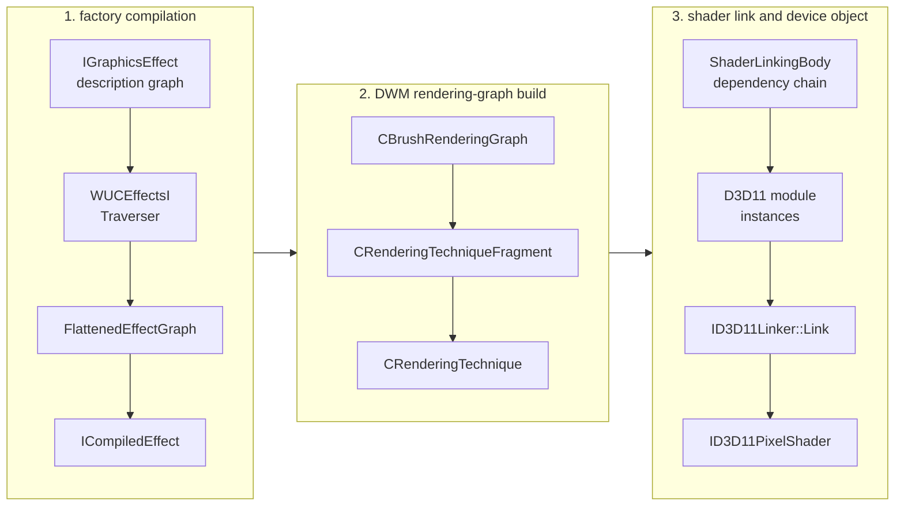
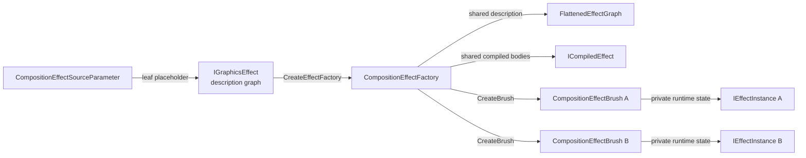
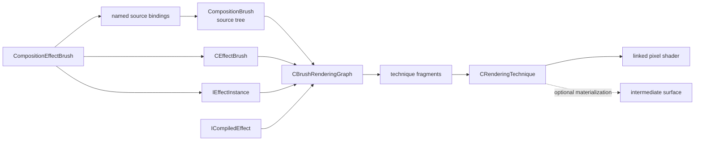
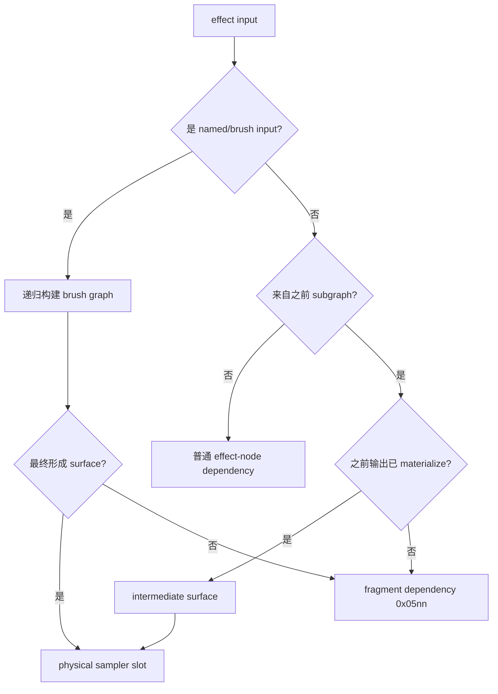

# WinUI 3 Lifted Compositor 的 Composition Effect 与 Shader Linking 内部路径

本文从 **Windows App SDK Lifted Compositor** 内部视角，解释 WinUI 3 composition effect 是怎样从一棵 `IGraphicsEffect` 图，变成 lifted rendering graph，再通过 D3D11 shader linking 生成最终 pixel shader 的。

重点不是本仓库如何实现 hook，而是下面这些内部概念之间的关系：

- effect graph、flattened graph 和 subgraph
- named input、effect node 和 input mapping
- rendering fragment、rendering technique 和 intermediate surface
- `ICompiledEffect` 与 `ShaderLinkingBody`
- logical input、physical sampler 和 `SurfaceDescription`
- 普通颜色 body、coordinate body 和 custom sampler body
- sampler discovery、`samplerData`、`samplerDataExt`
- animated property、constant-buffer updater 和 change stamp
- forward bounds、reverse input bounds 和 CPU-side culling contract
- visual traversal、alpha/color contract、shadow 与 mask realization
- composition command、resource table 与 notifier-driven invalidation
- shader module loading、fragment linking、profile 和 shader cache
- factory、graph、shader、constant buffer 与 intermediate 的分层失效成本
- 多纹理输入在这条内部路径上的真实限制

> [!WARNING]
>
> 本文描述的是逆向得到的私有实现，不是公开 API 契约。结构偏移、虚表槽、RVA、参数编码和限制都可能随 Windows App SDK 或系统版本变化。

> [!IMPORTANT]
>
> 本文中的 `DWM` 或“DWM 路径”，除非明确写出“系统 DWM”，都专指 **WinUI 3 / Windows App SDK Lifted Compositor 中的 `dwmcorei.dll` 路径**。它不是桌面会话的系统 `dwm.exe`，也不能与 `%SystemRoot%\System32` 中由操作系统维护的系统 DWM 组件等同。

## Lifted Compositor 与系统 DWM 的边界

WinUI 3 使用的 Lifted Compositor 把一部分原本属于 Windows composition 实现的组件以 Windows App SDK 版本化形式带到应用侧。这条栈中可以看到：

- `dcompi.dll`
- `wuceffectsi.dll`
- `dwmcorei.dll`

本文逆向的 effect compiler、brush rendering graph 和 shader linker 都位于这条 **lifted composition stack** 中。

它与系统 DWM 的关系应这样理解：

| Lifted Compositor | 系统 DWM |
|---|---|
| 随 Windows App SDK 版本化 | 随 Windows 操作系统版本化 |
| 服务于 WinUI 3 / lifted composition 对象 | 负责桌面会话、窗口和最终屏幕合成 |
| 本文分析 `wuceffectsi.dll`、`dwmcorei.dll` | 典型进程/组件是系统 `dwm.exe`、系统 DWM binaries |
| effect graph、brush graph 和 shader linking 行为可随 WinAppSDK 更新 | 内部实现随 OS build 更新 |
| 本文的地址、限制和 ABI 只适用于目标 lifted binaries | 不能据此推断系统 DWM 使用相同地址、对象布局或限制 |

Lifted Compositor 生成的内容最终仍会进入更大的 Windows composition / display pipeline，但本文的研究边界停在 lifted effect/rendering path。本文不会把 `dwmcorei.dll` 的结论外推为桌面系统 DWM 的内部机制。

完成上述边界说明后，下文直接把 Lifted Compositor 中的 `dwmcorei.dll` 称为 **DWM**，把其中的 `wuceffectsi.dll` 称为 **WUCEffectsI**。除“系统 DWM”这一明确写法外，后文的 DWM 都不指桌面 `dwm.exe`。

## 分析版本

本文针对 WinAppSDK v2.2.0 x64 中的以下组件：

- `wuceffectsi.dll`
  - SHA-2 digest：`dbea457ac1c6d5c4cde5b9cfb09e65cd54b11596406ce50565ddd946468b1454`
- `dwmcorei.dll`
  - SHA-2 digest：`06799367a4fcbd21832c91560720b7d131016abbaed4a1e64349df1e531e5d3c`
- `Microsoft.ui.xaml.dll`
  - SHA-2 digest：`2b22eb6130821f43a26239d441ef3a898bea24b1c1078b5941249431c4b4fbf8`

## 一句话模型

composition effect 不是“app 交给 DWM 一段完整 pixel shader”。

app 交给 Lifted Compositor 的是 effect description。WUCEffectsI 把 description 变成 flattened subgraphs；DWM 把 subgraphs 变成 rendering fragments 和 techniques；最后 DWM 使用 D3D11 shader linker，把多个 library function 连接成最终 pixel shader。



因此一张输入纹理能否被 shader 访问，至少取决于四件事：

1. 它在 effect graph 中是什么类型的输入。
2. 它是否在 technique 边界被 materialize 成 surface。
3. DWM 是否给它分配了 physical sampler slot。
4. shader body 的 linking arguments 和 module resource binding 是否引用了这个 slot。

## effect、graph、subgraph、brush 与 technique 的关系

这些名词不在同一抽象层。最容易产生误解的是把“effect graph”“brush graph”和“rendering graph”都简称为 graph，再把 subgraph 当成 technique 的子对象。先把共享 factory 数据和 brush instances 分开看：



多个 brushes 共享 factory 的 `FlattenedEffectGraph`/`ICompiledEffect`，但分别拥有 `IEffectInstance`，保存 animated-property values、surface transforms 和 constant-buffer bytes。

再单独看其中一个 brush instance 怎样进入 DWM rendering path：



第二张图只画某一个 brush 的执行路径。第一张图中的共享 `ICompiledEffect` 和该 brush 私有的 `IEffectInstance`，会与实际绑定的 source-brush tree 一起进入 `CBrushRenderingGraph`；这样不需要用跨越三个大框的长线同时表达 ownership 和执行顺序。

### “graph”在本文中有四个不同作用域

```text
effect description graph
  public IGraphicsEffect/IGraphicsEffectSource objects；app 构造。

FlattenedEffectGraph
  WUCEffectsI compiler IR；factory scoped。

CBrushRenderingGraph
  DWM 对实际 brush tree 的普通执行图；render/realization scoped。

CExternalEffectGraph
  blur 等 specialized implementation 自己构造的 pass/callback graph；
  最终仍调用普通 techniques 执行。
```

所以单独说“graph 中有一个节点”是不充分的：必须先说明是 public effect node、flattened `EffectNode`、brush rendering graph slot，还是 external blur graph technique/callback node。

### 第一层：effect 是 description，不是 draw pass

`IGraphicsEffect` 描述一个逻辑运算，例如 blur、color matrix 或 custom effect。一个 effect 对象包含：

- effect GUID/type
- factory-time property values
- 零个或多个 `IGraphicsEffectSource` inputs
- 可选的 effect name，供 animated-property path 引用

当一个 effect 的 source 指向另一个 effect 时，它们形成 app-facing **effect description graph**：

```text
ColorMatrixEffect ──> GaussianBlurEffect ──> CompositeEffect
       ^
       |
CompositionEffectSourceParameter("Input")
```

这里的箭头只是数据依赖：“右侧 effect 读取左侧 effect 的结果”。它还没有决定 shader 是否内联、是否分 pass、是否需要纹理，也没有 technique。

### 第二层：source parameter 是 graph 的洞，brush 是运行时填入的 producer

`CompositionEffectSourceParameter` 也是一种 `IGraphicsEffectSource`，但它不执行图像处理。它在 factory graph 中留下一个有名字的外部输入槽：

```cpp
// public-facing 伪代码；变量名为本文示例名称。
CompositionEffectSourceParameter input{ L"Input" };
GaussianBlurEffect description;
description.Source(input);

CompositionEffectFactory factory =
    compositor.CreateEffectFactory(description);

CompositionEffectBrush brush = factory.CreateBrush();
brush.SetSourceParameter(L"Input", actualBrush);
```

`CompositionBrush` 是 composition tree 中的运行时内容 producer。它可以是 surface brush、backdrop brush、color/gradient brush，或另一个 `CompositionEffectBrush`。因此有两种完全不同的连接：

```text
factory 内部：effect -> effect
  连接 description nodes；不需要中间 brush。

brush instance：named source parameter -> CompositionBrush
  把 graph 的外部叶子绑定到实际内容 producer。
```

如果 `actualBrush` 本身又是一个 `CompositionEffectBrush`，两个 factory graph 不会在公共 API 层合并成同一个 `FlattenedEffectGraph`。它们仍是两个 factory、两份 compiled description；DWM 在递归解析 brush tree 时才把两边放入同一个运行时 `CBrushRenderingGraph`，随后决定能否作为 fragments 放进同一 technique，还是需要 intermediate。

### 第三层：factory 是共享的 compiled template，effect brush 是实例

`CompositionEffectFactory` 固化的是 effect graph 的结构：nodes、静态 properties、animatable-property descriptors、subgraph partition 和 compiled shader bodies。它可以创建多个 brushes：

```text
CompositionEffectFactory
  shared:
    FlattenedEffectGraph
    ICompiledEffect
    compiled subgraph library bodies

  CreateBrush() -> CompositionEffectBrush A
                    EffectInstance A
                    source bindings A
                    animated values A

  CreateBrush() -> CompositionEffectBrush B
                    EffectInstance B
                    source bindings B
                    animated values B
```

因此 factory 类似不可变 program/template；effect brush 类似 program instance。brush 不重新定义 effect nodes，但它决定：

- 每个 named input 实际绑定哪个 `CompositionBrush`
- 当前 animated properties 的值
- 当前 transform/bounds/blur instance state
- 当前 instance constant-buffer bytes 和 change stamps

### 第四层：FlattenedEffectGraph 是 compiler IR

WUCEffectsI traversal 把任意嵌套的 public effect objects 转成索引化的 `FlattenedEffectGraph`。它主要拥有：

```cpp
struct FlattenedEffectGraph // 省略 ref-count/vtable；字段名按本文前后定义
{
    std::vector<std::unique_ptr<EffectSubgraph>> subgraphs; // +0x18
    std::vector<std::unique_ptr<EffectNode>> nodes;         // +0x30
    std::vector<AnimatableProperty> animatableProperties;   // +0x48
    std::vector<NamedInput> namedInputs;                    // +0x60
    bool hasExternalImplementation;                         // +0x78
};
```

它叫 flattened，是因为 public graph 中的 COM object pointers 和嵌套 source properties 已被转换为稳定的 node/subgraph/named-input indices。它仍是 factory description 的编译结果，不是某一帧实际要画的 surface DAG。

### 第五层：EffectNode 是一个逻辑 effect occurrence

`EffectNode` 对应 graph 中的一次 effect 使用。即使两个 nodes 使用相同 GUID，它们仍可以有不同 properties 和 inputs：

```text
Node 3: GaussianBlur, BlurAmount = 8
Node 7: GaussianBlur, BlurAmount = 24
```

node 保存 effect type、source count、input mappings、native property struct 和 per-property animation mask。node 的 input 最终引用：

- null
- named input index
- 另一个 node index
- 另一个 subgraph index

node 不是 brush，也不是 technique；它只属于 factory graph。

### 第六层：EffectSubgraph 是 WUCEffectsI 的 partition

`EffectSubgraph` 把一组 `EffectNode` 划到同一个编译单元/输出边界。普通逐像素 effect chain 可以全部位于一个 subgraph：

```text
EffectSubgraph 0
  nodes = [ColorMatrix, Saturation, Composite]
  compiled result = one CompiledEffectSubgraph / PSBody
```

需要真实 surface 的采样边界会推动 partition：

```text
EffectSubgraph 0
  nodes = [upstream effects, flatten wrapper]
  output = reusable/materializable result

EffectSubgraph 1
  nodes = [custom sampler/downstream effect]
  input = subgraph 0 output
```

所以 cardinality 是：

```text
one effect graph  -> many EffectNodes
many EffectNodes  -> one or more EffectSubgraphs
one EffectSubgraph -> one CompiledEffectSubgraph description
```

这不是“一 effect 一 subgraph”。subgraph 也还不是实际 pass；它只是允许 DWM 把该输出内联、alias 或 materialize 的编译边界。

### 第七层：CBrushRenderingGraph 是实际 brush tree 的执行图

DWM 取得某个 `CEffectBrush` 后，会递归解析它绑定的 source brushes，并把 compiled effect inputs、现有 surfaces、backdrop/BVI sources、nested effect brushes 和 intermediate dependencies 组织进 `CBrushRenderingGraph`。

这时 graph 才与一次实际 brush realization/render context 相关。它处理的是：

- 当前 source brush 最终解析出哪张 bitmap/surface
- transform、content rect、edge mode 和 color conversion
- 哪个 upstream output 已经 materialize
- 哪些 bodies 可以直接形成 fragment dependency
- 需要创建哪些 techniques 和 intermediate output slots

因此 `FlattenedEffectGraph` 和 `CBrushRenderingGraph` 的区别可以压缩为：

```text
FlattenedEffectGraph
  “factory program 是什么”
  nodes、property ABI、logical input indices、compiled subgraphs

CBrushRenderingGraph
  “这个 brush instance 这次怎样画”
  actual brushes/surfaces、fragments、techniques、intermediates
```

### 第八层：fragment 是 linkable body，technique 是一次 link/draw 边界

`CRenderingTechniqueFragment` 包装一个可连接的 shader body及其 instance state，包括：

- `ShaderLinkingBody`
- logical arguments 到 technique-local arguments 的映射
- `IEffectInstance*` 和 subgraph index
- constant-buffer region/change stamp
- subgraph flags

一个 `CRenderingTechnique` 可以包含一个或多个 fragments。它收集这些 fragments 所需的 physical surfaces、sampler metadata、constant-buffer regions 和 shader-linking configuration，然后执行一轮 `ID3D11Linker::Link`：

```text
fragment dependency chain
  Fragment A
  Fragment B
  Fragment C
       |
       v
one CRenderingTechnique
  one physical-surface collection
  one ShaderLinkingConfig
  one linked pixel shader
  one draw/pass when executed
```

因此 technique 才是当前普通 rendering path 中最接近“pass”的对象。多个 effect nodes 可以先编译进同一个 subgraph body；多个 subgraph/brush bodies 又可以作为 fragments 连接进同一个 technique。反过来，一个必须 multi-pass 的逻辑 effect（例如较大的 blur）也可能展开为多个 techniques。

### intermediate surface 是 technique 边界的运行时结果

当 producer 无法作为 dependency body 与 consumer 一起 link 时，producer technique 先渲染到 off-screen target，consumer technique 再把它作为 physical surface 输入：

```text
Technique 0
  linked shader A
  draw -> intermediate surface

Technique 1
  bind intermediate as Texture2D/SRV
  linked shader B
  draw -> final target
```

但是存在 subgraph/technique bookkeeping 不等于一定分配新纹理。no-op alias 可以让新的 output slot 继续引用同一 bitmap realization；lazy intermediate 也只在消费者真正请求时才执行 producer。

### 最终数量和 ownership 关系

```text
one CreateEffectFactory call
  -> one factory-scoped FlattenedEffectGraph / ICompiledEffect
  -> many EffectNodes
  -> 1..N EffectSubgraphs

one CompositionEffectFactory
  -> many CompositionEffectBrush instances

one CompositionEffectBrush
  -> its own source-parameter bindings
  -> its own IEffectInstance runtime values
  -> references shared factory compiled data

one render-time brush tree
  -> one CBrushRenderingGraph build/context
  -> many CRenderingTechniqueFragments
  -> one or more CRenderingTechniques

one CRenderingTechnique
  -> one LinkShader configuration/result
  -> one draw/pass when executed
  -> zero or one output realization for that graph slot
```

最重要的非一一对应关系是：

```text
effect       != brush
EffectNode   != EffectSubgraph
EffectSubgraph != CRenderingTechnique
subgraph boundary != guaranteed intermediate texture
factory graph != render-time brush graph
```

## 组件边界

### WinUI / Composition 公共层

公共层负责描述 effect graph：

- effect GUID 和属性
- source 数量
- source 名称
- source 之间的嵌套关系
- `CompositionEffectBrush::SetSourceParameter` 绑定

这一层描述“图是什么”，但不直接描述最终 shader 的 SRV、sampler state 或寄存器绑定。

### WUCEffectsI

Windows App SDK Lifted Compositor 中的 `wuceffectsi.dll` 负责 effect compiler 的前半段：

- 识别 `EffectType`
- 遍历 `IGraphicsEffect`
- 验证 source 类型和数量
- 识别 named inputs
- 插入 source-flattening wrapper
- 生成 `FlattenedEffectGraph`
- 把 factory animatable-property paths 编译成 cbuffer fields 和 updater records
- 正常情况下生成 native `CompiledEffect`

可以把 WUCEffectsI 看成“effect graph compiler”。

### DWM

Windows App SDK Lifted Compositor 中的 `dwmcorei.dll` 负责渲染侧：

- 把 `ICompiledEffect` 变成 brush rendering graph
- 决定 subgraph 是内联为 fragment，还是单独 materialize
- 收集 physical surfaces
- 建立 sampler configuration
- 根据 `IEffectInstance` change stamp 上传 per-instance constant buffer
- 加载 shader library module
- 连接 dependency bodies 和 main body
- 创建、缓存最终 linked shader

可以把这里的 DWM 看成“rendering graph compiler + shader linker runtime”。它的类名大量沿用 Windows DWM 内部命名，但这不意味着这些对象就是系统 `dwm.exe` 中同一实例。

### D3D11 Shader Linking API

DWM 使用的不是常规 `D3DCompile(entryPoint, ps_4_0)` 路径，而是：

- `D3DLoadModule`
- `ID3D11Module::CreateInstance`
- `ID3D11ModuleInstance` resource binding
- `ID3D11LinkingNode`
- `ID3D11Linker::Link`

每个 effect body 是 shader library 中的 exported function。最终 pixel shader 由 DWM 在运行时连接。

## 核心对象词典

| 概念 | 所属层 | 作用 |
|---|---|---|
| `IGraphicsEffect` | 公共层 | app 提交的 effect description |
| `CompositionEffectSourceParameter` | 公共层 | factory graph 中的 named external-input placeholder |
| `CompositionEffectFactory` | 公共层 | 共享 compiled effect program/template，可创建多个 brushes |
| `CompositionBrush` | 公共层 | composition tree 中的运行时内容 producer |
| `CompositionEffectBrush` | 公共层 | factory 的运行时实例，保存 source bindings 和动态属性 |
| `EffectType` | WUCEffectsI | GUID 对应的内部 effect 元数据与行为虚表 |
| `EffectOpacityRelation` | WUCEffectsI | 从最终 output 反向标记哪些 named inputs 影响 opaque proof |
| `EffectNode` | WUCEffectsI | flattened graph 中的一个 effect 实例 |
| named input | WUCEffectsI | 由 `SetSourceParameter` 在 brush 实例阶段绑定的图输入 |
| `EffectSubgraph` | WUCEffectsI | 一组可以一起编译或作为一个输出边界处理的 nodes |
| `FlattenedEffectGraph` | WUCEffectsI | traversal 后的 nodes、subgraphs、named inputs 和属性集合 |
| `ICompiledEffect` | WUCEffectsI → DWM | DWM 消费的 compiled-subgraph 接口 |
| `IEffectInstance` | WUCEffectsI → DWM | 每个 brush instance 的属性状态、constant-buffer bytes 和 change stamps |
| `AnimatableProperty` | WUCEffectsI | `EffectName.PropertyName` 到 node/property/mapping/expression type 的绑定 |
| `ConstantBufferUpdater` | WUCEffectsI | 把某个 node 的 native property struct 写入 subgraph constant buffer |
| bounds contract | WUCEffectsI | 在 CPU 上正向计算输出范围，并从可见输出反推实际需要的输入范围 |
| `CEffectBrush` | DWM | effect brush 的渲染侧资源对象 |
| `CPropertySet` | DWM | animated property 的 channel resource，并回调 `CEffectBrush` 更新 `IEffectInstance` |
| `NodeEffects` | DWM | 当前 visual 的 local clip、opacity、filter/tree effect、resample 与 color-space 状态 |
| `CBrushRenderingGraph` | DWM | brush、surface、intermediate 和 fragment 的渲染图 |
| `CRenderingTechniqueFragment` | DWM | 可被 shader linker 连接的一个渲染片段 |
| `CRenderingTechnique` | DWM | 一次实际渲染 pass 和一轮 shader link 的边界 |
| `ShaderLinkingBody` | DWM | 一个 library function、参数语义、bytecode 和 profile 的描述 |
| `ShaderLinkingConfig` | DWM | surface、sampler、edge mode、颜色处理等 link 配置 |
| `CLinkedShader` | DWM | 已连接 bytecode、pixel shader 和相关缓存对象 |
| `CDropShadow` | DWM | 单 visual/content mask 的显式 offset/blur/color shadow |
| `CProjectedShadowScene` | DWM | light、casters、receivers 与投影绘制顺序的 scene-level shadow 系统 |
| `CShadowMaskProducer` | DWM | 把 brush + geometry/bounds clip rasterize 为可缓存 alpha mask realization |

### 结构布局记法

后文按当前 x64 build 的真实类型名和字段偏移书写结构定义：

```cpp
// +0xNN 表示字段相对对象起点的偏移。
// 若当前符号没有保留成员拼写，本文仍按读写行为给出可读的重建名称；
// 这种名称会在结构或上下文中明确标注为“本文重建名称”，不冒充原始符号。
// 只有确认不承载状态的对齐/未使用字节才写成 padding。
// 符号明确写 std::vector<T> 时，本文直接使用 std::vector<T>；
// 在这个 x64 build 中它大小为 0x18，依次保存 begin、end、capacity。
static_assert(sizeof(std::vector<void*>) == 0x18);
```

这些布局与文首指定版本对应。

### `::detail::vector_facade`：DWM common Util 的容器框架

`::detail::vector_facade<T, Buffer>` 不是 Gaussian blur 或 `dwmcorei` 单独实现的临时容器。当前 build 的符号文件把其公共实现模块列为：

```text
d:\os\obj\amd64fre\onecoreuap\windows\dwm\common\util\utillib\
  native-static-crt\objfre\amd64\containerhelpers.obj

linked library:
d:\os\obj\amd64fre\onecoreuap\windows\DWM\common\Util\UtilLib\
  native-static-crt\objfre\amd64\Util.lib
```

所以更准确的归属是“DWM common Util 的内部 container helpers 框架”。模板实例不只出现在 blur：DWM engine、rendering、resources、occlusion、draw-list、animation、visual-tree path 等代码都使用同一套 `vector_facade / buffer_impl / pointer_buffer_impl`。

它也不是当前 Windows SDK、Visual Studio STL/ATL、WIL 或 NuGet 公开头文件提供的容器；这些本机公开 headers 和公开源码中没有对应定义。`Util.lib` 是 Windows/DWM 源码树内的共享静态工具库，应用代码不能把这个类型当成可引用的公共 ABI。

最外层的 `detail` 本身就是该框架使用的 namespace。当前符号没有显示 `Dwm::detail`、`Microsoft::detail` 或其它父 namespace，因此完整限定名以全局作用域 `::detail` 开始。它不是 `std::vector<T>` 的别名，也不是为了表示未知容器而创造的名字。符号中会完整出现：

```cpp
::detail::vector_facade<
    T,
    ::detail::buffer_impl<T, InlineCount, 1,
                          ::detail::liberal_expansion_policy>>

::detail::vector_facade<
    T*,
    ::detail::pointer_buffer_impl<T*>>
```

MSVC decorated name 中的结尾形状也直接支持这一点：

```text
...@?$vector_facade@...@detail@@...
...@?$buffer_impl@...@detail@@...
```

`@detail@@` 表示类型位于全局 `detail` namespace；如果存在外层 namespace，decorated name 中还会继续出现对应的 namespace components。

`vector_facade` 提供 vector-like 的元素移动、插入、删除、析构和 iterator 操作；第二个模板参数决定 begin/end/capacity 如何保存、是否有 inline storage、以及何时转入 heap。它相当于：

```cpp
template<typename T, typename Buffer>
class vector_facade : private Buffer
{
public:
    iterator begin();
    iterator end();

    // 在 index 处插入一段未构造的 storage，当前调用点通常插入 1 项。
    // 必要时扩容并 move 现有元素，返回新区域地址供 detail::construct 使用。
    T* reserve_region(size_t index, size_t count = 1);

    void clear_region(size_t index, size_t count);
    iterator erase(iterator position);
};
```

所以常见插入代码不是 `push_back`，而是两步：

```cpp
T* slot = values.reserve_region(values.size());
detail::construct<T, T>(slot, std::move(value));
```

这也是 graph builder 添加 `std::function` callback 时看到 `reserve_region` 和 `detail::construct` 连续出现的原因。

#### `buffer_impl`：带 inline capacity 的 small vector

`buffer_impl<T, N, 1, liberal_expansion_policy>` 的前三个字段仍是三个指针，但 capacity 为空时指向对象自身尾部的 inline array：

```cpp
template<typename T, size_t InlineCount>
struct buffer_impl_shape
{
    T* begin;                         // +0x00
    T* end;                           // +0x08
    T* capacityEnd;                   // +0x10
    alignas(T) std::byte inlineData[  // +0x18
        InlineCount * sizeof(T)];
};
```

初始化时：

```cpp
begin       = reinterpret_cast<T*>(inlineData);
end         = begin;
capacityEnd = begin + InlineCount;
```

inline space耗尽后，它按 `liberal_expansion_policy` 选择：

```cpp
newCapacity = max(requiredSize,
                  oldCapacity + oldCapacity / 2); // 约 1.5 倍
```

分配 heap storage、move-construct 原元素、析构旧元素；旧 begin 指向 `inlineData` 时不释放，指向 heap 时才调用 `DefaultHeap::Free`。

blur 路径有两个可以直接验证 inline capacity 的实例：

```cpp
using GraphCallbacks = detail::vector_facade<
    std::function<long(CExternalEffectGraph::CGraphRenderingContext*)>,
    detail::buffer_impl<
        std::function<long(CExternalEffectGraph::CGraphRenderingContext*)>,
        16,
        1,
        detail::liberal_expansion_policy>>;

// sizeof(std::function<...>) = 0x40
// sizeof(GraphCallbacks) = 0x18 + 16 * 0x40 = 0x418

using CachedBlurs = detail::vector_facade<
    CBlurredBackdropCache::CachedBlur,
    detail::buffer_impl<
        CBlurredBackdropCache::CachedBlur,
        2,
        1,
        detail::liberal_expansion_policy>>;

// sizeof(CachedBlur) = 0x80
// sizeof(CachedBlurs) = 0x18 + 2 * 0x80 = 0x118
```

`CBlurRenderingGraph` 的 callback collection 从 `+0x1F0` 开始，`0x1F0 + 0x418 == 0x608`，正好在后面的 `CResourceTag` 前结束；这与 16 项 inline `std::function` 布局完全吻合。`CBlurredBackdropCache` 则可以在不分配 heap 的情况下保存两条 0x80-byte blur results。

#### `pointer_buffer_impl`：empty / one pointer / heap 的 tagged word

pointer specialization 不保存三个指针，整个 storage state 只占一个 64-bit word。因为有效对象指针至少 4-byte aligned，低两位可作为 tag：

```cpp
template<typename T>
struct pointer_buffer_impl_shape
{
    uintptr_t stateOrValue; // sizeof = 0x08
};

enum PointerBufferTag : uintptr_t
{
    InlineOne = 0, // stateOrValue 本身就是唯一的 T*；低两位自然为 00
    Heap      = 1, // (stateOrValue & ~3) 指向 heap element array
    Empty     = 2, // 构造时写入常量 2
    Invalid   = 3, // 不应成为稳定状态；遇到时 fail-fast
};
```

状态转换为：

```text
Empty: stateOrValue = 2
  插入第 1 项
InlineOne: stateOrValue = elementPointer
  插入第 2 项
Heap: stateOrValue = heapElementsPointer | 1
  后续按 heap header 中的 size/capacity 扩容
```

heap element array 前面还有 0x10-byte header；析构时使用：

```cpp
T** elements = reinterpret_cast<T**>(stateOrValue & ~uintptr_t(3));
DefaultHeap::Free(reinterpret_cast<std::byte*>(elements) - 0x10);
```

BVI 的 `blurCacheUsers` 正是：

```cpp
detail::vector_facade<
    CBlurredBackdropCache*,
    detail::pointer_buffer_impl<CBlurredBackdropCache*>>
```

常见情况下一项反向引用可以直接内联在那一个 qword 中；只有第二个 `CBlurredBackdropCache*` 加入时才分配 heap。这比为每个 BVI 放置一个 0x18-byte `std::vector` 并立即分配更紧凑。

#### 与 `std::vector` 的接口/ABI 边界

两者都提供 contiguous elements 和 vector-like iterator，但不能互换：

```text
std::vector<T>
  固定 0x18-byte begin/end/capacity ABI
  默认没有 inline elements

vector_facade<T, buffer_impl<...>>
  对象尺寸包含 inlineData
  begin 可能指向对象内部，也可能指向 heap

vector_facade<T*, pointer_buffer_impl<T*>>
  storage state 只有 0x08 byte
  单元素直接编码在对象本身
  begin/end 需要先解析 low-bit tag
```

因此在结构伪代码中，符号是 `std::vector<T>` 就写 `std::vector<T>`；符号是 `detail::vector_facade` 就保留完整真实类型。把后者统一改写成 `std::vector<T>` 会同时写错类型名、对象尺寸、字段偏移和 allocation 行为。

## 从 effect description 到 FlattenedEffectGraph

### Traverser 的两阶段工作

WUCEffectsI 的 `Traverser` 分为两个阶段：

1. `EnumerateEffectSubgraphs`
   - 先决定有哪些 subgraph 和 flatten wrapper。
2. `VisitEffect` / `VisitEffectInputs`
   - 再创建 nodes，并把每个 node input 映射到 named input、其他 node 或其他 subgraph。

先枚举 subgraph 很重要，因为 source flattening 依赖预先创建的 wrapper 对象。

### EffectType 决定图行为

`EffectType` 不只是 GUID 到名字的映射。WUCEffectsI 会调用它的多个虚表槽决定：

- source count 是否合法
- source 类型是否合法
- 是否需要 source flattening
- 是否是 transform effect
- 是否是 intersection/combinator
- opacity relation
- bounds 行为
- 是否可能被当成 no-op 消除

一个错误的 capability bit 会改变 graph shape，而不仅是改变一个优化选项。

#### `EffectType` 的 22 槽虚表合同

当前 build 的 callable ABI 到 `+0xA8` 为止，共 22 个槽。下面保留已有符号名；没有独立符号、但可由唯一 producer 和消费点定性的名称标为“本文重建名称”：

```cpp
struct EffectTypeVtable
{
    /* +0x00 */ char const* (*GetShaderFragmentName)(EffectType const*);
    /* +0x08 */ GUID const& (*GetGuid)(EffectType const*);
    /* +0x10 */ EffectSamplingBehavior (*GetEffectSamplingBehavior)(EffectType const*);
    /* +0x18 */ bool (*IsValidInputCount)(EffectType const*, uint32_t);
    /* +0x20 */ bool (*IsValidInputType)(EffectType const*, EffectNodeInputType);
    /* +0x28 */ bool (*RequiresSourceFlattening)(EffectType const*);
    /* +0x30 */ bool (*IsInputTransform)(EffectType const*, uint32_t* inputIndex);

    /* +0x38 */ bool (*IsBorderEffectKind)(EffectType const*); // 本文重建名称
    /* +0x40 */ bool (*ForceAuxiliaryBinding)(EffectType const*); // 生成 flag 0x4
    /* +0x48 */ bool (*ConditionalAuxiliaryBinding)(EffectType const*); // 生成 flag 0x2
    /* +0x50 */ bool (*ReserveWhiteNoiseSamplerConstant)(EffectType const*); // 生成 flag 0x10
    /* +0x58 */ bool (*KeepFragmentOutput)(EffectType const*); // 生成 flag 0x8
    /* +0x60 */ bool (*DisallowSdrBoostConversionElision)(EffectType const*); // 生成 flag 0x20

    /* +0x68 */ bool (*IsIntersectionCombinator)(EffectType const*, void const* props);
    /* +0x70 */ bool (*IsNoOp)(EffectType const*, uint32_t inputCount, void const* props);
    /* +0x78 */ RectF (*GetBounds)(EffectType const*, void const* props,
                                   std::vector<RectF> const& inputBounds);
    /* +0x80 */ void (*CalcInversedWorldInputBounds)(EffectType const*, void const* props,
                                                     RectF const& visibleOutput,
                                                     RectF const& availableInput,
                                                     RectF* inputBounds);
    /* +0x88 */ uint32_t (*GetPropertiesStructSize)(EffectType const*);
    /* +0x90 */ void (*GetPropertiesMetadata)(EffectType const*, uint32_t*,
                                              EffectPropertyMetadata const**);
    /* +0x98 */ void (*Validate)(EffectType const*, EffectNode const&);
    /* +0xA0 */ void (*GenerateCode)(EffectType const*, EffectNode const&,
                                     EffectGenerator*, char const* outputName);
    /* +0xA8 */ EffectOpacityRelation (*GetEffectOpacityRelation)(EffectType const*,
                                                                  EffectNode const&);
};
```

`+0x38..+0x60` 不是一组可以随意复用的 generic bool。当前 type table 的置位集合精确为：

```text
+0x38: BorderEffect
+0x40: PointDiffuse、PointSpecular、SpotDiffuse、SpotSpecular
+0x48: SceneLightingEffect
+0x50: WhiteNoiseEffect
+0x58: SceneLightingEffect
+0x60: ArithmeticComposite、Blend、ColorMatrix、Contrast、
       DistantDiffuse、DistantSpecular、Exposure、Flood、GammaTransfer、
       Grayscale、HueRotation、Invert、LinearTransfer、LuminanceToAlpha、
       PointDiffuse、PointSpecular、Saturation、SceneLighting、Sepia、
       SpotDiffuse、SpotSpecular、TemperatureAndTint、Tint、WhiteNoise
```

这些 producer 集合比把槽位统称为“reserved capability”更有用。`EffectGenerator::EmitNode @ 0x180016660` 把 `+0x48/+0x40/+0x50/+0x60` 分别 OR 成 compiled-subgraph flags `0x2/0x4/0x10/0x20`；`EmitShaderSourceForSubgraph @ 0x1800168E8` 在最终 node 的 `+0x58` 为真时 OR `0x8`。此外，`+0x28` 会触发 source-flattening wrapper，`+0x30` 返回被 transform 的 input index，`+0x48` 还被 Gaussian-blur source 校验用于拒绝 `SceneLightingEffect`，`+0x58` 会让 subgraph enumeration 从独立 root 开始。

#### `EffectOpacityRelation`：多输入 graph 的 opaque-input 依赖

`GetEffectOpacityRelation @ +0xA8` 返回的三个值可由 `DoesNodeHaveOpacityRelevance @ 0x1800121E8` 和 `SetNodeOpacityRelevance @ 0x180013304` 的递归分支直接定性：

```cpp
enum class EffectOpacityRelation : uint32_t
{
    NoInputDependency  = 0, // 本文重建枚举名
    AnyRelevantInput   = 1, // 任一 source 可建立 opacity relevance
    AllRelevantInputs  = 2, // 所有 source 都必须具有 opacity relevance
};
```

其传播算法可精简为：

```cpp
bool DoesNodeHaveOpacityRelevance(Node const& node)
{
    switch (node.type->GetEffectOpacityRelation(node))
    {
    case NoInputDependency:
        return false;
    case AnyRelevantInput:
        return any_of(node.inputs, InputHasOpacityRelevance);
    case AllRelevantInputs:
        return all_of(node.inputs, InputHasOpacityRelevance);
    }
}

void MarkRelevantNamedInputs(Node const& node)
{
    if (node.opacityRelation == AnyRelevantInput)
        MarkOneInputThatCanProveOpacity(node);
    else if (node.opacityRelation == AllRelevantInputs &&
             all_of(node.inputs, InputHasOpacityRelevance))
        for (auto const& input : node.inputs)
            MarkInputRecursively(input);
}
```

`BlendEffectType::GetEffectOpacityRelation @ 0x18000A910` 固定返回 1。`CompositeEffectType::GetEffectOpacityRelation @ 0x18001EDA0` 仅在 composite mode property 为 0 时返回 1，否则返回 0。`FlattenedEffectGraph::Finalize @ 0x1800122E4` 从最终 subgraph 反向标记真正影响 opaque 判定的 named inputs；DWM 后续不必要求所有 effect inputs 都是 opaque。

### source 的几种形状

`VisitEffectInputs` 观察到的 source 可能是：

- null input
- named graph input
- 另一个 `IGraphicsEffect`
- enumeration 已建立的 flatten/subgraph occurrence

最终 `EffectNode` 的 input 不是直接保存一张纹理，而是保存“输入类型 + 索引”。

### effect 可以直接串联 effect

factory description 内不需要为每个 node 之间的连接创建 brush。只要下游 effect 的 source property 接受 `IGraphicsEffectSource`，就可以直接把另一个 effect 对象放进去：

```cpp
// app-facing 伪代码；变量名为本文示例名称。
auto colorEffect = ColorMatrixEffect{};
colorEffect.Source(sourceParameter); // graph 的外部叶子

auto blurEffect = GaussianBlurEffect{};
blurEffect.Source(colorEffect);      // effect -> effect，内部 node edge

auto factory = compositor.CreateEffectFactory(blurEffect);
auto brush = factory.CreateBrush();
brush.SetSourceParameter(L"Input", inputBrush);
```

`Traverser::VisitEffectInputs @ 0x18000DB78` 对每个 `IGraphicsEffectSource` 大致按下面的顺序分类：

```cpp
void VisitEffectInput(IGraphicsEffectSource* source) // 本文重建名称
{
    if (source == nullptr)
    {
        StoreInput({ InputKind::Null, 0 });
    }
    else if (auto parameter = TryAsGraphSourceParameter(source))
    {
        uint32_t namedInputIndex = graph.AddNamedInput(parameter->Name(), ...);
        StoreInput({ InputKind::NamedInput, namedInputIndex });
    }
    else if (auto childEffect = TryAsIGraphicsEffect(source))
    {
        // public object reuse 已在 enumeration 阶段按 non-tree graph 拒绝；
        // 此处的 existing 只表示已建立的 flatten/subgraph occurrence。
        if (auto existing = FindExistingFlattenedOccurrence(childEffect))
            StoreInput({ InputKind::ExistingNodeOrSubgraph, existing.index });
        else
            StoreInput({ InputKind::EffectNode, VisitEffect(childEffect) });
    }
    else
    {
        OriginateException("Unexpected effect input type.");
    }
}
```

因此要区分两类 edge：

- `effect -> effect`：factory 创建阶段已经确定的内部 graph edge。它连接 `EffectNode`，通常不对应 brush，也不占 named-input 配额。
- `source parameter -> CompositionBrush`：graph 的外部叶子。factory 中只保存参数名；`CompositionEffectBrush::SetSourceParameter` 在 brush instance 阶段把它绑定到 surface brush、backdrop brush、另一个 composition effect brush 等实际 producer，并占用一个 named input。

brush 是运行时内容 producer，不是用来表达 factory 内部每条 effect-node edge 的必要中间层。只有需要把输入保留到 factory 创建后再决定，或需要从 composition tree 引入实际纹理/背景内容时，才使用 source parameter 再绑定 brush。

直接的 `effect -> effect` 也不保证最终一定被连接成单个 shader expression。如果下游需要任意 UV、邻域采样或其它必须读取真实 surface 的语义，traversal 会在这条内部 edge 上插入 flatten wrapper，把上游 materialize 到 intermediate surface，再由后续 subgraph 采样；这是 DWM/WUCEffectsI 的内部 multi-pass 决策，app 仍不需要为该 edge 手工创建 brush。

这里不是“一个 effect 就变成一个 subgraph”，也不是“subgraph 只存在于 technique 内部”。三层对象的作用域不同：

```text
factory effect description
  EffectNode A -> EffectNode B
       |
       | WUCEffectsI traversal / partition
       v
  EffectSubgraph 0: [A, B]             // 普通情况：同一 compiled body

或

  EffectSubgraph 0: [A, flatten output]
  EffectSubgraph 1: [B reads subgraph 0]
       |
       | DWM brush-rendering graph build
       v
  CRenderingTechniqueFragment / CRenderingTechnique
```

- `EffectNode` 是 description 内的逻辑 effect 实例。
- `EffectSubgraph` 是 WUCEffectsI 在 factory 编译阶段确定的 partition；一个 subgraph 可以包含多个 nodes，并生成一个 `CompiledEffectSubgraph`/`PSBody`。
- `CRenderingTechnique` 是 DWM 的实际 link/draw 边界；它在消费 compiled subgraphs 时建立，不是 effect description 自己携带的对象。

因此普通 `A -> B` 往往是 `[A, B]` 同属一个 subgraph，node edge 已经在该 subgraph 的 generated HLSL/`PSBody` 内表达，DWM 不需要为 A 单独创建 technique。只有 partition 产生 subgraph boundary 后，DWM 才需要处理“之前 subgraph 的输出”；而这个 boundary 仍不严格等于一张新纹理或一个独立 pass：

```cpp
// DWM graph-build 行为摘要；名称为本文重建。
if (CanLinkAsFragmentDependency(previousSubgraphOutput))
{
    // 0x05nn：producer body 作为 dependency 进入同一 technique/link。
    AddFragmentDependency(previousSubgraphOutput);
}
else if (CanAliasNoOpSubgraph(previousSubgraphOutput))
{
    // 保留 graph slot，但复用同一 bitmap realization。
    AliasInputRealization();
}
else
{
    // producer technique 先离屏绘制，consumer technique 再采样。
    RenderToIntermediateSurface();
}
```

所以准确关系是：`effect edge` 先决定 node dependency，traversal 再决定是否跨 subgraph，DWM 最后决定这些 compiled bodies 是在同一 technique 中 link、通过 no-op alias 传递，还是跨 techniques materialize。

### factory graph 必须是 tree，不接受共享 effect node 或 cycle

公共 description 常被口头称为 effect DAG，但当前 traversal 对 `IGraphicsEffect*` identity 的要求更严格：同一个 effect object 只能在 factory tree 中出现一次。`Traverser::EnumerateEffectSubgraphs @ 0x18000CB3C` 在递归进入 effect 前查询一个以 COM object pointer 为 key 的 `std::unordered_set<IGraphicsEffect*>`；第二次命中直接产生：

```text
Non-tree shaped effect graph.
```

其行为可写成：

```cpp
void EnumerateEffectSubgraphs(IGraphicsEffect* effect)
{
    if (visitedEffectObjects.contains(effect))
        OriginateException("Non-tree shaped effect graph.");

    visitedEffectObjects.emplace(effect);

    for (IGraphicsEffectSource* source : effect->Sources())
        if (auto child = TryAsIGraphicsEffect(source))
            EnumerateEffectSubgraphs(child);
}
```

因此下面两种形状都会被拒绝：

```text
共享 node： A -> C <- B，A.Source 与 B.Source 指向同一个 C object
环：       A -> B -> A
```

cycle 不需要单独的 recursion-stack 算法：回到 A 时已经命中同一个 identity set，因此同样归入 non-tree failure。若需要两处执行相同 effect，应创建两个具有相同 properties 的 effect objects；它们可以生成等价 nodes，但 pointer identity 必须不同。

`VisitEffectInputs` 后续仍可能写入 `ExistingNodeOrSubgraph`。这不表示公共 graph 允许共享 object；它用于引用 enumeration 阶段已经建立的 flatten wrapper/subgraph occurrence。应区分：

```text
同一 public IGraphicsEffect object 被两个 parent 引用 -> 非 tree，拒绝
同一 source-flattening occurrence 在 partition 后被引用 -> 内部 index edge，允许
两个独立但值完全相同的 effect objects             -> 两个 EffectNode，允许
```

nested `CompositionEffectBrush` 也不是 factory graph cycle。它在 factory 编译结束后才通过 named source parameter 进入 DWM brush-resource tree；每个 factory 仍独立拥有自己的 flattened tree。brush-resource dependency 的有效性与生命周期属于 composition channel/DWM resource 层，factory traversal 的 `visitedEffectObjects` 不参与该判断。

### named input

named input 对应公共 API 中的 source parameter，例如：

```text
Backdrop
Mask
Overlay
```

它在 factory 创建时只是名字；真正的 brush 在 `CompositionEffectBrush::SetSourceParameter` 阶段绑定。

### named input 上限

这个限制同时存在于正常 traversal producer 和 blob consumer，而不是只靠反序列化数据兜底：

```cpp
// FlattenedEffectGraph::AddNamedInput @ 0x180011EB0
// FlattenedEffectGraph::NamedInput sizeof = 0x10；usedBytes 是本文重建名称。
size_t usedBytes = namedInputs.end_bytes - namedInputs.begin_bytes;

if (usedBytes == 4 * sizeof(NamedInput))
    OriginateException(
        "No more than four graph source parameters are supported.");

if (usedBytes == 3 * sizeof(NamedInput) && GraphContainsWhiteNoise())
    OriginateException(
        "No more than three graph source parameters with white noise effect are supported.");

// FlattenedEffectGraph blob constructor @ 0x18000FD00
if (serializedNamedInputCount > 4)
    OriginateGraphTooComplexException();
```

这不是 D3D11 SRV 的通用限制，而是当前 effect-description / shader-linking 路径的限制。

white-noise 检查是双向的：前三个 source 已经存在、随后加入 white-noise node 时，`VisitEffect @ 0x18000D630` 会拒绝；graph 已含 white-noise、随后加入第 4 个 source 时，`AddNamedInput` 会拒绝。这样限制不依赖 traversal 顺序。

## subgraph 是什么

subgraph 是 WUCEffectsI 和 DWM 之间最重要的边界。

它同时决定：

- 哪些 nodes 形成一个 compiled shader body
- 一个输出能否被后续 subgraph 引用
- 输入是 named brush，还是之前的 subgraph output
- 是否需要 intermediate render target
- constant buffer 和 property updater 属于哪个 node

### subgraph 不等于 effect node

一个 subgraph 可以包含多个 effect nodes。一个复杂 effect graph 也可能被拆成多个 subgraphs。

`ICompiledEffect` 暴露的是 subgraph 级接口，而不是 node 级接口。

### subgraph 上限

`Traverser` 在已经存在 5 个 subgraphs 时拒绝再加入第 6 个；blob reader 也执行同一计数检查：

```cpp
// Traverser constructor @ 0x18000BE58
// std::unique_ptr<EffectSubgraph> sizeof = 8。
if (subgraphs.size_bytes() == 40)
    OriginateGraphTooComplexException();

// ReadVector<std::unique_ptr<EffectSubgraph>> @ 0x18000EAD0
if (serializedSubgraphCount > 5)
    OriginateGraphTooComplexException();
```

这会直接影响多 source flattening：如果 N 个 source 各自需要一个 flatten subgraph，再加 main effect 和 final wrapper，则总数为 `N + 2`，所以这种拓扑最多容纳 3 个 source。

```text
N + 2 <= 5
N <= 3
```

如果输入本来就是可直接消费的 surface，不需要逐 source flatten，则仍可能使用 4 个 named inputs。

### effect node 上限

当前 flattened graph 最多接受 25 个 effect nodes。这里同样是 producer/consumer 对称限制：

```cpp
// Traverser::VisitEffect @ 0x18000D630
// std::unique_ptr<EffectNode> sizeof = 8。
if (nodes.size_bytes() == 200)
    OriginateGraphTooComplexException();

// FlattenedEffectGraph blob constructor @ 0x18000FD00
if (serializedNodeCount > 0x19)
    OriginateGraphTooComplexException();
```

这三个 graph-complexity 数字是三个独立 vector 的 guard，不是把 named inputs、subgraphs 和 nodes 加起来计算的共享“复杂度分数”。

## source flattening 与 materialization

### 为什么要 flatten source

假设 effect B 读取 effect A 的输出。

有两种实现方式：

1. 把 A 和 B 作为同一 technique 的 shader fragments 连接。
2. 先把 A 画进 intermediate surface，再让 B 采样这个 surface。

第一种方式更像函数组合；第二种方式更像传统 multi-pass rendering。

普通颜色 effect 通常可以接受第一种方式，因为 B 只需要 A 当前像素的颜色。

custom sampler 需要任意 UV、多 tap 或邻域采样时，必须拿到真实 surface。一个上游 fragment 的 `float4` 输出不能代替 `Texture2D`。

### CSingleInputCompositeEffect

当 `EffectType` 报告需要 source flattening，WUCEffectsI 为每个 source 创建一个内部 `CSingleInputCompositeEffect`。

这个 wrapper 的作用不是改变颜色，而是建立 subgraph 边界，让 source 可以被 materialize。

WUCEffectsI 通过 source COM pointer identity 把 wrapper 和原始 source 对上。因此 source 对象身份在 traversal 期间必须稳定。

### 顶层 final wrapper

如果顶层 effect 本身要求 source flattening，`Traverser` 还会额外创建一个 final `CSingleInputCompositeEffect` 包住顶层输出。

所以单 source custom-sampler graph 常见形状是：

```text
subgraph 0: source wrapper
subgraph 1: main custom effect
subgraph 2: final wrapper
```

N 个需要 materialize 的 sources 则是：

```text
subgraph 0..N-1: source wrappers
subgraph N     : main effect
subgraph N+1   : final wrapper
```

## ICompiledEffect：WUCEffectsI 与 DWM 的合同

DWM 不直接读取 `FlattenedEffectGraph` 中所有高级对象。渲染路径主要通过 `ICompiledEffect` 查询每个 subgraph。

虚表前缀如下：

```cpp
struct ICompiledEffectVtable
{
    // +0x00
    uint32_t (*AddRef)(void* self);
    // +0x08
    uint32_t (*Release)(void* self);
    // +0x10：compiled subgraph 数量
    uint32_t (*GetSubgraphCount)(void* self);
    // +0x18：library body、参数、profile 和 constant buffer；
    // 返回值通过隐藏的 structure-return 参数写出
    ShaderLinkingBody* (*GetSubgraphShaderLinkingBody)(
        void* self,
        ShaderLinkingBody* result,
        uint32_t subgraphIndex);
    // +0x20：当前 subgraph 的 input 数量
    uint32_t (*GetSubgraphInputCount)(void* self, uint32_t subgraphIndex);
    // +0x28：fragment-output / materialization flags
    uint32_t (*GetSubgraphFlags)(void* self, uint32_t subgraphIndex);
    // +0x30：input 来自 named source 或之前的 subgraph output
    uint32_t (*GetInputMapping)(
        void* self,
        uint32_t subgraphIndex,
        uint32_t inputIndex,
        bool* isSubgraphOutput);
    // +0x38：edge mode，同时参与 samplerData capability
    bool (*IsUVClampingRequired)(
        void* self,
        uint32_t subgraphIndex,
        uint32_t inputIndex,
        uint32_t* horizontalMode,
        uint32_t* verticalMode);
    // +0x40：是否生成 samplerDataExtN
    bool (*IsSamplerDataExtRequired)(
        void* self,
        uint32_t subgraphIndex,
        uint32_t inputIndex);
    // +0x48：当前 subgraph 的 constant-buffer 大小
    uint32_t (*GetConstantBufferSize)(void* self, uint32_t subgraphIndex);
    // +0x50：constant-buffer 初始数据
    void const* (*GetConstantBufferInitialValue)(void* self, uint32_t subgraphIndex);
    // +0x58 / +0x60：名称来自当前 symbols。
    CompiledEffect* (*scalarDeletingDestructor)(void* self, uint32_t deleteFlags);
    void (*FinalRelease)(void* self);
};
```

尾部两槽也不必保留成无类型指针：`+0x58` 指向 `CompiledEffect::scalar deleting destructor @ 0x180015100`，`+0x60` 指向 `CMILRefCountBaseT<ICompiledEffect, CMilObjectDeleter>::FinalRelease @ 0x18000A5D0`。

compiled effect 对象本身至少暴露下面这个 ABI 前缀：

```cpp
struct CompiledEffectPrefix
{
    ICompiledEffectVtable* vtable;                    // +0x00
    volatile uint32_t refCount;                       // +0x08
    uint32_t padding;                                 // +0x0C
    CompiledEffectSubgraph* subgraphBegin;            // +0x10
    CompiledEffectSubgraph* subgraphEnd;              // +0x18
    CompiledEffectSubgraph* subgraphCapacity;         // +0x20
    // +0x28 之后由具体实现继续扩展
};
```

### InputBindings

每个 subgraph input 有一个 mapping：

```cpp
struct InputBinding
{
    uint32_t inputIndex;       // +0x00
    bool isSubgraphOutput;     // +0x04
    uint8_t padding[3];        // +0x05
}; // sizeof = 0x08
```

- `isSubgraphOutput == false`
  - `inputIndex` 选择 effect brush 的 named input。
- `isSubgraphOutput == true`
  - `inputIndex` 选择之前某个 subgraph 的输出。

这个 mapping 是 DWM 重建 rendering graph 边的依据。

### SurfaceData

每个 input 还有一个 4 字节的 surface metadata 条目。

```cpp
struct SurfaceData
{
    // 字段名由本文根据两个 ICompiledEffect getter 重建。
    SampleEdgeMode horizontalEdgeMode; // +0x00
    SampleEdgeMode verticalEdgeMode;   // +0x01
    bool requiresUVClamping;           // +0x02
    bool requiresSamplerDataExt;       // +0x03
}; // sizeof = 0x04
```

`CompiledEffect::IsUVClampingRequired @ 0x180017430` 返回 `requiresUVClamping`，并把前两个字节写到 horizontal/vertical out parameters；`IsSamplerDataExtRequired @ 0x1800173C0` 直接返回第 4 个字节。因此这里不再需要 `unknown0/unknown1` 或笼统的 capability 名。

### CompiledEffectSubgraph 布局

把几组 vector 和控制字段放在一起后，compiled subgraph 的形状如下：

```cpp
struct ConstantBufferUpdater
{
    uint32_t nodeIndex;                              // +0x00
    uint32_t constantBufferOffset;                   // +0x04
    std::function<void(void const*, void*)> update;  // +0x08，sizeof = 0x40
}; // sizeof = 0x48

struct CompiledEffectSubgraph
{
    CompiledEffectSubgraphFlags flags;               // +0x00
    uint16_t linkingArgType;                         // +0x04
    uint16_t padding06;                              // +0x06

    std::vector<ShaderLinkingArgument> shaderArguments; // +0x08，enum underlying size = 2
    ID3DBlob* shaderLibraryBlob;                     // +0x20；compiled library bytecode

    std::vector<ConstantBufferUpdater> cbUpdaters;   // +0x28，sizeof = 0x18
    std::vector<uint8_t> cbInitialValue;             // +0x40，sizeof = 0x18
    std::vector<SurfaceData> surfaceData;             // +0x58，sizeof = 0x18
    std::vector<InputBinding> inputBindings;          // +0x70，sizeof = 0x18
}; // sizeof = 0x88
```

`CompiledEffectSubgraph +0x20` 也可确定为 `ID3DBlob*`，不是泛化的 shader-source pointer。`GetSubgraphShaderLinkingBody @ 0x180017070` 对它调用 `ID3DBlob::GetBufferSize`（vtable `+0x20`）和 `GetBufferPointer`（vtable `+0x18`），把结果写入返回的 `ShaderLinkingBody`；subgraph 析构函数则对同一槽调用 Release。

## Animated properties：从 factory 路径到 GPU constant buffer

animated property 不是每帧重新调用 `IGraphicsEffect::GetProperty`，也不是每帧重新生成或连接 shader。这里的“animated”同时覆盖真正的 Composition animation 和 `CompositionEffectBrush::Properties().InsertScalar/InsertVector*` 这类运行时直接写值；两者最终进入同一个 `SetAnimatableProperty` 路径。它分成两个阶段：

```text
factory 创建阶段
  animatable property 名称
    -> WUCEffectsI 标记 dynamic property
    -> 生成 cbuffer field + ConstantBufferUpdater
    -> 编译 shader library

brush instance 运行阶段
  Composition animation value
    -> EffectInstance::SetAnimatableProperty
    -> CPU constant-buffer bytes + changeStamp
    -> DWM Map(WRITE_DISCARD) 上传
```

### 静态 property 与动态 property 的准确区别

“静态”和“动态”不是两种不同的 property 类型，也不是由 effect class 永久决定的属性。区别只取决于创建当前 factory 时，完整 property path 是否出现在 `CreateEffectFactory(effect, animatableProperties)` 的 animatable 列表中。同一个 `Blur.BlurAmount` 可以在一个 factory 中是静态值，在另一个 factory 中是动态值。

```cpp
CompositionEffectFactory CreateFactory(
    IGraphicsEffect const& effect,
    std::vector<hstring> const& animatableProperties)
{
    // 未列出的 property：factory-time static value。
    // 列出的 property：per-brush dynamic value。
    return compositor.CreateEffectFactory(effect, animatableProperties);
}
```

对于进入 shader codegen 的普通 property，WUCEffectsI 在 `EffectGenerator::DeclareShaderVariableForProperty @ 0x1800164F0` 作出真正的分支：

```cpp
std::string DeclareShaderVariableForProperty(
    EffectNode const& node,
    uint32_t propertyIndex)
{
    EffectPropertyMetadata const& metadata =
        node.effectType->GetPropertyMetadata(propertyIndex);

    if (node.animatableMasks[propertyIndex] == 0)
    {
        // 静态 property：factory traversal 时通过 GetProperty 取得值，
        // 直接生成 HLSL literal/static constant。
        // 它不占 per-instance constant buffer，也没有 change stamp。
        return DeclareShaderConstant(
            metadata.expressionType,
            metadata.shaderName,
            node.propertyStruct + metadata.propertyOffset);
    }

    // 动态 property：shader 只固化字段类型、packoffset 和读取方式；
    // 当前值保存在每个 EffectInstance 自己的 CPU constant-buffer bytes 中。
    return DeclareDynamicShaderVariable(
        ResolveExpressionType(metadata.valueCount),
        metadata.shaderName,
        MakeDirectPropertyUpdater(metadata));
}
```

所以两者的生命周期不同：

```text
普通 shader-valued static property
  app effect object 的 GetProperty 值
    -> factory traversal
    -> HLSL literal
    -> shader library / linked shader

  factory 创建完成后不能通过 brush.Properties() 改写
  改值 = 创建新的 effect description/factory

dynamic property
  factory 只固化字段 ABI 与默认值
    -> 每个 brush 拥有独立 EffectInstance state
    -> Properties().Insert* 或 Composition animation 写入
    -> updater / specialized runtime path

  改值通常不重新生成 library，也不重新 link shader
```

动态 property 也不等于“一定只是 cbuffer”。普通 scalar/vector/color/matrix shader 参数走 cbuffer；transform matrix 写入 `EffectInstance::SurfaceData`，改变坐标与 bounds；DWM 原生 Gaussian blur 的半径由 specialized `GetBlurParams` 路径读取，还会改变 kernel tap 数、prescale 和 intermediate graph，因此可能重建 blur rendering graph。它们共同点是值属于 brush instance 的运行时状态，而不是 factory-time 固定状态。

### factory 的 animatable property 名称

`Compositor::CreateEffectFactory` 接收的 animatable property 列表使用完整路径：

```text
EffectName.PropertyName
```

`Traverser::VisitAnimatableProperty @ 0x18000D244` 对每个名称执行：

```cpp
void VisitAnimatableProperty(HSTRING fullName)
{
    // 比较不区分大小写；重复声明会失败。
    RejectDuplicateNameCaseInsensitive(fullName);

    auto [effectName, propertyName] = SplitAtDot(fullName);
    RequireValidIdentifier(effectName);
    RequireValidIdentifier(propertyName);

    NamedEffect const& effect = FindNamedEffect(effectName);

    uint32_t propertyIndex;
    GRAPHICS_EFFECT_PROPERTY_MAPPING mapping;
    RequireSuccess(effect.graphicsEffectInterop->GetNamedPropertyMapping(
        propertyName,
        &propertyIndex,
        &mapping));

    Require(mapping != GRAPHICS_EFFECT_PROPERTY_MAPPING_UNKNOWN);
    EffectPropertyMetadata const& metadata =
        effect.effectType->GetPropertyMetadata(propertyIndex);

    // 当前动态路径只接受内部 float-backed property storage。
    Require(metadata.propertyType == 8); // metadata +0x10

    RejectOverlappingComponentAnimation(
        effect.nodeIndex,
        propertyIndex,
        mapping);

    graph.animatableProperties.push_back({
        DuplicateHString(fullName),
        effect.nodeIndex,
        propertyIndex,
        AnimatableProperties::GetType(metadata, mapping),
        mapping,
    });
}
```

duplicate detection 和 named-effect lookup 调用 `_wcsicmp_l`。property 部分最终仍交给该 effect 的 `GetNamedPropertyMapping`，其大小写规则由具体实现决定。

当前 build 对这一 vector 的明确限制是 **每个 `FlattenedEffectGraph` 最多 375 条 animatable-property path**。这里的作用域是一整次 `CreateEffectFactory(effectGraph, animatableProperties)` 所生成的 flattened graph：列表中的路径可以分布在多个 effect nodes 上，但合计不能超过 375。它不是单 node/per-effect-type 限制，也不是 compositor、进程或设备级 global 配额；创建另一个 factory 会得到另一份独立的 `FlattenedEffectGraph` 和独立计数。

`VisitAnimatableProperty` 在插入前检查当前 graph 的 vector 已用字节数是否等于 `9000`，每条 `FlattenedEffectGraph::AnimatableProperty` 为 `0x18` bytes，所以：

```cpp
constexpr size_t kAnimatablePropertyRecordSize = 0x18;
constexpr size_t kAnimatablePropertyByteLimit  = 9000;
constexpr size_t kMaxAnimatablePropertyPaths =
    kAnimatablePropertyByteLimit / kAnimatablePropertyRecordSize; // 375

if (animatableProperties.size_bytes() == kAnimatablePropertyByteLimit)
    FlattenedEffectGraph::OriginateGraphTooComplexException();

// FlattenedEffectGraph blob constructor @ 0x18000FD00
if (serializedAnimatablePropertyCount > 0x177)
    FlattenedEffectGraph::OriginateGraphTooComplexException();
```

375 统计的是当前 factory graph 列表中的完整 property paths，不是 distinct effect nodes、distinct native properties、cbuffer fields 或 updater records。多个 brush instances 共享 factory 的同一份 path descriptor 列表，只分别保存运行时 property values 和 constant-buffer bytes，因此创建更多 brushes 不会消耗或瓜分这个 375 配额。接口层的 path index 和记录内的 node/property index 均为 32-bit：

```cpp
uint32_t GetAnimatablePropertyCount();

void GetAnimatablePropertyDesc(
    uint32_t animatablePropertyIndex,
    HSTRING* fullName,
    DCOMPOSITION_EXPRESSION_TYPE* expressionType,
    void* defaultValue);

HRESULT EffectInstance::SetAnimatableProperty(
    uint32_t animatablePropertyIndex,
    DCOMPOSITION_EXPRESSION_TYPE expressionType,
    void const* value,
    bool* surfaceTransformChanged,
    uint32_t* changedNodeIndex);
```

`GetAnimatablePropertyDesc @ 0x180012410` 和 `SetAnimatableProperty` 的实际 worker `@ 0x18001A020` 都先以 vector element count 检查该 32-bit index，再读取 `nodeIndex +0x08`、`propertyIndex +0x0C` 和 `mapping +0x14`。

375 是 path-record vector 的 compiler 上限，不保证一个实际 effect 能用满 375 项。更早失败的条件包括：完整 path 重复、component mapping 重叠、property 不是 float-backed animated type、effect-specific source/property shape、graph/node complexity，以及各 subgraph constant-buffer 的尺寸与 shader 编译限制。

同一 native property 还受 `EffectNode +0x20` 的 `uint16_t animatableMasks[propertyIndex]` 约束。这里的 mask 不是 path 计数器，而是分量占用集合；互不重叠的 `VECTORX/Y/Z/W` 可以分别成为 path，覆盖完整值的 mapping 则会独占该 property。后面的“property mapping 如何改变值”会给出准确的 mapping-to-mask 伪代码。

记录布局如下：

```cpp
struct FlattenedEffectGraph::AnimatableProperty
{
    HSTRING fullName;                           // +0x00
    uint32_t nodeIndex;                         // +0x08
    uint32_t propertyIndex;                     // +0x0C
    DCOMPOSITION_EXPRESSION_TYPE expressionType;// +0x10
    GRAPHICS_EFFECT_PROPERTY_MAPPING mapping;   // +0x14
}; // sizeof = 0x18

struct EffectPropertyMetadata
{
    char const* shaderName;       // +0x00
    uint32_t propertyOffset;      // +0x08，node native-property struct 内的 byte offset
    uint32_t expressionType;      // +0x0C，DIRECT mapping 使用的类型
    uint32_t propertyType;        // +0x10，animated path 要求为 8
    uint32_t valueCount;          // +0x14，float 数量
    bool (*validator)(void*);     // +0x18，可为空；写值后执行 clamp/validation
}; // sizeof = 0x20
```

当前使用到的 expression type 编码为：

```cpp
enum DCOMPOSITION_EXPRESSION_TYPE : uint32_t
{
    Float     = 0x012,
    Vector2   = 0x023,
    Vector3   = 0x034,
    Vector4   = 0x045,
    Color     = 0x046,
    Matrix3x2 = 0x068,
    Matrix4x4 = 0x109,
};
```

`FlattenedEffectGraph::GetAnimatablePropertyDesc @ 0x180012410` 会把 `fullName`、expression type 和默认值交给 composition 层。默认值不是直接 memcpy；它通过 `ReverseMapValue` 从 node native-property struct 还原成该 public mapping 的值。

### property 输入类型：不支持 pointer property

factory traversal 读取的 property 必须是 `IPropertyValue`。`Traverser::VisitEffectProperty @ 0x18000E084` 只接受下面五种 `PropertyType`：

```cpp
enum PropertyType : uint32_t
{
    Int32       = 4,
    UInt32      = 5,
    Single      = 8,
    Boolean     = 11,
    SingleArray = 0x408, // 1032；读取后按 base type Single + element count 处理
};
```

读取后立即复制进 node native-property struct：

```cpp
void VisitEffectProperty(
    IPropertyValue* value,
    EffectPropertyMetadata const& metadata,
    uint8_t* nodePropertyStruct)
{
    PropertyType actualType = value->Type();
    void const* source;
    uint32_t baseType;
    uint32_t elementCount = 1;
    uint32_t elementSize = 4;
    int32_t int32Value;
    uint32_t uint32Value;
    float singleValue;
    bool booleanValue;
    float* singleArrayValue;

    switch (actualType)
    {
    case Int32:
        int32Value = value->GetInt32();
        source = &int32Value;
        baseType = Int32;
        break;
    case UInt32:
        uint32Value = value->GetUInt32();
        source = &uint32Value;
        baseType = UInt32;
        break;
    case Single:
        singleValue = value->GetSingle();
        source = &singleValue;
        baseType = Single;
        break;
    case Boolean:
        booleanValue = value->GetBoolean();
        source = &booleanValue;
        baseType = Boolean;
        elementSize = 1;
        break;
    case SingleArray:
        singleArrayValue = value->GetSingleArray(&elementCount); // CoTaskMem buffer
        source = singleArrayValue;
        baseType = Single;
        break;
    default:
        throw UnsupportedEffectPropertyType;
    }

    Require(baseType == metadata.propertyType);
    Require(elementCount == metadata.valueCount);

    void* destination =
        nodePropertyStruct + metadata.propertyOffset;
    memcpy(destination, source, elementSize * elementCount);

    if (metadata.validator != nullptr && metadata.validator(destination))
        throw PropertyValueOutOfBounds;

    if (actualType == SingleArray)
        CoTaskMemFree(singleArrayValue);
}
```

factory traversal 把 `validator(destination) == true` 解释为 out-of-bounds 并拒绝 factory。运行时 animation 更新也调用同一 callback，但不使用其返回值；用于动画的 validator 因而通常直接原地 clamp/normalize property bytes。

因此不支持：

- CPU raw pointer / `void*`
- `UInt64` 形式的 x64 address
- `IInspectable` / COM object 作为 shader property
- byte array 或任意结构体 blob
- 指向 texture、buffer 或其他 GPU resource 的地址

`EffectInstance::SetAnimatableProperty` 和 `ConstantBufferUpdater` 签名中的 `void const*` 只是“指向本次调用所提供 typed value bytes”的参数。WUCEffectsI 立即把这些 bytes 映射、校验并复制到自己的 property struct / constant buffer；该地址不会存入 effect graph，也不会传给 shader。

animated property 更窄：`VisitAnimatableProperty` 要求 `EffectPropertyMetadata::propertyType == Single (8)`，所以动画数据只能由 float、float vector、color 或 float matrix 表达。静态 `Int32 / UInt32 / Boolean` property 可以参与 factory-time codegen，但不能进入这条 animated cbuffer path。

即使通过私有适配把 CPU address 的 bit pattern 塞进 constant buffer，HLSL 看到的也只是整数/浮点位模式，GPU 不能解引用 CPU virtual address。需要传递的数据应按用途选择：

```text
少量参数       -> float / float4 / matrix constant-buffer fields
纹理           -> named source -> physical sampler -> Texture2D/SRV
大量结构化数据 -> 需要单独的 GPU buffer/SRV ABI；当前 effect-property 路径不提供
```

### property mapping 如何改变值

`AnimatableProperties::GetType @ 0x1800184F0` 和 `MapValue @ 0x1800185B4` 支持下面这些 `GRAPHICS_EFFECT_PROPERTY_MAPPING`：

```cpp
void MapValue(
    EffectPropertyMetadata const& metadata,
    GRAPHICS_EFFECT_PROPERTY_MAPPING mapping,
    float const* animatedValue,
    float* nativeProperty)
{
    switch (mapping)
    {
    case DIRECT:
        memcpy(nativeProperty, animatedValue, metadata.valueCount * sizeof(float));
        break;
    case VECTORX: nativeProperty[0] = animatedValue[0]; break;
    case VECTORY: nativeProperty[1] = animatedValue[0]; break;
    case VECTORZ: nativeProperty[2] = animatedValue[0]; break;
    case VECTORW: nativeProperty[3] = animatedValue[0]; break;
    case RADIANS_TO_DEGREES:
        nativeProperty[0] = animatedValue[0] * 57.295776f;
        break;
    case COLOR_TO_VECTOR3:
        nativeProperty[0] = animatedValue[0];
        nativeProperty[1] = animatedValue[1];
        nativeProperty[2] = animatedValue[2];
        break;
    case COLOR_TO_VECTOR4:
        memcpy(nativeProperty, animatedValue, 4 * sizeof(float));
        break;
    }
}
```

`ReverseMapValue @ 0x18001869C` 执行相反方向：component mapping 取出单个分量，degrees 乘 `0.017453292f` 还原 radians，`COLOR_TO_VECTOR3` 把 RGB 还原成 alpha=1 的 public Color，`COLOR_TO_VECTOR4` 保留 RGBA。

同一个 native property 可以通过 component mappings 暴露多个名称，但不能覆盖同一分量。WUCEffectsI 为每个 node property 保存一个 16-bit component mask：

```cpp
uint16_t MappingMask(GRAPHICS_EFFECT_PROPERTY_MAPPING mapping)
{
    switch (mapping)
    {
    case VECTORX:          return 0x0001;
    case VECTORY:          return 0x0002;
    case VECTORZ:          return 0x0004;
    case VECTORW:          return 0x0008;
    case COLOR_TO_VECTOR3: return 0x0007;
    default:               return 0xFFFF; // DIRECT、radians、Color4 等覆盖完整值
    }
}
```

已有 mask 与新 mask 相交时，factory 创建失败。这阻止 `DIRECT` 和 `VECTORX` 同时动画同一 property，也阻止两个 alias 同时写同一个 component。

### 未标记的普通 shader property 会被烘进 shader

`EffectGenerator::DeclareShaderVariableForProperty @ 0x1800164F0` 根据前面的 component mask 决定普通 shader-valued property 的 codegen：

```cpp
std::string DeclareShaderVariableForProperty(
    EffectNode const& node,
    uint32_t propertyIndex)
{
    EffectPropertyMetadata const& metadata =
        node.effectType->GetPropertyMetadata(propertyIndex);

    if (node.animatableMasks[propertyIndex] == 0)
    {
        // factory 固定值：直接写成 HLSL literal，不占 constant buffer。
        return DeclareShaderConstant(
            metadata.expressionType,
            metadata.shaderName,
            node.propertyStruct + metadata.propertyOffset);
    }

    // factory 声明为 animatable：分配 cbuffer field 和 updater。
    return DeclareDynamicShaderVariable(
        ResolveExpressionType(metadata.valueCount),
        metadata.shaderName,
        MakeDirectPropertyUpdater(metadata));
}
```

这意味着 animatable property 列表参与普通 shader property 的源码形状：同一个 effect graph，把 `Glass.Refraction` 加入或移出列表，会在“cbuffer load”和“literal constant”之间切换，需要重新编译 factory。factory 建好以后，值动画不会改变 shader 源码。

specialized effect 可以把某些 property 用作 rendering graph 参数而不生成 HLSL variable。Gaussian blur 就是这种情况：`GaussianBlurEffectType::GenerateCode @ 0x18001DB00` 对像素值本身只生成 passthrough assignment，`BlurAmount / Optimization / BorderMode` 由 `EffectInstance::GetBlurParams` 提供给 DWM blur graph。此时 static 仍表示 factory 固定默认 property struct，dynamic 仍表示 per-instance property struct；区别不再表现为 literal 与 cbuffer，而表现为运行时参数读取是否能看到 instance override。

### cbuffer field、packoffset 和 updater

`AllocateConstantBufferField @ 0x180015140` 用 expression type 的高位编码计算 float 数量：

```cpp
uint32_t componentCount = uint32_t(expressionType) >> 4;
uint32_t fieldSize = componentCount * sizeof(float);

uint32_t alignment =
    componentCount == 1 ? 4 :
    componentCount == 2 ? 8 : 16;

constantBufferBytes.resize(AlignUp(constantBufferBytes.size(), alignment));
uint32_t byteOffset = constantBufferBytes.size();
constantBufferBytes.resize(byteOffset + fieldSize, 0);
```

生成的 HLSL 使用显式 `packoffset`：

```cpp
uint32_t dword = byteOffset / 4;
uint32_t registerIndex = dword / 4;
uint32_t component = dword % 4;

// byteOffset == 0 时实际输出：float BlurRadius : packoffset(c0);
Emit(HlslType(expressionType));
Emit(metadata.shaderName);
Emit(" : packoffset(c", registerIndex, ComponentSuffix(component), ");");
```

每个 dynamic field 同时产生一条前面定义的 `ConstantBufferUpdater`：

```cpp
// DirectPropertyUpdater 的等价行为：
void UpdateDirectProperty(
    EffectPropertyMetadata const& metadata,
    void const* nodePropertyStruct,
    void* constantBufferField)
{
    memcpy(
        constantBufferField,
        static_cast<uint8_t const*>(nodePropertyStruct) + metadata.propertyOffset,
        metadata.valueCount * sizeof(float));
}
```

`nodeIndex` 不是 subgraph index。一个 subgraph 可包含多个 effect nodes；property 更新时，WUCEffectsI 用它找到同一 node 对应的全部 cbuffer fields。`constantBufferOffset` 是当前 compiled subgraph 内的 byte offset。

### property count、updater count 与 cbuffer size 的限制层次

这几项不能从 375 条 path 上限直接推出。`EffectNode::Initialize @ 0x180012C9C` 分别按 effect type 报告的数量分配 storage：

```cpp
struct EffectNode // 本文按已确认偏移重建
{
    EffectType* effectType;                   // +0x00
    EffectNodeInput* inputs;                  // +0x08，inputCount * 8
    uint32_t subgraphIndex;                   // +0x10
    uint32_t inputCount;                      // +0x14
    void* nativePropertyStruct;               // +0x18，GetPropertiesStructSize()
    uint16_t* animatableMasks;                // +0x20，propertyCount * 2
}; // sizeof = 0x28

void EffectNode::Initialize(
    EffectType* type,
    uint32_t subgraphIndex,
    uint32_t inputCount)
{
    Require(type->IsSourceCountValid(inputCount));

    inputs = AllocateArray<EffectNodeInput>(inputCount);
    nativePropertyStruct = AllocateZeroed(type->GetPropertiesStructSize());
    animatableMasks = AllocateArray<uint16_t>(type->GetPropertyCount());
}
```

当前路径没有再用一个全局常量限制“单 node property 数”或“全 graph distinct property 数”。实际集合首先由注册的 `EffectType` 元数据固定：property index 必须小于 `GetPropertyCount()`，native offset 必须落在该 type 的 property struct 中，source count 也必须通过该 effect type 的校验。

dynamic codegen 同样没有单独的 updater-count guard。每声明一个实际 dynamic shader field，`DeclareDynamicShaderVariable @ 0x180015C80` 就把一条 `0x48`-byte `ConstantBufferUpdater` 追加到当前 `CompiledEffectSubgraph`；同一 node property 如果在多个 subgraphs/字段位置被使用，可以对应多条 updater。运行时设置一条 path 后，会扫描相关 subgraph 的 updater，并按 `nodeIndex` 更新所有匹配字段。

`AllocateConstantBufferField @ 0x180015140` 的 backing store 是 `std::vector<uint8_t>`，offset 输出为 `uint32_t`。函数只做类型对齐、扩容和 `packoffset` 生成，没有一个与 animatable-path guard 类似的显式 cbuffer byte-count 检查：

```cpp
// byteOffset 是本文重建名称；原实现直接把 pointer difference 写入 uint32_t。
uint32_t byteOffset = uint32_t(constantBufferBytes.size());
constantBufferBytes.resize(byteOffset + fieldSize, 0);
updaters.push_back({ nodeIndex, byteOffset, updateCallable });

uint32_t dwordOffset = byteOffset / 4;
Emit("packoffset(c",
     dwordOffset / 4,
     ComponentSuffix(dwordOffset % 4),
     ")");
```

正常 graph 会远早于 32-bit offset 空间耗尽。真正较早的 cbuffer 可用上限来自后续 HLSL/library 编译、linker 和目标设备能力；本 build 把 library 编译为 `lib_4_0_level_9_3_ps_only`。因此可以确认“WUCEffectsI 没有额外的统一数值 guard”，但不能把某个 D3D 理论最大值写成这条 DWM 路径保证可用的 animated-property 数量。

### EffectInstance 保存每个 brush 的动态值

`EffectInstance` 是 factory 共享的 `ICompiledEffect` 与 brush-instance 属性值之间的运行时层：

```cpp
struct EffectInstance::SubgraphData
{
    uint8_t* constantBuffer;   // +0x00，当前 instance 的 CPU bytes
    uint32_t changeStamp;      // +0x08，每次普通 dynamic property 更新递增
    uint32_t padding0C;        // +0x0C
}; // sizeof = 0x10

struct EffectInstance
{
    IEffectInstanceVtable* vtable;                  // +0x00
    uint32_t refCount;                              // +0x08
    uint32_t padding0C;                             // +0x0C
    FlattenedEffectGraph const* graph;              // +0x10
    ICompiledEffect const* compiledEffect;          // +0x18
    void** nodePropertyStructs;                     // +0x20，按 node index，lazy allocation
    std::vector<SubgraphData> subgraphs;            // +0x28
    std::vector<EffectInstance::SurfaceData> surfaces;// +0x40
};
```

`EffectInstance::SetCompiledEffect @ 0x18001B700` 设置 compiled effect 后立即调用 `CreateConstantBufferForAllSubgraphs @ 0x18001AE04`：

```cpp
for (uint32_t subgraph = 0; subgraph < compiledEffect->GetSubgraphCount(); ++subgraph)
{
    uint32_t size = compiledEffect->GetConstantBufferSize(subgraph);
    if (size == 0)
        continue;

    SubgraphData& data = subgraphs[subgraph];
    data.constantBuffer = Allocate(size);
    memcpy(
        data.constantBuffer,
        compiledEffect->GetConstantBufferInitialValue(subgraph),
        size);

    // 如果 node property struct 已存在，用当前 property state 覆盖 initial blob。
    for (ConstantBufferUpdater const& updater : compiledSubgraph.cbUpdaters)
    {
        if (nodePropertyStructs != nullptr &&
            nodePropertyStructs[updater.nodeIndex] != nullptr)
        {
            updater.update(
                nodePropertyStructs[updater.nodeIndex],
                data.constantBuffer + updater.constantBufferOffset);
        }
    }
}
```

初始 blob 属于 compiled effect，可以被所有 instances 共享；`EffectInstance::SubgraphData::constantBuffer` 才是每个 brush 独立的可变副本。

### 每次动画 tick 或 Properties 写入如何改值

`EffectInstance::SetAnimatableProperty @ 0x18001B690` 的普通 property 路径如下：

```cpp
void SetAnimatableProperty(
    uint32_t animatableIndex,
    DCOMPOSITION_EXPRESSION_TYPE suppliedType,
    void const* suppliedValue)
{
    AnimatableProperty const& anim = graph->animatableProperties[animatableIndex];
    // composition 层已通过 GetAnimatablePropertyDesc 获得 expressionType；
    // 普通 property 路径按该描述解释 suppliedValue。

    EffectNode const& node = graph->nodes[anim.nodeIndex];
    EffectPropertyMetadata const& metadata =
        node.effectType->GetPropertyMetadata(anim.propertyIndex);

    // 第一次动画该 node 时才分配；内容先复制 factory-time default property blob。
    void* propertyStruct = EnsureNodePropertyStruct(anim.nodeIndex, node.defaultProperties);

    AnimatableProperties::MapValue(
        metadata,
        anim.mapping,
        suppliedValue,
        static_cast<uint8_t*>(propertyStruct) + metadata.propertyOffset);

    if (metadata.validator != nullptr)
        metadata.validator(static_cast<uint8_t*>(propertyStruct) + metadata.propertyOffset);

    uint32_t subgraph = node.subgraphIndex;
    SubgraphData& data = subgraphs[subgraph];

    if (data.constantBuffer != nullptr)
    {
        for (ConstantBufferUpdater const& updater :
             compiledEffect->subgraphs[subgraph].cbUpdaters)
        {
            if (updater.nodeIndex == anim.nodeIndex)
            {
                updater.update(
                    propertyStruct,
                    data.constantBuffer + updater.constantBufferOffset);
            }
        }
    }

    ++data.changeStamp;
}
```

动画阶段不再调用 app 提供的 `IGraphicsEffect::GetProperty`。factory traversal 已经把默认 property blob、metadata、mapping 和 updater 全部固化到 `FlattenedEffectGraph` / `CompiledEffectSubgraph` 中。

### transform property 的特殊路径

Affine transform 的主 matrix property 不走上面的普通 constant-buffer 更新。若 EffectType 报告当前 property 是 transform property，WUCEffectsI 要求：

```text
expressionType = Matrix3x2 (0x68)
mapping        = DIRECT
```

随后把 3x2 matrix 写进 `EffectInstance::SurfaceData`，用于 surface transform、bounds 和坐标传播。这条更新会标记 transform state changed，但仍不需要重新连接 shader。

### IEffectInstance 是 DWM 读取动态数据的接口

DWM 的 fragment 保存 `IEffectInstance*`，而不是只保存 `ICompiledEffect*`。原先只列出的 `slots00To38` 也可以从 `EffectInstance` vtable 完整恢复：

```cpp
struct IEffectInstanceVtable
{
    uint32_t (*AddRef)(void* self);                                // +0x00
    uint32_t (*Release)(void* self);                               // +0x08
    IEffectDescription const* (*GetDescriptionNoRef)(void* self); // +0x10
    D2D_MATRIX_3X2_F const& (*GetSurfaceTransform)(                // +0x18
        void* self,
        uint32_t surfaceIndex);
    HRESULT (*SetAnimatableProperty)(                              // +0x20
        void* self,
        uint32_t propertyIndex,
        DCOMPOSITION_EXPRESSION_TYPE expressionType,
        void const* value,
        bool* surfaceTransformChanged,
        uint32_t* changedNodeIndex);
    bool (*IsNoOpSubgraph)(void* self, uint32_t subgraphIndex);   // +0x28
    void (*GetBlurParams)(                                        // +0x30
        void* self,
        uint32_t subgraphIndex,
        float* blurAmount,
        D2D1_GAUSSIANBLUR_OPTIMIZATION* optimization,
        D2D1_BORDER_MODE* borderMode);
    HRESULT (*SetCompiledEffect)(                                 // +0x38
        void* self,
        ICompiledEffect const* compiledEffect);
    ICompiledEffect const* (*GetCompiledEffectNoRef)(void* self); // +0x40
    void (*FillConstantBuffer)(                                // +0x48
        void* self,
        uint32_t subgraphIndex,
        uint32_t size,
        void* destination);
    uint32_t (*GetConstantBufferChangeStamp)(                  // +0x50
        void* self,
        uint32_t subgraphIndex);
    HRESULT (*GetBounds)(                                         // +0x58
        void* self,
        D2D_RECT_F const* graphInputBounds,
        uint32_t graphInputCount,
        D2D_RECT_F* graphOutputBounds);
    HRESULT (*CalcInversedWorldInputBoundsFromVisibleWorldOutputBounds)( // +0x60
        void* self,
        D2D_RECT_F const& visibleWorldOutputBounds,
        D2D_RECT_F const& worldOutputBounds,
        D2D_RECT_F const* graphInputBounds,
        uint32_t graphInputCount,
        D2D_RECT_F* requiredWorldInputBounds,
        D2D_RECT_F* adjustedWorldOutputBounds);
    EffectInstance* (*scalarDeletingDestructor)(                  // +0x68
        void* self,
        uint32_t deleteFlags);
};
```

这里的方法名来自当前 symbols，不是本文补造的别名。DWM 最常直接使用 `+0x28`、`+0x30`、`+0x40..+0x50`；bounds 两个尾部槽主要由 composition 的 CPU bounds/culling path 调用。

`CRenderingTechniqueFragment` 构造时缓存当前 stamp，并保存 subgraph constant-buffer size：

```cpp
fragment.effectInstance = effectInstance;                         // +0x00
fragment.subgraphIndex = subgraphIndex;                            // +0x10
fragment.constantBufferSize =
    compiledEffect->GetConstantBufferSize(subgraphIndex);          // +0x14
fragment.cachedConstantBufferChangeStamp =
    effectInstance->GetConstantBufferChangeStamp(subgraphIndex);   // +0x18
```

`EffectInstance::FillConstantBuffer @ 0x18001B070` 只是复制 bytes：优先使用 `SubgraphData::constantBuffer`；如果该 instance 尚无可变副本，则退回 `CompiledEffectSubgraph::cbInitialValue`。

`changeStamp` 是普通 `uint32_t` generation：setter 直接执行 `++data.changeStamp`，DWM 只做“不等于 cached stamp”的比较，没有饱和、额外 epoch 或 overflow 分支。它自然回绕；只有在两次检查之间恰好完成整个 32-bit 周期、最终又回到同一值，才可能让 equality check 看不出中间变化。这是字段宽度带来的理论行为，不构成 factory 的 property-count guard。

### DWM 何时上传 constant buffer

`CRenderingTechnique::GetConstantBuffer @ 0x18017C1B0` 在 draw state 设置阶段被调用。没有 fragment constants、也没有 sampler metadata constants 时，它返回 null；否则为每个 D3D device 延迟创建一份 dynamic `CD3DConstantBuffer`。

`UpdateConstantBuffers @ 0x18017C8E0` 先比较 change stamp：

```cpp
bool needsUpload = technique.constantBufferDirty; // technique +0x114

if (!needsUpload)
{
    for (CRenderingTechniqueFragment const& fragment : technique.fragments)
    {
        if (fragment.constantBufferSize == 0)
            continue;

        uint32_t current = fragment.effectInstance
            ->GetConstantBufferChangeStamp(fragment.subgraphIndex);

        if (current != fragment.cachedConstantBufferChangeStamp)
        {
            needsUpload = true;
            break;
        }
    }
}
```

需要上传时，DWM 对已经创建的每个 device-specific buffer 执行 `D3D11_MAP_WRITE_DISCARD`，按 fragment 顺序拼接数据：

```cpp
uint8_t* dst = mapped.pData;

for (CRenderingTechniqueFragment& fragment : technique.fragments)
{
    if (fragment.constantBufferSize == 0)
        continue;

    fragment.cachedConstantBufferChangeStamp =
        fragment.effectInstance->GetConstantBufferChangeStamp(
            fragment.subgraphIndex);

    fragment.effectInstance->FillConstantBuffer(
        fragment.subgraphIndex,
        fragment.constantBufferSize,
        dst);

    dst += AlignUp(fragment.constantBufferSize, 16);
}

for (uint32_t slot : technique.samplerConstantSlots)
{
    memcpy(dst, &technique.surface[slot].samplerData, 0x20);
    dst += 0x20;
}

Unmap(buffer);
technique.constantBufferDirty = false;
```

因此一份 technique GPU constant buffer 由两段构成：

```text
[fragment 0 constants, 16-byte aligned]
[fragment 1 constants, 16-byte aligned]
...
[selected samplerData + samplerDataExt, each 0x20 bytes]
```

多个 fragments 被 link 到同一 technique 时，各自的 library `b0` 通过 module-instance constant-buffer binding 指向这份 aggregate buffer 中的不同 offset。

上传完成后，`CBrushRenderingEffect::SetStateOnDevice @ 0x180182B10` 把返回的 `ID3D11Buffer` 绑定到 pixel-shader constant-buffer slot 0。library 内多个 bodies 看到的不同 `b0` 区间来自 linking-time offset binding，不是 draw 时绑定多份 D3D buffer。

### 动画与 shader cache / relink 的边界

property value 不进入 `ShaderLinkingConfig`，也不进入 linked-shader cache key。正常动画 tick 只发生：

```text
property struct write
  -> ConstantBufferUpdater
  -> SubgraphData.changeStamp++
  -> GPU constant-buffer upload
```

不会发生：

```text
D3DLoadModule
AppendShaderBody
ID3D11Linker::Link
ID3D11Device::CreatePixelShader
```

会改变 shader 形状的是 factory 的 animatable property 列表，而不是动画值。transform special case 还会更新 bounds / surface transform；它同样复用已连接 shader。

### 编写或适配 animated-property 接口时要对齐什么

一项普通 float property 需要同时在四个位置描述同一段数据：

```cpp
// 1. public property lookup
GetNamedPropertyMapping(L"BlurRadius")
    -> propertyIndex = 0
    -> mapping = DIRECT;

// 2. node native-property struct
struct GlassProperties
{
    float blurRadius; // byte offset 0
};

EffectPropertyMetadata metadata0 = {
    "BlurRadius", // shaderName
    0,            // propertyOffset in GlassProperties
    Float,        // expressionType = 0x12
    8,            // internal float-backed property type
    1,            // valueCount
    nullptr,      // validator
};

// 3. compiled subgraph constant-buffer mapping
ConstantBufferUpdater updater = {
    nodeIndex,
    0, // constantBufferOffset
    DirectPropertyUpdater(metadata0),
};

// 4. generated/library HLSL layout
cbuffer EffectConstants : register(b0)
{
    float BlurRadius : packoffset(c0);
};
```

必须满足：

```text
GetNamedPropertyMapping.propertyIndex
    == EffectPropertyMetadata index

metadata.propertyOffset + metadata.valueCount * 4
    <= native property struct size

updater.constantBufferOffset + metadata.valueCount * 4
    <= subgraph constant-buffer size

HLSL packoffset
    == updater.constantBufferOffset
```

`EffectName.PropertyName` 中的 `EffectName` 来自 graph node 的 `IGraphicsEffect::Name`，不是 effect GUID、C++ 类名或 shader export 名。默认 native-property blob、`GetProperty` 返回的 factory-time default、constant-buffer initial bytes 也必须表达同一个初值；否则静态 factory 值、动画开始前的值和第一次 animation tick 会发生跳变。

## DWM Gaussian blur：prescale、separable passes 与 custom kernel

这里描述的是 DWM 自己为 Gaussian blur 建立的 rendering graph，不是本仓库 `CustomBlurEffect` 中固定 9 taps 的示例 shader。原生路径会根据当前半径、目标缩放、optimization、feature level 和 border mode 动态选择 kernel 与 intermediate passes。

### 执行入口与 graph 复用条件

`CRenderingTechnique::ExecuteBlur @ 0x18017BB70` 在真正绘制 blur subgraph 时查询当前 effect instance 的 blur 参数。半径先乘当前 X/Y device-space scale，再由 `DeterminePreScale` 计算降采样比例：

WUCEffectsI 的 `EffectInstance::GetBlurParams @ 0x18001B0D0` 明确展示了 static default 与 dynamic override 的选择：

```cpp
struct GaussianBlurProperties
{
    float blurAmount;                                  // +0x00
    D2D1_GAUSSIANBLUR_OPTIMIZATION optimization;      // +0x04
    D2D1_BORDER_MODE borderMode;                       // +0x08
}; // sizeof = 0x0C

void EffectInstance::GetBlurParams(
    uint32_t subgraphIndex,
    float* blurAmount,
    D2D1_GAUSSIANBLUR_OPTIMIZATION* optimization,
    D2D1_BORDER_MODE* borderMode) const
{
    uint32_t nodeIndex = graph->subgraphs[subgraphIndex]->rootNodeIndex;
    EffectNode const& node = *graph->nodes[nodeIndex];

    if (node.effectType->GetGuid() != CLSID_D2D1GaussianBlur)
    {
        *blurAmount = 0.0f;
        *optimization = D2D1_GAUSSIANBLUR_OPTIMIZATION_SPEED;
        *borderMode = D2D1_BORDER_MODE_SOFT;
        return;
    }

    GaussianBlurProperties const* properties =
        nodePropertyStructs != nullptr && nodePropertyStructs[nodeIndex] != nullptr
            ? static_cast<GaussianBlurProperties const*>(nodePropertyStructs[nodeIndex])
            : static_cast<GaussianBlurProperties const*>(node.defaultProperties);

    *blurAmount = properties->blurAmount;
    *optimization = properties->optimization;
    *borderMode = properties->borderMode;
}
```

未发生动态写入时读取 `node.defaultProperties`，即 factory traversal 保存的 static/default property struct；第一次 instance override 后改读 `nodePropertyStructs[nodeIndex]`。blur 参数没有被塞进 Gaussian blur shader cbuffer。

当前 animated-property path 只接受 float-backed metadata，所以 Gaussian blur 中可动画的是 `BlurAmount`；`Optimization` 与 `BorderMode` 是枚举 property，仍是 factory 固定值。第一次写 `BlurAmount` 时，WUCEffectsI 先把完整的 0x0C-byte default struct 复制成 instance struct，再只覆盖 `blurAmount`，因此后两个静态字段不会丢失：

```cpp
GaussianBlurProperties* instance = EnsureNodePropertyStruct(
    nodeIndex,
    node.defaultProperties); // 先复制 blurAmount + optimization + borderMode

instance->blurAmount = animatedValue;
```

Gaussian blur 的 property metadata 也给出了实际数值边界：

```cpp
EffectPropertyMetadata gaussianBlurProperties[3] = {
    {
        "BlurAmount",                    // +0x00 shader/property name
        0x00,                            // +0x08 GaussianBlurProperties::blurAmount
        DCOMPOSITION_EXPRESSION_TYPE(0x12),// +0x0C Float
        PropertyType::Single,            // +0x10 = 8
        1,                               // +0x14 float count
        ClampFloatProperty<0, 250>,      // +0x18 -> 0x180020350
    },
    {
        "EffectOptimization",
        0x04,
        DCOMPOSITION_EXPRESSION_TYPE(0),
        PropertyType::UInt32,
        1,
        nullptr,
    },
    {
        "BorderMode",
        0x08,
        DCOMPOSITION_EXPRESSION_TYPE(0),
        PropertyType::UInt32,
        1,
        nullptr,
    },
};
```

`ClampFloatProperty<0, 250> @ 0x180020350` 把 blur amount 原地限制到 `[0, 250]`。factory traversal 中 validator 如果改动了输入，创建 factory 会按 out-of-bounds property 失败；运行时 animation/property write 则保留 clamp 后的值。因此静态 description 应主动给出合法半径，动态值越界时会被截到端点。

```cpp
struct CBlurRenderingGraph : CExternalEffectGraph
{
    D2D_SIZE_F requestedOutputSize;                    // +0x618
    D2D_VECTOR_2F sigma;                               // +0x620
    D2D1_GAUSSIANBLUR_OPTIMIZATION optimization;      // +0x628
    D2D1_BORDER_MODE borderMode;                       // +0x62C
    D2D_VECTOR_2F preScale;                            // +0x630
}; // sizeof = 0x638

HRESULT CRenderingTechnique::ExecuteBlur(
    CDrawingContext* drawingContext,
    EffectInput const& source,
    D2D_VECTOR_2F const& deviceScale,
    D2D_SIZE_F const* requestedOutputSize,
    EffectInput* output)
{
    float blurAmount;
    D2D1_GAUSSIANBLUR_OPTIMIZATION optimization;
    D2D1_BORDER_MODE effectBorderMode;

    // 从当前 IEffectInstance 查询，不是读取 factory-time effect object。
    blurFragment.effectInstance->GetBlurParams(
        blurFragment.subgraphIndex,
        &blurAmount,
        &optimization,
        &effectBorderMode);

    D2D_VECTOR_2F deviceSigma = {
        blurAmount * deviceScale.x,
        blurAmount * deviceScale.y,
    };

    D2D_VECTOR_2F preScale;
    CBlurRenderingGraph::DeterminePreScale(
        source,
        *output,
        optimization,
        deviceSigma,
        &preScale);

    // graph 内的 kernel 工作在 prescaled intermediate 的像素空间。
    D2D_VECTOR_2F graphSigma = {
        deviceSigma.x * preScale.x,
        deviceSigma.y * preScale.y,
    };

    if (cachedBlurGraph == nullptr ||
        cachedBlurGraph->optimization != optimization ||
        abs(cachedBlurGraph->sigma.x - graphSigma.x) > 1.1920929e-6f ||
        abs(cachedBlurGraph->sigma.y - graphSigma.y) > 1.1920929e-6f)
    {
        Release(cachedBlurGraph);

        // 这条 ExecuteBlur 路径以 HARD border 建图。
        CBlurRenderingGraph::Create(
            resourceTag,
            deviceFeatureLevel,
            graphSigma,
            optimization,
            D2D1_BORDER_MODE_HARD,
            &cachedBlurGraph);
    }

    cachedBlurGraph->preScale = preScale;
    if (requestedOutputSize != nullptr)
        cachedBlurGraph->requestedOutputSize = *requestedOutputSize;

    return cachedBlurGraph->Render(
        drawingContext,
        source,
        output);
}
```

这里缓存的是已经建好的 `CBlurRenderingGraph`，不是只缓存一组 weights。当前 `ExecuteBlur` 路径的复用判断包含 prescale 后的 `sigma.x`、`sigma.y` 和 optimization；它创建 graph 时固定传入 `D2D1_BORDER_MODE_HARD`，所以比较中没有另一个可变 border key。比较失败就释放旧 graph 并调用 `CBlurRenderingGraph::Create @ 0x1801A3518`。因此动画 `BlurAmount` 时，不会重新创建 effect factory 或重新生成 WUCEffectsI shader library，但有效 sigma 变化通常会重建 DWM blur graph。graph 重建也不等于每次必然重新 link：相同 tap-count bucket 与 linking config 仍可命中 `CCustomKernelEffect::s_rgspCache` 中的 linked-shader cache。

backdrop blur 还多一层结果缓存：`ExecuteBlur` 可以通过 `CBlurredBackdropCache::LookupCachedBlur` 复用与当前 backdrop render target 匹配的已模糊 surface；未命中才执行 graph，成功后可用 `UpdateCachedBlur` 写回。它缓存的是渲染结果，不是 graph topology，两者不要混为一谈。

### BorderMode 分成 bounds 语义与内部采样语义

公开 Gaussian blur 的 `BorderMode` 先由 WUCEffectsI 用于 bounds propagation。`GaussianBlurEffectType::Validate @ 0x1800205F0` 只接受 0 或 1：

```cpp
enum D2D1_BORDER_MODE : uint32_t
{
    D2D1_BORDER_MODE_SOFT = 0,
    D2D1_BORDER_MODE_HARD = 1,
};

void GaussianBlurEffectType::Validate(EffectNode const& node)
{
    if (node.properties.borderMode > D2D1_BORDER_MODE_HARD)
        throw InvalidBlurBorderMode;
}
```

`GaussianBlurEffectType::GetBounds @ 0x180020490` 的输出 bounds 规则很直接：

```cpp
D2D_RECT_F GetBounds(
    GaussianBlurProperties const& properties,
    std::vector<D2D_RECT_F> const& inputBounds)
{
    D2D_RECT_F bounds = Union(inputBounds);

    if (properties.borderMode == D2D1_BORDER_MODE_SOFT && !IsEmpty(bounds))
    {
        float padding = properties.blurAmount * 3.0f;
        bounds = Inflate(bounds, padding, padding);
    }

    // HARD 不扩张：输出仍限制在原 input bounds。
    return bounds;
}
```

`CalcInversedWorldInputBoundsFromVisibleWorldOutputBounds @ 0x180020380` 做反向可见性传播时同样使用 `3 * BlurAmount`：先把可用 input bounds 扩张，再与 visible output 相交，最后把得到的区域再次扩张为实际需要读取的 input 区域。这样正向 bounds 与反向 culling 使用相同的 kernel support 近似。

当前 `CRenderingTechnique::ExecuteBlur` 虽然从 `GetBlurParams` 取回 public border mode，但创建 `CBlurRenderingGraph` 时固定传入 `D2D1_BORDER_MODE_HARD`。两层职责因此是：

```text
public SOFT
  WUCEffectsI output bounds 向四周扩 3 * BlurAmount
  -> DWM 收到带 padding 的 source/intermediate
  -> 内部 graph 在这张已扩张 surface 上执行 HARD kernel sampling

public HARD
  WUCEffectsI 不扩张 output bounds
  -> DWM 在原 bounds 内执行同一内部 graph
```

`CBlurRenderingGraphBuilder::BuildOnePass` 还把 graph border mode 转成内部 `ExtendMode`：

```cpp
ExtendMode kernelExtendMode =
    graph->borderMode == D2D1_BORDER_MODE_SOFT
        ? ExtendMode::Clamp   // 1
        : ExtendMode::Mirror; // 3
```

所以 D2D border mode、intermediate padding、custom sampler suffix 是连续但不同的三层概念。当前 `ExecuteBlur` 创建的 HARD graph 会让 custom kernel 请求 Mirror 语义；最终 export 是否带 `MM` 仍由 runtime sampler descriptor 的 `requiresUvClamping` 和 U/V mode 按前文 suffix 规则决定。

### 整体 graph：先缩放，再横向，再纵向

`CBlurRenderingGraphBuilder::Build @ 0x1801A2B3C` 的顺序固定为：

```cpp
HRESULT CBlurRenderingGraphBuilder::Build(D3D_FEATURE_LEVEL featureLevel)
{
    BuildPrescale();

    std::vector<KernelTap> taps;

    CGaussianKernel::GenerateTaps(
        taps,
        SeparableKernelPass::Horizontal,
        graph->sigma.x,                              // graph +0x620
        OptimizationSupport(graph->optimization));

    BuildOnePass(featureLevel, taps, SeparableKernelPass::Horizontal);
    callbacks.push_back(FinishHorizontalPass);

    if (abs(graph->sigma.x - graph->sigma.y) > 1.1920929e-6f)
    {
        taps.clear();
        CGaussianKernel::GenerateTaps(
            taps,
            SeparableKernelPass::Vertical,
            graph->sigma.y,                          // graph +0x624
            OptimizationSupport(graph->optimization));
    }
    else
    {
        // isotropic blur 复用完全相同的 weights/offset，交换轴即可。
        for (KernelTap& tap : taps)
            std::swap(tap.offsetX, tap.offsetY);
    }

    BuildOnePass(featureLevel, taps, SeparableKernelPass::Vertical);
    callbacks.push_back(FinishVerticalPass);

    return CreateShaderBodies();
}
```

对应的数据流是：

```text
source
  -> prescale passthrough technique
  -> horizontal kernel chunk 0
  -> [horizontal kernel chunk 1 ...]
  -> horizontal intermediate
  -> vertical kernel chunk 0
  -> [vertical kernel chunk 1 ...]
  -> output
```

“horizontal pass”和“vertical pass”是逻辑上的两个 axis。每个 axis 的 taps 如果超过一个 kernel shader 能容纳的数量，还会再拆成多个实际 draw pass；所以最终 draw 数不一定是 2。

忽略 backdrop result-cache hit 时，一次 render 的实际 kernel draw 数可近似写成：

```cpp
uint32_t drawCount =
    (preScale != float2(1.0f, 1.0f) ? 1u : 0u)
  + DivideRoundUp(horizontalTapCount, horizontalMaxRows)
  + DivideRoundUp(verticalTapCount, verticalMaxRows);
```

除此之外还有 target push/pop、horizontal intermediate 交接与 output transform 恢复，但它们不是额外的 kernel shader draw。

### prescale 如何降低大半径 blur 的成本

`CBlurRenderingGraph::DeterminePreScale @ 0x1801A36E8` 对 X/Y 独立计算比例：

optimization record 的访问 stride 是 0x14。当前真正参与 blur 计算的前三个字段如下：

```cpp
struct GaussianBlurOptimizationRecord
{
    float graphSigmaLimit;  // +0x00：prescale 分子，也用于 axis target threshold
    float supportFactor;    // +0x04：prescale 分母常量，也是 tap support factor
    uint32_t prescaleMode;  // +0x08：BuildPrescale 只区分值 1 与 3
    uint8_t unused0C[8];    // +0x0C
}; // stride = 0x14

GaussianBlurOptimizationRecord k_optimizations[] = {
    // D2D1_GAUSSIANBLUR_OPTIMIZATION_SPEED
    { 1.5f, 2.5f, 1, {} },

    // D2D1_GAUSSIANBLUR_OPTIMIZATION_BALANCED
    { 1.5f, 2.5f, 3, {} },

    // D2D1_GAUSSIANBLUR_OPTIMIZATION_QUALITY
    { 2.0f, 3.0f, 3, {} },
};
```

Speed 与 Balanced 的 prescale 比例和 Gaussian support 相同；区别落在 prescale intermediate 的 mode 标记。Quality 使用更宽的 `3.0 * sigma` support，并允许 graph-space sigma 接近 2.0，因此会保留更多样本。

```cpp
void DeterminePreScale(
    EffectInput const& source,
    EffectInput const& output,
    D2D1_GAUSSIANBLUR_OPTIMIZATION optimization,
    D2D_VECTOR_2F const& deviceSigma,
    D2D_VECTOR_2F* preScale)
{
    GaussianBlurOptimizationRecord const& record =
        k_optimizations[optimization];

    float candidateX =
        record.graphSigmaLimit / (record.supportFactor + deviceSigma.x);
    float candidateY =
        record.graphSigmaLimit / (record.supportFactor + deviceSigma.y);

    float requestedX = clamp(candidateX, 0.01f, 1.0f);
    float requestedY = clamp(candidateY, 0.01f, 1.0f);

    // source rect -> output rect 的变换也参与计算；最终 scale dimensions
    // 是可由实际 target 尺寸表达的比例，不只是上面的理论 candidate。
    D2D_MATRIX_3X2_F sourceToOutput =
        ComputeRectangleTransform(source.contentRect, output.contentRect);

    ApplyScale(sourceToOutput, requestedX, requestedY);
    *preScale = GetScaleDimensions(sourceToOutput);
}
```

半径越大，candidate 越小；prescaled surface 的像素数和 graph-space sigma 同时下降，从而减少 intermediate allocation 与 tap 数。下限 `0.01` 防止尺寸退化，上限 `1.0` 表示这条优化不会放大 source。

忽略实际 target 尺寸量化时，可以直接看到 prescale 的上限效果：

```cpp
graphSigma = deviceSigma
           * graphSigmaLimit / (supportFactor + deviceSigma);

deviceSigma -> infinity 时：
graphSigma -> graphSigmaLimit;
```

也就是说，大半径不会让 graph-space kernel 无限增长；DWM 主要通过更小的 intermediate 表达更大的视觉半径。Quality 的极限约为 2.0，Speed/Balanced 约为 1.5。实际 `GetScaleDimensions` 会受 source/output rect、整数 target 尺寸和 transform 约束，所以 builder 仍保留大 kernel 分块路径。

`BuildPrescale @ 0x1801A3240` 使用 `CPassthroughEffect` 建立一个独立 `CRenderingTechniqueFragment`，输入是当前 intermediate `0xFFFFFFFF`。其 graph callback 的实际行为为：

```cpp
HRESULT ExecutePrescale(CGraphRenderingContext* context)
{
    if (NearlyEqual(graph->preScale.x, 1.0f) &&
        NearlyEqual(graph->preScale.y, 1.0f))
    {
        // graph 中保留了 prescale stage，但本次 render 不建立缩小 target。
        return S_OK;
    }

    D2D_MATRIX_3X2_F scale = Matrix3x2F::Scale(
        graph->preScale.x,
        graph->preScale.y);

    uint32_t target = context->MakeTargetFromSource(
        context->currentSource,
        scale);

    context->PushTargetInternal(target, IntermediateTarget);
    context->ExecuteShaders(prescaleTechniqueIndex, 1);
    context->PopTarget();
    return S_OK;
}
```

因此“optional prescale”不是 builder 有时完全不创建该节点，而是 builder 总会准备 passthrough technique，render callback 在 scale 为 `(1,1)` 时直接跳过执行。

### Gaussian taps：用 bilinear sample 合并相邻样本

`CGaussianKernel::GenerateTaps @ 0x1801A3848` 使用 12-byte tap：

```cpp
struct KernelTap
{
    float offsetX; // +0x00
    float offsetY; // +0x04
    float weight;  // +0x08
}; // sizeof = 0x0C
```

先由 sigma 和当前 optimization 的 support factor 决定 kernel 范围：

```cpp
uint32_t width = uint32_t(max(1.0f, ceil(sigma * supportFactor)));
uint32_t tapCount = uint32_t(ceil(width * 0.5f));
```

每个 tap 合并距离 `2i` 与 `2i + 1` 的两个离散 Gaussian samples：

```cpp
for (uint32_t i = 0; i < tapCount; ++i)
{
    float p0 = float(2 * i);
    float p1 = p0 + 1.0f;

    float w0 = exp(-(p0 * p0) / (2.0f * sigma * sigma));
    float w1 = exp(-(p1 * p1) / (2.0f * sigma * sigma));

    if (i == 0)
        w0 *= 0.5f; // 中心样本在随后正负对称求和时不能计算两次。

    float pairWeight = w0 + w1;
    float pairOffset = p0 + w1 / pairWeight;

    taps.push_back(horizontal
        ? KernelTap{ pairOffset, 0.0f, pairWeight }
        : KernelTap{ 0.0f, pairOffset, pairWeight });

    total += pairWeight;
}

for (KernelTap& tap : taps)
    tap.weight /= 2.0f * total;
```

`pairOffset` 的小数部分让一次 bilinear texture sample 自动插值相邻 texel，因而一个 tap 代表原本的两个离散 samples。kernel shader 再在 `+offset` 与 `-offset` 两侧对称采样，所以最终按 `2 * total` 归一化。

### 一个 axis 为什么还会拆成多个 pass

`CBlurRenderingGraphBuilder::BuildOnePass @ 0x1801A2D6C` 先按 feature level 选择 shader profile 和单个 custom-kernel body 的容量。容量选择可以写成：

```cpp
D3DShaderProfileVersion profile =
    featureLevel < D3D_FEATURE_LEVEL_9_3 ? Profile0 :
    featureLevel < D3D_FEATURE_LEVEL_10_0 ? Profile1 :
                                                Profile2;

uint32_t maxRowsPerKernel;
if (profile == Profile2)
{
    maxRowsPerKernel = 128;
}
else
{
    // 低 profile：总 taps 不超过 4 时放在一个 1..4-row export；
    // 更大 kernel 每个 chunk 只放 3 rows。
    maxRowsPerKernel = taps.size() <= 4 ? 4 : 3;
}
```

因此低 profile 的 8 taps axis 会拆成 `3 + 3 + 2` 三轮 draw，而 Profile2 可以放进一个 `SymmetricKernelX8`。Profile2 的某个 chunk 如果只有 1..4 rows，builder 会把该 chunk 的 body profile 降为 Profile1，复用较小的固定-row library；5..8 rows 才使用 Profile2 对应 export，超过 8 使用 `SymmetricKernelMax`。

```cpp
HRESULT BuildOnePass(
    D3D_FEATURE_LEVEL featureLevel,
    std::vector<KernelTap> const& taps,
    SeparableKernelPass axis)
{
    uint32_t maxRows = MaxKernelRows(profile, taps.size());
    uint32_t chunkCount = DivideRoundUp(taps.size(), maxRows);

    BeginAxisTarget(axis, graph->sigma[axis] > OptimizationThreshold());

    uint32_t firstTechnique = graph->techniqueCount;

    for (uint32_t chunk = 0; chunk < chunkCount; ++chunk)
    {
        span<KernelTap const> rows = Slice(
            taps,
            chunk * maxRows,
            min(maxRows, uint32_t(taps.size()) - chunk * maxRows));

        ExtendMode extendMode =
            graph->borderMode != D2D1_BORDER_MODE_SOFT ? ExtendMode(3)
                                                       : ExtendMode(1);

        auto effect = new CCustomKernelEffect(profile, extendMode, rows);
        auto fragment = std::make_unique<CRenderingTechniqueFragment>(
            effect,
            CCustomKernelEffect::s_rgspCache[rows.size() <= 8
                ? rows.size()
                : 0],
            0);

        // 每个 chunk 读取前一个 materialized intermediate。
        fragment->AddIntermediateInput(0xFFFFFFFF);
        CreateTechniqueForFragment(std::move(fragment));
    }

    callbacks.push_back(ExecuteShaders(
        firstTechnique,
        graph->techniqueCount - firstTechnique));
    return S_OK;
}
```

这里每个 chunk 都通过 `CreateTechniqueForFragment` 变成独立 technique，并以 `0xFFFFFFFF` intermediate 作为下一个 chunk 的输入。它不是把所有 chunks link 成一个超大 pixel shader；中间结果会 materialize 成 surface，再由下一轮 draw 继续卷积。

axis 前后的 callbacks 负责 target stack：开始 callback 根据横向/纵向与 padding 需求创建目标；结束 callback 一次执行该 axis 对应的 technique range。横向结束后把当前 intermediate 复制为下一 axis 的 source，纵向结束后恢复调用者 target 并交付最终 `EffectInput`。

axis 开始 callback 还包含一层与 `graphSigmaLimit` 相关的 target transform。当当前 axis 的 graph sigma 大于 optimization record 的 limit 时，它在卷积轴的垂直方向使用 0.5 scale，并加入 0.25-pixel translation 保持 texel center 对齐：

```cpp
D2D_MATRIX_3X2_F AxisTargetTransform(
    SeparableKernelPass axis,
    bool useHalfScale)
{
    if (!useHalfScale)
        return Matrix3x2F::Identity();

    if (axis == SeparableKernelPass::Horizontal)
    {
        return {
            1.0f, 0.0f,
            0.0f, 0.5f,
            0.25f, 0.0f,
        };
    }

    return {
        0.5f, 0.0f,
        0.0f, 1.0f,
        0.0f, 0.25f,
    };
}
```

vertical axis 创建最终 target 时还会检查 `CBlurRenderingGraph +0x618` 的 `requestedOutputSize`：宽度为 0 时沿用当前 context size；非 0 时把显式 `D2D_SIZE_F` 传给另一种 target cache mode。这就是 `ExecuteBlur` 的可选 output-size 参数真正进入 graph 的位置。

### CacheMode：off-screen target 的分配策略

这里的 `CacheMode::Enum` 不是 `CBlurredBackdropCache` 的开关，也不表示“这一帧是否复用已经模糊好的内容”。它从 graph callback 一直传到 render-target allocator：

```text
CExternalEffectGraph::CGraphRenderingContext::PushTargetInternal
  @ 0x1801A4CD8
    -> CDrawingContext::PushOffScreenRenderingLayer
       @ 0x180041244
      -> CExternalLayer::CreateBitmap
         @ 0x18005A308
        -> CD3DDevice::CreateRenderTargetBitmap
           @ 0x1800780B0
```

它控制的是 off-screen bitmap 从哪里分配、是否进入 scratch pool、匹配时是否要求精确尺寸，以及新建 scratch texture 是否把尺寸扩到 allocation bucket。当前路径能确定的数值行为如下：

```cpp
IRenderTargetBitmap* CreateRenderTargetBitmap(
    D2D_SIZE_U requestedSize,
    CacheMode::Enum cacheMode)
{
    if (cacheMode == CacheMode::Enum(0))
    {
        // 独立创建 texture / device target；不走 CRenderTargetBitmapCache。
        return CreateDedicatedRenderTarget(requestedSize);
    }

    // 非 0 mode 都先尝试从 device 的 scratch render-target pool 取 bitmap。
    bool exactSizeClass =
        cacheMode == CacheMode::Enum(2) ||
        cacheMode == CacheMode::Enum(4);

    if (auto bitmap = renderTargetBitmapCache.FindMatchingBitmap(
            requestedSize,
            format,
            targetInfo,
            exactSizeClass))
    {
        bitmap->UpdateFormatAndTargetState();
        bitmap->MarkFullInvalid();
        return bitmap;
    }

    D2D_SIZE_U allocationSize = requestedSize;
    if (!exactSizeClass)
    {
        allocationSize.width  = AlignUp(allocationSize.width,  64);
        allocationSize.height = AlignUp(allocationSize.height, 64);
    }

    return CreateScratchRenderTargetBitmap(allocationSize);
}
```

非 exact class 的 pool lookup 也不是随便取一张更大的 texture。`CRenderTargetBitmapCache::FindMatchingBitmap @ 0x18007D98C` 要求 candidate 的 width/height 都不小于请求值、allocation area 小于请求尺寸按 64 对齐后面积的 4 倍，并在所有候选中选择面积最小者：

```cpp
if (!exactSizeClass)
{
    candidate = SmallestBitmapSatisfying([&](D2D_SIZE_U size) {
        return size.width  >= requestedSize.width
            && size.height >= requestedSize.height
            && float(size.width * size.height)
             / float(AlignUp(requestedSize.width, 64)
                   * AlignUp(requestedSize.height, 64)) < 4.0f;
    });
}
```

mode 1/2 与 mode 3/4 还属于两个不同 purpose family；allocator 通过：

```cpp
bool firstPurposeFamily =
    cacheMode == CacheMode::Enum(1) ||
    cacheMode == CacheMode::Enum(2);

scratchBitmap->SetPurpose(resourceTag, firstPurposeFamily);
```

隔离不同用途的 scratch targets。当前符号保留了 `CacheMode::Enum` 类型名，但没有保留各 enumerator 的正式名字，因此接口伪代码直接写真实数值，不给 1..4 创造别名。

Gaussian blur 使用的是第二组：

```cpp
if (verticalPass && graph->requestedOutputSize.width != 0.0f)
{
    // 精确尺寸 scratch target，不进行 64-pixel allocation rounding。
    context->PushTargetInternal(
        target,
        CacheMode::Enum(4),
        graph->requestedOutputSize);
}
else
{
    // 普通 effect intermediate；scratch allocation 可向上扩到 64-pixel bucket。
    context->PushTargetInternal(
        target,
        CacheMode::Enum(3),
        context->currentTargetSize);
}
```

mode 3 的物理 texture 可能比请求区域更大，但 `EffectInput::contentRect`、transform、`samplerData` 和 `samplerDataExt` 会继续区分“有效内容区域”与“allocation 尺寸”。这也是 custom sampler 不能把 texture width/height 直接当作逻辑 effect bounds 的另一个原因。

### `CCustomKernelEffect` 如何选择 export 和 constant buffer

`CCustomKernelEffect::CCustomKernelEffect @ 0x1801A93C0` 同时实现 `IEffectInstance` 与 `ICompiledEffect`。它先把紧凑的 12-byte `KernelTap` 扩成符合 cbuffer row 对齐的 16-byte 记录：

```cpp
struct CCustomKernelEffect::ConstantBufferRow
{
    float offsetX; // +0x00
    float offsetY; // +0x04
    float weight;  // +0x08
    float control; // +0x0C，通常为 0；Max export 的首行保存实际 row count
}; // sizeof = 0x10
```

body 选择规则是：

```cpp
uint32_t rowCount = rows.size();

if (rowCount <= 8)
{
    // 模板字符串是 "SymmetricKernelX"，把最后的 X 改成数字。
    functionName = "SymmetricKernelX1" ... "SymmetricKernelX8";
    constantBufferSize = rowCount * 0x10;
    shaderCacheBucket = rowCount;
}
else
{
    functionName = "SymmetricKernelMax";
    constantBufferSize = 128 * 0x10; // 0x800
    shaderCacheBucket = 0;
}

body.argData = { 0x0100, 0x0400, optional(0x0300) };
body.argCount = 2 + (extendMode != 0);
body.linkingArgType = 0x0200;
```

`SymmetricKernelX1` 到 `SymmetricKernelX8` 是按 row count 展开的固定长度 exports；这样小 kernel 不需要动态循环。超过 8 rows 时统一使用 `SymmetricKernelMax`，library 最多为 128 rows 预留 cbuffer，实际数量由首行 `.w` 提供：

```cpp
void CCustomKernelEffect::FillConstantBuffer(
    uint32_t subgraphIndex,
    uint32_t requestedSize,
    void* destination) const
{
    memcpy(destination, rows.data(), rows.size() * 0x10);

    if (rows.size() > 8)
        static_cast<uint32_t*>(destination)[3] = uint32_t(rows.size());
        // byte offset +0x0C，即 ConstantBufferRow[0].control
}

uint32_t CCustomKernelEffect::GetConstantBufferSize(...) const
{
    return rows.size() <= 8 ? uint32_t(rows.size() * 0x10)
                            : 0x800;
}
```

这些 base export 名仍会进入前文的 custom sampler suffix 过程。linker 根据 primary sampler 的 U/V extend mode，最终查找 `SymmetricKernelX5MM`、`SymmetricKernelX5CC`、`SymmetricKernelMaxMM` 等 variant。数字或 `Max` 描述 kernel row 形状，末尾 suffix 描述 primary sampler 的坐标 extend 组合；两部分解决的是不同维度的问题。

### animated BlurAmount 的边界

如果 `Blur.BlurAmount` 没有加入 animatable property 列表，它在 factory 中是静态值，brush 不能在运行时改写。如果加入列表，`Properties().InsertScalar` 与 Composition animation 会更新当前 `EffectInstance`，但后续工作不是普通 custom shader 的“只上传一个 float”：

```text
BlurAmount animation tick
  -> EffectInstance 当前 blur property 更新
  -> ExecuteBlur 再次查询 blurAmount / optimization / border mode
  -> blurAmount * deviceScale
  -> DeterminePreScale
  -> 计算 prescaled graph sigma
  -> 与 cached CBlurRenderingGraph 比较
       相同：复用 graph
       不同：Create 新 graph
               -> GenerateTaps
               -> BuildPrescale
               -> horizontal chunks
               -> vertical chunks
               -> CreateShaderBodies
  -> Render
```

因此这里要区分三种“重建”：

```text
不会发生：重新 traversal app IGraphicsEffect、重新创建 CompositionEffectFactory
不会发生：因为 property value 本身重新生成 WUCEffectsI effect library
可能发生：DWM 根据新 sigma 重建原生 blur rendering graph 与 pass topology
```

如果动画前后计算出的 graph-space sigma 与 optimization 完全命中已有 graph 条件，仍可复用；通常半径连续变化会越过比较阈值，因此 graph 会随有效 sigma 更新。prescale 也可能改变 intermediate 尺寸、transform 和最终 bounds 恢复，这正是 blur radius 不能简化成普通 cbuffer scalar 的原因。

触发 graph 更新的不只有 `BlurAmount`。`deviceSigma = blurAmount * deviceScale`，所以 DPI、visual transform 或其它导致 X/Y device scale 改变的状态，即使 property value 没变，也可能改变 graph sigma。source/output content rect 变化还会通过 `DeterminePreScale` 改变实际 scale dimensions。相反，`requestedOutputSize` 不参与 graph topology 比较；它写入现有 graph 的 `+0x618`，由 vertical target callback 在本次 render 使用。

### blur 输出如何恢复到调用者坐标系

`CExternalEffectGraph::Render` 返回的是 prescaled/intermediate 空间中的 bitmap。`ExecuteBlur` 随后重建 `EffectInput` 的 3x3 transform，使下游 effect 继续看到正确的逻辑坐标，而不是直接暴露缩小后的纹理像素坐标。

```cpp
HRESULT RestoreBlurOutputTransform(
    EffectInput const& source,
    D2D_VECTOR_2F const& preScale,
    EffectInput* output)
{
    D2D_SIZE_U sourceBitmapSize = source.bitmap->GetSize();

    D2D_MATRIX_3X2_F contentRectTransform =
        ComputeRectangleTransform(
            source.contentRect,
            output->contentRect);

    Matrix3x3 sourcePixelScale = Matrix3x3::From2D({
        float(sourceBitmapSize.width), 0.0f,
        0.0f, float(sourceBitmapSize.height),
        0.0f, 0.0f,
    });

    Matrix3x3 undoPreScale = Matrix3x3::From2D({
        1.0f / preScale.x, 0.0f,
        0.0f, 1.0f / preScale.y,
        0.0f, 0.0f,
    });

    output->transform = source.transform
                      * sourcePixelScale
                      * contentRectTransform
                      * undoPreScale;
    return S_OK;
}
```

这一步解释了两个容易混淆的现象：

```text
physical bitmap size 变小
  不等于下游逻辑内容也缩小；output.transform 会乘 1 / preScale 恢复尺度

content rect 因 Soft border/padding 变大
  不等于 UV 仍按原 rect；ComputeRectangleTransform 会把两者重新对齐
```

因此下游 custom sampler 应以 DWM 提供的 `samplerData` / `samplerDataExt` 和传入 UV 为准，不能假定 Gaussian blur output bitmap 与 XAML element、source bitmap 或 visible content rect 同尺寸。

### blur 路径中的三层 cache

blur 同时出现三种 cache，但它们保存的对象和失效条件完全不同：

```cpp
struct CRenderingTechnique
{
    // ...
    CBlurRenderingGraph* cachedBlurGraph; // +0x10，当前 technique 私有
};

struct CBlurRenderingGraph
{
    // ...
    CBlurredBackdropCache backdropResultCache; // +0x0D8 附近
};

struct CCustomKernelEffect
{
    // 0 = SymmetricKernelMax；1..8 = 固定 row-count bucket。
    static std::unique_ptr<CShaderCache> s_rgspCache[9];
};
```

```text
1. rendering-graph cache
   owner: CRenderingTechnique +0x10
   value: CBlurRenderingGraph topology、callbacks、techniques
   reuse: effective graph sigma X/Y 与 optimization 相同
   invalidation: effective sigma 或 optimization 改变

2. linked-shader cache
   owner: CCustomKernelEffect::s_rgspCache[rowBucket]
   value: CLinkedShader / per-device pixel shader
   reuse: row bucket、profile、ShaderLinkingConfig 等 key 相同
   consequence: graph 重建后仍可能复用已经 link 的 kernel shader

3. backdrop result cache
   owner: CBlurRenderingGraph +0x0D8 附近
   value: 已经模糊完成的 EffectInput/surface
   reuse: backdrop visual、RenderTargetInfo、cached target validity 匹配；
          调用者指定 output size 时，width/height 也必须完全一致
   consequence: 命中后整条 blur graph 都不执行
```

因此观察性能时，不能只看到“graph 被重建”就推断发生了 shader compilation，也不能看到“shader cache hit”就推断没有 blur draw；三层 cache 分别消除 topology 构造、shader link/device creation 和实际 blur rendering 三种不同成本。

### BVI：Backdrop Visual Image

前面的 `BVI-UsingCachedBlur` 等字符串中的 BVI 是 `CBackdropVisualImage`，即 Backdrop Visual Image。它不是 blur graph，也不是一张永久保存的 desktop 截图；它是 DWM 为“某个 visual 在某条 visual-tree path 上所看到的背后内容”建立的 `CCachedVisualImage` realization。

同一个 visual 可能出现在不同 visual tree、island 或 path 中，看到的 backdrop root、ancestor chain、clip 与 source rectangle 都可能不同。因此 BVI 按 `CVisual + CVisualTreePath` 查找，保存在该 visual 对应的 `CTreeData` 中：

```cpp
CBackdropVisualImage* CVisual::GetBackdropVisualImage(
    CVisualTreePath const& path) const
{
    CVisualTree const* tree = path.back().visualTree;
    CTreeData* treeData = FindTreeData(tree);
    return treeData != nullptr
        ? treeData->GetBackdropVisualImage(path)
        : nullptr;
}
```

`CVisual::CreateOrUpdateBVI @ 0x1800BBBA8` 的主要流程是：

```cpp
HRESULT CVisual::CreateOrUpdateBVI(
    CVisualTreePath const& path,
    D2D_RECT_F const& requiredBackdropBounds,
    bool forceUpdate,
    bool* realizationChanged)
{
    CTreeData* treeData = EnsureTreeData(path.visualTree());
    CBackdropVisualImage* bvi = treeData->GetBackdropVisualImage(path);

    if (bvi == nullptr)
    {
        bvi = CBackdropVisualImage::Create(
            composition,
            this,
            path,
            pathTargetsOwningVisualTree);

        treeData->SetBackdropVisualImage(path, bvi);
    }

    return bvi->ValidateRootAndSourceRectangle(
        this,
        requiredBackdropBounds,
        forceUpdate,
        realizationChanged);
}
```

BVI 继承 `CCachedVisualImage`，所以同一个 BVI 可以按 `RenderTargetInfo` 保存多份 `CCachedTarget` realization，例如不同 device/display/color state 对应不同 target。它还保存：

```cpp
struct CBackdropVisualImage : CCachedVisualImage
{
    CVisual const* backdropRootOrOwner;                 // +0x7F8
    CVisualTreePath visualTreePath;                      // +0x800
    D2D_RECT_F effectInputContentRect;                  // +0x838
    float realizationScaleX;                            // +0x848
    float realizationScaleY;                            // +0x84C
    float contentScaleX;                                // +0x850
    float contentScaleY;                                // +0x854
    detail::vector_facade<
        CBlurredBackdropCache*,
        detail::pointer_buffer_impl<CBlurredBackdropCache*>>
        blurCacheUsers;                                 // +0x858，reverse links
    uint32_t maxRealizationTextureSize;                 // +0x860；当前 device 集合的最小上限
    Matrix3x3 effectInputTransform;                     // +0x864，sizeof = 0x24

    std::vector<std::pair<
        CVisual const*,
        CVisualTreePath const>> ancestors;              // +0x888，sizeof = 0x18

    // 以下名称由本文根据初始化、validation 和诊断消费点重建。
    uint64_t diagnosticEventValue;                      // +0x8A0；当前 build 恒为 0，仅作为诊断事件字段输出
    bool useCachedTargetInvalidationThrottle;           // +0x8A8
    bool hasEffectInputTransform;                       // +0x8A9
    bool canUseOcclusion;                               // +0x8AA
    uint8_t padding8AB[5];                              // +0x8AB
};
```

这里的 `ancestors` 不是自定义 pointer container。`EnsureAncestorList @ 0x1800C56A0` 明确调用 `std::vector<std::pair<CVisual const*, CVisualTreePath const>>::push_back`，`IsVisualInAncestorList @ 0x1800C5D8C` 按 0x40-byte pair stride 比较 visual pointer 与 path，析构函数也调用同一 `std::vector` specialization 的 destructor。

三个尾部 bool 的角色分别是：

```cpp
bool CBackdropVisualImage::CanUseAsEffectInput() const
{
    return IsValid() && hasEffectInputTransform;
}

bool CBackdropVisualImage::CanUseOcclusion() const
{
    return canUseOcclusion;
}
```

这两个名称还直接出现在 `LogEtwEvent @ 0x1800C5DE4` 的诊断格式 `IsValid, CanUseAsEffectInput, CanUseOcclusion` 中。`SetEffectInputParameters @ 0x1800C6340` 在保存新 transform 后设置 `hasEffectInputTransform = true`；root/source rectangle 改变并使 cached targets dirty 时，validation 路径会把它清回 false，直到 render-time 参数重新建立。

`useCachedTargetInvalidationThrottle` 由 `Initialize @ 0x1800C5B40` 根据 backdrop root/source 状态初始化。`ValidateRootAndSourceRectangle` 只有在该位为真时才采用 `m_backdropBlurCachingThrottleQPCTimeDelta`；否则 throttle delta 为 0，并同步当前 composition DPI/scale。这个位不是笼统的 BVI valid/dirty flag。

### BVI 怎样变成 EffectInput

`CBackdropVisualImage::GenerateEffectInput @ 0x1800C58AC` 把 cached visual image 包装成普通 rendering-graph 输入：

```cpp
EffectInput CBackdropVisualImage::GenerateEffectInput()
{
    EffectInput input{};                              // sizeof = 0x70

    input.bitmap = CDrawListBitmap(
        static_cast<IBitmapResource*>(this));

    input.hasResolvedSpatialData = true;
    input.resolved.transform = effectInputTransform
                             * GetViewBoxToUVTransform();

    input.resolved.contentRect = effectInputContentRect; // EffectInput +0x54
    input.drawListFlags |= 0x200;

    // +0x68..+0x6B 是 effect-input classification bytes。
    input.resolved.isProducerBacked = true;
    input.resolved.isBackdropInput = true;
    input.resolved.isBVIBacked = true;
    input.resolved.blocksBackdropBlurCache = false;
    return input;
}
```

`ExecuteBlur` 通过 `EffectInput +0x69 != 0 && +0x6B == 0` 识别“允许尝试 backdrop/BVI result cache”的 source class，然后从 drawing context 的 current visual/path 重新取得 `CBackdropVisualImage*`。真实 BVI 与 transparent-black backdrop fallback 都会设置 `+0x69`；两者的区别是 `+0x6A`。因此这个检查本身不是 BVI identity test，真正 cache lookup 还需要随后取得有效 BVI pointer 和匹配的 cached target。

BVI 的有效性不只是一枚 dirty bit。`CBackdropVisualImage::IsValid @ 0x1800C5CFC` 至少要求：

```cpp
bool IsValid() const
{
    return HasCachedBitmapResource()
        && sourceRect.width()  >= 1.0f
        && sourceRect.height() >= 1.0f
        && effectInputContentRect.width()  >= 1.0f
        && effectInputContentRect.height() >= 1.0f
        && realizationWidth  > 0.5f
        && realizationHeight > 0.5f;
}
```

`CDrawingContext::ValidateBVIEffectInputForRender @ 0x180044348` 会在 render 前结合 current world transform、world-space clipped bounds、visual-tree path、root/source rectangle、max texture size 和当前 `RenderTargetInfo` 验证或更新 BVI。root/source rect 或 device limit 改变时，`ValidateRootAndSourceRectangle @ 0x1800C6874` 会重算 realization，并把已有 cached targets 标脏。

### BVI 与 blurred-backdrop cache 如何互相失效

`CBlurredBackdropCache` 的每条记录是 0x80 bytes：

```cpp
struct CBlurredBackdropCache::CachedBlur
{
    CBackdropVisualImage* bvi;                      // +0x00，identity，不额外定义 backdrop
    CCachedVisualImage::CCachedTarget const* target;// +0x08，具体 BVI realization identity
    EffectInput blurredOutput;                     // +0x10，sizeof = 0x70
}; // sizeof = 0x80
```

`UpdateCachedBlur @ 0x180102644` 以 `(BVI pointer, BVI cached-target pointer)` 查找或插入记录，并把当前 `CBlurredBackdropCache*` 注册到 `BVI +0x858` 的 `blurCacheUsers` reverse-link vector：

```cpp
void UpdateCachedBlur(
    CBackdropVisualImage* bvi,
    CCachedVisualImage::CCachedTarget const* target,
    EffectInput const& blurredOutput)
{
    CachedBlur& entry = FindOrAppend({ bvi, target });
    entry.blurredOutput = blurredOutput;

    if (!Contains(bvi->blurCacheUsers, this))
        bvi->blurCacheUsers.push_back(this);
}
```

反向引用使 BVI 自己能够主动清理所有引用旧 realization 的 blur results：

```cpp
void CBackdropVisualImage::InvalidateBlurCache(
    CCachedVisualImage::CCachedTarget const* invalidTarget)
{
    for (CBlurredBackdropCache* cache : blurCacheUsers)
    {
        cache->erase_if([&](CachedBlur const& entry) {
            return entry.bvi == this && entry.target == invalidTarget;
        });

        if (!cache->ContainsBVI(this))
            Erase(blurCacheUsers, cache);
    }
}
```

`SetEffectInputParameters @ 0x1800C6340` 比较新的 3x3 matrix 与 `BVI +0x864`；任一分量变化超过约 `8.1380211e-5` 时，它会更新 transform，并对当前 BVI 的每个 cached target 调用 `InvalidateBlurCache`。cached target 自身被 invalidated 时也进入同一路径。

`LookupCachedBlur @ 0x18010243C` 除 BVI identity 外，还验证 cached target 对应的 `RenderTargetInfo`：device/target identity、display compatibility、SDR boost 状态、相关 target flags、texture 是否仍 dirty，以及 boost 数值是否在 epsilon 内一致。命中后复制完整的 0x70-byte `EffectInput`；`ExecuteBlur` 随后还会额外检查调用者给出的 requested output width/height。

所以 BVI blur cache 的完整依赖链是：

```text
visual + visual-tree path
  -> CBackdropVisualImage
     -> root/source rect + clip + world/effect-input transform
     -> per-RenderTargetInfo CCachedTarget realization
        -> CBlurredBackdropCache::CachedBlur
           -> blurred EffectInput

任一上游 realization/transform 失效
  -> BVI reverse links
  -> erase 对应 CachedBlur
  -> 下一次 ExecuteBlur 重新执行 graph
```

BVI 本身还用于 backdrop brush、window-background producer 和 composition magnifier，并不是 Gaussian blur 专属对象；Gaussian blur 只是识别 BVI input 后，额外建立了“同一 backdrop realization 的 blur result”缓存。

## DWM 的 shadow 系统：Drop、Projected 与 ThemeShadow

DWM 中至少有两套真正不同的 shadow renderer；XAML `ThemeShadow` 再在它们之上选择 projected 模式或 drop-shadow fallback：

| 系统 | 核心对象 | 输入关系 | 主要用途 |
|---|---|---|---|
| drop shadow | `CDropShadow` | 一个 visual/content mask | 显式 blur、offset、color、opacity |
| projected shadow | `CProjectedShadowScene`、caster、receiver | light + caster + receiver plane | element elevation、ThemeShadow、popup |
| ThemeShadow fallback | XAML shadow visual + drop-shadow recipe | theme/depth recipe | projected shadow 不适用时的预生成阴影 |

### `CDropShadow`：对一个 alpha mask 做偏移、模糊和着色

`CDropShadow` 是 visual/layer 级内容资源。当前 build 中 shadow-specific fields 可从 setters 和 draw path 恢复为：

```cpp
struct CDropShadow // 只列出当前确认的 shadow fields；成员名为本文重建名称
{
    // CContent/resource base ...
    D3D_COLOR_F color;                         // +0x48，默认 (0,0,0,1)
    float blurRadius;                          // +0x58，默认 9
    float opacity;                             // +0x5C，默认 1
    D2D_VECTOR_3F offset;                      // +0x60
    D2D_RECT_F occlusionRect;                  // +0x6C
    uint32_t sourcePolicy;                     // +0x7C
    ShadowIntermediates defaultIntermediates;  // +0x80
    // ...
    std::unordered_map<CVisual*, ShadowIntermediates>
        perVisualIntermediates;                // +0xC8
};
```

命令入口明确提供：

```text
BlurRadius
Color
Mask
Offset
Opacity
SourcePolicy
```

普通绘制流程如下：

```text
mask/content alpha
  -> ShadowIntermediates::UpdateIntermediates
  -> fast-shadow asset 或 CShadowBlurProducer
  -> blurred opacity brush
  -> color × opacity
  -> offset
  -> optional occlusion cutout
  -> CDropShadow::GenerateDrawList @ 0x1800D1FE0
```

`CSpriteVisual::ProcessSetShadow @ 0x18019B68C` 和 `CLayerVisual::ProcessSetShadow @ 0x1800CE4F0` 把 composition shadow resource 接到 visual/layer；`GetBounds @ 0x1800D2520`、`CLayerVisual::GetUpdatedDropShadowBounds @ 0x1800CE170` 负责把 blur 和 offset 扩张计入 bounds。

### `CProjectedShadow`：把 caster 投影到 receiver plane

projected shadow 不是“自动计算 offset 的 `CDropShadow`”。它是 scene-level 系统：

```text
CProjectedShadowScene
  ├─ ordered CProjectedShadowCaster collection
  ├─ CProjectedShadowReceiver collection
  ├─ CompositionLight
  └─ CProjectedShadow(scene, caster, receiver)
```

一个 `CProjectedShadow` 对应一个已准备的 caster/receiver 投影组合：

```cpp
HRESULT CProjectedShadow::Initialize(
    CProjectedShadowScene* scene,
    CProjectedShadowCaster* caster,
    CProjectedShadowReceiver* receiver);
```

scene 会计算：

- light 在当前 visual tree 中的位置
- receiver visual 的平面
- caster 到 receiver 的 projection matrix
- caster 是否位于 light 和 receiver 之间
- shadow 应在 receiver 前还是后绘制
- 距离相关的 blur radius 与 opacity

关键入口包括：

```text
CProjectedShadowScene::PrepareShadows                 @ 0x1800F8C34
ShadowHelpers::GetProjectionOntoVisualMatrix          @ 0x1801786B8
CProjectedShadow::ComputeShadowPath                   @ 0x1800B4B64
CProjectedShadow::GenerateApproxBlur                  @ 0x1800B4FD4
CProjectedShadowApproxBlurGraphBuilder::Build         @ 0x1800EC7D0
CVisual::RenderProjectedShadows                       @ 0x1800C1AB4
```

它仍不是通用 3D shadow map：输入是二维 caster coverage，沿 composition light 投到一个二维 receiver plane，而不是给任意三维 mesh 建 depth map。

### XAML `ThemeShadow` 如何映射到 projected shadow

XAML 侧存在明确的：

```text
CThemeShadow
ElementShadowSource
ShadowCasterPair
ThemeShadowScene
ProjectedShadowManager
```

`ProjectedShadowManager::UpdateCasterStatus @ 0x18094E830` 把 element/visual、`CThemeShadow::m_maskBrush` 和 popup/island context 交给 `ThemeShadowScene::AddNewCaster @ 0x18094D054`。element caster 使用 `ElementShadowSource` 保存弱引用；`GetVisualNoRef @ 0x18094E020` 再从 `ProjectedShadowManager::m_shadowVisuals` 找到专门用于 shadow 的 composition visual。

```text
UIElement.Shadow = ThemeShadow
  -> ProjectedShadowManager
  -> ElementShadowSource / ShadowCasterPair
  -> Microsoft.UI.Composition projected-shadow objects
  -> DWM CProjectedShadowScene/Caster/Receiver
```

`ThemeShadow` 也有 drop-shadow mode。该路径使用 `DropShadowRecipe` 创建专门的 shadow visual，把结果放进 `CompositionVisualSurface`，再包成 cached `CompositionNineGridBrush`。因此 fallback 更像按 theme/depth recipe 生成并拉伸的预制阴影，而不是继续运行 caster/receiver projection。

### shadow mask 到底是什么

这里的 mask 是一张标量 alpha/coverage image：

```text
0     -> 此像素不投影/不产生阴影
0..1  -> partial coverage / antialiasing
1     -> full shadow coverage
```

shadow color、opacity、projection 和 blur 在 mask 之后应用。mask 本身不是最终阴影颜色，也不是任意 effect graph 的 RGBA 输出。

### `CDropShadow` 的 mask 来源

`CDropShadow::ProcessSetMask @ 0x1800D2B50` 接收一个 `CBrush*` resource，并交给 `ShadowIntermediates::SetMask @ 0x1800D2E68`。后者注册 change notifier；mask brush 改变时释放已有 blur realization。

运行时存在两条来源：

```cpp
// CDropShadow::UpdateShadowIntermediates @ 0x1800D338C
ShadowIntermediates* GetEffectiveIntermediates(
    CDropShadow* shadow,
    CDrawingContext* context)
{
    if (shadow->sourcePolicy == 1)
    {
        CVisual* currentVisual = context->CurrentShadowVisual(); // 本文重建名称
        CBrush* contentBrush = currentVisual->GetContentAsBrushNoRef();

        ShadowIntermediates& perVisual =
            shadow->perVisualIntermediates[currentVisual];
        perVisual.SetMask(shadow, contentBrush);
        return &perVisual;
    }

    return &shadow->defaultIntermediates; // 显式 Mask
}
```

所以：

- 显式 `Mask`：直接使用调用者提供的 composition brush。
- `sourcePolicy == 1`：DWM 从当前被绘制 visual 取得 content brush，以其输出 alpha 作为 mask；同一个 `CDropShadow` 用在不同 visuals 上时，每个 visual 有独立的 `ShadowIntermediates` cache。

简单矩形/solid 情况可以使用共享 fast-shadow bitmap 和 nine-grid；复杂 brush 或半径超出 fast path 时，`CShadowBlurProducer::Create @ 0x180176E9C` 生成实际 mask/blur intermediate。

### projected caster mask 的来源

projected caster 同时有多个容易混淆的输入：

```cpp
struct CProjectedShadowCaster // 只列出相关槽；字段名为本文重建名称
{
    CVisual* castingVisual;        // +0x48
    CVisual* ancestorClipVisual;   // +0x50
    CBrush* shadowBrush;           // +0x80，public caster Brush
    CBrush* maskBrush;             // +0x88，private/internal mask channel
};
```

`shadowBrush` 决定阴影着色；`maskBrush` 决定 caster coverage。二者不是同一个概念。XAML `ShadowCasterPair` 会把 `CThemeShadow::m_maskBrush` 保存并传入 projected-shadow caster；没有显式 mask 时 DWM 使用默认 opaque brush，再靠 casting visual 的 geometry/size 限制轮廓。

`CProjectedShadowCaster::UpdateMaskIntermediate @ 0x1800C9634` 的主要路径是：

```cpp
void UpdateCasterMask(CProjectedShadowCaster* caster) // 本文重建名称
{
    CVisual* visual = caster->castingVisual;
    D2D_SIZE_F size = visual->Size();

    CShapePtr shape;
    if (visual->geometry != nullptr)
        shape = visual->geometry->GetShapeData(size);

    CBrush* fill = caster->maskBrush;
    if (fill == nullptr)
        fill = composition->DefaultOpaqueBrush(); // 本文重建名称

    caster->cachedMask = CShadowMaskProducer::Create(
        "DWM ProjectedShadow Caster Mask",
        drawingContext,
        size,
        fill,
        std::move(shape),
        ...);
}
```

这说明默认 caster mask 更接近“casting shadow visual 的几何 coverage”，不等于每次把原 UIElement 最终合成后的全部彩色像素重新读回。需要精确 alpha silhouette 时，XAML/调用方可以提供 composition mask brush；Shape、TextBlock、Image 等 XAML 类型另外拥有 `GetAlphaMask`/`AlphaMask::RasterizeElement` 路径，可以生成这种 brush，但它不是所有 ThemeShadow caster 都无条件执行的步骤。

### `CShadowMaskProducer` 如何把 brush 变成 mask bitmap

`CShadowMaskProducer::Create @ 0x1801773A0` 创建 cached image producer，并立即生成第一份 realization。真正的 raster path 位于 `ShadowHelpers::GenerateMaskIntermediate @ 0x180177AC4`：

```cpp
IRenderTargetBitmap* GenerateMaskIntermediate(
    D2D_SIZE_F size,
    CBrush* maskBrush,
    CShape const* optionalShape,
    bool clipToBounds,
    D2D_RECT_F contentBounds)
{
    auto target = PushOffScreenRenderingLayer(size);

    // 留出/保护 texture border，避免 blur 与线性采样从边界读入脏值。
    PushGpuClipRect(InsetByOnePixel(target->Bounds()));
    PushMaskLocalTransform();

    if (optionalShape != nullptr)
        PushClipShape(optionalShape);
    else if (clipToBounds)
        PushClipRect(contentBounds);

    maskBrush->Draw(drawingContext, size);
    PopLayer();
    return target;
}
```

因此 mask 的实际内容就是：

```text
mask brush 的输出 alpha
  × optional caster/receiver geometry clip
  × bounds clip
  -> off-screen alpha realization
```

brush、geometry 或 visual generation 改变时，notifier/visual-tree keyed cache 会让对应 `CShadowMaskProducer` realization 失效。

### receiver mask 与最终合成

receiver 也可以有独立 mask。`CProjectedShadowReceiver::GetReceiverMaskInputBrush @ 0x1800EBDBC` 使用显式 receiver mask；若为空则使用默认 opaque brush覆盖 receiver bounds。复杂 mask 会创建名为 `"DWM ProjectedShadow Receiver Mask"` 的 `CShadowMaskProducer` realization。

`CProjectedShadow::GenerateDrawList @ 0x1800B5980` 最终把两个 inputs 交给 `CProjectedShadowRenderingEffect`：

```text
input 0: projected + blurred caster shadow coverage
input 1: receiver coverage mask

output = ShadeAndComposite(
    projectedCasterMask,
    receiverMask,
    caster.shadowBrush,
    computedOpacity,
    projectionTransform)
```

这使 shadow 只落在 receiver 允许的区域内；receiver mask 不参与 caster blur 的生成，而是在投影后的合成阶段裁定接收区域。

### public alpha mask 与 DWM shadow mask 的边界

两者都描述 coverage，但不是同一个对象，也处在不同生命周期：

```cpp
// Public Composition contract；返回可被应用继续连接和采样的 brush。
CompositionBrush UIElement::GetAlphaMask();

// DWM internal contract；名称为本文重建名称。
struct ShadowMaskRealization
{
    IRenderTargetBitmap* bitmap; // rasterized alpha coverage
    D2D_RECT_F bounds;
    RenderTargetInfo targetDomain;
    uint32_t contentGeneration;
};
```

`GetAlphaMask()` 暴露的是未经过 shadow blur 的 `CompositionBrush` producer。应用可以把它设置为 effect 的 named input；只要 effect runtime 能把该 named input 映射成独立 surface，它就能作为普通 shader texture 被采样。

`CShadowMaskProducer` 的输出则是 DWM 为一次 shadow realization 私有生成的 off-screen bitmap。它受 caster/receiver geometry、bounds、target compatibility 和内部 cache 生命周期约束，没有对应的 public resource ID，也不会自动出现在 custom effect 的 input list 中。custom shader 因而不能“借用当前 element shadow 已经算好的 mask”；若需要 non-blurred element coverage，应显式传入 `GetAlphaMask()` 或等价 brush。

边界可以精确写成：

```text
public GetAlphaMask brush
  -> 可作为 command/resource graph 中的 CBrush
  -> 可作为 effect named input

internal shadow mask realization
  -> 由 CShadowMaskProducer 临时 rasterize/cache
  -> 只供 CDropShadow/CProjectedShadow rendering path 消费
  -> 不注册成应用可寻址的 CompositionBrush
```

### XAML / Composition 对象怎样跨到 DWM resource

setter 不会把进程内 C++ pointer 直接传给 DWM。Composition channel 发送固定 command，其中只保存 resource ID；DWM 在自己的 `CResourceTable` 中把 ID 解析为本地 resource，并重新建立 notifier 关系。

三条 mask setter 都遵循同一种 ABI 形状：

```cpp
// 三种 wire command 的归一化伪接口；类型名和字段名为本文重建名称。
// dispatcher 已用 target resource ID 找到 this，所以这里只展示 handler 消费的 mask ID；
// 不把该归一化视图当作原始 command struct 的逐字节布局。
struct MILCMD_SHADOW_SETMASK
{
    uint32_t maskResource; // 0 表示 nullptr
};

HRESULT ProcessSetMask(
    CResourceTable* resources,
    MILCMD_SHADOW_SETMASK const* command)
{
    CBrush* newMask = command->maskResource == 0
        ? nullptr
        : resources->GetResource<CBrush>(command->maskResource);

    RegisterNotifier(this, newMask);
    UnregisterNotifier(this, this->maskBrush);
    this->maskBrush = newMask;
    InvalidateMaskContent();
    return S_OK;
}
```

对应入口为：

```text
CDropShadow::ProcessSetMask              @ 0x1800D2B50
CProjectedShadowCaster::ProcessSetMask   @ 0x1800C93B8
CProjectedShadowReceiver::ProcessSetMask @ 0x1800EC294
```

完整 ownership 边界是：

```text
XAML UIElement / ThemeShadow
  -> Microsoft.UI.Composition object
  -> composition channel command + resource ID
  -> DWM CResourceTable lookup
  -> CVisual / CBrush / CShadow resource
  -> notifier-driven invalidation
  -> draw-list / off-screen realization
```

这也解释了“内部类型有 mask 字段或 `ProcessSetMask`，public API 却未必有同名属性”：command ABI、DWM resource 能力和当前 public projection 是三个层次，不能从任一层单独推断另外两层都公开了相同接口。

## visual、effect、clip、opacity 与 shadow 的合成顺序

DWM 的 visual traversal 不是一条对所有 visual 都相同的线性管线。3D、preserve-3D、backdrop、tree-effect layer 和特殊 content producer 会分支。对普通 2D visual，最有用的概念顺序如下：

```cpp
HRESULT DrawVisual2D(CDrawingContext* dc, CVisual* visual)
{
    if (!ValidateAndCull(visual))
        return S_OK;

    PushLightsAttributionAndRenderOptions(visual);
    D2D_RECT_F outputBounds = CalculateOutputBounds(visual);
    EffectState effects = visual->GetEffects();
    GeometryState geometry = ResolveVisualGeometryAndClip(visual);

    PushWorldTransform(visual->transform);
    PushCpuAndGpuClip(geometry.clip);
    CalculateReverseEffectInputBounds(effects, outputBounds);
    PushEffectsAndOpacity(effects, visual->opacity);

    // ProjectedShadowDrawOrder == 1：receiver visual/subtree 之前。
    visual->RenderProjectedShadows(/* drawOrder = */ 1);

    DrawVisualContentAndChildren(visual);

    // ProjectedShadowDrawOrder == 0：receiver visual/subtree 之后。
    visual->RenderProjectedShadows(/* drawOrder = */ 0);

    PopEffectsLayersClipTransformAndRenderState();
    return S_OK;
}
```

两个已确认的 projected-shadow 插入点分别在：

```text
CDrawingContext::PreSubgraph  @ 0x18003D754
  -> CVisual::RenderProjectedShadows(drawOrder = 1) @ 0x1800C1AB4

CDrawingContext::PostSubgraph @ 0x18003D4D8
  -> CVisual::RenderProjectedShadows(drawOrder = 0) @ 0x1800C1AB4
```

这里的 `PushEffectsAndOpacity` 是概念合并名，不表示 clip、opacity 和每种 effect 必然共用一个 GPU pass。DWM 会根据 bounds、clip complexity、group opacity、effect topology 和 cache 条件决定 inline state、draw-list primitive 或 off-screen layer。稳定的关系是：visual transform/clip 决定 effect 输入和可见 bounds；需要隔离的 opacity/effect 形成 layer 或 intermediate；projected shadow 则按 receiver draw-order 在 visual subgraph 的前后插入独立绘制。

`CDropShadow` 与此不同：它是 visual shadow/content path 的局部 effect，不使用 receiver 的 pre/post projected-shadow ordering。它先从 mask 生成 blurred coverage，再以 offset/color/opacity 合成，必要时通过 occlusion rect 避免被原 content 覆盖的区域产生无意义 overdraw。

## alpha 与 color contract：shader 实际收到和必须返回什么

颜色路径最容易混淆 public straight color、surface storage、shader body 参数和最终 blend contract。可将普通 effect technique 概括为：

```cpp
float4 ExecuteEffectPixel(PixelContext px)
{
    float4 effectColor;

    if (body.kind == ShaderBodyKind::OrdinaryColor)
    {
        // PerformSample 建立 sample/extend fragments，再按该 input descriptor
        // 应用 IgnoreAlpha、SDR unboost 和 source color conversion。
        float4 source = PerformSampleAndColorModifications(px.uv, inputDesc);
        effectColor = PSBody(source, dynamicConstants, /* other colors */);
    }
    else // custom sampler body
    {
        // custom export 自己采样；返回后才对 primary sampler descriptor
        // 执行 AppendColorModifications。
        effectColor = PSBodyCustom(px.uv, dynamicConstants, /* texture bindings */);
        effectColor = AppendColorModifications(effectColor, primaryInputDesc);
    }

    effectColor = ApplyTechniqueLevelAlphaAndTargetConversion(effectColor);
    return effectColor; // 进入 DWM 的 premultiplied-alpha composition/blend contract
}
```

核心约束如下：

```text
public/API straight color
  -> primitive opacity/coverage 应用
  -> premultiplied rendering color
  -> source surface sample
  -> source color-space / SDR-HDR conversion
  -> linked effect body
  -> output color modification / target conversion
  -> premultiplied output blend
```

`CDrawListPrimitive::UpdatePremultipliedColor @ 0x1800A2004` 展示了非纹理 primitive 的入口：

```cpp
void UpdatePremultipliedColor(
    CDrawListPrimitive* primitive,
    D3D_COLOR_F straightColor)
{
    float opacityOrCoverage = primitive->alpha;
    D3D_COLOR_F effective = straightColor * opacityOrCoverage;
    primitive->packedColor = ColorDWFromStraightColorF(effective);
}
```

solid-color logical input 没有 texture SRV；其 `samplerData` 直接保存 premultiplied `float4`。texture input 的 `samplerData` 则保存有效 content rect 等 metadata，颜色来自 sample。两者虽然都能成为普通 color-body 的 `float4` input，底层 ABI 并不相同。

颜色空间也不是 factory 的静态属性。`CDrawingContext::PushColorSpaceLayer @ 0x18003F3C0` 可以建立具有目标 color-space 语义的 layer；`CSurfaceDrawListBrush::IsColorConversionRequired @ 0x18008C980` 根据当前 source/target 决定是否需要转换；`ColorConversion::GetConversionShader @ 0x180099CCC` 选择 conversion fragment；`AppendColorConversion @ 0x1800A78B4` 把它插入 linked chain。target 或 surface color space 改变因此可能改变 `ShaderLinkingConfig` 和 shader-cache key，而不会改变 effect description graph。

编写 custom body 时应遵守两个实际规则：

1. 不要把输入无条件当作 straight-alpha RGBA；普通 composition surface 和 solid-color fast path 都按 premultiplied composition 语义进入后续链路。
2. 返回值也应满足 premultiplied 输出：`rgb <= alpha` 是标准 coverage color 的有效域。若有意输出 additive/HDR 值，应把它视为特殊颜色运算，并验证 suffix 后追加的 alpha/color conversion 是否仍符合预期。

custom sampler suffix 只编码 primary sampler 的 extend/sample/color-handling variant；它不是独立的 alpha ABI。suffix 选择、`PerformSample` 与 `AppendColorModifications` 的具体分工见后文对应章节。

### opacity relevance 怎样变成 `CEffectBrush::isOpaque`

WUCEffectsI 在 factory finalization 阶段只标记真正影响最终 alpha 的 named inputs。DWM 的 `CEffectBrush::CalculateIsOpaque @ 0x1800D4084` 消费这组结果：

```cpp
bool CEffectBrush::CalculateIsOpaque() const
{
    ICompiledEffect const* compiled = effectInstance->GetCompiledEffectNoRef();
    if (!compiled->DoOpaqueInputsProduceOpaqueOutputs())
        return false;

    RectF unboundedRect = { 0.0f, 0.0f, +INFINITY, +INFINITY };

    for (uint32_t i = 0; i != inputCount; ++i)
    {
        if (!compiled->IsInputOpacityRelevant(i))
            continue;

        CResource* input = inputResources[i];
        RectF opaqueRect{};
        if (input == nullptr ||
            !input->IsOpaqueRect(unboundedRect, &opaqueRect) ||
            opaqueRect != unboundedRect)
        {
            return false;
        }
    }
    return true;
}
```

这里调用的真实接口入口是 `FlattenedEffectGraph::DoOpaqueInputsProduceOpaqueOutputs @ 0x1800121A0` 和 `IsInputOpacityRelevant @ 0x1800130B0`。这不是逐像素 alpha analysis，而是 conservative whole-brush proof：只有 compiled effect 声明 opaque inputs 可以产生 opaque output，并且每个被标为 relevant 的 input 都能证明整个请求域 opaque，`CEffectBrush +0xB8` 才置 1。未被 opacity relation 标记的 auxiliary input 不会阻止 opaque fast path。

### visual opacity：直接乘 alpha 还是隔离成 layer

`CDrawingContext::PushEffects @ 0x18004014C` 读取 `NodeEffects +0x24` 的 visual opacity。普通 2D 分支可以按以下决策理解：

```cpp
struct CDrawingContext::NodeEffects // partial；成员名为本文重建名称
{
    /* +0x00 */ CVisual* visual;
    /* +0x08 */ CShapePtr localClip;                 // sizeof = 0x10
    /* +0x18 */ CCpuClippingData* cpuClippingData;
    /* +0x20 */ CompositionResampleMode::Enum resampleMode; // 0 表示无需 resample layer
    /* +0x24 */ float opacity;
    /* +0x28 */ CMILMatrix worldTransformSnapshot; // sizeof = 0x44
    /* +0x6C */ CMILMatrix localClipTransform;     // sizeof = 0x44
    /* +0xB0 */ CpuClippingScopeMode cpuClippingScopeMode;
    /* +0xB4 */ uint32_t clipLayerFlags;
    /* +0xB8 */ bool hasCpuClippingData;
    /* +0xB9 */ bool hasColorTransform;
    /* +0xBA */ bool hasFilterEffect;
    /* +0xBB */ bool hasTreeEffect;
    /* +0xBC */ bool hasExplicitColorSpace;
    /* +0xBD */ bool canApplyOpacityDirectly;
    /* +0xBE */ uint8_t trailingPadding_0xBE[0x02];
}; // sizeof = 0xC0
```

```cpp
HRESULT PushVisualClipEffectsAndOpacity(NodeEffects& state)
{
    if (abs(state.opacity) < 1.1920929e-6f)
        return SkipCurrentVisualSubtree();

    if (state.localClip != nullptr || state.opacity != 1.0f)
        PushLocalSpaceClipAndAlphaInternal(state);

    if (state.hasColorTransform)
        PushColorTransformLayerForNode(state.visual);
    if (state.hasFilterEffect)
        PushEffectLayer(state.visual, ResolveFilterEffect(state.visual));
    if (state.hasTreeEffect)
        PushEffectLayer(state.visual, ResolveTreeEffect(state.visual));
    if (state.resampleMode != 0)
        PushResampleLayer(state.visual);
    if (state.hasExplicitColorSpace)
        PushColorSpaceLayer(state.visual);
}
```

`PushLocalSpaceClipAndAlphaInternal @ 0x180040AA8` 再区分 direct-alpha 与 isolated-alpha：

```cpp
if (localClipIsSimpleOrAbsent && state.canApplyOpacityDirectly) // +0xBD，本文重建名称
{
    PushEffectiveAlphaForNode(state.visual, state.opacity);
}
else
{
    // complex clip 需要 D2D layer；不能直接下推的 group opacity 也保存在 layer opacity。
    PushEffectiveAlphaForNode(
        state.visual,
        state.canApplyOpacityDirectly ? state.opacity : 1.0f);

    PushD2DLayer(
        optionalClipGeometry,
        state.canApplyOpacityDirectly ? 1.0f : state.opacity);
}
```

所以 visual opacity 并不总产生 off-screen texture。能安全下推时，它只是 effective-alpha stack 的一项，之后乘入 draw-list primitive；复杂 clip 或必须对已经组合好的 group 应用一次 opacity 时才建立 D2D layer。真正的 filter/tree effect 则由 `PushEffectLayer @ 0x18003FAE0` 创建 `CFilterEffectLayer` 或 `CTreeEffectLayer`，其大小还受当前 device 最大 texture size（此路径上限 clamp 到 `0x4000`）约束。

### linked shader 的 `minBlend` 与最终 D3D blend state 不是同一层

最终 draw 还携带独立的 `BlendMode::Enum`。`CSurfaceShaderComposer::RunShader @ 0x18007C10C` 按该值从 device state table 选择 blend state；batch path 的 `CD3DBatchExecutionContext::SetBlendMode @ 0x180099640` 在 mode 改变时 flush，并设置相同 table 中的对象：

```cpp
void SetBlendMode(BlendMode::Enum mode)
{
    if (mode == currentBlendMode)
        return;

    Flush(NeedsSpecialTransition(currentBlendMode, mode)
        ? FlushReason::BlendClassChanged
        : FlushReason::StateChanged);

    if (mode != BlendMode::Enum(24))
        context->OMSetBlendState(device->blendStates[mode], nullptr, 0xFFFFFFFF);

    currentBlendMode = mode;
}
```

这与 `ShaderLinkingConfig::minBlend @ +0x84` 不同：后者进入 linked-shader configuration，并参与 shader-side linking 分支和 shader cache key；`BlendMode::Enum` 是 draw/batch 的 output-merger state。二者可能同时存在，不能把 config 中的一个 bool 解释为完整 D3D blend mode。

## clip、mask、opacity 与 effect coverage 的统一合同

这四个概念都能让最终像素“变透明”，但数据形态和介入阶段不同：

```cpp
struct CoveragePipeline // 本文概念伪结构
{
    CShape* geometryClip;          // vector/rect coverage；CPU/GPU clip stack
    CBrush* alphaMaskBrush;        // 可作为 composition/effect resource 的 sampled coverage
    float effectiveOpacity;        // scalar，direct alpha stack 或 layer opacity
    ICompiledEffect* colorEffect;  // 可同时改变 rgb、alpha、bounds 和 sampling footprint
};
```

普通 visual 的概念顺序是：

```text
visual/local geometry
  -> CPU bounds clip 与 GPU clip representation
  -> 必要时以 D2D geometry layer rasterize complex clip
  -> content/effect subtree rendering
  -> direct effective alpha 或 isolated layer opacity
  -> final BlendMode output merge
```

各自的精确边界如下：

- geometry clip 是 `CShape`/rect 和 transform。axis-aligned rect 可保留为 clip bounds/GPU scissor-like state；复杂 shape 可能由 `CScopedClipStack`、`ID2D1Geometry` 和 D2D layer 实现。它通常不是 shader resource，因此 custom shader 不能把“当前 clip”当成 `Texture2D` 采样。
- alpha mask 是 brush producer。作为 public `GetAlphaMask()` 或 effect named input 时，它能被 materialize 为 surface；作为 shadow private mask 时，它由 `CShadowMaskProducer` rasterize，应用不可寻址。
- opacity 是 scalar coverage multiplier。direct path 不创建 mask bitmap；group-isolated path 把 opacity 放到 layer composite 上，也仍不等于一张可供 effect 读取的 mask。
- effect 可以改变 alpha，也可以扩大 output bounds。reverse-bounds 先从可见 output 推导需要的 source capture；clip 再限制实际可见/rasterized 区域。因此“effect output 被 clip”不表示 effect 只需读取 clip 内部 source——blur 等邻域 effect 仍可能从 clip 外捕获 padding。

`PushClipRectForCurrentNode @ 0x18003EF2C` 和 `PushClipShapeForCurrentNode @ 0x18003F15C` 最终都进入 `PushLocalSpaceClipAndAlphaInternal`。这解释了 clip 与 opacity 为什么共享一套 local-space layer decision，却仍是两种不同输入：clip 提供空间 coverage；opacity 只提供一个 scalar。

可采样 mask 必须显式成为 brush/surface edge：

```text
current visual clip state  --X--> custom shader Texture2D
visual effective opacity   --X--> custom shader Texture2D

GetAlphaMask()/mask brush  ---> named input -> EffectInput -> physical surface
```

因此若 shader 需要 non-blurred element coverage、需要对 mask 做偏移采样，正确接口仍是显式传入 alpha-mask brush；依赖 visual clip 或 opacity stack 只能影响最终 rasterization，不能替代第二张纹理。

## ShaderLinkingBody

每个 subgraph 的 shader body 用一个 48 字节结构描述：

```cpp
struct ShaderLinkingBody
{
    uint64_t argCount;                // +0x00，linking argument 数量
    uint16_t const* argData;          // +0x08，参数 semantic 数组
    uint64_t bytecodeSize;            // +0x10，shader library bytecode 大小
    void const* bytecodeData;         // +0x18，shader library bytecode
    char const* functionName;         // +0x20，exported function 名称
    uint32_t constantBufferSize;      // +0x28，body constant-buffer 大小
    uint16_t linkingArgType;          // +0x2C，body 输出类型 / custom sampler 主槽
    uint8_t shaderProfileVersion;     // +0x2E，D3DShaderProfileVersion
    uint8_t padding;                  // +0x2F
}; // sizeof = 0x30
```

这里的 bytecode 是 shader library，而不是完整 pixel shader。

## Effect factory 的异步编译生命周期

effect description 到 `ICompiledEffect` 的编译不一定发生在创建 factory 的调用线程。DWM 侧先把 serialized description 放进 `CCompiledEffectTemplate`，再交给 compilation service：

### serialized description command：shared section slice，而不是 inline graph

`CLocalComposition::ProcessMessage @ 0x180124160` 要求 `MILCMD_COMPILEDEFFECTTEMPLATE` packet 恰好为 `0x14` bytes，并预先验证 `+0x08` 引用 type 157 resource。wire layout 为：

```cpp
struct MILCMD_COMPILEDEFFECTTEMPLATE // 当前 channel ABI
{
    /* +0x00 */ MILCMD commandType;
    /* +0x04 */ uint32_t targetCompiledEffectTemplateResourceId; // type 28
    /* +0x08 */ uint32_t sharedSectionResourceId;                 // type 157
    /* +0x0C */ uint32_t byteOffset;
    /* +0x10 */ uint32_t byteCount;
}; // sizeof = 0x14
```

type 157 resource 在当前路径向 handler 暴露：

```cpp
/* resource +0x50 */ uint32_t mappedByteSize;
/* resource +0x58 */ uint8_t* mappedBytes;
```

`CCompiledEffectTemplate::ProcessUpdate @ 0x1800CF738` 使用防溢出的 slice 检查：

```cpp
if (command.byteOffset >= section.mappedByteSize ||
    command.byteCount > section.mappedByteSize - command.byteOffset ||
    section.mappedBytes == nullptr)
{
    return E_OUTOFMEMORY; // 当前实现用于 malformed/invalid slice 的实际 HRESULT
}

uint8_t const* bytes = section.mappedBytes + command.byteOffset;
IEffectDescription* description =
    DeserializeEffectDescription(bytes, command.byteCount);
```

这里 shared section 只负责把可能较大的 serialized graph 送入 DWM，不成为 compiled template 的长期 graph storage。反序列化在 composition thread 同步完成；随后 worker task 持有 `IEffectDescription*`。因此 command packet、resource-table lookup 和 shared-section slice 的 lifetime 不需要延伸到 threadpool compile 阶段。

```text
CCompiledEffectTemplate::ProcessUpdate @ 0x1800CF738
  -> DeserializeEffectDescription
  -> CEffectCompilationService::BeginCompile @ 0x18002A36C
  -> CEffectCompilationTask / threadpool work
  -> WUCEffectsI Traverser + EffectGenerator
  -> ICompiledEffect
  -> schedule composition pass
```

`BeginCompile` 用 `EffectDescriptionKey` 查找正在进行或已经缓存的 task。启用 effect caching 时，等价 description 不会重复启动编译；新的 `CCompiledEffectTemplate` 会挂到已有 task 上：

```cpp
CEffectCompilationTask* BeginCompile(
    CCompiledEffectTemplate* target,
    IEffectDescription* description)
{
    EffectDescriptionKey key = description->GetCompilationKey();

    if (auto* task = compilationTasks.find(key))
    {
        task->AddTarget(target);
        return task;
    }

    auto* task = new CEffectCompilationTask(description);
    task->AddTarget(target);

    if (EnableEffectCaching)
        compilationTasks.emplace(key, task);

    task->threadpoolWork = CreateThreadpoolWork(CompileWorker, task);
    SubmitThreadpoolWork(task->threadpoolWork);
    return task;
}
```

`CCompiledEffectTemplate::GetCompiledEffectNoRef @ 0x1800CF6BC` 只在 task 进入 completed state 后返回结果。若 threadpool callback 仍存在，它会先 `WaitForThreadpoolWorkCallbacks`，随后关闭 work object，再从 task result 中取 `ICompiledEffect*`。

`CBrushRenderingGraphBuilder::AddEffectBrush` 在消费 template 前也执行相同的 wait/close。这建立了明确边界：effect compilation 可以异步和去重，但 rendering graph 构建看到的一定是完整 `ICompiledEffect`，不会看到半生成的 subgraph vector、bytecode 或 updater records。

### composition thread、worker 与 completion 的职责边界

`ProcessUpdate` 显式检查当前线程必须是 `CComposition::s_compositionThreadId`，然后增加当前 channel 的 pending-effect-compilation count。各阶段拥有的数据为：

```text
composition thread / ProcessUpdate
  owns: command validation、resource-table lookup、shared-section slice、
        DeserializeEffectDescription、target/template registration
  publishes: immutable/ref-counted IEffectDescription* into task

threadpool Compile_WorkerThread
  reads: IEffectDescription
  creates: FlattenedEffectGraph、compiled subgraphs、ID3DBlob libraries、
           ConstantBufferUpdater records、ICompiledEffect
  does not create: CD3DPixelShader / ID3D11PixelShader

render/composition completion
  publishes: task HRESULT、restricted error、ICompiledEffect result
  performs: target notification、pending count decrement、composition pass scheduling

draw/device path
  creates lazily: linked pixel-shader bytecode for ShaderLinkingConfig，
                  then per-device CD3DPixelShader
```

worker 不接触 `CBrushRenderingGraph`、visual tree 或 device context；这些对象具有 composition/render-thread affinity。反过来，render thread 不观察 compiler 正在填充的 vectors：task result 只在 completion state 后发布。失败同样通过 completion target 返回 restricted error；它不是在 draw 时把一个半初始化 template 当作 transparent brush。

如果 `BeginCompile` 在注册 task 时失败，`ProcessUpdate` 立即减少 pending count 并调度 composition pass。成功启动的 task 则由 completion path完成相同的 accounting。这个计数是 channel “所有 effect compilations 完成”信号的基础，不是 shader-cache entry count。

这里存在三层不同缓存：

```text
EffectDescriptionKey -> CEffectCompilationTask / ICompiledEffect
  缓存 graph traversal、generated library 和 compiled-subgraph metadata

technique id + ShaderLinkingConfig -> CLinkedShader
  缓存最终 linked pixel-shader bytecode

CLinkedShader + CD3DDevice -> CD3DPixelShader / ID3D11PixelShader
  缓存具体 device 上的 shader resource
```

animated property value 不参与第一、第二层 key；它只进入 instance constant buffer。

## effect factory / brush 的 command-resource ABI

shadow 的 `ProcessSetMask` 只是同一套 resource-channel 模型的局部例子。effect 主路径由一个共享 template resource 和多个 brush-instance resources 组成：

```text
CompositionEffectFactory
  -> serialized description command
  -> CCompiledEffectTemplate
  -> async shared ICompiledEffect

CompositionEffectBrush instance
  -> template resource ID
  -> CPropertySet resource ID
  -> indexed source resource IDs
  -> CEffectBrush
  -> per-brush IEffectInstance
```

### `CEffectBrush` 的实例字段

当前 x64 build 的关键布局为：

```cpp
template<>
struct DynArrayImpl<1> // partial layout；成员名为本文重建名称
{
    /* +0x00 */ void* data;
    /* +0x08 */ void* initialBuffer;
    /* +0x10 */ uint32_t initialCapacity;
    /* +0x14 */ uint32_t capacity;
    /* +0x18 */ uint32_t count;
}; // sizeof = 0x1C

// 真实 interface 名与 IID；它是 marker interface，没有额外 callback method。
constexpr GUID IID_IBrushChangeNotification =
    {0xdcb0a0af, 0xcd0d, 0x426f, {0x8c, 0xcb, 0x32, 0x6c, 0x78, 0xeb, 0x4a, 0x27}};
struct IBrushChangeNotification : IUnknown
{
};

// 本文重建名：当前符号没有给出这个单方法 callback interface 的原始类型名。
struct IPropertySetValueChangeSink
{
    virtual HRESULT OnPropertyValueChanged(
        uint32_t propertyIndex,
        DCOMPOSITION_EXPRESSION_TYPE valueType,
        void const* valueBytes) = 0;
};

struct CEffectBrush // partial；成员名为本文重建名称
{
    /* +0x00 */ CContent contentBase; // base subobject，sizeof = 0x48
    /* +0x48 */ IBrushChangeNotification brushChangeNotification; // secondary base subobject
    /* +0x50 */ CBrushRenderingGraph* brushGraph;
    /* +0x58 */ IUnknown* activeChangeSource; // notification recursion guard
    /* +0x60 */ bool usesBrushRenderingGraph;
    /* +0x61 */ uint8_t alignmentPadding_0x61[0x07];
    /* +0x68 */ IPropertySetValueChangeSink propertySetValueChangeSink;
    /* +0x70 */ CCompiledEffectTemplate* compiledTemplate; // notifier-held
    /* +0x78 */ CPropertySet* propertySet;                 // ref-counted
    /* +0x80 */ IEffectInstance* effectInstance;           // ref-counted
    /* +0x88 */ DynArrayImpl<1> inputResources;            // element stride = 8，元素为 CResource*
    /* +0xA4 */ uint32_t alignmentPadding_0xA4;
    /* +0xA8 */ CResource* inlineInputResources[2];
    /* +0xB8 */ bool isOpaque; // EnsureBrushGraph 写入
    /* +0xB9 */ uint8_t trailingPadding_0xB9[0x07];
}; // sizeof = 0xC0
```

`CEffectBrush` 的 primary vtable 仍是 `CContent/CBrush` 主虚表；`+0x48` 和 `+0x68` 才是额外 subobject。当前 effect 路径实际消费的主虚表后缀可以集中写成：

```cpp
struct CBrushEffectPathVtableView // selected slots；名称来自当前 symbols
{
    /* +0xB0 */ bool (*OnChanged)(CBrush*, NotificationEventArgs::Flags, IUnknown* source);
    /* +0xB8 */ HRESULT (*GetBounds)(CBrush const*, D2D_SIZE_F const&, D2D_RECT_F*);
    /* +0xC0 */ HRESULT (*AddOcclusionInformation)(CBrush*, COcclusionContext*, D2D_SIZE_F const&);
    /* +0xC8 */ HRESULT (*Draw)(CBrush*, CDrawingContext*, D2D_SIZE_F const&, CDrawListCache*);
    /* +0xD0 */ HRESULT (*HitTest)(CBrush const*, D2D_SIZE_F const&, D2D_POINT_2F const&, bool*);
    /* +0xD8 */ bool (*IsEmptyDrawing)(CBrush const*);

    // +0xE0/+0xE8 是 CContent 的通用 capability slots；当前 effect path 不读取它们，
    // 且实现被 identical-code folding 到恒真/恒假函数，当前 symbols 未保留可用的原始槽名。

    /* +0xF0 */ bool (*IsDrawListCacheDirty)(CBrush*, CDrawListCache*,
                                             CDrawingContext*, D2D_SIZE_F const&);
    /* +0xF8 */ HRESULT (*GenerateDrawList)(CBrush*, CDrawingContext*,
                                            D2D_SIZE_F const&, CDrawListCache*);
    /* +0x100 */ LiftedOverlayType (*GetLiftedOverlayType)(CBrush const*);
    /* +0x108 */ bool (*HasCompositionSurface)(CBrush const*);
    /* +0x110 */ bool (*HasSwapChainContent)(CBrush const*);
    /* +0x118 */ bool (*HasRenderingIntermediate)(CBrush const*);
    /* +0x120 */ HRESULT (*GetTextureMemoryLayoutData)(
        CBrush const*, D2D_SIZE_F const&, std::vector<CContent::LayoutData>&);
    /* +0x128 */ void (*ComputeBackgroundBlendInfo)(CBrush const*, bool*, bool*);
    /* +0x130 */ ContentBackdropFlags (*GetBackdropFlags)(CBrush const*);
    /* +0x138 */ bool (*IsReadyToDraw)(CBrush const*, CDrawingContext*, bool*);
    /* +0x140 */ bool (*IsOpaqueRect)(CBrush const*, D2D_SIZE_F const&, D2D_RECT_F*);
    /* +0x148 */ bool (*ShouldSnapToPixels)(CBrush const*);
    /* +0x150 */ HRESULT (*GetBrushParameters)(CBrush const*, CBrushDrawListGenerator*);
    /* +0x158 */ HRESULT (*EnsureBrushGraph)(CBrush*, bool validateOnly);
    /* +0x160 */ HRESULT (*CreateLayoutGeometryDrawListBrush)(
        CBrush const*, CDrawingContext*, D2D_SIZE_F const&, CDrawListBrush**);
};
```

这组槽解释了两个容易混淆的入口：`Draw/GenerateDrawList` 属于通用 content cache 与 emission 层；`GetBrushParameters/EnsureBrushGraph` 才把具体 brush 转成 draw-list inputs 或 `CBrushRenderingGraph`。`CEffectBrush::GetBrushParameters` 读取已经建立的 graph，`EnsureBrushGraph` 则负责 build/rebuild 并更新 `isOpaque`。`IsOpaqueRect`、`GetBackdropFlags` 和三个 surface/intermediate capability query 会在真正执行 shader 前参与 opaque proof、BVI/backdrop 选择与 texture-memory accounting。

`CResourceFactory::Create @ 0x180120C10` 的 effect-brush 分支把 `inputResources.data` 和 `inputResources.initialBuffer` 都初始化为 `CEffectBrush +0xA8`，并把 `initialCapacity`、`capacity` 都设为 2。因此前两个 source slot 直接放在对象尾部；超过 2 个 slot 才由 `DynArrayImpl` 切到 heap buffer。`+0xA4` 只是把这个内联指针数组重新对齐到 8 字节边界，并不是隐藏的 input count。

`activeChangeSource` 由 `CBrush::NotifyOnChanged @ 0x1800B08C0` 临时写入，用来阻止同一条 brush 通知链重入，通知结束马上清零。`usesBrushRenderingGraph` 在当前 brush 构造路径中初始化为 true；`CBrush::Draw @ 0x1800B03B0` 只有在它为 true 且 graph 尚未建立时才调用虚拟 `EnsureBrushGraph`。所以 `+0x58..+0x67` 是 `CBrush` 的公共状态，不是 effect template 的未知 payload。

`compiledTemplate` 和每个非空 input 用 `CResource::RegisterNotifier` 建立依赖；`propertySet` 使用 ref count，并把 `propertySet +0x50` 指回 `CEffectBrush +0x68` 的 property-value callback subobject。当前符号能确认该 subobject 只有 `OnPropertyValueChanged` 这一虚方法，但没有暴露 interface 的原始类型名，因此上面的 `IPropertySetValueChangeSink` 明确是本文重建名。三者不是同一种 ownership。

### `IBrushChangeNotification` 是 brush identity marker，不是 change callback

`CBrush::HrFindInterface @ 0x180015F80` 对上面的 IID 返回 `this + 0x48`。该 secondary subobject 的虚表恰好只有标准 `IUnknown` 三槽：

```cpp
struct IBrushChangeNotificationVtable
{
    /* +0x00 */ HRESULT (*QueryInterface)(IBrushChangeNotification*, REFIID, void**);
    /* +0x08 */ ULONG (*AddRef)(IBrushChangeNotification*);
    /* +0x10 */ ULONG (*Release)(IBrushChangeNotification*);
};

// 三个 adjustor thunk 的共同形状：
CBrush* RecoverPrimaryBrush(IBrushChangeNotification* marker)
{
    return reinterpret_cast<CBrush*>(
        reinterpret_cast<uint8_t*>(marker) - 0x48);
}
```

这里没有 `OnBrushChanged`。真正的 change entry 是 `CResource::NotifyOnChanged` / `CBrush::NotifyOnChanged`；marker 的作用只是让一个沿 notifier graph 传递的 `IUnknown*` 可以被识别为 brush，并通过固定的 `-0x48` this adjustment 找回 primary `CBrush*`。

当前虚表符号显示为 `CCompositionMagnifierBrush::{for IBrushChangeNotification}`，但 `CEffectBrush`、gradient/surface/mask brush 等许多构造器都写入同一个虚表地址。这是共享/折叠后的通用 secondary-interface 虚表，并不表示这些 brush 继承自 `CCompositionMagnifierBrush`。

`CBrushRenderingGraph::AdjustNotification @ 0x1800E83BC` 会沿 `activeChangeSource` 构成的链逐项执行：

```cpp
bool ChangeCameFromBrushUsedByEarlierStage(
    CBrushRenderingGraph const& graph,
    IUnknown* source)
{
    while (source != nullptr)
    {
        com_ptr<IBrushChangeNotification> marker;
        if (FAILED(source->QueryInterface(IID_IBrushChangeNotification, marker.put())))
            break;

        CBrush* changedBrush = RecoverPrimaryBrush(marker.get());
        if (graph.AnEarlierStageUsesBrush(changedBrush))
            return true;

        source = changedBrush->activeChangeSource;
    }
    return false;
}
```

因此 `activeChangeSource` 同时承担两件事：最外层 `NotifyOnChanged` 用非空值阻止递归重入；rendering graph 则把它当作一条短暂的 change-origin parent chain，判断某个内部输入 brush 是否影响已经 materialize 的较早 stage。命中后，普通 reason 1 会升级为 reason 6。

### `+0x68` callback 与 `CEffectPropertyChangeNotification` 是两种不同合同

`IPropertySetValueChangeSink` 不是 COM interface。它的虚表只有一个 `OnPropertyValueChanged` 槽，没有 `QueryInterface/AddRef/Release`。`CPropertySet +0x50` 保存的是 raw callback pointer；`CEffectBrush::ReleaseResources` 必须先把它清零，再 release property set。调用时的 `this` 指向 owner 的 `+0x68`，所以实现中的相邻访问可以还原为：

```cpp
HRESULT IPropertySetValueChangeSink::OnPropertyValueChanged(...)
{
    CEffectBrush* owner = reinterpret_cast<CEffectBrush*>(
        reinterpret_cast<uint8_t*>(this) - 0x68);

    // this + 0x08 == owner + 0x70
    CCompiledEffectTemplate* compiledTemplate = owner->compiledTemplate;
    // this + 0x18 == owner + 0x80
    IEffectInstance* effectInstance = owner->effectInstance;
    // ... map property path, update instance, then notify the brush graph ...
}
```

属性写入完成后，`CEffectBrush::OnPropertyValueChanged` 又在栈上建立一个真正支持 `IUnknown` 的 `CEffectPropertyChangeNotification`：

```cpp
// concrete class 名为真实符号；字段名为本文重建名称。
struct CEffectPropertyChangeNotification
{
    /* +0x00 */ void* vftable;
    /* +0x08 */ IEffectInstance* effectInstance; // borrowed for synchronous notification
    /* +0x10 */ uint32_t changedNodeIndex;
    /* +0x14 */ uint8_t alignmentPadding_0x14[0x04];

    // vtable +0x00: QueryInterface
    // vtable +0x08: AddRef，固定返回 1
    // vtable +0x10: Release，固定返回 1
    // vtable +0x18: GetChange(uint32_t* nodeIndex) -> IEffectInstance*
}; // sizeof = 0x18
```

它接受 `IUnknown` 和下面这个 effect-change IID：

```cpp
constexpr GUID IID_IEffectPropertyChangeNotification =
    {0x199a9f50, 0x25a6, 0x41d5, {0xb2, 0xa5, 0x91, 0x9a, 0x20, 0xcf, 0x4f, 0xb9}};
```

`AddRef/Release` 不管理生命周期，因为对象只在同步的 `NotifyOnChanged` 调用栈内存在。`AdjustNotification` 若不能把 source 识别成 brush marker，就查询这个 IID，取得 `(effectInstance, changedNodeIndex)`，再用 `CRenderingTechniqueFragment::ContainsEffectSubgraph` 判断改变是否落在较早 fragment。也就是说：

```text
IBrushChangeNotification
  = “这个 notification source 可以还原成 CBrush” 的 identity marker

IPropertySetValueChangeSink（本文重建名）
  = CPropertySet -> CEffectBrush 的长期 raw callback

CEffectPropertyChangeNotification
  = CEffectBrush -> rendering graph 的一次性、栈上 change descriptor
```

### notifier edge、强引用与 notification reason

`CResource::RegisterNotifier @ 0x1800251A4` 的参数方向容易读反。调用：

```cpp
owner->RegisterNotifier(dependency);
```

建立的是：

```text
dependency.listeners += owner
dependency.AddRef()
```

notifier 相关字段位于 dependency 的 `CResource` base：

```cpp
/* CResource +0x20 */ CPtrArrayBase listeners;       // tagged empty/one/heap storage
/* CResource +0x28 */ uint32_t notificationState;    // generation/reentrancy-coalescing bits
```

注销方向相反：

```cpp
void CResource::UnRegisterNotifierInternal(CResource* dependency)
{
    if (dependency != nullptr && dependency->listeners.Remove(this))
        dependency->Release();
}
```

所以 notifier edge 是一条由 owner 持有 dependency 的强生命周期边，同时让 dependency 知道应该通知哪些 owners。它不对 owner 加引用；owner 析构或替换字段时必须主动 unregister，否则 dependency 的 listener list 会留下悬空指针。effect brush 的 template 与每个 input 使用这种 ownership，property set 则是另一套 ref-count + raw callback 合同。

`NotificationEventArgs::Flags` 虽然类型名叫 `Flags`，当前 brush 路径主要把它当作离散 reason code，而不是任意 OR 的 bitmask。下面只列已由 producer/consumer 双向确认的子集；枚举项名称为本文重建名称：

```cpp
enum class NotificationEventArgs::Flags : uint32_t
{
    DefaultResourceChange       = 0,
    FinalEffectValueChanged     = 1,
    VisualContentPreChange      = 5,
    BoundsOrGraphChange         = 6,
    BrushGraphStructureChanged = 14,
};
```

传播层次为：

```cpp
void CResource::NotifyOnChanged(Flags reason, IUnknown* source)
{
    if (!EnterNotificationOrCoalesceNestedChange(notificationState))
        return;

    if (OnChanged(reason, source))
        for (CResource* listener : listeners)
            NotifyListenerOfChange(listener, reason, source);

    LeaveNotification(notificationState);
}

void CResource::NotifyListenerOfChange(
    CResource* listener,
    Flags reason,
    IUnknown* source)
{
    listener->NotifyOnChanged(reason, source);
}
```

`OnChanged @ vtable +0xB0` 是传播前的 resource-specific gate。`CEffectBrush::OnChanged @ 0x1800D4AB0` 会先尝试创建/刷新 `IEffectInstance`，并且只有 template 已经具有 compiled state 时才允许通知继续传播。因此 async template 的中间状态不会被误当成可绘制 effect change。

`CBrush::NotifyOnChanged @ 0x1800B08C0` 再按 reason 处理 rendering graph：

```cpp
void CBrush::NotifyOnChanged(Flags reason, IUnknown* source)
{
    if (activeChangeSource != nullptr)
        return; // 同一 brush notification chain 的重入被合并

    if (source == nullptr || source != static_cast<IUnknown*>(this))
        activeChangeSource = source;

    if (brushGraph != nullptr)
    {
        if (reason == BrushGraphStructureChanged)
            DisposeAndRelease(brushGraph);
        else if (reason == FinalEffectValueChanged)
            brushGraph->AdjustNotification(&reason, this); // 可能升级为 6
    }

    CResource::NotifyOnChanged(reason, this);
    activeChangeSource = nullptr;
}
```

其中各 reason 的稳定语义是：

- `0`：默认 resource 内容变化；保持现有 brush graph 对象，由下游按普通 dirty 路径处理。
- `1`：effect 最终 node 的普通 animated value 变化；先尝试保留 graph。若 change descriptor 表明较早 fragment/node 受影响，升级为 `6`。
- `5`：`CContent::NotifyListenerOfChange @ 0x1800B16F0` 在 reason `0` 发往 type 184 visual 前额外发送的 pre-change 通知，用于 visual/content 关系的专门失效。
- `6`：source transform、非最终 node、bounds 或 graph-dependent 状态变化；需要下游重新评估更广的空间与 fragment 依赖，但不等同于立即销毁 brush graph。
- `14`：brush source/topology 结构变化；`CBrush` 立即 dispose/release 当前 graph。`ProcessSetInput` 使用的就是该 reason。

`CBrush::NotifyListenerOfChange @ 0x1800B0850` 还会过滤 `14`：listener 若不是 type 17 brush，就把它降为 `0`；brush-to-brush edge 才保留“graph structure changed”语义。这样 topology invalidation 沿嵌套 brush tree 传播，但 visual、mask producer 等非 brush listeners 只接收普通 content dirty，不会错误地解释另一个 brush 的私有 graph 生命周期。

### template command：先固定 input array 形状，再创建 instance

`CEffectBrush::ProcessSetTemplate @ 0x1800D4E38` 消费的字段位于 command `+0x08/+0x0C`：

三条 effect-brush command 共享同一个 8-byte resource-command header。`CLocalComposition::ProcessMessage @ 0x180124160` 先检查完整 packet size，再用 `+0x04` 查找 type 57 的目标 `CEffectBrush`，最后才把原 packet 指针交给 handler。因此 `+0x00/+0x04` 不是未知 padding：

```cpp
struct MIL_RESOURCE_COMMAND_HEADER // 本文重建名称
{
    /* +0x00 */ MILCMD commandType;
    /* +0x04 */ uint32_t targetResourceId;
};
```

下面各结构把 header 展开书写，是为了让每个 wire offset 一眼可见。

```cpp
// 名称为本文重建；数值是当前 handler 返回的真实 HRESULT。
constexpr HRESULT EffectBrushAlreadyInitialized = static_cast<HRESULT>(0x88980402u);
constexpr HRESULT InvalidEffectBrushResourceOrIndex = static_cast<HRESULT>(0x88980403u);

struct MILCMD_EFFECTBRUSH_SETTEMPLATE // partial
{
    /* +0x00 */ MILCMD commandType;
    /* +0x04 */ uint32_t targetEffectBrushResourceId;
    /* +0x08 */ uint32_t templateResourceId; // resource type 28
    /* +0x0C */ uint32_t namedInputCount;
};

HRESULT CEffectBrush::ProcessSetTemplate(
    CResourceTable* resources,
    MILCMD_EFFECTBRUSH_SETTEMPLATE const* command)
{
    CCompiledEffectTemplate* newTemplate =
        resources->GetResource<CCompiledEffectTemplate>(
            command->templateResourceId);

    if (newTemplate == nullptr)
    {
        ReleaseResources();
        InvalidateBrush();
        return S_OK;
    }

    if (compiledTemplate != nullptr)
        return EffectBrushAlreadyInitialized;

    RegisterNotifier(this, newTemplate);
    compiledTemplate = newTemplate;
    inputResources.resize(command->namedInputCount, nullptr);
    TryCreateEffectInstance();
    InvalidateBrush();
    return S_OK;
}
```

template 只能设置一次；空 template 则执行完整 `ReleaseResources`。`namedInputCount` 决定 `inputResources` 数组长度，后续 `SetInput` 只能替换已有槽，不能扩容 graph 的 source parameter 数量。

### input command：按 index 替换 notifier edge

`CEffectBrush::ProcessSetInput @ 0x1800D4C50` 的 wire fields 为：

```cpp
struct MILCMD_EFFECTBRUSH_SETINPUT // partial
{
    /* +0x00 */ MILCMD commandType;
    /* +0x04 */ uint32_t targetEffectBrushResourceId;
    /* +0x08 */ uint32_t inputIndex;
    /* +0x0C */ uint32_t resourceId; // 0/未找到可表示 null
};

HRESULT CEffectBrush::ProcessSetInput(
    CResourceTable* resources,
    MILCMD_EFFECTBRUSH_SETINPUT const* command)
{
    if (compiledTemplate == nullptr)
        return S_OK;

    CResource* newInput = resources->GetResourceWithoutType(command->resourceId);
    if (newInput != nullptr && !IsValidInputResource(newInput))
        return InvalidEffectBrushResourceOrIndex;
    if (command->inputIndex >= inputCount)
        return InvalidEffectBrushResourceOrIndex;

    CResource*& slot = inputResources[command->inputIndex];
    UnregisterNotifier(this, slot);
    slot = newInput;
    RegisterNotifier(this, slot);
    InvalidateBrush(/* reason = */ 14);
    return S_OK;
}
```

`GetResourceWithoutType` 是有意的：effect input 不只允许 `CBrush`。`IsValidInputResource @ 0x1800D49B8` 接受八类 DWM resources，包括普通 brush/content producer、special backdrop/source resources 和可作为 effect input 的 composition surfaces；具体 resource-type number 是 channel ABI，不应压缩成“只接受 brush pointer”。

### property-set command 与 animated-property callback

`CEffectBrush::ProcessSetPropertySet @ 0x1800D4D58` 从 command `+0x08` 取得 type 124 的 `CPropertySet`：

```cpp
struct MILCMD_EFFECTBRUSH_SETPROPERTYSET // partial
{
    /* +0x00 */ MILCMD commandType;
    /* +0x04 */ uint32_t targetEffectBrushResourceId;
    /* +0x08 */ uint32_t propertySetId; // resource type 124
};
```

property set 同样只能安装一次。template 的 async state 准备好以后，`TryCreateEffectInstance @ 0x1800D51B4` 把 `CCompiledEffectTemplate::GetCompiledEffectNoRef()` 交给当前 `IEffectInstance`。property value 改变时调用：

```text
CPropertySet::PropertyUpdated
  -> CEffectBrush::OnPropertyValueChanged @ 0x1800D4AF0
  -> property-path index / expression type / bytes
  -> IEffectInstance::SetAnimatableProperty
  -> CEffectPropertyChangeNotification
  -> brush invalidation reason 1 或 6
```

reason 1 对应最终 node 上、不改变 source transform 的普通 value change。若被写入的是 `EffectType::IsInputTransform` 指定的 transform property，`SetAnimatableProperty` 会把 `surfaceTransformChanged` 置 true，并同步更新 `EffectInstance::SurfaceData`；或者 changed node 不是 graph 最终 node时，DWM 使用更强的 reason 6，使 bounds、下游 fragment 与 rendering-graph 依赖一并重新评估。这里两个 out parameters 的准确含义是 `(surfaceTransformChanged, changedNodeIndex)`，不是“value was clamped”和“changed subgraph”。

### release 顺序解释了 template、instance 和 inputs 的生命周期

`CEffectBrush::ReleaseResources @ 0x1800D5038` 的顺序为：

```cpp
void CEffectBrush::ReleaseResources()
{
    DisposeAndRelease(brushGraph);

    if (propertySet != nullptr)
        propertySet->effectBrushCallback = nullptr;
    Release(propertySet);

    for (CResource*& input : inputResources)
    {
        UnregisterNotifier(this, input);
        input = nullptr;
    }
    inputResources.clear_and_shrink();

    Release(effectInstance);
    UnregisterNotifier(this, compiledTemplate);
    compiledTemplate = nullptr;
}
```

所以 source brush 被替换或销毁时，旧 notifier edge 会先断开；template 失效会让 brush graph/instance 一起释放；多个 effect brushes 仍可共享同一个 compiled template，但各自保存独立 property set、input array、effect instance 和 brush graph。

## DWM 如何把 effect brush 变成 rendering graph

`CBrushRenderingGraphBuilder::AddEffectBrush` 是 `IEffectInstance` / `ICompiledEffect` 进入 DWM rendering graph 的关键函数。instance 提供每个 brush 的动态数据，compiled effect 提供共享的 subgraph topology 和 shader bodies。

### `CBrushRenderingGraph` 的实体布局与 ownership

当前普通 graph 由 `CBrushRenderingGraphBuilder::Build @ 0x180110550` 分配为 `0xD8` bytes。两个 `DynArrayImpl` 都使用对象内 inline buffer：graph inputs 内联 4 项，techniques 内联 1 项。

```cpp
struct CBrushRenderingGraph::GraphInputParameters // 字段名为本文重建名称
{
    /* +0x00 */ CBrush* brush;                 // borrowed
    /* +0x08 */ IEffectInstance* effectInstance; // optional，borrowed
    /* +0x10 */ uint32_t surfaceIndex;
    /* +0x14 */ uint32_t alignmentPadding_0x14;
}; // sizeof = 0x18

struct CBrushRenderingGraph // 当前普通 graph 布局；字段名为本文重建名称
{
    /* +0x00 */ void* vftable;
    /* +0x08 */ uint32_t refCount;
    /* +0x0C */ uint32_t alignmentPadding_0x0C;

    /* +0x10 */ DynArrayImpl<1> graphInputs;
    /* +0x2C */ uint32_t alignmentPadding_0x2C;
    /* +0x30 */ GraphInputParameters inlineGraphInputs[4];

    /* +0x90 */ DynArrayImpl<1> techniques; // elements are CRenderingTechnique*
    /* +0xAC */ uint32_t alignmentPadding_0xAC;
    /* +0xB0 */ CRenderingTechnique* inlineTechniques[1];

    /* +0xB8 */ CShaderCache* shaderCache;
    /* +0xC0 */ uint32_t shaderCacheModeFlags;
    /* +0xC4 */ bool hasIntermediateUsedByBlur;
    /* +0xC5 */ bool hasBlurredWallpaperBackdropInput; // type 15
    /* +0xC6 */ bool hasWindowBackdropInput;           // type 191
    /* +0xC7 */ bool ownsShaderCache;
    /* +0xC8 */ bool disposed;
    /* +0xC9 */ uint8_t alignmentPadding_0xC9[0x07];
    /* +0xD0 */ CBackdropBrush* firstBackdropInputBrush; // borrowed；type 9
}; // sizeof = 0xD8
```

`GraphInputParameters` 的 equality key 是三个值 `(brush, effectInstance, surfaceIndex)`。同一 tuple 只占一个 graph input slot；fragment input 保存的是该 slot 的 index。`effectInstance` 非空时，render-time `GetInputBrushParameters` 从 `effectInstance->GetSurfaceTransform(surfaceIndex)` 取得额外 3x2 transform，再与 input brush 生成的 draw-list brush transform 合成。

这些 graph-input pointers 是 borrowed references。其 lifetime 由外层 resource/notifier tree 保证，不由 graph 单独 `AddRef`；这也解释了为什么 `Dispose` 的首要动作是立即清空 graph input count，避免已失效 graph 继续保留可访问的旧 identity：

```cpp
void CBrushRenderingGraph::Dispose()
{
    graphInputs.count = 0;
    graphInputs.ShrinkToSize(sizeof(GraphInputParameters));
    disposed = true;
}
```

`Dispose @ 0x1800E8B5C` 不等于析构：它不删除 techniques，也不释放 shader cache，只切断 graph-input view 并让所有继续执行该 graph 的路径 fail-fast。调用者随后通常把 graph pointer Release/置空；真正析构 `@ 0x1800E8140` 才逐项执行：

```cpp
if (ownsShaderCache)
    delete shaderCache;

for (CRenderingTechnique* technique : techniques)
{
    technique->~CRenderingTechnique();
    operator delete(technique, sizeof(CRenderingTechnique)); // 0x118
}
```

若所有 fragments 可以共享已有 unique shader cache，`EnsureShaderCache @ 0x180111034` 把 `shaderCache` 指向 borrowed cache，并保持 `ownsShaderCache = false`；否则 graph 自己分配 cache，置 `ownsShaderCache = true`。因此 graph 析构不能无条件删除 `+0xB8`。

每个 technique pointer 则由 graph 独占。`CRenderingTechnique::~CRenderingTechnique @ 0x1800E8260` 销毁 per-device constant-buffer table、释放 retained execution object，并删除它独占的 `CRenderingTechniqueFragment`。fragment 在 builder 阶段使用 `unique_ptr` 传入 technique；一旦 `CreateTechniqueForFragment` 成功，ownership 就不再留在 builder 临时对象中。

`CheckBackdropInputs @ 0x1801107A8` 在 build 尾声扫描所有 technique fragments，写入 `+0xC4..+0xC6` 的快速 capability 汇总，并保存第一个 `CBackdropBrush` input。`GatherEffectInputs` 随后分别用这些字段准备普通 backdrop/BVI、blurred-wallpaper 和 window-background-treatment 三种特殊 `EffectInput`。它们是 graph-level execution shortcuts，不是 shader-linking config，也不参与 factory topology。

它的高层逻辑是：

1. 读取 compiled subgraph count。
2. 按顺序为每个 subgraph 创建 `CRenderingTechniqueFragment`。
3. 查询 subgraph input count。
4. 对每个 input 调用 `GetInputMapping`。
5. 如果输入是之前的 subgraph output：
   - 连接到已有 fragment，或引用 materialized intermediate。
6. 如果输入是 named input：
   - 从 `CEffectBrush` 取得实际 brush。
   - 递归构建这个 brush 的 rendering graph。
7. 根据 flags 决定保存 fragment output，还是立即创建 technique/materialize。

省略错误处理和所有权管理后，可以把控制流读成：

```cpp
Fragment* AddEffectBrush(EffectBrush* brush, bool isFinalConsumer)
{
    IEffectInstance* instance = brush->GetEffectInstance();
    ICompiledEffect const* effect = instance->GetCompiledEffectNoRef();
    uint32_t count = effect->GetSubgraphCount();
    SubgraphOutput outputs[count - 1];

    for (uint32_t s = 0; s < count; ++s)
    {
        uint32_t flags = effect->GetSubgraphFlags(s);
        Fragment* fragment = new Fragment(instance, brush->ShaderCache(), s, flags);

        for (uint32_t i = 0; i < effect->GetSubgraphInputCount(s); ++i)
        {
            bool fromSubgraph = false;
            uint32_t mapped = effect->GetInputMapping(s, i, &fromSubgraph);

            if (fromSubgraph)
            {
                if (outputs[mapped].fragment != nullptr)
                    fragment->AddFragmentInput(outputs[mapped].fragment);
                else
                    fragment->AddIntermediateInput(outputs[mapped].techniqueIndex);
            }
            else
            {
                Brush* inputBrush = brush->GetInput(mapped);
                fragment->AddBrushInput(BuildBrushGraph(inputBrush));
            }
        }

        if (s != count - 1)
        {
            if ((flags & 0x8) != 0)
                outputs[s].fragment = fragment;
            else
                outputs[s].techniqueIndex = CreateTechniqueForFragment(fragment);
        }
    }

    return finalFragment;
}
```

因此 DWM 中的 effect input 最终可能变成三种东西：

- 另一个 fragment
- 一个 intermediate surface
- 一个 graph-level brush input

## 通用 intermediate 路径：materialization 实际发生在哪里

`AddEffectBrush` 决定某条 subgraph edge 是否需要 technique/intermediate；真正渲染这张 intermediate 的入口是 `CBrushRenderingGraph::EnsureIntermediateRendered @ 0x1800E8B8C` 和 `RenderSubgraphToIntermediateInternal @ 0x1800EADC4`。

graph 为每个 technique 预留一个 0x70-byte `EffectInput` output slot。第一次消费者请求某个尚无 bitmap realization 的 slot 时才执行生产 technique；已经有 realization 时直接返回：

```cpp
HRESULT EnsureIntermediateRendered(
    uint32_t consumerTechniqueIndex,
    uint32_t consumerInputIndex,
    span<EffectInput const> graphInputs,
    span<EffectInput> intermediateOutputs)
{
    TechniqueInput const& edge =
        techniques[consumerTechniqueIndex].inputs[consumerInputIndex];

    if (!edge.requiresIntermediate)
        return S_OK;

    EffectInput& output = intermediateOutputs[edge.producerTechniqueIndex];
    if (output.bitmap.realization != nullptr)
        return S_OK; // 本次 render walk 已经 materialize

    return RenderSubgraphToIntermediateInternal(
        techniques[edge.producerTechniqueIndex],
        graphInputs,
        intermediateOutputs);
}
```

`RenderSubgraphToIntermediateInternal` 会先清空目标 slot，然后设置其 graph bookkeeping。technique 的 input count 位于 `CRenderingTechnique +0x104`；当前 effect stage 在栈上内联构造 4 个 `EffectInput`，与全路径最多 4 个 logical inputs 的限制一致：

```cpp
EffectInput& output = intermediateOutputs[techniqueIndex];
output = {};
output.hasResolvedSpatialData = true;        // +0x2C
output.resolved.producerTechniqueIndex = techniqueIndex; // +0x64
output.resolved.isProducerBacked = true;     // +0x68
output.resolved.isReusableIntermediate = true; // +0x6C

EffectStage stage{};
stage.techniqueIndex = techniqueIndex;
EffectInput stageInputs[4];

for (uint32_t i = 0; i < technique->inputCount; ++i) // +0x104
{
    GetEffectStageInput(
        techniqueIndex,
        i,
        graphInputs,
        intermediateOutputs,
        &stageInputs[i]);
}
```

之后有三个 execution branch：

```cpp
if (technique->IsExternallyImplementedSubgraph(&effectGuid))
{
    // 当前已确认的主要实例是 specialized Gaussian blur。
    ConfigureIntermediateFromInputOrBackdrop(...);
    technique->ExecuteBlur(
        drawingContext,
        stageInputs[0],
        outputOffset,
        requestedOutputSize,
        &output);
}
else if (technique->IsNoOp() && CanAliasSingleInput(stage))
{
    // 不创建纹理：完整复制上游 EffectInput，保留 bitmap/transform/contentRect。
    output = ResolveUpstreamInput(stage);
}
else
{
    RenderInternalEffect(
        drawingContext,
        &stage,
        intermediateConfiguration,
        &output);
}
```

这条 no-op alias 很重要：存在 subgraph/technique 边界不代表一定产生新的 physical texture。只有执行 `RenderInternalEffect`、`ExecuteBlur` 或另一条明确的 off-screen producer 路径后，intermediate 才是真正 materialized surface。alias branch 只是让新的 graph slot 指向同一 bitmap realization。

### 普通 input 与 backdrop input 的配置不同

`ConfigureIntermediateFromInput @ 0x1800E8904` 从普通 input 的 bitmap transform、brush local-to-source transform 和 requested logical size 推导：

- x/y scale，必要时考虑 perspective。
- pixel-inflated target width/height。
- output `EffectInput::transform`，把 off-screen pixels 接回 effect local space。

`ConfigureIntermediateFromBackdropInput @ 0x1800E8668` 则以 backdrop bitmap 的物理 size、`contentRect` 和现有 `Matrix3x3` 为基础，额外保持 capture rectangle 在 visual/world 坐标中的偏移。它会把输出标成具有 extended state，并继续传播 backdrop classification bytes。

两者最后都在做同一件事：在分配 texture 之前先确定“应画多大、有效内容落在哪里、采样后怎样回到原坐标系”。这也是 bounds contract、`EffectInput::contentRect` 和 sampler normalization 真正汇合的位置。

### intermediate 还可以升级为可复用 producer

`EnsureIntermediateRendered` 在完成一次 subgraph render 后，会检查输出是否适合缓存。满足条件时它创建 `CEffectIntermediateProducer`，把当前 `IBitmapRealization` 交给 producer，并用新的 `CDrawListBitmap` 替换 output slot。后续消费者仍看到普通 `EffectInput`，但底层 bitmap resource 已拥有按 technique、visual、size 和 offset 重建 realization 的能力。

因此这里有两种不同的“复用”：

```text
同一次 render walk 内
  intermediateOutputs[techniqueIndex] 已有 realization
  -> 不重复执行 producer technique

跨 realization / 后续 resource request
  CEffectIntermediateProducer 保存如何重建或提供该 intermediate
  -> 走 cached-image/device-texture 体系
```

它们都不同于 linked-shader cache；前者缓存本次 graph execution 的 surface，后者缓存 GPU program。

## Bounds 是独立于 shader linking 的 CPU-side contract

effect graph 不只描述“每个像素怎样算颜色”，还必须在 CPU 上回答两个独立问题：

```text
forward bounds
  已知 graph inputs 的矩形，整个 effect 会产生多大的输出？

reverse bounds
  已知本帧真正可见的 output 矩形，最少需要读取 graph inputs 的哪些区域？
```

HLSL body 无法自行回答这些问题。shader 只在已经创建的 render target 和已经提交的 draw bounds 内执行；它不能在运行后再告诉 compositor“刚才其实还需要左边 20 pixels”。因此 allocation、dirty-region propagation、culling、backdrop capture 和 intermediate sizing 都依赖 `EffectType` 的 CPU bounds 行为。

### `EffectType` 的两个 bounds 槽位

当前 build 中，effect node 通过 `EffectType` 虚表的相邻槽位执行正向和反向计算：

```cpp
struct EffectTypeBoundsVtablePart
{
    // ...

    // vtable +0x78
    D2D_RECT_F (*GetBounds)(
        EffectType* self,
        void const* nodePropertyStruct,
        std::vector<D2D_RECT_F> const& inputBounds);

    // vtable +0x80
    void (*CalcInversedWorldInputBoundsFromVisibleWorldOutputBounds)(
        EffectType* self,
        void const* nodePropertyStruct,
        D2D_RECT_F const& visibleWorldOutputBounds,
        D2D_RECT_F const& availableWorldInputBounds,
        D2D_RECT_F* requiredWorldInputBounds,
        D2D_RECT_F* adjustedVisibleWorldOutputBounds);
};
```

默认 `EffectType::GetBounds @ 0x18001E040` 返回全部 input bounds 的 union。默认反向实现 `EffectType::CalcInversedWorldInputBoundsFromVisibleWorldOutputBounds @ 0x18001D700` 则把 visible output 原样同时写成 required input 和 adjusted visible output：

```cpp
outputBounds = Union(inputBounds);          // 默认 forward

requiredInputBounds = visibleOutputBounds; // 默认 reverse
adjustedOutputBounds = visibleOutputBounds;
```

这适合 pointwise color effect：一个 output pixel 只需要同坐标 input pixel。读取邻域、改变坐标或产生无限延伸内容的 effect 必须 override 至少一个槽位。

### 正向传播：逐 node 解释 flattened graph

`EffectInstance::ComputeNodeOutputBounds @ 0x18001ABCC` 为每个 effect node 保存一个 0x10-byte `D2D_RECT_F`。每个 node input 在 flattened graph 中是下面三种引用之一：

```cpp
enum class EffectNodeInputKind : uint32_t
{
    NodeOutput     = 1, // index 是之前的 effect node index
    GraphInput     = 2, // index 是调用者传入的 graph input index
    SubgraphOutput = 3, // index 是 subgraph index；实际取该 subgraph 最后一个 node
};

struct EffectNodeInputReference
{
    EffectNodeInputKind kind; // +0x00
    uint32_t index;            // +0x04
}; // sizeof = 0x08
```

省略 vector 扩容和错误处理后，forward pass 等价于：

```cpp
HRESULT EffectInstance::ComputeNodeOutputBounds(
    uint32_t nodeCount,
    uint32_t graphInputCount,
    D2D_RECT_F const* graphInputBounds,
    D2D_RECT_F* nodeOutputBounds) const
{
    Fill(nodeOutputBounds, nodeCount, EmptyRect);

    std::vector<D2D_RECT_F> currentInputBounds;

    for (uint32_t nodeIndex = 0; nodeIndex < nodeCount; ++nodeIndex)
    {
        EffectNode const& node = graph.nodes[nodeIndex];
        currentInputBounds.clear();

        for (EffectNodeInputReference const& input : node.inputs)
        {
            switch (input.kind)
            {
            case EffectNodeInputKind::NodeOutput:
                currentInputBounds.push_back(
                    nodeOutputBounds[input.index]);
                break;

            case EffectNodeInputKind::GraphInput:
                currentInputBounds.push_back(
                    graphInputBounds[input.index]);
                break;

            case EffectNodeInputKind::SubgraphOutput:
                currentInputBounds.push_back(
                    nodeOutputBounds[
                        graph.subgraphs[input.index].lastNodeIndex]);
                break;

            default:
                return E_INVALIDARG;
            }
        }

        void const* properties = GetNodePropertyStruct(nodeIndex);
        nodeOutputBounds[nodeIndex] =
            node.effectType->GetBounds(properties, currentInputBounds);
    }

    return S_OK;
}
```

`EffectInstance::GetBounds @ 0x18001B1E0` 只是这个 forward pass 的公开入口：按 node count 分配矩形数组，计算全部 node，然后返回最后一个 node 的 output bounds。也就是说 graph output 在当前 representation 中就是最后一个 node 的 output，而不是另有一个可任意指定的 root index。

### 反向传播：从 visible output 推导 source capture

`EffectInstance::CalcInversedWorldInputBoundsFromVisibleWorldOutputBounds @ 0x18001A7F0` 先做一次完整 forward pass，取得每个 node 在当前 inputs/properties 下最多能产生的 bounds。随后它逆序走 graph，把最终 visible output requirement 传播回 graph inputs。

内部会维护四组矩形：

```cpp
D2D_RECT_F nodeOutputBounds[nodeCount];       // forward pass 的完整输出范围
D2D_RECT_F requiredGraphInputs[inputCount];   // 最终返回给调用者
D2D_RECT_F requiredNodeOutputs[nodeCount];    // 下游实际要求每个 node 产生的范围
D2D_RECT_F availableNodeInputs[nodeCount];    // 每个 node 所有来源的可用范围 union
```

控制流可读成：

```cpp
HRESULT EffectInstance::CalcInversedWorldInputBoundsFromVisibleWorldOutputBounds(
    D2D_RECT_F const& visibleWorldOutputBounds,
    D2D_RECT_F const& worldOutputBounds,
    D2D_RECT_F const* graphInputBounds,
    uint32_t graphInputCount,
    D2D_RECT_F* requiredWorldGraphInputBounds,
    D2D_RECT_F* adjustedWorldOutputBounds) const
{
    // 当前实现会从 graph inputs/properties 重算 node outputs；
    // worldOutputBounds 参数本身不参与后续分支。
    ComputeNodeOutputBounds(
        nodeCount,
        graphInputCount,
        graphInputBounds,
        nodeOutputBounds);

    Fill(requiredNodeOutputs, nodeCount, EmptyRect);

    // 先为每个 node 汇总它在当前 graph 中实际可取得的 source 范围。
    for (int32_t nodeIndex = int32_t(nodeCount) - 1;
         nodeIndex >= 0;
         --nodeIndex)
    {
        D2D_RECT_F available = EmptyRect;

        for (auto const& input : graph.nodes[nodeIndex].inputs)
        {
            if (input.kind == EffectNodeInputKind::GraphInput)
                available = Union(available, graphInputBounds[input.index]);
            else
                available = Union(available, ResolveNodeOutput(input));
        }

        availableNodeInputs[nodeIndex] = available;
    }

    requiredNodeOutputs[nodeCount - 1] = visibleWorldOutputBounds;
    Fill(requiredWorldGraphInputBounds, graphInputCount, EmptyRect);
    D2D_RECT_F requiredGraphInputUnion = EmptyRect;

    // 真正的 reverse pass。
    for (int32_t nodeIndex = int32_t(nodeCount) - 1;
         nodeIndex >= 0;
         --nodeIndex)
    {
        D2D_RECT_F requiredInput;
        D2D_RECT_F adjustedOutput;

        graph.nodes[nodeIndex].effectType
            ->CalcInversedWorldInputBoundsFromVisibleWorldOutputBounds(
                GetNodePropertyStruct(nodeIndex),
                requiredNodeOutputs[nodeIndex],
                availableNodeInputs[nodeIndex],
                &requiredInput,
                &adjustedOutput);

        requiredNodeOutputs[nodeIndex] = adjustedOutput;

        for (auto const& input : graph.nodes[nodeIndex].inputs)
        {
            if (input.kind == EffectNodeInputKind::GraphInput)
            {
                requiredWorldGraphInputBounds[input.index] = requiredInput;
                requiredGraphInputUnion = Union(
                    requiredGraphInputUnion,
                    requiredInput);
            }
            else
            {
                requiredNodeOutputs[ResolveNodeIndex(input)] = requiredInput;
            }
        }
    }

    // 使用反推后的 input requirements 再更新 node outputs，保持两套结果一致。
    UpdateNodeOutputBounds(/* node/input arrays */);

    *adjustedWorldOutputBounds = nodeOutputBounds[nodeCount - 1];
    return S_OK;
}
```

这里每个 `EffectType` override 返回的是该 node 的统一 required input rectangle；framework 再把它传播到这个 node 的各条输入边。它不是 shader 资源访问分析，也不会从 HLSL 中推导每个 sampler 各自读了哪里。

### 典型 override 展示了不同 effect 的空间语义

`AffineTransform2DEffectType::GetBounds @ 0x18001DBF0` 对 input union 做 conservative transform。它的反向实现 `@ 0x18001D930` 在矩阵可逆时构造 inverse matrix，把 visible output conservative-transform 回 source space，再与 available input bounds 相交；行列式绝对值小于约 `FLT_EPSILON` 时退回 identity-like propagation，避免用近奇异矩阵产生无穷区域。

`BorderEffectType::GetBounds @ 0x18001E550` 和反向实现 `@ 0x18001E3D0` 都返回 infinite rect。这与 border extend 的概念一致：只要 sampler 可以 clamp/wrap/mirror，有限 source 就能定义无限平面上的采样结果，因此几何 bounds 不能继续假定输出只存在于原 bitmap rectangle 内。

Gaussian blur 的 override 则使用前文已经看到的 `3 * BlurAmount` support radius。forward 决定 SOFT 模式是否扩张 output，reverse 决定为了一个 visible output tile 必须向周围多 capture 多少 source pixels。

### animated property 会改变 bounds，但通常不改变 shader topology

node property pointer 同时传给 `GetBounds` 和 reverse-bounds override。因此 animated transform、blur amount 等空间属性更新后，下一轮 bounds 计算会直接读取 instance 中的新 native property struct：

```text
animated property tick
  -> SetAnimatableProperty 更新 node property / cbuffer bytes
  -> change stamp 使 GPU constant buffer 在需要时重新上传
  -> CPU bounds pass 使用同一份新 property value 重算矩形

不要求：重新 traversal、重新生成 shader library、重新 link pixel shader
```

这解释了“动态属性”为什么不只是 cbuffer 问题。对于纯颜色参数，bounds 可能保持不变；对于 transform、blur radius、crop/extent 一类参数，CPU scheduling 与 render-target 尺寸也会随值变化。

如果 synthetic/custom effect 只提供正确的 shader body，却沿用错误的 bounds behavior，常见结果不是 shader 编译失败，而是更隐蔽的空间错误：

- required input 太小：邻域采样被裁切，backdrop 边缘缺数据。
- output bounds 太小：draw 被 cull，或 intermediate allocation 截断效果。
- bounds 过大/infinite：失去 dirty-region 和 tile culling，增加 capture 与 allocation 成本。
- forward/reverse 不一致：`EffectInput::contentRect`、sampler normalization、BVI validation 与实际纹理内容不再对应。

因此 custom sampler 的接口设计至少要同时定义三件事：pixel function、surface/sampler metadata，以及与其采样 footprint 一致的 CPU bounds contract。

## EffectInput：surface、坐标和分类状态的运行时载体

`EffectInput` 在 graph builder、BVI、blur、intermediate target 与 technique execution 之间传递，但它不是 `ICompiledEffect::InputBinding`。后者描述 compiled graph 中“输入边怎样映射”；`EffectInput` 则描述某次 render 已经解析出来的实际 bitmap、transform、content rect 和运行时 flags。

当前 x64 build 中 `sizeof(EffectInput) == 0x70`：

```cpp
struct CDrawListBitmap
{
    IBitmapResource* bitmapResource;       // +0x00，copy 时 AddRef，析构时 Release
    IBitmapRealization* realization;       // +0x08，GetSize / SRV 获取的主要入口
    // 本文重建名称：为真时不再查询底层 resource/realization，直接按 opaque 处理。
    bool forceOpaque;                      // +0x10
    uint8_t padding11[7];                  // +0x11
}; // sizeof = 0x18

struct EffectInput
{
    // EffectInput 是真实类型名；以下字段名是本文根据读写行为重建的语义名，
    // 不是当前 public symbols 提供的原始成员拼写。
    CDrawListBitmap bitmap;                // +0x00，sizeof = 0x18

    D3DCOLORVALUE colorOrFallback;          // +0x18；solid-color input 或 brush fallback color
    uint32_t drawListFlags;                // +0x28；跨 draw-list/intermediate 传播的状态，见下文
    bool hasResolvedSpatialData;            // +0x2C；也是后半段 union 的 discriminator
    bool needsBrushRendering;               // +0x2D；没有直接 bitmap 时使用 brush-backed fallback
    uint8_t padding2E[2];                  // +0x2E

    union
    {
        // hasResolvedSpatialData == false：graph-level input 尚未完成 brush resolution。
        struct
        {
            uint32_t graphInputIndex;       // +0x30
            uint32_t padding34;             // +0x34；graphInputIndex 后的对齐槽
            CDrawListBrush* runtimeBrush;   // +0x38
            uint8_t inactiveStorage40[0x30];// +0x40；unresolved representation 不使用
        } unresolved;

        // hasResolvedSpatialData == true：已经是可采样 bitmap/intermediate/BVI。
        struct
        {
            Matrix3x3 transform;             // +0x30，sizeof = 0x24
            D2D_RECT_F contentRect;          // +0x54
            uint32_t producerTechniqueIndex; // +0x64；intermediate 使用
            bool isProducerBacked;           // +0x68；BVI/intermediate 都会置 1
            bool isBackdropInput;            // +0x69；BVI 与 transparent-black backdrop 都置 1
            bool isBVIBacked;                // +0x6A；真实 BVI 置 1，transparent fallback 不置
            bool blocksBackdropBlurCache;    // +0x6B；为 true 时不尝试 backdrop blur result cache
            bool isReusableIntermediate;     // +0x6C；可包装为 CEffectIntermediateProducer
            uint8_t padding6D[3];            // +0x6D
        } resolved;
    };
}; // sizeof = 0x70
```

这不是“所有字段始终同时有效”的普通 POD。`hasResolvedSpatialData` 把 `+0x30..+0x6F` 分成两种 representation：

```text
false
  graphInputIndex + optional runtimeBrush
  -> GetInputBrushParameters 延迟解析普通 source brush

true
  Matrix3x3 + contentRect + producer/classification state
  -> 可以直接进入 intermediate、BVI、sampler normalization 路径
```

`GatherEffectInputs` 为尚未解析的普通 named input 把 `graphInputIndex` 写到 `+0x30`。`GetEffectStageInput @ 0x1800E98B4` 复制该记录后发现 discriminator 为 false，才调用 `GetInputBrushParameters @ 0x1800E9A20`。后者用：

```cpp
graphInputs[effectInput.unresolved.graphInputIndex]
```

找到实际 brush。若 brush 能直接提供 bitmap realization，就填入 `CDrawListBitmap`；否则创建 transparent placeholder bitmap，把生成出来的 `CDrawListBrush*` 保存到 `+0x38`，并设置 `needsBrushRendering`，让后续 draw-list path 仍能执行该 brush。

`EffectInput` copy constructor `@ 0x180033A88` 不只是 memcpy：

```cpp
EffectInput::EffectInput(EffectInput const& other)
{
    bitmap.bitmapResource = other.bitmap.bitmapResource;
    AddRef(bitmap.bitmapResource);

    bitmap.realization = other.bitmap.realization;
    AddRef(bitmap.realization);

    bitmap.forceOpaque = other.bitmap.forceOpaque;
    colorOrFallback = other.colorOrFallback;
    drawListFlags = other.drawListFlags;
    hasResolvedSpatialData = other.hasResolvedSpatialData;
    needsBrushRendering = other.needsBrushRendering;

    // +0x30 的首个 16-byte block 始终复制。
    memcpy(reinterpret_cast<uint8_t*>(this) + 0x30,
           reinterpret_cast<uint8_t const*>(&other) + 0x30,
           0x10);

    if (hasResolvedSpatialData)
    {
        // transform 剩余部分、contentRect 和尾部 classification/flags。
        memcpy(reinterpret_cast<uint8_t*>(this) + 0x40,
               reinterpret_cast<uint8_t const*>(&other) + 0x40,
               0x30);
    }
}
```

析构函数 `EffectInput::~EffectInput @ 0x180033D64` 只释放 `bitmap.realization` 与 `bitmap.bitmapResource`。因此 graph context、blur cache 和 BVI result cache 可以按值保存 `EffectInput`；复制会保持底层 bitmap resource 存活，但 transform、rect 和 flags 仍是各副本自己的快照。

copy constructor 的 conditional copy 现在也有了直接含义：unresolved representation 只需要复制 `graphInputIndex` 和 `runtimeBrush` 所在的首 16 bytes；resolved representation 才需要完整复制 matrix、content rect、producer index 和 classification state。

`CDrawListBitmap::forceOpaque` 也不是未解释的状态字节。`CBrushRenderingEffect::SetStateOnDevice @ 0x180182B10` 解析输入 alpha 语义时使用以下顺序：

```cpp
bool ResolveIsOpaque(CDrawListBitmap const& bitmap)
{
    if (bitmap.forceOpaque)
        return true;

    if (bitmap.bitmapResource)
        return bitmap.bitmapResource->IsOpaque(); // IBitmapResource vtable +0x20

    return bitmap.realization->GetPixelFormatInfo().alphaMode == Opaque;
}
```

因此 `+0x10` 是一个单向的 opaque 快捷覆盖：它可以跳过底层虚调用并强制 opaque，但值为 false 不等于“必有 alpha”，而是继续向实际 resource/realization 查询。

几个 producer 可以直接验证尾部 classification：

```cpp
// CBackdropVisualImage::GenerateEffectInput @ 0x1800C58AC
input.hasResolvedSpatialData = true;
input.drawListFlags |= 0x200;
input.resolved.isProducerBacked = true;
input.resolved.isBackdropInput = true;
input.resolved.isBVIBacked = true;

// CDrawingContext::GetTransparentBlackBackdropInput @ 0x18003B814
input.resolved.isBackdropInput = true;
// isBVIBacked 保持 false

// RenderSubgraphToIntermediateInternal @ 0x1800EADC4
input.hasResolvedSpatialData = true;
input.resolved.producerTechniqueIndex = techniqueIndex;
input.resolved.isProducerBacked = true;
input.resolved.isReusableIntermediate = true;
```

`0x200` 不能命名成 `isBVI`。除 BVI 外，`CBlurredWallpaperBackdropBrush::GetBrushParameters @ 0x1801855E0` 和 `CWindowBackdropBrush::GetBrushParameters @ 0x18019D3A0` 也会在取得各自的 background effect input、包装成 `CSurfaceDrawListBrush` 后设置同一位。本文把它重建为 `UsesBackdropSource`：它描述输入来自 backdrop/background-source 家族，BVI 身份仍由 `resolved.isBVIBacked` 单独表达。

`drawListFlags` 的来源也不是单一 producer。普通 brush 先把状态放进 `CBrushDrawListGenerator +0x34`，`GenerateDrawListPrimitive @ 0x18008D34C` 再把它写入 `DrawListEntryBuilderSetupParams.flags +0x18`；`CDrawListEntryBuilder::Begin @ 0x18008635C` 将它与 `CCpuClip +0x68` 的 clip flags 合并到 builder `+0x18`。最终 `CDrawListEntry::CDrawListEntry @ 0x1800A5698` 从 `DrawListEntryParams +0x08` 接收结果并保存到 entry `+0x40`。

当前能重建的传播位如下。名称是本文根据 producer/consumer 起的语义名，不是原始成员拼写：

```cpp
enum class EffectInputDrawListFlags : uint32_t
{
    // cache 只可在保持 2D 轴对齐的 transform 下复用。
    Requires2DAxisAlignedTransform = 0x008,

    // cache 依赖创建时记录的 2D scale dimensions。
    RequiresStable2DScale = 0x010,

    // cache 只可在 transform 仍产生 uniform Z 时复用。
    RequiresUniformZ = 0x020,

    // 当前 draw list 不具备稳定的跨帧 cache-reuse 条件；Draw 完成后立即失效。
    DisableDrawListCacheReuse = 0x040,

    // BVI、blurred wallpaper、window backdrop 等 background-source 路径。
    UsesBackdropSource        = 0x200,
};

constexpr uint32_t kEffectIntermediatePropagationMask =
    0x008 | 0x010 | 0x020 | 0x040 | 0x200; // 0x278
```

`CDrawListCache` 对这些 entry flags 做两种聚合：

```cpp
struct CDrawListCacheRelevantFields
{
    // 前部 storage/caching fields 省略。
    uint32_t orFlags;  // +0x48：所有 CDrawListEntry::flags 的 OR
    uint32_t andFlags; // +0x4C：所有 CDrawListEntry::flags 的 AND
};

// CDrawListCache::Update @ 0x18008F490
cache.orFlags = 0;
cache.andFlags = 0xFFFFFFFF;
for (CDrawListEntry* entry : entries)
{
    cache.orFlags  |= entry->flags; // entry +0x40
    cache.andFlags &= entry->flags;
}

// CDrawListCache::Update @ 0x18008F718
if (HasFlag(cache.orFlags, RequiresStable2DScale) &&
    !currentTransform.Get2DScaleDimensionsWithPerspective(&scaleX, &scaleY))
{
    cache.orFlags |= uint32_t(DisableDrawListCacheReuse);
}
```

这些名称可由 `CContent::IsDrawListCacheDirty @ 0x1800B1320` 的独立消费点直接验证：

```cpp
bool CContent::IsDrawListCacheDirty(
    CDrawListCache const& cache,
    CDrawingContext const& context)
{
    Matrix current = context.GetCurrentTransform();

    if (HasFlag(cache.orFlags, UsesBackdropSource) &&
        BackdropGenerationChangedSince(cache.creationGeneration))
        return true;

    if (HasFlag(cache.orFlags, Requires2DAxisAlignedTransform) &&
        !current.Is2DAxisAlignedPreserving())
        return true;

    if (HasFlag(cache.orFlags, RequiresStable2DScale))
    {
        if (!current.Is2DAffineOrNaN())
            return true;

        float2 scale = current.Get2DScaleDimensions();
        if (!NearlyEqual(scale, cache.creationScale)) // cache +0x40/+0x44
            return true;
    }

    if (HasFlag(cache.orFlags, RequiresUniformZ) &&
        !current.ProducesUniformZ())
        return true;

    return false;
}
```

因此 `0x8` 不是空位，也不只是“需要跨 intermediate 传播”的占位状态。它明确表示 draw-list cache 对 2D axis-aligned-preserving transform 的依赖。此前未找到独立消费点，是因为测试发生在 `CDrawListCache::orFlags +0x48`，而不是逐个读取 `CDrawListEntry::flags +0x40`。当前已审计的普通 brush、primitive-group 和 CPU-clip producer 中尚未看到首次显式置 `0x8` 的分支；这只说明该 build 的常见路径可能不产生它，不能再据此把该位写成未知或无语义，因为 cache consumer 与 intermediate propagation 都完整保留了它。

`RequiresUniformZ` 的 producer 在 `CDrawingContext::GetCpuClip @ 0x18003B128`。普通 CPU clip 把 `CCpuClip::flags` 初始化为 `0x4`；当 scope transform 需要保留 projected/context-dependent 形态时改为 `0x24`，即在原有 clip 位上增加 `0x20`。消费端没有再次解释 clip 对象，而是直接验证当前 transform 是否仍 `ProducesUniformZ()`。`0x4` 本身控制 `CDrawListCache::Render @ 0x18008EFF0` 是否调用 `ApplyRenderStateInternal`，但它不属于 `0x278`，所以 intermediate 传播集合只保留新增的 `0x20`。

`DisableDrawListCacheReuse` 也有单独消费点：`CContent::Draw @ 0x1800B0C70` 在 draw 完成后检查 `cache.orFlags & 0x40`，命中便立即 `Invalidate(cache)`。所以 `0x40` 不只是模糊的“conservative scale”状态；scale 提取失败和 magnifier realization 都只是它的 producer，最终语义是禁止该 draw-list cache 继续跨帧复用。

`RequiresStable2DScale` 和 `DisableDrawListCacheReuse` 的 brush-side producer 可进一步落到 `CSurfaceDrawListBrush` 尾部字段，见后文 `+0x92/+0x94`。这说明 `0x10 -> 记录 creation scale -> 每次复用时比较 scale` 是正常 cache path；若 creation 时连 scale 都无法提取，则转成 `0x40 -> draw 后立即失效`。

需要始终区分三组尺寸/坐标：

```text
bitmap.realization->GetSize()
  物理 allocation/realization 尺寸；可能因 CacheMode bucket 大于请求值

EffectInput::contentRect
  物理 bitmap 中当前 effect 真正有效的内容区域

EffectInput::transform
  把该内容接回 graph/visual 逻辑坐标系的变换
```

`samplerData` 主要由 content rect 派生，`samplerDataExt` 包含物理 bitmap size 及其倒数；两者同时存在正是为了表达“allocation 比有效内容更大”的情况。

## RenderTargetInfo：GPU realization 的兼容性上下文

`RenderTargetInfo` 不描述 render target 的 width/height，也不代替 `PixelFormatInfo`。它描述“当前 drawing target 属于哪一个 adapter/display 环境，以及已有 GPU realization 能否在这里继续使用”。当前 x64 build 中它是一个按值传递的 0x18-byte 对象：

```cpp
struct RenderTargetInfo
{
    // RenderTargetInfo 是真实类型名；字段名是本文重建的语义名。
    LUID adapterLuid;          // +0x00，选择 CD3DDevice，也是跨 adapter 复用的硬边界
    int32_t displayId;         // +0x08；-1 / -3 在匹配逻辑中具有 wildcard 语义
    DXGI_COLOR_SPACE_TYPE colorSpace; // +0x0C；target/output color space
    float sdrBoost;            // +0x10；0 表示未启用 boost
    bool isHardwareProtected;  // +0x14；protected producer 要求 protected consumer target
    uint8_t padding15[3];      // +0x15
}; // sizeof = 0x18

// 这些 sentinel 名是本文重建的语义名。
enum RenderTargetDisplayIdSentinel : int32_t
{
    DisplayIndependent = -1, // producer 没有具体 display affinity
    InvalidTarget      = -2, // render-target bitmap 尚未绑定底层 target
    MatchAnyDisplay    = -3, // consumer lookup wildcard
};
```

`CDrawingContext::GetCurrentRenderTargetInfo @ 0x18004BC30` 返回 drawing context 中当前值的引用。每次 push/pop render target 后，`UpdateRenderTargetInfo @ 0x18004430C` 都从新的 `IDeviceTarget::GetRenderTargetInfo` 重新取值，因此 nested off-screen pass 看到的是当前 layer 的 target identity，而不是最外层窗口 target 的静态副本。

典型 producer 按如下方式构造它：

```cpp
RenderTargetInfo CDeviceTextureTarget::GetRenderTargetInfo() const
{
    RenderTargetInfo result{};
    result.adapterLuid = resource.GetAdapterLuid();
    result.displayId = displayId;
    result.colorSpace = colorSpace;
    result.sdrBoost = sdrBoost;

    result.isHardwareProtected = forceHardwareProtection
        ? true
        : (textureFlags & 0x80000) != 0;

    return result;
}
// @ 0x18007FF60
```

local/off-screen target 没有具体 display affinity 时会写 `displayId = -1`；尚未绑定底层 target 的 `CRenderTargetBitmap` 返回 invalid sentinel `displayId = -2`。匹配方还把请求侧 `displayId = -3` 当作 wildcard。

`+0x0C` 可以由 `CDeviceTextureTarget::Create` 的真实签名直接定性：构造参数在 `D2D1_BITMAP_PROPERTIES1` 之后依次是 `DXGI_COLOR_SPACE_TYPE`、`DisplayId`、SDR boost 和 hardware-protection bool；`GetRenderTargetInfo` 再把保存的 color-space 字段复制到 `+0x0C`。它不是抽象的 target kind，也不是 cache 私有 variant。

### 它如何决定 cache realization 是否可复用

`CCachedVisualImage::FindExistingCachedTarget @ 0x1800B25A8`、`CCachedImageProducer::CCachedRealization::IsUsableOnTarget @ 0x180098C88` 和 blurred-backdrop lookup 使用同一组核心规则：

```cpp
bool IsCompatible(
    RenderTargetInfo const& producer,
    RenderTargetInfo const& consumer)
{
    if (producer.adapterLuid != consumer.adapterLuid)
        return false;

    if (producer.displayId != -1 &&
        producer.displayId != consumer.displayId &&
        consumer.displayId != -3)
        return false;

    // 先区分是否处于 SDR-boost mode；不能把 boosted/non-boosted realization 混用。
    if ((producer.sdrBoost != 0.0f) != (consumer.sdrBoost != 0.0f))
        return false;

    // hardware-protected producer 不能流入普通 consumer target。
    if (producer.isHardwareProtected && !consumer.isHardwareProtected)
        return false;

    return !producerTexture->IsDirtyForCurrentPurpose();
}
```

一般 cached-target lookup 先用上述 compatibility class 找 candidate；某些 cache 再附加更严格的 attribute comparison。`CCachedImageProducer::CCachedRealization::AttributesMatch @ 0x180098878` 比较 `sdrBoost` 数值本身，epsilon 为 `1.1920929e-6f`。

`CBlurredBackdropCache::LookupCachedBlur @ 0x18010243C` 也先验证 adapter、display wildcard、boost-enabled state、hardware-protection compatibility 和 texture dirty state，随后再要求：

```cpp
abs(cachedTarget.sdrBoost - currentTarget.sdrBoost)
    <= 1.1920929e-6f;
```

所以“同一张 BVI”不等于“同一份 blur 结果在任何 target 上都可用”。cache identity 至少是：

```text
BVI identity
  + adapter LUID
  + compatible display identity
  + SDR boost state/value
  + hardware-protection class
  + underlying texture dirty/valid state
  + blur-specific size/parameter checks
```

### allocation 与 resource lookup 都消费同一个对象

`CCachedVisualImage::CreateCachedTarget @ 0x1800B1EE8` 用 `adapterLuid` 从 `CDeviceManager` 取得对应 `CD3DDevice`，再把完整 `RenderTargetInfo` 传给 `CreateRenderTargetBitmap`。后者把 `displayId`、`sdrBoost` 和 hardware-protection requirement 写到新 target；scratch bitmap 被 pool 复用时也会重新设置 display、color state 和 boost，而不是把上一个用途的 target metadata 原样保留。

另一方面，`CDrawListBitmap::GetShaderResourceView`、`IBitmapRealization::EnsureDeviceTexture` 和 `CRenderTargetBitmap::ValidateRenderTargetInfo @ 0x180166B18` 在取得 SRV/device texture 时再次检查 adapter、display 和 hardware protection。也就是说 `RenderTargetInfo` 同时参与：

```text
创建 realization
  -> 选择 adapter/device 与 target attributes

查找 cache
  -> 判断已有 realization 是否属于兼容 target class

真正取 SRV / D2D bitmap
  -> 在资源使用边界再次验证
```

这解释了为什么它在 BVI、blur cache、off-screen graph 和普通 bitmap realization 中反复出现：它是 lifted rendering path 的 GPU target-domain token，而不是某一种 effect 的私有参数。

## GatherEffectInputs：named input 如何变成实际运行时 source

`ICompiledEffect::GetInputMapping` 只告诉 DWM 某个 subgraph input 对应第几个 graph-level input。真正开始一次 render walk 时，`CBrushRenderingGraph::GatherEffectInputs @ 0x1800E8EA4` 才为这些 logical inputs 建立 `std::vector<EffectInput>`。

这一步不只是把 `CEffectBrush` 中的 brush 指针逐项复制。DWM 先准备三类 compositor-provided special source：

```cpp
EffectInput backdrop;
EffectInput blurredWallpaper;
EffectInput windowBackgroundTreatment;
```

随后对每个 graph input 查询其内部 brush/input classification：

```cpp
for (uint32_t inputIndex = 0;
     inputIndex < graphInputCount;
     ++inputIndex)
{
    EffectInput& result = gatheredInputs.emplace_back();
    Brush* brush = graphInputs[inputIndex].brush;

    if (brush != nullptr && brush->IsOfInputKind(9))
    {
        result = backdrop;
    }
    else if (brush != nullptr && brush->IsOfInputKind(191))
    {
        result = windowBackgroundTreatment;
    }
    else if (brush != nullptr && brush->IsOfInputKind(15))
    {
        result = blurredWallpaper;
    }
    else
    {
        ResolveOrdinaryBrushOrTreeEffectInput(
            inputIndex,
            brush,
            &result);
    }
}
```

数字 `9 / 191 / 15` 是当前 build 的内部 classification query 值，不是公开 `CompositionEffectSourceParameter` enum。它们的意义来自各 branch 实际选择的 source。

### backdrop input 的优先级与 transparent-black fallback

当 graph 需要 backdrop 时，gather 路径按以下优先级寻找实际 source：

```cpp
EffectInput GatherBackdrop(
    CVisual* visual,
    CVisualTreePath const& path,
    D2D_SIZE_F requestedSize)
{
    // 某些 visual 已在 sparse storage 中保存了可直接使用的 backdrop EffectInput。
    if (EffectInput* stored = visual->TryGetStoredBackdropInput())
        return *stored;

    CBackdropVisualImage* bvi =
        visual->GetBackdropVisualImage(path);

    if (bvi != nullptr &&
        bvi->IsValid() &&
        bvi->isReadyForEffectInput) // 当前对象 +0x8A9
    {
        return bvi->GenerateEffectInput();
    }

    return drawingContext->GetTransparentBlackBackdropInput(
        requestedSize);
}
```

因此 BVI 缺失、invalid 或本次 render walk 尚未生成完成时，effect graph 通常不会因为 backdrop source 为空而直接失败；它取得一张与 requested size/坐标状态匹配的 transparent-black `EffectInput`。诊断事件把这些 branch 记为：

```text
BVI-FallbackToTransparentBlack
BrushRenderingGraph-FallbackToTransparentBlack-NoBVI
```

这也是 backdrop effect 偶尔表现为“短暂透明/黑底”而不是 HRESULT failure 的原因。fallback 是输入解析策略，不是 blur shader 内部把颜色清零。

### BVI 的 full render 与失败并不是同一层 fallback

`CBackdropVisualImage::CreateDrawingContext @ 0x1800C5630` 为 BVI realization 创建独立 drawing context，并记录 `BVI-FullRender`。`CCachedVisualImage::CCachedTarget::Update @ 0x1800B34DC` 在实际 visual render walk 失败时记录 `BVI-FailedRenderWalk-*`。

两者描述 BVI producer 自己是否成功更新；`GatherEffectInputs` 的 transparent-black branch 则发生在 consumer 要绑定 effect input 时。关系是：

```text
BVI producer
  full render / cached-target update
        |
        +-- valid + ready --> GenerateEffectInput
        |
        `-- missing / invalid / not ready
              --> consumer GatherEffectInputs 使用 transparent black
```

### ordinary brush input 也可能来自 tree effect layer

如果 input 不是上述 special kind，gather 路径优先使用普通 brush graph；但当 visual 当前处于 `CTreeEffectLayer` 中，某些 graph input 会直接引用 layer 已有的 bitmap realization。此时 DWM 构造 `CDrawListBitmap`，把 layer pixel size 写入 `contentRect`，并用 `CTreeEffectLayer::GetDestToTexSpaceTransform` 填充 `EffectInput::transform`。

所以 graph-level named input 的最终来源至少有：

```text
普通 source brush
tree-effect-layer realization
BackdropVisualImage
transparent-black backdrop fallback
blurred wallpaper source
window-background treatment source
```

它们进入后续 sampler discovery 前都会收敛成相同的 0x70-byte `EffectInput`。这正是 compiled graph 不需要认识 BVI、wallpaper 或 visual tree objects 的原因：这些 lifted-compositor 概念在 runtime input gathering 阶段被统一擦除成 bitmap + transform + content rect + classification state。

## CExternalEffectGraph：callback program，而不只是静态 DAG

`CExternalEffectGraph` 在 build 阶段保存 techniques 与一组：

```cpp
std::function<long(CExternalEffectGraph::CGraphRenderingContext*)>
```

callbacks。它的 topology 虽然来自 graph builder，但 render 时不是由通用 DAG scheduler 自动遍历；`CExternalEffectGraph::Render @ 0x1801A4E30` 顺序调用这些 callbacks。每个 callback 显式执行“clone input、push target、draw technique range、pop target、把 intermediate 设为下一 source”等状态转换。

### CGraphRenderingContext 布局

`Render` 在栈上构造 context，并为常见 input/intermediate 数量内联 4 个 `EffectInput`：

```cpp
struct CExternalEffectGraph::CGraphRenderingContext
{
    CDrawingContext* drawingContext;          // +0x00
    DisplayId displayId;                      // +0x08，off-screen target 创建时继续传递
    uint32_t padding0C;                       // +0x0C
    CExternalEffectGraph* graph;              // +0x10
    EffectInput* callerOutput;                // +0x18

    uint32_t currentSourceIndex;              // +0x20
    uint32_t currentTargetIndex;              // +0x24，0xFFFFFFFF 表示尚未 push target
    D2D_SIZE_F currentTargetSize;             // +0x28

    ::detail::vector_facade<
        EffectInput,
        ::detail::buffer_impl<
            EffectInput,
            4,
            1,
            ::detail::liberal_expansion_policy>> inputs; // +0x30
};
```

`EffectInput` 为 0x70 bytes，所以这个 inline vector 自身为：

```cpp
0x18 + 4 * 0x70 = 0x1D8 bytes
```

大多数 blur graph 的 source、prescale、horizontal intermediate 和 vertical output 可以完全放在 context 的 inline storage 中。

### Render 如何解释 callbacks

省略 HRESULT 日志后的控制流如下：

```cpp
HRESULT CExternalEffectGraph::Render(
    CDrawingContext* drawingContext,
    EffectInput const& source,
    EffectInput* output)
{
    drawingContext->PushTransform(Identity);

    CGraphRenderingContext context{
        .drawingContext = drawingContext,
        .displayId = drawingContext->GetCurrentRenderTargetInfo().displayId,
        .graph = this,
        .callerOutput = output,
        .currentSourceIndex = 0,
        .currentTargetIndex = 0xFFFFFFFF,
    };

    context.inputs.emplace_back(source);

    for (auto& callback : callbacks)             // graph +0x1F0，stride 0x40
    {
        HRESULT hr = callback(&context);
        if (FAILED(hr))
        {
            if (context.currentTargetIndex != 0xFFFFFFFF)
                drawingContext->PopLayer();

            drawingContext->PopTransform();
            return hr;
        }
    }

    if (context.currentTargetIndex != 0xFFFFFFFF)
        drawingContext->PopLayer();

    drawingContext->PopTransform();
    return S_OK;
}
```

因此 callbacks 的顺序就是 graph 的执行程序；最后一个 callback 负责把最终 intermediate 复制到 `callerOutput`。`CExternalEffectGraph` 的“graph”更多描述 build-time dependency，runtime representation 则接近一段闭包捕获少量 index/flags 的 command list。

### MakeTargetFromSource

`CGraphRenderingContext::MakeTargetFromSource @ 0x1801A4A04` 不立刻分配 texture。它先复制一个 source `EffectInput`，根据传入的 3x2 transform 计算 pixel-aligned target bounds，更新新 input 的 content rect / normalized bitmap transform，再把副本追加到 `inputs`，返回其 index：

```cpp
uint32_t MakeTargetFromSource(
    uint32_t sourceIndex,
    D2D_MATRIX_3X2_F const& sourceToTarget)
{
    uint32_t targetIndex = uint32_t(inputs.size());
    inputs.emplace_back(inputs[sourceIndex]);

    EffectInput& target = inputs[targetIndex];
    D2D_RECT_F transformed = TransformRect(
        target.contentRect,
        sourceToTarget);

    target.contentRect = PixelInflate(PixelAlign(transformed));
    currentTargetSize = Size(target.contentRect);

    D2D_SIZE_U bitmapSize = inputs[sourceIndex].bitmap.GetSize();
    target.transform = NormalizeRectangleTransform(
        target.contentRect,
        inputs[sourceIndex].contentRect,
        bitmapSize);

    currentSourceIndex = sourceIndex;
    return targetIndex;
}
```

随后 `PushTargetInternal` 才根据 target index、`CacheMode` 和 size 创建/取得 off-screen bitmap，并把返回的 `CDrawListBitmap` 写进该 target `EffectInput`。

### ExecuteShaders

`CGraphRenderingContext::ExecuteShaders @ 0x1801A46B0` 接收 technique 起点和数量。它临时创建 `CDrawListCache` 与 `CGeometryOnlyDrawListBrush`，逐 technique 调用原 brush rendering graph 的 draw-list 更新路径，再把 cache render 到当前 off-screen layer：

```cpp
HRESULT ExecuteShaders(uint32_t firstTechnique, uint32_t count)
{
    auto drawListCache = CDrawListCache::Create(internal = true);
    auto geometryBrush = CGeometryOnlyDrawListBrush::Create();
    geometryBrush->SetTargetSize(currentTargetSize);

    for (uint32_t i = 0; i < count; ++i)
    {
        EffectInput stageInputs[4]{};
        stageInputs[0] = inputs[currentSourceIndex];

        EffectStage stage{
            .techniqueIndex = firstTechnique + i,
            .inputs = stageInputs,
        };

        graph->brushRenderingGraph->UpdateDrawListCache(
            drawingContext,
            geometryBrush.get(),
            &stage,
            drawListCache.get());

        drawListCache->Render(drawingContext, Identity);

        // 只传播会影响后续 intermediate 解释方式的 draw-list 状态。
        inputs[currentTargetIndex].drawListFlags |=
            drawListCache->orFlags & kEffectIntermediatePropagationMask;

        drawListCache->Invalidate();
    }

    return S_OK;
}
```

同一传播也出现在 `CBrushRenderingGraph::RenderInternalEffect @ 0x1800EA59C`。因此 `0x278` 不是 external graph 专用常量，而是普通 effect intermediate 与 external-effect intermediate 共用的状态边界：pixel snap `0x100`、WARP fast-path eligibility `0x400`、blend/opacity path `0x800` 等 entry-local 优化位不会跨 materialization 边界继承。

这说明 external graph 没有绕过正常 brush renderer。每个 blur kernel technique 最终仍通过 `CBrushRenderingGraph::UpdateDrawListCache` 建立实际 draw commands，随后由当前 `CDrawingContext` 执行。external graph 只负责组织 intermediate target 与 technique range。

## Fragment 与 Technique

### CRenderingTechniqueFragment

fragment 是可被 shader linker 消费的节点。它保存：

- 当前 subgraph 的 `ShaderLinkingBody`
- fragment inputs
- input surface descriptions
- linking argument remapping
- constant buffer offset
- subgraph flags

多个 fragments 可以被连接进同一个 technique。

当前 `AddEffectBrush` 为 fragment 分配 `0x78` 字节。与 shader body 相关的部分可以按下面方式阅读：

```cpp
struct FragmentInput
{
    // 字段名由 AddIntermediateInput / AddNamedInputToFragment 重建。
    uint32_t inputIndex;                        // +0x00，graph input 或 technique index
    bool isIntermediate;                        // +0x04；false=named graph input，true=intermediate
    uint8_t padding05[3];                       // +0x05
    CRenderingTechniqueFragment* childFragment; // +0x08
}; // sizeof = 0x10

struct CRenderingTechniqueFragment
{
    IEffectInstance* effectInstance;             // +0x00
    CShaderCache* shaderCache;                   // +0x08
    uint32_t subgraphIndex;                     // +0x10
    uint32_t constantBufferSize;                // +0x14，未对齐的 subgraph bytes
    uint32_t cachedConstantBufferChangeStamp;   // +0x18
    uint32_t subgraphFlags;                     // +0x1C

    FragmentInput* inputBegin;                  // +0x20
    FragmentInput* inputEnd;                    // +0x28
    FragmentInput* inputCapacity;               // +0x30

    uint64_t argumentCount;                     // +0x38
    uint16_t const* rewrittenArguments;         // +0x40
    uint64_t bytecodeSize;                      // +0x48
    void const* bytecodeData;                   // +0x50
    char const* functionName;                   // +0x58
    uint32_t alignedConstantBufferSize;         // +0x60，向 16 bytes 对齐
    uint16_t linkingArgType;                    // +0x64
    uint8_t shaderProfileVersion;               // +0x66
    uint8_t padding67;                          // +0x67
    uint16_t* ownedArgumentStorage;              // +0x68
    bool consumerRequiresUVClamping;             // +0x70
    uint8_t padding71[7];                       // +0x71
}; // sizeof = 0x78
```

`CreateEffectShaderBody` 的主要作用，就是把 `ICompiledEffect` 返回的 `ShaderLinkingBody` 拷入这个 fragment，并把 logical arguments 重写成 technique-local arguments。

构造函数最后一个 `bool` 参数写入 `consumerRequiresUVClamping`。`IsUVClampingRequiredForInput @ 0x18017DAD8` 把它与 compiled surface 自己的 `requiresUVClamping` 做 OR；`ClearConsumerUVClampingRequirement @ 0x18017D50C` 在 fragment tree 被切断并 materialize 时递归清除不再跨边界传播的 consumer requirement。

### CRenderingTechnique

technique 是一次实际 draw/pass 的边界。

它拥有：

- 一条 fragment chain
- 一组 input surfaces
- 一个最终 linked pixel shader
- constant buffers
- intermediate target 信息

**一个 technique 对应一轮 `LinkShader`。**

### technique 边界为什么重要

如果两个 bodies 位于同一个 technique：

- 它们通过 shader linking node 连接。
- profile 必须兼容。
- 上游 body 输出只是 dependency value，不是 texture。

如果中间发生 materialization：

- 上游 technique 先画进 surface。
- 下游 technique 把它作为纹理输入。
- 两边分别 link，可以使用不同 profile。

## subgraph flags 如何改变路径

`CompiledEffectSubgraphFlags` 不只控制 fragment output。flags 从 `CompiledEffectSubgraph +0x00` 进入 `CRenderingTechniqueFragment +0x1C`；创建 technique 时，`CollectStateFromAllFragments @ 0x18017B330` 把整条 fragment chain 的 flags OR 到 `CRenderingTechnique +0x108`。

当前 build 中已能确认六个低位的生成或消费方式。`CompiledEffectSubgraphFlags` 是真实类型名；下面的 enum member 名是本文根据生成点和消费点重建的语义名，不是当前 symbols 给出的原始成员拼写：

```cpp
enum class CompiledEffectSubgraphFlags : uint32_t
{
    ExternallyImplemented       = 0x1,
    ConditionalAuxiliaryBinding = 0x2,
    ForceAuxiliaryBinding       = 0x4,
    KeepFragmentOutput          = 0x8,
    ReserveWhiteNoiseConstant   = 0x10,
    DisallowSdrBoostConversionElision = 0x20,
};

bool HasFlag(
    CompiledEffectSubgraphFlags value,
    CompiledEffectSubgraphFlags bit)
{
    return (uint32_t(value) & uint32_t(bit)) != 0;
}
```

### `0x1`：externally implemented subgraph

WUCEffectsI 的普通 code-generated subgraph flags 默认为 0。`EffectGenerator::Compile @ 0x18001572C` 识别 externally implemented subgraph 时写 `flags = 1`，只初始化 surface/input mapping，不调用 `EmitShaderSourceForSubgraph` 与 `BuildCompiledEffectSubgraph`。

DWM 聚合后由 `CRenderingTechnique::IsExternallyImplementedSubgraph @ 0x18017C870` 检查：

```cpp
bool IsExternallyImplementedSubgraph(GUID* effectGuid)
{
    if ((techniqueFlags & 0x1) == 0)
        return false;

    effectInstance->GetCompiledEffectNoRef()
        ->GetEffectId(fragment->subgraphIndex, effectGuid);
    return true;
}
```

`RenderSubgraphToIntermediateInternal` 随后把它交给 specialized executor；当前本文完整追踪的实例是 Gaussian blur 的 `ExecuteBlur`。因此 `0x1` 的含义不是“保留 fragment”，而是“这个 subgraph 没有普通 linked PSBody，运行时必须按 effect GUID 走外部实现”。

### `0x8`：保留 fragment output

在 `AddEffectBrush` 中：

- 非最终 subgraph 且没有 `0x8`
  - DWM 调用 `CreateTechniqueForFragment`。
  - fragment 被画入 intermediate。
- 带 `0x8`
  - fragment output 被保存，供后续 subgraph 继续连接。

所以 flags 会决定某条边最终是：

```text
shader dependency
```

还是：

```text
render target -> texture input
```

这也是 flags 会影响采样能力、尺寸、padding 和 profile 隔离的原因。

### `0x2 / 0x4`：lighting auxiliary binding

这两个 bit 的 producer 是 `EffectType` 虚表：

```text
EffectType +0x48 -> flag 0x2：SceneLightingEffect
EffectType +0x40 -> flag 0x4：Point/Spot Diffuse/Specular
```

它们被 OR 到 technique flags 后，`CBrushRenderingEffect::SetStateOnDevice @ 0x180182B10` 使用：

```cpp
if ((HasFlag(techniqueFlags, ConditionalAuxiliaryBinding) &&
     lightsMask == 0xFFFFFFFF) ||
    HasFlag(techniqueFlags, ForceAuxiliaryBinding))
{
    // 从 batch execution context 取同一个 auxiliary device resource，
    // 绑定到 pixel-shader resource slot 2 和 constant-buffer slot 1。
    BindAuxiliaryShaderResource(psSlot = 2);
    BindAuxiliaryConstantBuffer(cbSlot = 1);
}
```

所以它们属于 technique execution state，而不是 graph topology。`0x2` 带有额外的 lights-mask 条件，`0x4` 则无条件请求同一 auxiliary resource；producer effect 不同，但最终绑定的是相同的 PS SRV/CB slots。

### `0x10`：WhiteNoise 的保留 sampler constant

只有 `WhiteNoiseEffectType +0x50` 产生 `0x10`。`SetStateOnDevice` 在 technique 带该位且普通 surface count 小于 4 时，把 `CBrushRenderingEffect` sampler-constant 区域中的保留 scalar 维持为 `1.0f`；否则清为 `0.0f`，并在值变化时标记 constants dirty。

这个 bit 不会凭空增加第五个 physical sampler。它允许 WhiteNoise codegen 复用四槽常量布局中的保留状态；一旦四个普通 surface slots 已全部占用，就不能再启用该保留路径。

### `0x20`：禁止省略末端 SDR boost conversion

`EffectType +0x60` 为真时，`EmitNode` 产生 `0x20`。`SetStateOnDevice` 在计算 `ShaderLinkingConfig::requiresSdrBoostConversion @ +0x88` 时先检查该位：

```cpp
bool mayElideSdrBoostConversion =
    renderTargetInfo.sdrBoost != 0.0f &&
    !HasFlag(techniqueFlags, DisallowSdrBoostConversionElision) &&
    AllSurfaceColorSpacesAllowElision();

config.requiresSdrBoostConversion = !mayElideSdrBoostConversion;
config.sdrBoostEnabled = renderTargetInfo.sdrBoost != 0.0f;
```

末端 `BoostSDRLuminance` 路径要求 `requiresSdrBoostConversion && sdrBoostEnabled`。因此 `0x20` 描述的是该 effect chain 是否禁止“当前 target 已有 boost 状态，所以可省略 conversion”的优化，不是 alpha-preservation flag。producer 集合包含 `LuminanceToAlpha`、lighting 和多数 generated color effects，却不包含 `OpacityEffect`，也与这个解释一致。

整体上六个 bit 分属三层：

```text
0x1
  选择 specialized subgraph executor

0x8
  选择 fragment chaining 还是 intermediate materialization

0x2 / 0x4
  technique 执行前追加 auxiliary GPU bindings

0x10 / 0x20
  改变 sampler constants 与末端 SDR boost conversion 判定
```

## SurfaceDescription 与 physical surface 去重

DWM 并不直接把“第 N 个 effect source”当成“textureN”。

它先为 surface input 生成 `SurfaceDescription`。该描述包含：

- graph input/producer index 与 intermediate discriminator
- UV clamp mode
- U/V edge mode
- samplerDataExt requirement
- 其他 sampling state

结构布局如下：

```cpp
struct SurfaceDescription
{
    // 字段名由本文根据 FragmentInput 与去重比较重建。
    uint32_t inputIndex;             // +0x00
    bool isIntermediate;             // +0x04
    uint8_t padding05[3];            // +0x05
    ExtendMode horizontalEdgeMode;   // +0x08
    ExtendMode verticalEdgeMode;     // +0x09
    bool uvClampingRequired;         // +0x0A
    bool samplerDataExtRequired;     // +0x0B
}; // sizeof = 0x0C
```

前 8 字节直接来自 `FragmentInput` 的首 qword，不是不透明 identity。`CollectStateFromAllFragments @ 0x18017B330` 的去重条件可写成：

```cpp
bool CanReusePhysicalSurface(
    SurfaceDescription const& candidate,
    CRenderingTechnique::SurfaceState const& existing)
{
    if (candidate.isIntermediate)
        return false;

    return !existing.isIntermediate &&
           candidate.inputIndex == existing.inputIndex &&
           candidate.horizontalEdgeMode == existing.horizontalExtendMode &&
           candidate.verticalEdgeMode == existing.verticalExtendMode;
}
```

找到可复用项时，DWM 不创建新 physical slot，而是把 `uvClampingRequired` 与 `samplerDataExtRequired` capability OR 到已有 record。intermediate 则始终获得独立 slot；即使 index 数值相同，也不能把两个不同 producer 的临时表面误合并。

`GetCumulativeSurfaceInputCount` 遍历 fragment tree，收集所有 surface inputs，并按完整 `SurfaceDescription` 去重。

### logical input 与 physical surface

effect graph 中的 input index 是 logical index。

DWM surface vector 中的位置是 physical index。

两者通常在简单图中相同，但不保证永远相同：

- 同一个 surface 被多个逻辑输入引用时可能去重。
- fragment dependency 不进入 surface vector。
- 嵌套 fragment 的遍历顺序可能改变 physical index。

因此：

```text
logical source N != 必然的 texture slot N
```

## ShaderLinkingArgument 语义

`ShaderLinkingBody::argData` 是 `uint16_t` 数组。

参数通常可以读作：

```text
high byte = semantic family
low byte  = logical 或 physical index
```

semantic family 可以直接写成常量：

```cpp
constexpr uint16_t kArgumentIndexMask       = 0x00FF;
constexpr uint16_t kArgumentFamilyMask      = 0xFF00;

constexpr uint16_t kSamplerUv               = 0x0100; // | nn：sampler/source nn 的 UV
constexpr uint16_t kPreSampledColor         = 0x0200; // | nn：sampler/source nn 的预采样颜色
constexpr uint16_t kSamplerData             = 0x0300; // | nn：sampler/source nn 的 samplerData
constexpr uint16_t kSamplerDataExt          = 0x0400; // | nn：sampler/source nn 的 samplerDataExt
constexpr uint16_t kDependencyBodyOutput    = 0x0500; // | nn：dependency body nn 的输出
constexpr uint16_t kTemporaryTexcoord       = 0x0600; // | nn：linker 内部 texcoord node
```

HLSL exported function 的参数顺序与 `argData` 顺序一一对应。

例如：

```text
argData = { 0x0100, 0x0400, 0x0300 }
```

对应：

```hlsl
export float4 PSBody(
    float2 uv,
    float4 samplerDataExt,
    float4 samplerData);
```

## argument remapping

`CRenderingTechniqueFragment::CreateEffectShaderBody` 会把 subgraph body 中的 logical arguments 改写为 technique 内部 arguments。

### surface input

对 `0x01nn`、`0x02nn`、`0x04nn`，如果 input 是 surface，`MakeShaderLinkingArgument` 会找到或插入对应 `SurfaceDescription`，然后返回：

```text
原 semantic high byte | physical surface index
```

例如 logical `0x0401` 可能在去重后变成 physical `0x0400`。

### fragment dependency

如果 input 指向另一个 fragment，而不是 surface，argument 被改写为：

```text
0x0500 | dependency body index
```

原来请求 UV、颜色还是 samplerDataExt 不再重要，因为当前边已经变成一个 body-output dependency。

这正是 custom sampler 遇到上游 effect 时常常必须 materialize 的原因。

### samplerData 的不对称

当前 build 会重映射 `0x01nn`、`0x02nn` 和 `0x04nn`，但不会通过 `MakeShaderLinkingArgument` 重映射 `0x03nn`。

单 input 时 logical/physical 都是 0，没有问题。

多 input、surface 去重或复杂 fragment tree 中，secondary `samplerData` 会保留 logical index，而同一 input 的 `0x01nn` / `0x04nn` 已经变成 physical index。当前 remapping 代码不会修复这组不一致。

`MakeShaderLinkingArgument` 的控制流如下：

```cpp
uint16_t MakeShaderLinkingArgument(
    uint16_t semanticFamily,
    uint32_t logicalInput,
    FragmentList const& dependencies,
    SurfaceList& physicalSurfaces)
{
    FragmentInput const& input = inputs[logicalInput];

    if (input.childFragment != nullptr)
    {
        uint32_t dependencyIndex = Find(dependencies, input.childFragment);
        return uint16_t(0x0500 | dependencyIndex);
    }

    SurfaceDescription desc = GetSurfaceDescription(logicalInput);
    uint32_t physicalIndex = FindOrAppend(physicalSurfaces, desc);
    return uint16_t(semanticFamily | physicalIndex);
}
```

`CreateEffectShaderBody` 对 argument 的处理为：

```cpp
for (uint16_t arg : body.argData)
{
    uint16_t family = arg & 0xFF00;
    uint8_t logical = arg & 0x00FF;

    if ((family == 0x0100 || family == 0x0200 || family == 0x0400))
        rewritten.push_back(MakeShaderLinkingArgument(family, logical, ...));
    else
        rewritten.push_back(arg); // 包括当前 build 中的 0x03nn
}
```

## LinkShader 的完整阶段

`dwmcorei!LinkShader` 是最终 shader 生成的核心。

一轮 link 的输入包括：

- main `ShaderLinkingBody`
- dependency `ShaderLinkingBody` span
- `ShaderLinkingConfig`
- vertex shader signature description

高层阶段如下。

先给出一份总览伪代码，后续小节再解释每一步：

```cpp
HRESULT LinkShader(
    ShaderLinkingBody const& mainBody,
    ShaderLinkingConfig const& config,
    span<ShaderLinkingBody const*> dependencies,
    PixelShaderBlob** result)
{
    SamplerUsage usage[4] = {};

    for (auto* body : dependencies)
        DiscoverSamplers(*body, usage);
    DiscoverSamplers(mainBody, usage);

    GraphBuilder graph;
    graph.Initialize(mainBody.shaderProfileVersion, ResolveVertexSignature(config));
    graph.UseFragmentsModule(mainBody.shaderProfileVersion);

    for (uint32_t slot = 0; slot < 4; ++slot)
    {
        if (!usage[slot].used)
            continue;

        PopulateSamplerArguments(graph, config, slot);

        if (usage[slot].needsPreSampledColor)
            PerformSample(graph, config, slot);
    }

    uint32_t constantBufferBase = 0;
    for (uint32_t i = 0; i < dependencies.size(); ++i)
    {
        LoadedShaderBody loaded = LoadShaderBody(
            *dependencies[i],
            constantBufferBase,
            "BodyFragment" + i);
        graph.AppendShaderBody(0x0500 | i, *dependencies[i], loaded);
        constantBufferBase += dependencies[i]->constantBufferSize;
    }

    LoadedShaderBody mainLoaded = LoadShaderBody(
        mainBody,
        constantBufferBase,
        ""); // main body 使用根 namespace
    graph.AppendShaderBody(FinalPixelColor, mainBody, mainLoaded);

    AppendClipAlphaLightingAndColorConversion(graph, config);
    return graph.Link(result);
}
```

### 1. 收集 body 和 constant-buffer 空间

DWM 统计 main body 和 dependency bodies 的 constant-buffer 需求，并为 module instance 计算 binding 区间。

dependency bodies 会先于 main body 被加载和 append。

### 2. DiscoverSamplers

DWM 扫描所有 bodies 的 `argData`，发现需要哪些 sampler slots。

只有两类 argument 触发 discovery：

- `0x01nn`
- `0x02nn`

`0x03nn` 和 `0x04nn` 只是附加 metadata 请求，不会单独创建 sampler。

因此：

```text
只有 0x0401，没有 0x0101/0x0201
```

不会让 linker 创建 sampler 1。

对应的核心判断非常小：

```cpp
void DiscoverSamplers(ShaderLinkingBody const& body, SamplerUsage usage[4])
{
    for (uint64_t i = 0; i < body.argCount; ++i)
    {
        uint16_t arg = body.argData[i];
        uint16_t family = arg & 0xFF00;

        if (family != 0x0100 && family != 0x0200)
            continue;

        uint8_t slot = uint8_t(arg);
        BoundsCheck(slot < 4);
        usage[slot].used = true;

        if (family == 0x0200)
            usage[slot].needsPreSampledColor = true;
    }
}
```

### 3. 初始化 shader-linking 输入签名

DWM 根据 vertex shader configuration 建立 pixel-shader 输入签名，例如：

- `SV_POSITION`
- `COLOR0`
- `TEXCOORD0`
- `TEXCOORD1`
- lighting data
- clip planes

之后所有 fragment nodes 都在这个 linking graph 上工作。

### 4. 选择 fragments module

DWM 根据 `D3DShaderProfileVersion` 选择一套预编译的系统 fragment module。

这套 module 提供：

- texture sample helpers
- sampler data helpers
- color conversion
- border/extend mode helpers
- alpha processing
- lighting helpers
- clip helpers

### 5. PopulateSamplerArguments

对每一个已发现的 physical sampler slot，DWM 根据 `ShaderLinkingConfig` 生成必要 nodes：

- `GetSamplerDataN`
- `GetSamplerDataExtN`
- texcoord flatten/swizzle

这里的 `N` 是 physical sampler index。

### 6. PerformSample

如果 body 请求 `0x02nn` 预采样颜色，DWM 会调用 `PerformSample` 建立采样 fragment。

它可能使用：

- `SampleTextureN`
- `SampleWrappedTextureN`
- `SampleWrappedTextureUOnlyN`
- `SampleWrappedTextureVOnlyN`
- `MultiSampleTextureN...`

并根据 sampler config 加入：

- extend-mode texcoord 处理
- transparent clamp
- color modification

`PerformSample @ 0x1800A9C90` 的完整决策如下。这里的 `0x06nn` 是 graph builder 分配的临时 texcoord semantic，`0x03nn` / `0x04nn` 分别是 sampler data 和 sampler data ext：

```cpp
HRESULT PerformSample(
    GraphBuilder& graph,
    ShaderLinkingConfig const& config,
    uint8_t slot,
    ShaderLinkingArgument inputTexcoord,
    ShaderLinkingArgument outputColor)
{
    ShaderLinkingSamplerDesc const& desc = config.sampler[slot]; // stride 0x20
    auto samplerData    = ShaderLinkingArgument(0x0300 | slot);
    auto samplerDataExt = ShaderLinkingArgument(0x0400 | slot);

    // +0x17：该 input 没有 texture SRV，0x03nn 节点本身就是 float4 颜色。
    // 这条分支不会继续执行 sample、颜色转换或 alpha 修改。
    if (desc.samplerDataIsColor)
        return graph.CopyNode(outputColor, samplerData);

    auto texcoord = graph.AllocateTemporary(0x0600);
    graph.CopyNode(texcoord, inputTexcoord);

    // +0x15 为 false 时，DWM 在系统 sample helper 之前处理 extend mode。
    // U/V 相同只需一个 helper；不同则分别计算，再用 BorderEffectCombine
    // 把两个单轴结果合回 float2。
    if (!desc.useMultiSampleHelper)
    {
        if (desc.horizontalExtendMode == desc.verticalExtendMode)
        {
            ApplyTexcoordExtendMode(
                graph, texcoord, samplerData,
                desc.horizontalExtendMode,
                desc.useBilinearWrapHelper);
        }
        else
        {
            auto u = ApplyTexcoordExtendMode(
                graph, texcoord, samplerData,
                desc.horizontalExtendMode,
                desc.useBilinearWrapHelper);
            auto v = ApplyTexcoordExtendMode(
                graph, texcoord, samplerData,
                desc.verticalExtendMode,
                desc.useBilinearWrapHelper);
            graph.AppendNode(texcoord, "BorderEffectCombine", { u, v });
        }
    }

    std::string functionName;
    span<ShaderLinkingArgument const> args;

    if (desc.useMultiSampleHelper)                         // +0x15
    {
        functionName = "MultiSampleTexture" + char('0' + slot);

        // 与 custom body 相同，仅在 +0x12 且 U mode 非 0 时追加 U/V suffix。
        // 有 suffix 的 helper 多接收一个 0x03nn samplerData 参数；
        // 无 suffix 的 MultiSampleTextureN 只接收 texcoord。
        if (desc.requiresUvClamping &&
            desc.horizontalExtendMode != ExtendMode::None)
        {
            functionName += ExtendModeSuffix(desc.horizontalExtendMode);
            char v = ExtendModeSuffix(desc.verticalExtendMode);
            if (v != '\0')
                functionName += v;
            args = { texcoord, samplerData };
        }
        else
        {
            args = { texcoord };
        }
    }
    else if (!desc.useBilinearWrapHelper)                  // +0x14
    {
        functionName = "SampleTexture" + char('0' + slot);
        args = { texcoord };
    }
    else if (desc.horizontalExtendMode == ExtendMode::Wrap &&
             desc.verticalExtendMode == ExtendMode::Wrap)
    {
        functionName = "SampleWrappedTexture" + char('0' + slot);
        args = { texcoord, samplerData, samplerDataExt };
    }
    else if (desc.verticalExtendMode == ExtendMode::Wrap)
    {
        functionName = "SampleWrappedTextureVOnly" + char('0' + slot);
        args = { texcoord, samplerData, samplerDataExt };
    }
    else
    {
        functionName = "SampleWrappedTextureUOnly" + char('0' + slot);
        args = { texcoord, samplerData, samplerDataExt };
    }

    graph.AppendNode(outputColor, functionName, args);
    AppendColorModifications(graph, desc, outputColor);

    // +0x12 已开启、但 U mode 为 0 时没有 suffix/extend helper 可表达边界，
    // 因此最后显式用 samplerData 把有效区域外变成透明色。
    if (desc.requiresUvClamping &&
        desc.horizontalExtendMode == ExtendMode::None)
    {
        graph.AppendNode(
            outputColor,
            "ClampTransparent",
            { outputColor, texcoord, samplerData });
    }

    return S_OK;
}
```

`ApplyTexcoordExtendMode @ 0x1800A82DC` 使用下面的固定映射：

```cpp
switch (mode)
{
case ExtendMode::None:   return texcoord; // 不追加 node
case ExtendMode::Clamp:  return Append("BorderEffectClamp", texcoord, samplerData);
case ExtendMode::Wrap:
    return Append(
        bilinearWrap ? "BorderEffectWrapBilinear" : "BorderEffectWrap",
        texcoord,
        samplerData);
case ExtendMode::Mirror: return Append("BorderEffectMirror", texcoord, samplerData);
}
```

由此可见，普通 `0x02nn` 颜色输入和 custom sampler body 的边界处理位置不同：前者由 `PerformSample` 主动插入坐标与透明区 fragments；后者不会经过 `PerformSample`，DWM 只通过 function suffix 告诉 custom library 当前 primary sampler 的 extend-mode 组合。

### 7. 加载 dependency bodies

对每个 dependency body：

1. `D3DLoadModule`
2. `CreateInstance("BodyFragmentN")`，这里的字符串是 module-instance namespace，不是 export 名
3. 对 module instance 设置 constant-buffer、resource 和 sampler bindings
4. `UseLibrary(moduleInstance)`
5. `AppendShaderBody` 再用 `ShaderLinkingBody::functionName` 选择真正的 exported function
6. 输出 semantic 为 `0x05nn`

dependency 的输出成为后续 body 的 linking input。

### 8. 加载 main body

main body 使用相同流程加载，但输出连接到最终 pixel color semantic。

### 9. 追加后处理 fragments

根据 `ShaderLinkingConfig`，DWM 还可能加入：

- clip planes
- alpha multiply
- lights
- SDR/HDR color conversion
- luminance boost
- min blend

### 10. ID3D11Linker::Link

最后 `CShaderLinkingGraphBuilder::Link` 把 graph 连接成 pixel-shader bytecode。

bytecode 随后由 `CLinkedShader` 按 device 创建实际 `ID3D11PixelShader`。

## sampler slot 上限

`LinkShader` 使用固定 4 项 sampler configuration，并按 `0..3` 遍历。

`DiscoverSamplers` 如果看到超出这个 span 的 sampler index，会进入 terminate/failure 路径。

所以 DWM shader-linking 层的 physical sampler 上限为：

```text
physical sampler slots <= 4
```

结合 WUCEffectsI 的 named-input 上限，可以得到：

- 不需要额外 flatten subgraphs：最多 4 个 graph inputs / samplers。
- 每个 source 都需要独立 flatten wrapper：受 5-subgraph 上限影响，通常最多 3 个 sources。

## 普通颜色 body

普通颜色 body 不直接访问 `Texture2D`。

DWM 先通过系统 sample fragment 产生颜色，再把 `float4` 传给 body。

```hlsl
export float4 PSBody(float4 input0, float4 input1)
{
    return lerp(input0, input1, 0.5f);
}
```

对应 arguments：

```text
0x0200, 0x0201
```

这是多输入 effect 最自然、最接近系统 generated effect 的形状。

body 能看到多个 source 的当前像素颜色，但不能自行改变采样坐标。

## coordinate body

当 `linkingArgType` 的 high byte 为 `0x01`，body 输出被当成坐标类结果。

`AppendShaderBody` 会在 body 后执行 swizzle，再调用 `PerformSample`。

这类 body 更像“计算采样坐标，然后让系统 sample helper 完成采样”。

它与 custom sampler 的区别是：

- coordinate body 返回坐标。
- custom sampler body 自己执行 texture sample 并返回颜色。

## custom sampler body

当 `linkingArgType & 0xFF00 == 0x0200`，DWM 进入 custom sampler 路径。

典型 body：

```hlsl
Texture2D texture0;
SamplerState sampler0;

export float4 PSBody(float2 uv, float4 samplerDataExt)
{
    return texture0.Sample(sampler0, uv + samplerDataExt.zw);
}
```

典型 arguments：

```text
0x0100, 0x0400
```

典型 `linkingArgType`：

```text
0x0200
```

### linkingArgType 的低字节

`linkingArgType` 的 low byte 选择 custom body 的 primary sampler slot。

`LoadShaderBody` 会对 module instance 显式执行：

```text
BindResource(primarySlot, primarySlot, 1)
BindSampler(primarySlot, primarySlot, 1)
```

所以 `0x0200` 表示：

- body 是 custom sampler body。
- primary sampler 是 slot 0。

它不表示“body 只有一个参数”或“graph 只有一个 input”。

`LoadShaderBody @ 0x1800A9A04` 的关键路径可以写成：

```cpp
struct LoadedShaderBody
{
    ID3D11Module* library;
    ID3D11ModuleInstance* instance;
    char const* namespaceName;
};

LoadedShaderBody LoadShaderBody(
    ShaderLinkingBody const& body,
    uint32_t constantBufferBase,
    char const* namespaceName)
{
    // body +0x18 / +0x10
    Module library = D3DLoadModule(body.bytecodeData, body.bytecodeSize);

    // CreateInstance 的字符串是 namespace，不是 body.functionName。
    // dependency 使用 BodyFragment0、BodyFragment1...；main body 使用根 namespace。
    ModuleInstance instance = library.CreateInstance(namespaceName);

    BindBodyConstantBuffers(instance, constantBufferBase, body.constantBufferSize);

    // body +0x2C
    if ((body.linkingArgType & 0xFF00) == 0x0200)
    {
        uint8_t primarySlot = uint8_t(body.linkingArgType);
        instance.BindResource(primarySlot, primarySlot, 1);
        instance.BindSampler(primarySlot, primarySlot, 1);
    }

    graphBuilder.UseLibrary(instance);
    return { library, instance, namespaceName };
}
```

export 名在随后的 `AppendShaderBody @ 0x1800A8134` / `AppendCustomSamplerShaderBody @ 0x1800A7A8C` 中交给 linking graph。也就是说，module namespace 和 HLSL exported function name 是两套独立名字：

```text
BodyFragment0   -> module-instance namespace
PSBody / PSBodyCC -> library exported function
```

## custom sampler function suffix

suffix 不是 linker 对所有函数名做的通用修饰，而是 custom sampler body 的专用 export 选择协议。`AppendCustomSamplerShaderBody` 先取 `ShaderLinkingBody + 0x2C` 的低字节作为 primary physical sampler slot，再读取对应的 0x20-byte descriptor：

```cpp
enum class ExtendMode : uint8_t
{
    None   = 0,
    Clamp  = 1,
    Wrap   = 2,
    Mirror = 3,
};

struct ColorConversionShader
{
    char const* functionName; // +0x00，构造时为 "NoOp"
    uint32_t kind;            // +0x08，> 1 时追加 functionName
    uint32_t padding0C;       // +0x0C；调用方清零，当前路径没有读取点
}; // sizeof = 0x10

struct ShaderLinkingSamplerDesc
{
    ColorConversionShader colorConversion; // +0x00

    ExtendMode horizontalExtendMode;        // +0x10，U 轴
    ExtendMode verticalExtendMode;          // +0x11，V 轴
    bool requiresUvClamping;                // +0x12，控制 suffix、samplerData 和透明区处理
    bool needsSamplerDataExt;               // +0x13，控制 GetSamplerDataExtN
    bool useBilinearWrapHelper;              // +0x14，选择 WrappedTexture / WrapBilinear helpers
    bool useMultiSampleHelper;               // +0x15，选择 MultiSampleTextureN
    bool useSamplerExtendModes;              // +0x16，构造 config 时决定 U/V 来自 sampler state
    bool samplerDataIsColor;                 // +0x17，无 SRV 时直接把 0x03nn 当 float4 color
    bool ignoreAlpha;                        // +0x18，采样后追加 IgnoreAlpha
    bool unboostSdrLuminance;                // +0x19，采样后追加 UnBoostSDRLuminance
    uint8_t padding1A[0x06];                 // +0x1A；0x20-byte stride 的零初始化尾部
}; // sizeof = 0x20
```

descriptor 不是 compiled effect 直接提交的静态结构。`CBrushRenderingEffect::SetStateOnDevice @ 0x180182B10` 每次根据当前 surface、`SamplerMode`、effective content rect、pixel format 和 color space 构造 4 项 descriptor，然后把完整 config 交给 `CRenderingTechnique::GetShaders`。所以同一个 `ShaderLinkingBody` 在不同 brush/surface 状态下可能选择不同 export，也会命中不同 shader cache entry。

technique 为每个 physical surface 保存一条 0x2C-byte runtime record；四条 record 从 `CRenderingTechnique + 0x50` 开始：

```cpp
struct CRenderingTechnique
{
    // 字段名由本文根据 constructor/destructor/consumer 重建。
    CBrushRenderingGraph* ownerGraph;                 // +0x00
    std::unique_ptr<CRenderingTechniqueFragment> outputFragment; // +0x08
    CBlurRenderingGraph* cachedBlurGraph;              // +0x10；ref-counted
    CDeviceResourceTable<CD3DConstantBuffer,
                         CRenderingTechnique> constantBuffers; // +0x18，sizeof = 0x38

    struct SurfaceState
    {
        // 字段名由本文根据 SurfaceDescription 的生成与去重条件重建。
        uint32_t inputIndex;                 // +0x00；graph input 或 producer technique index
        bool isIntermediate;                 // +0x04；为真时禁止与其它 surface 合并
        uint8_t padding05[3];                // +0x05
        ExtendMode horizontalExtendMode;     // +0x08
        ExtendMode verticalExtendMode;       // +0x09
        bool uvClampingRequired;             // +0x0A
        bool samplerDataExtRequired;         // +0x0B
        float4 samplerData;                  // +0x0C，有效内容 rect；无 SRV 时存放 solid color
        float4 samplerDataExt;               // +0x1C，width、height、1/width、1/height
    } surface[4];                            // +0x50, +0x7C, +0xA8, +0xD4；stride = 0x2C

    uint32_t fragmentConstantBufferSize;     // +0x100，所有 fragment aligned regions 之和
    uint32_t surfaceCount;                   // +0x104
    uint32_t techniqueFlags;                 // +0x108
    uint32_t samplerConstantSlotsMask;       // +0x10C，哪些 surface 追加 0x20-byte metadata
    uint32_t samplerConstantBufferSize;      // +0x110，popcount(mask) * 0x20
    bool constantBufferDirty;                // +0x114
    uint8_t padding115[3];                   // +0x115
};
```

`+0x10` 也不是普通的 retained `IUnknown*`。`ExecuteBlur @ 0x18017BB70` 把它作为 `CBlurRenderingGraph*` 读取，比较 optimization、scaled sigma，并在参数变化时 Release 后重建；成功执行后把本次 graph 缓存在这里。`CRenderingTechnique` 析构函数同样对该槽调用 Release。因此 blur specialized executor 的 graph cache 与普通 linked-shader/cache 对象不是同一个字段。

GPU buffer 的创建大小为：

```cpp
fragmentConstantBufferSize + samplerConstantBufferSize
```

`CBrushRenderingEffect` 中与这一步有关的部分如下；每个 slot 的两组 `float4` 正好对应上面的 `samplerData` / `samplerDataExt`：

```cpp
struct SamplerConstants
{
    float4 samplerData;        // +0x00
    float4 samplerDataExt;     // +0x10
}; // sizeof = 0x20

struct SamplerMode
{
    uint8_t filter;            // +0x00；值 2 选择 MultiSampleTextureN
    ExtendMode addressU;       // +0x01
    ExtendMode addressV;       // +0x02
}; // sizeof = 0x03

struct CRenderingEffectVtable
{
    uint32_t (*AddRef)(void* self);                              // +0x00
    uint32_t (*Release)(void* self);                             // +0x08
    CDrawListBitmap const& (*GetBitmap)(void* self, uint32_t i);// +0x10
    uint32_t (*GetUsedSamplersBitmask)(void* self);              // +0x18
    HRESULT (*SetStateOnDevice)(                                 // +0x20
        void* self,
        CD3DBatchExecutionContext* context,
        uint32_t* shaderId);
    HRESULT (*EmitGeometry)(                                     // +0x28
        void* self,
        CD3DBatchExecutionContext* context,
        CRenderingBatchCommand const* command);
    HRESULT (*UpdateBitmaps)(                                    // +0x30
        void* self,
        CDrawingContext* drawingContext);
};

struct CBrushRenderingEffect
{
    CRenderingEffectVtable* vtable;        // +0x00
    uint32_t refCount;                     // +0x08
    uint32_t padding0C;                    // +0x0C
    CRenderingTechnique* technique;        // +0x10
    CDrawListBitmap bitmap[4];              // +0x18，sizeof(CDrawListBitmap) = 0x18
    SamplerMode samplerMode[4];             // +0x78，sizeof(SamplerMode) = 0x03
    SamplerConstants constants[4];          // +0x84
    // 以下两个数组名是本文根据各自 producer/consumer 重建的，不是原始成员拼写。
    bool isBVIBackedInput[4];               // +0x104；来自 EffectInput::resolved.isBVIBacked
    bool isEffectIntermediateSource[4];     // +0x108；来自 CSurfaceDrawListBrush +0x91
    uint8_t padding10C[4];                  // +0x10C
}; // sizeof = 0x110
```

这组槽位来自 `CBrushRenderingEffect` 的 rendering-effect 虚表 `@ 0x1801B86E8`。其中 `GetUsedSamplersBitmask @ 0x180182AF0` 返回低 `surfaceCount` 位为 1 的 mask；`SetStateOnDevice` 再按相同 count 绑定 SRV/sampler。它不是从 HLSL reflection 临时计算出的 resource mask，而是当前 technique 实际 surface 数量的执行侧视图。

这两组 bool 的来源现在也可以具体写出。`CBrushRenderingGraph::UpdateDrawListCache @ 0x1800EB61C` 在栈上构造 `CBrushRenderingEffectFactory` 时，为每个 input 计算：

```cpp
// 字段名为本文重建名称。
factory.isBVIBackedInput[i] =
    stage.input[i].hasResolvedSpatialData &&
    stage.input[i].resolved.isBVIBacked;
```

factory 把这四个值复制到 effect 的 `+0x104`。所以它不是泛化的 input flags 数组，而是 BVI-backed classification 的快照。

另一组来自 `CSurfaceDrawListBrush +0x91`。普通构造函数将它清零；只有 `CRenderingTechnique::CreateSurfaceDrawListBrushForIntermediate @ 0x18017B8F8` 在根据 `EffectInput::contentRect` 生成归一化有效内容矩形后把它置 1：

```cpp
struct CSurfaceDrawListBrushRelevantTail
{
    // 前部字段省略；字段名是本文根据两个 factory 与 intermediate producer 重建的。
    D2D_RECT_F normalizedContentRect; // +0x78
    bool usesContentRectTransform;    // +0x90；CreateWithContentRect=true
    bool isEffectIntermediateSource;  // +0x91；仅 intermediate producer 置 1
    bool requires2DScaleDimensions;   // +0x92；nine-grid/primitive-group 展开 brush 置 1
    bool hasPixelSnapReferencePoint;  // +0x93；+0x88 保存对应 point
    bool isMagnifierRealization;      // +0x94；CompositionMagnifier feature 下的特殊 realization
};

brush.normalizedContentRect = NormalizeToBitmap(effectInput.contentRect);
brush.isEffectIntermediateSource = true; // CSurfaceDrawListBrush +0x91
```

构造函数 `CSurfaceDrawListBrush::CSurfaceDrawListBrush @ 0x18008C418` 将 `+0x91..+0x94` 一次清零。后续 producer 分别赋予它们语义：

```cpp
// CNineGridDrawListBrush::EnumerateBrushes @ 0x180179760
// CPrimitiveGroupDrawListBrush::EnumerateBrushes @ 0x18017EA90
generatedBrush.requires2DScaleDimensions = true; // +0x92

// CBitmapResourceRenderStrategy::GetBrushParametersWorker @ 0x1800EF1D8
if (surfaceBrush->pixelSnapEnabled) // source +0xC8
{
    generatedBrush.hasPixelSnapReferencePoint = true; // +0x93
    generatedBrush.pixelSnapReferencePoint = layout.contentOrigin; // +0x88
}

// CSurfaceDrawListBrush constructor；CompositionMagnifier feature 开启时
generatedBrush.isMagnifierRealization =
    bitmap.realization != nullptr && bitmap.bitmapResource == nullptr; // +0x94
```

`CBrushDrawListGenerator::GenerateDrawListPrimitive @ 0x18008D34C` 枚举所有 input brushes，把 `+0x92` 汇总成 generator flag `0x10`，把 `+0x94` 汇总成 `0x40`：

```cpp
uint32_t flags = generator.brushFlags;
for (CDrawListBrush* input : inputs)
{
    if (input->IsOfType(DrawListBrushType::Surface))
    {
        auto* surface = static_cast<CSurfaceDrawListBrush*>(input);
        if (surface->requires2DScaleDimensions)
            flags |= uint32_t(EffectInputDrawListFlags::RequiresStable2DScale);
        if (surface->isMagnifierRealization)
            flags |= uint32_t(EffectInputDrawListFlags::DisableDrawListCacheReuse);
    }
}
```

这里也解释了为什么 magnifier 会直接进入 `0x40`：它不是“调用 scale 提取失败”的结果，而是 producer 已知该 realization 不适合普通 scale-dimension 复用，因此提前选择同一个 conservative state。`+0x93` 则走 pixel-snap point 路径，最终使 entry 设置 `0x100`；该位是 entry-local 优化，不进入 effect intermediate 的 `0x278`。

`usesContentRectTransform` 与 `isEffectIntermediateSource` 不是同一位。前者区分 `CreateWithContentRect @ 0x18008C698` 和 `CreateWithTextureTransform @ 0x18008C878` 两种构造接口；后者描述这个 texture-transform brush 是否由 effect intermediate 路径生成。也就是说，“有 content rect 表示法”不自动等于“应覆盖 compiled surface 的 extend mode”。

随后 `CBrushRenderingEffect` 把该位复制到 `+0x108`。它告诉 descriptor builder：当前 source 是 effect intermediate，U/V extend mode 应由这次 draw 的 `SamplerMode` 接管，并让有效内容矩形参与透明边界/alpha 处理；这不是任意 source capability bit。

descriptor 的关键派生过程如下：

```cpp
ShaderLinkingSamplerDesc BuildSamplerDesc(
    CBrushRenderingEffect const& effect,
    CRenderingTechnique::SurfaceState const& surface,
    uint32_t slot,
    PixelFormatInfo format,
    DXGI_COLOR_SPACE_TYPE outputColorSpace)
{
    SamplerMode const& samplerMode = effect.samplerMode[slot];
    ShaderLinkingSamplerDesc desc{};
    desc.colorConversion = ColorConversion::GetConversionShader(
        format.colorSpace,
        ResolveInputAlphaMode(effect, slot, format),
        GetColorChannelDepth(format.dxgiFormat),
        outputColorSpace);

    desc.ignoreAlpha             = ResolveIgnoreAlpha(effect, slot, format); // +0x18
    desc.unboostSdrLuminance     = RequiresSdrUnboost(effect, slot);          // +0x19
    desc.useSamplerExtendModes   = effect.isEffectIntermediateSource[slot];  // +0x16
    desc.samplerDataIsColor      = !effect.bitmap[slot].HasTexture();         // +0x17

    if (desc.samplerDataIsColor)
        return desc;

    desc.needsSamplerDataExt = surface.samplerDataExtRequired;       // +0x13

    if (effect.constants[slot].samplerData != float4(0, 0, 0, 0) &&
        (surface.uvClampingRequired || desc.useSamplerExtendModes))
    {
        desc.requiresUvClamping = true;                               // +0x12

        if (desc.useSamplerExtendModes)
        {
            desc.horizontalExtendMode = samplerMode.addressU;
            desc.verticalExtendMode   = samplerMode.addressV;
        }
        else
        {
            desc.horizontalExtendMode = surface.horizontalExtendMode;
            desc.verticalExtendMode   = surface.verticalExtendMode;
        }

        desc.useBilinearWrapHelper =
            samplerMode.filter != 0 &&
            (desc.horizontalExtendMode == ExtendMode::Wrap ||
             desc.verticalExtendMode == ExtendMode::Wrap);           // +0x14
    }

    if (!desc.useBilinearWrapHelper)
        desc.useMultiSampleHelper = samplerMode.filter == 2;          // +0x15

    return desc;
}
```

这也解释了为什么 suffix 不能只从 effect definition 静态推导：决定它的 U/V mode 既可能来自 compiled surface description，也可能被当前 brush 的 sampler state 覆盖。

suffix 生成逻辑如下：

```cpp
char ExtendModeSuffix(ExtendMode mode)
{
    switch (mode)
    {
    case ExtendMode::Clamp:  return 'C';
    case ExtendMode::Wrap:   return 'W';
    case ExtendMode::Mirror: return 'M';
    default:                 return '\0';
    }
}

std::string ResolveCustomSamplerFunction(
    ShaderLinkingBody const& body,
    ShaderLinkingConfig const& config)
{
    // body +0x2C：high byte 0x02 表示 custom sampler，low byte 是 primary slot。
    uint8_t primarySlot = uint8_t(body.linkingArgType);
    ShaderLinkingSamplerDesc const& desc = config.sampler[primarySlot];

    std::string name = body.functionName; // body +0x20

    // +0x12 为 false 时，即使 U/V 字段非 0，也不添加 suffix。
    // U 为 0 时整个 suffix 分支被抑制，不会只根据 V 生成名字。
    if (desc.requiresUvClamping &&
        desc.horizontalExtendMode != ExtendMode::None)
    {
        name += ExtendModeSuffix(desc.horizontalExtendMode); // 第一字符：U

        char v = ExtendModeSuffix(desc.verticalExtendMode);   // 第二字符：V
        if (v != '\0')
            name += v;
    }

    return name;
}
```

解析出来的名字只替换 `ShaderLinkingBody::functionName`，body 的 namespace、module、output semantic 和 argument span 保持不变：

```cpp
HRESULT AppendCustomSamplerShaderBody(
    GraphBuilder& graph,
    ShaderLinkingArgument output,
    ShaderLinkingBody const& body,
    ShaderLinkingConfig const& config,
    LoadedShaderBody const& loaded)
{
    std::string exportName = ResolveCustomSamplerFunction(body, config);

    graph.AppendNode(
        output,
        loaded.namespaceName,
        loaded.library,
        exportName.c_str(),
        { body.argData, body.argCount });

    uint8_t primarySlot = uint8_t(body.linkingArgType);
    return AppendColorModifications(
        graph,
        config.sampler[primarySlot],
        output);
}
```

因此完整命名空间是：

```text
无 suffix：PSBody
双轴：     PSBodyCC PSBodyCW PSBodyCM
           PSBodyWC PSBodyWW PSBodyWM
           PSBodyMC PSBodyMW PSBodyMM
V=None：   PSBodyC  PSBodyW  PSBodyM
```

第二个字符始终是 V，绝不是第二张纹理。`PSBodyCW` 的含义是 primary sampler 的 U=Clamp、V=Wrap；它不表示 sampler 0=Clamp、sampler 1=Wrap。

同一套字符编码还出现在 `PerformSample` 的 `MultiSampleTextureN` 选择中，但两者属于不同 module：

```text
PSBodyCW               -> custom shader library 中的 export
MultiSampleTexture0CW  -> DWM fragments module 中的系统 helper
```

custom library 只需要提供自己的 `PSBody*` variants，不需要导出 `MultiSampleTexture*`。两处代码只是共享“U 字符在前、V 字符在后”的命名协议。

### suffix 与 export 的接口写法

`AppendCustomSamplerShaderBody` 把解析后的名字交给 linking graph。suffix 不会在 HLSL 内自动生成别名，也不会回退到 base export：graph 请求 `PSBodyCW` 时，shader library 中必须真的存在名为 `PSBodyCW`、签名兼容的 `export`。缺少该函数时，失败发生在 graph append / link 阶段；`ID3D11Module::CreateInstance` 只创建 namespace，并不负责查找 `PSBodyCW`。

最直接的 library 写法是把实现放进普通 helper，再导出需要覆盖的入口：

```hlsl
Texture2D texture0;
SamplerState sampler0;

float4 SampleCore(float2 uv, float4 samplerDataExt)
{
    return texture0.Sample(sampler0, uv + samplerDataExt.zw);
}

export float4 PSBody  (float2 uv, float4 ext) { return SampleCore(uv, ext); }
export float4 PSBodyCC(float2 uv, float4 ext) { return SampleCore(uv, ext); }
export float4 PSBodyCW(float2 uv, float4 ext) { return SampleCore(uv, ext); }
export float4 PSBodyCM(float2 uv, float4 ext) { return SampleCore(uv, ext); }
export float4 PSBodyWC(float2 uv, float4 ext) { return SampleCore(uv, ext); }
export float4 PSBodyWW(float2 uv, float4 ext) { return SampleCore(uv, ext); }
export float4 PSBodyWM(float2 uv, float4 ext) { return SampleCore(uv, ext); }
export float4 PSBodyMC(float2 uv, float4 ext) { return SampleCore(uv, ext); }
export float4 PSBodyMW(float2 uv, float4 ext) { return SampleCore(uv, ext); }
export float4 PSBodyMM(float2 uv, float4 ext) { return SampleCore(uv, ext); }
export float4 PSBodyC (float2 uv, float4 ext) { return SampleCore(uv, ext); }
export float4 PSBodyW (float2 uv, float4 ext) { return SampleCore(uv, ext); }
export float4 PSBodyM (float2 uv, float4 ext) { return SampleCore(uv, ext); }
```

所有 variants 必须保持相同的参数列表和返回类型，因为 suffix 只替换 function name；`AppendNode` 传入的 linking arguments 不会随 suffix 改变。若 shader 只依赖已绑定的 hardware sampler state，所有 exports 可以调用同一实现。本仓库的 blur 和 liquid-glass library 就采用这种写法。若 shader 自己做 manual tap、坐标折叠或透明边界判断，也可以让各 variant 调用带不同 mode 常量的实现。

不要求每个 library 永远导出 13 个名字；要求的是运行时可能解析到的每个名字都存在。若输入状态固定为无 suffix 或 `CC`，`PSBody` 与 `PSBodyCC` 就足够。对 sampler state 会变化、surface 来源不固定的通用 custom effect，导出 base、9 个双字符 variants 和 3 个单字符 variants 可以完整覆盖当前选择器。

### primary sampler 的范围

suffix 只读取 `linkingArgType` 指定的 primary sampler：

```text
linkingArgType = 0x0200 -> config.sampler[0]
linkingArgType = 0x0202 -> config.sampler[2]
```

这一 low byte 在 `CreateEffectShaderBody` 中按值复制，不经过 `MakeShaderLinkingArgument`。与之相对，`argData` 中的 `0x01nn`、`0x02nn`、`0x04nn` 会从 logical input 改写成 physical surface index。单输入时二者都是 0；多输入发生 surface 去重或重排时，`linkingArgType` 不自动追随 `argData` 的 remapping。

它与 `LoadShaderBody` 的显式 binding 使用同一个 low byte，因此 primary slot 同时决定：

- `BindResource(primary, primary, 1)`
- `BindSampler(primary, primary, 1)`
- custom body export 的 U/V suffix

secondary sampler 的 extend mode 不参与函数名。一个 body 即使还引用 `0x0101`、`0x0401` 或 `texture1`，也不会得到类似 `PSBodyCC_WM` 的名字；secondary texture 的边界行为必须由它的 sampler state 或 body 自己处理。

### suffix 之后的颜色处理

custom export 返回颜色后，DWM 仍调用 `AppendColorModifications @ 0x1800A7940`：

```cpp
void AppendColorModifications(
    GraphBuilder& graph,
    ShaderLinkingSamplerDesc const& desc,
    ShaderLinkingArgument color)
{
    if (desc.ignoreAlpha)             // +0x18
        graph.AppendNode(color, "IgnoreAlpha", { color });

    if (desc.unboostSdrLuminance)     // +0x19
        graph.AppendNode(color, "UnBoostSDRLuminance", { color });

    // +0x00 / +0x08：kind > 1 时使用 functionName。
    if (desc.colorConversion.kind > 1)
        graph.AppendNode(color, desc.colorConversion.functionName, { color });
}
```

所以 custom shader 的返回值不是无条件直达 final pixel color。suffix 选择解决的是 primary sampler 的 extend-mode variant；alpha 与 color-space 处理属于后续独立 fragments。

## samplerData 与 samplerDataExt

这两个 semantic 最终由 DWM fragments module 中的 `GetSamplerDataN` / `GetSamplerDataExtN` 节点产生。其数据源是 `CBrushRenderingEffect::constants[slot]` 与 technique constant buffer，不属于 custom body 自己的 constant buffer。

前面定义的 `SamplerConstants` 中，`samplerData` 对应 `0x03nn`，`samplerDataExt` 对应 `0x04nn`：

```cpp
constants[slot].samplerDataExt = {
    float(surfaceWidth),
    float(surfaceHeight),
    1.0f / float(surfaceWidth),
    1.0f / float(surfaceHeight),
};
```

对 texture input，`samplerData` 保存 effective content rect / 可采样有效区域；对无 texture SRV 的 solid-color input，它直接保存 premultiplied `float4` color。

`samplerData` 有两种用途：

- texture input：被 `BorderEffectClamp`、`BorderEffectWrap*`、`ClampTransparent` 和 custom body 用来识别有效内容区域。
- solid-color input：`ShaderLinkingSamplerDesc + 0x17` 为真，`PerformSample` 直接把 `0x03nn` copy 成 sample result，不创建 texture sample node。

`samplerDataExt.xy` 是 source 或 intermediate surface 的物理尺寸，`.zw` 是其倒数。它描述实际 SRV，而不是 XAML 元素的布局尺寸。

上游 blur、padding、prescale 和 intermediate allocation 都可能让物理 surface 尺寸与 XAML 元素尺寸不同。

因此 `samplerDataExt` 更接近“实际被绑定的纹理”，`samplerData` 更接近“这张纹理中有效内容的范围”。

body 的声明与 linking arguments 必须一一对应：

```hlsl
export float4 PSBody(
    float2 uv,             // 0x0100
    float4 samplerDataExt, // 0x0400
    float4 samplerData)    // 0x0300
{
    // ...
}
```

```text
argData = 0x0100, 0x0400, 0x0300
```

参数顺序由 `argData` 决定，不由 semantic family 自动排序。删掉某个 HLSL 参数时也必须删掉对应 semantic，否则 `AppendNode` 看到的函数原型与 argument span 不匹配。

## shader profile

`ShaderLinkingBody + 0x2E` 是 `D3DShaderProfileVersion`。

```cpp
enum class D3DShaderProfileVersion : uint8_t
{
    Level91 = 0, // lib_4_0_level_9_1_ps_only -> ps_4_0_level_9_1
    Level93 = 1, // lib_4_0_level_9_3_ps_only -> ps_4_0_level_9_3
    Ps40    = 2, // lib_4_0                    -> ps_4_0
};
```

当前 linker 没有 SM5 路径。

### profile 的作用域

profile 一致性单位是一轮 `LinkShader`，也就是一个 technique。

- main body 和 `0x05nn` dependency bodies 必须兼容。
- materialized intermediate 会形成新 technique，切断 profile 约束。
- 两个独立 techniques 可以使用不同 profile。

## ShaderLinkingConfig

`ShaderLinkingConfig` 是一轮 link 的动态状态集合。

它包含四组 sampler/surface descriptor，以及全局 rendering flags，例如：

- U/V extend mode
- multisample/custom sample 状态
- UV clamping
- samplerData / samplerDataExt capability
- color modification
- alpha multiply
- clip planes
- lighting
- SDR/HDR conversion
- min blend

这个结构也参与 shader cache key 计算。

当前函数按 9 个 16-byte 块复制整个 config，因此结构尺寸为 `0x90`：

```cpp
struct ShaderLinkingConfig
{
    // ShaderLinkingSamplerDesc 的 0x20-byte 布局见 custom sampler suffix 一节。
    ShaderLinkingSamplerDesc sampler[4]; // +0x00, +0x20, +0x40, +0x60

    int32_t lightingIndex;       // +0x80，-1 表示无 lighting
    bool minBlend;               // +0x84
    bool clipPlanes;             // +0x85
    bool useEffectVertexSignature;// +0x86；本文重建名称，effect technique 固定置 1
    bool alphaMultiply;          // +0x87
    bool requiresSdrBoostConversion; // +0x88；本文重建名称
    bool sdrBoostEnabled;        // +0x89
    uint8_t padding8A[0x06];     // +0x8A；当前 key/link 路径均不读取
}; // sizeof = 0x90
```

`+0x86` 原先容易被误写成 texcoord flatten flag，但实际控制流不支持这个解释。`CRenderingTechnique::GetShaders @ 0x18017C428` 无条件把它设为 1；`LinkShader @ 0x1800A8F5C` 将 `+0x85/+0x86` 两字节复制进 `VertexShaderDesc`，再由 `VertexShaderDesc::ResolveKey @ 0x180097834` 选择 vertex-to-pixel signature。真正的 texcoord flatten/swizzle 发生在 `PopulateSamplerArguments`，按每个 sampler argument 单独执行。

因此本文把 `+0x86` 重建为 `useEffectVertexSignature`：它标识这次 link 使用 effect technique 所需的 vertex signature 形态，而不是要求 linker 对所有 texcoord 做某种全局 flatten。

`+0x88/+0x89` 也不是一个笼统的 color-conversion enum。当前消费点要求二者同时为真，才在 final body 后追加：

```cpp
if (config.sdrBoostEnabled && config.requiresSdrBoostConversion)
{
    AppendColorConversion(ColorConversion::GetConversionShader(
        DXGI_COLOR_SPACE_RGB_FULL_G22_NONE_P709,
        /* opaque = */ false,
        /* channelDepth = */ 8,
        DXGI_COLOR_SPACE_RGB_FULL_G10_NONE_P709));
    AppendNode("BoostSDRLuminance");
}
```

它们分别表达“本次输出处于 SDR boost mode”和“当前输入处理策略仍需要末端 conversion/boost nodes”。逐 surface 的普通 color conversion 仍保存在各自 `ShaderLinkingSamplerDesc::colorConversion` 中，不应与这两个全局 bool 合并理解。

`ShaderLinkingSamplerDesc` 的构造函数只把 `colorConversion.functionName` 设为 `"NoOp"`、把 `colorConversion.kind` 设为 0；调用方先清零整个 `ShaderLinkingConfig`，再构造四项 descriptor 并逐项填充动态状态。

`PopulateSamplerArguments @ 0x1800AA138` 也说明 argument 和 descriptor capability 必须配套：

```cpp
// 0x03nn / 0x04nn 不会单独让 DiscoverSamplers 创建 slot。
// slot 必须先被 0x01nn 或 0x02nn 发现。
if (slotUsage.needsMetadata)
{
    if (desc.samplerDataIsColor || desc.requiresUvClamping)
        Append("GetSamplerData" + slot);       // 产生 0x03nn

    if (desc.useBilinearWrapHelper || desc.needsSamplerDataExt)
        Append("GetSamplerDataExt" + slot);    // 产生 0x04nn
}

if (slotUsage.needsTexcoord && !desc.samplerDataIsColor)
    FlattenOrSwizzleTexcoord(0x0100 | slot);
```

因此 body 增加 `0x0401` 参数并不足以凭空得到 sampler 1。它还需要 `0x0101` 或 `0x0201` 让 slot 1 被 discovery，并需要对应 surface capability 把 `needsSamplerDataExt` 带入 descriptor。

## shader cache

`CRenderingTechnique::GetShaders` 先构造本 technique 的 body chain 和 `ShaderLinkingConfig`，然后查询 `CShaderCache`。

cache key 包含：

- technique / compiled shader id
- 四个 sampler descriptors 的压缩状态
- profile 与 vertex signature 相关信息
- lighting、clip、alpha 和 color conversion flags

cache miss 时：

```text
CShaderCache::CreateLinkedShader
    -> LinkShader
    -> CLinkedShader
    -> cache insert
```

`CLinkedShader` 保存 linked bytecode，并按 D3D device 延迟创建实际 shader object。

`CLinkedShader::GetShadersNoRef @ 0x180098528` 的 device lookup 可以写成：

```cpp
CD3DPixelShader* CLinkedShader::GetOrCreate(CD3DDevice* requestedDevice)
{
    CD3DDevice* device = requestedDevice != nullptr
        ? requestedDevice
        : CDeviceManager::GetDefaultDevice();

    for (auto const& resource : devicePixelShaders)
    {
        if (resource->Device() == device)
            return resource.get();
    }

    auto resource = CD3DPixelShader::Create(
        device,
        linkedBytecode->GetBufferPointer(),
        linkedBytecode->GetBufferSize());

    resource->AddResourceNotifier(this);
    devicePixelShaders.push_back(resource);
    return resource.get();
}
```

linked bytecode 与 device 无关，`ID3D11PixelShader` 与 device 绑定。device resource 失效时，notifier 从 `CLinkedShader` 的 device table 移除对应对象；下次 draw 再从保留的 bytecode 重建，不需要重新运行 `ID3D11Linker::Link`。

animated property value 不在 cache key 中。同一 factory 的多个 brush instances 可以复用同一个 linked shader；每个 `EffectInstance` 保留自己的 CPU constant-buffer bytes，DWM 再为对应 technique/device 上传当前值。

## 统一失效模型：一次变化到底会重做哪一层

“effect 更新了”不足以判断成本。内部至少有六个彼此独立的工作层次：

```cpp
enum class EffectWorkLayer // 本文归纳名称，不是原始 enum
{
    CompileFactoryTemplate, // description -> flattened graph/library/metadata
    RebuildBrushGraph,      // instance sources -> CBrushRenderingGraph
    LinkPixelShader,        // bodies + ShaderLinkingConfig -> linked bytecode
    CreateDeviceShader,     // linked bytecode -> device-bound ID3D11PixelShader
    UploadConstants,        // EffectInstance bytes -> technique GPU cbuffer
    RedrawIntermediate      // off-screen/mask/blur/BVI result realization
};
```

常见变化的实际边界如下。表中的“可能”表示取决于该变化是否改变 surface 数量、format、color space、bounds、cache flags 或 specialized technique 参数，而不是随机行为。

| 变化 | factory / brush graph | link / device shader | constant buffer | intermediate / mask / result |
|---|---|---|---|---|
| animated scalar/color | factory 不变；通常不重建 graph | 通常命中原 linked shader | change stamp 后上传相关 subgraph | 纯 pointwise effect 通常无需额外 surface；specialized effect 仍须重画结果 |
| animated transform/crop/extent | factory 不变；topology 通常不变，但重新算 bounds | 通常不 relink | 上传；transform 还可能进入专用 state | target bounds、clip 或 cache compatibility 改变时重建/重画 |
| animated blur radius | factory 不变 | tap-count/config 相同时可复用 linked shader；跨 bucket 可能换 technique shader | blur 参数由 specialized path 读取 | effective sigma 改变通常重建 `CBlurRenderingGraph` 并重画 blur |
| source brush identity | factory template 不变；effect-brush graph/input binding 可能重建 | surface topology/config 改变时重新 lookup/link | property cbuffer 无直接变化 | source realization 和依赖 intermediate 失效 |
| source content 改变 | topology 通常不变 | 通常不 relink | 无 | notifier 使依赖 draw list、intermediate、mask 或 cached image 失效 |
| mask brush / caster geometry 改变 | shadow resource topology 通常不变 | shadow technique 通常不 relink | 通常无 | `CShadowMaskProducer` realization、blur 和最终 shadow 重画 |
| target format / color space / SDR boost | description 和 topology 不变 | `ShaderLinkingConfig` / cache key 可能变化；device object 按 key/device 获取 | 通常无 | target-domain 不兼容的 cached realization 不能复用 |
| transform scale / axis alignment 改变 | graph topology 不变 | 通常不 relink | transform state 更新 | `CDrawListCache` flags、pixel bounds、intermediate size 或 BVI validity 可能失效 |
| backdrop generation / source rect 改变 | graph topology 不变 | 通常不 relink | 无 | BVI cached target 与 reverse-linked blurred-backdrop result 失效 |
| device loss / device replacement | compiled template 与 linked bytecode 可保留 | 不必重新 link；为新 device 重建 pixel shader | 为新 device 重建/upload GPU buffer | 所有 device-bound texture/target realizations 重建 |

可把最常见的动态属性 fast path 写成：

```cpp
void OnAnimatedPropertyChanged(EffectInstance* instance, PropertyId id, Value value)
{
    MapAndWrite(instance->cpuConstantBuffer, id, value);
    ++instance->subgraphChangeStamp[SubgraphOf(id)];

    if (PropertyAffectsBounds(id))
        RecalculateForwardAndReverseBounds();

    if (SpecializedExecutorConsumes(id))
        InvalidateSpecializedGraphOrResult();

    // 不修改 description、ShaderLinkingBody 或 ShaderLinkingConfig，
    // 因而普通路径不重新 compile factory，也不重新 LinkShader。
}
```

而 source/target 状态变化走的是另一条判断链：

```text
source identity/content/target-domain change
  -> brush graph 或 realization dirty
  -> 重新生成本次 technique 的 SurfaceDescription / ShaderLinkingConfig
  -> shader-cache lookup
     -> key 相同：复用 linked bytecode/device shader
     -> key 不同：LinkShader，或命中另一份已有 variant
  -> 对失效的 off-screen outputs 执行 redraw
```

所以性能分析时应分别计数 factory compile、graph rebuild、link、device-object creation、cbuffer upload 和 off-screen draw。只观察其中一个事件，不能推断其余五层也发生或没有发生。

## shader linking 失败、降级与错误传播

shader 路径没有一个通用的“link 失败就画 transparent black”策略。transparent-black fallback 属于 backdrop input gathering；shader program 失败走的是 HRESULT propagation。唯一确认存在的 link-time feature downgrade 是移除 lighting 后重试。

### factory compile failure 先于 DWM runtime linking

WUCEEffectsI 的 generated HLSL 在 `EffectGenerator::BuildCompiledEffectSubgraph @ 0x180015454` 中以 `lib_4_0_level_9_3_ps_only` 和 flags `0x8800` 编译。D3D compiler、library reflection 或 module construction 失败时会抛出对应 HRESULT；不会生成一个缺 body 的半成品 `CompiledEffectSubgraph`。

DWM 的异步 compilation task 用下面的状态值保存结果。类型/成员名是本文根据 `Compile_WorkerThread` 与 `Complete_RenderThread` 分支重建的：

```cpp
enum class EffectCompilationTaskState : uint32_t
{
    // 0/1 是提交和运行中的早期状态。
    Failed    = 2,
    Succeeded = 3,
};

void CEffectCompilationTask::Compile_WorkerThread()
{
    HRESULT hr = CompileEffectDescription(description, &compiledEffect);

    if (FAILED(hr))
        restrictedErrorDescription = GetRestrictedErrorDescription();

    result = hr; // task +0x4C
    state = FAILED(hr)
        ? EffectCompilationTaskState::Failed
        : EffectCompilationTaskState::Succeeded; // task +0x48

    compilationService->OnTaskCompleted_AnyThread(this, false);
}
// @ 0x180055260
```

`Complete_RenderThread @ 0x1800554A8` 在 render thread 通知所有等待该去重 task 的 targets：失败分支把 HRESULT 和 restricted error description 发回 channel；成功分支通知 compiled template 可用。多个 factory/template 共享同一个 `EffectDescriptionKey` task 时，也会共同收到这一个结果。

因此需要区分：

```text
factory/library compile failure
  effect template 根本没有可供 DWM 构图的 ICompiledEffect

runtime LinkShader failure
  graph/technique 已存在，但某个动态 ShaderLinkingConfig 无法生成最终 pixel shader
```

### `LinkShader` 内部阶段失败都返回 HRESULT

`LinkShader @ 0x1800A8F5C` 对下面任一失败立即退出：

```text
InitializeShaderLinkingInput
UseFragmentsModuleNoRef / GetFragmentsModuleNoRef
PopulateSamplerArguments
PerformSample
LoadShaderBody
AppendShaderBody / AppendNode
color-conversion fragment lookup
ID3D11Linker::Link
```

因此 export 名不存在、suffix variant 缺失、library profile 不兼容、argument signature 对不上、resource binding 无效，最终都表现为 `LinkShader` failure。它不会跳过坏 body，也不会自动用 `NoOp` 替换 custom body。

### 唯一的 link-time retry：有 lighting 时去掉 lighting

`CShaderCache::CreateLinkedShader @ 0x180098160` 首次 link 失败后检查 `ShaderLinkingConfig +0x80`：

```cpp
HRESULT CreateLinkedShader(ShaderLinkingConfig const& config)
{
    HRESULT hr = LinkShader(config, &bytecode);
    if (SUCCEEDED(hr))
        return InsertSuccessfulShader(bytecode);

    if (config.lightingIndex == -1)
        return hr;

    ShaderLinkingConfig fallback = config;
    fallback.lightingIndex = -1;

    if (CLinkedShader* cached = LookupShader(fallback))
        return cached;

    return CreateLinkedShader(fallback); // 递归，但下一次不会再次降级
}
```

触发条件实际上是“首次 `LinkShader` 失败且 `lightingIndex != -1`”，并不先判断 HRESULT 是否来自 lighting fragment。因此 custom body 或其它阶段出错时也会额外尝试一次 no-lighting config；只有错误确实随 lighting 消失时，这次降级才会成功。原始 HRESULT 不会成为该 configuration 的 negative-cache entry；成功的是 `lightingIndex == -1` 的另一份 cache key。

该 retry 不会移除 custom sampler、clip planes、alpha multiply、color conversion 或其它 dependency body。它不是“逐项关闭功能直到成功”的通用恢复循环。

### 成功 link 后，device shader 创建仍可能单独失败

`CLinkedShader` 只保存 device-independent linked bytecode。`GetShadersNoRef @ 0x180098528` 首次在某个 `CD3DDevice` 上使用时调用：

```cpp
CD3DPixelShader::Create(
    device,
    linkedBytecode->GetBufferPointer(),
    linkedBytecode->GetBufferSize());
```

若 `ID3D11Device::CreatePixelShader` 失败，HRESULT 直接返回；失败的 device resource 不会插入 `devicePixelShaders`。另一个 device 仍可从同一 bytecode 独立创建，设备丢失后的 notifier removal 也只删除对应 device object。

### draw-time 最终传播链

`CBrushRenderingEffect::SetStateOnDevice @ 0x180182B10` 按顺序取得 SRV、sampler states、color conversion、linked shader 和 constant buffer。`CRenderingTechnique::GetShaders` 或 device shader creation 失败时，它不会绑定旧 shader，也不会制造 substitute shader，而是返回 HRESULT：

```text
LinkShader / CreatePixelShader failure
  -> CShaderCache::CreateLinkedShader
  -> CRenderingTechnique::GetShaders
  -> CBrushRenderingEffect::SetStateOnDevice
  -> batch/draw-list render
  -> RenderInternalEffect / intermediate render / external graph caller
```

外层 `CExternalEffectGraph::Render` 会在 callback failure 时 pop 当前 off-screen layer 与 transform，再把错误返回给调用者。这是 state cleanup，不是视觉 fallback。普通 brush rendering graph 同样把 failure 交给上层 render-walk error handling。

因此需要区分三种表面上都像“效果没有画出来”的情况：

```text
backdrop source 不可用
  -> GatherEffectInputs 主动绑定 transparent black，通常仍返回成功

启用了 lighting 的首次 link 失败
  -> 无论错误来源先去掉 lighting 重试；fallback 成功时 effect 仍可绘制

custom body / export / signature / device shader 失败
  -> HRESULT 上抛，本次 effect draw 失败，没有通用 substitute pixel shader
```

cache 只保存成功创建的 `CLinkedShader`。失败 configuration 没有 negative caching，因此后续 draw 若再次遇到相同状态，仍可能重新尝试 link；这有利于 device/module 状态恢复，但持续性的 ABI/export 错误会重复产生失败成本。

## 多纹理输入到底支持到什么程度

需要把“多个纹理输入”拆成三个层次。

### 多个 surface inputs

支持。

DWM rendering fragment 可以有多个 inputs，`AddEffectBrush` 会遍历全部 subgraph inputs，surface collection 和 sampler config 也有 4 个槽位。

### 多个预采样颜色 inputs

支持。

一个 body 可以声明：

```text
0x0200, 0x0201, ...
```

DWM 分别采样对应 surface，并把多个 `float4` 传给 exported function。

这是最可靠的多输入形式。

### 一个 custom body 直接采样多张 Texture2D

这条路径能工作，但要求 HLSL resource register、physical surface slot 和未重映射的 primary slot 对齐。DWM 提供的基础设施包括：

- shader library 本身可以有多个资源槽。
- `DiscoverSamplers` 接受 `0x0101` / `0x0201` 等 secondary index。
- `LinkShader` 会为最多 4 个 slots 执行 sampler setup。
- body arguments 可以同时引用多个 slots 的 UV 和 metadata。

custom-body 特例本身只执行：

```cpp
if ((body.linkingArgType & 0xFF00) == 0x0200)
{
    uint8_t primary = uint8_t(body.linkingArgType);
    moduleInstance.BindResource(primary, primary, 1);
    moduleInstance.BindSampler(primary, primary, 1);
}
```

所以直接多纹理的实际映射规则是：

- primary resource/sampler 由 `linkingArgType` 的 low byte 显式绑定到同号 physical slot。
- secondary resource/sampler 不经过这个 custom-body rebind，依赖 library 原始 register 与 DWM physical slot 同号。
- `argData` 的 UV / pre-sampled color / samplerDataExt 可以重映射，但 HLSL 的 `textureN` register 不随之重写。
- `0x03nn` samplerData 也不经过 `MakeShaderLinkingArgument` remapping。
- function suffix 只编码 primary sampler 的 U/V mode。

例如下面的形状在 surface 0/1 没有被去重或换位时是自洽的：

```hlsl
Texture2D texture0 : register(t0);
Texture2D texture1 : register(t1);
SamplerState sampler0 : register(s0);
SamplerState sampler1 : register(s1);

export float4 PSBody(float2 uv0, float2 uv1)
{
    return 0.5f * texture0.Sample(sampler0, uv0)
         + 0.5f * texture1.Sample(sampler1, uv1);
}
```

```text
arguments      = 0x0100, 0x0101
linkingArgType = 0x0200
physical slots = source0 -> 0, source1 -> 1
```

如果 surface collection 把 logical source 1 去重为 physical slot 0，`0x0101` 可能被改写成 `0x0100`，但 `texture1 : register(t1)` 不会自动变成 `t0`。这就是 direct multi-texture custom body 的真实边界：四槽 linker 能承载多纹理，通用 logical-to-physical resource remapping 却只覆盖 linking arguments，不覆盖 secondary HLSL resource declarations。

原生 `CCustomKernelEffect` 也只提供单 source 参考形状：

```text
arguments = 0x0100, 0x0400, [optional 0x0300]
linkingArgType = 0x0200
```

因此多个 `0x02nn` 预采样颜色是完整的通用路径；一个 custom body 直接采样多张 `Texture2D` 则是“槽位对齐时支持”，不能把 logical source index 任意映射到 HLSL resource register。

## 限制总表

| 限制 | 当前值 | 来源 |
|---|---:|---|
| named graph inputs | 4 | `AddNamedInput @ 0x180011EB0` 与 blob constructor |
| physical sampler slots | 4 | DWM `LinkShader` |
| public factory graph shape | tree；同一 effect object 只能出现一次 | `EnumerateEffectSubgraphs` 的 identity set 与 `Non-tree shaped effect graph.` |
| flattened subgraphs | 5 | traversal 的 40-byte guard 与 blob count guard |
| effect nodes | 25 | traversal 的 200-byte guard 与 blob count guard |
| animatable property paths | 每个 `FlattenedEffectGraph` 375 | 一次 factory 的 9000-byte vector guard；record size `0x18` |
| 同一 native property 的 component aliases | 不得重叠 | `uint16_t animatableMasks[propertyIndex]` |
| 单 node property / updater 数 | 未见独立全局数值 guard | effect-type metadata、vector allocation 与后续编译约束 |
| per-subgraph dynamic cbuffer size | 未见 WUCEffectsI 专用数值 guard | `uint32_t` offset；由 HLSL/linker/device 后续约束 |
| white-noise graph source parameters | 3 | `VisitEffect` 与 `AddNamedInput` 双向检查 |
| source-flatten topology 中的 sources | 通常 3 | `N + 2 <= 5` |
| effect-brush runtime inputs | template 设置时固定 | `ProcessSetTemplate` 分配数组；`ProcessSetInput` 只允许 `index < inputCount` |
| filter/tree effect layer dimension | `min(device limit, 0x4000)` | `PushEffectLayer @ 0x18003FAE0` |
| shader model | 4.0 family | DWM fragment modules / linker |

## 如何判断一条输入边最终是什么

面对一条 effect input edge，可以按下面的顺序判断：



只有到达 physical sampler slot 的边，才能为 custom body 提供真正可偏移采样的 texture。

## 关键函数索引

如果需要继续研究，建议按下面顺序阅读当前目标 build 中的关键函数。地址只适用于文首列出的二进制版本。

### WUCEffectsI：图是怎样形成的

| 函数地址 | 函数 | 关注点 |
|---:|---|---|
| `0x18000BE58` | `Traverser::Traverser` | traversal 总入口、final wrapper、subgraph 建立 |
| `0x18000CB3C` | `Traverser::EnumerateEffectSubgraphs` | source flattening、wrapper 创建、subgraph 顺序 |
| `0x1800122E4` | `FlattenedEffectGraph::Finalize` | 最终 subgraph 的 opacity relevance 计算与 named-input 标记 |
| `0x1800121A0` | `FlattenedEffectGraph::DoOpaqueInputsProduceOpaqueOutputs` | graph-level whole-input opaque capability |
| `0x1800121E8` | `FlattenedEffectGraph::DoesNodeHaveOpacityRelevance` | relation 0/1/2 的 none/any/all 递归判断 |
| `0x1800130B0` | `FlattenedEffectGraph::IsInputOpacityRelevant` | DWM 查询某个 named input 是否参与 opaque proof |
| `0x180013304` | `FlattenedEffectGraph::SetNodeOpacityRelevance` | relevant named inputs 的反向传播 |
| `0x18000D0C0` | `Traverser::FindSourceFlatteningEffect` | source identity 匹配 |
| `0x180017C48` | `EffectType::FromGuid` | GUID 到 31 项 native EffectType table |
| `0x180012C9C` | `EffectNode::Initialize` | input/property storage 与 EffectType 虚表校验 |
| `0x18000D630` | `Traverser::VisitEffect` | node 创建、source count、属性、node limit |
| `0x18000DB78` | `Traverser::VisitEffectInputs` | input 类型和索引 |
| `0x18000D244` | `Traverser::VisitAnimatableProperty` | `EffectName.PropertyName` 验证与 animation descriptor |
| `0x18000E084` | `Traverser::VisitEffectProperty` | `IPropertyValue` 类型检查、copy 和 validator |
| `0x18000FD00` | `FlattenedEffectGraph` constructor | named-input 和反序列化限制 |
| `0x180012410` | `FlattenedEffectGraph::GetAnimatablePropertyDesc` | expression type 与默认值 reverse mapping |
| `0x18001572C` | `EffectGenerator::Compile` | subgraph 到 compiled-subgraph |
| `0x180016660` | `EffectGenerator::EmitNode` | EffectType capability slots 到 flags `0x2/0x4/0x10/0x20` |
| `0x1800168E8` | `EffectGenerator::EmitShaderSourceForSubgraph` | final node、flag `0x8` 与 generated return body |
| `0x180015454` | `EffectGenerator::BuildCompiledEffectSubgraph` | library compile、PSBody export 验证与 compile failure |
| `0x180015140` | `EffectGenerator::AllocateConstantBufferField` | alignment、size 和 HLSL `packoffset` |
| `0x180015C80` | `EffectGenerator::DeclareDynamicShaderVariable` | cbuffer field 与 updater record |
| `0x1800164F0` | `EffectGenerator::DeclareShaderVariableForProperty` | static literal / dynamic cbuffer 分支 |
| `0x180016B10` | `CompiledEffect::GetConstantBufferInitialValue` | shared initial blob |
| `0x180016B70` | `CompiledEffect::GetConstantBufferSize` | subgraph cbuffer byte count |
| `0x180016FD0` | `CompiledEffect::GetSubgraphFlags` | 读取 `CompiledEffectSubgraph +0x00` flags |
| `0x180017070` | `CompiledEffect::GetSubgraphShaderLinkingBody` | `ID3DBlob` pointer/size、arguments、profile 与 cbuffer range 打包 |
| `0x180017184` | `EffectGenerator::InitializeSamplerData` | `InputBindings` / `SurfaceData` |
| `0x1800184F0` | `AnimatableProperties::GetType` | property mapping 到 expression type |
| `0x1800185B4` | `AnimatableProperties::MapValue` | component、radians 和 color mapping |
| `0x18001869C` | `AnimatableProperties::ReverseMapValue` | factory default 的反向映射 |
| `0x18001A020` | `EffectInstance::SetAnimatableProperty` worker | 32-bit property-path index、mapping、updater 与 subgraph stamp |
| `0x18001AE04` | `EffectInstance::CreateConstantBufferForAllSubgraphs` | per-instance CPU buffer 初始化 |
| `0x18001A4FC` | `EffectInstance::CalcInversedInputBounds` | 逆序调用各 `EffectType` 的反向 bounds override |
| `0x18001A7F0` | `EffectInstance::CalcInversedWorldInputBoundsFromVisibleWorldOutputBounds` | visible output 到 graph input 的完整反向传播 |
| `0x18001ABCC` | `EffectInstance::ComputeNodeOutputBounds` | 按 flattened graph 正向计算每个 node output bounds |
| `0x18001B070` | `EffectInstance::FillConstantBuffer` | 向 DWM 复制当前 subgraph bytes |
| `0x18001B0D0` | `EffectInstance::GetBlurParams` | Gaussian blur static default / instance override 参数选择 |
| `0x18001B1E0` | `EffectInstance::GetBounds` | 返回最后一个 node 的 forward output bounds |
| `0x18001B310` | `EffectInstance::GetConstantBufferChangeStamp` | subgraph dirty generation |
| `0x18001B690` | `EffectInstance::SetAnimatableProperty` | animation tick、updater 和 change stamp |
| `0x18001B748` | `EffectInstance::UpdateNodeOutputBounds` | reverse propagation 后重新同步 node outputs |
| `0x18001D700` | `EffectType::CalcInversedWorldInputBoundsFromVisibleWorldOutputBounds` | 默认 pointwise 反向 bounds |
| `0x18001D930` | `AffineTransform2DEffectType::CalcInversedWorldInputBoundsFromVisibleWorldOutputBounds` | inverse transform 与 available-input intersection |
| `0x18001DBF0` | `AffineTransform2DEffectType::GetBounds` | conservative forward transform |
| `0x18001E040` | `EffectType::GetBounds` | 默认 input union |
| `0x18001E3D0` | `BorderEffectType::CalcInversedWorldInputBoundsFromVisibleWorldOutputBounds` | infinite reverse bounds |
| `0x18001E550` | `BorderEffectType::GetBounds` | infinite forward bounds |
| `0x18000A910` | `BlendEffectType::GetEffectOpacityRelation` | 固定 AnyRelevantInput relation |
| `0x18001EDA0` | `CompositeEffectType::GetEffectOpacityRelation` | composite mode 到 opacity relation |
| `0x18001DB00` | `GaussianBlurEffectType::GenerateCode` | pixel passthrough；blur 参数交给 specialized graph path |
| `0x180020350` | `ClampFloatProperty<0,250>` | `BlurAmount` 静态验证 / 动态 clamp |
| `0x180020380` | `GaussianBlurEffectType::CalcInversedWorldInputBoundsFromVisibleWorldOutputBounds` | `3 * BlurAmount` 反向 bounds propagation |
| `0x180020490` | `GaussianBlurEffectType::GetBounds` | Soft border padding 与 Hard bounds |
| `0x1800205F0` | `GaussianBlurEffectType::Validate` | BorderMode 0/1 验证 |

### XAML/DWM：element shadow 与 mask

| 函数地址 | 函数 | 关注点 |
|---:|---|---|
| `0x18094E830` | `ProjectedShadowManager::UpdateCasterStatus` | element/visual、ThemeShadow mask 与 scene caster 同步 |
| `0x18094D054` | `ThemeShadowScene::AddNewCaster` | `ElementShadowSource` / visual source 与 mask brush 建立 |
| `0x18094E020` | `ElementShadowSource::GetVisualNoRef` | UIElement 到专用 shadow composition visual |
| `0x1800D2B50` | `CDropShadow::ProcessSetMask` | mask resource-table lookup、notifier 替换与 invalidation |
| `0x1800C93B8` | `CProjectedShadowCaster::ProcessSetMask` | caster mask command 到 DWM `CBrush` resource |
| `0x1800EC294` | `CProjectedShadowReceiver::ProcessSetMask` | receiver mask command 到 DWM `CBrush` resource |
| `0x1800D338C` | `CDropShadow::UpdateShadowIntermediates` | 显式 mask / visual-content source policy 与 per-visual cache |
| `0x1800D1FE0` | `CDropShadow::GenerateDrawList` | blurred mask、color、offset 与 occlusion 合成 |
| `0x1800C9634` | `CProjectedShadowCaster::UpdateMaskIntermediate` | caster visual geometry + mask brush 到 cached mask |
| `0x1800EBDBC` | `CProjectedShadowReceiver::GetReceiverMaskInputBrush` | receiver mask/default coverage realization |
| `0x1801773A0` | `CShadowMaskProducer::Create` | cached mask producer 创建与首份 realization |
| `0x180177AC4` | `ShadowHelpers::GenerateMaskIntermediate` | off-screen layer、shape/bounds clip 与 brush rasterization |
| `0x1800B5980` | `CProjectedShadow::GenerateDrawList` | blurred caster mask + receiver mask 的最终 rendering effect |
| `0x1800F8C34` | `CProjectedShadowScene::PrepareShadows` | caster/receiver pair 准备、projection 与 draw ordering |
| `0x1801786B8` | `ShadowHelpers::GetProjectionOntoVisualMatrix` | light 到 receiver visual plane 的 projection matrix |
| `0x1800EC7D0` | `CProjectedShadowApproxBlurGraphBuilder::Build` | approximate-blur rendering graph |
| `0x18003D754` | `CDrawingContext::PreSubgraph` | 普通 visual 前置状态与 drawOrder=1 projected shadow 插入点 |
| `0x18003D4D8` | `CDrawingContext::PostSubgraph` | drawOrder=0 projected shadow 与状态回收 |
| `0x1800C1AB4` | `CVisual::RenderProjectedShadows` | receiver draw order 到 shadow scene draw |

### DWM：图是怎样变成 shader 的

| 函数地址 | 函数 | 关注点 |
|---:|---|---|
| `0x1800CF738` | `CCompiledEffectTemplate::ProcessUpdate` | type-157 shared-section slice、反序列化与异步编译启动 |
| `0x18002A36C` | `CEffectCompilationService::BeginCompile` | task 去重、cache 和 threadpool work |
| `0x180055260` | `CEffectCompilationTask::Compile_WorkerThread` | compile HRESULT、restricted error 与 task state 写入 |
| `0x1800554A8` | `CEffectCompilationTask::Complete_RenderThread` | success/failure result 通知所有 targets |
| `0x1800CF6BC` | `CCompiledEffectTemplate::GetCompiledEffectNoRef` | completed task 同步与 result 获取 |
| `0x1800D4E38` | `CEffectBrush::ProcessSetTemplate` | template resource、固定 input count 与 instance 初始化 |
| `0x1800D4C50` | `CEffectBrush::ProcessSetInput` | indexed source resource、type validation 与 notifier 替换 |
| `0x1800D4D58` | `CEffectBrush::ProcessSetPropertySet` | `CPropertySet` resource 与 brush callback 安装 |
| `0x1800D4AF0` | `CEffectBrush::OnPropertyValueChanged` | property update 到 `IEffectInstance` 和 invalidation reason |
| `0x1800D5038` | `CEffectBrush::ReleaseResources` | graph/property/input/instance/template 的释放顺序 |
| `0x1800D4084` | `CEffectBrush::CalculateIsOpaque` | compiled opacity relevance 与 relevant-input opaque proof |
| `0x180120C10` | `CResourceFactory::Create` | `CEffectBrush` 完整布局、2-slot inline input buffer 与默认字段 |
| `0x1800251A4` | `CResource::RegisterNotifier` | listener 插入 dependency、dependency AddRef 与 notifier 强边 |
| `0x180025540` | `CResource::UnRegisterNotifierInternal` | listener 移除成功后 Release dependency |
| `0x180024F20` | `CResource::NotifyOnChanged` | notification state、resource gate 与 listener iteration |
| `0x1800B16F0` | `CContent::NotifyListenerOfChange` | visual listener 的 reason 0→额外 reason 5 pre-change |
| `0x1800B03B0` | `CBrush::Draw` | `usesBrushRenderingGraph` 与 lazy `EnsureBrushGraph` |
| `0x180015F80` | `CBrush::HrFindInterface` | `IBrushChangeNotification` IID 到 `CBrush +0x48` marker subobject |
| `0x1800B08C0` | `CBrush::NotifyOnChanged` | `activeChangeSource` 重入 guard、graph dispose/adjust 与通知传播 |
| `0x1800E83BC` | `CBrushRenderingGraph::AdjustNotification` | brush marker / effect-change descriptor 识别与 reason 1→6 升级 |
| `0x1800E8140` | `CBrushRenderingGraph` destructor | owned techniques、owned/borrowed shader cache 与 inline arrays |
| `0x1800E8B5C` | `CBrushRenderingGraph::Dispose` | 清除 borrowed graph-input view 并封死继续执行 |
| `0x180110550` | `CBrushRenderingGraphBuilder::Build` | `0xD8` graph 初始化、4-input/1-technique inline storage |
| `0x180111034` | `CBrushRenderingGraphBuilder::EnsureShaderCache` | 复用 fragment cache 或创建 graph-owned cache |
| `0x1801107A8` | `CBrushRenderingGraphBuilder::CheckBackdropInputs` | backdrop/type capability 汇总与首个 backdrop input |
| `0x1800D4FE0` | `CEffectPropertyChangeNotification::QueryInterface` | 栈上 effect-change descriptor 的 IID 与 `IUnknown` 合同 |
| `0x1800D4380` | `CEffectPropertyChangeNotification::GetChange` | 返回 `IEffectInstance*` 与 changed node index |
| `0x18013A638` | `DynArrayImpl::Grow` | initial buffer 到 heap 的切换，以及 heap realloc |
| `0x18013A80C` | `DynArrayImpl::ShrinkToSize` | count 回落后复制回 initial buffer |
| `0x180124160` | `CLocalComposition::ProcessMessage` | effect-brush command size、target resource 与 referenced resource 预校验 |
| `0x18004014C` | `CDrawingContext::PushEffects` | clip/opacity/effect/resample/color-space 的 layer 决策入口 |
| `0x180040AA8` | `CDrawingContext::PushLocalSpaceClipAndAlphaInternal` | direct effective alpha 与 D2D isolation layer 分支 |
| `0x18003FAE0` | `CDrawingContext::PushEffectLayer` | filter/tree effect layer、bounds 与 texture-size guard |
| `0x18003EF2C` | `CDrawingContext::PushClipRectForCurrentNode` | rect clip 到 local-space clip/alpha path |
| `0x18003F15C` | `CDrawingContext::PushClipShapeForCurrentNode` | shape clip 到 CPU/GPU geometry/layer path |
| `0x18007C10C` | `CSurfaceShaderComposer::RunShader` | sampler、pixel shader、BlendMode 与 output target 绑定 |
| `0x180099640` | `CD3DBatchExecutionContext::SetBlendMode` | blend-class transition flush 与 OM blend-state 设置 |
| `0x1800E8668` | `CBrushRenderingGraph::ConfigureIntermediateFromBackdropInput` | backdrop size/transform/content rect 到 intermediate configuration |
| `0x1800E8904` | `CBrushRenderingGraph::ConfigureIntermediateFromInput` | 普通 input scale 与 pixel-inflated target configuration |
| `0x1800E8B8C` | `CBrushRenderingGraph::EnsureIntermediateRendered` | lazy materialization 与 per-walk reuse |
| `0x1800E8EA4` | `CBrushRenderingGraph::GatherEffectInputs` | named inputs、BVI/special sources 与 transparent-black fallback |
| `0x1800E98B4` | `CBrushRenderingGraph::GetEffectStageInput` | graph/intermediate source 选择与 unresolved-input dispatch |
| `0x1800E9A20` | `CBrushRenderingGraph::GetInputBrushParameters` | unresolved `EffectInput` 到 bitmap/brush-backed representation |
| `0x1800EA59C` | `CBrushRenderingGraph::RenderInternalEffect` | ordinary effect intermediate 的 `0x278` draw-list 状态传播 |
| `0x1800EADC4` | `CBrushRenderingGraph::RenderSubgraphToIntermediateInternal` | gather inputs、no-op alias、blur/internal-effect execution |
| `0x1800EB61C` | `CBrushRenderingGraph::UpdateDrawListCache` | BVI-backed input bool 生成与 rendering-effect factory 构造 |
| `0x18010F720` | `CBrushRenderingGraphBuilder::AddEffectBrush` | subgraph input 到 rendering graph |
| `0x18017D62C` | `CreateEffectShaderBody` | body 复制和 argument remapping |
| `0x18017D3AC` | `CRenderingTechniqueFragment` constructor | constant-buffer size / stamp 初始快照 |
| `0x18017B330` | `CRenderingTechnique::CollectStateFromAllFragments` | surface 去重、cbuffer 累加与 subgraph flags OR |
| `0x18017D87C` | `GetCumulativeSurfaceInputCount` | surface 收集与去重 |
| `0x18017D9A4` | `GetSurfaceDescription` | input index、intermediate discriminator 与 sampling state 描述 |
| `0x18017DB78` | `MakeShaderLinkingArgument` | surface slot 与 `0x05nn` dependency |
| `0x18017C428` | `CRenderingTechnique::GetShaders` | body chain、cache、linked shader 获取 |
| `0x18017C870` | `CRenderingTechnique::IsExternallyImplementedSubgraph` | aggregated flag `0x1` 与 effect GUID 查询 |
| `0x18017C1B0` | `CRenderingTechnique::GetConstantBuffer` | per-device GPU buffer 获取/创建 |
| `0x18017C8E0` | `CRenderingTechnique::UpdateConstantBuffers` | change-stamp 检测与 `WRITE_DISCARD` 上传 |
| `0x18017B8F8` | `CRenderingTechnique::CreateSurfaceDrawListBrushForIntermediate` | normalized content rect 与 intermediate-source bool |
| `0x18008C418` | `CSurfaceDrawListBrush` constructor | `+0x90..+0x94` content/scale/pixel-snap/magnifier 状态初始化 |
| `0x18008D34C` | `CBrushDrawListGenerator::GenerateDrawListPrimitive` | surface-brush 尾部状态到 draw-list flags |
| `0x18008635C` | `CDrawListEntryBuilder::Begin` | brush flags 与 `CCpuClip::flags` 合并 |
| `0x18008F490` | `CDrawListCache::Update` | entry flags 的 OR/AND 聚合 |
| `0x18008F718` | `CDrawListCache::Update` | scale-dimension 提取失败时追加 conservative flag |
| `0x18003B128` | `CDrawingContext::GetCpuClip` | 普通 `0x4` 与 projected clip `0x24` 的生成 |
| `0x1800B1320` | `CContent::IsDrawListCacheDirty` | `0x8/0x10/0x20/0x200` 的 transform/backdrop cache-reuse 条件 |
| `0x1800B0C70` | `CContent::Draw` | `0x40` 命中后立即使 draw-list cache 失效 |
| `0x180098160` | `CShaderCache::CreateLinkedShader` | cache miss 和 `LinkShader` |
| `0x180098528` | `CLinkedShader::GetShadersNoRef` | per-device pixel-shader lookup / lazy creation |
| `0x1800984BC` | `CLinkedShader::CreateResource` | linked bytecode 到 `CD3DPixelShader` |
| `0x1800A83F8` | `DiscoverSamplers` | sampler discovery 规则 |
| `0x1800A8F5C` | `LinkShader` | 完整 shader-linking pipeline |
| `0x1800AA138` | `PopulateSamplerArguments` | sampler metadata nodes |
| `0x1800A9C90` | `PerformSample` | 系统 texture sample fragments |
| `0x1800A82DC` | `ApplyTexcoordExtendMode` | clamp / wrap / mirror 坐标 fragments |
| `0x1800A2004` | `CDrawListPrimitive::UpdatePremultipliedColor` | straight primitive color、opacity/coverage 与 premultiply |
| `0x18003F3C0` | `CDrawingContext::PushColorSpaceLayer` | 带目标 color-space 语义的 off-screen layer |
| `0x18008C980` | `CSurfaceDrawListBrush::IsColorConversionRequired` | source/target color-space conversion 判断 |
| `0x180099CCC` | `ColorConversion::GetConversionShader` | color-space pair 到 conversion fragment |
| `0x1800A7940` | `AppendColorModifications` | IgnoreAlpha、SDR unboost、颜色转换 |
| `0x1800A78B4` | `AppendColorConversion` | descriptor 中的颜色转换 export |
| `0x1800A9A04` | `LoadShaderBody` | module loading 和 bindings |
| `0x1800A8134` | `AppendShaderBody` | body 分类 |
| `0x1800A7A8C` | `AppendCustomSamplerShaderBody` | custom suffix 与 primary sampler |
| `0x1800978DC` | `ShaderLinkingSamplerDesc::ShaderLinkingSamplerDesc` | descriptor 初始值 |
| `0x180097834` | `VertexShaderDesc::ResolveKey` | lighting/clip/effect-signature/sampler-count 到 vertex signature key |
| `0x1800A848C` | `ShaderLinkingConfig::GetLookupKey` | sampler/global bool 压缩为 linked-shader cache key |
| `0x180182AF0` | `CBrushRenderingEffect::GetUsedSamplersBitmask` | `surfaceCount` 到连续低位 sampler mask |
| `0x180182B10` | `CBrushRenderingEffect::SetStateOnDevice` | 由 surface / sampler / color state 构造 config |
| `0x1801A93C0` | `CCustomKernelEffect` constructor | 原生 custom-sampler 参考 body |
| `0x18017BB70` | `CRenderingTechnique::ExecuteBlur` | 当前 blur 参数、graph 复用/重建与 backdrop cache |
| `0x180033A88` | `EffectInput` copy constructor | bitmap AddRef 与 conditional extended-state copy |
| `0x180033D64` | `EffectInput` destructor | bitmap realization/resource Release |
| `0x18003B814` | `CDrawingContext::GetTransparentBlackBackdropInput` | fallback bitmap 与 backdrop classification |
| `0x180041244` | `CDrawingContext::PushOffScreenRenderingLayer` | CacheMode 进入 off-screen bitmap 创建 |
| `0x18004430C` | `CDrawingContext::UpdateRenderTargetInfo` | push/pop target 后刷新 0x18-byte target context |
| `0x18004BC30` | `CDrawingContext::GetCurrentRenderTargetInfo` | 当前 target compatibility context |
| `0x18005A308` | `CExternalLayer::CreateBitmap` | off-screen layer 到 device render target |
| `0x1800780B0` | `CD3DDevice::CreateRenderTargetBitmap` | dedicated/scratch、exact/64-pixel bucket 分配策略 |
| `0x18007D98C` | `CRenderTargetBitmapCache::FindMatchingBitmap` | exact match / bounded oversized scratch reuse |
| `0x18007FB44` | `CDeviceTextureTarget::Create` | color space、display、SDR boost 与 protection metadata 保存 |
| `0x18007FF60` | `CDeviceTextureTarget::GetRenderTargetInfo` | adapter/display/color space/boost/protection 打包 |
| `0x180098878` | `CCachedImageProducer::CCachedRealization::AttributesMatch` | SDR boost epsilon comparison |
| `0x180098C88` | `CCachedImageProducer::CCachedRealization::IsUsableOnTarget` | realization target-domain compatibility |
| `0x1800B25A8` | `CCachedVisualImage::FindExistingCachedTarget` | per-RenderTargetInfo cached target lookup |
| `0x1801A4CD8` | `CExternalEffectGraph::CGraphRenderingContext::PushTargetInternal` | graph target、CacheMode 与 EffectInput 写回 |
| `0x1801A46B0` | `CExternalEffectGraph::CGraphRenderingContext::ExecuteShaders` | technique range 到 draw-list cache/render |
| `0x1801A4A04` | `CExternalEffectGraph::CGraphRenderingContext::MakeTargetFromSource` | input clone、pixel-aligned bounds 与 target index |
| `0x1801A4E30` | `CExternalEffectGraph::Render` | inline EffectInput context 与 callback program 执行 |
| `0x1801A2B3C` | `CBlurRenderingGraphBuilder::Build` | prescale、horizontal/vertical axis 与 shader bodies |
| `0x1801A2D6C` | `CBlurRenderingGraphBuilder::BuildOnePass` | feature-level profile、tap chunk 与 intermediate techniques |
| `0x1801A3240` | `CBlurRenderingGraphBuilder::BuildPrescale` | passthrough prescale fragment |
| `0x1801A3518` | `CBlurRenderingGraph::Create` | blur graph 布局与 builder 入口 |
| `0x1801A36E8` | `CBlurRenderingGraph::DeterminePreScale` | 大半径降采样比例 |
| `0x1801A3848` | `CGaussianKernel::GenerateTaps` | Gaussian pair 合并、bilinear offset 与归一化 |
| `0x1801A9680` | `CCustomKernelEffect::FillConstantBuffer` | kernel rows 与 Max row-count control |
| `0x1801A96D0` | `CCustomKernelEffect::GetConstantBufferSize` | 小 kernel 实际大小 / Max 0x800 bytes |
| `0x1800BBBA8` | `CVisual::CreateOrUpdateBVI` | visual/path 对应 BVI 创建与更新 |
| `0x1800C58AC` | `CBackdropVisualImage::GenerateEffectInput` | BVI realization 到 0x70-byte EffectInput |
| `0x1800C56A0` | `CBackdropVisualImage::EnsureAncestorList` | 构造 `std::vector<pair<CVisual const*, CVisualTreePath const>>` |
| `0x1800C5B40` | `CBackdropVisualImage::Initialize` | effect-input throttling与 occlusion eligibility 初始化 |
| `0x1800C5BE4` | `CBackdropVisualImage::InvalidateBlurCache` | reverse-link blur result invalidation |
| `0x1800C5CFC` | `CBackdropVisualImage::IsValid` | BVI bitmap、rect 与 realization size 有效性 |
| `0x1800C5D8C` | `CBackdropVisualImage::IsVisualInAncestorList` | visual/path pair 查找 |
| `0x1800C5DE4` | `CBackdropVisualImage::LogEtwEvent` | `CanUseAsEffectInput` / `CanUseOcclusion` 字段语义 |
| `0x1800C6340` | `CBackdropVisualImage::SetEffectInputParameters` | transform change 与 blur-cache invalidation |
| `0x1800C6874` | `CBackdropVisualImage::ValidateRootAndSourceRectangle` | backdrop root/source rect 与 cached-target dirtying |
| `0x180044348` | `CDrawingContext::ValidateBVIEffectInputForRender` | render-time BVI validation |
| `0x18010243C` | `CBlurredBackdropCache::LookupCachedBlur` | BVI/target/RenderTargetInfo result lookup |
| `0x180102644` | `CBlurredBackdropCache::UpdateCachedBlur` | CachedBlur 写入与 BVI reverse-link 注册 |
| `0x180166B18` | `CRenderTargetBitmap::ValidateRenderTargetInfo` | SRV/bitmap 使用前的 adapter/display/capability 验证 |
| `0x18010297C` | `vector_facade<CachedBlur, buffer_impl<...,2,...>>::reserve_region` | 2-item inline buffer 与 1.5x heap growth |
| `0x1800C6EA8` | `vector_facade<CBlurredBackdropCache*, pointer_buffer_impl<...>>::reserve_region` | tagged pointer buffer 插入/heap transition |
| `0x1801A4070` | `vector_facade<std::function<...>, buffer_impl<...,16,...>>::reserve_region` | 16-item inline graph callback storage |

## 与本仓库的关系

本仓库的 `CustomEffectRuntime` 只是为了让自定义 GUID 和 synthetic `ICompiledEffect` 能进入上述内部路径。

阅读 DWM 机制时，可以把仓库代码看成两部分：

- [`WinUI3/CustomEffectRuntime.cpp`](../WinUI3/CustomEffectRuntime.cpp)
  - 提供 build-specific `EffectType` / `ICompiledEffect` 适配，以及 animated-property metadata、updater 和 constant-buffer layout。
- [`WinUI3/CustomBlurEffect.cpp`](../WinUI3/CustomBlurEffect.cpp) 和 [`WinUI3/CustomLiquidGlassEffect.cpp`](../WinUI3/CustomLiquidGlassEffect.cpp)
  - 提供实际的 `ShaderLinkingBody` 输入：library source、arguments、profile 和 body type。
- [`WinUI3/MainWindow.xaml.cpp`](../WinUI3/MainWindow.xaml.cpp)
  - 创建 animatable-property path 列表，并通过 `CompositionEffectBrush::Properties().InsertScalar` 驱动同一条 `EffectInstance` constant-buffer 更新路径。

仓库代码不是本文的主题；它只是一个可以观察 WUCEffectsI 和 DWM 内部路径的入口。

## 最终心智图

```text
factory lane                              brush-instance lane
------------                              -------------------
IGraphicsEffect tree                      CompositionEffectBrush
  |                                        | template/input/property resource IDs
  v                                        v
WUCEffectsI Traverser                    DWM CEffectBrush
  EffectType / nodes / subgraphs           CPropertySet + inputs[] + IEffectInstance
  |                                        |
  v                                        |
FlattenedEffectGraph / ICompiledEffect <---+
  | compiled template                      |
  +--------------------+-------------------+
                       v
              CBrushRenderingGraph
                fragment dependency / brush input / intermediate
                       |
                       v
              CRenderingTechnique
                SurfaceDescription + logical remapping + body chain
                       |
                       v
                   LinkShader
                sampler helpers + bodies + color/alpha fragments
                       |
                       v
              CLinkedShader / ID3D11PixelShader
                       |
                       v
        visual clip/effective alpha/effect layer
                       |
                       v
                BlendMode output merge
```

animated property 走旁路更新同一个 technique 的数据：

```text
EffectName.PropertyName
        |
        v
FlattenedEffectGraph::AnimatableProperty
        |
        v
EffectInstance::SetAnimatableProperty
  MapValue -> validator -> ConstantBufferUpdater -> changeStamp++
        |
        v
CRenderingTechnique::UpdateConstantBuffers
  Map(WRITE_DISCARD) -> FillConstantBuffer -> Unmap
        |
        v
同一个 linked pixel shader + 新的 per-instance constants
```

理解这条路径后，很多看似独立的问题会变成同一个问题：

- 为什么上游 effect 有时只能作为颜色，不能作为纹理？
- 为什么添加一个 flatten wrapper 会改变尺寸和 profile？
- 为什么 source 1 不一定是 `texture1`？
- 为什么 `samplerDataExt` 不能单独创建 sampler？
- 为什么 multi-texture 的上限不是 D3D11 的 SRV 上限？
- 为什么动画属性每帧变化却不触发 shader relink？
- 为什么同一个 effect object 不能被两个 parents 共享？
- 为什么 visual clip/opacity 不能直接作为 shader 的 mask texture？
- 为什么 shader-side `minBlend` 不等于最终 D3D blend state？

答案都来自 factory tree、resource graph、technique boundary、physical surface collection、visual coverage state 和 shader-linking semantic 之间的映射。
